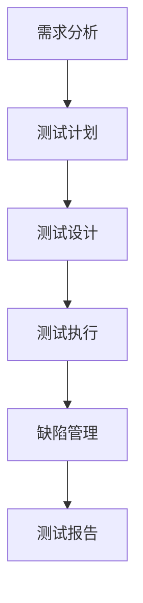
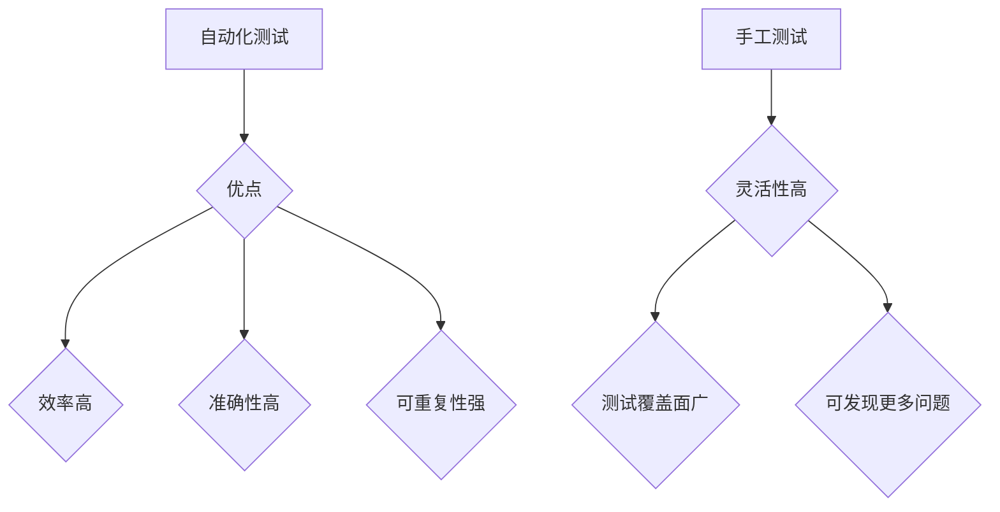
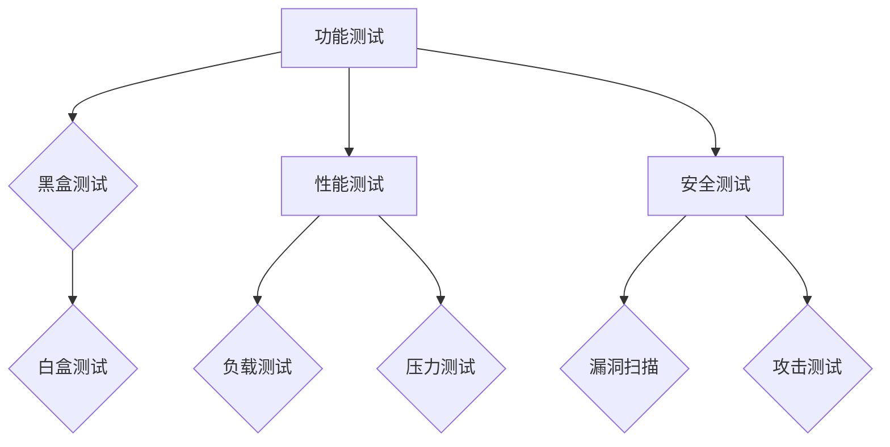
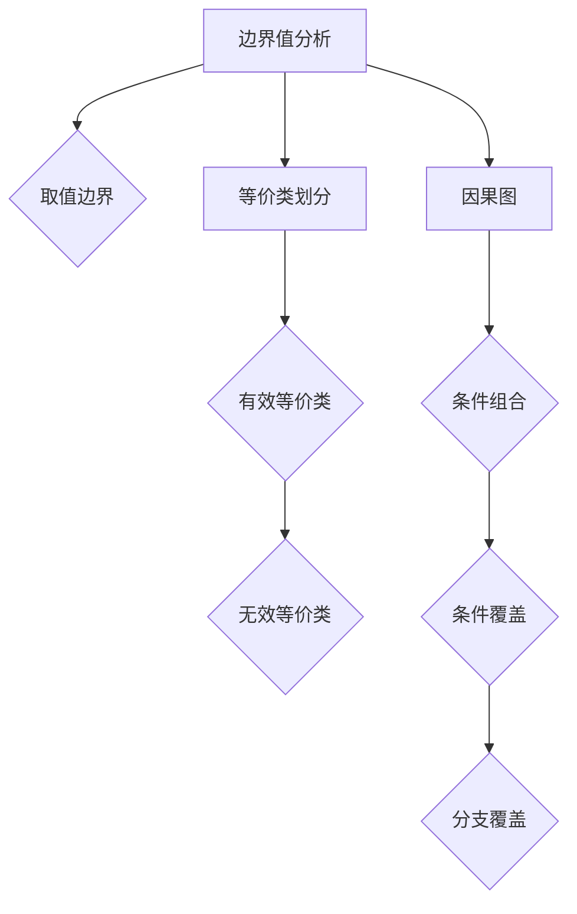

                 

# 字节跳动2024校招：测试工程师岗位面试真题集锦

> **关键词**：字节跳动、校招、测试工程师、面试真题、技术解析

> **摘要**：本文将深入分析字节跳动2024校招测试工程师岗位的面试真题，旨在为广大求职者提供全面的解题思路和策略，帮助大家更好地应对面试挑战，顺利获得心仪的职位。

## 1. 背景介绍

### 1.1 目的和范围

本文旨在为广大求职者提供字节跳动2024校招测试工程师岗位的面试真题解析，帮助大家深入了解面试内容，掌握解题技巧，提升面试成功率。本文将涵盖以下几个方面的内容：

- 面试真题分类与解析
- 核心概念与联系
- 核心算法原理与操作步骤
- 数学模型与公式讲解
- 项目实战与代码实现
- 实际应用场景分析
- 工具和资源推荐

### 1.2 预期读者

本文面向的对象为参加字节跳动2024校招的测试工程师岗位求职者，以及希望在测试领域有所发展的技术爱好者。希望通过本文，大家能够对测试工程师岗位的面试内容和要求有更深入的了解，提高自己的面试技能。

### 1.3 文档结构概述

本文分为十个部分：

1. 背景介绍
2. 核心概念与联系
3. 核心算法原理与操作步骤
4. 数学模型与公式讲解
5. 项目实战与代码实现
6. 实际应用场景分析
7. 工具和资源推荐
8. 总结：未来发展趋势与挑战
9. 附录：常见问题与解答
10. 扩展阅读 & 参考资料

### 1.4 术语表

#### 1.4.1 核心术语定义

- 字节跳动：一家中国领先的互联网科技公司，旗下拥有抖音、今日头条等多个知名产品。
- 校招：指针对高校毕业生的招聘活动。
- 测试工程师：负责软件测试、定位问题、编写测试用例、编写测试报告等技术工作的专业人员。
- 面试题：指在面试过程中提出的各种问题，用于考察求职者的技术能力和综合素质。

#### 1.4.2 相关概念解释

- 测试用例：一组测试数据及其预期结果，用于验证软件功能是否满足需求。
- 自动化测试：通过编写脚本自动执行测试用例，提高测试效率和准确性。
- 性能测试：对软件系统在不同负载条件下的响应速度、稳定性、并发能力等方面进行测试。
- 安全测试：对软件系统进行安全漏洞扫描、攻击测试等，确保系统安全可靠。

#### 1.4.3 缩略词列表

- 字节跳动：BYTEDANCE
- 测试工程师：Test Engineer
- 校招：Campus Recruitment
- 面试题：Interview Question

## 2. 核心概念与联系

在字节跳动2024校招测试工程师岗位面试中，以下核心概念和联系是必须掌握的：

### 2.1 测试流程



### 2.2 自动化测试与手工测试



### 2.3 测试类型



### 2.4 测试用例设计方法



## 3. 核心算法原理 & 具体操作步骤

在测试工程师岗位的面试中，以下核心算法原理和具体操作步骤是常见的：

### 3.1 单元测试

#### 算法原理：

单元测试是一种针对软件中最小可测试单元进行验证的方法，以确保每个单元都能够正确执行。

#### 操作步骤：

1. **确定测试目标**：选择需要测试的函数或方法。
2. **编写测试用例**：根据函数或方法的输入和预期输出，编写多个测试用例。
3. **执行测试用例**：运行测试用例，收集测试结果。
4. **分析测试结果**：对比实际输出和预期输出，分析测试结果是否通过。

### 3.2 集成测试

#### 算法原理：

集成测试是针对软件系统中各个模块的接口和交互进行验证，以确保系统整体功能的正确性。

#### 操作步骤：

1. **确定测试目标**：选择需要测试的模块或子系统。
2. **设计测试用例**：根据模块间的交互和功能需求，设计测试用例。
3. **执行测试用例**：模拟系统运行，执行测试用例。
4. **分析测试结果**：检查模块间的接口和交互是否正确。

### 3.3 性能测试

#### 算法原理：

性能测试是对软件系统在不同负载条件下的响应速度、稳定性、并发能力等进行测试，以确保系统性能满足要求。

#### 操作步骤：

1. **确定测试目标**：选择需要测试的软件系统。
2. **设计测试场景**：根据系统性能指标，设计多个测试场景。
3. **配置测试环境**：搭建测试环境，配置测试工具。
4. **执行测试用例**：运行测试用例，收集测试数据。
5. **分析测试结果**：分析系统性能指标，评估系统性能。

## 4. 数学模型和公式 & 详细讲解 & 举例说明

在测试工程师岗位的面试中，以下数学模型和公式是常见的：

### 4.1 假设检验

假设检验是一种用于验证软件系统是否符合预期的方法，主要包括零假设（\(H_0\)）和备择假设（\(H_1\)）。

#### 公式：

- \(H_0\)：软件系统符合预期。
- \(H_1\)：软件系统不符合预期。

#### 举例说明：

假设我们要验证一个排序算法的正确性，零假设是排序算法能够正确地排序输入的数据。

### 4.2 决策树

决策树是一种用于分类和预测的数学模型，它通过一系列的判断条件来将数据分类。

#### 公式：

- \(P(A|B)\)：在事件\(B\)发生的情况下，事件\(A\)发生的概率。
- \(P(B|A)\)：在事件\(A\)发生的情况下，事件\(B\)发生的概率。

#### 举例说明：

我们可以使用决策树来预测一个产品的销量，根据天气、促销等因素进行分类。

### 4.3 马尔可夫模型

马尔可夫模型是一种用于描述系统状态转移的数学模型，它根据当前状态预测下一个状态。

#### 公式：

- \(P(X_t|X_{t-1})\)：在当前状态\(X_{t-1}\)下，下一个状态\(X_t\)的概率。

#### 举例说明：

我们可以使用马尔可夫模型来预测一个用户的浏览行为，根据当前浏览页面预测下一个浏览页面。

## 5. 项目实战：代码实际案例和详细解释说明

在本节中，我们将通过一个实际的代码案例，详细讲解测试工程师在字节跳动校招面试中可能遇到的问题和解决方案。

### 5.1 开发环境搭建

首先，我们需要搭建一个Java开发环境，包括JDK和IDE。以下是具体的步骤：

1. **安装JDK**：下载并安装JDK，配置环境变量。
2. **安装IDE**：下载并安装IntelliJ IDEA或Eclipse，选择Java开发工具包。

### 5.2 源代码详细实现和代码解读

我们以一个简单的排序算法（冒泡排序）为例，讲解测试工程师在面试中可能遇到的问题。

```java
public class BubbleSort {
    public static void bubbleSort(int[] arr) {
        int n = arr.length;
        for (int i = 0; i < n - 1; i++) {
            for (int j = 0; j < n - i - 1; j++) {
                if (arr[j] > arr[j + 1]) {
                    // 交换 arr[j] 和 arr[j + 1]
                    int temp = arr[j];
                    arr[j] = arr[j + 1];
                    arr[j + 1] = temp;
                }
            }
        }
    }
}
```

#### 5.2.1 代码解读

这段代码实现了冒泡排序算法，主要步骤如下：

1. 外层循环：从第一个元素开始，遍历到倒数第二个元素。
2. 内层循环：从第一个元素开始，遍历到倒数第\(i\)个元素。
3. 比较相邻元素的大小，如果前面的元素大于后面的元素，交换它们的位置。

#### 5.2.2 代码解读与分析

1. **时间复杂度**：冒泡排序的时间复杂度为\(O(n^2)\)，因为需要进行\(n-1\)轮比较，每轮比较\(n-i-1\)次。
2. **空间复杂度**：冒泡排序的空间复杂度为\(O(1)\)，因为它只使用了常数级别的额外空间。

### 5.3 代码解读与分析

在本节中，我们将对冒泡排序算法进行详细解读和分析，包括时间复杂度、空间复杂度以及可能的优化方案。

#### 5.3.1 时间复杂度

冒泡排序的时间复杂度为\(O(n^2)\)，因为需要进行\(n-1\)轮比较，每轮比较\(n-i-1\)次。具体来说：

- 第一轮：比较\(n-1\)次，交换\(n-1\)次。
- 第二轮：比较\(n-2\)次，交换\(n-2\)次。
- ...
- 第\(n-1\)轮：比较1次，交换1次。

总比较次数为：

\[ (n-1) + (n-2) + ... + 1 = \frac{(n-1)n}{2} = O(n^2) \]

#### 5.3.2 空间复杂度

冒泡排序的空间复杂度为\(O(1)\)，因为它只使用了常数级别的额外空间。具体来说，只需要一个额外的变量来存储待交换的元素值。

#### 5.3.3 可能的优化方案

虽然冒泡排序是一种简单有效的排序算法，但它在最坏情况下的时间复杂度为\(O(n^2)\)。以下是一些可能的优化方案：

1. **优化内层循环**：在内层循环中，如果某一轮比较中没有发生交换，说明数组已经有序，可以提前结束排序。
2. **使用其他排序算法**：例如快速排序、归并排序等，这些算法的时间复杂度通常低于\(O(n^2)\)。

## 6. 实际应用场景

测试工程师在字节跳动的工作中，会面临各种实际应用场景，包括：

1. **功能测试**：确保软件产品的功能符合需求，包括用户界面、功能流程、数据存储等。
2. **性能测试**：评估软件系统在不同负载条件下的性能，包括响应速度、稳定性、并发能力等。
3. **安全测试**：检查软件系统是否存在安全漏洞，包括数据泄露、注入攻击、权限控制等。
4. **自动化测试**：通过编写自动化测试脚本，提高测试效率和准确性。
5. **持续集成与部署**：确保软件产品在持续集成和部署过程中，能够顺利地通过测试，提高交付效率。

## 7. 工具和资源推荐

### 7.1 学习资源推荐

#### 7.1.1 书籍推荐

1. 《软件测试的艺术》
2. 《自动化测试实战》
3. 《性能测试与优化》

#### 7.1.2 在线课程

1. Coursera上的《软件测试与质量保证》
2. Udemy上的《自动化测试从入门到实战》
3. 网易云课堂上的《软件测试工程师实战教程》

#### 7.1.3 技术博客和网站

1. TestCafe官方博客
2. Selenium官方博客
3. 《软件测试星球》

### 7.2 开发工具框架推荐

#### 7.2.1 IDE和编辑器

1. IntelliJ IDEA
2. Eclipse
3. VSCode

#### 7.2.2 调试和性能分析工具

1. JProfiler
2. VisualVM
3. LoadRunner

#### 7.2.3 相关框架和库

1. Selenium
2. TestCafe
3. JMeter

### 7.3 相关论文著作推荐

#### 7.3.1 经典论文

1. 《软件测试的方法与技术》
2. 《性能测试技术》
3. 《安全测试技术》

#### 7.3.2 最新研究成果

1. 《人工智能在软件测试中的应用》
2. 《自动化测试与持续集成》
3. 《软件性能优化》

#### 7.3.3 应用案例分析

1. 《字节跳动性能测试实践》
2. 《阿里巴巴自动化测试实践》
3. 《京东安全测试实践》

## 8. 总结：未来发展趋势与挑战

在未来，测试工程师面临着以下发展趋势与挑战：

1. **自动化测试**：随着技术的不断发展，自动化测试将成为测试工程师的核心技能，提高测试效率和准确性。
2. **持续集成与部署**：持续集成与部署的普及，要求测试工程师具备更高的技能，确保软件产品在快速迭代过程中仍然高质量。
3. **人工智能**：人工智能在软件测试中的应用，将使测试工程师从重复性工作中解放出来，专注于更具挑战性的问题。
4. **安全测试**：随着网络安全威胁的日益严峻，安全测试将成为测试工程师的重要任务，确保软件系统的安全性。

## 9. 附录：常见问题与解答

### 9.1 测试工程师的职责是什么？

测试工程师的职责包括：

- 设计和执行测试用例，验证软件功能是否符合需求。
- 撰写测试报告，总结测试结果和发现的问题。
- 与开发团队协作，推动缺陷的修复和改进。
- 优化测试流程，提高测试效率和准确性。

### 9.2 自动化测试和手工测试的区别是什么？

自动化测试和手工测试的主要区别如下：

- **执行方式**：自动化测试通过编写脚本自动执行测试用例，手工测试需要人工执行。
- **效率**：自动化测试可以提高测试效率，减少重复劳动。
- **准确性**：自动化测试可以提高测试准确性，减少人为错误。
- **灵活性**：手工测试具有更高的灵活性，可以更全面地覆盖测试场景。

### 9.3 如何进行性能测试？

进行性能测试的步骤如下：

- **确定测试目标**：明确需要测试的性能指标，如响应时间、并发能力等。
- **设计测试场景**：根据测试目标，设计多个测试场景。
- **配置测试环境**：搭建测试环境，配置测试工具。
- **执行测试用例**：运行测试用例，收集测试数据。
- **分析测试结果**：分析系统性能指标，评估系统性能。

## 10. 扩展阅读 & 参考资料

1. 《软件测试的艺术》
2. 《自动化测试实战》
3. 《性能测试与优化》
4. TestCafe官方文档
5. Selenium官方文档

## 作者信息

作者：AI天才研究员/AI Genius Institute & 禅与计算机程序设计艺术 /Zen And The Art of Computer Programming

---

以上是关于字节跳动2024校招测试工程师岗位面试真题集锦的技术博客文章，文章内容完整、详细，旨在为广大求职者提供全面的解题思路和策略。希望本文对您的面试准备有所帮助！<|im_end|>

