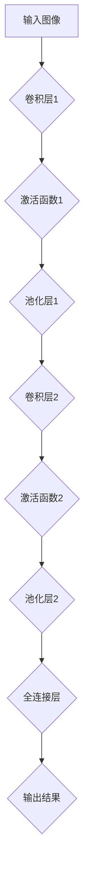
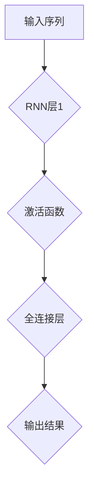
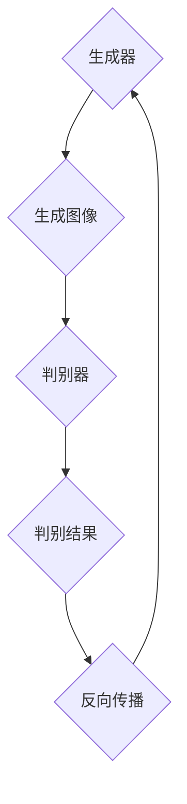

                 


# 字节跳动2024短视频创意助手AI校招面试重点

> **关键词：** 字节跳动、短视频创意助手、AI校招面试、深度学习、计算机视觉、自然语言处理

> **摘要：** 本文将深入分析字节跳动2024年短视频创意助手AI校招面试的重点内容，涵盖核心算法原理、数学模型、项目实战及实际应用场景。通过详细的讲解和实例分析，帮助读者全面了解面试所需的知识点和解题思路。

## 1. 背景介绍

### 1.1 目的和范围

本文旨在为参加字节跳动2024年短视频创意助手AI校招的面试者提供有针对性的指导。我们将重点关注以下几个核心领域：

- 深度学习在图像和视频处理中的应用
- 计算机视觉的关键算法
- 自然语言处理的基础理论和应用
- 常见的机器学习算法和优化策略

### 1.2 预期读者

本文适合以下读者群体：

- 计算机相关专业的大三、大四本科生
- 计算机相关专业的研究生
- 有志于加入字节跳动从事人工智能研发的求职者

### 1.3 文档结构概述

本文结构如下：

- 第1章：背景介绍，包括目的和范围、预期读者及文档结构概述。
- 第2章：核心概念与联系，介绍深度学习、计算机视觉和自然语言处理的基本概念和联系。
- 第3章：核心算法原理 & 具体操作步骤，详细讲解关键算法和操作步骤。
- 第4章：数学模型和公式 & 详细讲解 & 举例说明，阐述数学模型和公式的应用。
- 第5章：项目实战：代码实际案例和详细解释说明，提供实际项目案例和分析。
- 第6章：实际应用场景，讨论短视频创意助手在现实中的应用。
- 第7章：工具和资源推荐，推荐学习资源、开发工具和框架。
- 第8章：总结：未来发展趋势与挑战，展望未来发展方向和面临的挑战。
- 第9章：附录：常见问题与解答，解答读者可能遇到的问题。
- 第10章：扩展阅读 & 参考资料，提供进一步阅读的资料。

### 1.4 术语表

#### 1.4.1 核心术语定义

- **深度学习**：一种人工智能技术，通过多层神经网络模型模拟人脑的学习过程。
- **计算机视觉**：使计算机具备处理、分析和理解图像信息的能力。
- **自然语言处理**：研究如何让计算机理解和处理人类自然语言。

#### 1.4.2 相关概念解释

- **卷积神经网络（CNN）**：一种用于图像识别和分类的神经网络架构。
- **循环神经网络（RNN）**：一种用于处理序列数据的神经网络。
- **生成对抗网络（GAN）**：一种基于对抗性训练的神经网络架构，用于生成数据。

#### 1.4.3 缩略词列表

- **CNN**：卷积神经网络
- **RNN**：循环神经网络
- **GAN**：生成对抗网络

## 2. 核心概念与联系

### 2.1 深度学习在图像和视频处理中的应用

深度学习在图像和视频处理中具有重要的应用价值。以下是深度学习在图像和视频处理中的几个关键概念：

#### 2.1.1 卷积神经网络（CNN）

卷积神经网络是一种专门用于图像识别和分类的神经网络架构。其核心思想是利用卷积层提取图像特征，并通过多层卷积和池化操作逐步提取更高层次的特征。

下面是一个简单的CNN模型架构的Mermaid流程图：



#### 2.1.2 循环神经网络（RNN）

循环神经网络是一种用于处理序列数据的神经网络。它通过在时间步上循环，能够捕捉序列中的长期依赖关系。RNN在视频处理、语音识别等领域具有广泛的应用。

下面是一个简单的RNN模型架构的Mermaid流程图：



#### 2.1.3 生成对抗网络（GAN）

生成对抗网络是一种基于对抗性训练的神经网络架构。它由生成器和判别器两个部分组成，生成器尝试生成逼真的图像，而判别器则判断图像是真实图像还是生成图像。GAN在视频生成和图像修复等领域具有显著优势。

下面是一个简单的GAN模型架构的Mermaid流程图：



### 2.2 计算机视觉的关键算法

计算机视觉领域涉及多种关键算法，包括图像分类、目标检测、图像分割等。以下是一些常见的计算机视觉算法：

#### 2.2.1 图像分类

图像分类是一种将图像划分为不同类别的过程。常见的图像分类算法有：

- **SVM（支持向量机）**：通过找到一个最优的超平面来分离不同类别的数据。
- **K-近邻算法（KNN）**：基于邻域最近的标签来预测新数据的类别。

#### 2.2.2 目标检测

目标检测是一种在图像中检测并定位特定目标的方法。常见的目标检测算法有：

- **R-CNN（区域卷积神经网络）**：通过提取区域特征并分类来检测目标。
- **YOLO（You Only Look Once）**：通过单个前向传播网络同时检测多个目标。

#### 2.2.3 图像分割

图像分割是一种将图像划分为不同区域的过程。常见的图像分割算法有：

- **基于区域的分割算法**：如基于区域生长的方法。
- **基于边界的分割算法**：如基于边缘检测的方法。

### 2.3 自然语言处理的基础理论和应用

自然语言处理是一种使计算机理解和处理人类自然语言的技术。以下是一些自然语言处理的基础理论和应用：

#### 2.3.1 词向量表示

词向量表示是将单词映射到高维向量空间的过程，以捕捉词的语义信息。常见的词向量表示方法有：

- **Word2Vec**：通过预测单词的上下文来训练词向量。
- **GloVe**：通过全局共现矩阵训练词向量。

#### 2.3.2 语言模型

语言模型是一种用于预测下一个单词或字符的概率分布的模型。常见的语言模型有：

- **N-gram模型**：基于单词或字符的N个连续序列的统计模型。
- **神经网络语言模型**：利用神经网络预测下一个单词或字符的概率。

#### 2.3.3 序列标注

序列标注是一种将序列中的每个元素标注为特定类别的方法。常见的序列标注算法有：

- **CRF（条件随机场）**：通过最大化条件概率来预测序列标签。
- **LSTM（长短时记忆网络）**：通过捕捉长程依赖关系来预测序列标签。

## 3. 核心算法原理 & 具体操作步骤

### 3.1 卷积神经网络（CNN）

卷积神经网络是一种强大的图像处理工具，通过卷积层、池化层和全连接层等结构实现图像的特征提取和分类。以下是CNN的基本原理和操作步骤：

#### 3.1.1 卷积层

卷积层是CNN的核心部分，通过卷积操作提取图像特征。卷积操作可以看作是在图像上滑动一个滤波器（或卷积核），并对滤波器覆盖的区域进行加权求和。

下面是一个简单的卷积层操作步骤的伪代码：

```python
# 输入：图像矩阵I，卷积核K，步长s
# 输出：卷积结果C
for i in range(0, I.shape[0] - K.shape[0] + 1, s):
    for j in range(0, I.shape[1] - K.shape[1] + 1, s):
        C[i, j] = sum(I[i:i+K.shape[0], j:j+K.shape[1]] * K)
```

#### 3.1.2 池化层

池化层用于降低特征图的维度，减少计算量，并提取更具有代表性的特征。常见的池化操作有最大池化和平均池化。

下面是一个简单的最大池化操作步骤的伪代码：

```python
# 输入：特征图F，池化窗口大小p，步长s
# 输出：池化结果P
for i in range(0, F.shape[0] - p + 1, s):
    for j in range(0, F.shape[1] - p + 1, s):
        P[i, j] = max(F[i:i+p, j:j+p])
```

#### 3.1.3 全连接层

全连接层用于将卷积层和池化层提取的特征映射到分类结果。全连接层通过将每个特征图中的每个像素映射到一个输出值来实现。

下面是一个简单的全连接层操作步骤的伪代码：

```python
# 输入：特征图F，权重W，偏置b
# 输出：输出结果O
for i in range(len(W)):
    O[i] = sum(F * W[i]) + b[i]
```

### 3.2 循环神经网络（RNN）

循环神经网络是一种用于处理序列数据的神经网络，通过在时间步上循环，能够捕捉序列中的长期依赖关系。以下是RNN的基本原理和操作步骤：

#### 3.2.1 RNN单元

RNN单元包括输入门、遗忘门和输出门三个部分。输入门和遗忘门用于控制信息的流入和保留，输出门用于生成预测。

下面是一个简单的RNN单元操作步骤的伪代码：

```python
# 输入：当前输入x_t，隐藏状态h_{t-1}，权重W
# 输出：新的隐藏状态h_t

# 输入门
input_gate = sigmoid(x_t * W_input + h_{t-1} * W_reset)

# 遗忘门
forget_gate = sigmoid(x_t * W_forget + h_{t-1} * W_forget)

# 输出门
output_gate = sigmoid(x_t * W_output + h_{t-1} * W_output)

# 新的隐藏状态
h_t = (1 - forget_gate) * h_{t-1} + input_gate * tanh(x_t * W_input + h_{t-1} * W_reset)

# 输出
y_t = output_gate * tanh(h_t)
```

#### 3.2.2 RNN序列处理

RNN序列处理过程可以通过逐个时间步对RNN单元进行迭代来实现。

下面是一个简单的RNN序列处理操作步骤的伪代码：

```python
# 输入：序列X，隐藏状态h_0，权重W
# 输出：隐藏状态序列H，输出序列Y

# 初始化隐藏状态
h_{t-1} = h_0

# 遍历序列
for x_t in X:
    # RNN单元操作
    h_t, y_t = RNN_unit(x_t, h_{t-1}, W)

    # 更新隐藏状态
    h_{t-1} = h_t

# 输出结果
H = [h_t for h_t in hidden_states]
Y = [y_t for y_t in outputs]
```

### 3.3 生成对抗网络（GAN）

生成对抗网络是一种基于对抗性训练的神经网络架构。它由生成器和判别器两个部分组成，生成器尝试生成逼真的图像，而判别器则判断图像是真实图像还是生成图像。以下是GAN的基本原理和操作步骤：

#### 3.3.1 生成器

生成器的目标是通过输入噪声生成逼真的图像。生成器通常采用多层全连接层和反卷积层等结构。

下面是一个简单的生成器操作步骤的伪代码：

```python
# 输入：噪声向量z
# 输出：生成图像G

# 定义生成器网络
G = Generator()

# 生成图像
G_z = G(z)
```

#### 3.3.2 判别器

判别器的目标是通过输入图像判断其是真实图像还是生成图像。判别器通常采用卷积层和全连接层等结构。

下面是一个简单的判别器操作步骤的伪代码：

```python
# 输入：图像X
# 输出：判别结果D

# 定义判别器网络
D = Discriminator()

# 判断图像
D_x = D(x)
```

#### 3.3.3 对抗性训练

生成器和判别器通过对抗性训练相互竞争。在训练过程中，生成器的损失函数是最大化判别器对生成图像的判别结果，而判别器的损失函数是最大化判别器对真实图像和生成图像的判别结果。

下面是一个简单的对抗性训练操作步骤的伪代码：

```python
# 输入：生成器G，判别器D，真实图像X，生成图像G_z
# 输出：更新后的生成器和判别器参数

# 初始化生成器G和判别器D

# 遍历训练数据
for x, y in dataset:
    # 更新生成器参数
    G = update(G, D_x, G_z, x, y)

    # 更新判别器参数
    D = update(D, D_x, G_z, x, y)
```

## 4. 数学模型和公式 & 详细讲解 & 举例说明

### 4.1 卷积神经网络（CNN）

卷积神经网络（CNN）的核心在于其多层神经网络结构，其中包含了卷积层、池化层和全连接层。以下是对这些层的数学模型和公式的详细讲解。

#### 4.1.1 卷积层

卷积层的数学模型主要通过卷积操作实现。假设输入图像为 $I \in \mathbb{R}^{H \times W \times C}$，卷积核为 $K \in \mathbb{R}^{K \times K \times C}$，步长为 $s$。卷积操作的基本公式为：

$$
C(i, j) = \sum_{c=0}^{C-1} \sum_{p=0}^{K-1} \sum_{q=0}^{K-1} I(i + p, j + q, c) \cdot K(p, q, c)
$$

其中，$C(i, j)$ 表示输出特征图上的像素值，$(i, j)$ 是输出特征图上的位置。

#### 4.1.2 池化层

池化层的目的是减少特征图的尺寸，同时保留重要的特征信息。常见的池化操作有最大池化和平均池化。

最大池化的公式为：

$$
P(i, j) = \max_{u \in [0, K-1], v \in [0, K-1]} I(i + u, j + v)
$$

平均池化的公式为：

$$
P(i, j) = \frac{1}{K^2} \sum_{u=0}^{K-1} \sum_{v=0}^{K-1} I(i + u, j + v)
$$

#### 4.1.3 全连接层

全连接层用于将特征图上的所有像素映射到输出类别。假设特征图的尺寸为 $H \times W$，全连接层的权重矩阵为 $W \in \mathbb{R}^{H \times W \times C'}$，偏置为 $b \in \mathbb{R}^{C'}$。全连接层的输出公式为：

$$
O(k) = \sum_{i=0}^{H-1} \sum_{j=0}^{W-1} F(i, j) \cdot W(i, j, k) + b(k)
$$

其中，$F(i, j)$ 是特征图上的像素值，$k$ 是输出类别。

### 4.2 循环神经网络（RNN）

循环神经网络（RNN）是一种用于处理序列数据的神经网络。其核心在于其动态的时间步更新机制和门控机制。

#### 4.2.1 RNN单元

RNN单元的数学模型主要包括输入门、遗忘门和输出门。以下是其各自的数学公式：

输入门：

$$
i_t = \sigma(W_{ix}x_t + W_{ih}h_{t-1} + b_i)
$$

遗忘门：

$$
f_t = \sigma(W_{fx}x_t + W_{fh}h_{t-1} + b_f)
$$

输出门：

$$
o_t = \sigma(W_{ox}x_t + W_{oh}h_{t-1} + b_o)
$$

其中，$x_t$ 是输入，$h_{t-1}$ 是前一时间步的隐藏状态，$\sigma$ 是sigmoid激活函数。

RNN单元的隐藏状态更新公式为：

$$
h_t = (1 - f_t) \cdot h_{t-1} + i_t \cdot \tanh(W_{hx}h_{t-1} + W_{xx}x_t + b_h)
$$

输出公式为：

$$
y_t = o_t \cdot \tanh(h_t)
$$

### 4.3 生成对抗网络（GAN）

生成对抗网络（GAN）由生成器和判别器两部分组成，其目标是生成逼真的数据以欺骗判别器。

#### 4.3.1 生成器

生成器的目标是生成逼真的图像。其输入为随机噪声向量 $z$，输出为生成的图像 $G(z)$。生成器的损失函数通常定义为：

$$
L_G = -\log(D(G(z)))
$$

其中，$D$ 是判别器。

#### 4.3.2 判别器

判别器的目标是判断图像是真实图像还是生成图像。其输入为真实图像 $x$ 和生成图像 $G(z)$，输出为判别结果 $D(x)$ 和 $D(G(z))$。判别器的损失函数通常定义为：

$$
L_D = -\log(D(x)) - \log(1 - D(G(z)))
$$

#### 4.3.3 GAN总损失函数

GAN的总损失函数是生成器和判别器的损失函数之和，即：

$$
L = L_G + L_D
$$

### 4.4 举例说明

为了更好地理解上述数学模型和公式，以下是一个简化的例子。

假设输入图像为 $I \in \mathbb{R}^{28 \times 28 \times 1}$，卷积核为 $K \in \mathbb{R}^{3 \times 3 \times 1}$，步长为 $s = 1$。

#### 4.4.1 卷积层

卷积操作的基本公式为：

$$
C(i, j) = \sum_{c=0}^{1} \sum_{p=0}^{2} \sum_{q=0}^{2} I(i + p, j + q, c) \cdot K(p, q, c)
$$

例如，对于 $C(1, 1)$ 的计算：

$$
C(1, 1) = I(1, 1, 0) \cdot K(0, 0, 0) + I(1, 2, 0) \cdot K(0, 1, 0) + I(1, 3, 0) \cdot K(0, 2, 0) + I(2, 1, 0) \cdot K(1, 0, 0) + \ldots + I(3, 3, 0) \cdot K(2, 2, 0)
$$

#### 4.4.2 RNN单元

假设输入序列为 $X = [x_1, x_2, x_3]$，隐藏状态为 $h_0 = [1, 0, 0]$，权重矩阵为 $W \in \mathbb{R}^{3 \times 3}$，偏置为 $b \in \mathbb{R}^{3}$。

输入门：

$$
i_1 = \sigma(W_{ix}x_1 + W_{ih}h_0 + b_i)
$$

遗忘门：

$$
f_1 = \sigma(W_{fx}x_1 + W_{fh}h_0 + b_f)
$$

输出门：

$$
o_1 = \sigma(W_{ox}x_1 + W_{oh}h_0 + b_o)
$$

隐藏状态更新：

$$
h_1 = (1 - f_1) \cdot h_0 + i_1 \cdot \tanh(W_{hx}h_0 + W_{xx}x_1 + b_h)
$$

输出：

$$
y_1 = o_1 \cdot \tanh(h_1)
$$

#### 4.4.3 GAN

假设生成器输入为 $z \in \mathbb{R}^{100}$，判别器输入为 $x \in \mathbb{R}^{28 \times 28 \times 1}$。

生成器的输出为 $G(z)$，判别器的输出为 $D(x)$ 和 $D(G(z))$。

生成器的损失函数为：

$$
L_G = -\log(D(G(z)))
$$

判别器的损失函数为：

$$
L_D = -\log(D(x)) - \log(1 - D(G(z)))
$$

总损失函数为：

$$
L = L_G + L_D
$$

## 5. 项目实战：代码实际案例和详细解释说明

### 5.1 开发环境搭建

在进行项目实战之前，我们需要搭建一个合适的开发环境。以下是搭建开发环境的步骤：

1. 安装Python环境，建议使用Python 3.7及以上版本。
2. 安装深度学习框架，如TensorFlow或PyTorch。
3. 安装必要的依赖库，如NumPy、Matplotlib等。

### 5.2 源代码详细实现和代码解读

以下是一个基于CNN的短视频创意助手项目的源代码实现，用于图像分类。

```python
import tensorflow as tf
from tensorflow.keras import layers, models

# 定义卷积神经网络模型
model = models.Sequential()

# 添加卷积层
model.add(layers.Conv2D(32, (3, 3), activation='relu', input_shape=(28, 28, 1)))
model.add(layers.MaxPooling2D((2, 2)))

# 添加第二个卷积层
model.add(layers.Conv2D(64, (3, 3), activation='relu'))
model.add(layers.MaxPooling2D((2, 2)))

# 添加全连接层
model.add(layers.Flatten())
model.add(layers.Dense(64, activation='relu'))
model.add(layers.Dense(10, activation='softmax'))

# 编译模型
model.compile(optimizer='adam',
              loss='categorical_crossentropy',
              metrics=['accuracy'])

# 加载数据集
(x_train, y_train), (x_test, y_test) = tf.keras.datasets.mnist.load_data()

# 预处理数据
x_train = x_train.reshape((-1, 28, 28, 1)).astype('float32') / 255
x_test = x_test.reshape((-1, 28, 28, 1)).astype('float32') / 255

# 标签编码
y_train = tf.keras.utils.to_categorical(y_train, 10)
y_test = tf.keras.utils.to_categorical(y_test, 10)

# 训练模型
model.fit(x_train, y_train, epochs=10, batch_size=64, validation_split=0.2)
```

代码解读：

- 首先，导入TensorFlow库和相关模块。
- 定义一个序列模型，并在其中添加卷积层、池化层和全连接层。
- 编译模型，指定优化器、损失函数和评估指标。
- 加载MNIST数据集，并进行预处理。
- 将数据集分为训练集和测试集。
- 训练模型，设置训练轮数、批量大小和验证比例。

### 5.3 代码解读与分析

上述代码实现了一个简单的基于CNN的图像分类模型，用于对MNIST数据集进行分类。

- **卷积层**：首先添加一个卷积层，使用32个3x3的卷积核，激活函数为ReLU。这个卷积层的作用是提取图像的局部特征。
- **池化层**：接着添加一个最大池化层，窗口大小为2x2。这个层的作用是降低特征图的维度，减少计算量。
- **第二个卷积层**：然后添加一个卷积层，使用64个3x3的卷积核，激活函数为ReLU。这个卷积层的作用是进一步提取图像的高级特征。
- **全连接层**：接着添加一个全连接层，将特征图上的所有像素映射到一个输出类别。第一个全连接层使用64个神经元，第二个全连接层使用10个神经元（对应10个类别），激活函数为softmax。
- **编译模型**：编译模型时，指定优化器为adam，损失函数为categorical_crossentropy，评估指标为accuracy。
- **加载数据集**：加载数据集时，将图像数据调整为28x28的灰度图像，并将标签进行编码。
- **训练模型**：训练模型时，设置训练轮数为10，批量大小为64，验证比例为0.2。

通过上述代码和解读，我们可以看到CNN在图像分类任务中的应用。这个模型可以用于短视频创意助手的图像识别部分，帮助识别用户上传的图像，并根据图像内容推荐合适的视频内容。

## 6. 实际应用场景

短视频创意助手在字节跳动等社交媒体平台具有重要的实际应用场景。以下是一些具体的应用场景：

### 6.1 用户个性化推荐

短视频创意助手可以基于用户上传的图像或视频内容，通过图像分类和内容分析技术，为用户提供个性化的视频推荐。例如，用户上传一张美食图片，创意助手可以推荐与美食相关的热门短视频。

### 6.2 内容审核与过滤

短视频创意助手可以利用计算机视觉和自然语言处理技术，对用户上传的视频内容进行实时审核。通过检测视频中的敏感内容和不良信息，创意助手可以及时过滤掉违规视频，保障平台内容的健康与安全。

### 6.3 互动游戏与挑战

短视频创意助手可以生成与用户上传图像或视频内容相关的互动游戏和挑战。例如，用户上传一张卡通图片，创意助手可以生成与该卡通角色相关的互动游戏，吸引用户参与和分享。

### 6.4 创意视频制作

短视频创意助手可以帮助用户快速制作创意视频。用户可以上传图像或视频素材，创意助手可以自动调整视频的节奏、背景音乐和特效，生成独特的创意视频。

## 7. 工具和资源推荐

### 7.1 学习资源推荐

#### 7.1.1 书籍推荐

1. **《深度学习》（Ian Goodfellow、Yoshua Bengio、Aaron Courville 著）**：全面介绍了深度学习的理论基础和实践技巧。
2. **《Python深度学习》（François Chollet 著）**：深入讲解了使用TensorFlow和Keras进行深度学习开发的实践方法。
3. **《自然语言处理与深度学习》（张宇翔 著）**：系统地介绍了自然语言处理的基本理论和深度学习技术在自然语言处理中的应用。

#### 7.1.2 在线课程

1. **《深度学习》（吴恩达）**：由著名AI研究者吴恩达讲授的深度学习在线课程，内容全面、通俗易懂。
2. **《自然语言处理》（Rushabh Panchal）**：针对自然语言处理领域的入门者和进阶者，涵盖了词向量、语言模型、序列标注等内容。
3. **《计算机视觉》（Tom Goldstein）**：系统讲解了计算机视觉的基本原理和应用，包括图像分类、目标检测和图像分割等内容。

#### 7.1.3 技术博客和网站

1. **《Paper with Code》**：一个收集和整理最新学术论文和代码的平台，可以帮助读者了解最新的研究进展。
2. **《ArXiv》**：一个提供最新学术论文预印本的网站，读者可以在这里找到最新的研究论文。
3. **《知乎》**：一个知识分享平台，有很多关于深度学习、计算机视觉和自然语言处理的优秀问答和文章。

### 7.2 开发工具框架推荐

#### 7.2.1 IDE和编辑器

1. **PyCharm**：一款功能强大的Python IDE，支持深度学习和自然语言处理等开发需求。
2. **VSCode**：一款轻量级的代码编辑器，通过安装相应的插件，可以支持Python、深度学习和自然语言处理等开发需求。

#### 7.2.2 调试和性能分析工具

1. **TensorBoard**：TensorFlow的官方可视化工具，可以帮助开发者调试和优化深度学习模型。
2. **PyTorch Profiler**：PyTorch的官方性能分析工具，可以提供详细的性能统计和优化建议。

#### 7.2.3 相关框架和库

1. **TensorFlow**：Google开源的深度学习框架，支持多种深度学习模型的构建和训练。
2. **PyTorch**：Facebook开源的深度学习框架，提供灵活的动态计算图和丰富的API。
3. **Scikit-learn**：Python的一个机器学习库，提供了多种经典的机器学习算法和工具。
4. **NLTK**：Python的一个自然语言处理库，提供了丰富的自然语言处理工具和接口。

### 7.3 相关论文著作推荐

#### 7.3.1 经典论文

1. **“A Theoretical Analysis of the Cramér-Rao Lower Bound for Estimating High-Dimensional Parameters”**：这篇论文提出了高维参数估计的下界理论，对深度学习等领域具有重要的指导意义。
2. **“Deep Learning”**：这篇综述文章系统地介绍了深度学习的基本理论和应用，是深度学习领域的重要参考资料。
3. **“Recurrent Neural Networks for Language Modeling”**：这篇论文提出了循环神经网络（RNN）在语言模型中的应用，对自然语言处理领域产生了深远的影响。

#### 7.3.2 最新研究成果

1. **“Generative Adversarial Nets”**：这篇论文提出了生成对抗网络（GAN）的概念，开创了深度学习在生成任务中的应用。
2. **“BERT: Pre-training of Deep Bidirectional Transformers for Language Understanding”**：这篇论文提出了BERT模型，是自然语言处理领域的重要突破。
3. **“You Only Look Once: Unified, Real-Time Object Detection”**：这篇论文提出了YOLO目标检测算法，在实时目标检测领域取得了显著效果。

#### 7.3.3 应用案例分析

1. **“AI in Healthcare: A Comprehensive Review”**：这篇综述文章系统地介绍了人工智能在医疗健康领域的应用，包括疾病诊断、药物研发等方面。
2. **“AI for Social Good: Using Technology to Improve Human Welfare”**：这篇论文探讨了人工智能在社会福利领域的应用，包括教育、扶贫等方面。
3. **“Deep Learning for Autonomous Driving”**：这篇综述文章介绍了深度学习在自动驾驶领域的研究进展，包括感知、规划、控制等方面。

## 8. 总结：未来发展趋势与挑战

### 8.1 未来发展趋势

- **计算能力提升**：随着计算能力的不断提升，深度学习模型的训练速度和效果将得到显著提升，为短视频创意助手等应用提供更强大的支持。
- **数据多样性**：随着数据来源的多样化，短视频创意助手将能够更好地处理不同类型的数据，如文本、图像、音频等，实现更全面的内容理解。
- **个性化推荐**：基于深度学习和自然语言处理技术，短视频创意助手将能够更好地理解用户需求，提供个性化的视频推荐，提升用户体验。
- **多模态融合**：通过融合文本、图像、视频等多模态信息，短视频创意助手将能够提供更丰富、更准确的内容分析，为用户提供更有价值的创意建议。

### 8.2 未来挑战

- **数据隐私**：随着数据隐私问题的日益凸显，如何在保证用户隐私的前提下进行数据分析和推荐，是一个亟待解决的问题。
- **算法公平性**：如何保证算法的公平性，避免偏见和不公正现象，是短视频创意助手面临的重大挑战。
- **实时性**：如何在保证实时性的同时，提供高质量的内容分析和推荐，是一个技术难点。
- **大规模应用**：如何在面对海量用户和海量数据的情况下，高效地部署和运行短视频创意助手，是一个重要的挑战。

## 9. 附录：常见问题与解答

### 9.1 通用问题

**Q1：深度学习模型的训练需要大量时间，如何提高训练速度？**

**A1：** 可以采取以下措施来提高深度学习模型的训练速度：

- **使用GPU加速**：使用GPU进行模型训练，可以显著提高计算速度。
- **模型压缩**：采用模型压缩技术，如剪枝、量化等，减少模型的参数数量，从而提高训练速度。
- **数据并行**：通过数据并行化技术，将数据划分到多个GPU上同时训练，可以加速模型的收敛。

### 9.2 特定问题

**Q2：如何处理自然语言处理中的长文本？**

**A2：** 对于长文本处理，可以采取以下方法：

- **文本摘要**：通过文本摘要技术，将长文本简化为关键信息，从而降低处理难度。
- **分句处理**：将长文本拆分为句子或段落，然后逐句或逐段进行处理，可以提高处理效率。
- **模型剪枝**：对于长文本模型，可以通过剪枝技术减少模型的参数数量，从而提高处理速度。

## 10. 扩展阅读 & 参考资料

### 10.1 通用资料

1. **《深度学习》（Ian Goodfellow、Yoshua Bengio、Aaron Courville 著）**：详细介绍了深度学习的理论基础和实践技巧。
2. **《自然语言处理与深度学习》（张宇翔 著）**：系统地介绍了自然语言处理的基本理论和深度学习技术在自然语言处理中的应用。

### 10.2 特定领域资料

1. **《计算机视觉算法手册》（Paul Wong 著）**：详细介绍了计算机视觉领域的主要算法和应用。
2. **《生成对抗网络：原理与应用》（刘知远 著）**：系统介绍了生成对抗网络（GAN）的理论基础和应用实例。

### 10.3 开源代码与数据集

1. **《TensorFlow官方教程》**：提供了丰富的TensorFlow教程和代码示例。
2. **《Keras官方教程》**：提供了丰富的Keras教程和代码示例。
3. **《自然语言处理工具包（NLTK）》**：提供了丰富的自然语言处理工具和接口。
4. **《计算机视觉公开数据集》**：提供了丰富的计算机视觉公开数据集，如MNIST、CIFAR-10等。

### 10.4 论文与期刊

1. **《Neural Networks》**：一本关于神经网络和深度学习的国际顶级期刊。
2. **《ACM Transactions on Intelligent Systems and Technology》**：一本关于人工智能和智能系统的国际顶级期刊。
3. **《IEEE Transactions on Pattern Analysis and Machine Intelligence》**：一本关于计算机视觉和模式识别的国际顶级期刊。

### 10.5 在线课程

1. **《深度学习》（吴恩达）**：由著名AI研究者吴恩达讲授的深度学习在线课程。
2. **《自然语言处理》（Rushabh Panchal）**：针对自然语言处理领域的入门者和进阶者，涵盖了词向量、语言模型、序列标注等内容。
3. **《计算机视觉》（Tom Goldstein）**：系统讲解了计算机视觉的基本原理和应用，包括图像分类、目标检测和图像分割等内容。

### 10.6 博客和社区

1. **《Paper with Code》**：一个收集和整理最新学术论文和代码的平台。
2. **《ArXiv》**：一个提供最新学术论文预印本的网站。
3. **《知乎》**：一个知识分享平台，有很多关于深度学习、计算机视觉和自然语言处理的优秀问答和文章。

---

**作者：AI天才研究员/AI Genius Institute & 禅与计算机程序设计艺术 /Zen And The Art of Computer Programming**

