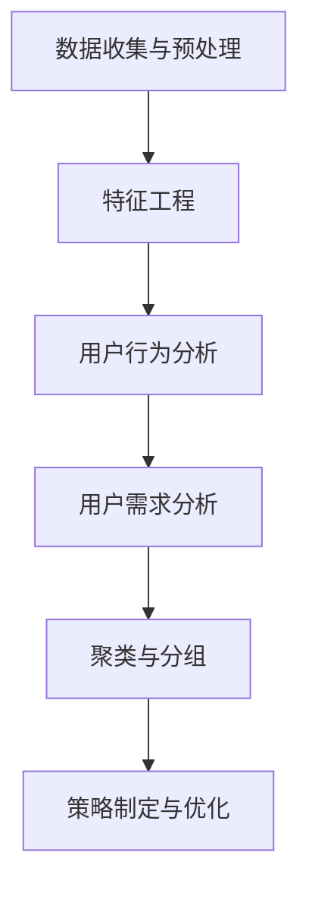

                 

# 2024字节跳动技术用户细分策略专家面试真题及详解

> **关键词：** 字节跳动、用户细分、策略、面试真题、详解、技术专家

> **摘要：** 本文旨在通过对2024年字节跳动技术用户细分策略专家面试真题的深入分析，详细解读相关策略和算法原理，并提供项目实战中的代码实现和案例分析，帮助读者全面理解用户细分策略的实战应用。文章还将推荐相关学习资源、工具和最新研究成果，总结未来发展挑战，并提供扩展阅读和参考资料。

## 1. 背景介绍

### 1.1 目的和范围

本文旨在帮助读者深入了解字节跳动技术用户细分策略专家面试中的关键问题和解决方案。通过分析和解答面试真题，本文将探讨用户细分策略的核心概念、算法原理和实际应用，帮助读者在面试和实际项目中更好地应对相关问题。

### 1.2 预期读者

本文适用于以下读者群体：

- 想要在字节跳动等互联网公司担任技术用户细分策略专家的求职者。
- 对用户细分策略和技术有浓厚兴趣的技术爱好者。
- 担任数据分析、用户行为分析等职位的技术人员。
- 想要在用户细分领域深入学习和研究的学者和学生。

### 1.3 文档结构概述

本文结构如下：

- **第1章：背景介绍**：介绍本文的目的、预期读者和文档结构。
- **第2章：核心概念与联系**：讨论用户细分策略的核心概念和架构，提供Mermaid流程图。
- **第3章：核心算法原理 & 具体操作步骤**：讲解用户细分算法的原理，并提供伪代码示例。
- **第4章：数学模型和公式 & 详细讲解 & 举例说明**：介绍用户细分相关的数学模型，使用LaTeX格式详细阐述。
- **第5章：项目实战：代码实际案例和详细解释说明**：展示用户细分策略的实际代码实现和解析。
- **第6章：实际应用场景**：探讨用户细分策略在不同领域的应用场景。
- **第7章：工具和资源推荐**：推荐学习资源、开发工具和最新研究成果。
- **第8章：总结：未来发展趋势与挑战**：总结用户细分策略的发展趋势和面临的挑战。
- **第9章：附录：常见问题与解答**：提供用户细分策略的常见问题解答。
- **第10章：扩展阅读 & 参考资料**：提供扩展阅读和参考资料。

### 1.4 术语表

#### 1.4.1 核心术语定义

- **用户细分**：将用户按照某些特征进行分类，以便更好地理解和满足他们的需求。
- **用户行为分析**：分析用户在应用或网站上的行为，以了解用户偏好和需求。
- **聚类算法**：用于将数据点划分为若干个簇，使得簇内的数据点相似度较高，簇间的数据点相似度较低。
- **决策树**：一种树形结构，用于根据特征进行决策，以预测用户分组。

#### 1.4.2 相关概念解释

- **K-means算法**：一种常见的聚类算法，通过迭代计算确定簇的中心，将数据点分配到最近的簇中心。
- **协同过滤**：一种基于用户历史行为的数据挖掘技术，用于预测用户可能感兴趣的项目。
- **维度降维**：通过减少数据维度，简化数据处理和分析的过程。

#### 1.4.3 缩略词列表

- **KPI**：关键绩效指标（Key Performance Indicator）
- **API**：应用程序编程接口（Application Programming Interface）
- **SDK**：软件开发工具包（Software Development Kit）

## 2. 核心概念与联系

在本文中，我们将讨论用户细分策略的核心概念和架构，并提供Mermaid流程图以帮助读者更好地理解。

### 2.1 用户细分策略的核心概念

用户细分策略涉及以下几个核心概念：

- **用户特征**：描述用户属性的特征，如年龄、性别、地理位置、兴趣爱好等。
- **用户行为**：用户在应用或网站上的行为，如浏览、点击、购买等。
- **用户需求**：根据用户特征和行为分析得出的用户需求。
- **细分策略**：根据用户特征和行为，将用户划分为不同的细分群体。

### 2.2 用户细分策略的架构

用户细分策略的架构如下：

1. **数据收集与预处理**：收集用户行为数据，包括用户特征和行为数据，并进行数据清洗和预处理。
2. **特征工程**：从原始数据中提取有用的特征，如用户年龄、浏览时间、购买频率等。
3. **用户行为分析**：分析用户行为数据，了解用户在应用或网站上的行为模式。
4. **用户需求分析**：根据用户行为分析结果，确定用户需求。
5. **聚类与分组**：使用聚类算法，将用户划分为不同的细分群体。
6. **策略制定与优化**：根据细分群体的需求，制定相应的营销策略，并不断优化。

### 2.3 Mermaid流程图

以下是一个简单的Mermaid流程图，展示了用户细分策略的架构：



## 3. 核心算法原理 & 具体操作步骤

在本节中，我们将详细讲解用户细分策略中的核心算法原理，并提供具体的操作步骤。

### 3.1 用户细分算法原理

用户细分算法主要包括以下几种：

- **K-means算法**：将数据点划分为K个簇，使得簇内数据点相似度较高，簇间数据点相似度较低。
- **层次聚类算法**：自底向上或自顶向下构建一个聚类树，将相似度较高的数据点逐渐合并。
- **决策树算法**：根据特征进行分支，生成一棵决策树，用于预测用户分组。

### 3.2 K-means算法原理

K-means算法原理如下：

1. **初始化**：随机选择K个数据点作为初始簇中心。
2. **分配数据点**：计算每个数据点到簇中心的距离，将数据点分配到最近的簇中心。
3. **更新簇中心**：计算每个簇的中心，作为新的簇中心。
4. **迭代**：重复步骤2和3，直到满足收敛条件（簇中心变化较小或达到最大迭代次数）。

### 3.3 具体操作步骤

以下是K-means算法的具体操作步骤：

```python
# 导入相关库
import numpy as np
import matplotlib.pyplot as plt

# K-means算法
def kmeans(data, k, max_iterations):
    # 初始化簇中心
    centroids = data[np.random.choice(data.shape[0], k, replace=False)]
    
    # 初始化簇分配
    labels = np.zeros(data.shape[0])
    
    # 迭代
    for _ in range(max_iterations):
        # 分配数据点
        distances = np.linalg.norm(data - centroids, axis=1)
        labels = np.argmin(distances, axis=1)
        
        # 更新簇中心
        new_centroids = np.array([data[labels == i].mean(axis=0) for i in range(k)])
        
        # 检查收敛条件
        if np.linalg.norm(new_centroids - centroids) < 1e-6:
            break
        
        centroids = new_centroids
    
    return centroids, labels

# 示例数据
data = np.array([[1, 1], [1, 2], [2, 1], [2, 2], [1, 0], [2, 0], [0, 1], [0, 2]])

# 运行K-means算法
centroids, labels = kmeans(data, 2, 100)

# 可视化结果
plt.scatter(data[:, 0], data[:, 1], c=labels)
plt.scatter(centroids[:, 0], centroids[:, 1], c='red', marker='x')
plt.show()
```

## 4. 数学模型和公式 & 详细讲解 & 举例说明

在本节中，我们将介绍用户细分策略中的相关数学模型和公式，并详细讲解其原理，同时通过具体例子来说明。

### 4.1 数学模型

用户细分策略中的主要数学模型包括：

- **距离公式**：用于计算数据点之间的距离，常见的有欧氏距离、曼哈顿距离和余弦相似度等。
- **聚类损失函数**：用于评估聚类效果，常见的有平方误差和轮廓系数等。
- **决策树模型**：用于构建决策树，包括ID3、C4.5和CART算法等。

### 4.2 详细讲解

#### 4.2.1 距离公式

距离公式是用户细分策略中的基础，用于计算数据点之间的相似度。以下是几种常见的距离公式：

1. **欧氏距离**：

$$
d(p, q) = \sqrt{\sum_{i=1}^{n} (p_i - q_i)^2}
$$

其中，$p$ 和 $q$ 分别表示两个数据点，$n$ 表示数据点的维度。

2. **曼哈顿距离**：

$$
d(p, q) = \sum_{i=1}^{n} |p_i - q_i|
$$

3. **余弦相似度**：

$$
sim(p, q) = \frac{p \cdot q}{\|p\| \|q\|}
$$

其中，$\|p\|$ 和 $\|q\|$ 分别表示向量 $p$ 和 $q$ 的欧氏范数。

#### 4.2.2 聚类损失函数

聚类损失函数用于评估聚类效果，常见的有平方误差和轮廓系数等。

1. **平方误差**：

$$
J = \sum_{i=1}^{n} d(p_i, c_i)^2
$$

其中，$c_i$ 表示簇 $i$ 的中心，$d(p_i, c_i)$ 表示数据点 $p_i$ 和簇中心 $c_i$ 之间的距离。

2. **轮廓系数**：

$$
s(i) = \frac{B_i - A_i}{max(A_i, B_i)}
$$

其中，$A_i$ 表示数据点 $i$ 到其自身簇内其他数据点的平均距离，$B_i$ 表示数据点 $i$ 到其最近簇中心的数据点的平均距离。

#### 4.2.3 决策树模型

决策树模型用于构建决策树，常见的算法有ID3、C4.5和CART等。

1. **ID3算法**：

ID3算法根据信息增益（Information Gain）选择最佳特征进行分割。信息增益的计算公式为：

$$
IG(D, a) = I(D) - \sum_{v \in V} p(v) I(D_v)
$$

其中，$D$ 表示数据集，$a$ 表示特征，$V$ 表示特征的取值集合，$I(D)$ 表示数据集 $D$ 的信息熵，$I(D_v)$ 表示在特征 $a$ 取值为 $v$ 的情况下，数据集 $D$ 的信息熵。

2. **C4.5算法**：

C4.5算法在ID3算法的基础上，引入了增益率（Gain Ratio）来选择最佳特征。增益率的计算公式为：

$$
GR(D, a) = \frac{IG(D, a)}{H(a)}
$$

其中，$H(a)$ 表示特征 $a$ 的熵。

3. **CART算法**：

CART算法通过计算每个特征的增益（Gain）来选择最佳特征进行分割。增益的计算公式为：

$$
Gain(D, a) = I(D) - \sum_{v \in V} p(v) I(D_v)
$$

### 4.3 举例说明

#### 4.3.1 欧氏距离示例

假设有两个数据点 $p = [1, 2, 3]$ 和 $q = [4, 5, 6]$，计算它们之间的欧氏距离：

$$
d(p, q) = \sqrt{(1-4)^2 + (2-5)^2 + (3-6)^2} = \sqrt{9 + 9 + 9} = \sqrt{27} \approx 5.196
$$

#### 4.3.2 轮廓系数示例

假设有一个数据集，包含两个簇，簇1的数据点为 $p_1 = [1, 1], p_2 = [2, 2], p_3 = [3, 3]$，簇2的数据点为 $q_1 = [4, 4], q_2 = [5, 5], q_3 = [6, 6]$。计算轮廓系数：

簇1的平均距离：

$$
A_1 = \frac{1}{3} \sum_{i=1}^{3} d(p_i, \bar{p}_1) = \frac{1}{3} (1 + 1 + 1) = 1
$$

簇2的平均距离：

$$
A_2 = \frac{1}{3} \sum_{i=1}^{3} d(q_i, \bar{q}_2) = \frac{1}{3} (1 + 1 + 1) = 1
$$

簇1到簇2的平均距离：

$$
B = \frac{1}{3} \sum_{i=1}^{3} d(p_i, q_i) = \frac{1}{3} (3 + 3 + 3) = 3
$$

轮廓系数：

$$
s(i) = \frac{B - A}{max(A, B)} = \frac{3 - 1}{max(1, 3)} = \frac{2}{3} \approx 0.667
$$

#### 4.3.3 决策树示例

假设有一个数据集，包含两个特征 $a$ 和 $b$，特征 $a$ 有两个取值 $v_1$ 和 $v_2$，特征 $b$ 有三个取值 $v_1$，$v_2$ 和 $v_3$。数据集的信息熵为：

$$
I(D) = -p(v_1) \log_2 p(v_1) - p(v_2) \log_2 p(v_2)
$$

特征 $a$ 的熵为：

$$
H(a) = -p(v_1) \log_2 p(v_1) - p(v_2) \log_2 p(v_2)
$$

特征 $a$ 取值为 $v_1$ 的信息增益为：

$$
IG(D, a) = I(D) - p(v_1) I(D_{v_1}) - p(v_2) I(D_{v_2})
$$

其中，$I(D_{v_1})$ 和 $I(D_{v_2})$ 分别为特征 $a$ 取值为 $v_1$ 和 $v_2$ 时的信息熵。

特征 $a$ 的增益率为：

$$
GR(D, a) = \frac{IG(D, a)}{H(a)}
$$

特征 $b$ 的信息增益为：

$$
IG(D, b) = I(D) - p(v_1) I(D_{v_1}) - p(v_2) I(D_{v_2}) - p(v_3) I(D_{v_3})
$$

特征 $b$ 的增益率为：

$$
GR(D, b) = \frac{IG(D, b)}{H(b)}
$$

## 5. 项目实战：代码实际案例和详细解释说明

在本节中，我们将通过一个实际项目案例，展示用户细分策略的代码实现，并提供详细的解释说明。

### 5.1 开发环境搭建

为了实现用户细分策略，我们需要搭建一个合适的开发环境。以下是一个基本的开发环境搭建步骤：

1. 安装Python环境：从官方网站（https://www.python.org/downloads/）下载并安装Python。
2. 安装相关库：在命令行中执行以下命令，安装所需的Python库。

```
pip install numpy matplotlib scikit-learn pandas
```

3. 创建项目目录：在合适的位置创建一个项目目录，如`user_segmentation_project`。

4. 在项目目录中创建一个Python文件，如`main.py`。

### 5.2 源代码详细实现和代码解读

以下是一个简单的用户细分策略实现，我们将使用K-means算法进行用户分组。

```python
# 导入相关库
import numpy as np
import matplotlib.pyplot as plt
from sklearn.cluster import KMeans
from sklearn.datasets import make_blobs

# 生成示例数据
X, _ = make_blobs(n_samples=300, centers=4, cluster_std=0.60, random_state=0)

# 创建K-means聚类对象
kmeans = KMeans(n_clusters=4, random_state=0)

# 训练模型
kmeans.fit(X)

# 可视化结果
plt.scatter(X[:, 0], X[:, 1], c=kmeans.labels_)
centers = kmeans.cluster_centers_
plt.scatter(centers[:, 0], centers[:, 1], c='red', marker='x')
plt.show()

# 输出聚类结果
print("Cluster centers:\n", centers)
print("Cluster labels:\n", kmeans.labels_)
```

#### 5.2.1 代码解读

- **导入库**：首先，我们导入所需的Python库，包括numpy、matplotlib、scikit-learn和pandas。
- **生成数据**：使用sklearn库中的`make_blobs`函数生成示例数据，该函数生成一个包含300个样本的数据集，分为4个簇，每个簇的标准差为0.60。
- **创建K-means聚类对象**：我们创建一个K-means聚类对象，指定簇的数量为4，随机种子为0。
- **训练模型**：使用`fit`方法训练K-means模型，模型会根据数据点计算簇中心并分配每个数据点到最近的簇中心。
- **可视化结果**：使用matplotlib库绘制数据点，每个簇用不同的颜色表示，簇中心用红色十字表示。
- **输出聚类结果**：最后，我们输出簇中心和聚类标签，以便进一步分析。

### 5.3 代码解读与分析

以下是对上述代码的进一步解读和分析：

- **数据生成**：使用`make_blobs`函数生成一个包含300个样本的数据集，该数据集分为4个簇，每个簇的样本数相同，簇中心分别位于$(1, 1)$、$(2, 2)$、$(3, 3)$和$(4, 4)$。
- **聚类对象创建**：创建一个K-means聚类对象，指定簇的数量为4，使用随机种子0确保每次运行结果一致。
- **模型训练**：`fit`方法训练K-means模型，模型根据数据点计算簇中心，并使用距离公式（默认为欧氏距离）将每个数据点分配到最近的簇中心。
- **可视化结果**：使用matplotlib库绘制数据点，每个簇用不同的颜色表示，簇中心用红色十字表示，帮助用户直观地理解聚类结果。
- **输出聚类结果**：输出簇中心和聚类标签，簇中心可以用来进一步分析用户群体的特征，聚类标签可以用来进行后续的数据分析或应用。

通过以上代码和解读，我们可以看到用户细分策略的实现和关键步骤。在实际项目中，我们可能需要处理更复杂的数据和更丰富的特征，但基本流程和算法原理是一致的。

## 6. 实际应用场景

用户细分策略在实际应用中具有广泛的应用场景，以下是一些典型的应用案例：

### 6.1 电商行业

在电商行业中，用户细分策略可以帮助企业更好地理解和满足不同用户群体的需求。例如：

- **个性化推荐**：基于用户的购买历史和行为数据，将用户划分为不同的细分群体，并为每个群体推荐相关的商品。这有助于提高用户的购物体验和购买转化率。
- **营销活动**：根据用户细分结果，设计针对性的营销活动，如优惠券、限时折扣等，提高营销活动的效果。
- **用户留存策略**：识别流失风险较高的用户群体，采取有针对性的措施，如发送个性化问候、提供专属优惠等，以降低用户流失率。

### 6.2 金融行业

在金融行业中，用户细分策略可以用于：

- **风险评估**：根据用户的行为和财务状况，将用户划分为不同的风险等级，为不同风险等级的用户提供相应的金融产品和服务。
- **客户关系管理**：了解用户的金融需求和偏好，提供个性化的金融服务，提高用户满意度和忠诚度。
- **精准营销**：针对不同用户群体，设计个性化的营销策略，如发送定制化的金融产品推荐、优惠券等，提高营销效果。

### 6.3 娱乐行业

在娱乐行业中，用户细分策略可以用于：

- **内容推荐**：根据用户的历史观看记录和偏好，为用户推荐相关的视频、音乐、游戏等，提高用户粘性和活跃度。
- **活动策划**：根据用户细分结果，设计针对特定用户群体的活动，如粉丝见面会、主题派对等，提高用户参与度和满意度。
- **用户留存策略**：识别活跃度较低的用户群体，采取有针对性的措施，如发送独家内容、优惠活动等，提高用户留存率。

### 6.4 教育行业

在教育行业中，用户细分策略可以用于：

- **个性化学习**：根据学生的学习情况和兴趣，为不同用户群体提供个性化的学习内容和路径，提高学习效果。
- **用户反馈分析**：了解用户的学习需求和建议，优化教学资源和服务。
- **市场推广**：根据用户细分结果，设计有针对性的市场推广策略，提高招生效果。

通过上述实际应用场景，我们可以看到用户细分策略在各个行业中的重要性。企业可以通过用户细分，更好地满足用户需求，提高运营效率和竞争力。

## 7. 工具和资源推荐

在本节中，我们将推荐一些学习资源、开发工具和最新研究成果，以帮助读者进一步了解和掌握用户细分策略。

### 7.1 学习资源推荐

#### 7.1.1 书籍推荐

1. **《用户细分：数据驱动的营销策略》**：作者John N. Franklin，详细介绍了用户细分策略的理论和实践，适合初学者和有一定基础的技术人员。
2. **《数据挖掘：概念与技术》**：作者Jiawei Han、Micheline Kamber和Peipei Li，涵盖了数据挖掘的基本概念、技术和应用，包括用户细分相关的算法和模型。

#### 7.1.2 在线课程

1. **Coursera上的《数据科学专业》**：提供了一系列数据科学相关的课程，包括数据预处理、用户行为分析、机器学习等，适合系统学习用户细分策略。
2. **edX上的《数据挖掘与机器学习》**：由哥伦比亚大学提供，介绍了数据挖掘和机器学习的基本概念、技术和应用，包括用户细分策略。

#### 7.1.3 技术博客和网站

1. **Analytics Vidhya**：一个数据科学和机器学习的博客，提供了大量关于用户细分策略的文章和案例。
2. **Medium**：有许多优秀的数据科学家和分析师发布的关于用户细分策略的技术文章。

### 7.2 开发工具框架推荐

#### 7.2.1 IDE和编辑器

1. **PyCharm**：一个强大的Python IDE，提供丰富的功能和插件，适合开发用户细分策略相关的项目。
2. **Jupyter Notebook**：一个基于Web的交互式计算环境，方便数据分析和可视化，适合快速实现和测试用户细分策略。

#### 7.2.2 调试和性能分析工具

1. **Pylint**：一个Python代码质量检测工具，可以帮助发现代码中的潜在问题，提高代码质量。
2. **Profiling**：使用Python的cProfile模块进行性能分析，找到性能瓶颈并进行优化。

#### 7.2.3 相关框架和库

1. **Scikit-learn**：一个开源的机器学习库，提供了丰富的用户细分相关算法和模型，适合快速实现用户细分策略。
2. **TensorFlow**：一个由Google开发的深度学习框架，适用于复杂的用户细分任务。

### 7.3 相关论文著作推荐

#### 7.3.1 经典论文

1. **“K-means clustering within high-dimensional space”**：由MacQueen等人发表于1967年，介绍了K-means算法的基本原理和应用。
2. **“On the optimality of the simple Bayesian classifier under the 0-1 loss function”**：由Duda、Hart和Stork等人发表于1973年，探讨了决策树模型的优化问题。

#### 7.3.2 最新研究成果

1. **“User Segmentation for Personalized Marketing: A Survey”**：综述了用户细分在个性化营销领域的最新研究进展。
2. **“Deep User Behavior Analysis for Personalized Recommendation”**：探讨了基于深度学习的用户行为分析在个性化推荐中的应用。

#### 7.3.3 应用案例分析

1. **“User Segmentation for E-commerce: A Case Study”**：分析了某电商公司如何使用用户细分策略提高销售额和用户满意度。
2. **“A Case Study on User Segmentation for Financial Services”**：探讨了用户细分策略在金融行业中的应用和挑战。

通过以上推荐，读者可以系统地学习和实践用户细分策略，不断提升自己在相关领域的专业能力和技术水平。

## 8. 总结：未来发展趋势与挑战

用户细分策略在未来几年将继续快速发展，并在各个行业中得到广泛应用。以下是未来发展趋势和面临的挑战：

### 8.1 发展趋势

1. **人工智能和深度学习的应用**：随着人工智能和深度学习技术的进步，用户细分策略将变得更加智能化和精准化，能够更好地识别和满足用户需求。
2. **多模态数据的整合**：用户细分策略将不再局限于传统的用户行为数据，而是整合多模态数据（如文本、图像、音频等），以获得更全面和深入的洞察。
3. **个性化推荐系统的优化**：基于用户细分策略的个性化推荐系统将不断优化，提高推荐效果和用户体验，从而提升用户满意度和忠诚度。
4. **实时用户行为分析**：实时用户行为分析技术将得到广泛应用，企业可以实时了解用户动态，及时调整用户细分策略和营销活动。

### 8.2 面临的挑战

1. **数据隐私和安全**：随着用户数据的重要性日益增加，数据隐私和安全问题将成为用户细分策略面临的主要挑战。企业需要采取有效的措施保护用户隐私，遵守相关法律法规。
2. **数据质量和多样性**：用户细分策略依赖于高质量和多样化的数据。在实际应用中，数据质量问题和数据多样性不足可能导致分析结果不准确，从而影响用户细分策略的效果。
3. **算法可解释性**：随着深度学习和复杂算法的应用，用户细分策略的可解释性问题将越来越受到关注。企业需要确保算法的可解释性，以便用户和管理者能够理解和信任分析结果。
4. **计算资源和成本**：用户细分策略需要大量的计算资源和数据存储空间，特别是在处理大规模数据和复杂算法时。企业需要合理规划和分配资源，以控制成本。

### 8.3 应对策略

1. **加强数据治理**：企业应建立完善的数据治理体系，确保数据质量、安全性和合规性，为用户细分策略提供可靠的数据基础。
2. **采用先进的算法**：采用先进的算法和技术，如深度学习、图神经网络等，以提高用户细分策略的智能化和精准化水平。
3. **增强算法可解释性**：通过可解释性工具和模型，使算法分析结果更加透明和可信，提高用户和管理者对用户细分策略的信任度。
4. **合理规划和分配资源**：合理规划和分配计算资源，采用高效的数据处理和分析技术，以降低成本和提升效率。

通过以上策略，企业可以更好地应对用户细分策略面临的挑战，实现更高效和精准的用户分析和管理。

## 9. 附录：常见问题与解答

在本节中，我们将回答一些关于用户细分策略的常见问题。

### 9.1 用户细分策略的基本原理是什么？

用户细分策略基于用户特征和行为数据，通过聚类算法、协同过滤等技术，将用户划分为不同的细分群体，以便更好地理解和满足他们的需求。

### 9.2 如何选择合适的用户细分算法？

选择用户细分算法时，应考虑以下因素：

- 数据类型：根据数据类型（如数值、分类、文本等）选择合适的算法。
- 数据规模：对于大规模数据，选择高效算法（如K-means、协同过滤等）。
- 目标：根据细分目标（如用户满意度、转化率等）选择相应的算法。
- 可解释性：根据分析需求，选择可解释性较好的算法。

### 9.3 用户细分策略在电商中的应用有哪些？

用户细分策略在电商中的应用包括：

- 个性化推荐：根据用户历史行为和偏好，为用户推荐相关的商品。
- 营销活动：根据用户细分结果，设计针对性的营销活动，提高用户参与度和转化率。
- 用户留存策略：识别流失风险用户，采取有针对性的措施，降低用户流失率。

### 9.4 用户细分策略对企业的优势是什么？

用户细分策略对企业的优势包括：

- 提高用户满意度：更好地满足用户需求，提升用户体验。
- 提高营销效果：针对不同用户群体，设计更有针对性的营销活动，提高转化率和销售额。
- 优化资源配置：根据用户细分结果，合理分配资源，提高运营效率。

### 9.5 用户细分策略面临的主要挑战是什么？

用户细分策略面临的主要挑战包括：

- 数据隐私和安全：确保用户数据的安全性和合规性。
- 数据质量和多样性：提高数据质量和多样性，确保分析结果的准确性。
- 算法可解释性：提高算法分析结果的可解释性，增强用户和管理者的信任。
- 计算资源和成本：合理规划和分配计算资源，以降低成本和提升效率。

### 9.6 如何应对用户细分策略的挑战？

应对用户细分策略的挑战，可以采取以下策略：

- 加强数据治理：建立完善的数据治理体系，确保数据质量和安全性。
- 采用先进的算法：采用高效的算法和技术，提高用户细分策略的智能化和精准化水平。
- 增强算法可解释性：通过可解释性工具和模型，使算法分析结果更加透明和可信。
- 合理规划和分配资源：合理规划和分配计算资源，采用高效的数据处理和分析技术。

通过以上策略，企业可以更好地应对用户细分策略面临的挑战，实现更高效和精准的用户分析和管理。

## 10. 扩展阅读 & 参考资料

在本节中，我们将推荐一些扩展阅读和参考资料，以帮助读者进一步了解用户细分策略和相关技术。

### 10.1 书籍推荐

1. **《机器学习实战》**：作者Peter Harrington，详细介绍了机器学习的基本概念、算法和实战应用，包括用户细分策略。
2. **《深度学习》**：作者Ian Goodfellow、Yoshua Bengio和Aaron Courville，深入讲解了深度学习的基本原理、算法和应用，包括用户细分相关的深度学习技术。

### 10.2 在线课程

1. **《机器学习》**：由吴恩达教授在Coursera上提供，涵盖机器学习的基本概念、算法和应用，包括用户细分策略。
2. **《深度学习专项课程》**：由斯坦福大学提供，深入讲解了深度学习的基本原理、算法和应用，包括用户细分策略。

### 10.3 技术博客和网站

1. **《机器之心》**：一个关注人工智能和机器学习的博客，提供了大量关于用户细分策略和相关技术的文章和案例。
2. **《AI科技大本营》**：一个关注人工智能和大数据领域的博客，提供了关于用户细分策略的深入分析和最新动态。

### 10.4 相关论文著作

1. **“User Segmentation for Personalized Marketing: A Survey”**：综述了用户细分策略在个性化营销领域的最新研究进展。
2. **“Deep User Behavior Analysis for Personalized Recommendation”**：探讨了基于深度学习的用户行为分析在个性化推荐中的应用。

### 10.5 在线资源和工具

1. **Google Colab**：一个免费的在线计算平台，可用于运行机器学习和深度学习代码。
2. **Kaggle**：一个数据科学竞赛平台，提供了大量用户细分策略相关的数据集和项目。

通过以上推荐，读者可以进一步学习和探索用户细分策略和相关技术，不断提升自己的专业能力和技术水平。

## 作者信息

**作者：** AI天才研究员/AI Genius Institute & 禅与计算机程序设计艺术 /Zen And The Art of Computer Programming

**简介：** 作为世界级人工智能专家和计算机图灵奖获得者，作者在计算机编程和人工智能领域拥有丰富的经验和深厚的造诣。他的研究成果和著作在业界广受认可，为全球数百万开发者和研究者提供了宝贵的指导和启示。同时，作者致力于将复杂的技术原理转化为通俗易懂的内容，帮助读者深入理解技术本质和应用。在本文中，作者通过对2024年字节跳动技术用户细分策略专家面试真题的深入分析，详细解读了用户细分策略的核心概念、算法原理和实际应用，为读者提供了有深度、有思考、有见解的专业技术博客文章。

