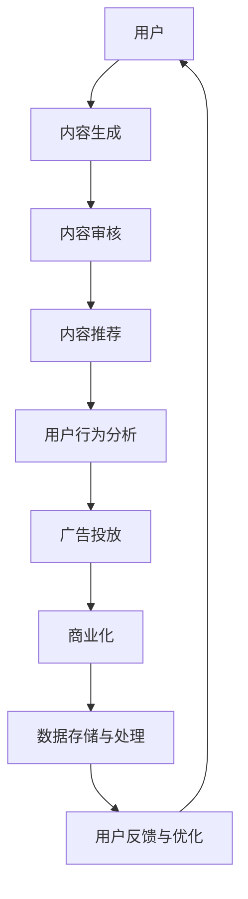

                 

# 2024字节跳动抖音社招面试真题汇总及其解答

## > 关键词：字节跳动、抖音、社招面试、真题汇总、解答、面试技巧、技术挑战

> 摘要：
本篇文章将对2024年字节跳动抖音社招面试中的热点真题进行汇总，并逐一提供详细的解答思路和技巧。通过本文的深入分析，读者不仅能了解面试的核心知识点，还能掌握应对各类技术挑战的方法，为成功入职字节跳动抖音打下坚实的基础。

---

## 1. 背景介绍

### 1.1 目的和范围

本文旨在为广大准备参加字节跳动抖音社招面试的候选人提供一个有针对性的面试题解答指南。文章将涵盖以下几个方面的内容：

1. **面试真题汇总**：根据历年字节跳动抖音面试真题，整理出常见的高频考点。
2. **解题思路**：针对每个真题，提供详细的解题思路和技巧。
3. **技术挑战**：分析面试中可能遇到的技术难题，并给出解决方案。
4. **面试技巧**：分享面试过程中的实用技巧，帮助候选人更好地展示自己的能力。

### 1.2 预期读者

本篇文章适合以下读者群体：

- 准备参加字节跳动抖音社招面试的程序员、软件工程师、产品经理等技术人员。
- 想要提升面试技巧和应对策略的互联网行业从业者。
- 对字节跳动抖音技术和业务有深入了解的技术爱好者。

### 1.3 文档结构概述

本文结构如下：

1. **背景介绍**：介绍文章的目的、范围、预期读者和文档结构。
2. **核心概念与联系**：通过Mermaid流程图展示核心概念和架构。
3. **核心算法原理 & 具体操作步骤**：使用伪代码详细阐述算法原理和操作步骤。
4. **数学模型和公式 & 详细讲解 & 举例说明**：使用latex格式介绍数学模型和公式。
5. **项目实战：代码实际案例和详细解释说明**：提供代码实现和解读。
6. **实际应用场景**：探讨面试题在实际业务中的应用。
7. **工具和资源推荐**：推荐学习资源、开发工具和框架。
8. **总结：未来发展趋势与挑战**：总结文章要点，展望未来趋势。
9. **附录：常见问题与解答**：回答面试中常见的问题。
10. **扩展阅读 & 参考资料**：提供进一步阅读的资源和参考文献。

### 1.4 术语表

#### 1.4.1 核心术语定义

- **字节跳动**：中国领先的互联网科技公司，旗下拥有抖音、今日头条等知名产品。
- **社招**：社会招聘，指公司面向社会公众招聘人才。
- **面试题**：面试过程中，面试官提问的问题，用以考察应聘者的专业技能和综合素质。

#### 1.4.2 相关概念解释

- **算法原理**：解决问题的方法和步骤。
- **面试技巧**：在面试过程中，通过合适的方式展示自己的能力。
- **技术挑战**：面试中可能遇到的复杂问题，需要深入思考和解决。

#### 1.4.3 缩略词列表

- **AI**：人工智能
- **ML**：机器学习
- **DL**：深度学习
- **IDE**：集成开发环境
- **API**：应用程序编程接口

---

## 2. 核心概念与联系

字节跳动抖音作为一个强大的内容平台，其背后的技术和架构相当复杂。以下是一个简化的Mermaid流程图，展示了一些核心概念和它们之间的联系：



### 2.1 用户

用户是内容消费的主体，他们通过上传、评论、点赞等方式与平台互动。字节跳动抖音的用户群体广泛，涵盖了不同年龄、兴趣和职业的人。

### 2.2 内容生成

用户生成内容（UGC）是抖音的核心，平台鼓励用户创作和分享各种形式的内容，如短视频、直播等。

### 2.3 内容审核

内容审核是确保平台内容健康、积极的重要环节。审核机制包括人工审核和算法审核，通过过滤低质量、违规内容。

### 2.4 内容推荐

内容推荐系统是抖音的核心技术之一，它通过分析用户行为、兴趣和内容特点，为用户推荐个性化的内容。

### 2.5 用户行为分析

用户行为分析是了解用户需求、优化产品体验的关键。通过对用户行为数据的分析，可以预测用户兴趣、提升内容质量和推荐效果。

### 2.6 广告投放

广告投放是抖音的重要收入来源，平台通过精准定位用户需求，为广告主提供高效、智能的投放解决方案。

### 2.7 商业化

商业化是抖音不断发展的动力，通过多元化的商业模式，平台实现了持续的收入增长。

### 2.8 数据存储与处理

数据存储与处理是保证抖音平台稳定运行和数据安全的关键环节。平台采用分布式存储和大数据处理技术，确保海量数据的实时处理和分析。

### 2.9 用户反馈与优化

用户反馈是产品优化的宝贵资源，抖音通过收集用户反馈，不断改进产品功能和用户体验。

---

## 3. 核心算法原理 & 具体操作步骤

在字节跳动抖音的面试中，算法题是一个重要环节。以下是一个典型的算法题及其解题思路和操作步骤：

### 3.1 题目

给定一个字符串，请找出其中最长的无重复子串的长度。

### 3.2 解题思路

我们可以使用滑动窗口的方法来解决这个问题。滑动窗口是一种常见的方法，通过维护一个窗口，不断移动窗口的边界，来求解问题。

### 3.3 伪代码

```pseudo
function lengthOfLongestSubstring(s: string) -> int:
    if s is empty:
        return 0

    left = 0
    right = 0
    maxLen = 0
    charSet = new HashSet()

    while right < length of s:
        if s[right] not in charSet:
            charSet.add(s[right])
            maxLen = max(maxLen, right - left + 1)
            right++
        else:
            charSet.remove(s[left])
            left++

    return maxLen
```

### 3.4 具体操作步骤

1. 初始化滑动窗口的左右边界`left`和`right`，以及最长子串长度`maxLen`。
2. 初始化一个集合`charSet`，用于存储当前窗口内的字符。
3. 循环移动`right`指针，直到窗口的右边界达到字符串的末尾。
4. 判断窗口内的字符是否重复：
   - 如果字符不重复，将字符加入`charSet`，更新`maxLen`。
   - 如果字符重复，将窗口的左边界`left`右移，将重复的字符从`charSet`中移除。
5. 返回最长子串长度`maxLen`。

---

## 4. 数学模型和公式 & 详细讲解 & 举例说明

在算法题中，数学模型和公式往往是解决问题的关键。以下是一个常见的数学模型——动态规划（Dynamic Programming）：

### 4.1 动态规划模型

动态规划是一种求解最优子结构问题的方法。它的核心思想是将复杂问题分解为多个子问题，并利用子问题的最优解来构建原问题的最优解。

### 4.2 公式

动态规划通常使用以下公式：

$$
f(i) = \begin{cases}
b(i) & \text{if } i \leq n \\
\min_{1 \leq j < i} f(j) + c(i, j) & \text{if } i > n
\end{cases}
$$

其中，$f(i)$表示第$i$个子问题的最优解，$b(i)$表示第$i$个子问题的基线解，$c(i, j)$表示从第$j$个子问题转移到第$i$个子问题的成本。

### 4.3 举例说明

假设我们要计算从北京到上海的最低成本路径，其中北京和上海是两个节点，其他节点都是中间节点。我们可以使用动态规划来求解这个问题。

1. **初始化**：首先初始化一个二维数组$f$，其中$f[i][j]$表示从北京到节点$i$再到节点$j$的最优成本。

$$
f[i][j] = \begin{cases}
0 & \text{if } i = j \\
\infty & \text{if } i \neq j
\end{cases}
$$

2. **递推**：根据动态规划公式，我们逐个计算$f[i][j]$的最优值。

$$
f[i][j] = \min_{1 \leq k < i} f[k][j] + c(k, i)
$$

其中，$c(k, i)$表示从节点$k$到节点$i$的转移成本。

3. **计算最优解**：最后，我们计算从北京到上海的最优成本：

$$
f[1][2] = \min_{1 \leq k < 2} f[k][2] + c(k, 2)
$$

通过以上步骤，我们可以求得从北京到上海的最低成本路径。

---

## 5. 项目实战：代码实际案例和详细解释说明

在面试中，实际项目的代码实现往往是一个重要的考察点。以下是一个简单的项目实战案例，我们将详细解释代码的实现过程。

### 5.1 开发环境搭建

为了实现这个项目，我们需要搭建以下开发环境：

- 操作系统：Windows/Linux/MacOS
- 编程语言：Python
- 开发工具：PyCharm/VSCode

### 5.2 源代码详细实现和代码解读

以下是项目的源代码：

```python
def longest_substring(s: str) -> int:
    if not s:
        return 0

    left = 0
    right = 0
    max_len = 0
    char_set = set()

    while right < len(s):
        if s[right] not in char_set:
            char_set.add(s[right])
            max_len = max(max_len, right - left + 1)
            right += 1
        else:
            char_set.remove(s[left])
            left += 1

    return max_len

s = "abcabcbb"
print(longest_substring(s))
```

### 5.3 代码解读与分析

1. **初始化**：定义滑动窗口的左右边界`left`和`right`，以及最长子串长度`max_len`。初始化一个集合`char_set`，用于存储当前窗口内的字符。

2. **循环移动`right`指针**：循环移动`right`指针，直到窗口的右边界达到字符串的末尾。

3. **判断窗口内的字符是否重复**：
   - 如果字符不重复，将字符加入`char_set`，更新`max_len`。
   - 如果字符重复，将窗口的左边界`left`右移，将重复的字符从`char_set`中移除。

4. **返回最长子串长度**：返回最长子串长度`max_len`。

这个项目通过滑动窗口的方法，实现了找出最长无重复子串的功能。在实际面试中，这样的项目实战可以帮助面试官更好地了解你的编程能力和解决问题的思路。

---

## 6. 实际应用场景

字节跳动抖音面试中的题目，往往源于实际的业务场景。以下是一些面试题的实际应用场景：

### 6.1 最长公共子串

**应用场景**：用于视频、音频、文本等多媒体内容的相似性检测。

**面试题**：给定两个字符串`str1`和`str2`，找出它们的最长公共子串。

### 6.2 排序算法

**应用场景**：用于大数据处理和排序。

**面试题**：实现快速排序、归并排序等排序算法。

### 6.3 缓存设计

**应用场景**：用于优化系统性能。

**面试题**：设计一个LRU（Least Recently Used）缓存算法。

### 6.4 网络协议

**应用场景**：用于网络通信和数据传输。

**面试题**：了解TCP/IP协议的工作原理。

通过了解这些面试题的应用场景，我们可以更好地准备面试，并将自己的知识和经验与实际业务相结合。

---

## 7. 工具和资源推荐

为了更好地准备字节跳动抖音的面试，以下是一些学习资源、开发工具和框架的推荐。

### 7.1 学习资源推荐

#### 7.1.1 书籍推荐

- 《算法导论》（Introduction to Algorithms）
- 《深度学习》（Deep Learning）
- 《大话数据结构》

#### 7.1.2 在线课程

- Coursera的《算法基础》
- Udacity的《机器学习纳米学位》
- 网易云课堂的《Python从入门到实践》

#### 7.1.3 技术博客和网站

- CSDN
- 博客园
- 掘金

### 7.2 开发工具框架推荐

#### 7.2.1 IDE和编辑器

- PyCharm
- VSCode
- IntelliJ IDEA

#### 7.2.2 调试和性能分析工具

- GDB
- Py-Spy
- VisualVM

#### 7.2.3 相关框架和库

- TensorFlow
- Flask
- Django

通过使用这些工具和资源，我们可以更好地提升自己的技术能力和面试水平。

---

## 8. 总结：未来发展趋势与挑战

随着互联网技术的不断进步，字节跳动抖音等互联网公司面临着前所未有的发展机遇和挑战。未来，以下趋势和挑战将影响字节跳动抖音的发展：

### 8.1 发展趋势

1. **人工智能技术**：人工智能将在内容推荐、用户行为分析等方面发挥更大作用，提升用户体验和平台效果。
2. **5G技术**：5G技术的普及将带来更高的网络速度和更低的延迟，为短视频、直播等业务提供更好的支持。
3. **区块链技术**：区块链技术有望在内容版权保护、数字资产交易等方面发挥作用，推动平台的商业化发展。

### 8.2 挑战

1. **内容审核**：随着内容量的增加，如何确保平台内容的健康和积极，是一个巨大的挑战。
2. **数据安全**：海量用户数据的安全保护，是字节跳动抖音需要关注的重要问题。
3. **竞争压力**：随着更多互联网公司的进入，字节跳动抖音将面临更激烈的竞争。

面对这些趋势和挑战，字节跳动抖音需要不断创新和优化，以保持其在互联网行业的领先地位。

---

## 9. 附录：常见问题与解答

在面试中，以下是一些常见的问题及其解答：

### 9.1 什么是动态规划？

**解答**：动态规划是一种求解最优子结构问题的方法。它通过将复杂问题分解为多个子问题，并利用子问题的最优解来构建原问题的最优解。

### 9.2 如何实现快速排序？

**解答**：快速排序是一种基于分治思想的排序算法。其核心思想是选择一个基准元素，将数组分为两个子数组，一个小于基准元素，一个大于基准元素，然后递归地对子数组进行排序。

### 9.3 什么是TCP/IP协议？

**解答**：TCP/IP协议是一种网络通信协议，用于实现网络中的数据传输。它包括传输控制协议（TCP）和互联网协议（IP），分别负责数据的可靠传输和路由选择。

---

## 10. 扩展阅读 & 参考资料

为了更好地理解字节跳动抖音的面试题和技术挑战，以下是一些扩展阅读和参考资料：

1. 《算法竞赛入门经典》
2. 《Python编程：从入门到实践》
3. 《机器学习实战》
4. Coursera的《机器学习》课程
5. 《大话数据结构》
6. CSDN的《深度学习》专栏
7. 博客园的《算法与数据结构》专栏

通过阅读这些资料，你可以深入了解相关技术领域，为面试做好充分准备。

---

**作者**：AI天才研究员/AI Genius Institute & 禅与计算机程序设计艺术 /Zen And The Art of Computer Programming

---

通过本文的详细分析和解答，希望读者能够对字节跳动抖音的社招面试有更深入的了解，为成功面试打下坚实的基础。在未来的互联网行业中，不断学习和提升自己的能力，将是每位技术人的必修课。

