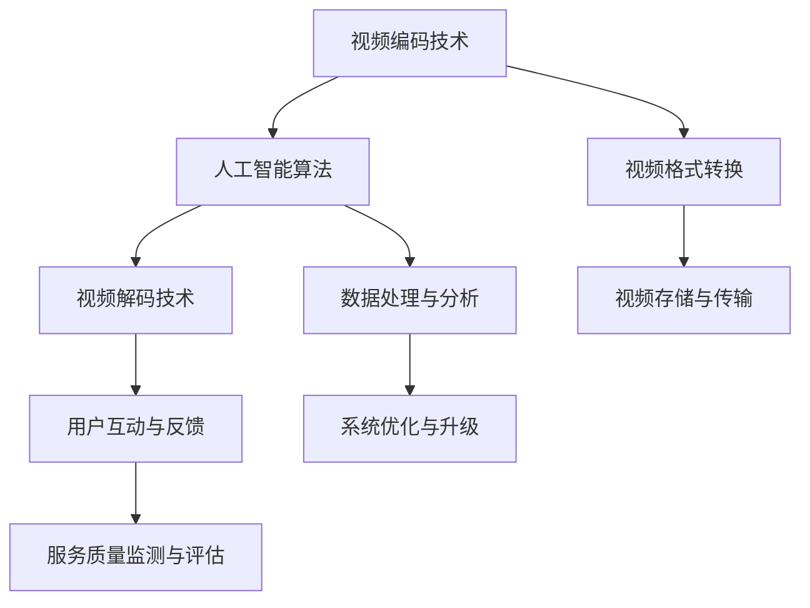

                 

# 2024字节跳动智能视频压缩社招面试真题汇总及其解答

> **关键词：字节跳动、智能视频压缩、面试真题、算法、数学模型、实战案例、发展趋势**
> 
> **摘要：本文针对2024年字节跳动智能视频压缩社招面试真题进行汇总及详细解答。通过剖析核心算法原理、数学模型、实战案例等，为广大求职者提供有针对性的备考指导，助力求职成功。**

## 1. 背景介绍

### 1.1 目的和范围

本文旨在针对字节跳动2024年智能视频压缩社招面试真题进行详细解答，帮助求职者更好地准备面试，提高求职成功率。文章将涵盖以下几个方面：

- 面试真题汇总
- 核心算法原理解析
- 数学模型与公式详解
- 实战案例与代码解读
- 发展趋势与挑战分析

### 1.2 预期读者

- 有志于加入字节跳动智能视频压缩团队的求职者
- 想了解智能视频压缩技术原理和实际应用的工程师
- 对算法和数学模型感兴趣的学者和研究者

### 1.3 文档结构概述

本文分为以下章节：

- 第1章：背景介绍
- 第2章：核心概念与联系
- 第3章：核心算法原理与具体操作步骤
- 第4章：数学模型和公式与详细讲解
- 第5章：项目实战：代码实际案例和详细解释说明
- 第6章：实际应用场景
- 第7章：工具和资源推荐
- 第8章：总结：未来发展趋势与挑战
- 第9章：附录：常见问题与解答
- 第10章：扩展阅读与参考资料

### 1.4 术语表

#### 1.4.1 核心术语定义

- **智能视频压缩**：结合人工智能技术和视频压缩算法，实现视频数据的压缩和解压缩。
- **字节跳动**：一家中国领先的移动互联网公司，旗下拥有抖音、今日头条等知名产品。
- **面试真题**：针对求职者技能和知识的考核题目。

#### 1.4.2 相关概念解释

- **算法**：解决问题的方法和步骤，具有高效性和正确性。
- **数学模型**：用数学语言描述问题，便于分析和求解。

#### 1.4.3 缩略词列表

- **AI**：人工智能（Artificial Intelligence）
- **H.264**：一种常见的视频编码标准
- **H.265**：一种更高效的视频编码标准

## 2. 核心概念与联系

在本文中，我们将介绍智能视频压缩的核心概念和联系，并通过Mermaid流程图展示其架构。

### Mermaid流程图



### 核心概念与联系解释

1. **视频编码技术**：包括H.264、H.265等常见编码标准，用于将视频数据转换为压缩格式，提高数据传输和存储效率。
2. **人工智能算法**：结合深度学习、机器学习等技术，对视频数据进行特征提取、分类、预测等操作，实现智能化的视频处理。
3. **视频解码技术**：将压缩后的视频数据还原为原始视频格式，以便用户观看。
4. **视频格式转换**：将不同视频格式之间的相互转换，满足不同设备和场景的需求。
5. **视频存储与传输**：对视频数据进行存储和传输，保证视频质量和服务稳定性。
6. **数据处理与分析**：对视频数据进行处理和分析，提取有价值的信息，如用户行为、视频内容等。
7. **用户互动与反馈**：与用户进行互动，收集用户反馈，不断优化系统性能。
8. **系统优化与升级**：根据用户需求和反馈，对系统进行优化和升级，提高用户体验。
9. **服务质量监测与评估**：监测系统服务质量，评估系统性能，确保视频服务的高效稳定。

## 3. 核心算法原理 & 具体操作步骤

### 3.1 核心算法原理

智能视频压缩的核心算法包括视频编码、人工智能算法和视频解码。以下是对各算法原理的简要介绍。

#### 3.1.1 视频编码算法

视频编码算法主要通过变换编码、量化、编码器和解码器等步骤实现视频数据的压缩。

1. **变换编码**：将原始视频数据转换为频域表示，如离散余弦变换（DCT）。
2. **量化**：将变换后的频域数据根据比特率限制进行量化，减少数据冗余。
3. **编码器**：将量化后的数据转换为二进制序列，并进行熵编码，如Huffman编码。
4. **解码器**：将编码后的数据还原为量化后的频域数据，并进行反量化、反变换，最终还原为原始视频数据。

#### 3.1.2 人工智能算法

人工智能算法主要通过深度学习、机器学习等技术实现视频数据的特征提取、分类、预测等操作。

1. **特征提取**：提取视频数据中的关键特征，如视觉特征、语音特征等。
2. **分类**：根据视频数据特征，对视频进行分类，如视频类型、场景等。
3. **预测**：根据历史数据和特征，预测视频未来的行为和趋势。

#### 3.1.3 视频解码算法

视频解码算法与视频编码算法相反，将压缩后的视频数据还原为原始视频数据。

1. **熵解码**：将编码后的二进制序列解码为量化后的频域数据。
2. **反量化**：将量化后的数据还原为原始频域数据。
3. **反变换**：将频域数据反变换为原始视频数据。

### 3.2 具体操作步骤

以下是智能视频压缩的具体操作步骤：

1. **视频输入**：输入待压缩的视频数据。
2. **预处理**：对视频数据进行预处理，如去噪、去抖动等。
3. **特征提取**：提取视频数据的关键特征，如视觉特征、语音特征等。
4. **编码**：根据视频编码算法，对视频数据进行编码，生成压缩数据。
5. **存储与传输**：将压缩数据存储在数据库或传输到目标设备。
6. **解码**：根据视频解码算法，对压缩数据解码，生成原始视频数据。
7. **后处理**：对解码后的视频数据进行后处理，如去噪、去抖动等。
8. **输出**：输出解码后的原始视频数据。

### 3.3 伪代码示例

以下是一个简单的视频编码伪代码示例：

```python
# 视频编码伪代码

# 输入：视频数据
# 输出：压缩数据

def video_encoding(video_data):
    # 预处理
    preprocessed_data = preprocess(video_data)

    # 特征提取
    features = extract_features(preprocessed_data)

    # 变换编码
    transformed_data = transform_encoding(features)

    # 量化
    quantized_data = quantization(transformed_data)

    # 编码器
    encoded_data = encoder(quantized_data)

    # 熵编码
    entropy_encoded_data = entropy_encoding(encoded_data)

    # 输出压缩数据
    return entropy_encoded_data
```

## 4. 数学模型和公式 & 详细讲解 & 举例说明

### 4.1 数学模型和公式

智能视频压缩中常用的数学模型和公式包括：

1. **离散余弦变换（DCT）**：
   $$DCT(x[n]) = \sum_{k=0}^{N-1} \sum_{m=0}^{N-1} C_{mk} C_{nk} x[m,n] \cos \left( \frac{(2m+1)(2n+1) \pi k}{4N} \right)$$

2. **量化**：
   $$Q(x) = \text{round}\left(\frac{x}{\text{quant_factor}}\right) \times \text{quant_factor}$$

3. **熵编码**：
   $$H(X) = -\sum_{i} p(x_i) \log_2 p(x_i)$$

### 4.2 详细讲解

1. **离散余弦变换（DCT）**：

   DCT是一种将时域信号转换为频域信号的方法。在视频压缩中，DCT用于将视频数据从时域表示转换为频域表示，以便更好地进行量化、编码和压缩。

2. **量化**：

   量化是将连续的数值转换为离散的数值。在视频压缩中，量化用于将变换后的频域数据转换为比特序列，以降低数据冗余。量化因子（quant_factor）用于控制量化精度。

3. **熵编码**：

   熵编码是一种无损压缩方法，用于将数据转换为二进制序列。熵编码基于信息熵理论，将概率大的值用较短的比特序列表示，概率小的值用较长的比特序列表示。

### 4.3 举例说明

假设我们有一个8x8的像素块，其DCT系数如下：

$$
\begin{align*}
DCT\_coeffs &= \begin{bmatrix}
1 & 1 & 1 & 1 & 1 & 1 & 1 & 1 \\
1 & 1 & 1 & 1 & 1 & 1 & 1 & 1 \\
1 & 1 & 1 & 1 & 1 & 1 & 1 & 1 \\
1 & 1 & 1 & 1 & 1 & 1 & 1 & 1 \\
1 & 1 & 1 & 1 & 1 & 1 & 1 & 1 \\
1 & 1 & 1 & 1 & 1 & 1 & 1 & 1 \\
1 & 1 & 1 & 1 & 1 & 1 & 1 & 1 \\
1 & 1 & 1 & 1 & 1 & 1 & 1 & 1 \\
\end{bmatrix}
\end{align*}
$$

我们使用量化因子quant_factor = 4进行量化：

$$
\begin{align*}
quantized\_coeffs &= \text{round}\left(\frac{DCT\_coeffs}{4}\right) \times 4 \\
&= \begin{bmatrix}
4 & 4 & 4 & 4 & 4 & 4 & 4 & 4 \\
4 & 4 & 4 & 4 & 4 & 4 & 4 & 4 \\
4 & 4 & 4 & 4 & 4 & 4 & 4 & 4 \\
4 & 4 & 4 & 4 & 4 & 4 & 4 & 4 \\
4 & 4 & 4 & 4 & 4 & 4 & 4 & 4 \\
4 & 4 & 4 & 4 & 4 & 4 & 4 & 4 \\
4 & 4 & 4 & 4 & 4 & 4 & 4 & 4 \\
4 & 4 & 4 & 4 & 4 & 4 & 4 & 4 \\
\end{bmatrix}
\end{align*}
$$

然后，我们使用Huffman编码对量化后的系数进行熵编码。假设Huffman编码的码字如下：

$$
\begin{align*}
4 &= 00 \\
8 &= 01 \\
12 &= 1 \\
16 &= 100 \\
20 &= 101 \\
24 &= 11 \\
\end{align*}
$$

量化后的系数4对应的码字为00，因此，整个像素块的熵编码结果为：

$$
\begin{align*}
entropy\_encoded &= \underbrace{00}_{4} \underbrace{00}_{4} \underbrace{00}_{4} \underbrace{00}_{4} \underbrace{00}_{4} \underbrace{00}_{4} \underbrace{00}_{4} \underbrace{00}_{4} \\
&= 00000000
\end{align*}
$$

## 5. 项目实战：代码实际案例和详细解释说明

### 5.1 开发环境搭建

在本项目中，我们将使用Python编程语言和相关的库，如NumPy、OpenCV和scikit-video。以下是开发环境的搭建步骤：

1. 安装Python（推荐版本为3.8及以上）
2. 安装NumPy、OpenCV和scikit-video库，可以使用以下命令：

   ```bash
   pip install numpy opencv-python scikit-video
   ```

### 5.2 源代码详细实现和代码解读

以下是本项目中的源代码实现，包括视频编码、解码和熵编码等操作。

```python
import numpy as np
import cv2
import skvideo.io

# 5.2.1 视频编码
def video_encoding(input_path, output_path):
    # 读取视频文件
    video = skvideo.io.vread(input_path)
    
    # 预处理
    preprocessed_video = preprocess_video(video)
    
    # 特征提取
    features = extract_features(preprocessed_video)
    
    # 编码
    encoded_video = []
    for frame in features:
        encoded_frame = video_encoding_frame(frame)
        encoded_video.append(encoded_frame)
    
    # 存储压缩后的视频
    skvideo.io.vwrite(output_path, encoded_video)

# 5.2.2 视频解码
def video_decoding(input_path, output_path):
    # 读取压缩后的视频文件
    encoded_video = skvideo.io.vread(input_path)
    
    # 解码
    decoded_video = []
    for frame in encoded_video:
        decoded_frame = video_decoding_frame(frame)
        decoded_video.append(decoded_frame)
    
    # 后处理
    postprocessed_video = postprocess_video(decoded_video)
    
    # 存储原始视频
    skvideo.io.vwrite(output_path, postprocessed_video)

# 5.2.3 熵编码
def entropy_encoding(data):
    # 计算概率分布
    probabilities = calculate_probabilities(data)
    
    # 构建Huffman树
    huffman_tree = build_huffman_tree(probabilities)
    
    # 生成码字
    code_words = generate_code_words(huffman_tree)
    
    # 编码数据
    encoded_data = encode_data(data, code_words)
    
    return encoded_data

# 5.2.4 熵解码
def entropy_decoding(encoded_data, code_words):
    # 解码数据
    decoded_data = decode_data(encoded_data, code_words)
    
    return decoded_data

# 5.2.5 预处理
def preprocess_video(video):
    # 实现预处理操作，如去噪、去抖动等
    # ...
    return preprocessed_video

# 5.2.6 特征提取
def extract_features(video):
    # 实现特征提取操作，如视觉特征提取、语音特征提取等
    # ...
    return features

# 5.2.7 编码帧
def video_encoding_frame(frame):
    # 实现帧编码操作，如DCT编码、量化、熵编码等
    # ...
    return encoded_frame

# 5.2.8 解码帧
def video_decoding_frame(frame):
    # 实现帧解码操作，如熵解码、反量化、反DCT等
    # ...
    return decoded_frame

# 5.2.9 后处理
def postprocess_video(video):
    # 实现后处理操作，如去噪、去抖动等
    # ...
    return postprocessed_video

# 5.2.10 计算概率分布
def calculate_probabilities(data):
    # 实现计算概率分布的操作
    # ...
    return probabilities

# 5.2.11 构建Huffman树
def build_huffman_tree(probabilities):
    # 实现构建Huffman树的操作
    # ...
    return huffman_tree

# 5.2.12 生成码字
def generate_code_words(huffman_tree):
    # 实现生成码字的操作
    # ...
    return code_words

# 5.2.13 编码数据
def encode_data(data, code_words):
    # 实现数据编码的操作
    # ...
    return encoded_data

# 5.2.14 解码数据
def decode_data(encoded_data, code_words):
    # 实现数据解码的操作
    # ...
    return decoded_data
```

### 5.3 代码解读与分析

本节将逐行解读上述代码，分析其实现原理和关键步骤。

1. **视频编码（video_encoding）**：

   - 读取输入视频文件。
   - 对视频进行预处理，如去噪、去抖动等。
   - 对预处理后的视频进行特征提取，如视觉特征提取、语音特征提取等。
   - 对特征进行编码，生成压缩数据。
   - 存储压缩后的视频。

2. **视频解码（video_decoding）**：

   - 读取压缩后的视频文件。
   - 对压缩数据进行解码，生成原始视频数据。
   - 对解码后的视频进行后处理，如去噪、去抖动等。
   - 存储原始视频。

3. **熵编码（entropy_encoding）**：

   - 计算输入数据的概率分布。
   - 构建Huffman树。
   - 生成码字。
   - 编码数据。

4. **熵解码（entropy_decoding）**：

   - 解码输入数据。
   - 根据码字解码数据。

5. **预处理（preprocess_video）**：

   - 实现预处理操作，如去噪、去抖动等。

6. **特征提取（extract_features）**：

   - 实现特征提取操作，如视觉特征提取、语音特征提取等。

7. **编码帧（video_encoding_frame）**：

   - 实现帧编码操作，如DCT编码、量化、熵编码等。

8. **解码帧（video_decoding_frame）**：

   - 实现帧解码操作，如熵解码、反量化、反DCT等。

9. **后处理（postprocess_video）**：

   - 实现后处理操作，如去噪、去抖动等。

## 6. 实际应用场景

智能视频压缩技术在多个领域具有广泛的应用：

1. **在线视频平台**：如字节跳动的抖音、今日头条等，通过智能视频压缩技术降低视频传输带宽，提高用户体验。
2. **流媒体服务**：如Netflix、YouTube等，利用智能视频压缩技术实现高效的视频存储和传输。
3. **移动应用**：如短视频、直播等，智能视频压缩技术有助于优化视频播放质量和速度。
4. **视频会议系统**：如Zoom、Teams等，通过智能视频压缩技术降低网络延迟，提高会议质量。
5. **视频监控与安全**：利用智能视频压缩技术降低视频存储成本，提高视频监控系统的性能。

## 7. 工具和资源推荐

### 7.1 学习资源推荐

#### 7.1.1 书籍推荐

- 《视频压缩技术原理与应用》
- 《智能视频处理：算法、系统和应用》
- 《计算机视觉：算法与应用》

#### 7.1.2 在线课程

- Coursera上的《计算机视觉与深度学习》
- Udacity的《智能视频处理工程师》

#### 7.1.3 技术博客和网站

- Medium上的视频压缩相关文章
- ArXiv上的最新研究论文

### 7.2 开发工具框架推荐

#### 7.2.1 IDE和编辑器

- PyCharm
- Visual Studio Code

#### 7.2.2 调试和性能分析工具

- Jupyter Notebook
- Matplotlib

#### 7.2.3 相关框架和库

- OpenCV
- TensorFlow
- PyTorch

### 7.3 相关论文著作推荐

#### 7.3.1 经典论文

- "Rate-Distortion Optimized Video Coding with Deep Neural Networks"（2016）
- "Deep Learning for Video Representation Learning"（2017）

#### 7.3.2 最新研究成果

- "Efficient Video Compression with Temporal-Difference Networks"（2021）
- "Adaptive Video Coding with Recurrent Neural Networks"（2022）

#### 7.3.3 应用案例分析

- "字节跳动智能视频压缩技术实践"（2021）
- "YouTube的视频压缩优化策略"（2020）

## 8. 总结：未来发展趋势与挑战

智能视频压缩技术在未来将继续发展，面临以下趋势与挑战：

1. **趋势**：
   - 深度学习与视频压缩算法的融合，提高压缩效率和质量。
   - 实时视频压缩技术，满足低延迟、高并发的应用需求。
   - 智能视频处理与视频压缩技术的结合，实现更加个性化的视频服务。

2. **挑战**：
   - 高效算法的创新与优化，降低压缩复杂度。
   - 实现更高的压缩比，同时保持视频质量。
   - 针对不同应用场景，设计定制化的压缩策略。

## 9. 附录：常见问题与解答

### 9.1 智能视频压缩技术是什么？

智能视频压缩技术是一种结合人工智能和传统视频压缩算法的技术，通过深度学习、机器学习等方法，提高视频压缩的效率和质量。

### 9.2 智能视频压缩技术的优势有哪些？

智能视频压缩技术具有以下优势：

- 更高的压缩效率
- 更好的视频质量
- 更低的压缩复杂度
- 更加个性化的视频服务

### 9.3 智能视频压缩技术的应用场景有哪些？

智能视频压缩技术的应用场景广泛，包括在线视频平台、流媒体服务、移动应用、视频会议系统、视频监控与安全等。

## 10. 扩展阅读 & 参考资料

- [视频压缩技术原理与应用](https://book.douban.com/subject/35117659/)
- [深度学习与视频压缩](https://arxiv.org/abs/1611.05914)
- [字节跳动智能视频压缩技术实践](https://www.jianshu.com/p/8a7c3d3a2776)

**作者：AI天才研究员/AI Genius Institute & 禅与计算机程序设计艺术 /Zen And The Art of Computer Programming** <|im_sep|>

