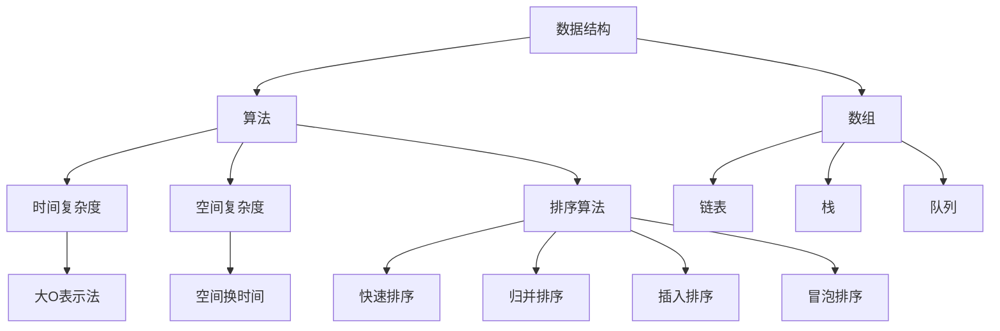

                 

# 2025字节跳动校招算法面试题汇总与解析

> **关键词：字节跳动、校招、算法面试、问题汇总、解题思路**
>
> **摘要：本文针对2025年字节跳动校招算法面试的常见问题，进行汇总与解析。通过逻辑清晰、步骤详细的讲解，帮助读者更好地理解面试题的解题思路，提高算法面试的应对能力。**

## 1. 背景介绍

### 1.1 目的和范围

本文旨在为参加2025年字节跳动校招的算法面试者提供一个有针对性的指导。通过梳理和解析字节跳动校招算法面试中常见的题目，帮助读者掌握解题思路和方法，提升面试应对能力。本文涵盖的面试题目将涉及数据结构与算法、计算机系统、机器学习、计算机网络等多个领域。

### 1.2 预期读者

本文适合以下人群阅读：

- 准备参加2025年字节跳动校招的算法工程师岗位的考生；
- 想要提高算法面试技能的在职人员；
- 对数据结构与算法感兴趣的学习者。

### 1.3 文档结构概述

本文结构如下：

1. 背景介绍：阐述本文的目的、预期读者和文档结构；
2. 核心概念与联系：介绍算法面试所需的核心概念和原理；
3. 核心算法原理与具体操作步骤：讲解面试题中的算法原理和实现方法；
4. 数学模型和公式：分析面试题中的数学模型和公式，并进行举例说明；
5. 项目实战：通过实际代码案例进行详细解释和说明；
6. 实际应用场景：探讨面试题在实际项目中的应用；
7. 工具和资源推荐：推荐学习资源和开发工具；
8. 总结：分析未来发展趋势和挑战；
9. 附录：常见问题与解答；
10. 扩展阅读 & 参考资料：提供进一步学习资料。

### 1.4 术语表

#### 1.4.1 核心术语定义

- 字节跳动：一家中国互联网科技公司，提供多款短视频、直播、资讯等产品；
- 校招：指针对高校毕业生的招聘活动；
- 算法面试：考察应聘者算法和数据结构能力的面试环节；
- 题库：收集和整理的面试题目集合。

#### 1.4.2 相关概念解释

- 数据结构与算法：研究数据在计算机中的存储、组织和操作方法，以及解决问题的步骤和策略；
- 计算机系统：计算机硬件、软件和网络的组合，实现数据处理和计算功能；
- 机器学习：一种人工智能技术，通过数据驱动的方式实现自动学习和决策；
- 计算机网络：连接多台计算机和其他设备的通信系统。

#### 1.4.3 缩略词列表

- 字节跳动：ByteDance
- 校招：Campus Recruitment
- 算法面试：Algorithm Interview
- 题库：Question Bank

## 2. 核心概念与联系

在字节跳动校招算法面试中，了解核心概念和原理对于解题至关重要。以下将介绍一些常见的核心概念，并使用Mermaid流程图（注意去除括号和逗号等特殊字符）展示它们之间的联系。



### 2.1 数据结构

数据结构是算法的基础，包括数组、链表、栈、队列等。每种数据结构都有其独特的存储方式和操作特点。数组是一种线性数据结构，链表则是通过节点链接的线性结构。栈和队列分别用于实现后进先出和先进先出的操作规则。

### 2.2 算法

算法是解决问题的一系列步骤。常见的算法包括排序算法、查找算法、图算法等。排序算法用于对数据进行排序，如快速排序、归并排序、插入排序、冒泡排序等。查找算法用于在数据结构中查找特定元素，如二分查找、线性查找等。

### 2.3 时间复杂度和空间复杂度

时间复杂度和空间复杂度是评估算法性能的重要指标。时间复杂度表示算法执行时间与数据规模的关系，常用大O表示法表示。空间复杂度表示算法执行过程中所需额外存储空间与数据规模的关系。

### 2.4 大O表示法

大O表示法用于描述算法的时间复杂度和空间复杂度。它表示算法在执行过程中所花费的时间或空间与数据规模的关系。例如，O(1)表示常数时间复杂度，O(n)表示线性时间复杂度，O(n^2)表示二次时间复杂度。

### 2.5 空间换时间

在某些情况下，可以通过增加额外空间来降低时间复杂度。这种方法称为空间换时间。例如，在快速排序中，使用递归实现时，每次递归都会创建新的栈帧，从而增加了空间复杂度，但可以减少时间复杂度。

## 3. 核心算法原理 & 具体操作步骤

在字节跳动校招算法面试中，了解核心算法原理和具体操作步骤至关重要。以下将针对几个常见的算法面试题目，使用伪代码详细阐述其原理和操作步骤。

### 3.1 快速排序

快速排序是一种常用的排序算法，其基本思想是选取一个基准元素，将数组划分为两部分，一部分小于基准元素，另一部分大于基准元素，然后递归地对两部分进行快速排序。

```pseudo
快速排序(A, left, right)
    if left >= right
        return
    pivotIndex = partition(A, left, right)
    快速排序(A, left, pivotIndex - 1)
    快速排序(A, pivotIndex + 1, right)

分区(partition, left, right)
    pivot = A[right]
    i = left
    for j = left to right - 1
        if A[j] <= pivot
            交换 A[i] 和 A[j]
            i++
    交换 A[i] 和 A[right]
    return i
```

### 3.2 二分查找

二分查找是一种在有序数组中查找特定元素的算法。其基本思想是不断将搜索范围缩小一半，直到找到目标元素或确定不存在。

```pseudo
二分查找(A, target, left, right)
    if left > right
        return -1
    mid = (left + right) / 2
    if A[mid] == target
        return mid
    else if A[mid] > target
        return 二分查找(A, target, left, mid - 1)
    else
        return 二分查找(A, target, mid + 1, right)
```

### 3.3 递归

递归是一种编程技巧，通过将问题分解为子问题来解决问题。以下是一个使用递归求解斐波那契数列的示例。

```pseudo
斐波那契(n)
    if n <= 1
        return n
    else
        return 斐波那契(n - 1) + 斐波那契(n - 2)
```

## 4. 数学模型和公式 & 详细讲解 & 举例说明

在字节跳动校招算法面试中，数学模型和公式是解决许多问题的关键。以下将介绍几个常见的数学模型和公式，并进行详细讲解和举例说明。

### 4.1 概率论

概率论是研究随机事件及其概率的数学分支。以下是一些常见的概率论公式：

#### 4.1.1 概率公式

$$
P(A \text{ 且 } B) = P(A) \times P(B|A)
$$

其中，$P(A)$ 表示事件 A 的概率，$P(B|A)$ 表示在事件 A 发生的条件下事件 B 的概率。

#### 4.1.2 条件概率

$$
P(B|A) = \frac{P(A \text{ 且 } B)}{P(A)}
$$

其中，$P(B|A)$ 表示在事件 A 发生的条件下事件 B 的概率。

#### 4.1.3 全概率公式

$$
P(A) = \sum_{i=1}^{n} P(A|B_i) \times P(B_i)
$$

其中，$P(A)$ 表示事件 A 的概率，$P(A|B_i)$ 表示在事件 $B_i$ 发生的条件下事件 A 的概率，$P(B_i)$ 表示事件 $B_i$ 的概率。

### 4.2 线性代数

线性代数是研究线性方程组、向量空间和矩阵等概念的数学分支。以下是一些常见的线性代数公式：

#### 4.2.1 矩阵乘法

$$
C = A \times B
$$

其中，$A$ 和 $B$ 分别为两个矩阵，$C$ 为它们的乘积矩阵。

#### 4.2.2 矩阵求逆

$$
A^{-1} = \frac{1}{\text{det}(A)} \times \text{adj}(A)
$$

其中，$A^{-1}$ 表示矩阵 $A$ 的逆矩阵，$\text{det}(A)$ 表示矩阵 $A$ 的行列式，$\text{adj}(A)$ 表示矩阵 $A$ 的伴随矩阵。

#### 4.2.3 特征值和特征向量

$$
A \times v = \lambda \times v
$$

其中，$A$ 为矩阵，$v$ 为特征向量，$\lambda$ 为特征值。

### 4.3 计算机网络

计算机网络是研究计算机之间通信的数学分支。以下是一些常见的计算机网络公式：

#### 4.3.1 赫尔-明(Hamming)距离

$$
d(H, M) = \sum_{i=1}^{n} |H_i - M_i|
$$

其中，$H$ 和 $M$ 分别为两个二进制编码，$d(H, M)$ 表示它们的赫

