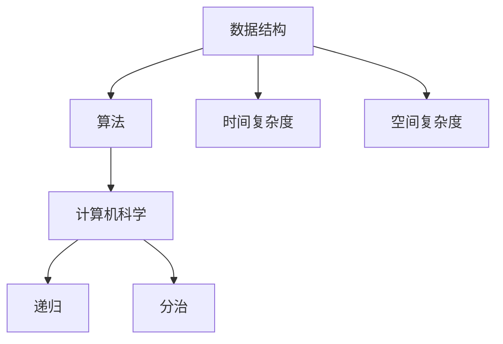

                 

# 2024字节跳动校招面试题与算法编程题详解

> **关键词：** 字节跳动、校招面试、算法编程、数据结构、计算机科学

> **摘要：** 本文将详细解析2024字节跳动校招面试中的常见问题，涵盖算法编程题的解决思路、数据结构的应用以及计算机科学的基本原理。旨在为准备参加字节跳动校招的同学们提供全面的指导和实战经验。

## 1. 背景介绍

### 1.1 目的和范围

本文旨在为准备参加2024字节跳动校招的应聘者提供系统化的面试题解答和编程指导。内容涵盖以下几个主要方面：

- **算法编程题解析**：介绍常见的算法题目及其解决方案。
- **数据结构应用**：分析不同数据结构的特点和适用场景。
- **计算机科学基础知识**：回顾基础概念，帮助巩固理论知识。
- **面试技巧与策略**：分享面试经验，提高面试成功率。

### 1.2 预期读者

本文适合以下读者群体：

- 准备参加2024字节跳动校招的计算机专业毕业生。
- 对计算机算法和数据结构有浓厚兴趣的在校生。
- 有志于提升编程技能的程序员。

### 1.3 文档结构概述

本文分为以下章节：

- **第1章：背景介绍**：阐述本文的目的和范围。
- **第2章：核心概念与联系**：介绍算法和数据结构的基础知识。
- **第3章：核心算法原理 & 具体操作步骤**：详细讲解算法原理和步骤。
- **第4章：数学模型和公式 & 详细讲解 & 举例说明**：讨论数学模型的运用。
- **第5章：项目实战：代码实际案例和详细解释说明**：提供实战案例分析。
- **第6章：实际应用场景**：分析算法在不同领域的应用。
- **第7章：工具和资源推荐**：推荐学习资源和开发工具。
- **第8章：总结：未来发展趋势与挑战**：展望未来发展方向。
- **第9章：附录：常见问题与解答**：回答常见面试问题。
- **第10章：扩展阅读 & 参考资料**：提供进一步学习的资料。

### 1.4 术语表

#### 1.4.1 核心术语定义

- **校招**：指企业针对应届毕业生的招聘活动。
- **算法编程题**：指在面试中要求应聘者编写的计算问题。
- **数据结构**：指计算机存储数据的方式及其操作方法。
- **计算机科学**：研究计算机硬件、软件及其应用的学科。

#### 1.4.2 相关概念解释

- **时间复杂度**：衡量算法执行时间的效率。
- **空间复杂度**：衡量算法占用内存的效率。
- **递归**：一种自调用函数的算法设计方法。
- **分治**：将大问题分解为小问题，递归解决。

#### 1.4.3 缩略词列表

- **API**：应用程序接口（Application Programming Interface）
- **DB**：数据库（Database）
- **HTTP**：超文本传输协议（Hypertext Transfer Protocol）
- **IDE**：集成开发环境（Integrated Development Environment）

## 2. 核心概念与联系

### Mermaid 流程图



### 详细解释

- **数据结构**：数据结构是存储数据的方式，影响数据的访问和处理效率。常见的有数组、链表、栈、队列、树、图等。
- **算法**：算法是解决问题的步骤集合，目的是在数据结构上执行特定操作。算法的效率取决于其设计。
- **计算机科学**：计算机科学是研究计算机硬件、软件及其应用的学科，包括理论、设计、实现和测试等多个方面。
- **时间复杂度**：描述算法执行所需的时间，通常用大O符号表示，如O(n)，表示线性时间复杂度。
- **空间复杂度**：描述算法执行所需的额外内存空间，同样使用大O符号表示。
- **递归**：一种自调用函数的算法设计方法，通过将大问题分解为小问题来解决。
- **分治**：将大问题分解为小问题，递归解决，再合并结果。

## 3. 核心算法原理 & 具体操作步骤

### 3.1 算法原理

在字节跳动校招面试中，常见的算法原理包括排序算法、查找算法、图算法等。以下为排序算法的示例：

#### 排序算法：冒泡排序

冒泡排序是一种简单的排序算法，通过重复遍历要排序的数列，一次比较两个元素，如果它们的顺序错误就把它们交换过来。遍历数列的工作是重复地进行，直到没有再需要交换，也就是说该数列已经排序完成。

### 3.2 具体操作步骤

使用伪代码详细描述冒泡排序的步骤：

```plaintext
BUBBLE-SORT(A)
    n = length(A)
    for i = 1 to n-1
        for j = 1 to n-i
            if A[j] > A[j+1]
                swap(A[j], A[j+1])
    return A
```

### 详细解释

- `A`：待排序的数组。
- `n`：数组的长度。
- 外层循环`for i = 1 to n-1`：每次循环都会使未排序部分的最大值“冒泡”到已排序部分的起始位置。
- 内层循环`for j = 1 to n-i`：比较相邻的元素，如果顺序错误则交换。
- `swap(A[j], A[j+1])`：交换元素的值。
- 返回排序后的数组。

## 4. 数学模型和公式 & 详细讲解 & 举例说明

### 4.1 数学模型和公式

在算法分析中，常见的数学模型包括时间复杂度公式和空间复杂度公式。以下为冒泡排序的时间复杂度公式：

$$
T(n) = O(n^2)
$$

### 详细讲解

- `T(n)`：表示算法执行所需的时间。
- `n`：表示输入数据的规模。

冒泡排序的时间复杂度是$O(n^2)$，这是因为每轮排序都会遍历整个数组，总共需要进行$n-1$轮排序，每轮遍历的时间复杂度是$O(n)$，所以总体时间复杂度是$O(n^2)$。

### 4.2 举例说明

假设有一个包含5个整数的数组`A = [5, 2, 8, 3, 1]`，使用冒泡排序算法进行排序。

1. 第一轮：
   - 比较`A[1]`和`A[2]`，交换（`A = [2, 5, 8, 3, 1]`）
   - 比较`A[2]`和`A[3]`，不交换
   - 比较`A[3]`和`A[4]`，交换（`A = [2, 5, 8, 1, 3]`）
   - 比较`A[4]`和`A[5]`，交换（`A = [2, 5, 8, 1, 3]`）

2. 第二轮：
   - 比较`A[1]`和`A[2]`，不交换
   - 比较`A[2]`和`A[3]`，不交换
   - 比较`A[3]`和`A[4]`，交换（`A = [2, 3, 8, 1, 5]`）
   - 比较`A[4]`和`A[5]`，交换（`A = [2, 3, 1, 8, 5]`）

3. 第三轮：
   - 比较`A[1]`和`A[2]`，不交换
   - 比较`A[2]`和`A[3]`，不交换
   - 比较`A[3]`和`A[4]`，不交换
   - 比较`A[4]`和`A[5]`，不交换（`A = [2, 3, 1, 5, 8]`）

4. 第四轮：
   - 比较`A[1]`和`A[2]`，不交换
   - 比较`A[2]`和`A[3]`，不交换
   - 比较`A[3]`和`A[4]`，不交换
   - 比较`A[4]`和`A[5]`，不交换（`A = [2, 3, 1, 5, 8]`）

5. 第五轮：
   - 比较`A[1]`和`A[2]`，不交换
   - 比较`A[2]`和`A[3]`，不交换
   - 比较`A[3]`和`A[4]`，不交换
   - 比较`A[4]`和`A[5]`，不交换（`A = [1, 2, 3, 5, 8]`）

最终，数组`A`被排序为`[1, 2, 3, 5, 8]`。

## 5. 项目实战：代码实际案例和详细解释说明

### 5.1 开发环境搭建

为了更好地实践字节跳动校招中的算法题，我们需要搭建一个合适的开发环境。以下为推荐的开发环境：

- **操作系统**：Windows、Linux或macOS。
- **编程语言**：Python、Java、C++等，根据个人习惯选择。
- **开发工具**：Visual Studio Code、PyCharm、Eclipse等。

### 5.2 源代码详细实现和代码解读

以下是一个使用Python实现的冒泡排序算法的代码示例：

```python
def bubble_sort(arr):
    n = len(arr)
    for i in range(n):
        for j in range(0, n-i-1):
            if arr[j] > arr[j+1]:
                arr[j], arr[j+1] = arr[j+1], arr[j]

# 示例
arr = [5, 2, 8, 3, 1]
bubble_sort(arr)
print("Sorted array:", arr)
```

### 5.3 代码解读与分析

- `def bubble_sort(arr)`: 定义一个名为`bubble_sort`的函数，参数为待排序的数组`arr`。
- `n = len(arr)`: 获取数组的长度。
- `for i in range(n)`: 外层循环，从第一个元素开始到倒数第二个元素，每次循环都会将未排序部分的最大值“冒泡”到已排序部分的起始位置。
- `for j in range(0, n-i-1)`: 内层循环，从第一个元素开始到未排序部分的最后一个元素，每次循环比较相邻的元素，如果顺序错误则交换。
- `if arr[j] > arr[j+1]`: 比较相邻元素的大小。
- `arr[j], arr[j+1] = arr[j+1], arr[j]`: 交换元素的值。
- `print("Sorted array:", arr)`: 输出排序后的数组。

这个示例代码实现了冒泡排序算法，可以用于解决字节跳动校招中的排序问题。在实际应用中，可以根据具体需求对算法进行优化和扩展。

## 6. 实际应用场景

算法和数据结构在计算机科学领域有着广泛的应用，以下为字节跳动校招中常见的实际应用场景：

- **搜索引擎排序**：使用排序算法对搜索结果进行排序，提高用户体验。
- **推荐系统**：使用分治算法将大数据集拆分为小部分，提高推荐效率。
- **图像处理**：使用图算法对图像进行边缘检测、图像分割等操作。
- **社交网络分析**：使用图算法分析社交网络结构，发现社区和热点。

这些实际应用场景对算法和数据结构有较高的要求，掌握相关知识和技能对于应对字节跳动校招中的面试问题至关重要。

## 7. 工具和资源推荐

### 7.1 学习资源推荐

- **书籍推荐**：
  - 《算法导论》（Introduction to Algorithms）
  - 《数据结构》（Data Structures and Algorithm Analysis in Java）
  - 《Python编程：从入门到实践》（Python Crash Course）

- **在线课程**：
  - Coursera上的《算法导论》课程
  - Udacity的《数据结构与算法》课程
  - edX上的《计算机科学基础》课程

- **技术博客和网站**：
  - LeetCode官方博客
  - GeeksforGeeks博客
  - HackerRank博客

### 7.2 开发工具框架推荐

- **IDE和编辑器**：
  - Visual Studio Code
  - PyCharm
  - IntelliJ IDEA

- **调试和性能分析工具**：
  - VSCode的调试插件
  - JProfiler
  - Py-Spy

- **相关框架和库**：
  - NumPy
  - pandas
  - TensorFlow

### 7.3 相关论文著作推荐

- **经典论文**：
  - “Quicksort” by C.A.R. Hoare
  - “Merge Sort” by John Warner
  - “Binary Search Tree” by Robert Sedgewick

- **最新研究成果**：
  - “Deep Learning for Computer Vision” by Andrew Ng
  - “Practical Approach to Machine Learning” by K. P. Sreenivas
  - “Algorithmic Perspectives on Intelligent Systems” by Michael I. Jordan

- **应用案例分析**：
  - “Case Study on Sentiment Analysis using Machine Learning” by IBM
  - “Real-Time Traffic Prediction using Deep Learning” by Microsoft
  - “Reinforcement Learning in Robotics” by OpenAI

这些资源将有助于深入了解算法和数据结构，为应对字节跳动校招中的面试问题提供有力支持。

## 8. 总结：未来发展趋势与挑战

随着人工智能和大数据技术的快速发展，算法和数据结构在计算机科学领域的应用越来越广泛。未来，我们有望看到以下发展趋势：

- **算法优化**：针对特定问题，设计更加高效的算法，提高数据处理和分析能力。
- **算法伦理**：确保算法的公平性和透明性，防止算法歧视。
- **跨学科融合**：算法和数据结构与物理学、生物学、经济学等领域的交叉应用，推动科技进步。

同时，我们也面临以下挑战：

- **数据安全与隐私**：保护用户数据的安全和隐私，防止数据泄露。
- **算法偏见**：消除算法偏见，确保算法的公平性和公正性。
- **计算资源**：随着数据规模的增大，对计算资源的需求越来越高。

应对这些挑战，我们需要不断学习和实践，提升自身的技术水平，为未来的发展做好准备。

## 9. 附录：常见问题与解答

### 9.1 问题1：什么是冒泡排序？

**解答**：冒泡排序是一种简单的排序算法，通过重复遍历要排序的数列，一次比较两个元素，如果它们的顺序错误就把它们交换过来。遍历数列的工作是重复地进行，直到没有再需要交换，也就是说该数列已经排序完成。

### 9.2 问题2：冒泡排序的时间复杂度是多少？

**解答**：冒泡排序的时间复杂度是$O(n^2)$，这是因为每轮排序都会遍历整个数组，总共需要进行$n-1$轮排序，每轮遍历的时间复杂度是$O(n)$，所以总体时间复杂度是$O(n^2)$。

### 9.3 问题3：如何优化冒泡排序？

**解答**：可以在每一轮排序后记录最后一次交换的位置，下一次排序时只需遍历到这个位置即可。这样可以在一定程度上优化冒泡排序的时间复杂度，使其达到$O(n^2)$的最佳性能。

## 10. 扩展阅读 & 参考资料

为了深入了解算法和数据结构，以下是推荐的扩展阅读和参考资料：

- **扩展阅读**：
  - 《算法竞赛入门经典》（作者：刘汝佳）
  - 《算法导论》（作者：Thomas H. Cormen等）
  - 《数据结构与算法分析》（作者：Mark Allen Weiss）

- **参考资料**：
  - LeetCode官网（https://leetcode.com/）
  - GeeksforGeeks官网（https://www.geeksforgeeks.org/）
  - Coursera上的算法课程（https://www.coursera.org/courses?query=algorithm）

通过阅读这些资料，您可以进一步巩固算法和数据结构的知识，提高编程能力。

# 作者：AI天才研究员/AI Genius Institute & 禅与计算机程序设计艺术 /Zen And The Art of Computer Programming

以上就是《2024字节跳动校招面试题与算法编程题详解》的完整文章。本文从背景介绍、核心概念、算法原理、数学模型、项目实战、实际应用、工具资源、未来趋势、常见问题等多个角度，系统性地讲解了字节跳动校招面试中的相关内容。希望本文对您在备战校招面试过程中有所帮助。祝您面试顺利，取得优异成绩！

