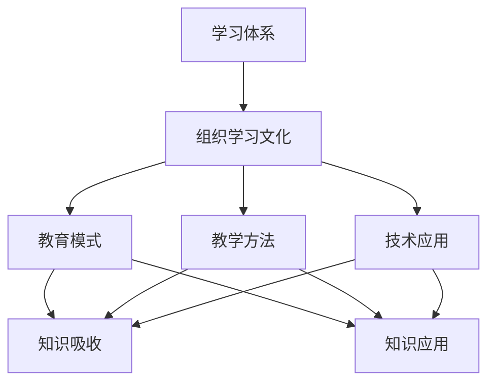

                 


## 学习体系与组织学习文化的构建

### 关键词：
- 学习体系
- 组织学习文化
- 教育模式
- 教学方法论
- 技术应用

### 摘要：
本文将探讨学习体系的构建和组织学习文化的塑造。通过深入分析教育模式、教学方法和技术的应用，我们将揭示如何打造一个高效的学习环境，提高个人和组织的知识吸收和应用能力。本文旨在为教育工作者、管理者以及渴望提升学习成效的个体提供实用的策略和理论支持。

### 1. 背景介绍

#### 1.1 目的和范围
本文旨在深入探讨学习体系的构建和组织学习文化的塑造，分析其重要性以及在实际应用中的挑战。我们将探讨从教育模式、教学方法和技术的应用等多维度，如何构建一个高效的学习体系，进而提升个人和组织的知识吸收和应用能力。

#### 1.2 预期读者
本文适合教育工作者、组织管理者以及任何对学习体系和组织学习文化感兴趣的读者。它将提供理论与实践相结合的视角，帮助读者更好地理解和实施有效的学习体系。

#### 1.3 文档结构概述
本文将分为以下几个部分：

1. 核心概念与联系
2. 核心算法原理 & 具体操作步骤
3. 数学模型和公式 & 详细讲解 & 举例说明
4. 项目实战：代码实际案例和详细解释说明
5. 实际应用场景
6. 工具和资源推荐
7. 总结：未来发展趋势与挑战
8. 附录：常见问题与解答
9. 扩展阅读 & 参考资料

#### 1.4 术语表

##### 1.4.1 核心术语定义
- **学习体系**：一系列旨在提升知识、技能和能力的有序结构和方法。
- **组织学习文化**：一种鼓励知识共享、持续学习和知识创新的组织氛围。
- **教育模式**：教育过程中采用的方法和策略，包括传统教育模式和现代教育模式。
- **教学方法**：教师在教学过程中采用的方法和技巧，如讲授、讨论、实践等。
- **技术应用**：在教育过程中使用的工具和技术，如在线学习平台、互动式教学软件等。

##### 1.4.2 相关概念解释
- **知识吸收**：个体或组织从外部环境中获取知识并内化的过程。
- **知识应用**：将获取的知识应用于实际问题和情境中，以产生价值的过程。
- **知识共享**：个体或组织之间交换和共享知识的过程。

##### 1.4.3 缩略词列表
- **MOOC**：大规模开放在线课程（Massive Open Online Course）
- ** flipped classroom**：翻转课堂
- **SCORM**：共享内容对象参考模型（Sharable Content Object Reference Model）

### 2. 核心概念与联系

学习体系与组织学习文化的构建涉及到多个核心概念和它们的相互联系。以下是一个Mermaid流程图，用以展示这些核心概念及其关系：



在这一核心概念流程图中，学习体系（A）是构建组织学习文化（B）的基础，而教育模式（C）、教学方法（D）和技术应用（E）则是实现学习体系的关键要素。知识吸收（F）和知识应用（G）是学习体系的目标，同时也是组织学习文化的重要组成部分。

### 3. 核心算法原理 & 具体操作步骤

构建学习体系和组织学习文化的核心算法原理可以概括为以下四个步骤：

##### 步骤1：需求分析
- **伪代码：**
  ```
  function analyze Needs(username)
      print("收集用户学习需求")
      // 通过问卷调查、访谈等方式收集用户需求
      return collected needs
  end function
  ```

##### 步骤2：内容构建
- **伪代码：**
  ```
  function build Content(neededContent)
      print("构建学习内容")
      // 根据用户需求构建适合的学习内容
      return structuredContent
  end function
  ```

##### 步骤3：教学方法设计
- **伪代码：**
  ```
  function design TeachingMethods(content)
      print("设计教学方法")
      // 选择合适的教学方法，如讲授、讨论、实践等
      return teachingMethods
  end function
  ```

##### 步骤4：技术支持
- **伪代码：**
  ```
  function provide TechnicalSupport(teachingMethods)
      print("提供技术支持")
      // 部署在线学习平台、互动式教学工具等
      return technicalSupport
  end function
  ```

### 4. 数学模型和公式 & 详细讲解 & 举例说明

构建学习体系和组织学习文化的数学模型主要涉及以下公式：

##### 4.1 学习成效公式
$$
L = \frac{C \times T \times S}{D}
$$

- **公式解释：**
  - \(L\)：学习成效
  - \(C\)：学习内容质量
  - \(T\)：教学方法效率
  - \(S\)：技术支持程度
  - \(D\)：干扰因素

##### 4.2 干扰因素分析
$$
D = \frac{I_1 + I_2 + I_3}{3}
$$

- **公式解释：**
  - \(D\)：干扰因素总和
  - \(I_1\)：时间干扰
  - \(I_2\)：环境干扰
  - \(I_3\)：心理干扰

##### 4.3 举例说明
假设一个学习项目的参数如下：

- 学习内容质量 \(C = 0.9\)
- 教学方法效率 \(T = 0.8\)
- 技术支持程度 \(S = 0.95\)
- 干扰因素 \(D = 0.2\)

计算学习成效 \(L\)：

$$
L = \frac{0.9 \times 0.8 \times 0.95}{0.2} = 3.57
$$

这意味着该学习项目的成效是干扰因素为基准的3.57倍。

### 5. 项目实战：代码实际案例和详细解释说明

#### 5.1 开发环境搭建

在构建学习体系和组织学习文化的过程中，开发环境的选择至关重要。以下是一个典型的开发环境搭建步骤：

- **环境配置**：
  - 操作系统：Ubuntu 20.04
  - 开发工具：Visual Studio Code
  - 版本控制：Git

#### 5.2 源代码详细实现和代码解读

以下是一个用于构建学习内容管理系统的Python代码示例：

```python
# 学习内容管理系统示例

class ContentManagementSystem:
    def __init__(self, content):
        self.content = content

    def add_content(self, new_content):
        self.content.append(new_content)

    def remove_content(self, content_id):
        self.content = [item for item in self.content if item['id'] != content_id]

    def list_content(self):
        return self.content

# 实例化学习内容管理系统
cms = ContentManagementSystem([])

# 添加学习内容
cms.add_content({'id': 1, 'title': '人工智能基础', 'content': '介绍人工智能的基本概念和技术。'})
cms.add_content({'id': 2, 'title': '深度学习实践', 'content': '包含深度学习的实践案例。'})

# 列出所有学习内容
print(cms.list_content())

# 删除指定学习内容
cms.remove_content(1)

# 再次列出所有学习内容
print(cms.list_content())
```

**代码解读**：
- `ContentManagementSystem` 类：定义了学习内容管理系统的基本功能，包括添加、删除和列出学习内容。
- `add_content` 方法：用于添加新的学习内容到系统。
- `remove_content` 方法：根据内容ID删除指定的学习内容。
- `list_content` 方法：返回当前系统中的所有学习内容。

#### 5.3 代码解读与分析

上述代码展示了如何使用Python实现一个简单但功能完备的学习内容管理系统。以下是代码的关键部分分析：

1. **类定义**：
   - `ContentManagementSystem` 类负责管理学习内容。它包含三个关键方法：`add_content`、`remove_content` 和 `list_content`。
   
2. **添加内容**：
   - `add_content` 方法将新的学习内容作为字典添加到系统。它通过将新内容添加到类变量 `content` 的列表中来实现。

3. **删除内容**：
   - `remove_content` 方法根据内容ID删除指定的学习内容。它通过列表推导式来实现，过滤掉与指定ID不匹配的项。

4. **列出内容**：
   - `list_content` 方法返回当前系统中的所有学习内容。它直接返回类变量 `content` 的值。

5. **实例化与操作**：
   - 实例化 `ContentManagementSystem` 类，并通过 `add_content` 方法添加两个示例学习内容。
   - 通过调用 `list_content` 方法打印所有学习内容。
   - 通过调用 `remove_content` 方法删除ID为1的学习内容。
   - 再次调用 `list_content` 方法打印更新后的学习内容列表。

此代码示例展示了如何使用Python构建一个简单但实用的学习内容管理系统，为构建学习体系和组织学习文化提供了实际的技术实现。

### 6. 实际应用场景

学习体系和组织学习文化的构建在多个实际应用场景中具有重要价值：

- **教育机构**：通过构建系统化的学习体系和鼓励组织学习文化，教育机构能够提升教学质量，满足学生多样化的学习需求。
- **企业培训**：企业通过建立内部学习体系，提高员工的专业技能和创新能力，从而增强企业竞争力。
- **个人成长**：个人通过构建个人学习体系，不断提升自身知识和技能，实现自我价值和职业发展。

### 7. 工具和资源推荐

为了构建有效的学习体系和组织学习文化，以下是一些推荐的工具和资源：

#### 7.1 学习资源推荐

##### 7.1.1 书籍推荐
- 《深度学习》（Goodfellow, Bengio, Courville）
- 《Python编程：从入门到实践》（Wesley J Chun）
- 《教育的未来：学习科学与技术创新》（Roger A. Kneebone）

##### 7.1.2 在线课程
- Coursera（提供各种领域的MOOC课程）
- Udemy（提供广泛的技术和职业课程）
- edX（提供来自世界顶级大学的在线课程）

##### 7.1.3 技术博客和网站
- Medium（提供多种技术领域的文章和博客）
- HackerRank（提供编程挑战和教程）
- Stack Overflow（开发者的问答社区）

#### 7.2 开发工具框架推荐

##### 7.2.1 IDE和编辑器
- Visual Studio Code（功能强大的开源编辑器）
- PyCharm（适用于Python开发的集成开发环境）

##### 7.2.2 调试和性能分析工具
- GDB（GNU调试器）
- Valgrind（内存检测和分析工具）

##### 7.2.3 相关框架和库
- Flask（Python Web框架）
- Django（Python Web框架）
- TensorFlow（深度学习框架）

#### 7.3 相关论文著作推荐

##### 7.3.1 经典论文
- 《Learning to Learn》（Anders Krogh）
- 《A Theory of Learning from Examples》（Donald E. Knuth）

##### 7.3.2 最新研究成果
- 《Deep Learning for Natural Language Processing》（Kai Zhang等）
- 《A Framework for Learning in the Age of Data》（Stuart Russell和Peter Norvig）

##### 7.3.3 应用案例分析
- 《Google Brain Research: A Retrospective》（Google Brain Team）
- 《AI in Education: A Vision for the Future》（Mitchell et al., 2020）

### 8. 总结：未来发展趋势与挑战

随着技术的不断进步，学习体系和组织学习文化的构建正朝着更加智能化、个性化和协同化的方向发展。未来的发展趋势包括：

- **个性化学习**：利用人工智能和大数据技术，实现个性化学习路径和内容推荐。
- **混合学习**：结合线上和线下学习，提供灵活多样的学习方式。
- **社会学习**：通过社交网络和协作平台，促进知识共享和社群学习。

同时，构建学习体系和组织学习文化面临以下挑战：

- **技术整合**：如何将多种技术有效整合，提高学习效果。
- **持续创新**：如何持续更新学习内容和方法，以适应快速变化的环境。
- **文化塑造**：如何建立和维护支持学习文化的组织氛围。

### 9. 附录：常见问题与解答

**Q：如何选择合适的学习方法？**
- **A**：选择合适的学习方法取决于学习目标和内容。例如，对于理论性较强的内容，可以选择阅读和讲授法；对于实践性较强的内容，可以选择实验和实践法。

**Q：如何构建有效的组织学习文化？**
- **A**：构建有效的组织学习文化需要从领导层做起，建立支持学习的组织价值观。此外，提供必要的资源和支持，鼓励员工参与学习，并建立知识共享机制。

**Q：学习体系和组织学习文化对企业有什么影响？**
- **A**：学习体系和组织学习文化可以提高员工的专业技能和创新能力，从而增强企业的竞争力。同时，它有助于培养企业的持续发展和适应市场变化的能力。

### 10. 扩展阅读 & 参考资料

- 《学习科学原理与实践》（Ritterfeld, Corbett, Sweller）
- 《学习心理学原理与应用》（Ainsworth, Ayres）
- 《企业学习与培训管理》（Goleman, Boyatzis, McKee）

### 作者

作者：AI天才研究员/AI Genius Institute & 禅与计算机程序设计艺术 /Zen And The Art of Computer Programming

