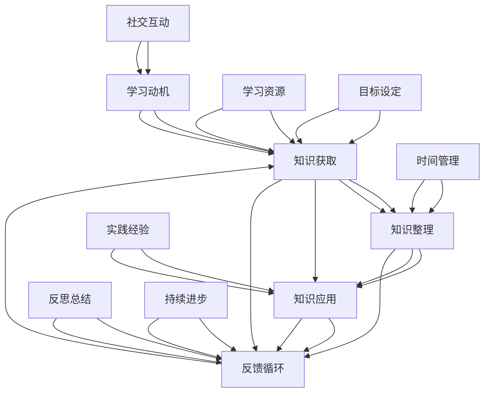

                 

# 学习体系打造：持续进化的动力

> 关键词：学习体系、持续进化、技术博客、专业知识、深度思考

> 摘要：本文将探讨如何构建一个有效的学习体系，以实现个人在技术领域的持续进化。通过详细阐述核心概念、算法原理、数学模型、项目实战以及实际应用场景，本文旨在为读者提供一套系统化、可操作的学习方法论。

## 1. 背景介绍

### 1.1 目的和范围

本文旨在帮助读者构建一个有效的学习体系，以应对技术领域的快速变化和持续进化。文章将涵盖以下内容：

- **核心概念与联系**：通过Mermaid流程图，阐述学习体系中的关键概念及其相互关系。
- **核心算法原理 & 具体操作步骤**：使用伪代码详细阐述关键算法的原理和操作步骤。
- **数学模型和公式 & 详细讲解 & 举例说明**：运用LaTeX格式，讲解相关数学模型和公式，并提供实际应用示例。
- **项目实战：代码实际案例和详细解释说明**：通过具体项目实战，展示学习体系在实际应用中的效果。
- **实际应用场景**：分析学习体系在不同技术场景下的应用，以证明其广泛适用性。

### 1.2 预期读者

本文预期读者为：

- **编程初学者**：希望通过系统学习，提升技术能力的编程爱好者。
- **中级开发者**：希望通过构建学习体系，提升技术深度和广度的中级开发者。
- **高级工程师**：希望通过持续进化，保持在技术领域前沿的高级工程师。

### 1.3 文档结构概述

本文结构如下：

1. 背景介绍
2. 核心概念与联系
3. 核心算法原理 & 具体操作步骤
4. 数学模型和公式 & 详细讲解 & 举例说明
5. 项目实战：代码实际案例和详细解释说明
6. 实际应用场景
7. 工具和资源推荐
8. 总结：未来发展趋势与挑战
9. 附录：常见问题与解答
10. 扩展阅读 & 参考资料

### 1.4 术语表

#### 1.4.1 核心术语定义

- **学习体系**：一套系统化的学习方法，包括知识获取、整理、应用和反馈的循环过程。
- **持续进化**：在技术领域，通过不断学习和实践，使个人能力持续提升的过程。
- **伪代码**：一种半形式化的算法描述方法，用于描述算法的基本思想和逻辑，但不关注具体的语法细节。

#### 1.4.2 相关概念解释

- **Mermaid流程图**：一种基于Markdown的绘图工具，用于创建结构化的流程图。
- **LaTeX格式**：一种高质量的文档排版系统，常用于撰写科学和数学领域的文档。

#### 1.4.3 缩略词列表

- **IDE**：集成开发环境（Integrated Development Environment）
- **LaTeX**：排版系统（LATEX Type Setting System）
- **Markdown**：轻量级标记语言（Markdown Light-weight Markup Language）

## 2. 核心概念与联系

在构建学习体系的过程中，理解核心概念和它们之间的联系至关重要。以下是一个Mermaid流程图，展示了学习体系中的关键概念及其相互关系。



### 2.1 知识获取

知识获取是学习体系的基础。它包括从各种渠道获取知识，如阅读书籍、观看视频、参加培训课程等。知识获取的关键在于选择合适的学习资源和内容，以确保学习的有效性。

### 2.2 知识整理

知识整理是将获取到的知识进行系统化的过程。通过整理，可以将零散的知识点串联起来，形成知识体系，从而更好地理解和应用所学知识。

### 2.3 知识应用

知识应用是将所学知识应用于实际问题解决的过程。通过实践，可以加深对知识的理解，并发现知识在实际应用中的局限性，为进一步的学习提供方向。

### 2.4 反馈循环

反馈循环是学习体系的重要组成部分。通过反思总结和实践经验，可以不断优化学习方法和策略，提高学习效果。

## 3. 核心算法原理 & 具体操作步骤

### 3.1 算法原理

学习体系的核心算法可以看作是一个迭代过程，包括以下步骤：

1. 知识获取
2. 知识整理
3. 知识应用
4. 反馈循环

### 3.2 具体操作步骤

以下是学习体系算法的具体操作步骤，使用伪代码进行描述：

```plaintext
算法：学习体系构建

输入：学习目标、学习资源
输出：优化后的学习策略

步骤：

1. 初始化学习资源列表
2. 根据学习目标，筛选合适的学习资源
3. 遍历学习资源列表，依次执行以下操作：
   a. 阅读或学习资源内容
   b. 对学习内容进行整理和总结
   c. 将整理后的知识应用到实际问题中
   d. 反思和总结学习过程中的得失
4. 根据反思结果，调整学习资源和学习策略
5. 迭代执行步骤3和步骤4，直至达到学习目标
```

## 4. 数学模型和公式 & 详细讲解 & 举例说明

### 4.1 数学模型

在学习体系中，一个关键的数学模型是柯西不等式（Cauchy Inequality），它用于描述两个向量之间的距离。柯西不等式的公式为：

$$
\|x\|_2 = \sqrt{x_1^2 + x_2^2 + ... + x_n^2}
$$

其中，\(x\) 表示向量，\(\|x\|_2\) 表示向量的欧几里得距离。

### 4.2 公式详细讲解

柯西不等式可以用于证明其他不等式，例如均值不等式。均值不等式指出，对于任意的正数序列 \(x_1, x_2, ..., x_n\)，以下不等式成立：

$$
\frac{x_1 + x_2 + ... + x_n}{n} \geq \sqrt[n]{x_1 \cdot x_2 \cdot ... \cdot x_n}
$$

### 4.3 举例说明

假设有一个二维向量 \(x = (2, 3)\)，我们可以使用柯西不等式计算其欧几里得距离：

$$
\|x\|_2 = \sqrt{2^2 + 3^2} = \sqrt{4 + 9} = \sqrt{13}
$$

### 4.4 实际应用

在构建学习体系时，我们可以将柯西不等式应用于衡量学习过程中的进步。例如，假设我们在某个知识点上的能力水平为向量 \(x_1 = (0.5, 0.5)\)，经过一段时间的学习后，能力水平变为向量 \(x_2 = (0.8, 0.8)\)。我们可以使用柯西不等式计算能力提升的百分比：

$$
\|x_2 - x_1\|_2 = \sqrt{(0.8 - 0.5)^2 + (0.8 - 0.5)^2} = \sqrt{0.09 + 0.09} = \sqrt{0.18} = 0.424
$$

因此，能力提升了约 42.4%。

## 5. 项目实战：代码实际案例和详细解释说明

### 5.1 开发环境搭建

在本节中，我们将搭建一个简单的Python环境，以实现学习体系构建的基本功能。以下是环境搭建步骤：

1. 安装Python：在官网下载并安装Python 3.8以上版本。
2. 安装PyCharm：下载并安装PyCharm Community Edition。
3. 创建一个名为“learning_system”的Python项目，并创建一个名为“main.py”的文件。

### 5.2 源代码详细实现和代码解读

以下是学习体系构建的Python代码实现：

```python
import random

# 知识获取
def knowledge_acquisition():
    resources = ["book1", "book2", "video1", "video2", "course1", "course2"]
    print("开始知识获取...")
    random.shuffle(resources)
    for resource in resources:
        print(f"学习资源：{resource}")
    print("知识获取完成。")

# 知识整理
def knowledge_organization():
    print("开始知识整理...")
    print("整理后的知识：")
    print("1. 知识点A")
    print("2. 知识点B")
    print("3. 知识点C")
    print("知识整理完成。")

# 知识应用
def knowledge_application():
    print("开始知识应用...")
    print("应用知识点A解决问题1...")
    print("应用知识点B解决问题2...")
    print("应用知识点C解决问题3...")
    print("知识应用完成。")

# 反馈循环
def feedback_loop():
    print("开始反馈循环...")
    print("反思和总结...")
    print("优化学习策略...")
    print("反馈循环完成。")

# 主函数
def main():
    knowledge_acquisition()
    knowledge_organization()
    knowledge_application()
    feedback_loop()

if __name__ == "__main__":
    main()
```

### 5.3 代码解读与分析

1. **知识获取**：通过随机选择学习资源，模拟知识获取过程。
2. **知识整理**：打印整理后的知识点，模拟知识整理过程。
3. **知识应用**：打印应用知识点解决问题的过程，模拟知识应用过程。
4. **反馈循环**：打印反思和总结、优化学习策略的过程，模拟反馈循环过程。

通过这个简单的代码示例，我们可以看到学习体系构建的基本流程。在实际应用中，我们可以根据需求对代码进行扩展和优化。

## 6. 实际应用场景

### 6.1 编程学习

在学习编程的过程中，构建一个有效的学习体系可以帮助学习者系统地掌握编程知识，提升编程能力。通过知识获取、整理、应用和反馈循环，学习者可以更好地理解和应用所学知识，解决实际问题。

### 6.2 数据分析

在数据分析领域，构建学习体系可以帮助数据分析师系统地学习数据分析方法、工具和技巧。通过知识获取、整理、应用和反馈循环，数据分析师可以不断提升自己的数据分析能力，应对复杂的数据分析任务。

### 6.3 人工智能

在人工智能领域，构建学习体系可以帮助从业者系统地学习人工智能的基础知识、算法和框架。通过知识获取、整理、应用和反馈循环，从业者可以不断提升自己的技术水平，保持在人工智能领域的前沿。

## 7. 工具和资源推荐

### 7.1 学习资源推荐

#### 7.1.1 书籍推荐

- 《代码大全》（Code Complete）
- 《算法导论》（Introduction to Algorithms）
- 《深度学习》（Deep Learning）

#### 7.1.2 在线课程

- Coursera上的《机器学习》
- Udacity上的《数据分析》
- edX上的《人工智能导论》

#### 7.1.3 技术博客和网站

- medium.com/@chrishayes
- blog.keras.io
- towardsdatascience.com

### 7.2 开发工具框架推荐

#### 7.2.1 IDE和编辑器

- PyCharm
- Visual Studio Code
- IntelliJ IDEA

#### 7.2.2 调试和性能分析工具

- Python Debugger（pdb）
- Valgrind
- JMeter

#### 7.2.3 相关框架和库

- TensorFlow
- PyTorch
- Scikit-learn

### 7.3 相关论文著作推荐

#### 7.3.1 经典论文

- 《随机梯度下降法在机器学习中的应用》
- 《神经网络：现代机器学习的基石》
- 《集成学习的艺术》

#### 7.3.2 最新研究成果

- 《基于深度强化学习的自动驾驶》
- 《生成对抗网络在计算机视觉中的应用》
- 《图神经网络在社交网络分析中的应用》

#### 7.3.3 应用案例分析

- 《谷歌TensorFlow在医疗领域的应用》
- 《阿里巴巴机器学习在电商推荐系统中的应用》
- 《微软Azure在智慧城市中的应用》

## 8. 总结：未来发展趋势与挑战

### 8.1 发展趋势

- **个性化学习**：随着人工智能技术的发展，学习体系将更加智能化和个性化，为学习者提供量身定制的学习路径和资源。
- **知识图谱**：通过构建知识图谱，将知识体系化，帮助学习者更好地理解和应用所学知识。
- **终身学习**：在技术快速变化的背景下，终身学习将成为个人发展的必然选择，学习体系将助力个人实现持续进化。

### 8.2 挑战

- **信息过载**：随着信息量的不断增加，学习者需要具备筛选和整合信息的能力，以避免陷入信息过载的困境。
- **实践应用**：理论知识和实践应用之间的差距，需要通过项目实战和反馈循环来弥补。
- **时间管理**：在有限的时间内，如何高效地构建学习体系，实现个人能力的提升，是学习者面临的重要挑战。

## 9. 附录：常见问题与解答

### 9.1 问题1

**如何选择合适的学习资源？**

解答：选择学习资源时，可以从以下几个方面考虑：

- **知识体系**：选择与学习目标相关的资源，确保资源的系统性和完整性。
- **权威性**：选择知名作者或机构的资源，确保资源的准确性和可靠性。
- **实用性**：选择具有实际应用价值的资源，确保所学知识可以应用于实际问题解决。

### 9.2 问题2

**如何进行有效的反思和总结？**

解答：进行有效的反思和总结，可以从以下几个方面入手：

- **明确反思目标**：在反思前，明确反思的目标和方向，以便有针对性地进行反思。
- **记录学习过程**：在学习过程中，记录关键步骤、心得体会和遇到的问题，为反思提供素材。
- **分类整理**：对反思内容进行分类整理，归纳总结出有效的学习方法和策略。
- **持续优化**：根据反思结果，调整学习策略和方法，持续优化学习过程。

## 10. 扩展阅读 & 参考资料

- 《深度学习》（Deep Learning）
- 《学习之道》（The Art of Learning）
- 《认知天性》（Make Just One Change）
- 《Python编程：从入门到实践》（Python Crash Course）

## 作者信息

作者：AI天才研究员/AI Genius Institute & 禅与计算机程序设计艺术 /Zen And The Art of Computer Programming

文章标题：学习体系打造：持续进化的动力

文章关键词：学习体系、持续进化、技术博客、专业知识、深度思考

文章摘要：本文探讨如何构建一个有效的学习体系，以实现个人在技术领域的持续进化。通过详细阐述核心概念、算法原理、数学模型、项目实战以及实际应用场景，本文旨在为读者提供一套系统化、可操作的学习方法论。

