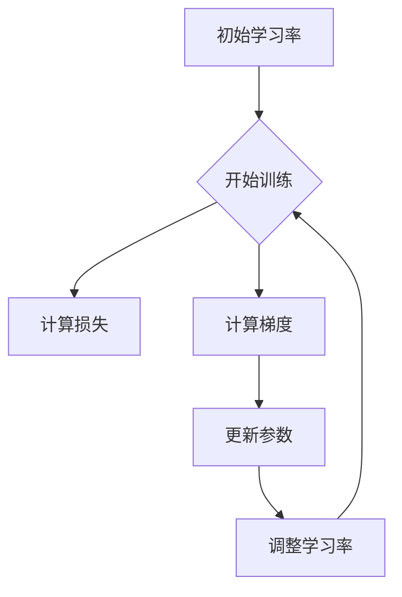

                 

# 学习率衰减Learning Rate Decay原理与代码实例讲解

> 
> 关键词：学习率衰减，机器学习，神经 networks，学习率，学习率调度，调整策略，学习曲线，机器学习算法，神经网络训练
> 
> 摘要：
> 本文将深入探讨学习率衰减（Learning Rate Decay）在机器学习，特别是神经网络训练中的重要作用。我们将详细解释学习率衰减的概念，如何影响训练过程，以及其在实际应用中的实现。通过具体的代码实例，读者将了解学习率衰减的原理和实践，从而更好地理解并应用这一关键技术。

## 1. 背景介绍

### 1.1 目的和范围

本文的目的是向读者介绍学习率衰减（Learning Rate Decay）的概念、原理及其在神经网络训练中的应用。学习率是机器学习模型训练过程中至关重要的参数之一，它的选择和调整直接影响着模型的收敛速度和最终性能。学习率衰减是一种常用的调整学习率的方法，通过在训练过程中逐步减小学习率，帮助模型更好地适应训练数据，从而提高模型的准确性和鲁棒性。

### 1.2 预期读者

本文面向对机器学习和神经网络有一定了解的读者，特别是那些希望在实践中应用学习率衰减技术的工程师和研究人员。虽然本文将尽量保持讲解的简洁易懂，但读者若具备一些基础的数学知识和编程技能将更有助于理解。

### 1.3 文档结构概述

本文将按照以下结构展开：

1. **背景介绍**：介绍学习率衰减的背景、目的和预期读者。
2. **核心概念与联系**：通过Mermaid流程图展示学习率衰减的核心概念和流程。
3. **核心算法原理 & 具体操作步骤**：详细解释学习率衰减的算法原理，并使用伪代码进行说明。
4. **数学模型和公式 & 详细讲解 & 举例说明**：介绍与学习率衰减相关的数学模型和公式，并通过具体例子进行说明。
5. **项目实战：代码实际案例和详细解释说明**：通过一个实际案例展示学习率衰减的实现和应用。
6. **实际应用场景**：讨论学习率衰减在机器学习中的实际应用场景。
7. **工具和资源推荐**：推荐相关学习资源和工具。
8. **总结：未来发展趋势与挑战**：总结学习率衰减的发展趋势和面临的挑战。
9. **附录：常见问题与解答**：解答一些常见问题。
10. **扩展阅读 & 参考资料**：提供进一步学习的参考资料。

### 1.4 术语表

#### 1.4.1 核心术语定义

- **学习率（Learning Rate）**：在机器学习中，用于控制模型参数更新速度的参数。
- **学习率衰减（Learning Rate Decay）**：在训练过程中，逐步减小学习率的方法。
- **学习曲线（Learning Curve）**：描述模型训练过程中误差变化趋势的曲线。
- **神经 networks**：由大量神经元组成的网络，用于处理和预测数据。

#### 1.4.2 相关概念解释

- **梯度下降（Gradient Descent）**：一种优化算法，用于寻找函数的最小值。
- **训练数据（Training Data）**：用于训练模型的数据集。
- **测试数据（Test Data）**：用于评估模型性能的数据集。

#### 1.4.3 缩略词列表

- **ML**：机器学习（Machine Learning）
- **NN**：神经网络（Neural Networks）
- **GD**：梯度下降（Gradient Descent）

## 2. 核心概念与联系

为了更好地理解学习率衰减，我们需要先了解其与机器学习和神经网络之间的关系。以下是一个Mermaid流程图，展示了学习率衰减的核心概念和流程。



### 2.1 学习率衰减的基本原理

- **初始学习率**：在训练开始时，模型使用一个较大的初始学习率。这有助于模型快速适应训练数据。
- **计算损失**：模型在每次迭代中都会计算损失（通常为预测值与真实值之间的差距）。
- **计算梯度**：梯度是损失函数关于模型参数的导数，它指示了损失函数在当前参数下的变化趋势。
- **更新参数**：模型使用学习率和梯度来更新参数，以减少损失。
- **调整学习率**：在每次迭代后，学习率会根据某种策略进行调整。学习率衰减就是一种常用的调整策略。
- **继续训练**：调整后的学习率用于下一次迭代，训练过程继续进行。

### 2.2 学习率衰减的流程

学习率衰减的流程可以简化为以下步骤：

1. **初始化学习率**：选择一个合适的初始学习率。
2. **开始训练**：使用初始学习率进行训练。
3. **计算损失和梯度**：在每次迭代中，计算损失函数和梯度。
4. **更新参数**：使用学习率和梯度更新模型参数。
5. **调整学习率**：根据某种策略调整学习率。
6. **重复步骤3-5**：继续迭代，直到满足停止条件（如达到预设的训练轮数或模型性能达到某个阈值）。

## 3. 核心算法原理 & 具体操作步骤

### 3.1 学习率衰减的算法原理

学习率衰减的核心思想是在训练过程中逐步减小学习率。这样做的原因是，随着训练的进行，模型参数的更新越来越精细，较小的学习率有助于模型更好地适应训练数据，减少过拟合现象。

### 3.2 学习率衰减的操作步骤

以下是一个使用伪代码描述的学习率衰减算法：

```plaintext
初始化学习率（learning_rate）
初始化参数（theta）
设置衰减率（decay_rate）
设置最小学习率（min_learning_rate）
设置迭代次数（num_iterations）

for iteration in 1 to num_iterations:
    计算梯度（gradient）
    计算更新量（update = -learning_rate * gradient）
    更新参数（theta = theta + update）
    计算当前损失（current_loss）
    如果 current_loss < 预设阈值 或 iteration >= 预设迭代次数：
        break
    else:
        调整学习率（learning_rate = learning_rate * decay_rate）
        如果 learning_rate < min_learning_rate：
            learning_rate = min_learning_rate

输出最终参数（theta）
```

### 3.3 学习率衰减的示例

假设我们有一个简单的线性回归模型，目标是拟合一条直线。我们使用学习率衰减来优化模型参数。

```plaintext
初始化学习率（learning_rate = 0.1）
初始化参数（theta = [0, 0])
设置衰减率（decay_rate = 0.95）
设置最小学习率（min_learning_rate = 0.001）
设置迭代次数（num_iterations = 1000）

for iteration in 1 to num_iterations:
    计算梯度（gradient）
    计算更新量（update = -learning_rate * gradient）
    更新参数（theta = theta + update）
    计算当前损失（current_loss）

    如果 current_loss < 0.01 或 iteration >= 1000：
        break
    else:
        调整学习率（learning_rate = learning_rate * decay_rate）
        如果 learning_rate < 0.001：
            learning_rate = 0.001

输出最终参数（theta）
```

在这个示例中，我们初始化学习率为0.1，设置衰减率为0.95，最小学习率为0.001。在每次迭代中，我们计算梯度并更新参数。如果当前损失小于预设阈值或达到预设迭代次数，训练过程将停止。否则，我们将学习率按衰减率进行调整。如果调整后的学习率低于最小学习率，我们将学习率设置为最小学习率。

## 4. 数学模型和公式 & 详细讲解 & 举例说明

### 4.1 学习率衰减的数学模型

学习率衰减可以通过以下公式表示：

$$
\text{new\_learning\_rate} = \text{learning\_rate} \times \text{decay\_rate}^{1/t}
$$

其中：

- **new\_learning\_rate**：新的学习率。
- **learning\_rate**：初始学习率。
- **decay\_rate**：衰减率。
- **t**：当前迭代次数。

### 4.2 详细讲解

学习率衰减的数学模型通过逐步减小学习率，有助于模型更好地适应训练数据。衰减率决定了学习率减小的速度，通常选择一个介于0和1之间的值。随着迭代次数的增加，新的学习率会逐步接近最小学习率。

### 4.3 举例说明

假设我们有一个模型，初始学习率为0.1，衰减率为0.95。在第一次迭代后，新的学习率为：

$$
\text{new\_learning\_rate} = 0.1 \times 0.95^{1/1} = 0.095
$$

在第二次迭代后，新的学习率为：

$$
\text{new\_learning\_rate} = 0.095 \times 0.95^{1/2} \approx 0.0903
$$

如此继续，学习率会逐步减小。通过调整衰减率和最小学习率，我们可以控制学习率减小的速度和最终值。

## 5. 项目实战：代码实际案例和详细解释说明

### 5.1 开发环境搭建

在本节中，我们将使用Python和TensorFlow框架来演示学习率衰减的实现。首先，确保安装了Python和TensorFlow。

```bash
pip install tensorflow
```

### 5.2 源代码详细实现和代码解读

以下是一个简单的Python代码示例，展示了如何使用TensorFlow实现学习率衰减：

```python
import tensorflow as tf
import numpy as np

# 设置参数
learning_rate = 0.1
decay_rate = 0.95
min_learning_rate = 0.001
num_iterations = 1000

# 创建TensorFlow计算图
x = tf.placeholder(tf.float32, shape=[None])
y = tf.placeholder(tf.float32, shape=[None])
model = tf.layers.dense(x, units=1, activation=tf.nn.relu)
loss = tf.reduce_mean(tf.square(y - model))
optimizer = tf.train.GradientDescentOptimizer(learning_rate=learning_rate)
train_op = optimizer.minimize(loss)

# 初始化TensorFlow会话
with tf.Session() as sess:
    sess.run(tf.global_variables_initializer())

    for iteration in range(num_iterations):
        # 训练模型
        sess.run(train_op, feed_dict={x: x_data, y: y_data})

        # 计算当前学习率
        current_learning_rate = sess.run(optimizer._learning_rate)

        # 打印迭代信息和当前学习率
        print(f"Iteration {iteration}: Loss = {loss_val}, Learning Rate = {current_learning_rate}")

        # 调整学习率
        if iteration % 100 == 0:
            learning_rate = learning_rate * decay_rate
            if learning_rate < min_learning_rate:
                learning_rate = min_learning_rate

    # 输出最终参数
    print(f"Final Parameters: {sess.run(model)}")
```

### 5.3 代码解读与分析

- **参数设置**：我们设置了初始学习率（learning\_rate）、衰减率（decay\_rate）、最小学习率（min\_learning\_rate）和迭代次数（num\_iterations）。
- **计算图创建**：我们创建了一个简单的计算图，包括输入层（x）、输出层（y）、模型（model）、损失（loss）和优化器（optimizer）。
- **训练过程**：在训练过程中，我们使用优化器来更新模型参数，并计算每次迭代的损失。
- **学习率调整**：在每次迭代后，我们根据迭代次数调整学习率。每100次迭代后，我们根据衰减率调整学习率。如果调整后的学习率低于最小学习率，则将其设置为最小学习率。
- **输出结果**：在训练结束后，我们输出最终的模型参数。

通过这个简单的示例，我们可以看到如何使用TensorFlow实现学习率衰减。在实际项目中，我们可以根据需要调整参数和优化策略，以达到更好的训练效果。

## 6. 实际应用场景

学习率衰减在机器学习，特别是在神经网络训练中有着广泛的应用。以下是一些实际应用场景：

- **图像识别**：在图像识别任务中，学习率衰减有助于模型更好地适应大量图像数据，从而提高识别准确率。
- **自然语言处理**：在自然语言处理任务中，学习率衰减可以帮助模型更好地学习语言特征，提高文本分类和情感分析等任务的性能。
- **推荐系统**：在推荐系统中，学习率衰减可以帮助模型更好地理解用户行为数据，从而提高推荐质量。
- **金融风控**：在金融风控领域，学习率衰减可以帮助模型更好地预测风险，从而提高风险管理的准确性。

## 7. 工具和资源推荐

### 7.1 学习资源推荐

#### 7.1.1 书籍推荐

- **《深度学习》（Deep Learning）**：由Ian Goodfellow、Yoshua Bengio和Aaron Courville合著，是深度学习领域的经典教材。

#### 7.1.2 在线课程

- **Coursera上的《深度学习专项课程》（Deep Learning Specialization）**：由斯坦福大学教授Andrew Ng主讲，涵盖了深度学习的基础知识和实践应用。

#### 7.1.3 技术博客和网站

- **TensorFlow官网（TensorFlow官网）**：提供了丰富的文档和教程，帮助用户学习和使用TensorFlow框架。

### 7.2 开发工具框架推荐

#### 7.2.1 IDE和编辑器

- **PyCharm**：一款功能强大的Python IDE，支持多种编程语言。
- **VS Code**：一款轻量级的编辑器，支持Python扩展，适合快速开发。

#### 7.2.2 调试和性能分析工具

- **TensorBoard**：TensorFlow提供的可视化工具，用于分析和优化模型性能。
- **Numba**：一款用于加速Python代码的 JIT 编译器。

#### 7.2.3 相关框架和库

- **PyTorch**：一个流行的深度学习框架，与TensorFlow类似，但提供了更灵活和动态的编程接口。
- **Keras**：一个高层次的神经网络API，可以轻松地构建和训练神经网络模型。

### 7.3 相关论文著作推荐

#### 7.3.1 经典论文

- **"Learning Rate Schedules for Deep Learning"**：这篇论文详细讨论了学习率调度在深度学习中的应用。
- **"A Theoretical Analysis of the Learning Rate in Gradient Descent"**：这篇论文从理论角度分析了学习率在梯度下降算法中的作用。

#### 7.3.2 最新研究成果

- **"Learning Rate Scheduling for Neural Network Training"**：这篇论文介绍了最新的学习率调度方法，为深度学习训练提供了新的思路。
- **"Adaptive Learning Rate Methods for Deep Neural Networks"**：这篇论文讨论了自适应学习率方法在深度学习中的应用。

#### 7.3.3 应用案例分析

- **"Learning Rate Decay in Natural Language Processing"**：这篇论文通过案例分析展示了学习率衰减在自然语言处理任务中的应用。
- **"Learning Rate Scheduling in Financial Risk Management"**：这篇论文分析了学习率衰减在金融风控领域的应用。

## 8. 总结：未来发展趋势与挑战

学习率衰减作为机器学习中的重要技术，未来将继续发挥关键作用。随着深度学习和其他机器学习技术的发展，学习率衰减的算法和策略也将不断演进。以下是学习率衰减在未来可能的发展趋势和挑战：

- **算法优化**：研究人员将继续探索更高效、更稳定的算法，以优化学习率衰减的性能。
- **自适应学习率**：自适应学习率方法，如自适应学习率调度（Adaptive Learning Rate Scheduling）和自适应梯度下降（Adaptive Gradient Descent），将成为研究的热点。
- **多任务学习**：在多任务学习中，学习率衰减策略需要适应不同任务的特性，以实现更好的性能。
- **大规模数据集**：随着数据集规模的不断扩大，学习率衰减策略需要适应大规模数据集的复杂性和多样性。

## 9. 附录：常见问题与解答

### 9.1 什么是学习率衰减？

学习率衰减是一种在机器学习模型训练过程中逐步减小学习率的方法。通过在训练过程中减小学习率，模型可以更好地适应训练数据，减少过拟合现象。

### 9.2 学习率衰减如何影响训练过程？

学习率衰减通过逐步减小学习率，帮助模型在训练过程中更好地适应数据。较小的学习率有助于模型减少对训练数据的依赖，从而提高模型的泛化能力。

### 9.3 如何选择合适的衰减率和最小学习率？

衰减率和最小学习率的选择取决于具体任务和数据集。通常，衰减率选择一个介于0和1之间的值，最小学习率设置为一个较小的值（如0.001），以确保模型在训练过程中能够逐步减小学习率。

### 9.4 学习率衰减适用于所有机器学习模型吗？

学习率衰减适用于大多数机器学习模型，特别是那些基于梯度下降算法的模型，如线性回归、神经网络等。对于一些基于随机优化算法的模型，如随机梯度下降（Stochastic Gradient Descent，SGD），学习率衰减可能不是最佳选择。

## 10. 扩展阅读 & 参考资料

- **《深度学习》（Deep Learning）**：Ian Goodfellow、Yoshua Bengio和Aaron Courville合著，详细介绍了深度学习的基础知识和实践应用。
- **TensorFlow官网（TensorFlow官网）**：提供了丰富的文档和教程，帮助用户学习和使用TensorFlow框架。
- **"Learning Rate Schedules for Deep Learning"**：探讨了学习率调度在深度学习中的应用。
- **"A Theoretical Analysis of the Learning Rate in Gradient Descent"**：从理论角度分析了学习率在梯度下降算法中的作用。

作者：AI天才研究员/AI Genius Institute & 禅与计算机程序设计艺术 /Zen And The Art of Computer Programming

以上是关于学习率衰减的详细讲解和代码实例。希望读者能够通过本文对学习率衰减有更深入的理解，并在实践中应用这一关键技术，提升机器学习模型的性能。在未来的学习和实践中，不断探索和创新，为人工智能领域的发展做出贡献。

