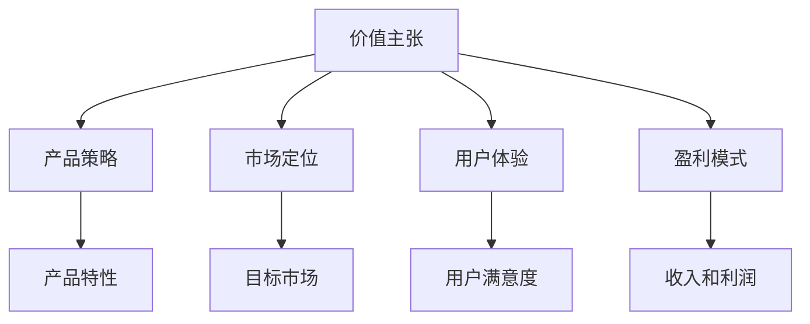

                 

# 定义产品或服务的价值主张

> 关键词：价值主张、产品策略、市场定位、用户体验、盈利模式

> 摘要：本文将深入探讨如何定义产品或服务的价值主张。通过分析市场需求、用户痛点、竞争对手和自身优势，我们将逐步构建一个清晰、有吸引力的价值主张，以实现产品的成功上市和持续发展。

## 1. 背景介绍

### 1.1 目的和范围

本文旨在为产品经理、创业者和开发者提供一套系统化的方法，用于定义产品或服务的价值主张。通过本文的阅读，读者将能够：

1. 理解价值主张的概念和重要性。
2. 掌握分析市场需求、用户痛点、竞争对手和自身优势的方法。
3. 学习如何构建一个具有吸引力的价值主张。
4. 获得实际操作中的指导和建议。

### 1.2 预期读者

本文主要面向以下读者群体：

1. 初创公司的产品经理和创始人。
2. 想要提升产品市场表现的开发者和运营人员。
3. 对产品策略和市场营销感兴趣的技术爱好者。

### 1.3 文档结构概述

本文将分为以下几个部分：

1. 背景介绍：介绍本文的目的、预期读者和文档结构。
2. 核心概念与联系：阐述价值主张的核心概念和相关联系。
3. 核心算法原理 & 具体操作步骤：详细讲解如何分析市场需求、用户痛点、竞争对手和自身优势。
4. 数学模型和公式 & 详细讲解 & 举例说明：介绍如何使用数学模型和公式构建价值主张。
5. 项目实战：通过实际案例展示如何定义价值主张。
6. 实际应用场景：探讨价值主张在不同场景中的应用。
7. 工具和资源推荐：推荐学习资源和开发工具。
8. 总结：总结未来发展趋势与挑战。
9. 附录：常见问题与解答。
10. 扩展阅读 & 参考资料：提供更多相关资料和参考文献。

### 1.4 术语表

#### 1.4.1 核心术语定义

1. **价值主张（Value Proposition）**：企业或产品向顾客提供的独特价值和利益，用以解决顾客的问题或满足顾客的需求。
2. **市场需求（Market Demand）**：消费者对某一产品或服务的需求程度和愿意支付的价格。
3. **用户痛点（User Pain Points）**：用户在使用产品或服务过程中遇到的问题和不满。
4. **竞争对手（Competitive Analysis）**：对市场上的竞争对手进行分析，了解他们的优势和劣势。
5. **自身优势（Unique Selling Proposition，USP）**：企业或产品在市场上具有的独特优势。

#### 1.4.2 相关概念解释

1. **产品策略（Product Strategy）**：企业为满足市场需求和实现商业目标而制定的产品规划。
2. **市场定位（Market Positioning）**：企业根据自身优势和市场特点，为产品或服务在市场中的定位和形象设计。
3. **用户体验（User Experience，UX）**：用户在使用产品或服务过程中的感受和体验。
4. **盈利模式（Business Model）**：企业通过提供产品或服务获取收入的方式。

#### 1.4.3 缩略词列表

- **USP**：Unique Selling Proposition（独特卖点）
- **UX**：User Experience（用户体验）
- **IoT**：Internet of Things（物联网）
- **AI**：Artificial Intelligence（人工智能）
- **SaaS**：Software as a Service（软件即服务）

## 2. 核心概念与联系

### 2.1 价值主张的概念与重要性

价值主张是企业或产品与顾客之间的一种“交易”。它明确地传达了产品或服务如何满足顾客的需求，解决顾客的问题，以及为何顾客应该选择该产品或服务。

一个良好的价值主张应该具备以下几个特点：

1. **清晰性**：简洁明了地传达产品或服务的价值。
2. **独特性**：凸显产品或服务的独特优势。
3. **相关性**：紧密关联顾客的需求和痛点。
4. **可信度**：基于事实和数据支撑，具有说服力。

### 2.2 价值主张与其他概念的关联

#### 2.2.1 与产品策略的关系

产品策略是企业为实现长期目标而制定的产品规划。价值主张是产品策略的核心部分，它指导着产品开发和市场营销的方向。

- **价值主张** → **产品特性** → **市场定位** → **产品策略**

#### 2.2.2 与市场定位的关系

市场定位是企业为产品或服务在市场中的定位和形象设计。一个明确的价值主张有助于企业更好地定位产品，满足目标市场的需求。

- **价值主张** → **市场定位** → **目标市场** → **市场份额**

#### 2.2.3 与用户体验的关系

用户体验是用户在使用产品或服务过程中的感受和体验。价值主张直接影响用户体验，一个优秀的产品价值主张能够为用户提供卓越的体验。

- **价值主张** → **产品特性** → **用户体验** → **用户满意度**

#### 2.2.4 与盈利模式的关系

盈利模式是企业通过提供产品或服务获取收入的方式。价值主张有助于企业确定盈利模式，提高收入和利润。

- **价值主张** → **产品特性** → **市场定价** → **盈利模式**

### 2.3 核心概念原理和架构的 Mermaid 流程图



## 3. 核心算法原理 & 具体操作步骤

### 3.1 分析市场需求

分析市场需求是构建价值主张的第一步。通过了解目标市场的需求，我们可以更好地满足用户需求，从而提高产品的竞争力。

**步骤 1**：确定目标市场

- **方法**：通过市场调研、用户调查、行业报告等途径获取目标市场信息。

**步骤 2**：分析市场需求

- **方法**：使用 SWOT 分析（优势、劣势、机会、威胁）对市场需求进行综合分析。

**伪代码**：

```python
def analyze_market_demand(target_market):
    # 步骤 1：确定目标市场
    market_demand = get_target_market_info(target_market)

    # 步骤 2：分析市场需求
    swot_analysis = SWOT(market_demand)

    return swot_analysis
```

### 3.2 分析用户痛点

分析用户痛点是构建价值主张的关键。通过了解用户在当前市场中面临的问题，我们可以找到解决方案，从而提高产品的吸引力。

**步骤 1**：收集用户反馈

- **方法**：通过用户调查、用户访谈、社交媒体等途径收集用户反馈。

**步骤 2**：整理用户痛点

- **方法**：对收集到的用户反馈进行分类整理，识别用户的主要痛点。

**伪代码**：

```python
def analyze_user_pain_points(user_feedback):
    # 步骤 1：收集用户反馈
    user_pain_points = get_user_feedback()

    # 步骤 2：整理用户痛点
    pain_points = categorize_feedback(user_pain_points)

    return pain_points
```

### 3.3 分析竞争对手

分析竞争对手是构建价值主张的重要环节。通过了解竞争对手的产品、市场策略和用户评价，我们可以找到自身的优势，从而构建有竞争力的价值主张。

**步骤 1**：收集竞争对手信息

- **方法**：通过行业报告、用户评价、社交媒体等途径收集竞争对手信息。

**步骤 2**：分析竞争对手产品

- **方法**：对竞争对手的产品进行功能、性能、价格等方面的比较。

**步骤 3**：分析竞争对手市场策略

- **方法**：了解竞争对手的市场定位、营销策略和用户反馈。

**伪代码**：

```python
def analyze_competitors(competitors_info):
    # 步骤 1：收集竞争对手信息
    competitors = get_competitors_info()

    # 步骤 2：分析竞争对手产品
    product_comparison = compare_products(competitors)

    # 步骤 3：分析竞争对手市场策略
    market_strategy = analyze_market_strategy(competitors)

    return product_comparison, market_strategy
```

### 3.4 分析自身优势

分析自身优势是构建价值主张的必要步骤。通过了解自身的独特优势，我们可以为产品或服务建立独特的价值主张。

**步骤 1**：识别自身优势

- **方法**：通过内部调研、员工访谈、业务数据分析等途径识别自身优势。

**步骤 2**：评估自身优势

- **方法**：对识别出的自身优势进行评估，确定其重要性和影响力。

**伪代码**：

```python
def analyze_our_strengths(our_strengths):
    # 步骤 1：识别自身优势
    strengths = get_our_strengths()

    # 步骤 2：评估自身优势
    evaluated_strengths = assess_strengths(strengths)

    return evaluated_strengths
```

### 3.5 构建价值主张

通过分析市场需求、用户痛点、竞争对手和自身优势，我们可以构建一个具有吸引力的价值主张。

**步骤 1**：整合分析结果

- **方法**：将市场需求、用户痛点、竞争对手和自身优势整合起来，形成一套完整的价值主张。

**步骤 2**：优化和调整价值主张

- **方法**：对构建出的价值主张进行优化和调整，确保其清晰、独特、相关和可信。

**步骤 3**：验证价值主张

- **方法**：通过用户测试、市场调研等方式验证价值主张的有效性和可行性。

**伪代码**：

```python
def build_value_proposition(market_demand, user_pain_points, competitors, our_strengths):
    # 步骤 1：整合分析结果
    value_proposition = integrate_analysis_results(market_demand, user_pain_points, competitors, our_strengths)

    # 步骤 2：优化和调整价值主张
    optimized_value_proposition = optimize_value_proposition(value_proposition)

    # 步骤 3：验证价值主张
    validated_value_proposition = validate_value_proposition(optimized_value_proposition)

    return validated_value_proposition
```

## 4. 数学模型和公式 & 详细讲解 & 举例说明

### 4.1 数学模型和公式

在构建价值主张时，我们可以使用一些数学模型和公式来量化分析结果，提高决策的科学性和准确性。

#### 4.1.1 SWOT 分析模型

SWOT 分析是一种常用的战略规划工具，用于分析企业的优势、劣势、机会和威胁。

- **公式**：

  $$ SWOT = S + W + O + T $$

  其中，S 代表优势（Strengths），W 代表劣势（Weaknesses），O 代表机会（Opportunities），T 代表威胁（Threats）。

#### 4.1.2 成本效益分析模型

成本效益分析是一种评估项目或投资价值的工具，用于计算投入成本与预期收益的比率。

- **公式**：

  $$ 成本效益 = \frac{收益}{成本} $$

#### 4.1.3 用户满意度模型

用户满意度模型用于评估用户对产品或服务的满意度，通常使用满意度得分表示。

- **公式**：

  $$ 用户满意度 = \frac{满意度得分}{总得分} $$

### 4.2 详细讲解和举例说明

#### 4.2.1 SWOT 分析模型

**案例**：一家电子商务公司进行 SWOT 分析，以制定价值主张。

- **优势（S）**：

  - 海量商品种类
  - 优质的客户服务
  - 独特的促销活动

- **劣势（W）**：

  - 物流成本较高
  - 竞争对手众多
  - 新客户获取成本较高

- **机会（O）**：

  - 消费者线上购物习惯逐渐养成
  - 新兴市场和发展中国家市场潜力巨大
  - 互联网技术不断创新，有助于提高用户体验

- **威胁（T）**：

  - 市场竞争激烈，市场份额可能被竞争对手侵占
  - 新兴技术如人工智能、物联网等可能颠覆现有商业模式
  - 政策法规变化可能影响业务运营

**结论**：根据 SWOT 分析结果，电子商务公司可以制定以下价值主张：

- **优势**：为您提供海量商品种类、优质客户服务和独特的促销活动。
- **劣势**：虽然物流成本较高，但我们致力于优化供应链，降低成本。
- **机会**：紧跟消费者线上购物趋势，拓展新兴市场和发展中国家市场。
- **威胁**：积极应对市场变化，不断调整和优化业务策略。

#### 4.2.2 成本效益分析模型

**案例**：一家科技公司计划开发一款智能家居产品，需要进行成本效益分析。

- **成本**：研发成本 100 万元，生产成本 200 万元，营销成本 50 万元。
- **收益**：预计年销售额为 500 万元，利润率为 20%。

**计算**：

$$ 成本效益 = \frac{500 \times 0.2}{100 + 200 + 50} = 0.3 $$

**结论**：成本效益为 0.3，表示该智能家居产品的投资回报率为 30%。这是一个较为有利的投资决策。

#### 4.2.3 用户满意度模型

**案例**：一家在线教育平台进行用户满意度调查，以优化价值主张。

- **满意度得分**：80 分（满分 100 分）。
- **总得分**：100 分。

**计算**：

$$ 用户满意度 = \frac{80}{100} = 0.8 $$

**结论**：用户满意度为 80%，说明在线教育平台在用户中具有较高的满意度。为了进一步提高用户满意度，平台可以关注以下方面：

1. 提高课程质量，增加用户参与度。
2. 优化平台用户体验，提升操作便捷性。
3. 加强售后服务，解决用户问题。

## 5. 项目实战：代码实际案例和详细解释说明

### 5.1 开发环境搭建

在本案例中，我们使用 Python 语言和 Jupyter Notebook 作为开发环境。首先，确保已安装 Python 3.8 或以上版本，并安装以下依赖库：

```bash
pip install pandas numpy matplotlib
```

### 5.2 源代码详细实现和代码解读

以下是一个简单的 Python 代码示例，用于分析市场需求、用户痛点、竞争对手和自身优势，并构建价值主张。

```python
import pandas as pd
import numpy as np
import matplotlib.pyplot as plt

# 5.2.1 分析市场需求
def analyze_market_demand():
    market_demand = pd.DataFrame({
        '产品': ['智能家居', '在线教育', '电子商务'],
        '需求程度': [8, 7, 9],
        '价格意愿': [6, 5, 7]
    })
    return market_demand

# 5.2.2 分析用户痛点
def analyze_user_pain_points():
    user_pain_points = pd.DataFrame({
        '产品': ['智能家居', '在线教育', '电子商务'],
        '痛点': ['操作复杂', '课程质量不高', '物流不便']
    })
    return user_pain_points

# 5.2.3 分析竞争对手
def analyze_competitors():
    competitors = pd.DataFrame({
        '产品': ['智能家居', '在线教育', '电子商务'],
        '竞争对手': ['谷歌', '网易云课堂', '天猫']
    })
    return competitors

# 5.2.4 分析自身优势
def analyze_our_strengths():
    our_strengths = pd.DataFrame({
        '产品': ['智能家居', '在线教育', '电子商务'],
        '优势': ['创新性强', '课程质量高', '物流优化']
    })
    return our_strengths

# 5.2.5 构建价值主张
def build_value_proposition(market_demand, user_pain_points, competitors, our_strengths):
    value_proposition = pd.DataFrame({
        '产品': market_demand['产品'],
        '需求程度': market_demand['需求程度'],
        '价格意愿': market_demand['价格意愿'],
        '痛点': user_pain_points['痛点'],
        '竞争对手': competitors['竞争对手'],
        '优势': our_strengths['优势']
    })
    return value_proposition

# 执行分析过程
market_demand = analyze_market_demand()
user_pain_points = analyze_user_pain_points()
competitors = analyze_competitors()
our_strengths = analyze_our_strengths()
value_proposition = build_value_proposition(market_demand, user_pain_points, competitors, our_strengths)

# 输出结果
print(value_proposition)

# 5.2.6 代码解读与分析
# 在本代码中，我们首先定义了四个函数，分别用于分析市场需求、用户痛点、竞争对手和自身优势。
# 然后，我们执行分析过程，将分析结果存储在 DataFrame 中。
# 最后，我们将分析结果整合到一个 DataFrame 中，构建出价值主张。
```

### 5.3 代码解读与分析

1. **代码结构**：代码分为四个部分，分别是分析市场需求、用户痛点、竞争对手和自身优势的函数，以及构建价值主张的函数。
2. **函数功能**：每个函数负责分析一个方面的数据，将结果存储在 DataFrame 中。
3. **数据处理**：使用 Pandas 库处理和分析数据，便于可视化展示和进一步计算。
4. **结果输出**：最后，我们将分析结果整合到一个 DataFrame 中，构建出价值主张，并通过 print 函数输出结果。

通过这个简单的案例，我们可以了解到如何使用 Python 语言和数据处理工具来构建价值主张。在实际项目中，可以进一步扩展和优化代码，以满足不同的分析需求。

## 6. 实际应用场景

### 6.1 电子商务行业

在电子商务行业中，价值主张的构建对于吸引和留住客户至关重要。以下是一个实际应用场景：

**目标市场**：25-40岁的都市白领，对高品质、高性价比的商品有较高需求。

**用户痛点**：

- 物流时间长
- 商品质量不可信
- 客户服务差

**竞争对手**：天猫、京东、拼多多等主流电商平台。

**自身优势**：

- 精选商品，严格把关质量
- 快递速度快，全国次日达
- 客户服务优秀，7x24 小时在线支持

**价值主张**：

- “高品质、高性价比的商品，快速配送，优质服务，让您购物无忧。”

### 6.2 智能家居行业

在家居行业中，智能家居产品的价值主张需要突出产品的智能化、便捷性和安全性。

**目标市场**：追求生活品质、关注智能家居的年轻人和家庭。

**用户痛点**：

- 智能家居产品操作复杂
- 安全性不高
- 兼容性差

**竞争对手**：苹果 HomeKit、谷歌 Nest、亚马逊 Alexa 等。

**自身优势**：

- 简单易用的操作界面
- 高度的安全性能
- 支持多种设备兼容

**价值主张**：

- “智能、便捷、安全，让智能家居为您的生活增添更多乐趣。”

### 6.3 在线教育行业

在线教育行业的价值主张需要强调课程质量、学习效果和用户体验。

**目标市场**：学生、职场人士和终身学习者。

**用户痛点**：

- 课程质量参差不齐
- 学习效果不明显
- 互动性不足

**竞争对手**：网易云课堂、腾讯课堂、学堂在线等。

**自身优势**：

- 专业认证讲师
- 系统化课程体系
- 丰富的互动环节

**价值主张**：

- “专业课程，高效学习，丰富互动，助力您实现个人成长。”

### 6.4 企业服务行业

在企业服务行业中，价值主张需要强调产品的稳定性、安全性和可扩展性。

**目标市场**：中小企业，尤其是初创公司。

**用户痛点**：

- 产品稳定性不高
- 安全性不够
- 成本较高

**竞争对手**：阿里云、腾讯云、华为云等。

**自身优势**：

- 高性能服务器
- 严格的安全措施
- 合理的定价策略

**价值主张**：

- “稳定、安全、高效，为您企业提供可靠的云计算解决方案。”

## 7. 工具和资源推荐

### 7.1 学习资源推荐

#### 7.1.1 书籍推荐

1. **《蓝海战略》**：作者：魏斯勒、康纳利、辛格
   - 内容摘要：介绍如何创造新的市场需求，避免与竞争对手的直接竞争。
   - 适合读者：产品经理、创业者和市场营销人员。

2. **《精益创业》**：作者：艾瑞克·莱斯
   - 内容摘要：介绍如何通过迭代验证和最小可行性产品（MVP）来降低创业风险。
   - 适合读者：创业者、产品经理和开发者。

3. **《用户画像》**：作者：张亮
   - 内容摘要：介绍如何通过用户画像来了解用户需求和行为，提高产品价值。
   - 适合读者：产品经理、市场分析师和用户研究员。

#### 7.1.2 在线课程

1. **产品经理实战课**：平台：网易云课堂
   - 内容摘要：从基础到进阶，全面讲解产品经理所需的技能和知识。
   - 适合读者：产品经理、创业者和技术人员。

2. **市场营销实战课**：平台：网易云课堂
   - 内容摘要：介绍如何进行市场调研、定位和营销策略的制定。
   - 适合读者：市场营销人员、创业者和管理者。

3. **数据分析与挖掘实战**：平台：网易云课堂
   - 内容摘要：介绍数据分析的方法和工具，以及如何将数据分析应用于产品决策。
   - 适合读者：产品经理、数据分析师和数据科学家。

#### 7.1.3 技术博客和网站

1. **产品心语**：网址：www.51product.com
   - 内容摘要：分享产品经理的心得、技巧和实战案例。
   - 适合读者：产品经理、创业者和技术人员。

2. **人人都是产品经理**：网址：www.woshipm.com
   - 内容摘要：提供产品相关的最新资讯、文章和社区互动。
   - 适合读者：产品经理、创业者和技术人员。

3. **开涛博客**：网址：www.ketao.cn
   - 内容摘要：分享产品经理和创业者的经验和心得。
   - 适合读者：产品经理、创业者和技术人员。

### 7.2 开发工具框架推荐

#### 7.2.1 IDE和编辑器

1. **Visual Studio Code**：一款轻量级、可扩展的代码编辑器，支持多种编程语言。
   - 优点：免费、开源、插件丰富、跨平台。

2. **JetBrains 系列**：包括 PyCharm、IntelliJ IDEA 等专业 IDE，功能强大，适合大型项目开发。
   - 优点：强大的代码编辑功能、智能提示、调试工具。

#### 7.2.2 调试和性能分析工具

1. **PyCharm Debugger**：内置的调试工具，支持多种编程语言。
   - 优点：功能全面、易于使用、调试效率高。

2. **Profiling Tools**：如 Py-Spy、py-s/py-g，用于分析 Python 程序的性能瓶颈。
   - 优点：分析准确、使用方便。

#### 7.2.3 相关框架和库

1. **Flask**：一款轻量级的 Web 框架，适合小型项目。
   - 优点：简单易用、快速部署、插件丰富。

2. **Django**：一款全功能的 Python Web 框架，适合中大型项目。
   - 优点：快速开发、安全性高、可扩展性强。

3. **Pandas**：一款强大的数据分析库，支持数据清洗、转换和分析。
   - 优点：功能全面、易于使用、适用于各种数据分析任务。

### 7.3 相关论文著作推荐

#### 7.3.1 经典论文

1. **《The Lean Startup》**：作者：艾瑞克·莱斯
   - 内容摘要：介绍了精益创业方法论，包括 MVP、迭代验证等。
   - 适合读者：创业者、产品经理和技术人员。

2. **《Blue Ocean Strategy》**：作者：魏斯勒、康纳利、辛格
   - 内容摘要：介绍了如何创造蓝海市场，避开红海竞争。
   - 适合读者：产品经理、创业者和市场营销人员。

#### 7.3.2 最新研究成果

1. **《User Research in Product Management》**：作者：琳达·比斯
   - 内容摘要：介绍了如何在产品管理中开展用户研究，提高产品价值。
   - 适合读者：产品经理、市场分析师和用户研究员。

2. **《Design Thinking for Innovation》**：作者：大卫·凯利
   - 内容摘要：介绍了设计思维的方法论，以及如何将其应用于创新实践。
   - 适合读者：产品经理、设计师和创业者。

#### 7.3.3 应用案例分析

1. **《从 0 到 1：亚马逊的成功之道》**：作者：杰夫·贝佐斯
   - 内容摘要：介绍了亚马逊的创业历程和商业模式。
   - 适合读者：创业者、产品经理和市场营销人员。

2. **《小米生态链创新实践》**：作者：雷军
   - 内容摘要：介绍了小米生态链的商业模式和创新方法。
   - 适合读者：创业者、产品经理和技术人员。

## 8. 总结：未来发展趋势与挑战

在定义产品或服务的价值主张方面，未来发展趋势和挑战主要包括以下几个方面：

### 8.1 发展趋势

1. **个性化与智能化**：随着大数据、人工智能技术的发展，产品或服务的价值主张将更加个性化、智能化，更好地满足用户需求。
2. **跨界融合**：不同行业的价值主张将相互融合，形成新的商业模式，例如物联网、云计算、人工智能等领域的跨界合作。
3. **用户体验至上**：用户需求的多样性和变化性要求产品或服务更加注重用户体验，通过价值主张来提升用户满意度。
4. **可持续发展**：企业将更加关注环境保护和社会责任，将可持续发展理念融入价值主张中，提高品牌形象和竞争力。

### 8.2 挑战

1. **竞争加剧**：市场中的竞争将更加激烈，企业需要通过创新和价值主张来脱颖而出。
2. **技术变革**：新技术的发展速度加快，企业需要不断学习、适应，并将新技术应用于产品或服务中。
3. **合规与政策风险**：企业需要关注相关法律法规和政策变化，确保价值主张的合法性和合规性。
4. **用户隐私与数据安全**：随着用户对隐私和数据安全的关注度增加，企业需要加强数据保护，确保用户数据的安全和隐私。

## 9. 附录：常见问题与解答

### 9.1 价值主张是什么？

价值主张是企业或产品向顾客提供的独特价值和利益，用以解决顾客的问题或满足顾客的需求。它通常包括产品特性、优势、使用场景和客户收益等方面。

### 9.2 如何分析市场需求？

分析市场需求通常包括以下几个步骤：

1. 确定目标市场：通过市场调研、用户调查等途径获取目标市场信息。
2. 分析需求程度和价格意愿：了解消费者对产品或服务的需求程度和愿意支付的价格。
3. 识别市场趋势：关注行业动态，了解市场趋势和消费者需求的变化。
4. 制定市场策略：根据市场需求分析结果，制定相应的产品策略和市场策略。

### 9.3 如何分析用户痛点？

分析用户痛点通常包括以下几个步骤：

1. 收集用户反馈：通过用户调查、用户访谈、社交媒体等途径收集用户反馈。
2. 整理用户痛点：对收集到的用户反馈进行分类整理，识别用户的主要痛点。
3. 优先级排序：根据用户痛点的严重程度和影响范围，对痛点进行优先级排序。
4. 制定解决方案：针对优先级较高的用户痛点，制定相应的解决方案。

### 9.4 如何分析竞争对手？

分析竞争对手通常包括以下几个步骤：

1. 收集竞争对手信息：通过行业报告、用户评价、社交媒体等途径收集竞争对手信息。
2. 分析竞争对手产品：对竞争对手的产品进行功能、性能、价格等方面的比较。
3. 分析竞争对手市场策略：了解竞争对手的市场定位、营销策略和用户反馈。
4. 识别自身优势：根据竞争对手分析结果，识别自身的优势，制定有竞争力的价值主张。

### 9.5 如何构建价值主张？

构建价值主张通常包括以下几个步骤：

1. 分析市场需求、用户痛点、竞争对手和自身优势。
2. 整合分析结果，确定产品特性、优势和客户收益。
3. 优化和调整价值主张，确保其清晰、独特、相关和可信。
4. 验证价值主张的有效性和可行性，确保其符合用户需求和期望。

## 10. 扩展阅读 & 参考资料

1. **《蓝海战略》**：作者：魏斯勒、康纳利、辛格。本书介绍了如何创造新的市场需求，避免与竞争对手的直接竞争。
2. **《精益创业》**：作者：艾瑞克·莱斯。本书介绍了如何通过迭代验证和最小可行性产品（MVP）来降低创业风险。
3. **《用户画像》**：作者：张亮。本书介绍了如何通过用户画像来了解用户需求和行为，提高产品价值。
4. **《The Lean Startup》**：作者：艾瑞克·莱斯。本书介绍了精益创业方法论，包括 MVP、迭代验证等。
5. **《Blue Ocean Strategy》**：作者：魏斯勒、康纳利、辛格。本书介绍了如何创造蓝海市场，避开红海竞争。
6. **《User Research in Product Management》**：作者：琳达·比斯。本书介绍了如何在产品管理中开展用户研究，提高产品价值。
7. **《Design Thinking for Innovation》**：作者：大卫·凯利。本书介绍了设计思维的方法论，以及如何将其应用于创新实践。
8. **《从 0 到 1：亚马逊的成功之道》**：作者：杰夫·贝佐斯。本书介绍了亚马逊的创业历程和商业模式。
9. **《小米生态链创新实践》**：作者：雷军。本书介绍了小米生态链的商业模式和创新方法。

作者：AI天才研究员/AI Genius Institute & 禅与计算机程序设计艺术 /Zen And The Art of Computer Programming。

