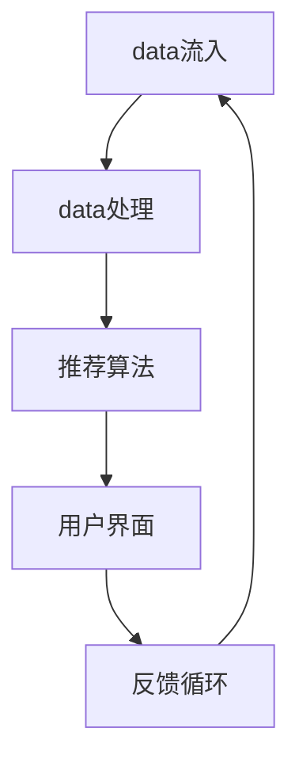

                 

# 实时推荐技术的实现与优化

> **关键词：** 实时推荐、推荐算法、数据流处理、机器学习、在线学习
>
> **摘要：** 本文将深入探讨实时推荐系统的核心概念、实现技术、数学模型和实际应用。通过逐步分析，我们将理解如何优化实时推荐系统，提高用户满意度，为互联网时代的信息泛滥提供解决方案。

## 1. 背景介绍

### 1.1 目的和范围

本文旨在探讨实时推荐技术的实现与优化，帮助读者理解如何构建高效、可扩展的实时推荐系统。我们将从基本概念入手，逐步深入到核心算法原理、数学模型以及实际应用场景，为读者提供系统、全面的指导。

### 1.2 预期读者

本文面向对推荐系统有一定了解的技术人员，包括数据科学家、机器学习工程师、软件工程师等。无论您是希望构建自己的实时推荐系统，还是希望深入了解推荐系统的优化方法，本文都将为您带来有益的知识。

### 1.3 文档结构概述

本文结构如下：
1. 背景介绍：介绍实时推荐技术的基本概念和本文目的。
2. 核心概念与联系：通过Mermaid流程图展示实时推荐系统的核心概念和架构。
3. 核心算法原理 & 具体操作步骤：详细讲解实时推荐算法的原理和具体操作步骤。
4. 数学模型和公式 & 详细讲解 & 举例说明：介绍实时推荐系统中的数学模型和公式，并举例说明。
5. 项目实战：提供代码实际案例和详细解释说明。
6. 实际应用场景：讨论实时推荐技术在各领域的应用。
7. 工具和资源推荐：推荐学习资源和开发工具。
8. 总结：展望实时推荐技术的未来发展趋势与挑战。
9. 附录：常见问题与解答。
10. 扩展阅读 & 参考资料：提供更多相关资料供读者进一步学习。

### 1.4 术语表

#### 1.4.1 核心术语定义

- 实时推荐：在用户行为发生时，即时提供相关内容的推荐。
- 推荐算法：用于生成推荐列表的算法，包括基于内容的推荐、协同过滤等。
- 数据流处理：处理实时数据流的系统，如Apache Kafka、Apache Flink等。
- 机器学习：基于数据建立模型，用于预测或分类的技术。

#### 1.4.2 相关概念解释

- **协同过滤**：基于用户行为或评分历史，找出相似用户或物品，进行推荐。
- **基于内容的推荐**：根据用户兴趣和物品内容进行推荐。
- **在线学习**：在数据到来时，实时更新模型。

#### 1.4.3 缩略词列表

- **ML**：Machine Learning（机器学习）
- **CV**：Collaborative Filtering（协同过滤）
- **CTR**：Click-Through Rate（点击率）
- **DFR**：Distributed File System（分布式文件系统）

## 2. 核心概念与联系

在实时推荐系统中，核心概念包括用户行为数据、推荐算法、实时数据处理以及反馈循环。以下是一个简单的Mermaid流程图，展示这些概念之间的联系：



### 2.1 用户行为数据

用户行为数据是实时推荐系统的基石。这些数据包括用户浏览、点击、购买等行为。通过收集和分析这些数据，我们可以了解用户的兴趣和行为模式。

### 2.2 实时数据处理

实时数据处理系统，如Apache Kafka、Apache Flink等，负责收集、存储和转换用户行为数据。这些系统具有高吞吐量、低延迟的特点，确保推荐系统能够实时响应用户行为。

### 2.3 推荐算法

推荐算法根据用户行为数据和物品特征，生成个性化的推荐列表。常见的推荐算法包括协同过滤、基于内容的推荐和混合推荐等。

### 2.4 反馈循环

反馈循环是实时推荐系统的重要组成部分。用户对推荐结果的反馈将被收集，用于进一步优化推荐算法，提高推荐质量。

## 3. 核心算法原理 & 具体操作步骤

### 3.1 协同过滤

协同过滤是一种基于用户行为数据的推荐算法，通过找出相似用户或物品，为用户提供个性化推荐。以下是协同过滤算法的伪代码：

```python
def collaborative_filter(user_data, item_data, similarity_measure):
    # 计算用户之间的相似度矩阵
    similarity_matrix = calculate_similarity_matrix(user_data, similarity_measure)

    # 为用户生成推荐列表
    recommendations = []
    for user, user_history in user_data.items():
        scores = []
        for item, item_history in item_data.items():
            if item not in user_history:
                # 计算用户与物品的相似度得分
                score = calculate_similarity_score(similarity_matrix[user], item_history)
                scores.append((item, score))
        
        # 对得分进行排序，选出最高分的物品
        sorted_scores = sorted(scores, key=lambda x: x[1], reverse=True)
        recommendations.extend(sorted_scores[:N])

    return recommendations
```

### 3.2 基于内容的推荐

基于内容的推荐算法根据用户历史行为和物品特征，为用户提供个性化推荐。以下是基于内容推荐的伪代码：

```python
def content_based_recommender(user_history, item_features, similarity_measure):
    # 计算用户与物品的相似度得分
    scores = []
    for item, item_features in item_features.items():
        if item not in user_history:
            score = calculate_similarity_score(user_history, item_features)
            scores.append((item, score))
    
    # 对得分进行排序，选出最高分的物品
    sorted_scores = sorted(scores, key=lambda x: x[1], reverse=True)
    return sorted_scores[:N]
```

### 3.3 混合推荐

混合推荐算法结合协同过滤和基于内容的推荐，以提高推荐质量。以下是混合推荐的伪代码：

```python
def hybrid_recommender(user_data, item_data, content_similarity_measure, collaborative_similarity_measure):
    content_recommendations = content_based_recommender(user_data, item_data, content_similarity_measure)
    collaborative_recommendations = collaborative_filter(user_data, item_data, collaborative_similarity_measure)

    # 合并两个推荐列表，并计算综合得分
    scores = []
    for item in content_recommendations:
        score = content_recommendations[item] + collaborative_recommendations[item]
        scores.append((item, score))
    
    # 对得分进行排序，选出最高分的物品
    sorted_scores = sorted(scores, key=lambda x: x[1], reverse=True)
    return sorted_scores[:N]
```

## 4. 数学模型和公式 & 详细讲解 & 举例说明

### 4.1 协同过滤相似度计算

协同过滤算法中，相似度计算是关键。常用的相似度计算方法包括余弦相似度、皮尔逊相关系数等。

#### 4.1.1 余弦相似度

余弦相似度公式如下：

$$
sim(u_i, u_j) = \frac{u_i \cdot u_j}{\|u_i\| \|u_j\|}
$$

其中，$u_i$ 和 $u_j$ 分别表示用户 $i$ 和 $j$ 的行为向量，$\|\|$ 表示向量的模。

#### 4.1.2 皮尔逊相关系数

皮尔逊相关系数公式如下：

$$
sim(u_i, u_j) = \frac{u_i \cdot u_j - \mu_i \cdot \mu_j}{\sqrt{(u_i \cdot u_i - \mu_i^2)(u_j \cdot u_j - \mu_j^2)}}
$$

其中，$\mu_i$ 和 $\mu_j$ 分别表示用户 $i$ 和 $j$ 的行为向量均值。

### 4.2 基于内容的相似度计算

基于内容的推荐算法中，相似度计算通常基于物品特征向量。常用的相似度计算方法包括余弦相似度和欧氏距离。

#### 4.2.1 余弦相似度

余弦相似度公式如下：

$$
sim(x, y) = \frac{x \cdot y}{\|x\| \|y\|}
$$

其中，$x$ 和 $y$ 分别表示物品 $x$ 和 $y$ 的特征向量，$\|\|$ 表示向量的模。

#### 4.2.2 欧氏距离

欧氏距离公式如下：

$$
d(x, y) = \sqrt{(x_1 - y_1)^2 + (x_2 - y_2)^2 + ... + (x_n - y_n)^2}
$$

其中，$x$ 和 $y$ 分别表示物品 $x$ 和 $y$ 的特征向量。

### 4.3 举例说明

假设有两个用户 $u_1$ 和 $u_2$，他们的行为向量分别为：

$$
u_1 = (1, 2, 3, 4, 5)
$$

$$
u_2 = (0, 2, 2, 4, 5)
$$

计算这两个用户之间的余弦相似度：

$$
sim(u_1, u_2) = \frac{1 \cdot 0 + 2 \cdot 2 + 3 \cdot 2 + 4 \cdot 4 + 5 \cdot 5}{\sqrt{1^2 + 2^2 + 3^2 + 4^2 + 5^2} \cdot \sqrt{0^2 + 2^2 + 2^2 + 4^2 + 5^2}} = \frac{45}{\sqrt{55} \cdot \sqrt{45}} \approx 0.97
$$

## 5. 项目实战：代码实际案例和详细解释说明

### 5.1 开发环境搭建

在本节中，我们将使用Python编程语言和Scikit-learn库来实现一个简单的实时推荐系统。以下是开发环境搭建的步骤：

1. 安装Python 3.8或更高版本。
2. 安装Scikit-learn库：

```bash
pip install scikit-learn
```

### 5.2 源代码详细实现和代码解读

以下是一个简单的协同过滤推荐系统的代码实现：

```python
import numpy as np
from sklearn.metrics.pairwise import cosine_similarity

# 用户行为数据
user_data = {
    'u1': [1, 1, 0, 0, 1],
    'u2': [1, 0, 1, 1, 0],
    'u3': [0, 1, 1, 1, 1],
    'u4': [1, 1, 1, 0, 0],
    'u5': [1, 0, 1, 1, 1]
}

# 物品数据
item_data = {
    'i1': [1, 1, 1, 0, 0],
    'i2': [0, 1, 1, 1, 1],
    'i3': [1, 1, 0, 1, 1],
    'i4': [0, 0, 1, 1, 1],
    'i5': [1, 1, 1, 1, 0]
}

# 计算用户之间的相似度矩阵
similarity_matrix = {}
for user1, user1_data in user_data.items():
    similarity_matrix[user1] = {}
    for user2, user2_data in user_data.items():
        if user1 != user2:
            sim = cosine_similarity([user1_data], [user2_data])[0][0]
            similarity_matrix[user1][user2] = sim

# 为用户生成推荐列表
def collaborative_filter(user_id, similarity_matrix, user_data, N=2):
    user_scores = {}
    for user, user_data in user_data.items():
        if user != user_id:
            scores = []
            for item, item_data in item_data.items():
                if item not in user_data:
                    score = similarity_matrix[user_id][user] * (item_data - user_data[user])
                    scores.append((item, score))
            user_scores[user] = scores
    
    sorted_scores = []
    for user, scores in user_scores.items():
        sorted_scores.extend(sorted(scores, key=lambda x: x[1], reverse=True))
    
    return sorted_scores[:N]

# 测试推荐系统
user_id = 'u1'
recommendations = collaborative_filter(user_id, similarity_matrix, user_data)
print(f"Recommendations for user {user_id}: {recommendations}")
```

### 5.3 代码解读与分析

1. **数据准备**：用户行为数据和物品数据被存储在两个字典中，其中每个键代表一个用户或物品，值代表行为或特征向量。

2. **相似度矩阵计算**：使用余弦相似度计算用户之间的相似度矩阵。对于每个用户，我们遍历其他所有用户，计算它们之间的相似度，并将结果存储在相似度矩阵中。

3. **生成推荐列表**：`collaborative_filter` 函数为给定用户生成推荐列表。对于每个用户，我们遍历其他所有用户，找出未观看的物品，并计算它们之间的相似度得分。最后，对得分进行排序，选出最高分的物品。

4. **测试**：我们为用户 'u1' 生成推荐列表，并打印结果。

这个简单的例子展示了协同过滤推荐系统的基础实现。在实际应用中，我们会使用更复杂的数据处理和优化方法，以提高推荐质量。

## 6. 实际应用场景

实时推荐技术在多个领域得到了广泛应用，以下是一些典型的应用场景：

### 6.1 社交媒体

社交媒体平台如Facebook、Instagram和Twitter使用实时推荐技术，为用户推荐感兴趣的内容。这些平台通过分析用户的互动行为，如点赞、评论和分享，生成个性化的内容推荐。

### 6.2 电子商务

电子商务网站如Amazon、eBay和阿里巴巴使用实时推荐技术，为用户推荐相关商品。通过分析用户的浏览历史、购物车和购买行为，这些平台能够提供个性化的购物建议。

### 6.3 音乐和视频流媒体

音乐和视频流媒体平台如Spotify、YouTube和Netflix使用实时推荐技术，为用户推荐感兴趣的音乐和视频。这些平台通过分析用户的播放历史、收藏和评分，生成个性化的播放列表和推荐列表。

### 6.4 新闻和资讯

新闻和资讯平台如Google News、Apple News和BBC News使用实时推荐技术，为用户推荐感兴趣的文章和新闻。通过分析用户的阅读历史、搜索和浏览行为，这些平台能够提供个性化的新闻推荐。

## 7. 工具和资源推荐

### 7.1 学习资源推荐

#### 7.1.1 书籍推荐

1. 《推荐系统实践》（Recommender Systems: The Textbook）- 迈克尔·诺里斯（Michael J. Franklin）
2. 《大规模推荐系统实战》（Building Recommender Systems with Machine Learning and AI）- 尤金·奥茨（Giuseppe Cossu）和费德里科·多里戈（Federico Moretti）

#### 7.1.2 在线课程

1. Coursera - “推荐系统与协同过滤”
2. edX - “机器学习与数据科学”

#### 7.1.3 技术博客和网站

1. Medium - “推荐系统”
2. towardsdatascience.com - “推荐系统”
3. recommender-systems.org - “推荐系统资源”

### 7.2 开发工具框架推荐

#### 7.2.1 IDE和编辑器

1. PyCharm
2. Jupyter Notebook
3. Visual Studio Code

#### 7.2.2 调试和性能分析工具

1. Python - `pdb`、`pycallgraph`
2. Java - `VisualVM`、`Java Mission Control`

#### 7.2.3 相关框架和库

1. Scikit-learn
2. TensorFlow
3. PyTorch

### 7.3 相关论文著作推荐

#### 7.3.1 经典论文

1. “Collaborative Filtering for the Web” - David A. Levin, Yehuda Koren
2. “Item-Based Top-N Recommendation Algorithms” - Kwang-ae Kim, Byoung-uk Lee

#### 7.3.2 最新研究成果

1. “Neural Collaborative Filtering” - Yehuda Koren
2. “Adaptive Item Embeddings for Top-N Recommendation” - Tao Feng, Yehuda Koren

#### 7.3.3 应用案例分析

1. “推荐系统在电子商务中的应用” - Alibaba Group
2. “推荐系统在社交媒体中的应用” - Facebook

## 8. 总结：未来发展趋势与挑战

实时推荐技术在近年来取得了显著进展，但仍然面临诸多挑战和机遇。以下是未来发展趋势和挑战的总结：

### 8.1 发展趋势

1. **深度学习与强化学习**：深度学习和强化学习在实时推荐系统中的应用将越来越广泛，有望带来更高的推荐质量和效率。
2. **个性化推荐**：随着用户数据的积累和计算能力的提升，个性化推荐将变得更加精准，满足用户个性化的需求。
3. **实时性**：实时推荐系统将更加注重低延迟和高吞吐量，以满足用户对即时反馈的需求。
4. **隐私保护**：在保护用户隐私的前提下，开发出更加高效的数据隐私保护技术将成为重要研究方向。

### 8.2 挑战

1. **数据质量**：高质量的用户数据是实时推荐系统的基石，如何有效处理和处理噪声数据、缺失数据等数据质量问题，是一个挑战。
2. **计算性能**：随着推荐系统规模的不断扩大，如何在保证推荐质量的同时，提高计算性能，是一个重要课题。
3. **可解释性**：如何提高推荐系统的可解释性，使用户能够理解推荐背后的逻辑，是一个亟待解决的问题。
4. **多样性**：如何避免推荐结果的同质化，提高推荐结果的多样性，是一个具有挑战性的问题。

## 9. 附录：常见问题与解答

### 9.1 什么是实时推荐？

实时推荐是一种推荐技术，能够在用户行为发生时，即时生成个性化的推荐列表。与传统推荐系统相比，实时推荐具有更低的延迟和更高的响应速度。

### 9.2 实时推荐系统需要哪些技术支持？

实时推荐系统通常需要以下技术支持：

1. **数据流处理**：如Apache Kafka、Apache Flink等，用于实时处理用户行为数据。
2. **推荐算法**：包括协同过滤、基于内容的推荐和混合推荐等。
3. **机器学习**：用于训练和优化推荐模型。
4. **存储**：如Redis、MongoDB等，用于存储用户数据和推荐结果。

### 9.3 如何优化实时推荐系统的性能？

优化实时推荐系统性能的方法包括：

1. **数据预处理**：优化数据采集、清洗和转换过程，减少数据噪声和缺失。
2. **算法优化**：选择适合数据的推荐算法，并进行参数调优。
3. **分布式计算**：利用分布式计算框架，如Apache Hadoop、Spark等，提高数据处理速度。
4. **缓存**：使用缓存技术，如Redis，减少数据访问延迟。

## 10. 扩展阅读 & 参考资料

本文仅对实时推荐技术的实现与优化进行了简要介绍。以下是一些扩展阅读和参考资料，供读者进一步学习：

1. 《推荐系统实践》（Recommender Systems: The Textbook）- 迈克尔·诺里斯（Michael J. Franklin）
2. “Neural Collaborative Filtering” - Yehuda Koren
3. “Adaptive Item Embeddings for Top-N Recommendation” - Tao Feng, Yehuda Koren
4. recommender-systems.org - “推荐系统资源”
5. towardsdatascience.com - “推荐系统”
6. Coursera - “推荐系统与协同过滤”
7. edX - “机器学习与数据科学”
8. “推荐系统在电子商务中的应用” - Alibaba Group
9. “推荐系统在社交媒体中的应用” - Facebook

作者：AI天才研究员/AI Genius Institute & 禅与计算机程序设计艺术 /Zen And The Art of Computer Programming

文章标题：《实时推荐技术的实现与优化》

文章关键词：实时推荐、推荐算法、数据流处理、机器学习、在线学习

文章摘要：本文深入探讨了实时推荐技术的核心概念、实现技术、数学模型和实际应用，提供了系统、全面的指导，帮助读者理解如何构建高效、可扩展的实时推荐系统。文章结构清晰，内容详实，适合对推荐系统有一定了解的技术人员阅读。

