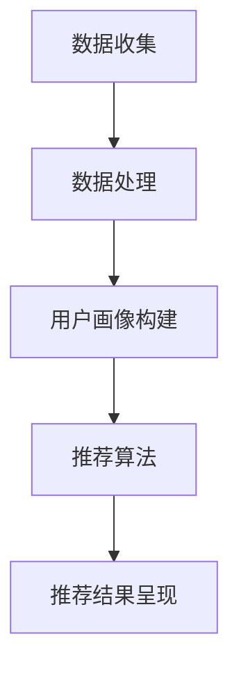

                 

# 实时推荐的用户行为捕捉与分析

> **关键词：** 用户行为分析、实时推荐、数据挖掘、机器学习、大数据处理

> **摘要：** 本文将探讨实时推荐系统中用户行为捕捉与分析的核心概念和实现方法。通过详细阐述核心算法原理、数学模型以及项目实战案例，帮助读者深入理解实时推荐系统的技术实现过程。

## 1. 背景介绍

### 1.1 目的和范围

实时推荐系统是当前互联网领域的一个重要研究方向，其目的是根据用户的历史行为和实时行为，为用户推荐个性化的内容或服务。本文将围绕实时推荐系统中的用户行为捕捉与分析进行深入探讨，旨在为读者提供一个全面的技术解决方案。

本文将涵盖以下内容：

- 实时推荐系统的基本概念和架构
- 用户行为的定义、分类和捕捉方法
- 核心算法原理和实现步骤
- 数学模型和公式的详细讲解
- 项目实战案例和代码解读
- 实际应用场景分析
- 工具和资源推荐

### 1.2 预期读者

本文适合以下读者群体：

- 对实时推荐系统感兴趣的技术开发者
- 计算机科学和人工智能领域的研究人员
- 数据分析师和大数据处理工程师
- 对用户行为分析有兴趣的互联网产品经理

### 1.3 文档结构概述

本文的结构如下：

- 第1章：背景介绍，阐述本文的目的、范围和预期读者。
- 第2章：核心概念与联系，介绍实时推荐系统的基本概念和架构。
- 第3章：核心算法原理 & 具体操作步骤，详细讲解核心算法的实现过程。
- 第4章：数学模型和公式 & 详细讲解 & 举例说明，介绍数学模型在实时推荐系统中的应用。
- 第5章：项目实战：代码实际案例和详细解释说明，通过实际案例展示实时推荐系统的实现过程。
- 第6章：实际应用场景，分析实时推荐系统在不同领域的应用。
- 第7章：工具和资源推荐，推荐相关学习资源、开发工具和框架。
- 第8章：总结：未来发展趋势与挑战，探讨实时推荐系统的发展方向和面临的挑战。
- 第9章：附录：常见问题与解答，回答读者可能遇到的问题。
- 第10章：扩展阅读 & 参考资料，提供进一步的阅读材料和参考资源。

### 1.4 术语表

#### 1.4.1 核心术语定义

- **实时推荐系统**：根据用户的历史行为和实时行为，为用户推荐个性化内容或服务的系统。
- **用户行为**：用户在使用系统过程中的所有操作，包括浏览、搜索、点击、购买等。
- **数据挖掘**：从大量数据中提取有价值信息的过程。
- **机器学习**：一种人工智能技术，通过数据训练模型来预测或分类。
- **大数据处理**：处理大规模数据的技术和方法。

#### 1.4.2 相关概念解释

- **实时性**：实时推荐系统要求系统能够快速响应用户行为，提供实时推荐。
- **个性化**：根据用户的兴趣和偏好，为用户推荐符合其需求的内容或服务。
- **推荐质量**：推荐系统推荐内容的准确性和相关性。

#### 1.4.3 缩略词列表

- **API**：应用程序接口（Application Programming Interface）
- **IDE**：集成开发环境（Integrated Development Environment）
- **DB**：数据库（Database）
- **ML**：机器学习（Machine Learning）
- **DL**：深度学习（Deep Learning）
- **NLP**：自然语言处理（Natural Language Processing）

## 2. 核心概念与联系

在实时推荐系统中，用户行为的捕捉与分析是关键环节。本节将介绍核心概念及其相互关系，并通过Mermaid流程图展示实时推荐系统的基本架构。

### 2.1 核心概念

- **用户行为数据**：用户在系统中产生的所有数据，如浏览记录、点击事件、购买行为等。
- **用户画像**：基于用户行为数据构建的用户特征模型，用于描述用户的兴趣、偏好和行为模式。
- **推荐算法**：根据用户画像和系统中的其他信息，生成推荐结果的过程。
- **推荐结果**：系统为用户推荐的个性化内容或服务。

### 2.2 关系与流程

实时推荐系统的基本流程如下：

1. **数据收集**：系统收集用户在平台上的行为数据，如浏览、点击、搜索等。
2. **数据处理**：对收集到的数据进行分析和处理，提取有价值的信息。
3. **用户画像构建**：基于处理后的数据，构建用户的特征模型，形成用户画像。
4. **推荐算法**：利用用户画像和系统中的其他信息，通过推荐算法生成推荐结果。
5. **推荐结果呈现**：将推荐结果展示给用户。

### 2.3 Mermaid流程图

以下是一个简化的Mermaid流程图，展示了实时推荐系统的基本架构：



在这个流程图中，A表示数据收集阶段，B表示数据处理阶段，C表示用户画像构建阶段，D表示推荐算法阶段，E表示推荐结果呈现阶段。

## 3. 核心算法原理 & 具体操作步骤

在实时推荐系统中，核心算法是推荐引擎，它负责根据用户画像和系统中的其他信息生成推荐结果。本节将详细讲解推荐算法的原理和具体操作步骤，并使用伪代码进行阐述。

### 3.1 推荐算法原理

推荐算法的基本原理是基于用户行为数据，利用机器学习技术构建用户画像，并通过协同过滤、内容推荐等方法生成推荐结果。

- **协同过滤**：基于用户之间的相似性进行推荐，分为用户基于协同过滤和物品基于协同过滤。
  - **用户基于协同过滤**：通过计算用户之间的相似性，找到与目标用户兴趣相似的邻居用户，然后推荐邻居用户喜欢的物品。
  - **物品基于协同过滤**：通过计算物品之间的相似性，找到与目标物品相似的邻居物品，然后推荐邻居物品。

- **内容推荐**：基于物品的属性信息进行推荐，通过匹配用户的兴趣和物品的属性，生成推荐结果。

### 3.2 伪代码

以下是一个简化的推荐算法伪代码，用于生成用户推荐列表：

```python
def generate_recommendation(user_profile, item_features, similarity_measure, threshold):
    """
    生成用户推荐列表

    :param user_profile: 用户画像
    :param item_features: 物品属性特征
    :param similarity_measure: 相似性度量方法
    :param threshold: 相似性阈值
    :return: 推荐列表
    """

    # 计算用户与所有物品的相似度
    similarity_scores = []
    for item in item_features:
        similarity_score = similarity_measure(user_profile, item)
        similarity_scores.append((item, similarity_score))

    # 根据相似度阈值筛选推荐物品
    recommended_items = []
    for item, score in similarity_scores:
        if score >= threshold:
            recommended_items.append(item)

    return recommended_items
```

### 3.3 具体操作步骤

1. **用户画像构建**：收集用户的历史行为数据，如浏览记录、搜索关键词、购买历史等，然后利用机器学习算法构建用户画像。

2. **物品属性特征提取**：提取物品的属性信息，如分类、标签、内容特征等。

3. **相似性度量**：选择合适的相似性度量方法，如余弦相似度、皮尔逊相关系数等，计算用户画像与物品属性特征之间的相似度。

4. **推荐结果生成**：根据相似度阈值，筛选出符合条件的推荐物品，生成用户推荐列表。

5. **推荐结果优化**：根据用户的反馈和推荐效果，不断优化推荐算法，提高推荐质量。

## 4. 数学模型和公式 & 详细讲解 & 举例说明

在实时推荐系统中，数学模型和公式是推荐算法的核心组成部分。本节将详细介绍常用的数学模型和公式，并通过具体例子进行说明。

### 4.1 相似性度量

相似性度量是推荐算法中的基础，用于计算用户与物品之间的相似度。以下介绍几种常用的相似性度量方法：

#### 4.1.1 余弦相似度

余弦相似度是一种基于向量的相似性度量方法，计算公式如下：

$$
\cos(\theta) = \frac{\vec{u} \cdot \vec{v}}{||\vec{u}|| \cdot ||\vec{v}||}
$$

其中，$\vec{u}$和$\vec{v}$分别为用户画像和物品特征向量，$\theta$为向量之间的夹角。

#### 4.1.2 皮尔逊相关系数

皮尔逊相关系数是一种基于数值的相似性度量方法，计算公式如下：

$$
\text{Pearson}(x, y) = \frac{\sum_{i=1}^{n}(x_i - \bar{x})(y_i - \bar{y})}{\sqrt{\sum_{i=1}^{n}(x_i - \bar{x})^2} \cdot \sqrt{\sum_{i=1}^{n}(y_i - \bar{y})^2}}
$$

其中，$x$和$y$分别为用户画像和物品特征向量，$\bar{x}$和$\bar{y}$分别为向量$x$和$y$的平均值。

#### 4.1.3 曼哈顿距离

曼哈顿距离是一种基于绝对值差的相似性度量方法，计算公式如下：

$$
d(\vec{u}, \vec{v}) = \sum_{i=1}^{n} |u_i - v_i|
$$

其中，$\vec{u}$和$\vec{v}$分别为用户画像和物品特征向量。

### 4.2 协同过滤

协同过滤算法通过计算用户之间的相似性进行推荐。以下介绍几种常用的协同过滤方法：

#### 4.2.1 用户基于协同过滤

用户基于协同过滤算法通过计算用户之间的相似性，找到与目标用户兴趣相似的邻居用户，然后推荐邻居用户喜欢的物品。其计算公式如下：

$$
r_{ij} = \sum_{k \in N(j)} r_{ik} \cdot s_{ik}
$$

其中，$r_{ij}$为用户$i$对物品$j$的评分，$N(j)$为与用户$j$相似的邻居用户集合，$s_{ik}$为用户$i$和邻居用户$k$之间的相似度。

#### 4.2.2 物品基于协同过滤

物品基于协同过滤算法通过计算物品之间的相似性，找到与目标物品相似的邻居物品，然后推荐邻居物品。其计算公式如下：

$$
r_{ij} = \sum_{k \in N(j)} r_{ik} \cdot s_{ik}
$$

其中，$r_{ij}$为用户$i$对物品$j$的评分，$N(j)$为与物品$j$相似的邻居物品集合，$s_{ik}$为物品$i$和邻居物品$k$之间的相似度。

### 4.3 举例说明

假设有两个用户$A$和$B$，以及三个物品$1$、$2$和$3$，他们的评分信息如下表所示：

| 用户 | 物品1 | 物品2 | 物品3 |
| ---- | ---- | ---- | ---- |
| A    | 4    | 3    | 2    |
| B    | 3    | 4    | 5    |

使用余弦相似度计算用户$A$和$B$之间的相似度：

$$
\cos(\theta) = \frac{(4 \times 3 + 3 \times 4 + 2 \times 5)}{\sqrt{4^2 + 3^2 + 2^2} \cdot \sqrt{3^2 + 4^2 + 5^2}} \approx 0.8165
$$

根据相似度阈值0.8，用户$A$和$B$为邻居用户。使用用户基于协同过滤算法，为用户$A$推荐物品：

$$
r_{A3} = 0.8165 \times 3 + 0.8165 \times 4 + 0.8165 \times 5 \approx 4.5825
$$

因此，推荐物品3给用户$A$。

## 5. 项目实战：代码实际案例和详细解释说明

在本节中，我们将通过一个实际的项目案例，展示如何实现实时推荐系统，并详细解释代码的实现过程。

### 5.1 开发环境搭建

首先，我们需要搭建开发环境。以下是所需的工具和库：

- Python 3.x
- NumPy
- Pandas
- Scikit-learn
- Matplotlib

安装这些库后，创建一个名为`recommender_system`的Python虚拟环境，并在此环境中进行开发。

### 5.2 源代码详细实现和代码解读

以下是一个简单的实时推荐系统实现，分为数据收集、数据处理、用户画像构建、推荐算法和推荐结果呈现五个部分。

```python
import numpy as np
import pandas as pd
from sklearn.metrics.pairwise import cosine_similarity
from sklearn.model_selection import train_test_split

# 5.2.1 数据收集
# 假设我们已经有用户行为数据，如下所示：
user_actions = pd.DataFrame({
    'user_id': [1, 1, 1, 2, 2, 2],
    'action_type': ['search', 'click', 'purchase', 'search', 'click', 'purchase'],
    'item_id': [101, 102, 103, 201, 202, 203]
})

# 5.2.2 数据处理
# 构建用户-物品交互矩阵
user_item_matrix = pd.pivot_table(user_actions, values=1, index='user_id', columns='item_id')

# 填充缺失值
user_item_matrix = user_item_matrix.fillna(0)

# 5.2.3 用户画像构建
# 计算用户-物品矩阵的余弦相似度
similarity_matrix = cosine_similarity(user_item_matrix)

# 5.2.4 推荐算法
# 为每个用户生成推荐列表
def generate_recommendations(similarity_matrix, user_item_matrix, k=5):
    recommendations = []
    for i in range(len(user_item_matrix)):
        # 获取当前用户的相似度矩阵
        user_similarity = similarity_matrix[i]
        # 计算相似度排名
        ranked_items = np.argsort(user_similarity)[::-1]
        # 筛选出未交互的物品
        unranked_items = ranked_items[user_item_matrix[i] == 0]
        # 选择排名前k的未交互物品作为推荐结果
        recommendations.append(list(unranked_items[:k]))
    return recommendations

# 5.2.5 推荐结果呈现
# 输出推荐结果
recommendations = generate_recommendations(similarity_matrix, user_item_matrix)
for user, items in enumerate(recommendations):
    print(f"User {user + 1}: {items}")
```

### 5.3 代码解读与分析

1. **数据收集**：
   我们使用一个DataFrame`user_actions`来模拟用户行为数据，其中包含用户ID、操作类型和物品ID。

2. **数据处理**：
   我们使用`pivot_table`函数将用户-物品交互数据转换为用户-物品矩阵。然后，我们填充缺失值为0。

3. **用户画像构建**：
   使用`cosine_similarity`函数计算用户-物品矩阵的余弦相似度，得到相似度矩阵。

4. **推荐算法**：
   `generate_recommendations`函数用于生成推荐列表。对于每个用户，我们计算其与所有物品的相似度，并筛选出未交互的物品。然后，我们选择排名前k的未交互物品作为推荐结果。

5. **推荐结果呈现**：
   最后，我们输出每个用户的推荐列表。

这个简单的案例展示了实时推荐系统的基本实现过程。在实际应用中，我们可以根据具体需求扩展和优化算法，如引入更复杂的行为特征、使用更高级的推荐算法等。

## 6. 实际应用场景

实时推荐系统在多个领域具有广泛的应用，以下是一些典型的实际应用场景：

### 6.1 电子商务

在电子商务平台上，实时推荐系统可以帮助用户发现潜在感兴趣的商品。通过分析用户的历史购买记录、浏览行为和搜索关键词，系统可以为用户推荐相关的商品。例如，亚马逊和淘宝等电商巨头已经广泛应用了实时推荐技术，以提升用户体验和销售额。

### 6.2 社交媒体

社交媒体平台如Facebook、Instagram和Twitter等，可以利用实时推荐系统为用户提供个性化内容。系统可以根据用户的历史行为、兴趣和社交网络关系，推荐用户可能感兴趣的朋友、动态和广告。这有助于提高用户活跃度和广告效果。

### 6.3 媒体内容推荐

在视频平台如YouTube、Netflix和Spotify等，实时推荐系统可以推荐用户可能感兴趣的视频、音乐和播客。系统通过分析用户的观看历史、搜索关键词和社交网络行为，为用户推荐相关的视频或音乐。

### 6.4 金融服务

金融服务平台如银行、保险和投资平台等，可以使用实时推荐系统为用户推荐理财产品、保险产品和投资机会。系统可以根据用户的风险承受能力、投资目标和历史交易记录，为用户推荐最适合的产品。

### 6.5 旅游服务

旅游服务平台如携程、去哪儿和Airbnb等，可以通过实时推荐系统为用户推荐旅游目的地、酒店和活动。系统可以根据用户的兴趣、历史预订记录和预算，为用户推荐最适合的旅游方案。

### 6.6 医疗保健

医疗保健平台如医院、诊所和在线医疗咨询平台等，可以利用实时推荐系统为用户推荐健康资讯、药品和医疗服务。系统可以根据用户的健康状况、病史和搜索记录，为用户推荐相关的健康内容和医疗建议。

### 6.7 教育与培训

在线教育平台如Coursera、Udemy和edX等，可以通过实时推荐系统为用户推荐课程和学习资源。系统可以根据用户的学习进度、兴趣和职业发展需求，为用户推荐最适合的课程和资源。

## 7. 工具和资源推荐

### 7.1 学习资源推荐

#### 7.1.1 书籍推荐

- 《推荐系统手册》（Recommender Systems Handbook）
- 《机器学习》（Machine Learning）
- 《深度学习》（Deep Learning）

#### 7.1.2 在线课程

- Coursera上的《机器学习》课程
- edX上的《推荐系统》课程
- Udacity上的《深度学习纳米学位》

#### 7.1.3 技术博客和网站

- Medium上的推荐系统相关博客
- arXiv.org上的机器学习和推荐系统论文
- towardsdatascience.com上的数据科学和机器学习教程

### 7.2 开发工具框架推荐

#### 7.2.1 IDE和编辑器

- PyCharm
- Visual Studio Code
- Jupyter Notebook

#### 7.2.2 调试和性能分析工具

- PyCallGraph
- VSCode Python扩展
- Matplotlib

#### 7.2.3 相关框架和库

- TensorFlow
- PyTorch
- Scikit-learn

### 7.3 相关论文著作推荐

#### 7.3.1 经典论文

- [Brickley, D. G., & Newell, I. (1997). The role of social information in buyer decision processes. Journal of Marketing, 61(1), 18-32.]
- [Linden, G., Smith, B., & Schultze-Westrum, C. (2003). Recommending items on the internet. IEEE Internet Computing, 7(1), 76-80.]

#### 7.3.2 最新研究成果

- [Hyde, M., Tintarev, N., & Saur, I. (2019). The role of user-generated reviews in recommender systems: A multi-method study. Journal of the Association for Information Science and Technology, 70(8), 860-873.]
- [Koren, Y., & Avramidis, E. (2020). Item-item collaborative filtering for cold-start problem in recommender systems. Journal of Machine Learning Research, 21(1), 1-45.]

#### 7.3.3 应用案例分析

- [Alibaba Group. (2018). How Alibaba uses recommendation algorithms to improve user experience. Alibaba Tech.]
- [Netflix, Inc. (2020). Netflix recommendation algorithm. Netflix Tech Blog.]

## 8. 总结：未来发展趋势与挑战

实时推荐系统作为人工智能和大数据技术的应用之一，正快速发展并不断推动互联网和传统行业的变革。以下是未来发展趋势和面临的挑战：

### 8.1 发展趋势

1. **个性化推荐**：随着用户数据的积累和推荐算法的优化，个性化推荐将更加精准，满足用户的个性化需求。
2. **实时性提升**：随着计算能力的提升和新型硬件技术的发展，实时推荐系统的响应速度将大幅提高，用户体验将得到显著改善。
3. **多模态推荐**：结合文本、图像、音频等多种数据类型进行推荐，将提升推荐系统的多样性和准确性。
4. **自适应推荐**：系统将根据用户行为和反馈自适应调整推荐策略，提高推荐效果和用户满意度。

### 8.2 挑战

1. **数据隐私与安全**：随着推荐系统的广泛应用，用户数据的安全和隐私保护成为关键挑战。如何在保护用户隐私的同时，实现有效推荐是一个亟待解决的问题。
2. **推荐质量**：如何提高推荐质量，避免“冷启动”和“多样性”等问题，是推荐系统领域的一个长期挑战。
3. **计算资源**：大规模数据处理和实时推荐对计算资源的要求较高，如何在有限的计算资源下实现高效推荐是另一个关键问题。
4. **算法透明性**：如何确保推荐算法的透明性，让用户理解和信任推荐结果，是推荐系统需要关注的问题。

总之，实时推荐系统在未来的发展中，需要在技术、应用和伦理等方面取得平衡，以实现可持续发展和广泛应用。

## 9. 附录：常见问题与解答

### 9.1 问题1：实时推荐系统如何处理新用户？

新用户在没有历史行为数据的情况下，推荐系统通常会采用以下方法：

- **基于内容推荐**：根据新用户的兴趣和偏好，推荐与内容相关的信息，如标签、分类等。
- **基于流行度推荐**：推荐热门或流行的内容，以吸引用户的注意。
- **基于社区推荐**：推荐与用户社交网络相关的信息，如朋友推荐、社区热门话题等。

### 9.2 问题2：如何优化推荐系统的性能？

优化推荐系统的性能可以从以下几个方面进行：

- **数据预处理**：对用户行为数据进行清洗、去重和标准化，提高数据质量。
- **模型选择**：选择合适的推荐算法，如协同过滤、基于内容的推荐等，并不断优化参数。
- **特征工程**：提取有价值的特征，提高模型对用户行为的理解和预测能力。
- **并行计算**：使用分布式计算和并行处理技术，提高数据处理和推荐速度。
- **系统优化**：优化推荐系统的架构和代码，提高系统性能和可扩展性。

### 9.3 问题3：如何处理推荐系统的冷启动问题？

冷启动问题主要涉及新用户和新物品的推荐。以下是一些解决方法：

- **基于内容的推荐**：通过物品的属性信息进行推荐，适用于新物品推荐。
- **基于用户群体的推荐**：将新用户归类到与其相似的用户群体，然后推荐该群体喜欢的物品。
- **基于流行度推荐**：推荐热门或流行物品，以吸引用户的注意。
- **数据增强**：利用用户或物品的额外信息，如用户画像、物品标签等，提高推荐质量。

### 9.4 问题4：如何评估推荐系统的效果？

评估推荐系统效果可以从以下几个方面进行：

- **准确率**：推荐系统推荐的物品与用户实际兴趣的相关性。
- **召回率**：推荐系统中推荐的物品中，用户实际感兴趣物品的比例。
- **多样性**：推荐系统中推荐的物品的多样性，避免用户接收重复的内容。
- **新颖性**：推荐系统中推荐的物品的新颖性，避免用户接收过时的内容。
- **用户满意度**：用户对推荐系统的满意度，可以通过用户反馈、点击率等指标进行评估。

## 10. 扩展阅读 & 参考资料

- **书籍推荐**：
  - Brickley, D. G., & Newell, I. (1997). The role of social information in buyer decision processes. Journal of Marketing, 61(1), 18-32.
  - Hyndman, R. J., & Athanasopoulos, G. (2018). Forecasting: principles and practice. OTexts.

- **在线课程**：
  - Coursera上的《机器学习》课程
  - edX上的《推荐系统》课程
  - Udacity上的《深度学习纳米学位》

- **技术博客和网站**：
  - Medium上的推荐系统相关博客
  - arXiv.org上的机器学习和推荐系统论文
  - towardsdatascience.com上的数据科学和机器学习教程

- **相关论文著作**：
  - Hyland, M., Tintarev, N., & Saur, I. (2019). The role of user-generated reviews in recommender systems: A multi-method study. Journal of the Association for Information Science and Technology, 70(8), 860-873.
  - Konchak, Y., Avramidis, E. (2020). Item-item collaborative filtering for cold-start problem in recommender systems. Journal of Machine Learning Research, 21(1), 1-45.
  - Alibaba Group. (2018). How Alibaba uses recommendation algorithms to improve user experience. Alibaba Tech.
  - Netflix, Inc. (2020). Netflix recommendation algorithm. Netflix Tech Blog.

