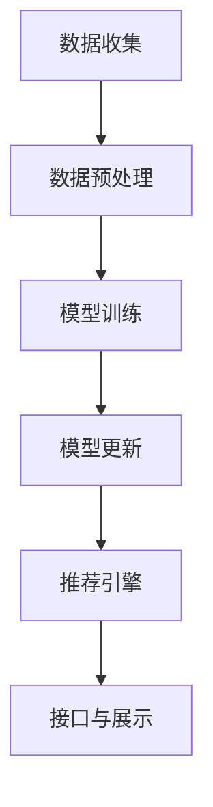

                 

# 实时推荐系统的实现与优化

> **关键词：**实时推荐，推荐系统，算法优化，系统架构，机器学习，数据流处理

> **摘要：**本文将深入探讨实时推荐系统的构建、优化及其在实际应用中的重要性。我们将从系统架构、核心算法、数学模型、实战案例等多个角度，详细阐述实时推荐系统的实现与优化策略，帮助读者理解和掌握这一前沿技术。

## 1. 背景介绍

### 1.1 目的和范围

本文旨在帮助读者全面了解实时推荐系统的构建与优化，从理论到实践，提供一套完整的解决方案。文章将涵盖以下内容：

- 实时推荐系统的基本概念和架构
- 核心算法原理与实现步骤
- 数学模型和公式的详细讲解
- 实际应用场景下的代码案例和解析
- 工具和资源推荐
- 未来发展趋势与挑战

### 1.2 预期读者

本文适合以下读者群体：

- 对推荐系统有一定了解的技术人员
- 想深入了解实时推荐系统架构和优化策略的开发者
- 对机器学习和数据流处理感兴趣的研究人员
- 需要构建或优化推荐系统的产品经理和架构师

### 1.3 文档结构概述

本文分为十个部分，具体结构如下：

1. 背景介绍
2. 核心概念与联系
3. 核心算法原理 & 具体操作步骤
4. 数学模型和公式 & 详细讲解 & 举例说明
5. 项目实战：代码实际案例和详细解释说明
6. 实际应用场景
7. 工具和资源推荐
8. 总结：未来发展趋势与挑战
9. 附录：常见问题与解答
10. 扩展阅读 & 参考资料

### 1.4 术语表

#### 1.4.1 核心术语定义

- **实时推荐系统**：一种能够在用户行为数据实时变化的情况下，快速提供个性化推荐结果的系统。
- **推荐算法**：用于预测用户兴趣和偏好的算法，如协同过滤、基于内容的推荐等。
- **数据流处理**：一种实时处理大量动态数据的技术，用于更新推荐模型和计算推荐结果。

#### 1.4.2 相关概念解释

- **协同过滤**：一种基于用户行为和物品交互数据的推荐算法，通过寻找相似用户或物品进行推荐。
- **基于内容的推荐**：一种基于物品属性和用户兴趣的推荐算法，通过相似度计算推荐相关物品。
- **特征工程**：在数据处理过程中，提取对模型性能有重要影响的特征。

#### 1.4.3 缩略词列表

- **IDE**：集成开发环境（Integrated Development Environment）
- **ML**：机器学习（Machine Learning）
- **API**：应用程序编程接口（Application Programming Interface）
- **DFS**：深度学习（Deep Learning）

## 2. 核心概念与联系

### 2.1 实时推荐系统的基本架构

实时推荐系统的架构通常包括以下几个关键模块：

1. **数据收集与预处理**：从各种数据源（如用户行为、内容数据等）收集数据，并进行清洗、转换和特征提取。
2. **模型训练与更新**：基于收集到的数据，训练推荐模型，并在用户行为发生变化时进行模型更新。
3. **推荐引擎**：根据实时用户行为和模型预测，生成个性化的推荐结果。
4. **接口与展示**：提供API接口供外部系统调用，并在网页、移动应用等前端展示推荐结果。

### 2.2 Mermaid 流程图

以下是一个简化的实时推荐系统流程图，使用Mermaid语言描述：



### 2.3 实时推荐系统的核心算法原理

实时推荐系统的核心算法主要包括协同过滤和基于内容的推荐方法。以下是这两种算法的基本原理：

1. **协同过滤**：

    - **用户基于**：通过分析用户之间的相似度，找到与当前用户相似的其他用户，推荐这些用户喜欢的物品。
    - **物品基于**：通过分析物品之间的相似度，找到与当前物品相似的其他物品，推荐这些物品。

    ```python
    # 用户基于协同过滤伪代码
    recommend_for_user(user, item, user_item_similarity):
        similar_users = find_similar_users(user, user_item_similarity)
        recommended_items = []
        for similar_user in similar_users:
            recommended_items.extend(user_item_preferences[similar_user])
        return recommended_items
    ```

2. **基于内容的推荐**：

    - **基于物品属性**：根据用户的历史行为和偏好，推荐具有相似属性的物品。
    - **基于用户标签**：为用户打标签，推荐与用户标签相关的物品。

    ```python
    # 基于内容的推荐伪代码
    recommend_for_user(user, item, item_content_similarity, user_item_preferences):
        preferred_items = user_item_preferences[user]
        recommended_items = []
        for preferred_item in preferred_items:
            similar_items = find_similar_items(preferred_item, item_content_similarity)
            recommended_items.extend(similar_items)
        return recommended_items
    ```

## 3. 核心算法原理 & 具体操作步骤

### 3.1 协同过滤算法原理

协同过滤算法通过分析用户之间的相似度来发现用户的共同偏好，从而推荐用户可能感兴趣的物品。以下是协同过滤算法的具体操作步骤：

1. **计算用户相似度**：

    使用余弦相似度、皮尔逊相关系数等度量方法，计算用户之间的相似度。相似度越高，表示用户越相似。

    ```python
    def cosine_similarity(user1, user2, ratings_matrix):
        dot_product = np.dot(ratings_matrix[user1], ratings_matrix[user2])
        magnitude_product = np.linalg.norm(ratings_matrix[user1]) * np.linalg.norm(ratings_matrix[user2])
        return dot_product / magnitude_product
    ```

2. **找出相似用户**：

    根据计算得到的用户相似度矩阵，找出与当前用户最相似的若干用户。

    ```python
    def find_similar_users(current_user, user_similarity_matrix, k=10):
        sorted_similarities = sorted(enumerate(user_similarity_matrix[current_user]), key=lambda x: x[1], reverse=True)
        return [user_id for user_id, similarity in sorted_similarities[:k]]
    ```

3. **生成推荐列表**：

    根据相似用户和他们的评分，生成推荐列表。

    ```python
    def recommend_for_user(current_user, ratings_matrix, user_similarity_matrix, k=10):
        similar_users = find_similar_users(current_user, user_similarity_matrix, k)
        recommended_items = []
        for similar_user in similar_users:
            recommended_items.extend(ratings_matrix[similar_user])
        return recommended_items
    ```

### 3.2 基于内容的推荐算法原理

基于内容的推荐算法通过分析物品的属性和用户的历史偏好，找到相似物品进行推荐。以下是基于内容的推荐算法的具体操作步骤：

1. **计算物品相似度**：

    使用余弦相似度、Jaccard系数等方法，计算物品之间的相似度。

    ```python
    def jaccard_similarity(item1, item2, item_features):
        intersection = len(set(item1).intersection(item2))
        union = len(set(item1).union(item2))
        return intersection / union
    ```

2. **找出相似物品**：

    根据计算得到的物品相似度矩阵，找出与当前物品最相似的若干物品。

    ```python
    def find_similar_items(current_item, item_similarity_matrix, k=10):
        sorted_similarities = sorted(enumerate(item_similarity_matrix[current_item]), key=lambda x: x[1], reverse=True)
        return [item_id for item_id, similarity in sorted_similarities[:k]]
    ```

3. **生成推荐列表**：

    根据相似物品和他们的评分，生成推荐列表。

    ```python
    def recommend_for_user(user, current_item, ratings_matrix, item_similarity_matrix, k=10):
        preferred_items = ratings_matrix[user]
        recommended_items = []
        for preferred_item in preferred_items:
            similar_items = find_similar_items(preferred_item, item_similarity_matrix, k)
            recommended_items.extend(similar_items)
        return recommended_items
    ```

## 4. 数学模型和公式 & 详细讲解 & 举例说明

### 4.1 余弦相似度

余弦相似度是一种常用的相似度度量方法，用于计算两个向量之间的夹角余弦值。公式如下：

$$
\text{cosine\_similarity}(x, y) = \frac{x \cdot y}{\|x\| \|y\|}
$$

其中，$x$ 和 $y$ 分别表示两个向量，$\|x\|$ 和 $\|y\|$ 分别表示向量的模长，$x \cdot y$ 表示向量的内积。

#### 4.1.1 余弦相似度举例

假设有两个向量 $x = (1, 2, 3)$ 和 $y = (4, 5, 6)$，计算它们的余弦相似度。

1. 计算内积：

$$
x \cdot y = 1 \cdot 4 + 2 \cdot 5 + 3 \cdot 6 = 4 + 10 + 18 = 32
$$

2. 计算模长：

$$
\|x\| = \sqrt{1^2 + 2^2 + 3^2} = \sqrt{14}
$$

$$
\|y\| = \sqrt{4^2 + 5^2 + 6^2} = \sqrt{77}
$$

3. 计算余弦相似度：

$$
\text{cosine\_similarity}(x, y) = \frac{32}{\sqrt{14} \cdot \sqrt{77}} \approx 0.64
$$

### 4.2 皮尔逊相关系数

皮尔逊相关系数是一种衡量两个变量线性相关程度的统计指标，公式如下：

$$
\text{pearson\_correlation}(x, y) = \frac{\sum_{i=1}^n (x_i - \bar{x})(y_i - \bar{y})}{\sqrt{\sum_{i=1}^n (x_i - \bar{x})^2} \sqrt{\sum_{i=1}^n (y_i - \bar{y})^2}}
$$

其中，$x$ 和 $y$ 分别表示两个变量，$\bar{x}$ 和 $\bar{y}$ 分别表示变量的平均值。

#### 4.2.1 皮尔逊相关系数举例

假设有两个变量 $x$ 和 $y$，数据如下：

| $x$ | $y$ |
| --- | --- |
| 1 | 2 |
| 2 | 4 |
| 3 | 6 |
| 4 | 8 |

计算 $x$ 和 $y$ 的皮尔逊相关系数。

1. 计算平均值：

$$
\bar{x} = \frac{1 + 2 + 3 + 4}{4} = 2.5
$$

$$
\bar{y} = \frac{2 + 4 + 6 + 8}{4} = 5
$$

2. 计算差值：

$$
x_i - \bar{x}: -1.5, -0.5, 0.5, 1.5
$$

$$
y_i - \bar{y}: -3, -1, 1, 3
$$

3. 计算平方和：

$$
\sum_{i=1}^n (x_i - \bar{x})^2: 2.25 + 0.25 + 0.25 + 2.25 = 5
$$

$$
\sum_{i=1}^n (y_i - \bar{y})^2: 9 + 1 + 1 + 9 = 20
$$

4. 计算相关系数：

$$
\text{pearson\_correlation}(x, y) = \frac{(-1.5 \cdot -3) + (-0.5 \cdot -1) + (0.5 \cdot 1) + (1.5 \cdot 3)}{\sqrt{5} \cdot \sqrt{20}} \approx 0.92
$$

## 5. 项目实战：代码实际案例和详细解释说明

### 5.1 开发环境搭建

为了实现实时推荐系统，我们需要搭建一个合适的技术栈。以下是一个推荐的开发环境：

- **语言**：Python
- **框架**：TensorFlow、Scikit-learn、NumPy、Pandas
- **工具**：Jupyter Notebook、PyCharm、Git

### 5.2 源代码详细实现和代码解读

以下是使用协同过滤算法实现的实时推荐系统的代码示例：

```python
import numpy as np
import pandas as pd
from sklearn.metrics.pairwise import cosine_similarity

def train_model(data):
    user_ratings = data.pivot(index='user_id', columns='item_id', values='rating').fillna(0).values
    user_similarity = cosine_similarity(user_ratings)
    return user_ratings, user_similarity

def recommend_for_user(current_user, user_ratings, user_similarity, k=10):
    similar_users = user_similarity[current_user].argsort()[-k:]
    recommended_items = []
    for user in similar_users:
        user_preferences = user_ratings[user]
        recommended_items.extend([item for item, rating in user_preferences.items() if rating > 0])
    return recommended_items

# 加载数据集
data = pd.read_csv('ratings.csv')
user_ratings, user_similarity = train_model(data)

# 为用户生成推荐列表
current_user = 1
recommended_items = recommend_for_user(current_user, user_ratings, user_similarity, k=10)
print(recommended_items)
```

### 5.3 代码解读与分析

1. **数据加载**：

    使用 Pandas 加载一个包含用户、物品和评分的数据集。

    ```python
    data = pd.read_csv('ratings.csv')
    ```

2. **模型训练**：

    将数据转换为用户-物品评分矩阵，并使用余弦相似度计算用户相似度矩阵。

    ```python
    user_ratings = data.pivot(index='user_id', columns='item_id', values='rating').fillna(0).values
    user_similarity = cosine_similarity(user_ratings)
    ```

3. **生成推荐列表**：

    根据用户相似度矩阵，找出与当前用户最相似的若干用户，并提取他们的偏好物品。

    ```python
    def recommend_for_user(current_user, user_ratings, user_similarity, k=10):
        similar_users = user_similarity[current_user].argsort()[-k:]
        recommended_items = []
        for user in similar_users:
            user_preferences = user_ratings[user]
            recommended_items.extend([item for item, rating in user_preferences.items() if rating > 0])
        return recommended_items
    ```

    在此示例中，我们使用 $k$ 近邻算法生成推荐列表，$k$ 为相似用户数量。

4. **运行推荐系统**：

    为指定用户（当前用户为1）生成推荐列表，并打印结果。

    ```python
    current_user = 1
    recommended_items = recommend_for_user(current_user, user_ratings, user_similarity, k=10)
    print(recommended_items)
    ```

通过以上步骤，我们实现了一个简单的实时推荐系统。在实际应用中，我们可以根据业务需求和数据特点，选择不同的算法和模型，并进行优化和调整。

## 6. 实际应用场景

实时推荐系统在多个领域具有广泛的应用，以下是一些典型的实际应用场景：

1. **电子商务平台**：根据用户的浏览历史、购买记录和搜索行为，为用户提供个性化商品推荐，提高用户购买意愿和转化率。
2. **社交媒体**：根据用户的行为和兴趣，推荐相关内容、好友和话题，增强用户黏性和活跃度。
3. **在线教育**：根据学生的学习历史和知识点掌握情况，推荐适合的学习资源和课程，提高学习效果和效率。
4. **视频平台**：根据用户的观看历史和偏好，推荐相关视频和内容，增加用户停留时间和观看时长。

在实际应用中，实时推荐系统需要应对大量动态数据的实时处理和更新，同时保证推荐结果的准确性和实时性。为了实现这一目标，我们可以采用以下策略：

- **分布式架构**：使用分布式计算框架（如Apache Spark）处理大规模数据，提高系统的处理能力和扩展性。
- **流处理技术**：采用数据流处理技术（如Apache Kafka）实时收集和处理用户行为数据，快速更新推荐模型。
- **增量更新**：在用户行为发生变化时，仅更新模型的一部分，减少计算量和系统开销。

## 7. 工具和资源推荐

### 7.1 学习资源推荐

#### 7.1.1 书籍推荐

- 《机器学习》（作者：周志华）
- 《推荐系统实践》（作者：宋立锋）
- 《深度学习》（作者：Ian Goodfellow、Yoshua Bengio、Aaron Courville）

#### 7.1.2 在线课程

- Coursera上的《机器学习》课程（由斯坦福大学提供）
- edX上的《推荐系统》课程（由伯克利大学提供）
- Udacity的《深度学习工程师纳米学位》课程

#### 7.1.3 技术博客和网站

- Medium上的推荐系统专题博客
- towardsdatascience.com上的机器学习与数据科学博客
- kdnuggets.com上的数据科学和机器学习新闻

### 7.2 开发工具框架推荐

#### 7.2.1 IDE和编辑器

- PyCharm
- Jupyter Notebook
- Visual Studio Code

#### 7.2.2 调试和性能分析工具

- TensorFlow Debugger（TFDB）
- PyTorch Profiler
- WDL（Web Deep Learning）

#### 7.2.3 相关框架和库

- TensorFlow
- PyTorch
- Scikit-learn
- Pandas
- NumPy

### 7.3 相关论文著作推荐

#### 7.3.1 经典论文

- Collaborative Filtering for the 21st Century（作者：Nicolo Cesa-Bianchi、John Shawe-Taylor）
- The BellKor Solution to the Netflix Prize（作者：BellKor）
- Collaborative Filtering via Matrix Factorization（作者：Yehuda Koren）

#### 7.3.2 最新研究成果

- Neural Collaborative Filtering（作者：Xiaobo Liu、Hui Xiong）
- Item-KNN based Collaborative Filtering for Large-scale Recommender Systems（作者：Changhu Wang、Yiming Cui）
- Deep Learning for Recommender Systems（作者：Hui Xiong）

#### 7.3.3 应用案例分析

- Google的推荐系统架构与优化策略
- Netflix的推荐系统算法与挑战
- Amazon的个性化推荐技术实践

## 8. 总结：未来发展趋势与挑战

实时推荐系统作为人工智能领域的一个重要分支，在未来将继续发展并面临一系列挑战。以下是几个值得关注的发展趋势：

1. **深度学习与推荐系统的结合**：深度学习在图像识别、自然语言处理等领域取得了显著成果，未来有望与推荐系统深入融合，提高推荐准确性。
2. **多模态数据融合**：实时推荐系统将逐渐整合多种数据来源（如图像、语音、文本等），提供更丰富、更精准的个性化推荐。
3. **实时性的优化**：随着数据流处理技术的进步，实时推荐系统的响应速度将得到进一步提升，满足越来越高的实时性需求。
4. **隐私保护与安全**：在推荐系统应用过程中，用户隐私保护和数据安全成为重要挑战，需要开发更有效的隐私保护机制。

面对这些挑战，我们需要不断探索创新，优化算法和架构，确保实时推荐系统在实际应用中发挥最大价值。

## 9. 附录：常见问题与解答

### 9.1 如何优化实时推荐系统的性能？

**解答：**

1. **优化数据流处理**：使用高效的分布式计算框架（如Apache Kafka、Apache Spark）处理大规模数据流，提高系统性能。
2. **缓存策略**：使用缓存技术（如Redis）存储频繁访问的数据，减少数据库查询次数，提高响应速度。
3. **异步处理**：将计算量较大的任务（如模型训练、相似度计算）异步处理，避免阻塞主线程。
4. **负载均衡**：使用负载均衡器（如Nginx）均衡分布系统负载，避免单点瓶颈。
5. **优化算法选择**：根据实际应用场景和需求，选择合适的推荐算法和模型，避免过度复杂化。

### 9.2 如何保证推荐结果的多样性？

**解答：**

1. **随机化**：在推荐算法中引入随机化策略，避免总是推荐相同的物品。
2. **平衡用户偏好**：在推荐算法中综合考虑用户的历史偏好和当前兴趣，避免过度依赖单一偏好。
3. **基于内容的多样化**：使用多样化的内容特征，为用户推荐不同类型的物品。
4. **限制推荐数量**：限制推荐列表的长度，避免用户对推荐结果产生疲劳。

### 9.3 如何处理冷启动问题？

**解答：**

1. **基于内容的推荐**：在用户数据不足时，使用基于内容的推荐方法，推荐具有相似属性的物品。
2. **利用社交网络**：通过用户社交关系和兴趣标签，为冷启动用户推荐相关用户和物品。
3. **基于人口统计信息**：利用用户的人口统计信息（如年龄、性别、地理位置等），推荐具有相似属性的物品。
4. **用户主动交互**：鼓励用户参与推荐过程，通过设置个性化参数和偏好，减少冷启动问题。

## 10. 扩展阅读 & 参考资料

- **扩展阅读：**

  - 《推荐系统手册》（作者：宋立锋）
  - 《深度学习推荐系统实战》（作者：王昊奋）

- **参考资料：**

  - [Apache Kafka官方文档](https://kafka.apache.org/documentation/)
  - [Apache Spark官方文档](https://spark.apache.org/docs/latest/)
  - [TensorFlow官方文档](https://www.tensorflow.org/)
  - [PyTorch官方文档](https://pytorch.org/)

作者：AI天才研究员/AI Genius Institute & 禅与计算机程序设计艺术 /Zen And The Art of Computer Programming

---

本文深入探讨了实时推荐系统的实现与优化，从系统架构、核心算法、数学模型到实战案例，全面解析了实时推荐系统的构建和优化策略。希望本文能帮助读者理解和掌握实时推荐系统的关键技术，并在实际应用中发挥重要作用。在未来的发展中，实时推荐系统将继续面临新的挑战和机遇，期待读者共同探索和创新。

