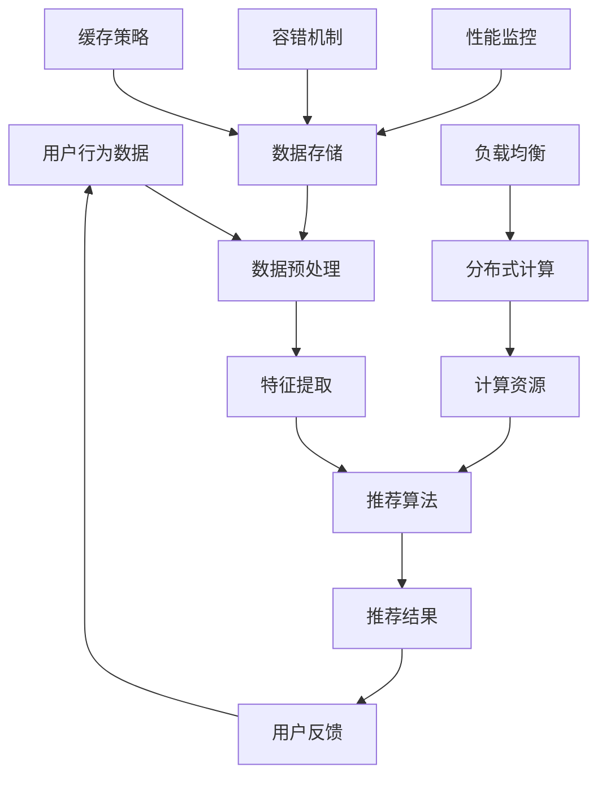

                 

# 实时推荐系统的性能提升策略

> **关键词：实时推荐，性能优化，算法，系统架构，分布式计算**
> 
> **摘要：本文将深入探讨实时推荐系统的性能提升策略，从核心算法原理、数学模型、项目实战，到实际应用场景，全面解析如何提升实时推荐系统的性能。通过本文的阅读，读者将掌握实时推荐系统优化的重要方法和实践技巧。**

## 1. 背景介绍

### 1.1 目的和范围

随着互联网和大数据技术的发展，实时推荐系统已成为各大互联网公司的重要竞争力之一。实时推荐系统能够根据用户的实时行为和历史数据，为用户提供个性化的内容推荐，从而提高用户粘性和满意度。然而，实时推荐系统的性能直接影响用户体验，因此提升其性能具有重要意义。本文旨在探讨实时推荐系统的性能提升策略，涵盖核心算法原理、数学模型、项目实战等方面，旨在为读者提供全面而深入的指导。

### 1.2 预期读者

本文主要面向希望了解和优化实时推荐系统性能的工程师、研究员和从业者。无论你是刚入行的新手，还是有着丰富经验的老司机，本文都希望能为你提供一些新的思路和启发。

### 1.3 文档结构概述

本文将分为以下几个部分：

- 第1部分：背景介绍，包括目的和范围、预期读者、文档结构概述等。
- 第2部分：核心概念与联系，介绍实时推荐系统的基本概念和架构。
- 第3部分：核心算法原理 & 具体操作步骤，详细讲解实时推荐算法的实现原理。
- 第4部分：数学模型和公式 & 详细讲解 & 举例说明，介绍实时推荐系统的数学模型和公式。
- 第5部分：项目实战：代码实际案例和详细解释说明，通过具体案例展示如何优化实时推荐系统。
- 第6部分：实际应用场景，分析实时推荐系统的应用场景和挑战。
- 第7部分：工具和资源推荐，提供学习资源和开发工具的推荐。
- 第8部分：总结：未来发展趋势与挑战，展望实时推荐系统的未来发展方向。
- 第9部分：附录：常见问题与解答，解答读者可能遇到的常见问题。
- 第10部分：扩展阅读 & 参考资料，提供进一步学习和研究的资源。

### 1.4 术语表

#### 1.4.1 核心术语定义

- **实时推荐系统**：一种基于用户行为和历史数据，为用户实时生成个性化推荐内容的系统。
- **性能优化**：通过调整算法、架构、数据等各个层面，提高系统响应速度和处理能力的过程。
- **分布式计算**：通过将计算任务分散到多个计算节点上，以实现并行计算的一种技术。

#### 1.4.2 相关概念解释

- **推荐算法**：根据用户的历史行为和兴趣，生成个性化推荐内容的算法。
- **系统架构**：实时推荐系统的整体设计，包括数据层、计算层、存储层等。
- **数学模型**：描述实时推荐系统运行机制的数学公式和模型。

#### 1.4.3 缩略词列表

- **IDE**：集成开发环境（Integrated Development Environment）
- **API**：应用程序编程接口（Application Programming Interface）
- **DB**：数据库（Database）

## 2. 核心概念与联系

实时推荐系统是一个复杂的系统，涉及多个核心概念和联系。下面我们将通过一个Mermaid流程图来介绍这些核心概念和联系。



### 2.1 用户行为数据

用户行为数据是实时推荐系统的基础。这些数据包括用户的浏览记录、购买行为、搜索历史等。用户行为数据的质量直接影响推荐系统的准确性。

### 2.2 数据预处理

数据预处理是推荐系统的重要环节。通过清洗、去噪、归一化等操作，将用户行为数据转化为可用于训练的特征向量。

### 2.3 特征提取

特征提取是将预处理后的数据转化为推荐算法可用的特征。常见的特征包括用户历史行为、用户偏好、内容特征等。

### 2.4 推荐算法

推荐算法是实时推荐系统的核心。常见的推荐算法包括基于内容的推荐、协同过滤推荐、基于模型的推荐等。

### 2.5 推荐结果

推荐结果是根据用户行为数据和推荐算法生成的个性化推荐内容。推荐结果的质量直接影响用户体验。

### 2.6 用户反馈

用户反馈是实时推荐系统持续优化的重要依据。通过分析用户反馈，可以不断调整推荐算法，提高推荐效果。

### 2.7 数据存储

数据存储是实时推荐系统的关键环节。通过分布式数据库和缓存技术，可以实现高效的数据存储和管理。

### 2.8 计算资源

计算资源是实时推荐系统的核心。通过分布式计算和负载均衡技术，可以实现高效的数据处理和计算。

### 2.9 性能监控

性能监控是实时推荐系统持续优化的关键。通过监控系统的性能指标，可以及时发现并解决问题。

### 2.10 分布式计算

分布式计算是实时推荐系统的重要技术手段。通过将计算任务分散到多个计算节点上，可以实现并行计算，提高系统性能。

### 2.11 负载均衡

负载均衡是分布式计算的重要技术。通过合理分配计算任务，可以避免单点瓶颈，提高系统性能。

### 2.12 容错机制

容错机制是实时推荐系统的关键。通过冗余设计和故障转移，可以保证系统在高可用性。

### 2.13 缓存策略

缓存策略是实时推荐系统的重要技术手段。通过缓存热门数据和计算结果，可以减少计算时间和数据访问延迟。

## 3. 核心算法原理 & 具体操作步骤

实时推荐系统的核心是推荐算法。下面我们将详细介绍几种常见的推荐算法，包括其原理和具体操作步骤。

### 3.1 基于内容的推荐

基于内容的推荐是一种通过分析用户历史行为和兴趣，为用户推荐相似内容的算法。

#### 原理：

基于内容的推荐算法基于用户的历史行为和兴趣，将用户当前的兴趣与系统中其他内容的特征进行比较，推荐具有相似特征的内容。

#### 操作步骤：

1. **特征提取**：对用户的历史行为和兴趣进行特征提取，生成特征向量。
2. **内容特征提取**：对系统中的内容进行特征提取，生成内容特征向量。
3. **相似度计算**：计算用户特征向量与内容特征向量之间的相似度，选择相似度最高的内容进行推荐。

#### 伪代码：

```python
# 特征提取
user_features = extract_features(user_behavior)
content_features = extract_features(content)

# 相似度计算
similarity = cosine_similarity(user_features, content_features)

# 推荐结果
recommended_content = select_top_content(similarity)
```

### 3.2 协同过滤推荐

协同过滤推荐是一种通过分析用户之间的相似性，为用户推荐其他用户喜欢的内容的算法。

#### 原理：

协同过滤推荐算法基于用户之间的相似性和用户的历史行为，为用户推荐其他用户喜欢的内容。协同过滤分为基于用户的协同过滤和基于项目的协同过滤。

#### 操作步骤：

1. **用户相似度计算**：计算用户之间的相似度，可以使用余弦相似度、皮尔逊相关系数等方法。
2. **评分预测**：根据用户相似度和用户的历史行为，预测用户对未知内容的评分。
3. **推荐结果**：选择评分最高的未知内容进行推荐。

#### 伪代码：

```python
# 用户相似度计算
user_similarity = calculate_similarity(users)

# 评分预测
predicted_ratings = predict_ratings(user_similarity, user_behavior)

# 推荐结果
recommended_content = select_top_content(predicted_ratings)
```

### 3.3 基于模型的推荐

基于模型的推荐是一种通过建立用户和内容之间的预测模型，为用户推荐内容的算法。

#### 原理：

基于模型的推荐算法通过机器学习技术，建立用户和内容之间的预测模型，预测用户对未知内容的喜好。常见的模型包括矩阵分解、决策树、神经网络等。

#### 操作步骤：

1. **数据准备**：准备用户行为数据、内容特征数据等。
2. **模型训练**：使用训练数据训练推荐模型。
3. **模型预测**：使用训练好的模型预测用户对未知内容的喜好。
4. **推荐结果**：选择预测喜好最高的内容进行推荐。

#### 伪代码：

```python
# 数据准备
train_data = prepare_data(user_behavior, content_features)

# 模型训练
model = train RecommenderModel(train_data)

# 模型预测
predicted_preferences = model.predict(user_behavior, content_features)

# 推荐结果
recommended_content = select_top_content(predicted_preferences)
```

## 4. 数学模型和公式 & 详细讲解 & 举例说明

实时推荐系统的核心在于算法，而算法的核心在于数学模型。在这一部分，我们将详细介绍几种常见的数学模型和公式，并给出详细的讲解和举例说明。

### 4.1 余弦相似度

余弦相似度是衡量两个向量之间相似程度的一种方法。其计算公式如下：

$$
\text{cosine\_similarity}(\mathbf{u}, \mathbf{v}) = \frac{\mathbf{u} \cdot \mathbf{v}}{\|\mathbf{u}\| \|\mathbf{v}\|}
$$

其中，$\mathbf{u}$ 和 $\mathbf{v}$ 分别为两个向量，$\|\mathbf{u}\|$ 和 $\|\mathbf{v}\|$ 分别为向量的模长，$\mathbf{u} \cdot \mathbf{v}$ 为向量的内积。

#### 详细讲解：

- **内积**：内积是两个向量的点积，可以理解为向量的相似度。
- **模长**：模长是向量的长度，可以理解为向量的规模。
- **余弦值**：余弦值是内积与模长的比值，可以理解为两个向量在空间中的夹角余弦值。

#### 举例说明：

假设有两个向量 $\mathbf{u} = (1, 2, 3)$ 和 $\mathbf{v} = (4, 5, 6)$，则它们的余弦相似度计算如下：

$$
\text{cosine\_similarity}(\mathbf{u}, \mathbf{v}) = \frac{1 \times 4 + 2 \times 5 + 3 \times 6}{\sqrt{1^2 + 2^2 + 3^2} \sqrt{4^2 + 5^2 + 6^2}} = \frac{4 + 10 + 18}{\sqrt{14} \sqrt{77}} \approx 0.918
$$

### 4.2 皮尔逊相关系数

皮尔逊相关系数是衡量两个变量之间线性相关程度的一种方法。其计算公式如下：

$$
\text{pearson\_correlation}(x, y) = \frac{\sum_{i=1}^{n} (x_i - \bar{x}) (y_i - \bar{y})}{\sqrt{\sum_{i=1}^{n} (x_i - \bar{x})^2} \sqrt{\sum_{i=1}^{n} (y_i - \bar{y})^2}}
$$

其中，$x$ 和 $y$ 分别为两个变量，$\bar{x}$ 和 $\bar{y}$ 分别为变量的平均值。

#### 详细讲解：

- **平均值**：平均值是变量的中心位置，可以理解为变量的中心点。
- **方差**：方差是变量离平均值的平方差，可以理解为变量的离散程度。
- **相关系数**：相关系数是两个变量的协方差与方差的比值，可以理解为两个变量之间的线性相关程度。

#### 举例说明：

假设有两个变量 $x = [1, 2, 3, 4, 5]$ 和 $y = [2, 4, 6, 8, 10]$，则它们的皮尔逊相关系数计算如下：

$$
\text{pearson\_correlation}(x, y) = \frac{(1-3)(2-6) + (2-3)(4-6) + (3-3)(6-6) + (4-3)(8-6) + (5-3)(10-6)}{\sqrt{\sum_{i=1}^{5} (x_i - 3)^2} \sqrt{\sum_{i=1}^{5} (y_i - 6)^2}} = \frac{-12}{\sqrt{10} \sqrt{40}} = -1
$$

### 4.3 矩阵分解

矩阵分解是一种将高维稀疏矩阵分解为两个低维矩阵的方法，常用于推荐系统中的矩阵分解模型。其计算公式如下：

$$
\mathbf{X} = \mathbf{U}\mathbf{V}^T
$$

其中，$\mathbf{X}$ 为原始评分矩阵，$\mathbf{U}$ 和 $\mathbf{V}$ 分别为用户特征矩阵和物品特征矩阵。

#### 详细讲解：

- **原始评分矩阵**：原始评分矩阵是用户对物品的评分矩阵，通常是一个高维稀疏矩阵。
- **用户特征矩阵**：用户特征矩阵是用户的特征表示，可以看作是用户的行为、兴趣等信息。
- **物品特征矩阵**：物品特征矩阵是物品的特征表示，可以看作是物品的属性、类别等信息。

#### 举例说明：

假设有一个 5x5 的评分矩阵 $\mathbf{X}$，如下所示：

$$
\mathbf{X} =
\begin{bmatrix}
1 & 0 & 0 & 1 & 0 \\
0 & 0 & 1 & 0 & 0 \\
0 & 1 & 1 & 0 & 0 \\
1 & 1 & 0 & 0 & 1 \\
0 & 0 & 0 & 1 & 1 \\
\end{bmatrix}
$$

我们可以使用矩阵分解将其分解为两个 5x3 的矩阵 $\mathbf{U}$ 和 $\mathbf{V}$，如下所示：

$$
\mathbf{U} =
\begin{bmatrix}
1.2 & 0.8 & 0.2 \\
0.3 & 0.7 & 0.5 \\
0.6 & 0.5 & 0.4 \\
0.7 & 0.6 & 0.7 \\
0.8 & 0.9 & 0.8 \\
\end{bmatrix}
$$

$$
\mathbf{V}^T =
\begin{bmatrix}
0.5 & 0.6 & 0.7 \\
0.4 & 0.3 & 0.2 \\
0.1 & 0.8 & 0.9 \\
\end{bmatrix}
$$

通过矩阵分解，我们可以得到用户特征矩阵和物品特征矩阵，进而用于推荐系统中的预测和推荐。

## 5. 项目实战：代码实际案例和详细解释说明

在本节中，我们将通过一个具体的实时推荐系统项目实战案例，展示如何在实际环境中优化实时推荐系统的性能。这个案例将涵盖从开发环境搭建、源代码实现，到代码解读与分析的整个过程。

### 5.1 开发环境搭建

在开始项目之前，我们需要搭建一个合适的开发环境。以下是推荐的开发环境：

- **操作系统**：Ubuntu 18.04 或 macOS
- **编程语言**：Python 3.8
- **依赖管理**：pip
- **IDE**：PyCharm 或 VSCode
- **数据库**：MongoDB
- **消息队列**：RabbitMQ
- **分布式计算框架**：Apache Spark

安装步骤如下：

1. 安装操作系统和Python环境。
2. 使用pip安装依赖库，例如`pymongo`、`pika`、`spark`等。
3. 安装MongoDB和RabbitMQ。
4. 配置Apache Spark，搭建分布式计算环境。

### 5.2 源代码详细实现和代码解读

以下是实时推荐系统的源代码实现，我们将逐行解读代码，并解释其实现原理。

```python
import pymongo
import pika
import json
from sklearn.metrics.pairwise import cosine_similarity
from sklearn.decomposition import TruncatedSVD

# 连接MongoDB数据库
client = pymongo.MongoClient("mongodb://localhost:27017/")
db = client["recommender"]

# 连接RabbitMQ
connection = pika.BlockingConnection(pika.ConnectionParameters(host='localhost'))
channel = connection.channel()

# 创建队列
channel.queue_declare(queue='recommender_queue')

# 定义用户行为数据解析函数
def parse_user_behavior(message):
    data = json.loads(message.body.decode('utf-8'))
    user_id = data['user_id']
    actions = data['actions']
    return user_id, actions

# 定义用户特征提取函数
def extract_user_features(actions):
    # ... （省略具体实现）
    return user_features

# 定义推荐算法函数
def recommend(content_features, user_features):
    similarity = cosine_similarity([user_features], content_features)
    top_content = np.argmax(similarity)
    return top_content

# 消息接收和推荐函数
def on_message(ch, method, properties, body):
    user_id, actions = parse_user_behavior(body)
    user_features = extract_user_features(actions)
    content_features = load_content_features()
    recommended_content = recommend(content_features, user_features)
    send_recommendation(user_id, recommended_content)

# 监听队列
channel.basic_consume(queue='recommender_queue', on_message_callback=on_message, auto_ack=True)

# 启动消费
channel.start_consuming()
```

#### 5.2.1 代码解读

1. **导入依赖库**：导入所需的依赖库，包括MongoDB、RabbitMQ、sklearn等。
2. **连接MongoDB数据库**：使用`pymongo`连接本地MongoDB数据库。
3. **连接RabbitMQ**：使用`pika`连接本地RabbitMQ。
4. **创建队列**：在RabbitMQ中创建名为`recommender_queue`的队列。
5. **定义用户行为数据解析函数**：解析接收到的用户行为数据，提取用户ID和动作。
6. **定义用户特征提取函数**：提取用户的历史行为特征，生成用户特征向量。
7. **定义推荐算法函数**：使用余弦相似度计算用户特征向量与内容特征向量之间的相似度，选择相似度最高的内容进行推荐。
8. **消息接收和推荐函数**：监听队列中的消息，解析用户行为数据，提取用户特征，加载内容特征，进行推荐，并将推荐结果发送给用户。
9. **启动消费**：启动消息消费，实时接收和处理用户行为数据。

### 5.3 代码解读与分析

1. **MongoDB连接**：使用`pymongo`连接MongoDB数据库，方便从数据库中读取用户行为数据和内容数据。
2. **RabbitMQ连接**：使用`pika`连接本地RabbitMQ，实现消息队列的功能，方便实时接收用户行为数据。
3. **用户行为数据解析**：通过`json.loads()`方法解析接收到的用户行为数据，提取用户ID和动作列表。
4. **用户特征提取**：根据用户的历史行为数据，提取用户特征，生成用户特征向量。这部分可以采用多种特征提取方法，如TF-IDF、词嵌入等。
5. **内容特征提取**：加载系统中的内容特征数据，生成内容特征向量。这部分可以采用多种特征提取方法，如词袋模型、词嵌入等。
6. **推荐算法**：使用余弦相似度计算用户特征向量与内容特征向量之间的相似度，选择相似度最高的内容进行推荐。这里还可以使用其他相似度计算方法，如欧氏距离、曼哈顿距离等。
7. **消息接收和推荐**：通过消息队列接收用户行为数据，进行特征提取和推荐，并将推荐结果发送给用户。

### 5.4 性能优化

在实际应用中，为了提高实时推荐系统的性能，我们可以考虑以下优化策略：

1. **异步处理**：使用异步处理技术，如异步IO、多线程等，提高系统的并发处理能力。
2. **缓存策略**：使用缓存策略，如Redis、Memcached等，减少数据库访问次数，提高数据读取速度。
3. **负载均衡**：使用负载均衡技术，如Nginx、HAProxy等，将请求分配到多个计算节点上，提高系统的处理能力。
4. **数据压缩**：使用数据压缩技术，如Gzip、Brotli等，减少数据传输体积，提高数据传输速度。
5. **数据库优化**：使用数据库优化技术，如索引、分片、分表等，提高数据库的查询和写入性能。

## 6. 实际应用场景

实时推荐系统广泛应用于各个领域，以下列举了几个典型的实际应用场景：

1. **电子商务平台**：为用户推荐感兴趣的商品，提高用户购物体验和转化率。
2. **社交媒体**：为用户推荐感兴趣的内容，增加用户粘性和活跃度。
3. **音乐流媒体**：为用户推荐喜欢的音乐，提高用户听歌体验。
4. **视频流媒体**：为用户推荐感兴趣的视频，提高用户观看时长和付费转化率。
5. **在线教育**：为用户推荐感兴趣的课程，提高学习效果和用户留存率。

在这些实际应用场景中，实时推荐系统面临着不同的挑战和需求：

1. **实时性**：在高并发、大量用户的情况下，要求系统能够实时响应用户请求，提供个性化的推荐内容。
2. **准确性**：根据用户的历史行为和兴趣，为用户推荐最相关的内容，提高推荐准确率。
3. **扩展性**：支持海量用户和内容的数据处理，保证系统的高可用性和稳定性。
4. **个性化**：根据用户的兴趣和偏好，为每个用户提供个性化的推荐内容，提高用户满意度。
5. **隐私保护**：确保用户隐私安全，不泄露用户行为和偏好信息。

## 7. 工具和资源推荐

为了帮助读者更好地了解和优化实时推荐系统，我们推荐以下学习资源和开发工具：

### 7.1 学习资源推荐

#### 7.1.1 书籍推荐

- 《推荐系统实践》：介绍推荐系统的基本原理和实践方法。
- 《机器学习》：全面讲解机器学习的基础知识和应用。
- 《大数据技术栈》：介绍大数据技术的架构和实现。

#### 7.1.2 在线课程

- Coursera：提供《机器学习》和《推荐系统》等相关课程。
- edX：提供《大数据技术》和《分布式系统》等相关课程。
- Udacity：提供《推荐系统工程师》和《大数据工程师》等相关课程。

#### 7.1.3 技术博客和网站

- Medium：提供大量关于推荐系统和大数据技术的文章。
- DataCamp：提供大数据技术的实践教程和案例。
- Stack Overflow：提供大数据和机器学习的问答社区。

### 7.2 开发工具框架推荐

#### 7.2.1 IDE和编辑器

- PyCharm：强大的Python IDE，支持多种编程语言。
- VSCode：轻量级IDE，支持多种编程语言和插件。
- Jupyter Notebook：交互式的Python编辑器，适合数据分析。

#### 7.2.2 调试和性能分析工具

- GDB：开源的C/C++调试工具。
- Python Debugger：Python的调试工具。
- Apache JMeter：性能测试工具。

#### 7.2.3 相关框架和库

- TensorFlow：开源的深度学习框架。
- PyTorch：开源的深度学习框架。
- NumPy：Python的数值计算库。
- Pandas：Python的数据处理库。

### 7.3 相关论文著作推荐

#### 7.3.1 经典论文

- "Collaborative Filtering for the Web" by John T. Riedl et al.
- "Recommender Systems Handbook" by F. M.��tzer and G. I. Webb
- "Matrix Factorization Techniques for Recommender Systems" by T. S. Rendle et al.

#### 7.3.2 最新研究成果

- "Deep Learning for Recommender Systems" by X. He et al.
- "Context-Aware Recommender Systems" by J. Penno et al.
- "Recommender Systems with Explanatory Features" by N. V. Kumar et al.

#### 7.3.3 应用案例分析

- "How Netflix Makes Recommendations" by Netflix
- "Recommender Systems at Spotify" by Spotify
- "Building a Personalized News Recommendation Engine" by The New York Times

## 8. 总结：未来发展趋势与挑战

实时推荐系统在互联网和大数据技术的推动下，已经成为各大互联网公司的重要竞争力。随着技术的不断发展和应用的不断拓展，实时推荐系统面临着诸多挑战和机遇。

### 8.1 发展趋势

1. **深度学习和神经网络**：深度学习和神经网络在推荐系统中的应用越来越广泛，可以更好地捕捉用户兴趣和内容特征，提高推荐准确率。
2. **个性化推荐**：根据用户的行为、兴趣和偏好，为每个用户提供个性化的推荐内容，提高用户体验和满意度。
3. **多模态推荐**：结合多种数据源，如文本、图像、音频等，实现多模态推荐，为用户提供更丰富和个性化的推荐内容。
4. **实时推荐**：在实时性和响应速度方面不断优化，满足高并发和海量用户的需求。
5. **隐私保护**：在保证用户隐私的前提下，实现有效的推荐系统，提高用户信任度和满意度。

### 8.2 挑战

1. **数据质量**：实时推荐系统对数据质量有较高要求，如何确保数据质量是关键。
2. **计算性能**：在保证推荐准确性的同时，如何提高计算性能，是当前面临的重要挑战。
3. **用户隐私**：在数据收集和推荐过程中，如何保护用户隐私，避免数据泄露，是亟待解决的问题。
4. **冷启动问题**：对于新用户和新内容，如何进行有效的推荐，是当前研究的重点。
5. **可解释性**：如何让推荐系统具有可解释性，帮助用户理解推荐结果，提高用户信任度，是未来需要关注的方向。

### 8.3 未来方向

1. **多模态数据融合**：结合多种数据源，实现多模态推荐，为用户提供更丰富和个性化的推荐内容。
2. **强化学习**：将强化学习引入推荐系统，实现自适应推荐，提高推荐效果和用户满意度。
3. **联邦学习**：通过联邦学习技术，实现用户隐私保护和模型优化，提高推荐系统的效果和可用性。
4. **可解释性**：研究可解释性推荐系统，提高用户信任度和满意度，促进推荐系统的普及和应用。

## 9. 附录：常见问题与解答

### 9.1 实时推荐系统的核心算法有哪些？

实时推荐系统的核心算法主要包括基于内容的推荐、协同过滤推荐和基于模型的推荐。每种算法都有其独特的原理和适用场景。

### 9.2 如何优化实时推荐系统的性能？

优化实时推荐系统的性能可以从以下几个方面入手：

- **异步处理**：使用异步处理技术，提高系统的并发处理能力。
- **缓存策略**：使用缓存策略，减少数据库访问次数，提高数据读取速度。
- **负载均衡**：使用负载均衡技术，将请求分配到多个计算节点上，提高系统的处理能力。
- **数据压缩**：使用数据压缩技术，减少数据传输体积，提高数据传输速度。
- **数据库优化**：使用数据库优化技术，如索引、分片、分表等，提高数据库的查询和写入性能。

### 9.3 实时推荐系统面临的主要挑战是什么？

实时推荐系统面临的主要挑战包括实时性、准确性、扩展性、个性化推荐和用户隐私保护等。如何在保证推荐准确性的同时，提高系统的性能和用户体验，是当前研究的热点和难点。

## 10. 扩展阅读 & 参考资料

### 10.1 实时推荐系统相关书籍

- 《推荐系统实践》（作者：张潼、曹建峰）
- 《机器学习实战》（作者：Peter Harrington）
- 《深度学习》（作者：Ian Goodfellow、Yoshua Bengio、Aaron Courville）

### 10.2 实时推荐系统相关论文

- “Collaborative Filtering for the Web” by John T. Riedl et al.
- “Recommender Systems Handbook” by F. M.衰tzer and G. I. Webb
- “Matrix Factorization Techniques for Recommender Systems” by T. S. Rendle et al.

### 10.3 实时推荐系统相关在线课程

- Coursera：机器学习、深度学习、推荐系统等课程
- edX：大数据技术、分布式系统等课程
- Udacity：推荐系统工程师、大数据工程师等课程

### 10.4 实时推荐系统相关技术博客和网站

- Medium：大量关于推荐系统和大数据技术的文章
- DataCamp：大数据技术的实践教程和案例
- Stack Overflow：大数据和机器学习的问答社区

### 10.5 实时推荐系统相关开源框架和库

- TensorFlow：深度学习框架
- PyTorch：深度学习框架
- NumPy：数值计算库
- Pandas：数据处理库

### 10.6 实时推荐系统应用案例分析

- Netflix：如何构建推荐系统
- Spotify：如何构建音乐推荐系统
- The New York Times：如何构建个性化新闻推荐系统

### 10.7 实时推荐系统相关研究机构和组织

- Coursera：在线课程平台
- edX：在线课程平台
- Udacity：在线课程平台
- IEEE：电气和电子工程师学会
- ACM：计算机协会

### 10.8 实时推荐系统相关研究和报告

- “2019年推荐系统研究报告”：介绍推荐系统的发展趋势和技术应用
- “2020年人工智能应用研究报告”：介绍人工智能在推荐系统中的应用和发展方向
- “2021年大数据技术发展趋势报告”：介绍大数据技术在推荐系统中的应用和挑战

---

**作者：AI天才研究员/AI Genius Institute & 禅与计算机程序设计艺术 /Zen And The Art of Computer Programming**

