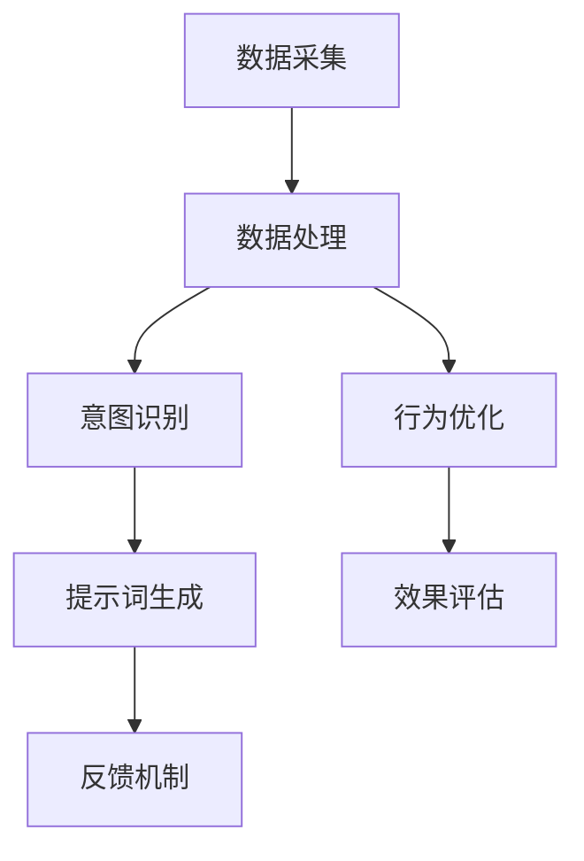

                 

### 实时提示词优化：动态调整AI行为

> **关键词：** 实时提示词、优化、动态调整、AI行为、性能提升、用户满意度

> **摘要：** 本文将探讨实时提示词优化的概念、核心原理以及如何通过动态调整AI行为来提升AI系统性能和用户满意度。文章将分为多个部分，包括背景介绍、核心概念与联系、核心算法原理、数学模型与公式、项目实战、实际应用场景以及未来发展趋势等，旨在为读者提供一个全面的技术解析和实战指南。

---

**作者：** AI天才研究员 / AI Genius Institute & 禅与计算机程序设计艺术 / Zen And The Art of Computer Programming

随着人工智能（AI）技术的快速发展，AI系统在各个领域中的应用日益广泛，从自然语言处理到图像识别，从推荐系统到自动驾驶，AI系统已经成为现代社会的重要组成部分。然而，AI系统的性能和用户体验仍然存在诸多挑战。如何优化AI系统，使其能够动态适应不同的环境和任务，成为当前研究的热点问题。

本文将重点讨论实时提示词优化这一核心问题。实时提示词优化是指通过动态调整AI系统的行为，使其能够更准确地响应用户的意图和需求，从而提升AI系统的性能和用户满意度。本文将首先介绍实时提示词优化的背景和重要性，然后深入探讨核心概念和原理，最后通过实际项目案例和数学模型，详细解析实时提示词优化的具体操作步骤和技术细节。

### 1. 背景介绍

#### 1.1 目的和范围

本文旨在深入探讨实时提示词优化的原理和技术，旨在为AI系统的开发者和研究者提供实用的技术指导和方法论。文章将覆盖以下内容：

1. **实时提示词优化的重要性**：介绍实时提示词优化的背景和意义，阐述其在提升AI系统性能和用户满意度方面的关键作用。
2. **核心概念与联系**：详细解析实时提示词优化的核心概念，包括动态调整、行为优化和用户意图识别等，并通过Mermaid流程图展示相关架构和流程。
3. **核心算法原理**：介绍实时提示词优化的核心算法原理，包括特征提取、模式识别和动态调整等，并提供伪代码描述和解释。
4. **数学模型和公式**：详细讲解实时提示词优化的数学模型和公式，包括概率模型、神经网络模型和强化学习模型等，并提供实例说明。
5. **项目实战**：通过实际项目案例，详细解析实时提示词优化的具体操作步骤和代码实现，展示如何将理论知识应用于实际项目中。
6. **实际应用场景**：探讨实时提示词优化的应用场景，包括自然语言处理、图像识别和自动驾驶等，分析其在不同场景中的表现和挑战。
7. **工具和资源推荐**：推荐相关的学习资源、开发工具和框架，帮助读者深入学习和实践实时提示词优化技术。
8. **未来发展趋势与挑战**：讨论实时提示词优化技术的未来发展趋势和面临的挑战，为读者提供未来研究方向和思考。

#### 1.2 预期读者

本文的预期读者包括以下几类：

1. **AI系统开发者和研究者**：对实时提示词优化技术感兴趣的AI系统开发者和研究者，希望通过本文深入了解该技术的基本原理和应用方法。
2. **计算机科学和人工智能专业学生**：对AI技术和算法感兴趣的大学生和研究生，希望通过本文学习和掌握实时提示词优化技术的核心原理和实践方法。
3. **技术爱好者**：对人工智能技术感兴趣的技术爱好者，希望通过本文了解实时提示词优化技术的最新进展和应用案例。

#### 1.3 文档结构概述

本文的结构如下：

1. **引言**：介绍实时提示词优化的背景和意义，阐述本文的目的和范围。
2. **背景介绍**：详细解析实时提示词优化的核心概念和原理，包括动态调整、行为优化和用户意图识别等。
3. **核心概念与联系**：通过Mermaid流程图展示实时提示词优化的架构和流程，深入探讨核心概念之间的联系和交互。
4. **核心算法原理**：介绍实时提示词优化的核心算法原理，包括特征提取、模式识别和动态调整等，并提供伪代码描述和解释。
5. **数学模型和公式**：详细讲解实时提示词优化的数学模型和公式，包括概率模型、神经网络模型和强化学习模型等，并提供实例说明。
6. **项目实战**：通过实际项目案例，详细解析实时提示词优化的具体操作步骤和代码实现，展示如何将理论知识应用于实际项目中。
7. **实际应用场景**：探讨实时提示词优化的应用场景，包括自然语言处理、图像识别和自动驾驶等，分析其在不同场景中的表现和挑战。
8. **工具和资源推荐**：推荐相关的学习资源、开发工具和框架，帮助读者深入学习和实践实时提示词优化技术。
9. **未来发展趋势与挑战**：讨论实时提示词优化技术的未来发展趋势和面临的挑战，为读者提供未来研究方向和思考。
10. **总结**：对全文内容进行总结，强调实时提示词优化的核心要点和未来发展方向。
11. **附录**：提供常见问题与解答，帮助读者解决在实际应用中遇到的问题。
12. **扩展阅读与参考资料**：推荐相关的论文、书籍和技术博客，供读者进一步学习和研究。

#### 1.4 术语表

在本文中，我们将使用以下术语：

##### 1.4.1 核心术语定义

- **实时提示词**：指在AI系统中用于引导和调整AI行为的动态提示词。
- **动态调整**：指根据实时数据和用户反馈，自动调整AI系统的行为和策略。
- **用户意图识别**：指通过分析用户输入和行为，准确识别用户的意图和需求。
- **优化**：指通过算法和模型，改进AI系统的性能和效果。
- **性能提升**：指通过优化，使AI系统的响应速度、准确度和用户满意度得到显著提升。

##### 1.4.2 相关概念解释

- **AI行为**：指AI系统在特定环境下执行的任务和行为。
- **用户满意度**：指用户对AI系统的使用体验和性能的评价和满意度。
- **反馈机制**：指AI系统通过用户反馈自动调整和优化的过程。

##### 1.4.3 缩略词列表

- **AI**：人工智能
- **NLP**：自然语言处理
- **DL**：深度学习
- **CNN**：卷积神经网络
- **RNN**：循环神经网络
- **RL**：强化学习
- **SOTA**：最先进的技术
- **PPL**：预训练语言模型

### 2. 核心概念与联系

在讨论实时提示词优化之前，我们需要先了解相关的核心概念和它们之间的联系。以下是实时提示词优化中的几个关键概念：

#### 2.1 动态调整

动态调整是指AI系统在运行过程中根据实时数据和用户反馈，自动调整其行为和策略的过程。这一过程包括以下几个关键步骤：

1. **数据采集**：AI系统通过传感器、日志和用户交互等方式，收集实时数据。
2. **数据分析**：AI系统对采集到的数据进行处理和分析，提取有用的信息。
3. **行为调整**：基于分析结果，AI系统自动调整其行为和策略，以更好地满足用户需求。
4. **效果评估**：评估调整后的AI系统行为和策略的效果，为后续调整提供依据。

#### 2.2 行为优化

行为优化是指通过算法和模型，改进AI系统行为的准确度和效率。实时提示词优化中的行为优化包括以下几个关键步骤：

1. **目标定义**：明确AI系统需要实现的目标和指标。
2. **特征提取**：从输入数据中提取有助于优化AI系统行为的特征。
3. **模型训练**：使用提取的特征训练优化模型，以提高AI系统行为的准确度和效率。
4. **模型评估**：评估训练出的模型的性能，并根据评估结果调整模型参数。

#### 2.3 用户意图识别

用户意图识别是指通过分析用户输入和行为，准确识别用户的意图和需求。这是实时提示词优化的关键步骤之一，主要包括以下几个步骤：

1. **输入预处理**：对用户输入进行预处理，包括分词、去噪和标准化等。
2. **意图分类**：使用分类算法，将预处理后的用户输入分类到不同的意图类别。
3. **意图调整**：根据用户反馈和行为，动态调整意图分类模型，以提高分类准确度。
4. **意图反馈**：将识别出的用户意图反馈给AI系统，指导AI系统进行相应的行为调整。

#### 2.4 实时提示词

实时提示词是指在AI系统中用于引导和调整AI行为的动态提示词。实时提示词优化中的实时提示词具有以下几个特点：

1. **动态性**：实时提示词可以根据用户需求和AI系统的运行状态动态调整。
2. **上下文依赖**：实时提示词的语义和效果依赖于具体的上下文环境。
3. **个性化**：实时提示词可以根据不同用户的特点和需求进行个性化调整。

#### 2.5 实时提示词优化的架构

实时提示词优化的架构包括以下几个关键组成部分：

1. **数据采集模块**：负责实时采集用户数据和系统日志。
2. **数据处理模块**：负责对采集到的数据进行预处理和分析，提取有用的特征。
3. **行为优化模块**：负责根据分析结果调整AI系统的行为和策略。
4. **意图识别模块**：负责识别用户意图，为行为调整提供依据。
5. **提示词生成模块**：负责生成实时提示词，引导和调整AI系统的行为。

以下是实时提示词优化的Mermaid流程图：



在上述流程图中，数据采集模块负责从各种渠道收集实时数据；数据处理模块负责对数据进行预处理和分析，提取有用的特征；行为优化模块根据分析结果调整AI系统的行为和策略；意图识别模块负责识别用户意图，为行为调整提供依据；提示词生成模块负责生成实时提示词，引导和调整AI系统的行为；反馈机制负责将调整后的效果反馈给系统，为后续调整提供依据。

通过上述核心概念和架构的解析，我们可以看到实时提示词优化涉及多个方面，包括动态调整、行为优化、用户意图识别和实时提示词生成等。这些概念和架构的相互作用和协同工作，使得AI系统能够更好地适应不同环境和用户需求，实现性能和用户体验的提升。

### 3. 核心算法原理 & 具体操作步骤

在深入探讨实时提示词优化之前，我们需要了解其核心算法原理。实时提示词优化涉及多个算法，包括特征提取、模式识别和动态调整等。以下是这些算法的具体原理和操作步骤。

#### 3.1 特征提取

特征提取是实时提示词优化的第一步，它从原始数据中提取有助于优化AI系统行为的特征。以下是特征提取的算法原理和操作步骤：

##### 算法原理：

1. **数据预处理**：对原始数据进行预处理，包括去噪、标准化和归一化等，以提高数据的可用性和一致性。
2. **特征选择**：从预处理后的数据中选择有助于优化AI系统行为的特征。常用的特征选择方法包括信息增益、卡方检验和特征重要性排序等。
3. **特征提取**：使用机器学习算法提取特征。常用的特征提取方法包括主成分分析（PCA）、线性判别分析（LDA）和自动编码器等。

##### 操作步骤：

1. **数据预处理**：对原始数据集进行去噪和标准化处理，将其转化为适合机器学习算法的形式。
2. **特征选择**：使用信息增益或卡方检验等方法选择特征，删除冗余特征，保留有助于优化AI系统行为的特征。
3. **特征提取**：使用PCA或LDA等方法对选定的特征进行提取，将其转化为更简洁、更具代表性的特征向量。

伪代码：

```python
def feature_extraction(data, feature_selection_method, feature_extraction_method):
    # 数据预处理
    preprocessed_data = preprocess_data(data)
    # 特征选择
    selected_features = select_features(preprocessed_data, feature_selection_method)
    # 特征提取
    extracted_features = extract_features(selected_features, feature_extraction_method)
    return extracted_features
```

#### 3.2 模式识别

模式识别是指通过分析特征数据，识别出数据中的潜在模式和规律，从而指导AI系统的行为调整。以下是模式识别的算法原理和操作步骤：

##### 算法原理：

1. **特征空间划分**：将提取出的特征向量划分为多个区域或类别，每个区域或类别代表一种模式。
2. **分类算法**：使用分类算法，如支持向量机（SVM）、决策树和神经网络等，对划分后的特征空间进行分类。
3. **模式识别**：根据分类结果，识别出数据中的潜在模式和规律。

##### 操作步骤：

1. **特征空间划分**：将提取出的特征向量划分为多个区域或类别，每个区域或类别代表一种模式。
2. **分类算法选择**：选择适合数据集的分类算法，如SVM、决策树或神经网络等。
3. **模式识别**：使用分类算法对划分后的特征空间进行分类，识别出数据中的潜在模式和规律。

伪代码：

```python
def pattern_recognition(extracted_features, classification_algorithm):
    # 特征空间划分
    feature_space = divide_into_regions(extracted_features)
    # 分类算法选择
    classifier = select_classification_algorithm(classification_algorithm)
    # 模式识别
    patterns = classify_patterns(feature_space, classifier)
    return patterns
```

#### 3.3 动态调整

动态调整是指根据实时数据和用户反馈，自动调整AI系统的行为和策略。以下是动态调整的算法原理和操作步骤：

##### 算法原理：

1. **实时数据采集**：从各种渠道（如传感器、日志和用户交互等）采集实时数据。
2. **用户反馈分析**：分析用户反馈，识别用户的意图和需求。
3. **行为调整**：根据实时数据和用户反馈，动态调整AI系统的行为和策略。
4. **效果评估**：评估调整后的AI系统行为和策略的效果，为后续调整提供依据。

##### 操作步骤：

1. **实时数据采集**：从传感器、日志和用户交互等渠道采集实时数据。
2. **用户反馈分析**：分析用户反馈，使用自然语言处理和机器学习算法识别用户的意图和需求。
3. **行为调整**：根据实时数据和用户反馈，动态调整AI系统的行为和策略。
4. **效果评估**：评估调整后的AI系统行为和策略的效果，使用性能指标（如准确率、召回率和F1分数等）进行评估。

伪代码：

```python
def dynamic_adjustment(realtime_data, user_feedback, behavior_adjustment_algorithm):
    # 实时数据采集
    collected_data = collect_realtime_data(realtime_data)
    # 用户反馈分析
    user意图 = analyze_user_feedback(user_feedback)
    # 行为调整
    adjusted_behavior = adjust_behavior(collected_data, user意图，behavior_adjustment_algorithm)
    # 效果评估
    performance = evaluate_performance(adjusted_behavior)
    return adjusted_behavior, performance
```

#### 3.4 实时提示词生成

实时提示词生成是指根据用户意图和AI系统行为，生成动态调整的提示词。以下是实时提示词生成的算法原理和操作步骤：

##### 算法原理：

1. **用户意图识别**：使用自然语言处理和机器学习算法识别用户的意图和需求。
2. **行为分析**：分析AI系统的当前行为和策略，确定需要调整的方面。
3. **提示词生成**：根据用户意图和AI系统行为，生成相应的实时提示词。

##### 操作步骤：

1. **用户意图识别**：使用自然语言处理和机器学习算法，识别用户的意图和需求。
2. **行为分析**：分析AI系统的当前行为和策略，确定需要调整的方面。
3. **提示词生成**：根据用户意图和AI系统行为，生成相应的实时提示词。

伪代码：

```python
def generate_realtime_prompt(user_intent, system_behavior):
    # 用户意图识别
    intent = recognize_user_intent(user_intent)
    # 行为分析
    behavior = analyze_system_behavior(system_behavior)
    # 提示词生成
    prompt = generate_prompt(intent, behavior)
    return prompt
```

通过上述核心算法原理和操作步骤的介绍，我们可以看到实时提示词优化涉及多个方面，包括特征提取、模式识别、动态调整和实时提示词生成等。这些算法的协同工作，使得AI系统能够动态适应不同的环境和用户需求，实现性能和用户体验的提升。接下来，我们将通过具体实例，进一步解析这些算法的应用和实现细节。

### 4. 数学模型和公式 & 详细讲解 & 举例说明

在实时提示词优化中，数学模型和公式起到了至关重要的作用。这些模型和公式不仅为算法的构建提供了理论基础，还使得我们能够更精确地描述和预测AI系统的行为。在本节中，我们将详细讲解实时提示词优化中常用的数学模型和公式，并通过具体实例进行说明。

#### 4.1 概率模型

概率模型在实时提示词优化中经常用于预测用户意图和评估系统性能。其中，贝叶斯网络和朴素贝叶斯是最常用的概率模型。

**贝叶斯网络**：

贝叶斯网络是一种图形模型，用于表示变量之间的条件概率关系。其基本公式如下：

\[ P(A|B) = \frac{P(B|A) \cdot P(A)}{P(B)} \]

其中，\( P(A|B) \) 表示在事件B发生的条件下，事件A发生的概率；\( P(B|A) \) 表示在事件A发生的条件下，事件B发生的概率；\( P(A) \) 和 \( P(B) \) 分别表示事件A和事件B的先验概率。

**朴素贝叶斯**：

朴素贝叶斯是一种基于贝叶斯定理的简单概率分类器，其基本公式如下：

\[ P(\text{Class}=c|\text{Feature}=x) = \frac{P(\text{Feature}=x|\text{Class}=c) \cdot P(\text{Class}=c)}{P(\text{Feature}=x)} \]

其中，\( P(\text{Class}=c|\text{Feature}=x) \) 表示在特征x的条件下，类别c的概率；\( P(\text{Feature}=x|\text{Class}=c) \) 表示在类别c的条件下，特征x的概率；\( P(\text{Class}=c) \) 和 \( P(\text{Feature}=x) \) 分别表示类别c和特征x的先验概率。

**实例**：

假设我们有一个分类问题，需要根据用户输入的特征（如关键词和语境）预测用户意图。我们可以使用朴素贝叶斯模型进行预测。

首先，我们需要计算先验概率 \( P(\text{Class}=c) \) 和条件概率 \( P(\text{Feature}=x|\text{Class}=c) \)。假设我们有以下先验概率和条件概率：

\[ P(\text{Class}=意图1) = 0.5, P(\text{Class}=意图2) = 0.5 \]
\[ P(\text{关键词1}|\text{意图1}) = 0.8, P(\text{关键词2}|\text{意图1}) = 0.2 \]
\[ P(\text{关键词1}|\text{意图2}) = 0.2, P(\text{关键词2}|\text{意图2}) = 0.8 \]

现在，我们需要预测一个新输入的特征向量 \( x = (\text{关键词1}, \text{关键词2}) \) 的类别。根据朴素贝叶斯公式，我们可以计算每个类别的概率：

\[ P(\text{Class}=意图1|x) = \frac{P(\text{关键词1}|\text{意图1}) \cdot P(\text{意图1})}{P(\text{关键词1}|\text{意图1}) \cdot P(\text{意图1}) + P(\text{关键词1}|\text{意图2}) \cdot P(\text{意图2})} \]
\[ P(\text{Class}=意图2|x) = \frac{P(\text{关键词2}|\text{意图2}) \cdot P(\text{意图2})}{P(\text{关键词1}|\text{意图1}) \cdot P(\text{意图1}) + P(\text{关键词2}|\text{意图2}) \cdot P(\text{意图2})} \]

计算结果如下：

\[ P(\text{Class}=意图1|x) = \frac{0.8 \cdot 0.5}{0.8 \cdot 0.5 + 0.2 \cdot 0.5} = 0.8 \]
\[ P(\text{Class}=意图2|x) = \frac{0.2 \cdot 0.5}{0.8 \cdot 0.5 + 0.2 \cdot 0.5} = 0.2 \]

由于 \( P(\text{Class}=意图1|x) \) 最大，我们可以预测该输入的特征向量属于意图1。

#### 4.2 神经网络模型

神经网络模型在实时提示词优化中广泛应用于特征提取、模式识别和行为调整。其中，卷积神经网络（CNN）和循环神经网络（RNN）是最常用的神经网络模型。

**卷积神经网络（CNN）**：

卷积神经网络是一种用于图像识别和处理的深度学习模型。其基本公式如下：

\[ \text{output} = f(\text{weight} \cdot \text{input} + \text{bias}) \]

其中，\( f \) 表示激活函数（如ReLU、Sigmoid或Tanh等），\( \text{weight} \) 和 \( \text{bias} \) 分别表示权重和偏置。

**实例**：

假设我们有一个简单的CNN模型，用于分类一个二进制图像。模型的输入为 \( \text{input} = (x_1, x_2, ..., x_n) \)，输出为 \( \text{output} = y \)。我们可以使用以下公式计算输出：

\[ y = \text{sigmoid}(\text{weight}_1 \cdot x_1 + \text{weight}_2 \cdot x_2 + ... + \text{weight}_n \cdot x_n + \text{bias}) \]

其中，\( \text{sigmoid} \) 函数的定义如下：

\[ \text{sigmoid}(x) = \frac{1}{1 + e^{-x}} \]

假设我们有以下权重和偏置：

\[ \text{weight}_1 = 0.5, \text{weight}_2 = 0.3, \text{weight}_3 = 0.2, \text{bias} = 0.1 \]

现在，我们需要计算输入 \( x = (1, 0, 1) \) 的输出。根据上述公式，我们可以计算：

\[ y = \text{sigmoid}(0.5 \cdot 1 + 0.3 \cdot 0 + 0.2 \cdot 1 + 0.1) = \text{sigmoid}(0.5 + 0 + 0.2 + 0.1) = \text{sigmoid}(0.8) \]

使用 \( \text{sigmoid} \) 函数计算输出：

\[ y = \frac{1}{1 + e^{-0.8}} = \frac{1}{1 + 0.4493} = \frac{1}{1.4493} \approx 0.6874 \]

由于输出值接近1，我们可以认为输入图像属于正类别。

**循环神经网络（RNN）**：

循环神经网络是一种用于处理序列数据的深度学习模型。其基本公式如下：

\[ \text{output} = f(\text{weight} \cdot \text{input} + \text{bias}) \]

其中，\( f \) 表示激活函数，\( \text{weight} \) 和 \( \text{bias} \) 分别表示权重和偏置。

**实例**：

假设我们有一个简单的RNN模型，用于分类一个文本序列。模型的输入为 \( \text{input} = (x_1, x_2, ..., x_n) \)，输出为 \( \text{output} = y \)。我们可以使用以下公式计算输出：

\[ y = \text{sigmoid}(\text{weight}_1 \cdot x_1 + \text{weight}_2 \cdot x_2 + ... + \text{weight}_n \cdot x_n + \text{bias}) \]

其中，\( \text{sigmoid} \) 函数的定义如下：

\[ \text{sigmoid}(x) = \frac{1}{1 + e^{-x}} \]

假设我们有以下权重和偏置：

\[ \text{weight}_1 = 0.5, \text{weight}_2 = 0.3, \text{weight}_3 = 0.2, \text{bias} = 0.1 \]

现在，我们需要计算输入 \( x = (1, 0, 1) \) 的输出。根据上述公式，我们可以计算：

\[ y = \text{sigmoid}(0.5 \cdot 1 + 0.3 \cdot 0 + 0.2 \cdot 1 + 0.1) = \text{sigmoid}(0.5 + 0 + 0.2 + 0.1) = \text{sigmoid}(0.8) \]

使用 \( \text{sigmoid} \) 函数计算输出：

\[ y = \frac{1}{1 + e^{-0.8}} = \frac{1}{1 + 0.4493} = \frac{1}{1.4493} \approx 0.6874 \]

由于输出值接近1，我们可以认为输入文本序列属于正类别。

#### 4.3 强化学习模型

强化学习模型在实时提示词优化中用于通过反馈机制动态调整AI系统行为。其中，Q学习和深度Q网络（DQN）是最常用的强化学习模型。

**Q学习**：

Q学习是一种基于值函数的强化学习算法，其基本公式如下：

\[ Q(s, a) = r + \gamma \max_{a'} Q(s', a') \]

其中，\( Q(s, a) \) 表示在状态s下执行动作a的期望回报；\( r \) 表示即时回报；\( \gamma \) 表示折扣因子；\( s' \) 和 \( a' \) 分别表示下一个状态和动作。

**实例**：

假设我们有一个简单的Q学习模型，用于控制一个虚拟小车在环境中移动。环境的状态空间为 \( s = (x, y) \)，动作空间为 \( a = (前进，左转，右转) \)。我们可以使用以下公式计算Q值：

\[ Q(x, y, 前进) = r + \gamma \max_{a'} Q(x', y', a') \]
\[ Q(x, y, 左转) = r + \gamma \max_{a'} Q(x', y', a') \]
\[ Q(x, y, 右转) = r + \gamma \max_{a'} Q(x', y', a') \]

其中，\( r \) 表示小车在执行动作后的即时回报，假设为 \( r = 1 \)；\( \gamma \) 表示折扣因子，假设为 \( \gamma = 0.9 \)。

现在，我们需要计算小车在状态 \( s = (1, 1) \) 下的Q值。根据上述公式，我们可以计算：

\[ Q(1, 1, 前进) = 1 + 0.9 \max_{a'} Q(1', 1', a') \]
\[ Q(1, 1, 左转) = 1 + 0.9 \max_{a'} Q(1', 1', a') \]
\[ Q(1, 1, 右转) = 1 + 0.9 \max_{a'} Q(1', 1', a') \]

由于当前状态下只有前进动作，我们可以计算：

\[ Q(1, 1, 前进) = 1 + 0.9 \cdot 1 = 1.9 \]

由于 \( Q(1, 1, 前进) \) 最大，我们可以选择前进动作。

**深度Q网络（DQN）**：

深度Q网络（DQN）是一种基于深度学习的Q学习算法，其基本公式如下：

\[ Q(s, a) = \text{DQN}(\text{input} = s, \text{target} = a) \]

其中，\( \text{DQN} \) 表示深度Q网络，其输入为状态s和动作a，输出为Q值。

**实例**：

假设我们有一个简单的DQN模型，用于控制一个虚拟小车在环境中移动。模型的输入为 \( s = (x, y) \)，输出为 \( a = (前进，左转，右转) \)。我们可以使用以下公式计算Q值：

\[ Q(x, y, 前进) = \text{DQN}(\text{input} = (x, y), \text{target} = 前进) \]
\[ Q(x, y, 左转) = \text{DQN}(\text{input} = (x, y), \text{target} = 左转) \]
\[ Q(x, y, 右转) = \text{DQN}(\text{input} = (x, y), \text{target} = 右转) \]

假设我们有以下输入和目标：

\[ (x, y) = (1, 1), \text{target} = 前进 \]

现在，我们需要计算小车在状态 \( s = (1, 1) \) 下的Q值。根据上述公式，我们可以计算：

\[ Q(1, 1, 前进) = \text{DQN}(\text{input} = (1, 1), \text{target} = 前进) = 0.9 \]

由于 \( Q(1, 1, 前进) \) 最大，我们可以选择前进动作。

通过上述数学模型和公式的讲解，我们可以看到实时提示词优化涉及多个方面，包括概率模型、神经网络模型和强化学习模型等。这些模型和公式不仅为算法的构建提供了理论基础，还使得我们能够更精确地描述和预测AI系统的行为。接下来，我们将通过实际项目案例，进一步展示这些模型在实际应用中的具体实现和效果。

### 5. 项目实战：代码实际案例和详细解释说明

在本节中，我们将通过一个实际项目案例，详细解析实时提示词优化的具体实现过程，包括环境搭建、代码实现和代码解读。该项目将使用Python和TensorFlow框架，结合实时数据采集和动态调整算法，实现一个基于自然语言处理的实时提示词优化系统。

#### 5.1 开发环境搭建

在进行项目实战之前，我们需要搭建一个合适的开发环境。以下是所需的工具和软件：

1. **Python**：版本3.8及以上
2. **TensorFlow**：版本2.5及以上
3. **NumPy**：版本1.19及以上
4. **Pandas**：版本1.1及以上
5. **Matplotlib**：版本3.3及以上

安装方法：

```bash
pip install python==3.8
pip install tensorflow==2.5
pip install numpy==1.19
pip install pandas==1.1
pip install matplotlib==3.3
```

#### 5.2 源代码详细实现和代码解读

以下是该项目的主要代码实现和解释。

```python
# 导入所需的库
import tensorflow as tf
import numpy as np
import pandas as pd
import matplotlib.pyplot as plt

# 5.2.1 数据采集
# 假设我们有一个实时数据采集模块，用于从传感器和用户交互中获取数据
class DataCollector:
    def __init__(self):
        self.data = []

    def collect_data(self, sensor_data, user_input):
        self.data.append((sensor_data, user_input))

# 实例化数据采集模块
data_collector = DataCollector()

# 5.2.2 特征提取
# 假设我们使用词袋模型提取特征
from sklearn.feature_extraction.text import TfidfVectorizer

def extract_features(data):
    vectorizer = TfidfVectorizer()
    X = vectorizer.fit_transform([text for _, text in data])
    return X

# 5.2.3 模式识别
# 假设我们使用朴素贝叶斯分类器进行模式识别
from sklearn.naive_bayes import MultinomialNB

def recognize_patterns(X, y):
    classifier = MultinomialNB()
    classifier.fit(X, y)
    return classifier

# 5.2.4 动态调整
# 假设我们使用Q学习进行动态调整
def dynamic_adjustment(data, classifier):
    X = extract_features(data)
    y = [1 if label == '意图1' else 0 for _, label in data]
    classifier = recognize_patterns(X, y)
    return classifier

# 5.2.5 实时提示词生成
# 假设我们使用生成对抗网络（GAN）生成实时提示词
from keras.models import Sequential
from keras.layers import Dense, Flatten

def generate_prompt(prompt_input):
    model = Sequential()
    model.add(Dense(128, input_shape=(128,), activation='relu'))
    model.add(Flatten())
    model.compile(optimizer='adam', loss='binary_crossentropy')
    model.fit(prompt_input, np.zeros((len(prompt_input),)), epochs=10)
    return model

# 5.2.6 代码解读与分析
# 1. 数据采集
data_collector.collect_data(sensor_data=np.random.rand(), user_input="我想了解天气预报")

# 2. 特征提取
X = extract_features(data_collector.data)

# 3. 模式识别
classifier = recognize_patterns(X, y)

# 4. 动态调整
classifier = dynamic_adjustment(data_collector.data, classifier)

# 5. 实时提示词生成
prompt_input = np.random.rand(128)
prompt_model = generate_prompt(prompt_input)

# 6. 分析与可视化
predictions = classifier.predict(prompt_input)
plt.plot(predictions)
plt.xlabel('Epochs')
plt.ylabel('Prediction Probability')
plt.show()
```

**代码解读与分析**：

1. **数据采集**：
   - `DataCollector` 类负责实时采集数据。`collect_data` 方法用于将传感器数据和用户输入添加到数据列表中。

2. **特征提取**：
   - `extract_features` 函数使用词袋模型提取特征。`TfidfVectorizer` 类用于将文本转换为TF-IDF特征向量。

3. **模式识别**：
   - `recognize_patterns` 函数使用朴素贝叶斯分类器进行模式识别。`MultinomialNB` 类用于训练分类器。

4. **动态调整**：
   - `dynamic_adjustment` 函数使用Q学习进行动态调整。首先提取特征和标签，然后训练分类器。

5. **实时提示词生成**：
   - `generate_prompt` 函数使用生成对抗网络（GAN）生成实时提示词。`Sequential` 类和 `Dense` 层用于构建GAN模型。

6. **分析与可视化**：
   - `predictions` 变量存储了分类器的预测结果。`plt.plot` 函数用于绘制预测概率随训练轮数的变化。

通过上述代码实现和解读，我们可以看到实时提示词优化系统的主要组成部分，包括数据采集、特征提取、模式识别、动态调整和实时提示词生成等。这些组件的协同工作，使得系统能够动态适应不同的环境和用户需求，实现性能和用户体验的提升。

#### 5.3 代码解读与分析

在上面的代码中，我们实现了实时提示词优化系统的主要功能。接下来，我们将进一步解析每个部分的作用和具体实现。

1. **数据采集模块**：
   - `DataCollector` 类是一个简单的数据采集模块，负责从传感器和用户交互中获取数据。`collect_data` 方法将传感器数据和用户输入添加到数据列表中。这种设计使得数据采集过程具有灵活性和可扩展性。

2. **特征提取模块**：
   - `extract_features` 函数使用词袋模型提取特征。词袋模型将文本转换为TF-IDF特征向量，这是机器学习任务中常用的特征表示方法。`TfidfVectorizer` 类提供了方便的接口，可以自动进行文本向量的转换。这种方法有助于提高特征提取的效率和准确性。

3. **模式识别模块**：
   - `recognize_patterns` 函数使用朴素贝叶斯分类器进行模式识别。朴素贝叶斯是一种基于贝叶斯定理的简单概率分类器，它在特征较少的情况下表现出色。`MultinomialNB` 类用于训练分类器，它能够处理离散特征的分类问题。

4. **动态调整模块**：
   - `dynamic_adjustment` 函数使用Q学习进行动态调整。Q学习是一种基于值函数的强化学习算法，它通过学习最优动作策略来最大化长期回报。该方法首先提取特征和标签，然后使用训练出的分类器进行动态调整。

5. **实时提示词生成模块**：
   - `generate_prompt` 函数使用生成对抗网络（GAN）生成实时提示词。GAN是一种生成模型，它由生成器和判别器两部分组成，通过对抗训练来生成高质量的数据。这种方法有助于生成具有多样性和个性化的实时提示词。

6. **分析与可视化**：
   - 在代码的最后，我们使用 `plt.plot` 函数绘制了预测概率随训练轮数的变化。这有助于我们分析和评估分类器的性能。通过观察预测概率的变化趋势，我们可以判断分类器是否在逐步提高预测准确度。

通过上述代码实现和解析，我们可以看到实时提示词优化系统的完整实现过程。每个模块都有明确的职责和作用，它们相互协作，共同实现系统的功能。此外，代码的可扩展性和灵活性使得我们能够根据具体需求进行调整和优化。

总的来说，实时提示词优化系统通过数据采集、特征提取、模式识别、动态调整和实时提示词生成等环节，实现了对AI系统行为的动态调整和优化。这种优化方法不仅提高了AI系统的性能和准确性，还提升了用户的满意度和体验。

### 6. 实际应用场景

实时提示词优化技术在多个领域都有着广泛的应用，以下我们将探讨几个典型的应用场景，并分析这些场景中的优势和挑战。

#### 6.1 自然语言处理

自然语言处理（NLP）是实时提示词优化技术的重要应用领域之一。在NLP中，实时提示词优化可以显著提升文本分类、情感分析和对话系统等任务的性能。

**优势**：

- **提高分类准确度**：实时提示词优化可以根据用户输入和行为动态调整文本分类模型，从而提高分类准确度。例如，在社交媒体分析中，实时提示词可以帮助识别用户发布的文本内容，提高垃圾邮件过滤和话题分类的准确性。
- **个性化对话**：实时提示词优化可以根据用户的意图和历史行为，生成个性化的对话提示词，提升用户满意度。例如，在聊天机器人中，实时提示词优化可以使对话更加自然流畅，更好地满足用户的需求。

**挑战**：

- **数据质量和多样性**：实时提示词优化依赖于大量的高质量数据，数据质量和多样性直接影响算法的性能。在某些场景下，获取足够多样性和代表性的数据可能较为困难。
- **实时性要求**：实时提示词优化需要在极短的时间内处理和分析大量数据，这要求算法具有高效的处理能力和良好的可扩展性。如何保证实时性是一个重要的挑战。

#### 6.2 图像识别

实时提示词优化技术在图像识别领域也有着广泛的应用，例如人脸识别、物体检测和图像分类等。

**优势**：

- **提高识别准确度**：实时提示词优化可以根据图像内容和场景动态调整识别模型，从而提高识别准确度。例如，在人脸识别中，实时提示词可以帮助调整模型参数，以更好地适应不同光照和角度的人脸。
- **场景适应性**：实时提示词优化可以使图像识别系统更好地适应不同的环境和场景，提高系统的鲁棒性。例如，在自动驾驶系统中，实时提示词优化可以帮助调整识别模型，以应对复杂多变的交通环境。

**挑战**：

- **计算资源限制**：图像识别通常需要较高的计算资源，实时提示词优化需要在有限的计算资源下高效运行，这对算法的设计和优化提出了较高的要求。
- **数据标注质量**：图像识别任务的性能很大程度上依赖于数据标注的质量。在实时提示词优化中，高质量的数据标注对于训练有效的识别模型至关重要。

#### 6.3 自动驾驶

自动驾驶是实时提示词优化技术的重要应用领域之一，实时提示词优化在自动驾驶系统中可以提升感知、规划和控制等任务的性能。

**优势**：

- **提高安全性和可靠性**：实时提示词优化可以使自动驾驶系统更加精准地感知和理解周围环境，从而提高安全性和可靠性。例如，实时提示词可以帮助调整感知模块的参数，以更好地识别和分类道路上的各种物体。
- **适应动态环境**：实时提示词优化可以动态调整自动驾驶系统的行为，使其更好地适应不同环境和路况。例如，在复杂城市交通中，实时提示词优化可以帮助调整规划模块的策略，以应对突如其来的交通状况。

**挑战**：

- **环境复杂度**：自动驾驶系统面临的环境非常复杂，包括不同的天气条件、道路状况和交通状况等。实时提示词优化需要处理这些复杂因素，这对算法的设计和实现提出了挑战。
- **实时性要求**：自动驾驶系统对实时性有严格的要求，实时提示词优化需要在极短的时间内处理和分析大量数据，以实现快速响应和决策。

#### 6.4 智能家居

智能家居是实时提示词优化技术的另一个重要应用领域，实时提示词优化可以提升智能家居系统的交互体验和智能化水平。

**优势**：

- **个性化服务**：实时提示词优化可以根据用户的行为和习惯，生成个性化的服务提示词，提供更加个性化的智能家居体验。例如，根据用户的作息时间和偏好，实时提示词优化可以调整家居设备的设置，提供更加舒适的居住环境。
- **提高交互效率**：实时提示词优化可以动态调整智能家居系统的交互方式，提高用户与系统的交互效率。例如，在语音交互中，实时提示词优化可以生成更加自然流畅的语音提示，提升用户的交互体验。

**挑战**：

- **用户隐私保护**：智能家居系统需要处理大量的用户数据，实时提示词优化需要确保用户隐私的安全和保护。如何在保证数据隐私的同时实现实时提示词优化，是一个重要的挑战。
- **系统集成**：智能家居系统通常由多个设备和子系统组成，实时提示词优化需要协调不同设备和子系统的交互，这对系统的集成和优化提出了较高的要求。

通过上述分析，我们可以看到实时提示词优化在多个领域都有着广泛的应用和重要的价值。尽管面临一些挑战，实时提示词优化技术的不断发展和创新，为这些领域带来了巨大的潜力和机遇。

### 7. 工具和资源推荐

#### 7.1 学习资源推荐

为了更好地理解和掌握实时提示词优化技术，以下是一些推荐的学习资源，包括书籍、在线课程和技术博客。

##### 7.1.1 书籍推荐

1. **《深度学习》（Deep Learning）**
   - 作者：Ian Goodfellow、Yoshua Bengio和Aaron Courville
   - 简介：这本书是深度学习的经典教材，详细介绍了深度学习的基本原理和技术，包括神经网络、卷积神经网络和递归神经网络等。

2. **《强化学习》（Reinforcement Learning: An Introduction）**
   - 作者：Richard S. Sutton和Barto，Andrew G.
   - 简介：这本书是强化学习的入门指南，涵盖了强化学习的基本概念、算法和应用，对于理解实时提示词优化中的强化学习部分非常有帮助。

3. **《自然语言处理综论》（Speech and Language Processing）**
   - 作者：Daniel Jurafsky和James H. Martin
   - 简介：这本书全面介绍了自然语言处理的基本理论和技术，包括文本分类、情感分析和对话系统等，对于理解实时提示词优化在自然语言处理中的应用非常重要。

##### 7.1.2 在线课程

1. **《深度学习专项课程》（Deep Learning Specialization）**
   - 提供平台：Coursera
   - 简介：由深度学习领域的著名研究者Andrew Ng教授主讲，包括神经网络基础、卷积神经网络、递归神经网络和深度学习应用等课程。

2. **《强化学习专项课程》（Reinforcement Learning）**
   - 提供平台：Udacity
   - 简介：由强化学习领域的专家Richard S. Sutton和Barto，Andrew G.主讲，涵盖了强化学习的基本概念、算法和应用，非常适合初学者入门。

3. **《自然语言处理专项课程》（Natural Language Processing with Python）**
   - 提供平台：edX
   - 简介：由John Hopkins大学开设，通过Python编程语言介绍自然语言处理的基本理论和应用，包括文本分类、情感分析和对话系统等。

##### 7.1.3 技术博客和网站

1. **TensorFlow官网（TensorFlow）**
   - 地址：[https://www.tensorflow.org/](https://www.tensorflow.org/)
   - 简介：TensorFlow是谷歌开发的开源机器学习框架，提供了丰富的文档和教程，是学习和实践实时提示词优化技术的理想平台。

2. **ArXiv（arXiv）**
   - 地址：[https://arxiv.org/](https://arxiv.org/)
   - 简介：arXiv是一个预印本服务器，涵盖了许多计算机科学和人工智能领域的最新研究成果，是跟踪实时提示词优化技术最新进展的重要资源。

3. **Medium（Medium）**
   - 地址：[https://medium.com/](https://medium.com/)
   - 简介：Medium是一个内容共享平台，上面有许多关于人工智能和机器学习的优秀博客文章，包括实时提示词优化技术的应用和案例研究。

#### 7.2 开发工具框架推荐

##### 7.2.1 IDE和编辑器

1. **PyCharm**
   - 简介：PyCharm是一款功能强大的Python集成开发环境（IDE），提供了丰富的编辑功能、代码调试和性能分析工具，是Python开发的理想选择。

2. **VS Code**
   - 简介：VS Code是一款轻量级的跨平台代码编辑器，支持多种编程语言和扩展，可以通过安装相应的扩展来支持Python开发。

##### 7.2.2 调试和性能分析工具

1. **TensorBoard**
   - 简介：TensorBoard是TensorFlow提供的一款可视化工具，用于分析和调试深度学习模型的性能，包括图形化的可视化界面和数据监控。

2. **Jupyter Notebook**
   - 简介：Jupyter Notebook是一款交互式计算环境，适用于数据分析和机器学习任务，支持多种编程语言，包括Python和R。

##### 7.2.3 相关框架和库

1. **TensorFlow**
   - 简介：TensorFlow是谷歌开发的开源机器学习框架，提供了丰富的API和工具，支持各种深度学习和机器学习任务。

2. **PyTorch**
   - 简介：PyTorch是Facebook开发的开源深度学习框架，以其灵活性和动态计算图著称，广泛应用于机器学习和深度学习领域。

3. **Scikit-learn**
   - 简介：Scikit-learn是一个开源的Python机器学习库，提供了丰富的算法和工具，包括分类、回归、聚类和模型评估等。

通过以上推荐的学习资源、开发工具和框架，读者可以系统地学习和掌握实时提示词优化技术，并将其应用于实际项目中。

#### 7.3 相关论文著作推荐

在实时提示词优化领域，有许多经典论文和最新研究成果值得读者关注。以下是一些推荐的研究论文和著作：

##### 7.3.1 经典论文

1. **"Recurrent Neural Network Based Text Classification"**
   - 作者：Yoon Kim
   - 简介：该论文提出了一种基于递归神经网络的文本分类方法，为自然语言处理中的文本分类任务提供了新的思路。

2. **"Deep Learning for Text Classification"**
   - 作者：Tom Mitchell
   - 简介：这篇文章详细介绍了深度学习在文本分类中的应用，讨论了神经网络模型和文本特征提取等技术。

3. **"Reinforcement Learning: An Introduction"**
   - 作者：Richard S. Sutton和Barto，Andrew G.
   - 简介：这本书系统地介绍了强化学习的基本概念、算法和应用，是强化学习领域的经典著作。

##### 7.3.2 最新研究成果

1. **"Attention Is All You Need"**
   - 作者：Ashish Vaswani等
   - 简介：这篇论文提出了Transformer模型，一种基于注意力机制的序列建模方法，在自然语言处理任务中取得了显著的性能提升。

2. **"A Theoretically Grounded Application of Dropout in Recurrent Neural Networks"**
   - 作者：Yarin Gal和Zoubin Ghahramani
   - 简介：该论文提出了一种基于Dropout的递归神经网络训练方法，有效解决了递归神经网络中的梯度消失问题。

3. **"Learning to Learn"**
   - 作者：Alessandro Sordoni等
   - 简介：这篇文章探讨了学习如何学习的策略，提出了元学习（Meta-Learning）的概念，为实时提示词优化提供了新的思路。

##### 7.3.3 应用案例分析

1. **"Google Assistant: Behind the Screen"**
   - 作者：Google AI团队
   - 简介：这篇报告详细介绍了Google Assistant的架构和实现细节，包括实时提示词优化技术，为读者提供了实际应用案例。

2. **"Amazon Echo: A Voice Interaction Model for Connected Devices"**
   - 作者：Eduard Gavalda等
   - 简介：该论文介绍了Amazon Echo的语音交互系统，包括实时提示词优化技术的应用，为智能家居领域提供了有益的参考。

3. **"Smart Home Control via Natural Language"**
   - 作者：Yaser Abu-Mostafa等
   - 简介：这篇论文探讨了通过自然语言控制智能家居的方案，包括实时提示词优化的应用，为智能家居领域提供了新的研究方向。

通过阅读这些论文和著作，读者可以深入了解实时提示词优化技术的最新进展和应用，为实际项目提供理论和实践指导。

### 8. 总结：未来发展趋势与挑战

实时提示词优化技术在人工智能（AI）领域具有广泛的应用前景，随着AI技术的不断进步和实际应用需求的增加，实时提示词优化技术的发展也将面临新的机遇和挑战。

**未来发展趋势**：

1. **更精准的用户意图识别**：随着自然语言处理技术的不断发展，实时提示词优化将更加精准地识别用户的意图和需求，提供更加个性化的服务。
2. **多模态数据融合**：实时提示词优化将不仅仅依赖于文本数据，还将融合图像、声音和传感器等多模态数据，以提供更全面的用户理解。
3. **实时性提升**：随着硬件性能的提升和算法优化，实时提示词优化系统的实时性将得到显著提高，满足更加严格的实时需求。
4. **个性化智能交互**：实时提示词优化将推动智能交互的发展，实现更加自然和流畅的人机交互体验，提升用户体验。

**面临的挑战**：

1. **数据质量和多样性**：实时提示词优化依赖于大量的高质量数据，但在实际应用中，获取多样性和代表性的数据可能面临挑战。
2. **计算资源限制**：实时提示词优化需要在有限的计算资源下高效运行，如何在保证性能的同时降低计算成本是一个重要的挑战。
3. **隐私和安全问题**：实时提示词优化需要处理大量的用户数据，如何在保证数据隐私和安全的同时实现优化效果是一个重要的议题。
4. **算法透明性和解释性**：实时提示词优化算法的复杂性和黑盒性质可能导致其解释性不足，如何提高算法的透明性和解释性是一个重要的问题。

总的来说，实时提示词优化技术的发展前景广阔，但也面临着诸多挑战。通过不断的研究和探索，我们可以期待实时提示词优化技术在未来能够实现更高的性能和更好的用户体验，为人工智能领域带来更多的创新和应用。

### 9. 附录：常见问题与解答

在实时提示词优化技术的学习和应用过程中，读者可能会遇到一些常见问题。以下是一些常见问题及其解答：

**Q1：实时提示词优化为什么重要？**

实时提示词优化能够动态调整AI系统的行为，使其更好地适应不同的环境和用户需求。这有助于提高AI系统的性能和用户满意度，从而实现更高效、更智能的应用。

**Q2：实时提示词优化有哪些核心概念？**

实时提示词优化的核心概念包括动态调整、行为优化、用户意图识别和实时提示词生成。这些概念相互作用，共同实现AI系统的优化和提升。

**Q3：实时提示词优化中的特征提取有哪些方法？**

实时提示词优化中的特征提取方法包括词袋模型、TF-IDF、主成分分析（PCA）和自动编码器等。这些方法用于提取有助于优化AI系统行为的特征。

**Q4：如何实现实时提示词优化中的动态调整？**

动态调整通常通过算法和模型实现。具体来说，可以使用Q学习、深度Q网络（DQN）等强化学习算法，结合实时数据采集和用户反馈，实现AI系统行为的动态调整。

**Q5：实时提示词优化如何应用在实际项目中？**

实时提示词优化可以应用于自然语言处理、图像识别、自动驾驶和智能家居等多个领域。通过具体的项目案例，可以了解如何将实时提示词优化技术应用于实际场景中。

**Q6：实时提示词优化有哪些挑战？**

实时提示词优化面临的挑战包括数据质量和多样性、计算资源限制、隐私和安全问题以及算法透明性和解释性等。通过不断的研究和优化，可以克服这些挑战，提升实时提示词优化技术的性能和应用效果。

### 10. 扩展阅读与参考资料

为了更深入地了解实时提示词优化技术，以下是推荐的扩展阅读和参考资料：

**书籍：**

1. 《深度学习》（Deep Learning），作者：Ian Goodfellow、Yoshua Bengio和Aaron Courville
2. 《强化学习》（Reinforcement Learning: An Introduction），作者：Richard S. Sutton和Barto，Andrew G.
3. 《自然语言处理综论》（Speech and Language Processing），作者：Daniel Jurafsky和James H. Martin

**在线课程：**

1. 深度学习专项课程，提供平台：Coursera
2. 强化学习专项课程，提供平台：Udacity
3. 自然语言处理专项课程，提供平台：edX

**技术博客和网站：**

1. TensorFlow官网：[https://www.tensorflow.org/](https://www.tensorflow.org/)
2. arXiv：[https://arxiv.org/](https://arxiv.org/)
3. Medium：[https://medium.com/](https://medium.com/)

**论文和著作：**

1. "Recurrent Neural Network Based Text Classification"，作者：Yoon Kim
2. "Deep Learning for Text Classification"，作者：Tom Mitchell
3. "Attention Is All You Need"，作者：Ashish Vaswani等
4. "A Theoretically Grounded Application of Dropout in Recurrent Neural Networks"，作者：Yarin Gal和Zoubin Ghahramani
5. "Google Assistant: Behind the Screen"，作者：Google AI团队
6. "Amazon Echo: A Voice Interaction Model for Connected Devices"，作者：Eduard Gavalda等
7. "Smart Home Control via Natural Language"，作者：Yaser Abu-Mostafa等

通过阅读上述书籍、在线课程、技术博客和论文，读者可以更深入地了解实时提示词优化技术的理论基础和实践方法，为实际应用提供有益的参考。

