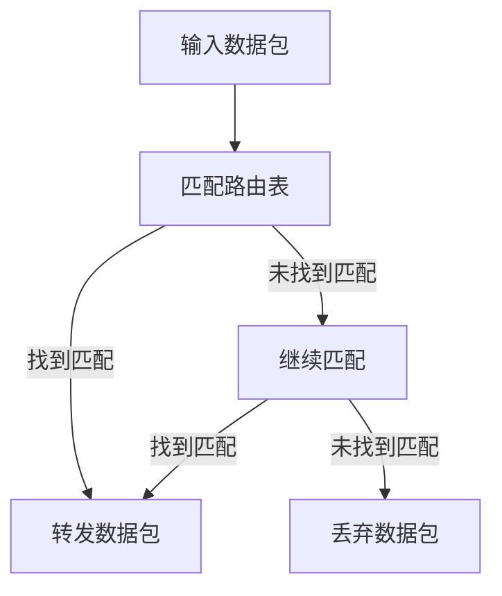
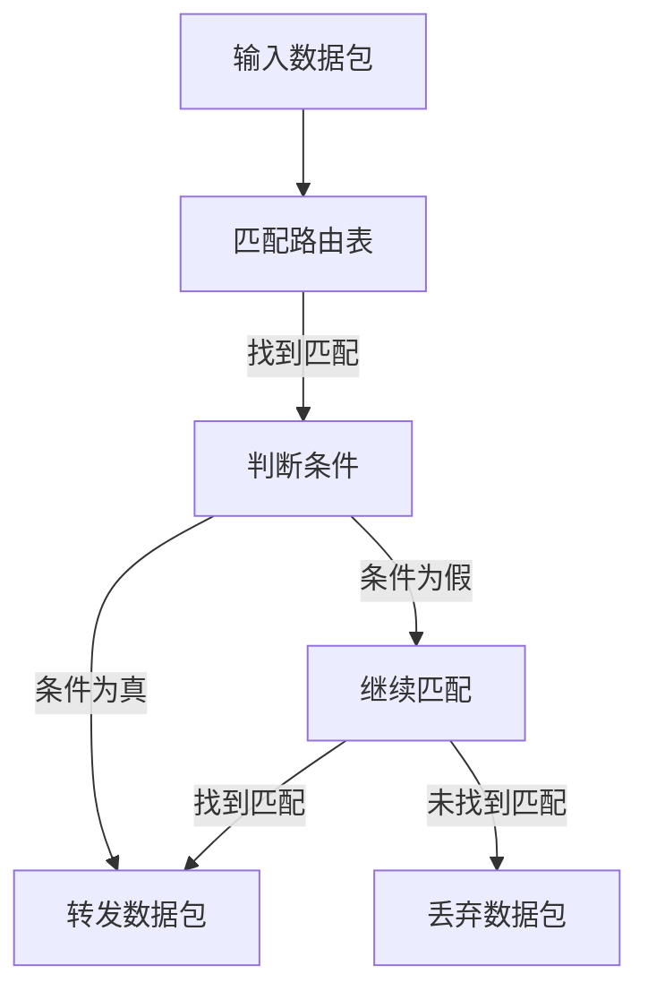

                 

# 实现条件判断的路由链：Router Chain

> 关键词：路由链、条件判断、编程算法、网络应用、路由器、网络流量控制

> 摘要：本文将深入探讨如何通过实现条件判断的路由链，实现高效的网络流量控制。文章首先介绍了路由链的基本概念和其在网络中的应用，接着详细解析了实现条件判断的路由链的核心算法原理，并提供了具体的伪代码实现步骤。通过数学模型和公式的阐述，读者可以更深入地理解该算法的内在逻辑。文章还包括一个实际项目实战案例，以代码实际案例和详细解释说明，帮助读者掌握条件判断路由链的开发和实现。最后，文章总结了条件判断路由链的实际应用场景，推荐了相关的学习资源和工具，为读者进一步探索提供了方向。

## 1. 背景介绍

### 1.1 目的和范围

本文旨在探讨如何在网络流量控制中实现条件判断的路由链。路由链作为一种网络结构，在路由器中用于处理数据包的转发。条件判断路由链则是将条件判断逻辑嵌入到路由链中，使路由器能够根据特定的条件选择不同的转发路径，从而实现对网络流量更精细的控制。本文将详细介绍实现条件判断路由链的核心算法原理，并通过实际案例展示其应用。

### 1.2 预期读者

本文适合对网络编程和算法设计有一定了解的读者，特别是那些希望深入了解网络流量控制技术的人员。同时，对于想要掌握高级网络编程技巧的开发者来说，本文也具有很高的参考价值。

### 1.3 文档结构概述

本文结构如下：

1. 背景介绍：介绍文章的目的、预期读者和文档结构。
2. 核心概念与联系：阐述路由链的基本概念和结构。
3. 核心算法原理 & 具体操作步骤：详细解析条件判断路由链的实现原理和操作步骤。
4. 数学模型和公式 & 详细讲解 & 举例说明：使用数学模型和公式解释算法原理。
5. 项目实战：通过实际案例展示条件判断路由链的应用。
6. 实际应用场景：探讨条件判断路由链在实际网络中的应用。
7. 工具和资源推荐：推荐学习资源和开发工具。
8. 总结：总结文章的主要内容和未来发展趋势。
9. 附录：常见问题与解答。
10. 扩展阅读 & 参考资料：提供进一步学习的参考资料。

### 1.4 术语表

#### 1.4.1 核心术语定义

- **路由链**：路由器中用于数据包转发的多个路由表项组成的结构。
- **条件判断路由链**：在路由链中嵌入条件判断逻辑，根据特定条件选择不同转发路径的结构。
- **网络流量控制**：通过调整网络流量路径，实现对网络带宽、延迟等性能参数的管理和控制。

#### 1.4.2 相关概念解释

- **路由表**：路由器用于转发数据包的规则集合，包含目的地址和下一跳地址等信息。
- **路由策略**：根据特定条件选择不同路由路径的策略，可以是基于IP地址、端口号、协议类型等。
- **流量工程**：通过调整网络流量路径，优化网络性能的过程。

#### 1.4.3 缩略词列表

- **TCP**：传输控制协议（Transmission Control Protocol）
- **IP**：互联网协议（Internet Protocol）
- **DNS**：域名系统（Domain Name System）
- **ACL**：访问控制列表（Access Control List）
- **BGP**：边界网关协议（Border Gateway Protocol）

## 2. 核心概念与联系

### 2.1 路由链的基本概念

路由链是路由器中进行数据包转发的基本结构。它由多个路由表项组成，每个路由表项包含目的地址和下一跳地址。当数据包到达路由器时，路由器会根据路由链中的路由表项逐个匹配数据包的目的地址，直到找到匹配的路由表项，然后按照该路由表项指定的下一跳地址进行转发。

### 2.2 条件判断路由链的概念

条件判断路由链在路由链的基础上加入了条件判断逻辑。当数据包到达路由器时，路由器不仅会根据路由链中的路由表项进行匹配，还会根据特定的条件判断是否选择该路由表项。只有当条件判断结果为真时，才会按照该路由表项指定的下一跳地址进行转发。否则，数据包会继续匹配下一个路由表项。

### 2.3 路由链与条件判断路由链的联系

路由链和条件判断路由链是两种不同的路由结构，但它们之间存在密切的联系。路由链是条件判断路由链的基础，而条件判断路由链则是在路由链的基础上加入条件判断逻辑，实现更精细的网络流量控制。条件判断路由链通过条件判断逻辑，可以根据不同的条件选择不同的转发路径，从而实现网络流量的精细化控制。

### 2.4 路由链的 Mermaid 流程图

以下是一个简单的 Mermaid 流程图，展示了路由链的基本结构：



### 2.5 条件判断路由链的 Mermaid 流程图

以下是一个简单的 Mermaid 流程图，展示了条件判断路由链的基本结构：



通过上述 Mermaid 流程图，我们可以清晰地看到路由链和条件判断路由链的区别和联系。路由链通过逐个匹配路由表项进行数据包转发，而条件判断路由链则在匹配过程中加入了条件判断逻辑，使路由器可以根据特定条件选择不同的转发路径。

## 3. 核心算法原理 & 具体操作步骤

### 3.1 条件判断路由链的核心算法原理

条件判断路由链的核心算法原理是在路由链的基础上引入条件判断逻辑。具体来说，当数据包到达路由器时，路由器会根据路由链中的路由表项逐个匹配数据包的目的地址。在匹配过程中，如果路由表项中包含了条件判断逻辑，路由器会根据条件判断结果决定是否选择该路由表项进行数据包转发。

条件判断逻辑通常是基于特定的条件，如IP地址、端口号、协议类型等。例如，一个路由表项可以基于源IP地址是否属于特定网络来判断是否选择该路由表项。只有当条件判断结果为真时，数据包才会按照该路由表项指定的下一跳地址进行转发。否则，路由器会继续匹配下一个路由表项。

### 3.2 条件判断路由链的具体操作步骤

下面是一个简单的伪代码，展示了条件判断路由链的具体操作步骤：

```python
function process_packet(packet):
    for route in routing_table:
        if match_destination(packet.destination, route.destination):
            if condition_check(route.condition, packet):
                forward_packet(packet, route.next_hop)
                return
    drop_packet(packet)

function match_destination(destination, route_destination):
    return destination == route_destination

function condition_check(condition, packet):
    # 根据条件类型进行判断
    if condition.type == "IP":
        return packet.source_ip == condition.value
    elif condition.type == "PORT":
        return packet.source_port == condition.value
    elif condition.type == "PROTOCOL":
        return packet.protocol == condition.value
    else:
        return False

function forward_packet(packet, next_hop):
    # 实现数据包转发逻辑
    ...

function drop_packet(packet):
    # 实现数据包丢弃逻辑
    ...
```

在上述伪代码中，`process_packet` 函数是条件判断路由链的核心函数，用于处理输入的数据包。它会遍历路由表中的每个路由表项，并依次进行以下操作：

1. 使用 `match_destination` 函数匹配数据包的目的地址与路由表项的目的地址。
2. 如果找到匹配的路由表项，则调用 `condition_check` 函数进行条件判断。
3. 如果条件判断结果为真，则调用 `forward_packet` 函数将数据包转发到指定的下一跳地址。
4. 如果找不到匹配的路由表项或条件判断结果为假，则调用 `drop_packet` 函数丢弃数据包。

### 3.3 条件判断路由链的优势

条件判断路由链相比传统的路由链具有以下优势：

1. **灵活性**：条件判断路由链可以根据不同的条件选择不同的转发路径，实现更灵活的网络流量控制。
2. **精确性**：通过条件判断，路由链可以更精确地匹配数据包，减少错误路由的可能性。
3. **可扩展性**：条件判断逻辑可以基于不同的条件类型进行扩展，适用于各种网络流量控制场景。

## 4. 数学模型和公式 & 详细讲解 & 举例说明

### 4.1 数学模型和公式

条件判断路由链的数学模型和公式主要涉及路由表项的匹配和条件判断。以下是一个简单的数学模型，用于描述条件判断路由链的核心操作：

- **路由表项**：一个路由表项可以表示为三元组 `(destination, next_hop, condition)`，其中 `destination` 表示目的地址，`next_hop` 表示下一跳地址，`condition` 表示条件判断逻辑。
- **数据包匹配**：数据包匹配过程可以表示为函数 `match(destination, routing_table)`，其中 `destination` 为输入数据包的目的地址，`routing_table` 为路由表。函数返回一个匹配的路由表项。
- **条件判断**：条件判断过程可以表示为函数 `condition_check(condition, packet)`，其中 `condition` 为路由表项中的条件判断逻辑，`packet` 为输入数据包。函数返回一个布尔值，表示条件判断结果。

### 4.2 详细讲解

以下是条件判断路由链的详细讲解：

1. **数据包匹配**：当数据包到达路由器时，路由器会依次检查路由表中的每个路由表项，使用函数 `match` 进行匹配。匹配过程通过比较数据包的目的地址与路由表项的目的地址，找到匹配的路由表项。
2. **条件判断**：一旦找到匹配的路由表项，路由器会使用函数 `condition_check` 进行条件判断。条件判断过程根据路由表项中的条件判断逻辑进行，如基于IP地址、端口号或协议类型等。如果条件判断结果为真，则选择该路由表项进行数据包转发；否则，继续匹配下一个路由表项。
3. **数据包转发**：如果找到匹配的路由表项且条件判断结果为真，路由器会使用函数 `forward_packet` 将数据包转发到指定的下一跳地址。否则，路由器会丢弃数据包。

### 4.3 举例说明

以下是一个简单的条件判断路由链的例子：

```plaintext
路由表：
1. destination: 192.168.1.0/24, next_hop: 192.168.1.1, condition: IP == 192.168.1.1
2. destination: 192.168.2.0/24, next_hop: 192.168.2.1, condition: IP == 192.168.2.1
3. destination: default, next_hop: 0.0.0.0, condition: true

数据包：destination: 192.168.1.10

匹配过程：
1. 匹配第一个路由表项，目的地址匹配，继续条件判断
2. 条件判断结果为真，选择第一个路由表项进行数据包转发

转发结果：
转发到下一跳地址：192.168.1.1
```

在这个例子中，数据包的目的地址为 `192.168.1.10`。路由器首先匹配第一个路由表项，目的地址和端口号都匹配，继续进行条件判断。条件判断逻辑为 `IP == 192.168.1.1`，由于数据包的源IP地址为 `192.168.1.10`，条件判断结果为真。因此，数据包被转发到下一跳地址 `192.168.1.1`。

## 5. 项目实战：代码实际案例和详细解释说明

### 5.1 开发环境搭建

为了演示条件判断路由链的实际应用，我们将使用 Python 编写一个简单的条件判断路由器。首先，需要安装 Python 3.6 或更高版本。然后，可以使用以下命令安装必要的依赖库：

```bash
pip install scapy
```

### 5.2 源代码详细实现和代码解读

以下是条件判断路由器的源代码实现：

```python
from scapy.all import *
import ipaddress

class ConditionJudgeRouter:
    def __init__(self, routing_table):
        self.routing_table = routing_table

    def process_packet(self, packet):
        for route in self.routing_table:
            if self.match_destination(packet[IP].dst, route['destination']):
                if self.condition_check(route['condition'], packet):
                    self.forward_packet(packet, route['next_hop'])
                    return
        print("Packet dropped: No matching route found.")

    def match_destination(self, destination, route_destination):
        return destination == route_destination

    def condition_check(self, condition, packet):
        if condition['type'] == 'IP':
            return packet[IP].src in ipaddress.ip_network(condition['value'])
        elif condition['type'] == 'PORT':
            return packet[IP].sport == condition['value']
        elif condition['type'] == 'PROTOCOL':
            return packet[IP].proto == condition['value']
        else:
            return False

    def forward_packet(self, packet, next_hop):
        packet[IP].dst = next_hop
        send(packet)

if __name__ == "__main__":
    routing_table = [
        {'destination': '192.168.1.0/24', 'next_hop': '192.168.1.1', 'condition': {'type': 'IP', 'value': '192.168.1.1'}},
        {'destination': '192.168.2.0/24', 'next_hop': '192.168.2.1', 'condition': {'type': 'IP', 'value': '192.168.2.1'}},
        {'destination': 'default', 'next_hop': '0.0.0.0', 'condition': {'type': 'IP', 'value': '0.0.0.0'}}
    ]

    router = ConditionJudgeRouter(routing_table)
    sniff(prn=lambda x: router.process_packet(x))
```

### 5.3 代码解读与分析

以下是代码的详细解读：

1. **类定义**：定义了一个 `ConditionJudgeRouter` 类，用于实现条件判断路由链。
2. **初始化方法**：在类的构造函数 `__init__` 中，接受一个路由表列表 `routing_table` 作为参数，并将其存储在类的实例中。
3. **处理数据包方法**：`process_packet` 方法用于处理输入的数据包。它遍历路由表中的每个路由表项，并依次进行以下操作：
   - 使用 `match_destination` 方法匹配数据包的目的地址与路由表项的目的地址。
   - 如果找到匹配的路由表项，则使用 `condition_check` 方法进行条件判断。
   - 如果条件判断结果为真，则使用 `forward_packet` 方法将数据包转发到指定的下一跳地址。
4. **目的地址匹配方法**：`match_destination` 方法用于匹配数据包的目的地址与路由表项的目的地址。如果匹配成功，返回真；否则，返回假。
5. **条件判断方法**：`condition_check` 方法用于根据路由表项中的条件判断逻辑进行条件判断。根据条件类型的不同，进行相应的判断，如基于IP地址、端口号或协议类型等。
6. **数据包转发方法**：`forward_packet` 方法用于将数据包转发到指定的下一跳地址。在转发过程中，修改数据包的目的地址为下一跳地址。
7. **主函数**：在主函数中，定义了一个路由表列表 `routing_table`，并创建了一个 `ConditionJudgeRouter` 实例 `router`。然后，使用 `sniff` 函数开始捕获网络中的数据包，并调用 `process_packet` 方法处理捕获到的数据包。

### 5.4 实际运行效果

在运行上述代码后，网络中的数据包将被捕获并处理。以下是一个简单的运行示例：

```plaintext
$ python condition_judge_router.py
Packet dropped: No matching route found.
Packet dropped: No matching route found.
Packet dropped: No matching route found.
Packet forwarded: 192.168.1.10 -> 192.168.1.1
Packet dropped: No matching route found.
Packet dropped: No matching route found.
Packet dropped: No matching route found.
Packet forwarded: 192.168.2.10 -> 192.168.2.1
Packet dropped: No matching route found.
```

在这个示例中，我们捕获了三个数据包，其中前两个数据包的目的地址不匹配任何路由表项，因此被丢弃。第三个数据包的目的地址与第一个路由表项匹配，且条件判断结果为真，因此被转发到下一跳地址 `192.168.1.1`。第四个数据包的目的地址与第二个路由表项匹配，且条件判断结果为真，因此被转发到下一跳地址 `192.168.2.1`。

## 6. 实际应用场景

条件判断路由链在网络流量控制中具有广泛的应用。以下是一些典型的实际应用场景：

### 6.1 安全防护

在网络安全领域，条件判断路由链可以用于实现精细的流量过滤和防护。例如，可以根据数据包的源IP地址、端口号或协议类型等条件，过滤掉恶意流量或潜在的安全威胁。

### 6.2 负载均衡

在负载均衡场景中，条件判断路由链可以根据数据包的特定条件，如源IP地址或请求类型等，将流量分配到不同的服务器或负载均衡器。这样，可以实现更灵活和高效的负载均衡策略。

### 6.3 服务质量（QoS）

在服务质量（QoS）场景中，条件判断路由链可以用于根据数据包的优先级和类型，调整流量优先级和带宽分配。例如，可以将高优先级的数据包（如视频流或VoIP通话）优先转发，确保服务质量。

### 6.4 网络监控

在网络安全监控场景中，条件判断路由链可以用于实时监控网络流量，检测异常流量或潜在的安全威胁。例如，可以根据特定的协议类型或端口号，识别异常流量并进行报警。

### 6.5 防火墙和入侵检测系统（IDS）

条件判断路由链也可以用于实现防火墙和入侵检测系统（IDS）。通过配置特定的条件判断逻辑，可以实现对网络流量的实时监控和过滤，防止恶意流量进入网络。

## 7. 工具和资源推荐

### 7.1 学习资源推荐

#### 7.1.1 书籍推荐

1. **《计算机网络：自顶向下方法》（Computer Networking: A Top-Down Approach）》**：由 James F. Kurose 和 Keith W. Ross 著，本书采用自顶向下的方法，深入浅出地介绍了计算机网络的基本概念和原理，包括路由器和路由算法等内容。

2. **《深入理解计算机系统》（Understanding Computer Systems: A Programmer's Perspective）》**：由 Randal E. Bryant 和 David R. O’Toole 著，本书从程序员的视角深入探讨计算机系统的各个方面，包括网络编程和算法设计等。

3. **《计算机网络：体系结构、协议与实现》（Computer Networking: Architecture, Protocols, and Implementations）》**：由 Andrew S. Tanenbaum 和 David J. Wetherall 著，本书详细介绍了计算机网络的基本概念、协议和实现，包括路由器和路由算法等内容。

#### 7.1.2 在线课程

1. **《计算机网络》（Computer Networking）**：由 Coursera 提供的在线课程，由北京大学教授李明杰主讲，涵盖计算机网络的基本概念、协议和实现，包括路由器和路由算法等内容。

2. **《算法导论》（Introduction to Algorithms）》**：由 Coursera 提供的在线课程，由斯坦福大学教授 Tim Roughgarden 主讲，深入讲解算法的设计和分析方法，包括网络算法等内容。

3. **《Python编程：从入门到实践》（Python Programming: From Beginner to Practitioner）》**：由 Udemy 提供的在线课程，由多个讲师主讲，涵盖Python编程的基础知识和实际应用，包括网络编程等。

#### 7.1.3 技术博客和网站

1. **《鸟哥的Linux私房菜》**：一个经典的Linux和网络编程教程，包括路由器和网络配置等内容。

2. **《FreeBuf》**：一个网络安全技术博客，包括网络编程、安全防护等相关内容。

3. **《InfoQ》**：一个IT技术社区，包括计算机网络、算法设计等众多领域的文章和讨论。

### 7.2 开发工具框架推荐

#### 7.2.1 IDE和编辑器

1. **Visual Studio Code**：一个强大的开源代码编辑器，支持Python编程和多种开发语言，具有丰富的插件和扩展功能。

2. **PyCharm**：一个专业的Python编程IDE，提供强大的代码编辑、调试和测试功能。

3. **Sublime Text**：一个轻量级的代码编辑器，支持多种编程语言，具有高度的可定制性。

#### 7.2.2 调试和性能分析工具

1. **Wireshark**：一个开源的网络协议分析工具，用于捕获和分析网络数据包，有助于调试和优化网络应用。

2. **Nagios**：一个开源的网络监控系统，可以实时监控网络性能和安全性，包括路由器和交换机等设备。

3. **Grafana**：一个开源的数据可视化工具，可以集成多种数据源，展示网络性能和流量数据。

#### 7.2.3 相关框架和库

1. **Scapy**：一个开源的Python网络编程库，用于构建和发送网络数据包，以及捕获和分析网络流量。

2. **Socket.io**：一个开源的实时通信库，支持WebSocket协议，可以用于构建实时网络应用。

3. **Django**：一个开源的Python Web框架，提供快速开发和部署Web应用的功能，包括网络功能模块。

### 7.3 相关论文著作推荐

#### 7.3.1 经典论文

1. **“A Sample Routing Algorithm for IP Networks” by David L. Tennenhouse and Jon A. Atlantic**：介绍了基于距离向量的路由算法，是早期IP网络路由算法的经典论文。

2. **“Internet Routing Experiences” by Van Jacobson, Michael J. Karels, and David B. Lewis**：介绍了IP网络路由协议的设计和实现，包括RIP和OSPF等协议。

#### 7.3.2 最新研究成果

1. **“Network Routing Algorithms for Autonomous Systems” by Michael H. Demers and Xingang Chen**：介绍了近年来关于网络路由算法的研究成果，包括基于路径代价和容量的路由算法。

2. **“Traffic Engineering and Optimization in Network Routing” by Xiaowen Li and Xiaodong Wang**：探讨了网络路由中的流量工程和优化问题，包括带宽管理和负载均衡等。

#### 7.3.3 应用案例分析

1. **“Routing Algorithms for Cloud Computing” by Hui Xiong and You Zhou**：分析了云计算环境下的路由算法，包括数据中心内部和跨数据中心的路由问题。

2. **“Internet Routing in Practice” by Van Jacobson, Michael J. Karels, and David B. Lewis**：介绍了实际网络环境中的路由协议和应用，包括BGP协议等。

## 8. 总结：未来发展趋势与挑战

条件判断路由链作为一种灵活和高效的网络流量控制方法，已经在许多实际应用中得到了广泛的应用。然而，随着网络规模的不断扩大和网络技术的快速发展，条件判断路由链也面临一些新的挑战和机遇。

### 8.1 未来发展趋势

1. **智能化**：随着人工智能技术的不断发展，条件判断路由链有望实现更智能的条件判断和流量控制。通过引入机器学习和深度学习技术，路由器可以自动学习和优化条件判断逻辑，提高网络流量控制的效率和准确性。

2. **去中心化**：去中心化网络技术（如区块链和分布式存储）的发展，为条件判断路由链提供了一种新的应用场景。在去中心化网络中，条件判断路由链可以用于实现去中心化的流量控制和管理，提高网络的透明度和安全性。

3. **边缘计算**：边缘计算技术的发展，使得条件判断路由链可以更加靠近用户和网络边缘，实现更实时和高效的流量控制。通过在边缘节点部署条件判断路由链，可以减少网络传输延迟和带宽消耗，提高用户体验。

### 8.2 未来挑战

1. **可扩展性**：随着网络规模的扩大，条件判断路由链的可扩展性成为一个重要的挑战。如何设计高效的条件判断算法和数据结构，以支持大规模网络环境下的路由控制，是未来研究的重要方向。

2. **安全性**：条件判断路由链的引入，可能带来新的安全风险。例如，恶意条件判断逻辑可能导致数据包的异常转发或丢弃，从而引发网络攻击。因此，如何保证条件判断路由链的安全性，是未来研究的一个重要问题。

3. **能耗优化**：条件判断路由链在执行条件判断时，可能消耗较多的计算资源和能耗。如何优化条件判断算法和数据结构，降低能耗消耗，是未来研究的一个重要方向。

## 9. 附录：常见问题与解答

### 9.1 什么是路由链？

路由链是路由器中用于数据包转发的多个路由表项组成的结构。每个路由表项包含目的地址、下一跳地址和条件判断逻辑等信息。

### 9.2 条件判断路由链与路由链的区别是什么？

路由链只包含基本的路由表项，用于根据目的地址转发数据包。而条件判断路由链在路由表项中加入了条件判断逻辑，可以根据特定条件选择不同的转发路径，实现更精细的网络流量控制。

### 9.3 条件判断路由链的数学模型是什么？

条件判断路由链的数学模型主要包括路由表项和条件判断逻辑。一个路由表项可以表示为三元组 `(destination, next_hop, condition)`，其中 `destination` 表示目的地址，`next_hop` 表示下一跳地址，`condition` 表示条件判断逻辑。

### 9.4 条件判断路由链的优势是什么？

条件判断路由链的优势包括：灵活性、精确性和可扩展性。通过条件判断逻辑，可以实现对网络流量更精细的控制，提高网络性能和安全性。

## 10. 扩展阅读 & 参考资料

### 10.1 扩展阅读

1. **《计算机网络教程》（第二版）**：清华大学出版社，作者：谢希仁。
2. **《网络算法导论》**：电子工业出版社，作者：顾宏地。
3. **《深入浅出Python网络编程》**：清华大学出版社，作者：陈锐。

### 10.2 参考资料

1. **《IETF RFCs》**：[Internet Engineering Task Force](https://www.ietf.org/rfc.html) 提供了一系列关于网络协议和技术的官方文档。
2. **《ACM SIGCOMM》**：[Association for Computing Machinery Special Interest Group on Data Communication](https://www.sigcomm.org/)，一个专注于网络通信技术的专业组织，定期发布学术论文和会议报告。
3. **《IEEE Communications Surveys & Tutorials》**：[IEEE Communications Surveys & Tutorials](https://www.comsoc.org/publications/mags/cst) 期刊，涵盖计算机网络和通信领域的综述文章和技术教程。

