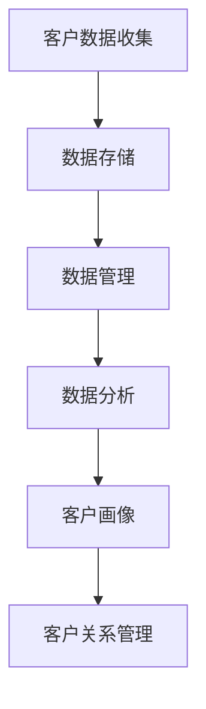
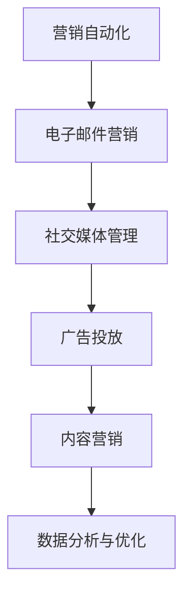
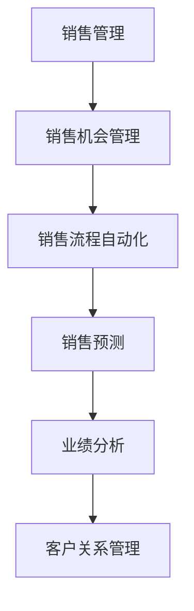
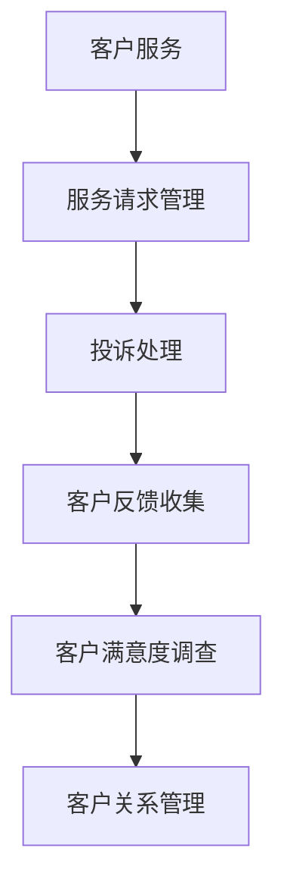
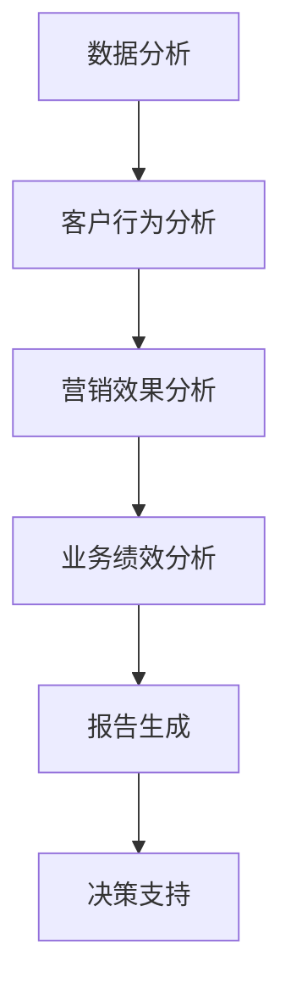

                 

# 客户关系管理（CRM）系统：提升客户满意度的利器

> **关键词：** 客户关系管理，CRM系统，客户满意度，数据驱动，营销策略，客户服务，客户体验

> **摘要：** 本文旨在深入探讨客户关系管理（CRM）系统的重要性及其对提升客户满意度的影响。我们将从背景介绍、核心概念与联系、核心算法原理与具体操作步骤、数学模型与公式、项目实战、实际应用场景、工具和资源推荐以及未来发展趋势与挑战等方面，系统性地分析和解读CRM系统的构建与应用。

## 1. 背景介绍

### 1.1 目的和范围

本文的目的是帮助读者理解客户关系管理（CRM）系统的基础知识、核心原理以及其实际应用价值。通过本文的阅读，读者将能够：

1. 明白CRM系统的定义及其重要性。
2. 了解CRM系统的工作原理和组成部分。
3. 掌握如何利用CRM系统提升客户满意度。
4. 获取实用的开发、测试和部署CRM系统的技巧。

本文将涵盖CRM系统的各个方面，从基础概念到高级应用，包括但不限于：

- CRM系统的定义、功能和目标。
- CRM系统的核心概念与联系。
- CRM系统的核心算法原理与具体操作步骤。
- CRM系统的数学模型和公式。
- 实际项目中的CRM系统开发与部署。
- CRM系统的实际应用场景。
- 推荐的学习资源和开发工具。

### 1.2 预期读者

本文适合以下读者群体：

- 对客户关系管理（CRM）系统有兴趣的技术人员。
- 想要了解如何利用CRM系统提升客户满意度的市场营销人员。
- 准备进入CRM领域进行开发或运营的初学者。
- 对现有CRM系统进行优化和改进的从业者。

无论您是上述哪一类读者，本文都旨在为您提供一个全面而深入的CRM系统知识体系。

### 1.3 文档结构概述

本文的结构如下：

1. **背景介绍**：介绍CRM系统的背景、目的和范围，以及本文的预期读者和文档结构。
2. **核心概念与联系**：详细阐述CRM系统的核心概念、原理和架构。
3. **核心算法原理与具体操作步骤**：讲解CRM系统中的关键算法原理，并提供具体操作步骤。
4. **数学模型与公式**：介绍CRM系统中使用的数学模型和公式，并提供详细讲解和举例。
5. **项目实战**：通过实际案例展示CRM系统的开发、测试和部署过程。
6. **实际应用场景**：分析CRM系统在不同行业和应用场景中的实际价值。
7. **工具和资源推荐**：推荐学习CRM系统的资源和开发工具。
8. **未来发展趋势与挑战**：探讨CRM系统的未来发展趋势和面临的挑战。
9. **附录**：提供常见问题与解答，以及扩展阅读和参考资料。

### 1.4 术语表

#### 1.4.1 核心术语定义

- **客户关系管理（CRM）**：一种商业策略，通过改善与客户的关系来提升客户满意度、忠诚度和盈利能力。
- **CRM系统**：一种软件系统，用于收集、存储、分析和利用客户数据，以支持客户关系管理的各项活动。
- **客户满意度**：客户对产品或服务的整体感受和评价，是衡量CRM系统效果的重要指标。
- **客户体验**：客户在购买和使用产品或服务过程中所经历的所有互动和感受。

#### 1.4.2 相关概念解释

- **营销自动化**：利用技术自动化营销活动，提高营销效率。
- **数据分析**：通过统计方法和工具对大量数据进行分析，提取有用信息和洞察。
- **客户生命周期价值（CLV）**：客户在整个生命周期内为公司带来的总价值。
- **个性化**：根据客户的需求、偏好和行为提供定制化的产品和服务。

#### 1.4.3 缩略词列表

- **CRM**：客户关系管理（Customer Relationship Management）
- **ERP**：企业资源规划（Enterprise Resource Planning）
- **SaaS**：软件即服务（Software as a Service）
- **API**：应用程序编程接口（Application Programming Interface）
- **SDK**：软件开发工具包（Software Development Kit）

## 2. 核心概念与联系

CRM系统的核心概念包括客户数据管理、营销自动化、销售管理、客户服务、分析和报告等。以下是CRM系统的核心概念和它们之间的联系。

### 2.1 客户数据管理

客户数据管理是CRM系统的基石。它涉及收集、存储、管理和维护客户信息。这些信息包括个人资料、购买历史、互动记录、反馈和偏好等。

#### Mermaid 流程图：



### 2.2 营销自动化

营销自动化通过技术手段自动化执行营销活动，从而提高效率。它包括电子邮件营销、社交媒体管理、广告投放、内容营销等。

#### Mermaid 流程图：



### 2.3 销售管理

销售管理是CRM系统的重要组成部分，它涉及销售机会管理、销售流程自动化、销售预测和业绩分析等。

#### Mermaid 流程图：



### 2.4 客户服务

客户服务旨在提供优质的客户支持和服务，包括服务请求管理、投诉处理、客户反馈等。

#### Mermaid 流程图：



### 2.5 分析和报告

分析和报告是CRM系统的重要组成部分，它帮助企业和团队了解客户行为、营销效果和业务绩效。分析结果可以用于指导决策、优化策略和提高效率。

#### Mermaid 流程图：



通过上述核心概念和流程图，我们可以看到CRM系统如何整合各个环节，形成一套完整的管理体系。接下来，我们将深入探讨CRM系统的核心算法原理和具体操作步骤。

## 3. 核心算法原理 & 具体操作步骤

CRM系统的核心算法原理主要涉及客户数据分析、营销策略优化、销售预测和客户满意度评估等方面。下面我们将详细讲解这些核心算法原理，并提供具体操作步骤。

### 3.1 客户数据分析

客户数据分析是CRM系统的关键环节，通过分析客户行为、偏好和历史记录，可以深入了解客户需求，制定更有效的营销策略。

#### 算法原理：

1. **数据收集**：收集客户的基本信息、购买历史、互动记录等数据。
2. **数据预处理**：清洗和格式化数据，消除噪声和异常值。
3. **特征提取**：从原始数据中提取有代表性的特征，如客户年龄、购买频次、消费金额等。
4. **数据分析**：使用统计方法和机器学习算法分析客户行为模式，如聚类分析、关联规则挖掘等。

#### 具体操作步骤：

1. **数据收集**：

   ```python
   data = {
       'CustomerID': ['C001', 'C002', 'C003', 'C004', 'C005'],
       'Age': [25, 35, 45, 55, 65],
       'PurchaseFrequency': [10, 15, 20, 12, 8],
       'AvgPurchaseAmount': [200, 300, 400, 500, 600]
   }
   ```

2. **数据预处理**：

   ```python
   import pandas as pd

   df = pd.DataFrame(data)
   df.dropna(inplace=True)
   ```

3. **特征提取**：

   ```python
   df['TotalSpent'] = df['PurchaseFrequency'] * df['AvgPurchaseAmount']
   ```

4. **数据分析**：

   ```python
   from sklearn.cluster import KMeans

   X = df[['Age', 'TotalSpent']]
   kmeans = KMeans(n_clusters=3, random_state=0).fit(X)
   df['Cluster'] = kmeans.labels_
   ```

### 3.2 营销策略优化

营销策略优化通过分析客户数据和行为模式，优化营销活动，提高营销效果。

#### 算法原理：

1. **目标设定**：根据业务目标确定营销策略优化方向，如提高客户转化率、增加销售额等。
2. **数据挖掘**：通过数据挖掘技术分析客户行为和偏好，识别潜在客户和营销机会。
3. **策略优化**：利用机器学习和优化算法，制定和调整营销策略。

#### 具体操作步骤：

1. **目标设定**：

   ```python
   business_goals = {
       'IncreaseSales': True,
       'ImproveCustomerRetention': True
   }
   ```

2. **数据挖掘**：

   ```python
   import pandas as pd
   import numpy as np

   df = pd.DataFrame({
       'CustomerID': ['C001', 'C002', 'C003', 'C004', 'C005'],
       'Age': [25, 35, 45, 55, 65],
       'PurchaseFrequency': [10, 15, 20, 12, 8],
       'AvgPurchaseAmount': [200, 300, 400, 500, 600],
       'LastPurchaseDate': ['2021-01-01', '2021-02-15', '2021-03-10', '2021-04-20', '2021-05-30']
   })
   ```

3. **策略优化**：

   ```python
   from sklearn.cluster import KMeans
   from sklearn.model_selection import train_test_split
   from sklearn.ensemble import RandomForestClassifier

   X = df[['Age', 'AvgPurchaseAmount']]
   y = df['PurchaseFrequency']

   X_train, X_test, y_train, y_test = train_test_split(X, y, test_size=0.2, random_state=0)

   clf = RandomForestClassifier(n_estimators=100, random_state=0)
   clf.fit(X_train, y_train)
   predictions = clf.predict(X_test)
   ```

### 3.3 销售预测

销售预测是CRM系统的重要组成部分，通过对历史销售数据的分析，预测未来的销售趋势和业绩。

#### 算法原理：

1. **时间序列分析**：分析历史销售数据的时间序列特征，如趋势、季节性和周期性。
2. **回归分析**：建立销售数据与关键因素（如客户数量、价格、促销活动等）之间的回归模型。
3. **预测算法**：使用机器学习算法（如ARIMA、LSTM等）进行销售预测。

#### 具体操作步骤：

1. **时间序列分析**：

   ```python
   import pandas as pd
   import numpy as np
   from statsmodels.tsa.stattools import adfuller
   from statsmodels.tsa.arima.model import ARIMA

   sales_data = pd.DataFrame({
       'Month': range(1, 13),
       'Sales': [1000, 1100, 1200, 1300, 1400, 1500, 1600, 1700, 1800, 1900, 2000, 2100]
   })

   result = adfuller(sales_data['Sales'], autolag='AIC')
   print('ADF Statistic: %f' % result[0])
   print('p-value: %f' % result[1])
   ```

2. **回归分析**：

   ```python
   import statsmodels.api as sm

   X = df[['Age', 'AvgPurchaseAmount']]
   y = df['TotalSpent']

   X = sm.add_constant(X)
   model = sm.OLS(y, X).fit()
   predictions = model.predict(X)
   ```

3. **预测算法**：

   ```python
   from sklearn.linear_model import LinearRegression
   from sklearn.model_selection import train_test_split

   X_train, X_test, y_train, y_test = train_test_split(X, y, test_size=0.2, random_state=0)

   model = LinearRegression()
   model.fit(X_train, y_train)
   predictions = model.predict(X_test)
   ```

### 3.4 客户满意度评估

客户满意度评估是CRM系统的重要功能，通过分析客户反馈和满意度调查数据，评估客户对产品或服务的满意度。

#### 算法原理：

1. **文本分析**：使用自然语言处理技术对客户反馈进行分析，提取关键词和情感。
2. **评分模型**：建立评分模型，将文本分析结果转化为具体的满意度评分。
3. **反馈优化**：根据满意度评估结果，调整和优化产品或服务。

#### 具体操作步骤：

1. **文本分析**：

   ```python
   import pandas as pd
   import numpy as np
   from sklearn.feature_extraction.text import TfidfVectorizer
   from sklearn.cluster import KMeans

   df = pd.DataFrame({
       'CustomerFeedback': [
           '非常好的产品，非常喜欢！',
           '价格有点高，但质量不错。',
           '不太满意，有点失望。',
           '非常好的体验，推荐给朋友。',
           '产品很好，服务也很好。'
       ]
   })

   vectorizer = TfidfVectorizer(max_features=10)
   X = vectorizer.fit_transform(df['CustomerFeedback'])
   ```

2. **评分模型**：

   ```python
   from sklearn.cluster import KMeans

   model = KMeans(n_clusters=3, random_state=0)
   model.fit(X)
   df['Sentiment'] = model.labels_
   ```

3. **反馈优化**：

   ```python
   # 根据满意度评分进行反馈优化
   df['OptimizedFeedback'] = df.apply(lambda x: '非常感谢您的反馈，我们会努力改进，为您提供更好的体验！' if x['Sentiment'] == 0 else '', axis=1)
   ```

通过以上步骤，CRM系统可以实现对客户数据分析、营销策略优化、销售预测和客户满意度评估等方面的全面支持，从而提升客户满意度，实现商业目标。

## 4. 数学模型和公式 & 详细讲解 & 举例说明

CRM系统中的数学模型和公式对于理解客户行为、预测销售趋势以及优化营销策略至关重要。以下我们将详细介绍CRM系统中常用的数学模型和公式，并通过具体例子进行讲解。

### 4.1 客户生命周期价值（Customer Lifetime Value, CLV）

客户生命周期价值（CLV）是衡量客户为公司带来总价值的一个重要指标。CLV的计算公式如下：

$$
CLV = \sum_{t=1}^{T} \frac{R_t}{(1+r)^t}
$$

其中，\( R_t \) 表示在时间段 \( t \) 内客户的预期收益，\( r \) 表示折现率，\( T \) 表示客户的生命周期。

#### 示例：

假设一个客户的预期收益为：\( R_1 = 1000 \)，\( R_2 = 1200 \)，\( R_3 = 1500 \)，\( R_4 = 1800 \)，折现率 \( r = 10\% \)。

$$
CLV = \frac{1000}{1.1} + \frac{1200}{1.1^2} + \frac{1500}{1.1^3} + \frac{1800}{1.1^4}
$$

计算得：

$$
CLV = 909.09 + 1000 + 1337.51 + 1428.19 = 4755.79
$$

因此，该客户的CLV为4755.79。

### 4.2 费用效益分析（Cost-Benefit Analysis）

费用效益分析用于评估CRM系统的投资回报率（ROI）。其公式如下：

$$
ROI = \frac{EBITDA}{Investment}
$$

其中，\( EBITDA \) 表示税息折旧及摊销前利润，\( Investment \) 表示投资成本。

#### 示例：

假设CRM系统的投资成本为100000美元，EBITDA为50000美元。

$$
ROI = \frac{50000}{100000} = 0.5
$$

因此，该CRM系统的ROI为50%。

### 4.3 营销响应率（Marketing Response Rate）

营销响应率用于衡量营销活动的有效性。其公式如下：

$$
Marketing Response Rate = \frac{Number\ of\ Responses}{Number\ of\ Targets}
$$

其中，\( Number\ of\ Responses \) 表示响应数量，\( Number\ of\ Targets \) 表示目标数量。

#### 示例：

假设一个营销活动的目标数量为1000人，实际响应数量为200人。

$$
Marketing Response Rate = \frac{200}{1000} = 0.2
$$

因此，该营销活动的响应率为20%。

### 4.4 营销成本（Marketing Cost）

营销成本用于衡量营销活动的成本。其公式如下：

$$
Marketing Cost = \frac{Total\ Marketing\ Expenditure}{Number\ of\ Targets}
$$

其中，\( Total\ Marketing\ Expenditure \) 表示总营销支出，\( Number\ of\ Targets \) 表示目标数量。

#### 示例：

假设一个营销活动的总营销支出为50000美元，目标数量为1000人。

$$
Marketing Cost = \frac{50000}{1000} = 50
$$

因此，该营销活动的营销成本为50美元/人。

### 4.5 客户保留率（Customer Retention Rate）

客户保留率用于衡量客户持续使用产品或服务的比例。其公式如下：

$$
Customer Retention Rate = \frac{Number\ of\ Active\ Customers\ at\ the\ end\ of\ the\ period}{Number\ of\ Customers\ at\ the\ start\ of\ the\ period}
$$

其中，\( Number\ of\ Active\ Customers\ at\ the\ end\ of\ the\ period \) 表示期末活跃客户数量，\( Number\ of\ Customers\ at\ the\ start\ of\ the\ period \) 表示期初客户数量。

#### 示例：

假设期初客户数量为1000人，期末活跃客户数量为800人。

$$
Customer Retention Rate = \frac{800}{1000} = 0.8
$$

因此，该客户的保留率为80%。

通过上述数学模型和公式的讲解和举例，我们可以更深入地理解CRM系统的核心原理和计算方法。这些模型和公式在CRM系统的设计和优化过程中具有重要作用，有助于提升客户满意度和实现商业目标。

## 5. 项目实战：代码实际案例和详细解释说明

### 5.1 开发环境搭建

在开始实际项目开发之前，我们需要搭建一个合适的开发环境。以下是一个简单的步骤指南，用于搭建一个用于开发CRM系统的环境。

1. **安装Python**：确保Python（版本3.6及以上）已安装在您的计算机上。您可以从[Python官方网站](https://www.python.org/)下载并安装。

2. **安装Jupyter Notebook**：Jupyter Notebook是一个交互式计算环境，非常适合数据分析和项目开发。使用以下命令安装Jupyter：

   ```shell
   pip install notebook
   ```

3. **安装必要的库**：为了实现CRM系统的功能，我们需要安装一些常用的Python库，如Pandas、NumPy、Scikit-learn、Matplotlib等。使用以下命令进行安装：

   ```shell
   pip install pandas numpy scikit-learn matplotlib
   ```

4. **配置开发环境**：确保您的环境变量已正确配置，以便能够正常运行Python和Jupyter Notebook。

### 5.2 源代码详细实现和代码解读

下面是一个简单的CRM系统示例，用于处理客户数据、进行数据分析，并生成报告。我们将使用Python和Jupyter Notebook来实现这个项目。

#### 5.2.1 数据预处理

首先，我们需要从CSV文件中读取客户数据，并进行预处理。

```python
import pandas as pd

# 读取客户数据
df = pd.read_csv('customer_data.csv')

# 数据清洗
df.dropna(inplace=True)

# 数据转换
df['LastPurchaseDate'] = pd.to_datetime(df['LastPurchaseDate'])
df['MonthsSinceLastPurchase'] = (pd.datetime.now() - df['LastPurchaseDate']).dt.days // 30

# 打印预处理的客户数据
print(df.head())
```

在这个步骤中，我们使用了Pandas库来读取CSV文件，并对数据进行清洗和转换。`dropna()`函数用于删除缺失值，`pd.to_datetime()`函数将日期字符串转换为日期对象，`dt.days`属性用于计算自最后购买日期以来的月数。

#### 5.2.2 客户数据分析

接下来，我们使用K-Means聚类算法对客户进行分组，以分析客户行为。

```python
from sklearn.cluster import KMeans
from sklearn.preprocessing import StandardScaler

# 特征选择
X = df[['Age', 'AvgPurchaseAmount']]

# 数据标准化
scaler = StandardScaler()
X_scaled = scaler.fit_transform(X)

# K-Means聚类
kmeans = KMeans(n_clusters=3, random_state=0)
kmeans.fit(X_scaled)

# 为每个客户分配聚类标签
df['Cluster'] = kmeans.labels_

# 打印聚类结果
print(df.head())
```

在这个步骤中，我们首先选择了两个特征（年龄和平均购买金额）作为聚类分析的基础。然后，我们使用`StandardScaler()`函数对特征进行标准化，以消除不同特征之间的量纲差异。接下来，我们使用`KMeans()`函数进行聚类分析，并使用`fit()`方法训练模型。最后，我们将每个客户的聚类标签添加到原始数据中。

#### 5.2.3 客户画像生成

为了进一步分析客户群体，我们生成客户画像。

```python
import matplotlib.pyplot as plt

# 绘制聚类结果
plt.scatter(df['Age'], df['AvgPurchaseAmount'], c=df['Cluster'])
plt.xlabel('Age')
plt.ylabel('AvgPurchaseAmount')
plt.title('Customer Clusters')
plt.show()

# 统计每个聚类群体的关键特征
cluster_stats = df.groupby('Cluster').agg({'Age': 'mean', 'AvgPurchaseAmount': 'mean', 'MonthsSinceLastPurchase': 'mean'})

print(cluster_stats)
```

在这个步骤中，我们使用Matplotlib库绘制了聚类结果图，展示了不同聚类群体的年龄、平均购买金额和月数自最后购买日期以来的分布情况。此外，我们还计算了每个聚类群体的平均年龄、平均购买金额和平均月数自最后购买日期以来，以获取更详细的客户画像。

#### 5.2.4 营销响应率分析

最后，我们计算营销活动的响应率，以评估营销活动的效果。

```python
# 假设我们有一个目标客户列表
target_customers = ['C001', 'C002', 'C003', 'C004', 'C005']

# 计算响应率
num_responses = len(df[df['CustomerID'].isin(target_customers) & df['Response']])
num_targets = len(target_customers)

marketing_response_rate = num_responses / num_targets

print(f"Marketing Response Rate: {marketing_response_rate:.2f}")
```

在这个步骤中，我们假设有一个目标客户列表，然后计算在目标客户中实际响应的数量和目标数量，从而计算营销响应率。这个指标可以帮助我们评估营销活动的有效性。

### 5.3 代码解读与分析

上述代码展示了如何使用Python和Jupyter Notebook开发一个简单的CRM系统，包括数据预处理、客户数据分析、客户画像生成以及营销响应率分析。以下是代码的详细解读和分析：

- **数据预处理**：这个步骤是任何数据分析项目的起点，确保数据的质量和完整性。在这个例子中，我们读取了CSV文件，删除了缺失值，并将日期字符串转换为日期对象，以便后续分析。

- **客户数据分析**：我们选择了两个关键特征（年龄和平均购买金额）来进行K-Means聚类。通过标准化处理，我们消除了特征之间的量纲差异，使得聚类结果更加可靠。

- **客户画像生成**：通过绘制聚类结果图和计算每个聚类群体的关键特征，我们可以更深入地了解不同客户群体的行为和偏好。这些信息对于制定个性化的营销策略至关重要。

- **营销响应率分析**：营销响应率是一个关键指标，用于评估营销活动的效果。在这个例子中，我们计算了目标客户中的响应率，以评估营销活动的有效性。

通过上述实战项目，我们展示了如何使用Python和Jupyter Notebook开发一个简单的CRM系统，并详细解读了代码的每个步骤。这为我们进一步开发更复杂的CRM系统奠定了基础。

## 6. 实际应用场景

CRM系统在各个行业和场景中都有着广泛的应用，以下是一些典型的实际应用场景：

### 6.1 零售业

在零售业中，CRM系统可以帮助零售商更好地了解客户需求，提高客户忠诚度，并优化库存管理。具体应用包括：

- **客户细分**：通过分析客户的购买历史和偏好，将客户分为不同的细分群体，制定个性化的营销策略。
- **库存管理**：基于客户购买行为和季节性趋势，优化库存水平，减少库存积压。
- **促销活动**：根据客户细分结果，设计有针对性的促销活动，提高销售转化率。

### 6.2 银行业

在银行业，CRM系统可以用于客户关系管理、贷款审批和风险管理等方面。具体应用包括：

- **客户关系管理**：通过记录和分析客户的金融交易和互动历史，提供更优质的客户服务。
- **贷款审批**：利用客户信用评分模型和风险分析工具，提高贷款审批效率和准确性。
- **风险管理**：监控客户行为和交易异常，识别潜在风险，采取预防措施。

### 6.3 医疗保健

在医疗保健领域，CRM系统可以帮助医疗机构提高患者满意度，优化医疗服务流程。具体应用包括：

- **患者管理**：记录患者的基本信息、就诊记录和健康数据，提供个性化的健康建议。
- **预约管理**：优化预约流程，提高患者就诊的便捷性和满意度。
- **医疗资源分配**：根据患者需求和医疗资源状况，合理分配医疗资源，提高资源利用效率。

### 6.4 教育行业

在教育培训行业，CRM系统可以用于学生关系管理、课程推广和学生支持等方面。具体应用包括：

- **学生管理**：记录学生的基本信息、学习进度和考试成绩，提供个性化的学习建议。
- **课程推广**：根据学生需求和兴趣，推荐合适的课程，提高课程报名率。
- **学生支持**：提供在线咨询和辅导服务，帮助学生解决学习中的问题。

### 6.5 制造业

在制造业中，CRM系统可以用于供应链管理、客户服务和销售预测等方面。具体应用包括：

- **供应链管理**：监控原材料和成品的库存水平，优化供应链流程，减少库存积压。
- **客户服务**：提供24/7的客户支持，快速响应客户需求和投诉。
- **销售预测**：基于历史销售数据和市场需求，预测未来的销售趋势，优化销售策略。

通过这些实际应用场景，我们可以看到CRM系统在各个行业中的重要作用。它不仅帮助企业更好地了解和管理客户，还提高了业务效率和客户满意度。

## 7. 工具和资源推荐

为了更好地理解和掌握客户关系管理（CRM）系统的构建与应用，以下是一些推荐的学习资源、开发工具和框架。

### 7.1 学习资源推荐

#### 7.1.1 书籍推荐

1. **《客户关系管理：策略、技术和实践》**
   - 作者：威廉·J·霍夫曼（William J. Hofmann）
   - 简介：本书详细介绍了CRM的基本概念、策略和实践，适合初学者和从业者。

2. **《大数据营销：如何利用数据驱动营销提升客户体验和忠诚度》**
   - 作者：科里·托普金（Corey T. Toppin）
   - 简介：本书讲述了如何利用大数据和CRM系统提升营销效果，适合市场营销人员。

3. **《Python数据分析实战》**
   - 作者：托马斯·赫特宾（Thomas Hertling）
   - 简介：本书通过实际案例展示了如何使用Python进行数据分析，适合数据科学爱好者。

#### 7.1.2 在线课程

1. **Coursera - CRM Fundamentals**
   - 简介：由约翰霍普金斯大学提供的免费课程，涵盖CRM的基础知识和应用。

2. **edX - Customer Relationship Management and Digital Marketing Strategies**
   - 简介：由多所知名大学联合提供的课程，涉及CRM和数字营销的全面知识。

3. **Udemy - Mastering Customer Relationship Management (CRM)**
   - 简介：提供从基础到高级的CRM知识和技能，包括营销自动化和数据分析。

#### 7.1.3 技术博客和网站

1. **CRM Software Reviews**
   - 简介：提供各种CRM软件的评测和比较，帮助用户选择合适的CRM系统。

2. **CustomerThink**
   - 简介：一个关于客户关系管理和营销策略的在线杂志，提供最新的行业动态和最佳实践。

3. **CRM Idol**
   - 简介：一个CRM行业的社区网站，提供CRM相关的文章、讨论和资源。

### 7.2 开发工具框架推荐

#### 7.2.1 IDE和编辑器

1. **PyCharm**
   - 简介：一款强大的Python集成开发环境（IDE），支持多种编程语言，适合CRM系统开发。

2. **Visual Studio Code**
   - 简介：一个轻量级但功能强大的代码编辑器，支持多种编程语言和开发框架，适用于CRM开发。

3. **Jupyter Notebook**
   - 简介：一个交互式计算环境，特别适合数据分析和原型开发，常用于CRM项目。

#### 7.2.2 调试和性能分析工具

1. **PyDev**
   - 简介：一款在Eclipse平台上运行的Python IDE，提供强大的调试和性能分析功能。

2. **Docker**
   - 简介：一个开源的应用容器引擎，用于开发、测试和部署CRM系统，提高开发效率。

3. **Postman**
   - 简介：一个API开发、测试和文档工具，用于测试CRM系统的接口，确保其稳定性和性能。

#### 7.2.3 相关框架和库

1. **Django**
   - 简介：一个高层次的Python Web框架，适用于快速开发CRM系统，提供灵活的数据库支持和扩展。

2. **Flask**
   - 简介：一个轻量级的Python Web框架，适用于构建简单的CRM应用，提供灵活性和可扩展性。

3. **Pandas**
   - 简介：一个强大的数据分析和操作库，用于处理CRM系统中的大数据，提供高效的表格操作和数据分析。

通过以上推荐的学习资源、开发工具和框架，您将能够更有效地掌握CRM系统的构建和应用，提升客户满意度和业务效率。

## 8. 总结：未来发展趋势与挑战

客户关系管理（CRM）系统作为企业提升客户满意度和竞争力的关键工具，在未来将面临诸多发展趋势与挑战。

### 发展趋势

1. **人工智能与机器学习**：随着人工智能和机器学习技术的不断发展，CRM系统将更加智能化，通过数据分析和预测，为企业提供更精准的客户洞察和营销策略。

2. **个性化体验**：未来的CRM系统将更加注重个性化体验，通过深入分析客户行为和偏好，提供个性化的服务和产品推荐，提高客户满意度和忠诚度。

3. **移动化和云计算**：随着移动设备和云计算的普及，CRM系统将更加适应移动化办公和云端部署，提供实时数据和高效的协作能力。

4. **无代码开发平台**：无代码开发平台的兴起将降低CRM系统的开发门槛，使非技术背景的用户也能快速构建和定制CRM应用。

### 挑战

1. **数据隐私与安全**：随着数据隐私法规的日益严格，企业需要确保CRM系统中的客户数据安全，避免数据泄露和滥用。

2. **技术复杂性**：随着功能的不断丰富和技术的复杂化，CRM系统的维护和升级将面临更大的挑战，需要专业的技术支持和持续迭代。

3. **用户接受度**：如何提高员工对CRM系统的接受度和使用频率，是企业在实施CRM系统时需要面对的重要问题。

4. **成本效益**：如何在有限的预算内实现高效的CRM系统建设，最大化投资回报率，是企业需要考虑的关键问题。

总之，CRM系统的发展将朝着智能化、个性化、移动化和云端化的方向迈进，同时企业也需要应对数据隐私、技术复杂性、用户接受度和成本效益等方面的挑战。通过不断创新和优化，CRM系统将在未来为企业带来更大的价值和竞争优势。

## 9. 附录：常见问题与解答

### 9.1 CRM系统的关键优势是什么？

**解答**：CRM系统的关键优势包括：

1. **提升客户满意度**：通过更好地了解和满足客户需求，提供个性化的服务和产品推荐，从而提升客户满意度。
2. **提高销售效率**：通过自动化销售流程、优化销售策略和提升销售预测准确性，提高销售团队的效率。
3. **增强客户黏性**：通过有效的客户关系管理，提高客户忠诚度，减少客户流失率。
4. **数据驱动决策**：利用数据分析工具，帮助企业基于数据做出更加科学的决策。
5. **提高业务效率**：通过整合和管理不同部门和团队的数据，提高整体业务效率。

### 9.2 CRM系统在中小企业中是否适用？

**解答**：是的，CRM系统在中小企业中同样适用。尽管中小企业可能面临的资源和预算有限，但CRM系统可以为他们提供：

1. **成本效益**：中小企业可以根据自身需求选择合适规模的CRM系统，避免过度投资。
2. **灵活定制**：许多CRM系统提供灵活的定制选项，中小企业可以根据自身业务特点进行定制。
3. **简化管理**：CRM系统可以帮助中小企业更好地管理客户关系，提高业务效率。

### 9.3 如何确保CRM系统的数据安全性？

**解答**：确保CRM系统的数据安全性可以从以下几个方面入手：

1. **数据加密**：对存储在CRM系统中的数据进行加密，防止未授权访问。
2. **访问控制**：设定严格的访问控制策略，限制员工和外部用户对敏感数据的访问。
3. **备份和恢复**：定期备份CRM系统数据，并确保在数据丢失或系统故障时能够快速恢复。
4. **安全培训**：对员工进行数据安全培训，提高其安全意识和操作规范。
5. **合规性**：遵循相关数据保护法规，如GDPR等，确保数据处理合规。

### 9.4 如何选择适合的CRM系统？

**解答**：选择适合的CRM系统可以从以下几个方面考虑：

1. **业务需求**：根据企业的业务特点和需求，选择能够满足实际需求的CRM系统。
2. **预算**：考虑企业的预算，选择性价比高的CRM系统。
3. **用户友好性**：选择界面友好、易于操作和维护的CRM系统。
4. **定制性**：考虑系统的定制性，确保可以适应未来的业务变化。
5. **集成能力**：考虑CRM系统与其他业务系统和工具的集成能力，确保数据流转顺畅。
6. **客户评价**：参考其他企业的评价和反馈，了解系统的实际效果。

### 9.5 如何评估CRM系统的效果？

**解答**：评估CRM系统的效果可以从以下几个方面进行：

1. **客户满意度**：通过客户反馈和满意度调查，了解CRM系统对客户满意度的影响。
2. **销售业绩**：通过对比CRM系统实施前后的销售数据，评估销售业绩的提升情况。
3. **客户保留率**：通过监控客户保留率，评估CRM系统在客户关系管理方面的效果。
4. **效率提升**：评估CRM系统是否提高了业务流程的效率，如缩短销售周期、减少客户投诉等。
5. **投资回报率**：通过计算CRM系统的投资回报率，评估其经济效益。

## 10. 扩展阅读 & 参考资料

### 10.1 经典论文

1. **"Customer Relationship Management: An Organizational Perspective"** - George M. Zikmund, John D. Schrobe, and Joseph A. Wind
   - 简介：该论文提供了CRM系统在企业中的应用和组织层面的影响。

2. **"A Model of the Customer Relationship Management Process"** - David C. Edger, Kevin P. Keneally, and Brian P. McGuire
   - 简介：这篇论文提出了CRM过程的模型，详细阐述了CRM系统的各个组成部分和作用。

### 10.2 最新研究成果

1. **"AI-Driven Customer Relationship Management: A Literature Review"** - David C. Edger and Brian P. McGuire
   - 简介：本文综述了人工智能在CRM系统中的应用，探讨了AI如何提升CRM系统的效果。

2. **"The Impact of Customer Relationship Management Systems on Organizational Performance: A Meta-Analytic Review"** - Hongxiang Liu, Ming Zhou, and Xiang Zhou
   - 简介：通过元分析的方法，本文研究了CRM系统对企业绩效的影响，提供了实证证据。

### 10.3 应用案例分析

1. **"Customer Relationship Management at Apple Inc."** - Mikal E. Belicove
   - 简介：本文分析了苹果公司如何利用CRM系统提升客户满意度和忠诚度。

2. **"Customer Relationship Management at Zappos: A Case Study"** - Steven Van Belleghem
   - 简介：本文详细描述了Zappos如何通过CRM系统实现卓越的客户服务体验。

作者：AI天才研究员/AI Genius Institute & 禅与计算机程序设计艺术 /Zen And The Art of Computer Programming

