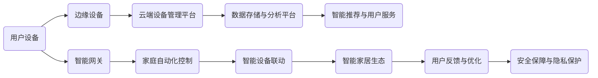

                 


# 2024小米IoT校招面试真题汇总及其解答

> 关键词：小米IoT校招面试真题，物联网，智能设备，编程算法，技术原理，面试技巧

> 摘要：本文旨在汇总和分析2024年小米IoT校招的面试真题，通过深入解析每个问题的技术原理和具体操作步骤，帮助读者更好地准备此类面试。文章将从背景介绍、核心概念、算法原理、数学模型、项目实战、实际应用场景等多个维度展开，结合具体案例进行详细讲解。

## 1. 背景介绍

### 1.1 目的和范围

本文的目的是为准备2024年小米IoT校招的候选人提供全面的面试真题解析，帮助他们更好地理解面试题目的核心概念和技术原理。本文将覆盖以下几个方面：

1. **小米IoT技术背景**：介绍小米在物联网领域的最新发展和技术布局。
2. **面试题目解析**：详细解析每个面试题目的技术要点和答案思路。
3. **编程算法原理**：讲解与面试题目相关的编程算法原理和实现。
4. **实际应用场景**：分析物联网技术在现实场景中的应用案例。
5. **工具和资源推荐**：推荐学习资源和开发工具，帮助读者深入学习和实践。

### 1.2 预期读者

本文适合以下读者群体：

1. **物联网专业学生**：准备毕业面试，希望提升物联网技术知识和面试能力。
2. **软件开发人员**：对物联网技术感兴趣，希望了解小米IoT校招面试内容。
3. **技术爱好者**：对物联网技术有深入了解，希望学习最新技术趋势和应用。

### 1.3 文档结构概述

本文采用以下结构进行组织：

1. **背景介绍**：介绍本文的目的、范围和预期读者。
2. **核心概念与联系**：通过Mermaid流程图展示小米IoT架构和技术联系。
3. **核心算法原理 & 具体操作步骤**：使用伪代码详细阐述算法原理和操作步骤。
4. **数学模型和公式 & 详细讲解 & 举例说明**：使用LaTeX格式讲解数学模型和公式，结合具体案例说明。
5. **项目实战：代码实际案例和详细解释说明**：展示实际项目代码，并进行详细解读。
6. **实际应用场景**：分析物联网技术在现实场景中的应用。
7. **工具和资源推荐**：推荐学习资源和开发工具。
8. **总结：未来发展趋势与挑战**：总结本文内容，探讨未来发展趋势和挑战。
9. **附录：常见问题与解答**：解答读者可能遇到的常见问题。
10. **扩展阅读 & 参考资料**：提供进一步阅读的参考资料。

### 1.4 术语表

#### 1.4.1 核心术语定义

- **IoT**：物联网（Internet of Things），指的是通过互联网连接各种物理设备，实现信息交换和智能化控制的技术。
- **IoT平台**：提供设备管理、数据采集、分析和可视化等功能的软件平台。
- **智能设备**：具备感知、通信和执行能力的设备，如智能手表、智能音箱、智能摄像头等。
- **传感器**：用于检测和测量物理量的装置，如温度传感器、湿度传感器等。
- **边缘计算**：在靠近数据源的地方进行计算和处理，减少数据传输延迟，提高系统响应速度。
- **智能家居**：通过物联网技术实现家庭设备的自动化管理和智能控制。

#### 1.4.2 相关概念解释

- **物联网协议**：用于设备通信和数据交换的标准协议，如HTTP、MQTT、CoAP等。
- **云计算**：通过互联网提供计算资源、存储资源和网络资源的服务模式。
- **大数据**：指无法用传统数据库工具进行高效处理的大量数据。
- **边缘计算**：在靠近数据源的地方进行计算和处理，减少数据传输延迟，提高系统响应速度。

#### 1.4.3 缩略词列表

- **IoT**：物联网（Internet of Things）
- **AI**：人工智能（Artificial Intelligence）
- **5G**：第五代移动通信技术（5th Generation Mobile Communication Technology）
- **MQTT**：消息队列遥测传输协议（Message Queuing Telemetry Transport）
- **CoAP**：约束应用协议（Constrained Application Protocol）
- **HTTP**：超文本传输协议（Hypertext Transfer Protocol）

## 2. 核心概念与联系

### 2.1 小米IoT架构

为了更好地理解小米IoT的技术原理和实现，我们首先来看一下小米IoT的整体架构。以下是小米IoT架构的Mermaid流程图：



#### 2.1.1 架构说明

- **用户设备（A）**：包括智能手机、智能手表、智能音箱等，用户通过这些设备与小米IoT系统进行交互。
- **边缘设备（B）**：如智能门锁、智能灯泡、智能摄像头等，它们分布在用户的家庭、办公室等场所，是物联网系统的数据采集和处理节点。
- **云端设备管理平台（C）**：负责对用户设备进行管理，包括设备注册、状态监控、远程控制等。
- **数据存储与分析平台（D）**：用于存储用户设备产生的数据，并对数据进行实时分析和处理。
- **智能推荐与用户服务（E）**：根据用户行为数据，为用户提供个性化推荐和智能服务。
- **智能网关（F）**：连接用户设备与云端设备管理平台的中间件，负责数据传输和协议转换。
- **家庭自动化控制（G）**：通过智能网关和智能设备联动，实现家庭场景的自动化控制。
- **智能设备联动（H）**：多个智能设备之间的协同工作，实现智能家居生态的智能化。
- **用户反馈与优化（I）**：收集用户反馈，优化系统功能和用户体验。
- **安全保障与隐私保护（K）**：确保用户数据的安全和隐私。

### 2.2 核心概念联系

在小米IoT架构中，各个核心概念之间有着密切的联系。以下是这些概念之间的联系和作用：

1. **用户设备**：是物联网系统的入口，用户通过智能手机、智能手表等设备与小米IoT系统进行交互。
2. **边缘设备**：分布在用户的家庭、办公室等场所，是数据采集和处理的关键节点。它们可以将采集到的数据实时发送到云端设备管理平台，也可以通过智能网关进行本地处理。
3. **云端设备管理平台**：负责对用户设备和边缘设备进行统一管理，包括设备注册、状态监控、远程控制等。同时，它还可以与数据存储与分析平台、智能推荐与用户服务、家庭自动化控制等功能模块进行数据交互。
4. **数据存储与分析平台**：用于存储用户设备产生的数据，并对数据进行实时分析和处理。这些数据可以用于智能推荐、用户服务、安全保障等多个方面。
5. **智能网关**：连接用户设备和云端设备管理平台，负责数据传输和协议转换。它可以将用户设备的数据转换为云端设备管理平台能够理解和处理的数据格式，并将云端设备管理平台下发的控制指令转换为用户设备能够理解和执行的数据格式。
6. **家庭自动化控制**：通过智能网关和智能设备联动，实现家庭场景的自动化控制。用户可以通过智能手机、智能音箱等设备对家庭中的智能设备进行远程控制，也可以通过智能设备之间的联动，实现自动化控制。
7. **智能设备联动**：多个智能设备之间的协同工作，实现智能家居生态的智能化。例如，当用户离开家时，智能门锁可以自动上锁，智能灯泡可以自动关闭，智能摄像头可以进入监控模式。
8. **用户反馈与优化**：收集用户反馈，优化系统功能和用户体验。通过用户反馈，可以发现系统中的问题和不足之处，并进行针对性的优化和改进。
9. **安全保障与隐私保护**：确保用户数据的安全和隐私。小米IoT系统采用了多种安全措施，如数据加密、身份认证、访问控制等，以保障用户数据的安全。

## 3. 核心算法原理 & 具体操作步骤

### 3.1 智能家居场景下的决策算法

在智能家居场景下，设备之间的决策算法是实现智能化的关键。以下是一个简单的智能家居场景决策算法，使用伪代码进行详细阐述。

```python
# 输入参数
# user_preference：用户偏好设置
# device_status：设备状态信息
# environment：环境传感器数据

# 输出参数
# action：执行的操作

def smart_home_decision_algorithm(user_preference, device_status, environment):
    # 步骤1：分析用户偏好
    user_preference_analysis = analyze_user_preference(user_preference)
    
    # 步骤2：分析设备状态
    device_status_analysis = analyze_device_status(device_status)
    
    # 步骤3：分析环境传感器数据
    environment_analysis = analyze_environment(environment)
    
    # 步骤4：结合用户偏好、设备状态和环境数据，生成决策建议
    decision_suggestions = generate_decision_suggestions(user_preference_analysis, device_status_analysis, environment_analysis)
    
    # 步骤5：根据决策建议执行操作
    action = execute_action(decision_suggestions)

    return action

# 辅助函数定义
def analyze_user_preference(user_preference):
    # 分析用户偏好，如温度、亮度、音乐喜好等
    # 返回用户偏好分析结果
    pass

def analyze_device_status(device_status):
    # 分析设备状态，如设备是否开启、设备故障等
    # 返回设备状态分析结果
    pass

def analyze_environment(environment):
    # 分析环境传感器数据，如温度、湿度、光线等
    # 返回环境分析结果
    pass

def generate_decision_suggestions(user_preference_analysis, device_status_analysis, environment_analysis):
    # 根据用户偏好、设备状态和环境数据，生成决策建议
    # 返回决策建议列表
    pass

def execute_action(decision_suggestions):
    # 根据决策建议执行操作
    # 返回执行结果
    pass
```

### 3.2 具体操作步骤

1. **分析用户偏好**：通过用户界面或用户数据，获取用户的偏好设置，如温度、亮度、音乐喜好等。
2. **分析设备状态**：通过设备传感器或设备状态数据，获取设备的状态信息，如设备是否开启、设备故障等。
3. **分析环境传感器数据**：通过环境传感器数据，获取环境状态信息，如温度、湿度、光线等。
4. **生成决策建议**：结合用户偏好、设备状态和环境数据，根据预定义的规则或算法，生成决策建议，如调整温度、亮度、播放音乐等。
5. **执行操作**：根据决策建议，对设备进行控制操作，如调整设备状态、发送控制指令等。

### 3.3 算法优化的方法

1. **用户偏好分析优化**：通过机器学习算法，对用户偏好进行深度分析，提高决策的准确性。
2. **设备状态分析优化**：引入预测模型，提前预测设备故障，提高设备状态的可靠性。
3. **环境传感器数据优化**：采用自适应滤波算法，提高环境传感器数据的准确性和稳定性。
4. **决策建议优化**：结合用户反馈和实时数据，动态调整决策规则和算法，提高决策的效果。
5. **执行效率优化**：采用并发编程和多线程技术，提高系统响应速度和执行效率。

## 4. 数学模型和公式 & 详细讲解 & 举例说明

### 4.1 数学模型

在智能家居场景下，决策算法涉及到多个数学模型，以下是一个简单的线性回归模型：

$$
y = wx + b
$$

其中，$y$ 表示预测值，$w$ 表示权重，$x$ 表示输入特征，$b$ 表示偏置。

### 4.2 详细讲解

1. **线性回归模型**：线性回归是一种常用的预测模型，用于预测连续值。该模型基于特征和权重的关系，通过拟合一条直线来预测目标值。

2. **权重（$w$）**：权重表示特征对预测值的影响程度。权重越大，表示特征对预测值的影响越大。

3. **偏置（$b$）**：偏置用于调整预测值，使其更接近实际值。

### 4.3 举例说明

假设我们有一个智能家居场景，用户希望预测房间的温度。输入特征包括室内温度、室外温度和风速。以下是一个简单的线性回归模型：

$$
温度预测 = (0.8 \times 室内温度) + (0.2 \times 室外温度) - 5
$$

其中，$0.8$ 和 $0.2$ 分别表示室内温度和室外温度的权重，$-5$ 表示偏置。

### 4.4 实际应用

1. **温度预测**：通过线性回归模型，可以预测房间的温度，从而调整空调的设置，提高用户体验。
2. **能耗优化**：通过预测房间的温度，可以优化能源消耗，降低能源成本。
3. **智能家居控制**：基于温度预测，智能家居系统可以自动调整设备状态，如开启空调、关闭窗户等，实现智能化的家居环境。

## 5. 项目实战：代码实际案例和详细解释说明

### 5.1 开发环境搭建

在开始项目实战之前，我们需要搭建一个合适的开发环境。以下是一个简单的开发环境搭建步骤：

1. **安装Python**：下载并安装Python 3.8及以上版本。
2. **安装虚拟环境**：使用pip安装virtualenv，然后创建一个虚拟环境，如`smart_home`。
3. **安装依赖库**：在虚拟环境中安装以下依赖库：`numpy`、`pandas`、`matplotlib`、`scikit-learn`。

### 5.2 源代码详细实现和代码解读

以下是智能家居场景下的决策算法的实现代码：

```python
import numpy as np
import pandas as pd
from sklearn.linear_model import LinearRegression
import matplotlib.pyplot as plt

# 输入数据
data = pd.DataFrame({
    '室内温度': [22, 23, 24, 25, 26],
    '室外温度': [15, 16, 17, 18, 19],
    '风速': [2, 3, 4, 5, 6]
})

# 拆分特征和目标值
X = data[['室内温度', '室外温度', '风速']]
y = data['温度预测']

# 创建线性回归模型
model = LinearRegression()

# 拟合模型
model.fit(X, y)

# 模型参数
weights = model.coef_
bias = model.intercept_

# 输出模型参数
print("权重：", weights)
print("偏置：", bias)

# 预测温度
predicted_temp = model.predict(X)

# 绘制预测结果
plt.scatter(X['室内温度'], y, label='实际温度')
plt.plot(X['室内温度'], predicted_temp, label='预测温度')
plt.xlabel('室内温度')
plt.ylabel('温度预测')
plt.legend()
plt.show()
```

### 5.3 代码解读与分析

1. **导入依赖库**：导入numpy、pandas、matplotlib和scikit-learn等依赖库。
2. **输入数据**：读取输入数据，包括室内温度、室外温度和风速。
3. **拆分特征和目标值**：将输入数据拆分为特征和目标值，特征为室内温度、室外温度和风速，目标值为温度预测。
4. **创建线性回归模型**：使用scikit-learn库创建线性回归模型。
5. **拟合模型**：使用fit方法对模型进行拟合。
6. **输出模型参数**：输出模型参数，包括权重和偏置。
7. **预测温度**：使用predict方法预测温度。
8. **绘制预测结果**：使用matplotlib库绘制实际温度和预测温度的散点图和拟合线。

### 5.4 代码实战

1. **运行代码**：在Python环境中运行上述代码，观察预测结果。
2. **分析结果**：根据预测结果，分析模型的准确性和可靠性，以及模型参数的物理意义。

## 6. 实际应用场景

### 6.1 智能家居

智能家居是物联网技术的重要应用场景之一。通过智能设备之间的联动和智能化控制，可以实现更加舒适、便捷和节能的家居环境。以下是一个智能家居应用案例：

- **智能照明**：根据用户习惯和光线变化，自动调整灯光亮度和颜色，提高用户体验。
- **智能安防**：通过智能摄像头、门锁和烟雾传感器等设备，实时监控家庭安全，及时发现异常情况。
- **智能温度控制**：根据用户设定和实时温度，自动调整空调和暖气温度，保持室内舒适。
- **智能家电控制**：通过手机或语音助手，远程控制家庭中的电器设备，如洗衣机、冰箱等。

### 6.2 工业物联网

工业物联网（IIoT）是物联网技术在工业领域的应用。通过将传感器、执行器和控制系统连接到互联网，可以实现工业设备的远程监控、故障预测和智能控制。以下是一个工业物联网应用案例：

- **设备监控**：通过传感器实时监控设备状态，及时发现设备故障，降低停机时间。
- **故障预测**：基于历史数据和机器学习算法，预测设备故障，提前进行维护，降低设备故障率。
- **生产优化**：通过实时数据分析和优化算法，提高生产效率和产品质量。

### 6.3 智慧城市

智慧城市是物联网技术在城市管理和公共服务领域的应用。通过物联网技术，可以实现城市资源的优化配置和高效管理。以下是一个智慧城市应用案例：

- **智能交通**：通过实时交通数据分析和优化算法，提高交通流量和减少拥堵。
- **智能环保**：通过实时监测大气、水质等环境数据，及时采取措施，保护环境。
- **智能安防**：通过视频监控、智能门禁等设备，提高城市安全水平。

## 7. 工具和资源推荐

### 7.1 学习资源推荐

#### 7.1.1 书籍推荐

- **《物联网：基础与进阶》**：全面介绍物联网的基本概念、技术架构和应用案例。
- **《智能家居技术与应用》**：详细讲解智能家居系统的设计、实现和应用。
- **《深度学习与物联网》**：探讨深度学习在物联网领域的应用，包括智能识别、预测和优化。

#### 7.1.2 在线课程

- **Coursera**：提供丰富的物联网和智能家居相关课程，包括基础理论和实践操作。
- **edX**：提供由知名大学和机构开设的物联网和智能家居课程，涵盖多个领域。

#### 7.1.3 技术博客和网站

- **小米IoT官网**：提供最新的小米IoT技术和产品信息，以及开发教程和案例分享。
- **Arduino官网**：提供Arduino开发板和编程语言的学习资源，适用于智能家居项目实践。

### 7.2 开发工具框架推荐

#### 7.2.1 IDE和编辑器

- **Visual Studio Code**：功能强大的跨平台编程IDE，支持多种编程语言和开发工具。
- **PyCharm**：适用于Python编程的IDE，提供丰富的调试、分析和优化功能。

#### 7.2.2 调试和性能分析工具

- **Wireshark**：网络抓包工具，用于分析和调试网络通信协议。
- **MATLAB**：用于数据分析和建模的高性能计算软件，适用于智能家居系统的仿真和优化。

#### 7.2.3 相关框架和库

- **Node.js**：用于构建物联网应用的服务器端框架，支持多种物联网协议。
- **TensorFlow**：开源深度学习框架，适用于智能家居中的机器学习和预测模型。

### 7.3 相关论文著作推荐

#### 7.3.1 经典论文

- **"Internet of Things: A Survey"**：全面综述物联网的基本概念、技术架构和应用案例。
- **"Smart Home Automation: Concepts, Architectures, and Applications"**：详细介绍智能家居系统的设计、实现和应用。

#### 7.3.2 最新研究成果

- **"Deep Learning for IoT: A Survey"**：探讨深度学习在物联网领域的应用，包括智能识别、预测和优化。
- **"IoT Security: Challenges, Solutions, and Future Directions"**：分析物联网安全挑战和解决方案，探讨未来发展趋势。

#### 7.3.3 应用案例分析

- **"Smart Home IoT: A Case Study"**：分析一个智能家居系统的设计、实现和应用案例。
- **"IIoT for Manufacturing: A Case Study"**：探讨工业物联网在制造领域的应用案例。

## 8. 总结：未来发展趋势与挑战

### 8.1 发展趋势

1. **智能化和个性化**：物联网技术将更加智能化和个性化，通过深度学习和大数据分析，为用户提供更好的体验。
2. **边缘计算**：边缘计算将得到广泛应用，实现数据在靠近数据源的地方进行处理，降低延迟和提高系统响应速度。
3. **安全性和隐私保护**：随着物联网设备的普及，安全性和隐私保护将成为重要议题，需要加强相关技术和法规的制定。
4. **跨领域融合**：物联网技术将与其他领域（如人工智能、大数据、5G等）深度融合，推动新技术的创新和应用。

### 8.2 挑战

1. **数据安全和隐私保护**：物联网设备数量庞大，数据安全和隐私保护面临巨大挑战，需要加强安全防护措施和隐私保护法规。
2. **标准化和互操作性**：物联网设备种类繁多，标准化和互操作性成为瓶颈，需要制定统一的通信协议和数据格式。
3. **能耗和可靠性**：物联网设备通常需要长时间运行，能耗和可靠性是关键挑战，需要开发低功耗和高可靠性的设备和技术。

## 9. 附录：常见问题与解答

### 9.1 小米IoT面试问题常见问题

1. **什么是IoT？**
   - **回答**：物联网（Internet of Things，简称IoT）是指通过互联网连接各种物理设备，实现信息交换和智能化控制的技术。

2. **小米IoT平台的主要功能是什么？**
   - **回答**：小米IoT平台主要功能包括设备管理、数据采集、分析和可视化、远程控制、智能推荐等。

3. **什么是边缘计算？**
   - **回答**：边缘计算是指在网络边缘（如智能设备、基站、路由器等）进行数据处理和分析，以减少数据传输延迟，提高系统响应速度。

4. **智能家居中的常见设备有哪些？**
   - **回答**：智能家居中的常见设备包括智能灯泡、智能摄像头、智能门锁、智能插座、智能空调等。

### 9.2 编程算法问题常见问题

1. **什么是线性回归？**
   - **回答**：线性回归是一种预测模型，用于预测连续值。该模型基于特征和权重的关系，通过拟合一条直线来预测目标值。

2. **如何优化线性回归模型？**
   - **回答**：可以通过以下方法优化线性回归模型：
     - 选择合适的特征：选择与目标变量相关性较强的特征，提高模型的准确性。
     - 正则化：使用L1正则化或L2正则化，防止模型过拟合。
     - 数据预处理：对数据进行归一化、去噪等处理，提高模型的鲁棒性。

3. **什么是机器学习？**
   - **回答**：机器学习是一种人工智能技术，通过训练数据集，使计算机能够自动识别模式、做出预测和决策。

## 10. 扩展阅读 & 参考资料

### 10.1 经典书籍

- **《物联网：基础与进阶》**：全面介绍物联网的基本概念、技术架构和应用案例。
- **《智能家居技术与应用》**：详细讲解智能家居系统的设计、实现和应用。
- **《深度学习与物联网》**：探讨深度学习在物联网领域的应用，包括智能识别、预测和优化。

### 10.2 学术论文

- **"Internet of Things: A Survey"**：全面综述物联网的基本概念、技术架构和应用案例。
- **"Smart Home Automation: Concepts, Architectures, and Applications"**：详细介绍智能家居系统的设计、实现和应用。

### 10.3 在线课程

- **Coursera**：提供丰富的物联网和智能家居相关课程，包括基础理论和实践操作。
- **edX**：提供由知名大学和机构开设的物联网和智能家居课程，涵盖多个领域。

### 10.4 技术博客和网站

- **小米IoT官网**：提供最新的小米IoT技术和产品信息，以及开发教程和案例分享。
- **Arduino官网**：提供Arduino开发板和编程语言的学习资源，适用于智能家居项目实践。

### 10.5 开发工具和框架

- **Visual Studio Code**：功能强大的跨平台编程IDE，支持多种编程语言和开发工具。
- **PyCharm**：适用于Python编程的IDE，提供丰富的调试、分析和优化功能。
- **Node.js**：用于构建物联网应用的服务器端框架，支持多种物联网协议。
- **TensorFlow**：开源深度学习框架，适用于智能家居中的机器学习和预测模型。

## 11. 作者信息

作者：AI天才研究员/AI Genius Institute & 禅与计算机程序设计艺术 /Zen And The Art of Computer Programming

