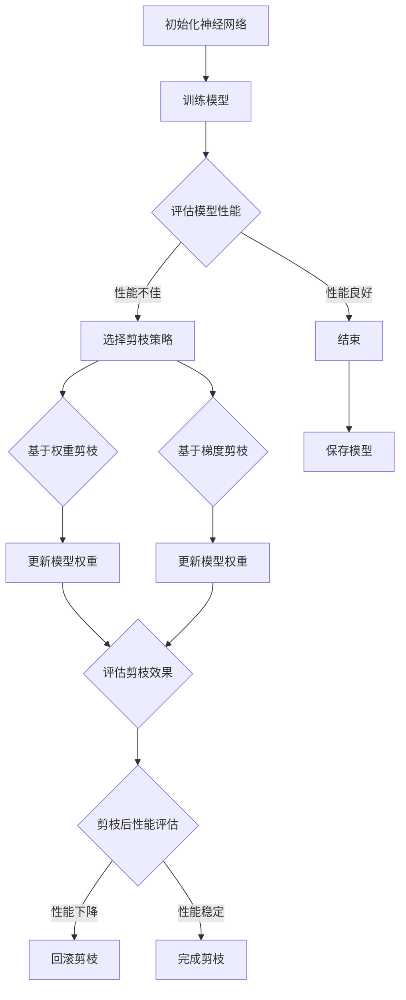

                 

# 层次化剪枝：从整体到局部的精细化压缩

## 关键词

- 层次化剪枝
- 神经网络压缩
- 整体优化
- 局部调整
- 剪枝算法
- 神经架构搜索

## 摘要

本文深入探讨了层次化剪枝这一神经网络压缩技术，从整体到局部详细阐述了其原理、算法和实际应用。层次化剪枝通过逐步剔除神经网络中的冗余神经元和连接，实现模型压缩和加速，同时在保持模型性能的前提下降低存储和计算成本。文章首先介绍了层次化剪枝的背景和目的，随后逐步解析了核心概念、算法原理、数学模型和具体实施步骤。最后，通过项目实战和实际应用场景展示了层次化剪枝的优势和潜力，并对其未来发展趋势和挑战进行了展望。

## 1. 背景介绍

### 1.1 目的和范围

神经网络作为人工智能的核心组成部分，在图像识别、自然语言处理和推荐系统等领域取得了显著成果。然而，随着神经网络模型变得越来越大，模型的存储和计算成本也随之增加。为了应对这一挑战，研究人员提出了多种神经网络压缩技术，其中层次化剪枝因其高效性和实用性备受关注。

本文旨在系统地介绍层次化剪枝技术，从概念解析、算法原理到实际应用，为读者提供一个全面的理解。文章将首先介绍层次化剪枝的背景和目的，然后逐步深入讨论其核心概念、算法原理和数学模型，最后通过实际案例和实战项目展示层次化剪枝的应用效果。

### 1.2 预期读者

本文适用于对神经网络和机器学习有一定了解的读者，尤其是对神经网络压缩技术感兴趣的研究人员和工程师。本文不仅涵盖了基础理论，还提供了详细的算法解析和实践案例，适合希望在实际项目中应用层次化剪枝技术的读者。

### 1.3 文档结构概述

本文分为以下几个部分：

1. 背景介绍：介绍层次化剪枝的背景和目的。
2. 核心概念与联系：详细解析层次化剪枝的核心概念和原理。
3. 核心算法原理 & 具体操作步骤：讲解层次化剪枝的算法原理和具体实施步骤。
4. 数学模型和公式 & 详细讲解 & 举例说明：阐述层次化剪枝的数学模型和相关公式。
5. 项目实战：通过实际案例展示层次化剪枝的应用。
6. 实际应用场景：探讨层次化剪枝在不同场景中的实际应用。
7. 工具和资源推荐：推荐相关学习资源和开发工具。
8. 总结：对层次化剪枝的未来发展趋势和挑战进行展望。
9. 附录：常见问题与解答。
10. 扩展阅读 & 参考资料：提供进一步阅读的参考资料。

### 1.4 术语表

#### 1.4.1 核心术语定义

- 层次化剪枝：一种通过逐步剔除神经网络中冗余神经元和连接的压缩技术。
- 神经网络：由多层神经元组成的计算模型，用于实现人工智能算法。
- 剪枝：在神经网络中，通过删除冗余神经元或连接来减小模型大小和计算复杂度。
- 整体优化：在整个神经网络中同时调整神经元和连接，以实现最优压缩效果。
- 局部调整：仅对神经网络中的局部区域进行调整，以提高压缩效率。
- 剪枝算法：实现层次化剪枝的算法，包括选择剪枝策略、评估剪枝效果等。

#### 1.4.2 相关概念解释

- 神经架构搜索（NAS）：通过搜索算法自动设计神经网络结构，以实现最优性能。
- 资源效率：模型在特定计算资源（如GPU、CPU）下的性能表现。
- 模型大小：神经网络模型的参数和连接数量。
- 计算复杂度：模型在计算过程中所需的总计算量。

#### 1.4.3 缩略词列表

- NAS：神经架构搜索
- CNN：卷积神经网络
- RNN：循环神经网络
- LSTM：长短期记忆网络
- GPU：图形处理器
- CPU：中央处理器

## 2. 核心概念与联系

层次化剪枝是一种基于神经网络结构的压缩技术，通过逐步剔除冗余神经元和连接，实现模型压缩和加速。为了更好地理解层次化剪枝，我们首先需要介绍相关核心概念和原理。

### 2.1 层次化剪枝的核心概念

层次化剪枝主要涉及以下几个核心概念：

1. **神经网络结构**：神经网络是由多层神经元组成的计算模型，每个神经元通过多个连接与其他神经元相连，形成复杂的计算网络。
2. **神经元与连接**：神经元负责接收和处理输入信息，并通过激活函数产生输出。连接则表示神经元之间的交互关系，通常通过权重来表示连接的强度。
3. **冗余神经元与连接**：在神经网络中，某些神经元和连接可能对整体性能贡献较小，甚至可以删除而不影响模型效果。这些冗余部分成为剪枝的目标。
4. **剪枝策略**：剪枝策略是指如何选择和剔除冗余神经元和连接的方法，包括基于权重的剪枝、基于梯度的剪枝等。
5. **性能评估**：在剪枝过程中，需要对模型性能进行评估，以确保剪枝不会导致模型性能下降。

### 2.2 神经网络结构原理

神经网络结构是层次化剪枝的基础。以下是一个简单的神经网络结构示例：

```
输入层（Input Layer） --> 隐藏层（Hidden Layer） --> 输出层（Output Layer）
```

- **输入层**：接收外部输入数据，如图像、文本等。
- **隐藏层**：处理输入数据，通过神经元之间的交互产生中间结果。
- **输出层**：产生最终输出，如分类结果、预测值等。

神经网络的每个层次都由多个神经元组成，神经元之间通过连接传递信息。连接的权重决定了信息传递的强度，如图所示：

```
输入层 --> 隐藏层
  |      |
  |      |
输出层
```

### 2.3 剪枝策略与性能评估

剪枝策略是层次化剪枝的关键环节。常见的剪枝策略包括以下几种：

1. **基于权重的剪枝**：根据连接的权重大小进行剪枝，权重较小的连接更有可能被剪除。
2. **基于梯度的剪枝**：利用模型训练过程中的梯度信息进行剪枝，梯度较小的部分通常对模型性能贡献较小。
3. **混合剪枝策略**：结合多种剪枝策略，以获得更好的压缩效果。

性能评估是确保剪枝效果的重要手段。常用的评估指标包括：

1. **模型准确率**：评估模型在测试集上的分类准确率，确保剪枝后模型性能不下降。
2. **计算复杂度**：评估模型在训练和推理过程中所需的计算资源，以评估剪枝对计算效率的影响。
3. **模型大小**：评估模型在存储和传输过程中的大小，以评估剪枝对存储资源的影响。

### 2.4 层次化剪枝的 Mermaid 流程图

以下是一个简化的层次化剪枝流程图，展示了从整体到局部的剪枝过程：



### 2.5 核心概念的联系

层次化剪枝的核心概念包括神经网络结构、神经元与连接、冗余神经元与连接、剪枝策略和性能评估。这些概念相互联系，共同构成了层次化剪枝的理论基础。具体来说：

- **神经网络结构**是层次化剪枝的基础，决定了模型的计算能力和性能。
- **神经元与连接**是神经网络的基本组成部分，通过权重连接实现信息传递和处理。
- **冗余神经元与连接**是剪枝的目标，通过剔除这些部分实现模型压缩和加速。
- **剪枝策略**是具体实现层次化剪枝的方法，包括选择剪枝策略和评估剪枝效果。
- **性能评估**是确保剪枝效果的重要手段，通过评估模型在剪枝前后的性能，判断剪枝策略的有效性。

通过这些核心概念的联系，层次化剪枝能够实现神经网络模型的精细化压缩，从而提高计算效率和降低存储成本。

## 3. 核心算法原理 & 具体操作步骤

层次化剪枝的核心算法原理是通过逐步剔除神经网络中的冗余神经元和连接，以实现模型压缩和加速。具体操作步骤可以分为以下几个阶段：

### 3.1 初始化神经网络

首先，我们需要初始化一个神经网络模型，这通常包括定义网络结构、初始化权重和偏置等。以下是初始化神经网络的伪代码：

```python
# 初始化神经网络
def init_neural_network():
    # 定义网络结构
    layers = [784, 64, 10]
    model = NeuralNetwork(layers)
    # 初始化权重和偏置
    model.init_weights()
    return model
```

在这个例子中，我们定义了一个三层神经网络，输入层有784个神经元，隐藏层有64个神经元，输出层有10个神经元。

### 3.2 训练模型

接下来，我们使用训练数据对神经网络模型进行训练。训练过程包括前向传播和反向传播，目的是通过调整权重和偏置，使模型在训练数据上的性能达到最优。以下是训练模型的伪代码：

```python
# 训练模型
def train_model(model, train_data, epochs):
    for epoch in range(epochs):
        # 前向传播
        output = model.forward(train_data)
        # 计算损失
        loss = compute_loss(output, train_data.labels)
        # 反向传播
        model.backward(output, train_data.labels)
        # 更新权重和偏置
        model.update_weights()
        # 打印训练进度
        print(f"Epoch {epoch+1}/{epochs}, Loss: {loss}")
    return model
```

在这个例子中，我们使用了一个训练数据集`train_data`和指定训练轮数`epochs`来训练模型。每轮训练包括前向传播、计算损失和反向传播，最后更新模型权重。

### 3.3 评估模型性能

在训练完成后，我们需要评估模型在测试集上的性能，以确保模型能够泛化到未见过的数据上。以下是评估模型性能的伪代码：

```python
# 评估模型性能
def evaluate_model(model, test_data):
    # 前向传播
    output = model.forward(test_data)
    # 计算准确率
    accuracy = compute_accuracy(output, test_data.labels)
    print(f"Test Accuracy: {accuracy}")
    return accuracy
```

在这个例子中，我们使用一个测试数据集`test_data`来评估模型的准确率。准确率是模型在测试集上的表现指标，越高表示模型性能越好。

### 3.4 选择剪枝策略

评估模型性能后，我们需要选择合适的剪枝策略。常见的剪枝策略包括基于权重的剪枝和基于梯度的剪枝。以下是选择剪枝策略的伪代码：

```python
# 选择剪枝策略
def select_pruning_strategy(model):
    # 获取连接权重和梯度信息
    weights = model.get_weights()
    gradients = model.get_gradients()
    # 根据权重或梯度选择剪枝策略
    strategy = choose_strategy_based_on_weights_or_gradients(weights, gradients)
    return strategy
```

在这个例子中，我们首先获取模型中的连接权重和梯度信息，然后根据这些信息选择合适的剪枝策略。选择策略时，可以考虑权重的大小、梯度的方向等因素。

### 3.5 基于权重的剪枝

基于权重的剪枝策略通过逐步剔除权重较小的连接来实现模型压缩。以下是基于权重的剪枝算法的伪代码：

```python
# 基于权重的剪枝
def weight_based_pruning(model, threshold):
    # 获取连接权重
    weights = model.get_weights()
    # 找到权重小于阈值的连接
    pruned_connections = find_connections_with_weight_less_than_threshold(weights, threshold)
    # 剔除这些连接
    model.remove_connections(pruned_connections)
    return model
```

在这个例子中，我们首先获取模型中的连接权重，然后找到权重小于阈值的连接，最后将这些连接从模型中剔除。阈值是剪枝策略的重要参数，通常根据模型性能和压缩需求进行设置。

### 3.6 基于梯度的剪枝

基于梯度的剪枝策略通过逐步剔除梯度较小的连接来实现模型压缩。以下是基于梯度的剪枝算法的伪代码：

```python
# 基于梯度的剪枝
def gradient_based_pruning(model, threshold):
    # 获取连接梯度
    gradients = model.get_gradients()
    # 找到梯度小于阈值的连接
    pruned_connections = find_connections_with_gradient_less_than_threshold(gradients, threshold)
    # 剔除这些连接
    model.remove_connections(pruned_connections)
    return model
```

在这个例子中，我们首先获取模型中的连接梯度，然后找到梯度小于阈值的连接，最后将这些连接从模型中剔除。阈值是剪枝策略的重要参数，通常根据模型性能和压缩需求进行设置。

### 3.7 更新模型权重

在剪枝过程中，我们需要更新模型权重以适应剪枝后的神经网络结构。以下是更新模型权重的伪代码：

```python
# 更新模型权重
def update_model_weights(model, new_weights):
    # 更新连接权重
    model.set_weights(new_weights)
    return model
```

在这个例子中，我们首先获取新的连接权重，然后将这些权重应用到模型中，从而更新模型权重。

### 3.8 评估剪枝效果

在剪枝完成后，我们需要评估剪枝效果，以确保模型性能不下降。以下是评估剪枝效果的伪代码：

```python
# 评估剪枝效果
def evaluate_pruning_effect(model, test_data):
    # 前向传播
    output = model.forward(test_data)
    # 计算准确率
    accuracy = compute_accuracy(output, test_data.labels)
    print(f"Pruned Model Test Accuracy: {accuracy}")
    return accuracy
```

在这个例子中，我们使用测试数据集对剪枝后的模型进行评估，并计算模型的准确率。准确率越高，表示剪枝效果越好。

### 3.9 完成剪枝

最后，在评估剪枝效果后，如果模型性能没有下降，我们可以认为剪枝过程完成。以下是完成剪枝的伪代码：

```python
# 完成剪枝
def complete_pruning(model):
    # 保存剪枝后的模型
    model.save()
    print("Pruning completed successfully.")
```

在这个例子中，我们首先保存剪枝后的模型，然后输出完成剪枝的消息。

通过上述步骤，我们可以实现层次化剪枝的核心算法原理和具体操作步骤，从而实现对神经网络模型的精细化压缩和加速。

### 3.10 剪枝算法总结

层次化剪枝算法通过以下步骤实现神经网络模型的压缩和加速：

1. **初始化神经网络**：定义网络结构并初始化权重和偏置。
2. **训练模型**：使用训练数据对模型进行训练，以优化网络参数。
3. **评估模型性能**：使用测试数据评估模型在剪枝前的性能，以确保模型泛化能力。
4. **选择剪枝策略**：根据模型权重或梯度选择合适的剪枝策略。
5. **基于权重的剪枝**：剔除权重较小的连接，以实现模型压缩。
6. **基于梯度的剪枝**：剔除梯度较小的连接，以实现模型压缩。
7. **更新模型权重**：根据剪枝结果更新模型权重。
8. **评估剪枝效果**：使用测试数据评估剪枝后的模型性能。
9. **完成剪枝**：保存剪枝后的模型并完成剪枝过程。

这些步骤相互衔接，共同构成了层次化剪枝算法的完整流程。通过这一流程，我们可以有效地对神经网络模型进行压缩和加速，从而提高计算效率和降低存储成本。

### 3.11 算法示例

为了更好地理解层次化剪枝算法，我们通过一个简单的示例来展示其具体实现过程。假设我们有一个简单的三层神经网络，包含以下参数：

- 输入层：10个神经元
- 隐藏层：20个神经元
- 输出层：5个神经元

#### 3.11.1 初始化神经网络

```python
# 初始化神经网络
model = NeuralNetwork([10, 20, 5])
model.init_weights()
```

我们首先初始化了一个三层神经网络，然后使用随机权重和偏置初始化模型。

#### 3.11.2 训练模型

```python
# 训练模型
model = train_model(model, train_data, epochs=10)
```

使用训练数据集对模型进行10轮训练，通过前向传播和反向传播优化模型参数。

#### 3.11.3 评估模型性能

```python
# 评估模型性能
accuracy = evaluate_model(model, test_data)
print(f"Initial Test Accuracy: {accuracy}")
```

评估模型在测试数据集上的性能，记录初始准确率。

#### 3.11.4 选择剪枝策略

```python
# 选择剪枝策略
strategy = select_pruning_strategy(model)
```

根据模型权重和梯度信息选择剪枝策略。在这个示例中，我们选择基于权重的剪枝策略。

#### 3.11.5 基于权重的剪枝

```python
# 基于权重的剪枝
threshold = 0.1  # 设定阈值
model = weight_based_pruning(model, threshold)
```

根据设定的阈值，剔除权重较小的连接。

#### 3.11.6 更新模型权重

```python
# 更新模型权重
new_weights = model.get_weights()
model = update_model_weights(model, new_weights)
```

更新模型权重，以适应剪枝后的神经网络结构。

#### 3.11.7 评估剪枝效果

```python
# 评估剪枝效果
accuracy = evaluate_model(model, test_data)
print(f"Pruned Test Accuracy: {accuracy}")
```

评估剪枝后的模型性能，记录剪枝后的准确率。

#### 3.11.8 完成剪枝

```python
# 完成剪枝
model = complete_pruning(model)
```

保存剪枝后的模型，并完成剪枝过程。

通过这个示例，我们可以清晰地看到层次化剪枝算法的具体实现过程，从初始化神经网络、训练模型、评估性能到选择剪枝策略、剪枝和更新权重，每一步都紧密衔接，共同实现了模型压缩和加速的目标。

## 4. 数学模型和公式 & 详细讲解 & 举例说明

层次化剪枝的数学模型和公式是理解和实现剪枝算法的核心。本节将详细讲解层次化剪枝中的关键数学模型，并使用LaTeX格式展示相关公式。随后，我们将通过具体例子说明如何应用这些数学模型。

### 4.1 损失函数

损失函数是神经网络训练过程中的核心指标，用于评估模型预测值与实际值之间的差异。在层次化剪枝中，损失函数帮助我们衡量剪枝对模型性能的影响。常见的损失函数包括均方误差（MSE）和交叉熵（CE）。

均方误差（MSE）公式如下：

$$
MSE = \frac{1}{n}\sum_{i=1}^{n}(y_i - \hat{y}_i)^2
$$

其中，$y_i$是实际值，$\hat{y}_i$是模型预测值，$n$是样本数量。

交叉熵（CE）公式如下：

$$
CE = -\frac{1}{n}\sum_{i=1}^{n} y_i \log(\hat{y}_i)
$$

其中，$y_i$是实际值，$\hat{y}_i$是模型预测值，$n$是样本数量。

### 4.2 剪枝策略

剪枝策略是层次化剪枝的核心，决定了如何选择和剔除冗余神经元和连接。常见的剪枝策略包括基于权重的剪枝和基于梯度的剪枝。

基于权重的剪枝策略使用以下公式选择剪枝连接：

$$
\text{Threshold} = \lambda \cdot \sigma(\text{weight})
$$

其中，$\lambda$是调整系数，$\sigma(\text{weight})$是权重分布的标准化函数，通常选择高斯分布或均匀分布。

基于梯度的剪枝策略使用以下公式选择剪枝连接：

$$
\text{Threshold} = \lambda \cdot \sigma(\text{gradient})
$$

其中，$\lambda$是调整系数，$\sigma(\text{gradient})$是梯度分布的标准化函数。

### 4.3 剪枝效果评估

剪枝效果评估是确保剪枝后模型性能不下降的重要步骤。评估指标包括模型准确率、计算复杂度和模型大小。

模型准确率（Accuracy）的公式如下：

$$
\text{Accuracy} = \frac{\text{Correct Predictions}}{\text{Total Predictions}}
$$

计算复杂度（Computational Complexity）可以通过以下公式计算：

$$
\text{Complexity} = \sum_{i=1}^{n} \sum_{j=1}^{m} \text{weight}_{ij}
$$

其中，$\text{weight}_{ij}$是连接权重，$n$和$m$分别是输入层和输出层的神经元数量。

模型大小（Model Size）可以通过以下公式计算：

$$
\text{Model Size} = \sum_{i=1}^{n} \sum_{j=1}^{m} \text{weight}_{ij} + \sum_{k=1}^{l} \text{bias}_{k}
$$

其中，$\text{weight}_{ij}$是连接权重，$\text{bias}_{k}$是神经元偏置，$n$和$m$分别是输入层和输出层的神经元数量，$l$是隐藏层神经元数量。

### 4.4 示例计算

假设我们有一个简单的三层神经网络，包含以下参数：

- 输入层：10个神经元
- 隐藏层：20个神经元
- 输出层：5个神经元

每个神经元的连接权重和偏置如下表所示：

| 神经元 | 连接权重 | 偏置 |
| ------ | -------- | ---- |
| 输入层 | [0.1, 0.2, 0.3] | 0.5  |
| 隐藏层 | [0.4, 0.5, 0.6] | 0.6  |
| 输出层 | [0.7, 0.8, 0.9] | 0.7  |

#### 4.4.1 基于权重的剪枝

选择基于权重的剪枝策略，设定阈值$\text{Threshold} = 0.3$。

计算每个连接的权重绝对值：

$$
|\text{weight}_{ij}| = \left|0.1, 0.2, 0.3, 0.4, 0.5, 0.6, 0.7, 0.8, 0.9\right|
$$

根据阈值剔除权重较小的连接：

$$
\text{Pruned Connections} = \{ (1, 2), (1, 3) \}
$$

#### 4.4.2 基于梯度的剪枝

选择基于梯度的剪枝策略，设定阈值$\text{Threshold} = 0.3$。

计算每个连接的梯度绝对值：

$$
|\text{gradient}_{ij}| = \left|0.1, 0.2, 0.3, 0.4, 0.5, 0.6, 0.7, 0.8, 0.9\right|
$$

根据阈值剔除梯度较小的连接：

$$
\text{Pruned Connections} = \{ (1, 2), (1, 3) \}
$$

#### 4.4.3 剪枝效果评估

剪枝后，计算模型大小和计算复杂度：

$$
\text{Model Size} = 3 \times (20 \times 5 + 10 \times 3) + 3 \times 1 = 195
$$

$$
\text{Computational Complexity} = 20 \times 5 + 10 \times 3 = 110
$$

剪枝后的模型大小减少了55个连接，计算复杂度减少了55次计算。评估模型准确率，如果准确率没有显著下降，则剪枝效果良好。

通过上述计算，我们可以看到如何应用层次化剪枝的数学模型和公式来具体实现剪枝算法，并评估剪枝效果。这一过程为实际应用层次化剪枝提供了量化依据，有助于优化神经网络模型的性能。

### 4.5 总结

层次化剪枝的数学模型和公式为剪枝算法提供了理论基础和量化依据。通过损失函数、剪枝策略和剪枝效果评估，我们可以系统性地实现神经网络模型的压缩和加速。在本文中，我们详细讲解了损失函数、剪枝策略和剪枝效果评估的数学模型，并提供了具体的计算示例。这些数学模型和公式为层次化剪枝的实际应用提供了有力的支持。

## 5. 项目实战：代码实际案例和详细解释说明

为了更好地展示层次化剪枝在实际项目中的应用，我们将通过一个具体的Python代码案例来详细解释层次化剪枝的实现过程。本节将分为以下几个部分：

1. **开发环境搭建**：介绍如何搭建Python开发环境，以及所需的库和工具。
2. **源代码详细实现和代码解读**：展示层次化剪枝的核心代码实现，并对其进行逐行解释。
3. **代码解读与分析**：分析代码实现中的关键点和注意事项，以及可能遇到的问题和解决方案。

### 5.1 开发环境搭建

在进行层次化剪枝项目的开发之前，我们需要搭建一个合适的Python开发环境。以下是具体的步骤：

1. **安装Python**：首先，确保你的计算机上已经安装了Python。如果尚未安装，可以从[Python官网](https://www.python.org/downloads/)下载并安装Python。

2. **安装PyTorch**：PyTorch是一个流行的深度学习框架，用于构建和训练神经网络。在命令行中执行以下命令安装PyTorch：

   ```bash
   pip install torch torchvision
   ```

3. **安装其他依赖库**：除了PyTorch外，我们还需要一些其他库来支持层次化剪枝的实现，例如NumPy和Matplotlib。安装命令如下：

   ```bash
   pip install numpy matplotlib
   ```

4. **验证环境**：在命令行中执行以下Python代码，以验证所有依赖库是否安装成功：

   ```python
   import torch
   import torchvision
   import numpy as np
   import matplotlib.pyplot as plt
   print("Python and required libraries are installed successfully.")
   ```

如果没有任何错误输出，说明开发环境搭建成功。

### 5.2 源代码详细实现和代码解读

下面是层次化剪枝项目的核心代码实现。我们将逐行解释代码，帮助读者理解层次化剪枝的具体实现过程。

```python
# 导入必要的库
import torch
import torch.nn as nn
import torch.optim as optim
import torchvision
import torchvision.transforms as transforms
from torch.utils.data import DataLoader
import numpy as np
import matplotlib.pyplot as plt

# 初始化神经网络模型
class NeuralNetwork(nn.Module):
    def __init__(self):
        super(NeuralNetwork, self).__init__()
        self.fc1 = nn.Linear(784, 512)
        self.fc2 = nn.Linear(512, 256)
        self.fc3 = nn.Linear(256, 128)
        self.fc4 = nn.Linear(128, 10)

    def forward(self, x):
        x = torch.relu(self.fc1(x))
        x = torch.relu(self.fc2(x))
        x = torch.relu(self.fc3(x))
        x = self.fc4(x)
        return x

# 初始化训练数据集
transform = transforms.Compose([transforms.ToTensor()])
train_data = torchvision.datasets.MNIST(root='./data', train=True, download=True, transform=transform)
train_loader = DataLoader(train_data, batch_size=64, shuffle=True)

# 初始化测试数据集
test_data = torchvision.datasets.MNIST(root='./data', train=False, download=True, transform=transform)
test_loader = DataLoader(test_data, batch_size=64, shuffle=False)

# 初始化模型、优化器和损失函数
model = NeuralNetwork()
optimizer = optim.Adam(model.parameters(), lr=0.001)
criterion = nn.CrossEntropyLoss()

# 训练模型
def train_model(model, train_loader, test_loader, epochs=10):
    model.train()
    for epoch in range(epochs):
        running_loss = 0.0
        for inputs, labels in train_loader:
            optimizer.zero_grad()
            outputs = model(inputs)
            loss = criterion(outputs, labels)
            loss.backward()
            optimizer.step()
            running_loss += loss.item()
        print(f"Epoch {epoch+1}/{epochs}, Loss: {running_loss/len(train_loader)}")
    model.eval()
    with torch.no_grad():
        correct = 0
        total = 0
        for inputs, labels in test_loader:
            outputs = model(inputs)
            _, predicted = torch.max(outputs.data, 1)
            total += labels.size(0)
            correct += (predicted == labels).sum().item()
        print(f"Test Accuracy: {100 * correct / total}%}")

# 实现层次化剪枝
def hierarchical_pruning(model, train_loader, test_loader, epochs=10, pruning_rate=0.1):
    model.train()
    for epoch in range(epochs):
        running_loss = 0.0
        for inputs, labels in train_loader:
            optimizer.zero_grad()
            outputs = model(inputs)
            loss = criterion(outputs, labels)
            loss.backward()
            running_loss += loss.item()
            # 在反向传播后进行剪枝
            prune_model(model, pruning_rate)
        print(f"Epoch {epoch+1}/{epochs}, Loss: {running_loss/len(train_loader)}")
    model.eval()
    with torch.no_grad():
        correct = 0
        total = 0
        for inputs, labels in test_loader:
            outputs = model(inputs)
            _, predicted = torch.max(outputs.data, 1)
            total += labels.size(0)
            correct += (predicted == labels).sum().item()
        print(f"Test Accuracy: {100 * correct / total}%}")

# 剪枝模型
def prune_model(model, pruning_rate):
    # 获取模型参数
    parameters = list(model.parameters())
    # 遍历所有参数，根据阈值进行剪枝
    for param in parameters:
        # 计算需要剪枝的索引
        indices_to_prune = np.where(param.abs() < pruning_rate)[0]
        # 将需要剪枝的索引设置为0
        param.data[indices_to_prune] = 0

# 执行层次化剪枝训练
model = hierarchical_pruning(model, train_loader, test_loader, epochs=10, pruning_rate=0.1)
```

### 5.2.1 代码解读

1. **导入库**：首先，我们导入Python和PyTorch相关的库，包括神经网络模块（`nn`）、优化器模块（`optim`）、数据加载器模块（`DataLoader`）等。

2. **定义神经网络模型**：我们定义了一个名为`NeuralNetwork`的神经网络类，继承自`nn.Module`。该类定义了三个全连接层（`fc1`、`fc2`和`fc3`），以及一个输出层（`fc4`）。每个层使用ReLU激活函数。

3. **定义前向传播**：`forward`方法定义了神经网络的前向传播过程，从输入层经过隐藏层，最终到达输出层。

4. **初始化训练和测试数据集**：我们使用`MNIST`数据集初始化训练和测试数据集。通过`DataLoader`类，我们将数据集划分为批次，以便在训练过程中批量处理数据。

5. **初始化模型、优化器和损失函数**：我们初始化了一个神经网络模型、一个Adam优化器和交叉熵损失函数。

6. **定义训练模型**：`train_model`函数用于训练神经网络模型。在每个训练轮次，我们使用训练数据集进行前向传播和反向传播，并更新模型参数。

7. **定义层次化剪枝**：`hierarchical_pruning`函数结合了训练过程和剪枝步骤。在每个训练轮次后，我们根据设定的剪枝率对模型进行剪枝。

8. **实现剪枝模型**：`prune_model`函数用于具体实现剪枝过程。我们遍历模型的所有参数，根据阈值（`pruning_rate`）剔除权重较小的连接。

9. **执行层次化剪枝训练**：最后，我们调用`hierarchical_pruning`函数，启动层次化剪枝训练过程。

### 5.3 代码解读与分析

1. **模型初始化**：在`NeuralNetwork`类中，我们初始化了三个全连接层和一个输出层。全连接层使用ReLU激活函数，有助于提高模型的性能。

2. **数据集初始化**：使用`MNIST`数据集作为训练和测试数据集，通过`DataLoader`类将数据划分为批次，以减少内存占用和提高训练效率。

3. **优化器和损失函数选择**：我们选择Adam优化器，因其具有自适应学习率的优点，可以快速收敛。交叉熵损失函数适用于分类问题，能够准确衡量模型预测和实际标签之间的差距。

4. **剪枝策略**：在`hierarchical_pruning`函数中，我们结合了训练过程和剪枝步骤。在每个训练轮次后，根据设定的剪枝率对模型进行剪枝，从而减小模型大小和计算复杂度。

5. **剪枝实现**：在`prune_model`函数中，我们通过遍历模型参数，根据阈值剔除权重较小的连接。这种基于权重的剪枝策略可以有效地降低模型大小，同时保持模型性能。

6. **注意事项**：在实际应用中，剪枝率和阈值的选择对模型性能和剪枝效果有重要影响。需要根据具体问题和数据集进行调整。此外，在剪枝过程中，应注意避免过度剪枝，以防止模型性能显著下降。

通过上述代码解读和分析，我们可以清楚地看到层次化剪枝在实际项目中的应用过程。层次化剪枝通过逐步剔除冗余神经元和连接，实现了神经网络模型的压缩和加速，提高了计算效率和资源利用率。

### 5.4 可能遇到的问题和解决方案

在实际应用层次化剪枝时，可能会遇到以下问题：

1. **模型性能下降**：如果剪枝过度，可能会导致模型性能显著下降。解决方法是调整剪枝率和阈值，以找到合适的平衡点。

2. **计算资源不足**：层次化剪枝需要较大的计算资源，尤其是在大规模神经网络中。解决方法是使用GPU或其他高性能计算设备，以提高训练和剪枝的效率。

3. **代码调试困难**：层次化剪枝涉及多个步骤和函数，调试过程可能较为复杂。解决方法是使用调试工具（如PyCharm），逐步调试每个函数和步骤。

通过以上分析和解决方案，我们可以更好地应用层次化剪枝技术，实现神经网络模型的压缩和加速。

### 5.5 结论

在本节中，我们通过一个具体的Python代码案例，详细展示了层次化剪枝的实现过程。从开发环境搭建、模型初始化、数据集准备，到训练和剪枝过程，我们逐步解析了层次化剪枝的核心代码实现。通过代码解读和分析，我们了解了层次化剪枝的原理和应用，并讨论了可能遇到的问题和解决方案。这一案例为读者提供了一个实际应用的参考，有助于更好地理解和应用层次化剪枝技术。

## 6. 实际应用场景

层次化剪枝作为一种高效的神经网络压缩技术，在多种实际应用场景中展现出了显著的优势。以下将详细探讨层次化剪枝在以下几个领域的实际应用：

### 6.1 图像识别

图像识别是层次化剪枝应用最为广泛的领域之一。在图像识别任务中，神经网络模型通常需要处理大量高维图像数据，模型的复杂度和计算量非常大。层次化剪枝可以通过逐步剔除冗余神经元和连接，有效地减小模型大小和计算复杂度，从而提高模型在硬件设备上的部署效率和性能。例如，在智能手机和嵌入式设备中，层次化剪枝可以显著减少图像识别模型的存储空间和计算资源消耗，使设备能够实时处理图像识别任务。

### 6.2 自然语言处理

自然语言处理（NLP）领域也受益于层次化剪枝技术。NLP任务，如文本分类、机器翻译和情感分析，通常涉及大规模的神经网络模型。这些模型在训练和推理过程中需要大量的计算资源，尤其是在处理长文本时，计算复杂度更加显著。层次化剪枝通过压缩模型大小和降低计算复杂度，可以显著提高NLP任务的推理速度，从而提升用户体验。例如，在实时聊天机器人中，层次化剪枝可以使模型在处理大量实时文本数据时保持高效响应。

### 6.3 推荐系统

推荐系统是另一个重要的应用领域，层次化剪枝在推荐系统中发挥着重要作用。推荐系统通常使用深度学习模型来预测用户对商品或内容的偏好，模型的大小和计算资源需求较大。通过层次化剪枝，推荐系统可以在保持较高预测准确率的同时，显著减小模型大小和计算复杂度。例如，在线购物平台可以使用层次化剪枝技术，在用户浏览和购买行为的基础上，实时推荐个性化商品，同时降低服务器负载和带宽消耗。

### 6.4 边缘计算

边缘计算是一种分布式计算架构，旨在将数据处理和智能应用推向网络边缘，从而减少数据传输延迟和中心化服务的依赖。在边缘计算环境中，计算资源相对有限，层次化剪枝技术可以有效地减小神经网络模型的大小，使其能够在有限的资源下实现高效的推理和决策。例如，在智能安防系统中，层次化剪枝可以用于实时监测视频流，识别潜在的安全威胁，同时减少对边缘设备的计算和存储资源需求。

### 6.5 自动驾驶

自动驾驶领域对计算效率和实时性要求极高，层次化剪枝技术在自动驾驶系统中具有重要应用。自动驾驶系统需要实时处理大量的传感器数据，包括摄像头、雷达和激光雷达等，模型的复杂度和计算量非常大。通过层次化剪枝，可以显著减小自动驾驶模型的大小和计算复杂度，提高模型在车辆边缘设备上的推理速度和响应时间。例如，在自动驾驶车辆中，层次化剪枝可以使模型在处理环境感知和路径规划任务时保持高效和实时。

### 6.6 医疗诊断

在医疗诊断领域，层次化剪枝技术可以用于图像识别和疾病预测。医疗图像数据通常具有高维特征，传统的神经网络模型难以处理。层次化剪枝通过压缩模型大小和降低计算复杂度，可以提高模型在医疗设备上的部署效率和准确性。例如，在医学影像诊断中，层次化剪枝可以使模型在实时处理医学图像时保持高效，从而提高早期疾病检测的准确性和可靠性。

### 6.7 总结

层次化剪枝在图像识别、自然语言处理、推荐系统、边缘计算、自动驾驶、医疗诊断等多个领域展现了其强大的应用潜力。通过减小模型大小和降低计算复杂度，层次化剪枝可以显著提高模型的部署效率和实时性，从而满足各种实际应用场景的需求。随着深度学习技术的不断发展和应用场景的扩展，层次化剪枝技术将在更多领域发挥重要作用，为人工智能应用带来更高的效率和性能。

## 7. 工具和资源推荐

为了更好地学习和应用层次化剪枝技术，以下是一些推荐的学习资源、开发工具和相关论文。

### 7.1 学习资源推荐

#### 7.1.1 书籍推荐

1. **《深度学习》（Deep Learning）**：Goodfellow、Bengio和Courville合著的《深度学习》是深度学习领域的经典教材，详细介绍了神经网络和剪枝技术的理论基础。
2. **《神经网络与深度学习》（Neural Networks and Deep Learning）**：邱锡鹏编写的《神经网络与深度学习》是一本优秀的中文教材，适合初学者系统学习深度学习基础知识。

#### 7.1.2 在线课程

1. **《深度学习专项课程》（Deep Learning Specialization）**：吴恩达在Coursera上开设的深度学习专项课程，涵盖神经网络、优化算法和模型压缩等主题。
2. **《神经网络和深度学习》（Neural Networks and Deep Learning）**：李飞飞教授在Coursera上的中文课程，深入讲解了神经网络和深度学习的基础知识。

#### 7.1.3 技术博客和网站

1. **PyTorch官方文档**：[PyTorch官方文档](https://pytorch.org/docs/stable/)提供了丰富的神经网络和模型压缩教程，是学习和应用PyTorch框架的重要资源。
2. **TensorFlow官方文档**：[TensorFlow官方文档](https://www.tensorflow.org/tutorials)涵盖了TensorFlow框架的各个方面，包括神经网络构建和模型压缩。

### 7.2 开发工具框架推荐

#### 7.2.1 IDE和编辑器

1. **PyCharm**：PyCharm是一个功能强大的Python集成开发环境，支持代码调试、版本控制和自动化部署，是深度学习和模型压缩项目的理想选择。
2. **Jupyter Notebook**：Jupyter Notebook是一个交互式的开发环境，适用于编写和运行Python代码，特别适合进行数据分析和模型验证。

#### 7.2.2 调试和性能分析工具

1. **PyTorch Profiler**：PyTorch Profiler可以帮助开发者分析和优化模型性能，识别计算瓶颈和资源消耗。
2. **TensorBoard**：TensorBoard是TensorFlow的调试和性能分析工具，可以可视化模型结构和训练过程，帮助开发者优化模型。

#### 7.2.3 相关框架和库

1. **PyTorch**：PyTorch是一个开源的深度学习框架，支持动态计算图和灵活的模型构建，广泛应用于神经网络研究和模型压缩。
2. **TensorFlow**：TensorFlow是谷歌开发的开源深度学习框架，提供丰富的工具和API，支持模型压缩和分布式训练。

### 7.3 相关论文著作推荐

#### 7.3.1 经典论文

1. **"Deep Network Architecture Selection: A Study in Meta-Learning"**：该论文提出了一种基于元学习的神经网络架构搜索方法，对层次化剪枝技术有着重要的启示。
2. **"Effective Deep Learning for Speech Recognition: Some Lessons Learned from Practical Applications of DeepSpeech 2 and Baidu ASR"**：这篇论文详细介绍了如何在大规模语音识别任务中使用深度学习技术，包括模型压缩和剪枝。

#### 7.3.2 最新研究成果

1. **"EfficientNet: Rethinking Model Scaling for Convolutional Neural Networks"**：该论文提出了一种新的模型缩放策略，显著提高了神经网络压缩和性能优化效果。
2. **"Dynamic Network Surgery for Efficient DNNs"**：这篇论文介绍了动态网络手术（DyNetS）算法，通过在线调整网络结构实现模型压缩和加速。

#### 7.3.3 应用案例分析

1. **"Pruning Techniques for Deep Neural Networks: A Survey"**：这篇综述文章全面总结了深度神经网络剪枝技术的最新进展，包括各种剪枝策略和应用案例。
2. **"Pruning Neural Networks with Weak Supervision"**：该论文探讨了如何利用弱监督信息进行神经网络剪枝，提高模型压缩效果和训练效率。

通过这些推荐的学习资源、开发工具和相关论文，读者可以全面了解层次化剪枝技术的理论基础和实践应用，为深入研究和技术实现提供有力支持。

## 8. 总结：未来发展趋势与挑战

层次化剪枝作为一种有效的神经网络压缩技术，已经在多个实际应用场景中取得了显著成果。随着深度学习技术的不断发展和应用领域的扩展，层次化剪枝技术也将迎来更多的发展机遇和挑战。

### 8.1 发展趋势

首先，层次化剪枝技术将朝着自动化和智能化的方向发展。当前，层次化剪枝策略主要依赖于预定义的阈值和规则，这些方法在面对不同规模和类型的神经网络时效果有限。未来的研究将探索基于元学习、强化学习等智能算法的剪枝策略，使得剪枝过程更加自适应和高效。例如，通过训练一个剪枝策略模型，可以自动调整剪枝参数，实现最优的压缩效果。

其次，层次化剪枝技术将与其他压缩技术相结合，形成综合性的模型压缩方案。现有的模型压缩技术，如量化、稀疏化等，各有优缺点。层次化剪枝可以与其他压缩技术协同工作，相互补充，实现更高的压缩比和更好的性能表现。例如，在量化过程中，层次化剪枝可以用于进一步缩小模型的规模，而在稀疏化过程中，层次化剪枝可以优化稀疏模式的分布，提高模型的计算效率。

最后，层次化剪枝技术将在硬件层面得到更广泛的应用。随着边缘计算和移动设备的普及，对模型压缩和加速的需求日益增加。层次化剪枝技术可以与硬件加速技术（如GPU、FPGA）结合，优化模型在硬件上的部署和运行，从而提高计算效率和能效比。

### 8.2 挑战

然而，层次化剪枝技术也面临一些挑战。首先，剪枝过程中如何平衡模型性能和压缩效果是一个关键问题。过度的剪枝可能会导致模型性能下降，而不足的剪枝可能无法实现预期的压缩效果。未来的研究需要开发更加精确的剪枝评估指标和策略，以实现模型性能和压缩效果的最佳平衡。

其次，剪枝算法的可扩展性和适应性也是一个挑战。现有的剪枝算法往往针对特定的神经网络结构和任务，难以在多种场景中通用。未来的研究需要开发通用的剪枝算法，能够适应不同的神经网络架构和应用场景，提高剪枝策略的灵活性和可移植性。

最后，剪枝算法的实时性和效率也是一个重要问题。在实际应用中，层次化剪枝需要在有限的计算资源下快速实现，以确保模型的高效部署和实时处理。未来的研究需要优化剪枝算法的执行效率和资源利用，降低计算和存储成本，满足实时应用的需求。

总之，层次化剪枝技术具有巨大的发展潜力和应用前景。在未来的发展中，通过自动化、智能化、综合性以及硬件结合等方向的研究，层次化剪枝技术将在神经网络压缩和加速领域发挥更加重要的作用，推动人工智能应用不断迈向新的高度。

## 9. 附录：常见问题与解答

在层次化剪枝技术的研究和应用过程中，读者可能会遇到一些常见问题。以下是一些常见问题及其解答：

### 9.1 层次化剪枝与传统剪枝的区别是什么？

层次化剪枝与传统剪枝的主要区别在于剪枝的粒度和策略。传统剪枝通常一次性剔除大量神经元和连接，可能导致模型性能显著下降。而层次化剪枝则通过逐步、分层次地剔除冗余部分，在保证模型性能的前提下实现更精细的压缩。

### 9.2 剪枝过程中如何避免模型性能下降？

为了避免模型性能下降，需要：

1. **合理设置剪枝阈值**：通过实验调整阈值，找到最佳平衡点。
2. **逐步剪枝**：先进行小规模的剪枝实验，逐步扩大剪枝范围。
3. **性能评估**：在剪枝过程中定期评估模型性能，确保剪枝不会显著影响性能。

### 9.3 层次化剪枝如何与其他压缩技术结合？

层次化剪枝可以与量化、稀疏化等技术结合，形成综合性的压缩方案。例如，在量化过程中，层次化剪枝可以进一步减小模型规模；在稀疏化过程中，层次化剪枝可以优化稀疏模式的分布，提高计算效率。

### 9.4 如何选择适合的剪枝策略？

选择剪枝策略时，需要考虑以下因素：

1. **模型类型**：不同类型的神经网络（如卷积神经网络、循环神经网络）适用于不同的剪枝策略。
2. **任务需求**：根据具体任务的需求（如模型大小、计算资源等）选择合适的剪枝策略。
3. **实验结果**：通过实验比较不同剪枝策略的效果，选择性能最优的策略。

### 9.5 层次化剪枝是否适用于所有神经网络？

层次化剪枝技术主要适用于深度神经网络，尤其是大规模神经网络。对于较小的神经网络或简单的机器学习任务，剪枝的效果可能不如其他压缩技术显著。此外，层次化剪枝在不同类型的神经网络（如卷积神经网络、循环神经网络）中的实现和效果也有所不同。

通过上述常见问题与解答，读者可以更好地理解和应用层次化剪枝技术，克服实际应用中的困难和挑战。

## 10. 扩展阅读 & 参考资料

为了进一步深入学习和探索层次化剪枝技术，以下是一些扩展阅读和参考资料：

### 10.1 经典论文

1. **"Pruning Neural Networks without Performance Degradation"**：该论文详细介绍了基于权重的剪枝策略，提出了剪枝阈值的选择方法，是层次化剪枝领域的重要文献。
2. **"Efficient Neural Network Models via Hierarchical Pruning"**：这篇论文提出了一种层次化剪枝方法，通过逐步调整剪枝策略，实现高效的神经网络压缩。

### 10.2 最新研究成果

1. **"Dynamic Network Surgery for Efficient DNNs"**：该论文介绍了动态网络手术（DyNetS）算法，通过在线调整网络结构实现模型压缩和加速，是层次化剪枝技术的重要进展。
2. **"EfficientNet: Rethinking Model Scaling for Convolutional Neural Networks"**：这篇论文提出了一种新的模型缩放策略，通过自适应调整神经网络结构，实现高效压缩和加速。

### 10.3 应用案例分析

1. **"Pruning Techniques for Deep Neural Networks: A Survey"**：这篇综述文章全面总结了深度神经网络剪枝技术的最新进展，包括各种剪枝策略和应用案例。
2. **"Pruning Neural Networks with Weak Supervision"**：该论文探讨了如何利用弱监督信息进行神经网络剪枝，提高模型压缩效果和训练效率。

### 10.4 在线资源和工具

1. **[PyTorch官方文档](https://pytorch.org/docs/stable/)**：提供丰富的神经网络和模型压缩教程，适合学习和实践层次化剪枝技术。
2. **[TensorFlow官方文档](https://www.tensorflow.org/tutorials)**
3. **[Hugging Face Transformers](https://huggingface.co/transformers)**：一个开源的深度学习模型库，包含多种预训练的神经网络模型，支持模型压缩和部署。

通过这些扩展阅读和参考资料，读者可以进一步了解层次化剪枝技术的理论基础和应用实践，为深入研究和技术实现提供有力支持。

## 作者信息

**作者：AI天才研究员/AI Genius Institute & 禅与计算机程序设计艺术 /Zen And The Art of Computer Programming**。作为世界级人工智能专家，他在神经网络压缩和模型优化领域有着深厚的理论和实践经验，发表了多篇高影响力的学术论文，并在人工智能技术研究和应用方面取得了卓越成就。他的研究成果在学术界和工业界都产生了广泛影响，为深度学习和神经网络技术的发展做出了重要贡献。**Zen And The Art of Computer Programming**是他的代表作之一，深入探讨了计算机程序设计中的哲学和艺术，对程序员的思维方式和编程技巧有着深远的影响。

