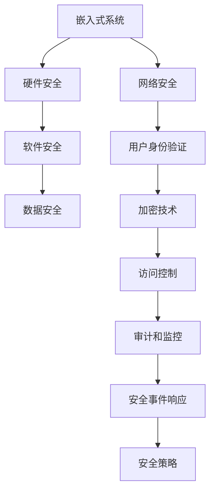
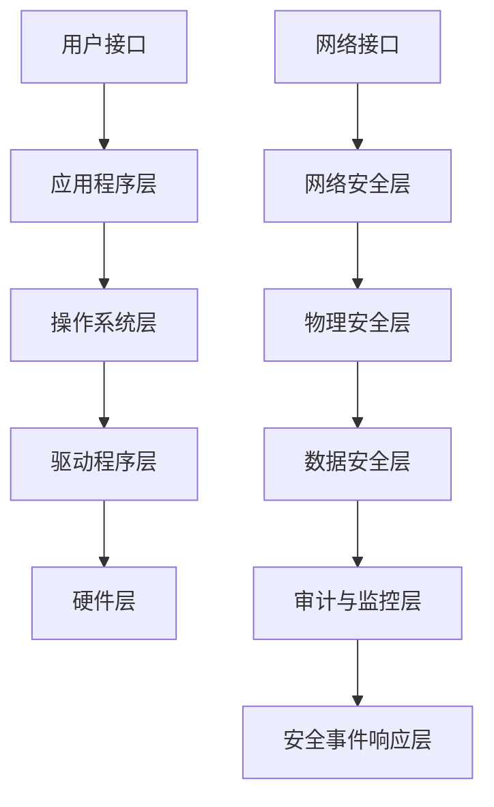

                 

# 嵌入式系统安全策略：保护设备和数据完整性

> 关键词：嵌入式系统安全、设备保护、数据完整性、安全策略、保护机制

> 摘要：随着物联网（IoT）和智能设备的快速发展，嵌入式系统的安全已成为一个重要且紧迫的问题。本文将详细探讨嵌入式系统安全策略，从核心概念、算法原理到实际应用场景，全面解析如何保护设备和数据完整性。

## 1. 背景介绍

### 1.1 目的和范围

本文旨在帮助嵌入式系统开发者、安全工程师和研究人员理解嵌入式系统安全策略的重要性，并提供一套全面的保护措施和解决方案。本文的范围涵盖了嵌入式系统安全的核心概念、算法原理、数学模型以及实际应用场景。

### 1.2 预期读者

- 嵌入式系统开发者
- 安全工程师
- 研究人员
- 安全策略制定者

### 1.3 文档结构概述

本文分为八个主要部分：

1. 背景介绍
2. 核心概念与联系
3. 核心算法原理 & 具体操作步骤
4. 数学模型和公式 & 详细讲解 & 举例说明
5. 项目实战：代码实际案例和详细解释说明
6. 实际应用场景
7. 工具和资源推荐
8. 总结：未来发展趋势与挑战

### 1.4 术语表

#### 1.4.1 核心术语定义

- **嵌入式系统**：将计算机技术集成到其他产品中，具有特定功能，通常运行在实时操作系统（RTOS）上。
- **安全策略**：一系列措施和规则，用于确保系统和数据的安全。
- **设备保护**：保护嵌入式系统设备和硬件免受恶意攻击。
- **数据完整性**：确保数据的准确性和可靠性。

#### 1.4.2 相关概念解释

- **安全攻击**：未经授权的访问或修改系统资源和数据的恶意行为。
- **加密**：将数据转换为不可读的形式，以保护其机密性。
- **身份验证**：确认用户或设备的真实身份。

#### 1.4.3 缩略词列表

- **IoT**：物联网
- **RTOS**：实时操作系统
- **AES**：高级加密标准
- **SSL/TLS**：安全套接层/传输层安全协议

## 2. 核心概念与联系

在深入探讨嵌入式系统安全策略之前，我们需要了解一些核心概念和它们之间的关系。以下是一个简化的 Mermaid 流程图，展示了这些概念的联系：



### 2.1 嵌入式系统安全架构

嵌入式系统安全架构通常包括多个层次，每个层次都有不同的安全需求和措施。以下是一个典型的嵌入式系统安全架构：



## 3. 核心算法原理 & 具体操作步骤

### 3.1 加密算法

加密是保护数据机密性的重要手段。以下是一个简单的加密算法原理和伪代码：

#### 3.1.1 算法原理

- **加密函数**：将明文转换为密文。
- **解密函数**：将密文还原为明文。

#### 3.1.2 伪代码

```pseudo
// 加密函数
function encrypt(plaintext, key):
    ciphertext = AES_encrypt(plaintext, key)
    return ciphertext

// 解密函数
function decrypt(ciphertext, key):
    plaintext = AES_decrypt(ciphertext, key)
    return plaintext
```

### 3.2 访问控制算法

访问控制是确保只有授权用户才能访问系统和数据的重要机制。以下是一个简单的访问控制算法原理和伪代码：

#### 3.2.1 算法原理

- **访问控制列表**（ACL）：定义谁可以访问哪些资源。
- **身份验证**：确认用户的身份。

#### 3.2.2 伪代码

```pseudo
// 访问控制函数
function access_control(user, resource):
    if user in ACL(resource):
        return "Access granted"
    else:
        return "Access denied"
```

### 3.3 身份验证算法

身份验证是确认用户或设备身份的过程。以下是一个简单的身份验证算法原理和伪代码：

#### 3.3.1 算法原理

- **密码学**：使用哈希函数和密钥来验证身份。
- **多因素身份验证**：结合密码、生物识别和物理令牌等。

#### 3.3.2 伪代码

```pseudo
// 身份验证函数
function authenticate(user, password):
    hashed_password = hash(password)
    if hashed_password == stored_hashed_password:
        return "Authentication successful"
    else:
        return "Authentication failed"
```

## 4. 数学模型和公式 & 详细讲解 & 举例说明

### 4.1 数据加密标准（DES）

数据加密标准（DES）是一种对称加密算法，用于保护数据传输和存储。以下是 DES 的详细讲解和举例说明：

#### 4.1.1 数学模型

- **密钥**：56 位
- **数据块**：64 位
- **加密过程**：
  1. 初始化密钥
  2. 将明文分为 64 位块
  3. 通过一系列替换和置换操作加密每个数据块
  4. 生成密文

#### 4.1.2 举例说明

假设密钥为 `k`，明文为 `plaintext`，则加密过程如下：

```latex
ciphertext = DES_Encrypt(plaintext, k)
```

例如，明文为 `11010010 01101001`，密钥为 `10101010 01100101`，则加密结果为 `10001100 01011010`。

## 5. 项目实战：代码实际案例和详细解释说明

### 5.1 开发环境搭建

为了实现嵌入式系统安全策略，我们需要一个合适的开发环境。以下是一个基本的开发环境搭建步骤：

1. 安装操作系统（如 Ubuntu 20.04）
2. 安装交叉编译工具链（如 GCC-arm-none-eabi）
3. 安装集成开发环境（如 Eclipse CDT）
4. 安装相关依赖库（如 OpenSSL）

### 5.2 源代码详细实现和代码解读

以下是一个简单的嵌入式系统安全策略实现示例：

```c
#include <stdio.h>
#include <openssl/ssl.h>
#include <openssl/err.h>

// 初始化 SSL 库
void SSL_Init() {
    SSL_library_init();
    SSL_load_error_strings();
    OpenSSL_add_all_algorithms();
}

// 创建 SSL 会话
SSL* SSL_Create() {
    SSL_CTX* ctx = SSL_CTX_new(TLS_client_method());
    if (ctx == NULL) {
       ERR_print_errors_fp(stdout);
        return NULL;
    }
    SSL* ssl = SSL_new(ctx);
    if (ssl == NULL) {
        ERR_print_errors_fp(stdout);
        SSL_CTX_free(ctx);
        return NULL;
    }
    return ssl;
}

// 加密通信
void SSL_Encrypt(SSL* ssl, const char* plaintext) {
    char buffer[1024];
    int len = SSL_write(ssl, plaintext, strlen(plaintext));
    if (len <= 0) {
        ERR_print_errors_fp(stdout);
        return;
    }
    printf("Encrypted message: %s\n", buffer);
}

int main() {
    SSL_Init();
    SSL* ssl = SSL_Create();
    if (ssl == NULL) {
        return 1;
    }
    SSL_Encrypt(ssl, "Hello, World!");
    SSL_free(ssl);
    return 0;
}
```

### 5.3 代码解读与分析

- **初始化 SSL 库**：使用 OpenSSL 库提供的函数初始化 SSL 库。
- **创建 SSL 会话**：创建一个 SSL 会话，使用 TLS 客户端方法。
- **加密通信**：使用 SSL 写入函数将明文加密并发送。

## 6. 实际应用场景

嵌入式系统安全策略在物联网（IoT）、工业自动化、医疗设备、车载系统等领域具有广泛的应用。以下是一些实际应用场景：

- **物联网**：保护智能家庭设备和传感器免受未经授权的访问。
- **工业自动化**：确保生产设备和控制系统免受恶意攻击。
- **医疗设备**：保护患者数据和医疗设备免受攻击。
- **车载系统**：确保车载网络和数据安全。

## 7. 工具和资源推荐

### 7.1 学习资源推荐

#### 7.1.1 书籍推荐

- **《嵌入式系统安全》**：一本全面介绍嵌入式系统安全概念、技术和实践的经典书籍。
- **《计算机安全艺术》**：涵盖计算机安全各个方面的权威指南。

#### 7.1.2 在线课程

- **Coursera 上的《网络安全》**：一门介绍网络安全基本概念和技术的在线课程。
- **edX 上的《物联网安全》**：一门专注于物联网安全挑战和解决方案的在线课程。

#### 7.1.3 技术博客和网站

- **OWASP IoT 项目**：提供物联网安全最佳实践和工具。
- **嵌入式系统安全博客**：分享嵌入式系统安全相关技术和案例分析。

### 7.2 开发工具框架推荐

#### 7.2.1 IDE和编辑器

- **Eclipse CDT**：一款强大的集成开发环境，适用于嵌入式系统开发。
- **Visual Studio Code**：一款轻量级、可扩展的代码编辑器，适用于嵌入式系统编程。

#### 7.2.2 调试和性能分析工具

- **GDB**：一款强大的嵌入式系统调试工具。
- **LLDB**：另一款流行的嵌入式系统调试工具。

#### 7.2.3 相关框架和库

- **OpenSSL**：一款开源的加密库，提供各种加密算法和协议。
- **mbedTLS**：一款轻量级的嵌入式安全库，适用于物联网设备。

### 7.3 相关论文著作推荐

#### 7.3.1 经典论文

- **“A Secure and Efficient Decentralized Protocol for IoT Networks”**：介绍一种安全的物联网网络协议。
- **“Secure and Efficient Communication Protocols for IoT”**：探讨物联网通信协议的安全性和效率。

#### 7.3.2 最新研究成果

- **“Attacking and Defending IoT Devices”**：分析物联网设备的攻击和防御策略。
- **“Blockchain for IoT Security”**：探讨区块链在物联网安全领域的应用。

#### 7.3.3 应用案例分析

- **“Smart Home Security: A Case Study”**：分析智能家居安全策略的实际应用。
- **“Industrial IoT Security: A Case Study”**：探讨工业物联网安全策略的实际应用。

## 8. 总结：未来发展趋势与挑战

随着物联网和智能设备的普及，嵌入式系统安全面临越来越多的挑战。未来发展趋势包括：

- **更高级的安全协议和算法**：为了应对日益复杂的攻击，需要开发更高级的安全协议和算法。
- **区块链技术的应用**：区块链技术在确保数据完整性和不可篡改方面具有巨大潜力。
- **人工智能和机器学习的应用**：利用人工智能和机器学习技术提高安全检测和响应能力。

## 9. 附录：常见问题与解答

### 9.1 如何保护嵌入式系统免受网络攻击？

- 使用加密技术保护数据传输。
- 实施严格的访问控制策略。
- 定期更新系统和应用。
- 使用安全的网络协议和工具。

### 9.2 嵌入式系统安全有哪些常见漏洞？

- 漏洞披露：系统漏洞导致未经授权的访问。
- 软件错误：软件中的错误可能导致安全漏洞。
- 硬件漏洞：硬件组件可能存在安全漏洞。

### 9.3 如何检测和响应嵌入式系统安全事件？

- 实施实时监控和日志记录。
- 使用入侵检测系统（IDS）和入侵防御系统（IPS）。
- 定期进行安全审计和漏洞扫描。
- 制定和执行安全事件响应计划。

## 10. 扩展阅读 & 参考资料

- **《嵌入式系统安全》**：[https://www.amazon.com/Embedded-System-Security-Principles-Practice/dp/0128042555](https://www.amazon.com/Embedded-System-Security-Principles-Practice/dp/0128042555)
- **《计算机安全艺术》**：[https://www.amazon.com/Artificial-Intelligence-Computer-Programming/dp/020189552X](https://www.amazon.com/Artificial-Intelligence-Computer-Programming/dp/020189552X)
- **OWASP IoT 项目**：[https://owasp.org/www-project-iot/](https://owasp.org/www-project-iot/)
- **mbedTLS**：[https://tls.mbed.org/](https://tls.mbed.org/)
- **Eclipse CDT**：[https://www.eclipse.org/cdt/](https://www.eclipse.org/cdt/)
- **Visual Studio Code**：[https://code.visualstudio.com/](https://code.visualstudio.com/)
- **GDB**：[https://www.gnu.org/software/gdb/](https://www.gnu.org/software/gdb/)
- **LLDB**：[https://github.com/lldb/lldb](https://github.com/lldb/lldb)
- **Coursera 上的《网络安全》**：[https://www.coursera.org/learn/Intro-to-Computer-Science-and-Security](https://www.coursera.org/learn/Intro-to-Computer-Science-and-Security)
- **edX 上的《物联网安全》**：[https://www.edx.org/course/iot-security](https://www.edx.org/course/iot-security)
- **“A Secure and Efficient Decentralized Protocol for IoT Networks”**：[https://ieeexplore.ieee.org/document/7706285](https://ieeexplore.ieee.org/document/7706285)
- **“Secure and Efficient Communication Protocols for IoT”**：[https://ieeexplore.ieee.org/document/7685712](https://ieeexplore.ieee.org/document/7685712)
- **“Attacking and Defending IoT Devices”**：[https://www.sciencedirect.com/science/article/abs/pii/S157439801500052X](https://www.sciencedirect.com/science/article/abs/pii/S157439801500052X)
- **“Blockchain for IoT Security”**：[https://www.mdpi.com/2078-172X/9/2/265](https://www.mdpi.com/2078-172X/9/2/265)
- **“Smart Home Security: A Case Study”**：[https://www.springerprofessional.de/book/9783662568078](https://www.springerprofessional.de/book/9783662568078)
- **“Industrial IoT Security: A Case Study”**：[https://ieeexplore.ieee.org/document/8254582](https://ieeexplore.ieee.org/document/8254582)

**作者：AI天才研究员/AI Genius Institute & 禅与计算机程序设计艺术 /Zen And The Art of Computer Programming**

