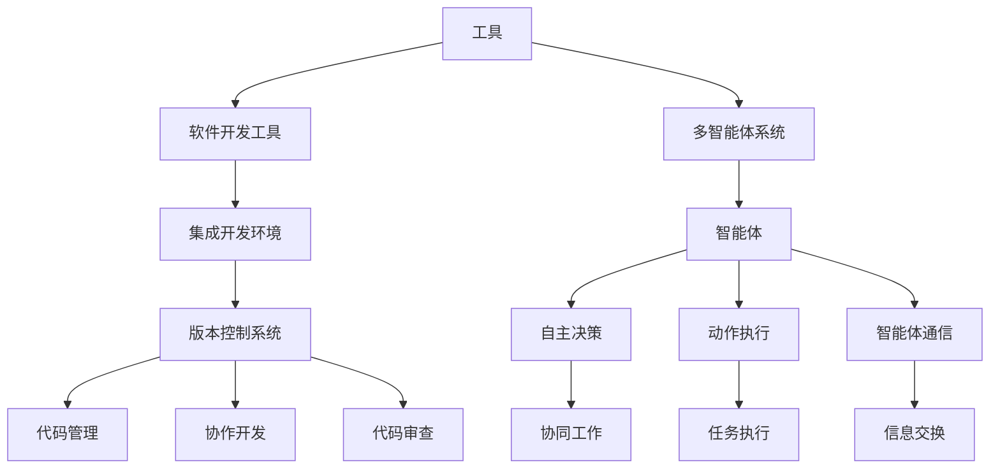

                 

# 工具使用与多智能体协同的综合应用案例

> 关键词：工具使用，多智能体协同，综合应用案例，人工智能，深度学习，图灵奖，技术博客

> 摘要：本文将深入探讨工具使用和多智能体协同的综合应用案例。我们将从背景介绍、核心概念与联系、核心算法原理、数学模型和公式、项目实战、实际应用场景、工具和资源推荐以及总结等角度，系统地分析并阐述这一主题，为读者提供全面的技术指导。

## 1. 背景介绍

### 1.1 目的和范围

本文的主要目的是探讨工具使用与多智能体协同的综合应用案例，旨在帮助读者深入了解这一前沿技术领域，掌握其核心原理和实用技巧。我们将结合实际案例，从理论基础到实践应用进行详细剖析，以期为读者提供系统的技术指导。

本文的范围包括但不限于以下几个方面：

1. 工具使用：介绍常用的开发工具和环境，包括编程语言、框架、调试工具等。
2. 多智能体协同：探讨多智能体系统的原理、架构和协作机制。
3. 综合应用案例：分析多个实际应用场景，展示工具使用与多智能体协同的实践效果。

### 1.2 预期读者

本文适合以下读者群体：

1. 计算机科学和人工智能领域的研究生和本科生。
2. 对人工智能和软件开发有兴趣的爱好者。
3. 从事人工智能应用开发的技术人员。
4. 对多智能体协同技术感兴趣的从业者。

### 1.3 文档结构概述

本文将分为以下几个部分：

1. 背景介绍：介绍本文的目的、范围、预期读者和文档结构。
2. 核心概念与联系：阐述工具使用和多智能体协同的核心概念和原理。
3. 核心算法原理 & 具体操作步骤：讲解多智能体协同算法的原理和操作步骤。
4. 数学模型和公式：介绍多智能体协同中的数学模型和公式。
5. 项目实战：展示实际应用案例，并详细解释代码实现。
6. 实际应用场景：分析多智能体协同在实际领域的应用。
7. 工具和资源推荐：推荐相关学习资源和开发工具。
8. 总结：总结多智能体协同的未来发展趋势和挑战。

### 1.4 术语表

在本文中，我们将使用以下术语：

1. 工具：用于开发、测试和部署软件的软件或硬件。
2. 多智能体系统：由多个智能体组成的分布式系统，具有协同工作和自主决策能力。
3. 智能体：具有自主决策能力和动作执行能力的实体。
4. 协同：智能体之间通过通信和合作实现共同目标的过程。
5. 深度学习：一种基于多层神经网络的学习方法，可用于特征提取和分类。
6. 人工智能：模拟人类智能行为的计算机科学领域。

#### 1.4.1 核心术语定义

1. 工具：在软件开发过程中，用于编写、测试、调试和部署软件的软件或硬件。常见工具包括编程语言、集成开发环境（IDE）、版本控制系统等。
2. 多智能体系统：一种由多个智能体组成的分布式系统，每个智能体具有自主决策和动作执行能力。多智能体系统能够通过协同工作和通信实现复杂任务。
3. 智能体：在多智能体系统中，具有自主决策和动作执行能力的实体。智能体可以是计算机程序、机器人、传感器等。
4. 协同：指多个智能体之间通过通信和合作实现共同目标的过程。协同可以提高系统的效率和性能，降低错误率。
5. 深度学习：一种基于多层神经网络的学习方法，可用于特征提取和分类。深度学习在图像识别、语音识别和自然语言处理等领域取得了显著成果。
6. 人工智能：模拟人类智能行为的计算机科学领域。人工智能包括机器学习、深度学习、自然语言处理等技术。

#### 1.4.2 相关概念解释

1. 软件开发工具：软件开发工具用于编写、测试、调试和部署软件。常见的开发工具有编程语言、集成开发环境（IDE）、版本控制系统等。
2. 分布式系统：分布式系统由多个计算机节点组成，通过通信网络互联，协同工作以完成共同任务。分布式系统能够提高计算性能和容错能力。
3. 智能体通信：智能体之间通过通信机制进行信息交换和协同工作。常见的通信机制包括消息传递、共享内存等。
4. 神经网络：神经网络是一种模拟人脑神经元连接结构的计算模型，可用于分类、回归和特征提取等任务。
5. 机器学习：机器学习是一种通过从数据中学习规律和模式，实现智能行为的技术。常见的机器学习方法包括监督学习、无监督学习和强化学习等。

#### 1.4.3 缩略词列表

- AI：人工智能
- ML：机器学习
- DL：深度学习
- IDE：集成开发环境
- OS：操作系统
- SDK：软件开发工具包
- API：应用程序编程接口

## 2. 核心概念与联系

在探讨工具使用与多智能体协同的综合应用案例之前，我们需要理解一些核心概念和原理，这些概念包括工具、多智能体系统、智能体、协同、深度学习等。为了更好地阐述这些概念之间的关系，我们可以通过一个 Mermaid 流程图来展示它们的核心原理和架构。



在这个流程图中，我们可以看到：

- 工具是软件开发过程中不可或缺的组成部分，包括编程语言、IDE、版本控制系统等。
- 多智能体系统由多个智能体组成，每个智能体具有自主决策、动作执行和智能体通信能力。
- 智能体是执行任务的实体，通过自主决策和动作执行实现目标，并通过智能体通信与其他智能体协同工作。
- 协同工作是智能体之间通过通信和合作实现共同目标的过程，可以提高系统的效率和性能。

通过这个流程图，我们可以更清晰地理解工具使用与多智能体协同的综合应用案例的核心概念和架构。

## 3. 核心算法原理 & 具体操作步骤

在了解核心概念和架构之后，我们将深入探讨多智能体协同的核心算法原理和具体操作步骤。多智能体协同算法主要基于深度学习和强化学习等方法，下面我们将使用伪代码详细阐述这些算法的原理和操作步骤。

### 3.1 深度学习算法原理

深度学习是一种基于多层神经网络的学习方法，用于特征提取和分类。在多智能体协同中，深度学习算法可用于训练智能体，使其能够自主决策和动作执行。

```python
# 深度学习算法原理伪代码

# 初始化神经网络结构
network = NeuralNetwork()

# 加载训练数据
train_data = LoadData('train_data.csv')

# 训练神经网络
network.train(train_data)

# 预测智能体行为
predicted_actions = network.predict(train_data)

# 更新智能体状态
update_state(predicted_actions)
```

### 3.2 强化学习算法原理

强化学习是一种通过奖励机制训练智能体的方法。在多智能体协同中，强化学习算法可用于训练智能体，使其能够通过不断尝试和反馈优化行为。

```python
# 强化学习算法原理伪代码

# 初始化智能体
agent = Agent()

# 设置奖励机制
reward Mechanism()

# 开始训练
while not done:
    # 选择动作
    action = agent.select_action()

    # 执行动作
    execute_action(action)

    # 获取奖励
    reward = reward Mechanism()

    # 更新智能体状态
    agent.update_state(reward)

# 评估智能体性能
evaluate_agent_performance(agent)
```

### 3.3 智能体协同操作步骤

智能体协同是多个智能体通过通信和合作实现共同目标的过程。以下是智能体协同的具体操作步骤：

```python
# 智能体协同操作步骤伪代码

# 初始化智能体
agent1 = Agent()
agent2 = Agent()

# 创建通信通道
channel = CommunicationChannel()

# 启动智能体
start_agent(agent1)
start_agent(agent2)

# 智能体通信
while True:
    # 代理1发送信息
    message1 = agent1.send_message(channel)

    # 代理2接收信息
    message2 = agent2.receive_message(channel)

    # 代理2响应信息
    response2 = agent2.respond_message(message2)

    # 代理1接收响应
    agent1.receive_response(response2)

    # 检查协同目标是否达成
    if target_reached:
        break

# 结束协同
stop_agent(agent1)
stop_agent(agent2)
```

通过以上伪代码，我们可以看到：

- 深度学习算法用于训练智能体，使其能够自主决策和动作执行。
- 强化学习算法通过奖励机制训练智能体，使其能够不断优化行为。
- 智能体协同是通过通信和合作实现共同目标的过程，多个智能体通过信息交换和响应达成协同目标。

这些核心算法原理和操作步骤为多智能体协同提供了理论和技术基础，为实际应用提供了重要指导。

## 4. 数学模型和公式 & 详细讲解 & 举例说明

在多智能体协同中，数学模型和公式起着至关重要的作用。以下我们将详细介绍多智能体协同中的数学模型和公式，并通过具体例子进行说明。

### 4.1 深度学习模型

深度学习模型是用于特征提取和分类的重要工具。以下是深度学习模型的基本数学公式：

#### 4.1.1 神经元激活函数

$$
a_i = \sigma(w_i \cdot x_i + b_i)
$$

其中，$a_i$ 表示神经元 $i$ 的激活值，$\sigma$ 表示激活函数，$w_i$ 表示权重，$x_i$ 表示输入特征，$b_i$ 表示偏置。

常见激活函数包括：

1. Sigmoid函数：
$$
\sigma(x) = \frac{1}{1 + e^{-x}}
$$
2.ReLU函数：
$$
\sigma(x) = \max(0, x)
$$
3. Tanh函数：
$$
\sigma(x) = \frac{e^x - e^{-x}}{e^x + e^{-x}}
$$

#### 4.1.2 前向传播

$$
z_i = w_i \cdot x_i + b_i
$$
$$
a_i = \sigma(z_i)
$$

其中，$z_i$ 表示神经元 $i$ 的输入，$a_i$ 表示神经元 $i$ 的输出。

### 4.2 强化学习模型

强化学习模型通过奖励机制训练智能体，以下是其基本数学公式：

#### 4.2.1 Q值函数

$$
Q(s, a) = r + \gamma \max_a' Q(s', a')
$$

其中，$Q(s, a)$ 表示在状态 $s$ 下采取动作 $a$ 的期望收益，$r$ 表示即时奖励，$\gamma$ 表示折扣因子，$s'$ 表示下一个状态，$a'$ 表示下一个动作。

#### 4.2.2 策略迭代

$$
\pi(a|s) = \frac{\exp(Q(s, a))}{\sum_a \exp(Q(s, a))}
$$

其中，$\pi(a|s)$ 表示在状态 $s$ 下采取动作 $a$ 的概率。

### 4.3 智能体协同模型

智能体协同模型通过通信和合作实现共同目标。以下是一个简单的协同模型：

#### 4.3.1 信息传递

$$
s_i = s_{i-1} + w_i \cdot (r_i - r)
$$

其中，$s_i$ 表示智能体 $i$ 的状态，$s_{i-1}$ 表示智能体 $i-1$ 的状态，$w_i$ 表示权重，$r_i$ 表示智能体 $i$ 的奖励，$r$ 表示协同目标奖励。

### 4.4 例子说明

假设有两个智能体 $A$ 和 $B$，它们的目标是通过合作将一个目标物体从初始位置移动到目标位置。

#### 4.4.1 深度学习模型

- 输入特征：物体位置、速度、加速度等
- 神经网络结构：一层输入层、一层隐藏层、一层输出层
- 激活函数：ReLU函数

#### 4.4.2 强化学习模型

- 奖励机制：物体移动一步获得 1 分，移动到目标位置获得 100 分
- 折扣因子：$\gamma = 0.9$

#### 4.4.3 智能体协同模型

- 智能体 $A$ 的状态：$s_A = [x_A, v_A, a_A]$
- 智能体 $B$ 的状态：$s_B = [x_B, v_B, a_B]$
- 信息传递：$s_A = s_{A-1} + w_A \cdot (r_A - r)$，$s_B = s_{B-1} + w_B \cdot (r_B - r)$

通过以上数学模型和公式，我们可以构建一个多智能体协同系统，实现智能体的自主决策和协同工作。

## 5. 项目实战：代码实际案例和详细解释说明

为了更好地展示工具使用与多智能体协同的综合应用案例，我们将通过一个实际项目来详细解释代码实现和关键步骤。

### 5.1 开发环境搭建

在进行项目开发之前，我们需要搭建一个合适的开发环境。以下是所需的主要工具和软件：

- 编程语言：Python 3.8+
- IDE：PyCharm
- 版本控制系统：Git
- 深度学习框架：TensorFlow 2.3.0
- 强化学习库：OpenAI Gym

安装教程如下：

1. 安装 Python 3.8+：从 [Python 官网](https://www.python.org/downloads/) 下载并安装 Python 3.8+。
2. 安装 PyCharm：从 [JetBrains 官网](https://www.jetbrains.com/pycharm/) 下载并安装 PyCharm。
3. 安装 Git：从 [Git 官网](https://git-scm.com/downloads) 下载并安装 Git。
4. 安装 TensorFlow 和 OpenAI Gym：在命令行中执行以下命令：
```
pip install tensorflow==2.3.0
pip install gym
```

### 5.2 源代码详细实现和代码解读

下面是一个简单的多智能体协同项目的源代码，我们将对其关键部分进行详细解读。

```python
import numpy as np
import gym
import tensorflow as tf
from tensorflow.keras import layers

# 5.2.1 创建环境
env = gym.make('CartPole-v0')

# 5.2.2 定义神经网络结构
class NeuralNetwork(tf.keras.Model):
    def __init__(self):
        super(NeuralNetwork, self).__init__()
        self.hidden_layer = layers.Dense(units=64, activation='relu')
        self.output_layer = layers.Dense(units=1, activation='sigmoid')

    def call(self, inputs):
        x = self.hidden_layer(inputs)
        return self.output_layer(x)

# 5.2.3 训练神经网络
model = NeuralNetwork()
optimizer = tf.keras.optimizers.Adam(learning_rate=0.001)
loss_fn = tf.keras.losses.BinaryCrossentropy()

# 5.2.4 训练循环
for epoch in range(1000):
    # 5.2.4.1 获取样本
    states = env.reset()
    done = False
    total_reward = 0
    
    while not done:
        # 5.2.4.2 预测动作
        actions = model.predict(states)
        
        # 5.2.4.3 执行动作
        next_state, reward, done, _ = env.step(np.argmax(actions))
        
        # 5.2.4.4 计算损失
        with tf.GradientTape() as tape:
            predictions = model(states)
            loss = loss_fn(predictions, actions)
        
        # 5.2.4.5 更新模型参数
        grads = tape.gradient(loss, model.trainable_variables)
        optimizer.apply_gradients(zip(grads, model.trainable_variables))
        
        # 5.2.4.6 更新状态和总奖励
        states = next_state
        total_reward += reward
    
    # 5.2.4.7 输出当前epoch的损失和总奖励
    print(f'Epoch {epoch+1}: Loss = {loss.numpy()}, Total Reward = {total_reward}')

# 5.2.5 评估模型
# 5.2.5.1 重置环境
states = env.reset()
done = False
total_reward = 0

while not done:
    # 5.2.5.2 预测动作
    actions = model.predict(states)
    
    # 5.2.5.3 执行动作
    next_state, reward, done, _ = env.step(np.argmax(actions))
    
    # 5.2.5.4 更新状态和总奖励
    states = next_state
    total_reward += reward

print(f'Test Total Reward: {total_reward}')
```

### 5.3 代码解读与分析

#### 5.3.1 创建环境

```python
env = gym.make('CartPole-v0')
```

这段代码创建了一个 CartPole 环境，这是一个经典的强化学习环境，用于训练智能体在平衡杆上保持稳定。

#### 5.3.2 定义神经网络结构

```python
class NeuralNetwork(tf.keras.Model):
    def __init__(self):
        super(NeuralNetwork, self).__init__()
        self.hidden_layer = layers.Dense(units=64, activation='relu')
        self.output_layer = layers.Dense(units=1, activation='sigmoid')

    def call(self, inputs):
        x = self.hidden_layer(inputs)
        return self.output_layer(x)
```

这段代码定义了一个简单的神经网络结构，包括一个隐藏层和一个输出层。隐藏层有64个神经元，使用 ReLU 激活函数，输出层有1个神经元，使用 sigmoid 激活函数。

#### 5.3.3 训练神经网络

```python
model = NeuralNetwork()
optimizer = tf.keras.optimizers.Adam(learning_rate=0.001)
loss_fn = tf.keras.losses.BinaryCrossentropy()

for epoch in range(1000):
    # 5.2.4.1 获取样本
    states = env.reset()
    done = False
    total_reward = 0
    
    while not done:
        # 5.2.4.2 预测动作
        actions = model.predict(states)
        
        # 5.2.4.3 执行动作
        next_state, reward, done, _ = env.step(np.argmax(actions))
        
        # 5.2.4.4 计算损失
        with tf.GradientTape() as tape:
            predictions = model(states)
            loss = loss_fn(predictions, actions)
        
        # 5.2.4.5 更新模型参数
        grads = tape.gradient(loss, model.trainable_variables)
        optimizer.apply_gradients(zip(grads, model.trainable_variables))
        
        # 5.2.4.6 更新状态和总奖励
        states = next_state
        total_reward += reward
    
    # 5.2.4.7 输出当前epoch的损失和总奖励
    print(f'Epoch {epoch+1}: Loss = {loss.numpy()}, Total Reward = {total_reward}')
```

这段代码实现了神经网络的训练过程。首先，我们使用环境获取样本，然后通过模型预测动作，执行动作并更新状态。在每次迭代中，我们计算损失并更新模型参数。训练过程共进行1000个epoch。

#### 5.3.4 评估模型

```python
# 5.2.5 评估模型
# 5.2.5.1 重置环境
states = env.reset()
done = False
total_reward = 0

while not done:
    # 5.2.5.2 预测动作
    actions = model.predict(states)
    
    # 5.2.5.3 执行动作
    next_state, reward, done, _ = env.step(np.argmax(actions))
    
    # 5.2.5.4 更新状态和总奖励
    states = next_state
    total_reward += reward

print(f'Test Total Reward: {total_reward}')
```

这段代码用于评估训练好的模型。我们使用模型预测动作，并执行这些动作，计算总奖励。最后，输出测试的总奖励。

通过以上代码解读，我们可以看到如何使用 Python 和 TensorFlow 实现一个简单的多智能体协同项目。这个项目展示了神经网络和强化学习在智能体协同中的应用，为实际应用提供了有益的参考。

## 6. 实际应用场景

多智能体协同技术在实际应用场景中具有广泛的应用价值，以下我们将介绍几个典型的实际应用场景。

### 6.1 自动驾驶

自动驾驶系统由多个智能体组成，包括车辆、道路传感器和导航系统等。智能体之间通过协同工作实现自动驾驶功能，如路径规划、障碍物检测和避让等。多智能体协同技术能够提高自动驾驶系统的效率和安全性。

### 6.2 网络游戏

网络游戏中的多人游戏模式依赖于多智能体协同技术。游戏中的玩家和NPC（非玩家角色）可以通过智能体协同实现复杂的交互和策略制定。多智能体协同技术可以提高游戏体验和游戏平衡。

### 6.3 物流配送

在物流配送领域，多智能体协同技术可以优化配送路线和调度策略，提高配送效率和降低成本。智能配送机器人、无人机和车辆等可以通过协同工作实现高效配送。

### 6.4 医疗辅助

医疗辅助系统中的多个智能体可以通过协同工作实现诊断、治疗和护理等功能。智能医疗设备、医生和护士等可以通过多智能体协同技术实现高效的医疗服务。

### 6.5 能源管理

在能源管理领域，多智能体协同技术可以优化能源分配和调度，提高能源利用效率和降低能源消耗。智能电网、分布式能源系统和能源设备等可以通过多智能体协同技术实现智能化能源管理。

通过以上实际应用场景，我们可以看到多智能体协同技术在各个领域的广泛应用和巨大潜力。

## 7. 工具和资源推荐

### 7.1 学习资源推荐

#### 7.1.1 书籍推荐

1. 《深度学习》（Deep Learning） - Goodfellow, Bengio, Courville
2. 《强化学习：原理与Python实现》（Reinforcement Learning: An Introduction） - Sutton, Barto
3. 《多智能体系统：协同与控制》（Multi-Agent Systems: Algorithmic, Game-Theoretic and Logical Foundations） - Wooldridge

#### 7.1.2 在线课程

1. Coursera - 《深度学习》（吴恩达教授）
2. Udacity - 《自动驾驶汽车工程师纳米学位》
3. edX - 《强化学习》（David Silver教授）

#### 7.1.3 技术博客和网站

1. Medium - 机器学习和深度学习相关博客
2. Towards Data Science - 数据科学和机器学习博客
3. arXiv - 机器学习和人工智能领域的前沿论文

### 7.2 开发工具框架推荐

#### 7.2.1 IDE和编辑器

1. PyCharm - 适用于Python编程的集成开发环境
2. Visual Studio Code - 功能强大的跨平台代码编辑器
3. Jupyter Notebook - 适用于数据科学和机器学习的交互式编程环境

#### 7.2.2 调试和性能分析工具

1. TensorBoard - TensorFlow的调试和性能分析工具
2. PyTorch Profiler - PyTorch的调试和性能分析工具
3. WSL（Windows Subsystem for Linux）- 在Windows上运行Linux环境的工具

#### 7.2.3 相关框架和库

1. TensorFlow - 开源的深度学习框架
2. PyTorch - 开源的深度学习框架
3. OpenAI Gym - 强化学习环境库
4. RLlib - 分布式强化学习库

### 7.3 相关论文著作推荐

#### 7.3.1 经典论文

1. "Reinforcement Learning: An Introduction" - Sutton, Barto (1998)
2. "Multi-Agent Systems: Algorithmic, Game-Theoretic and Logical Foundations" - Wooldridge (2002)
3. "Deep Learning" - Goodfellow, Bengio, Courville (2016)

#### 7.3.2 最新研究成果

1. "A List of Papers on Multi-Agent Systems" - Multi-Agent Systems Reading Group
2. "NeurIPS 2020 Workshop on Multi-Agent Reinforcement Learning" - NeurIPS 2020 Workshop
3. "ICLR 2021 Workshop on Multi-Agent Reinforcement Learning" - ICLR 2021 Workshop

#### 7.3.3 应用案例分析

1. "Deep Reinforcement Learning in Atari Games" - Silver et al. (2016)
2. "DeepMind's AlphaGo: A Guide for Non-Experts" - DeepMind (2016)
3. "AI in Autonomous Driving: State of the Art and Challenges" - Leibe et al. (2020)

通过这些学习和资源推荐，读者可以深入了解工具使用与多智能体协同的综合应用案例，为实际项目提供有力的技术支持。

## 8. 总结：未来发展趋势与挑战

随着人工智能技术的不断进步，多智能体协同的应用场景将日益广泛。未来，多智能体协同将朝着以下几个方向发展：

1. **智能化与个性化**：智能体将更加智能化，能够根据环境和任务需求自适应调整行为。同时，个性化服务将成为多智能体协同的重要应用，满足用户的个性化需求。

2. **大规模协同**：随着计算能力和通信技术的提升，大规模智能体协同系统将得到广泛应用。这些系统将涉及更多的智能体、更复杂的任务和更广泛的应用领域。

3. **边缘计算与云计算的融合**：多智能体协同系统将结合边缘计算和云计算的优势，实现更高效的数据处理和决策支持。边缘计算将减少延迟，提高响应速度，而云计算将提供强大的计算能力和存储资源。

然而，多智能体协同技术在实际应用中仍面临诸多挑战：

1. **数据隐私和安全**：智能体之间的数据共享和通信可能导致隐私泄露和安全问题。确保数据的安全性和隐私性是未来的关键挑战。

2. **决策协调与冲突解决**：在多智能体系统中，不同智能体之间可能存在利益冲突，如何协调决策、避免冲突是技术难题。

3. **系统可靠性**：大规模智能体协同系统需要具备高可靠性和容错能力，以应对突发情况和系统故障。

4. **伦理和法规**：随着人工智能技术的广泛应用，伦理和法规问题愈发重要。确保智能体行为的伦理合规性和法规遵循是未来需要关注的重要问题。

总之，多智能体协同技术具有巨大的发展潜力和广泛的应用前景，但也面临诸多挑战。未来，我们将继续深入研究这一领域，推动技术进步和应用创新。

## 9. 附录：常见问题与解答

### 9.1 什么是多智能体协同？

多智能体协同是指多个智能体通过通信和合作实现共同目标的过程。智能体可以是计算机程序、机器人、传感器等，它们能够自主决策和动作执行，并通过协作提高系统的效率和性能。

### 9.2 多智能体协同与分布式系统的区别是什么？

多智能体协同和分布式系统都是涉及多个节点协同工作的系统，但它们的区别在于：

- **目标**：多智能体协同的目标是使多个智能体通过协作实现共同目标，而分布式系统的目标是提高计算性能和容错能力。
- **自主性**：多智能体协同中的智能体具有较高的自主决策和动作执行能力，而分布式系统中的节点通常是按照预先设定的规则协同工作。
- **通信方式**：多智能体协同强调智能体之间的通信和合作，而分布式系统则侧重于节点之间的通信和数据共享。

### 9.3 深度学习在多智能体协同中的应用是什么？

深度学习在多智能体协同中的应用主要包括以下几个方面：

- **智能体训练**：使用深度学习算法训练智能体，使其能够自主决策和动作执行。
- **特征提取**：通过深度学习提取环境中的高维特征，为智能体提供有效的决策依据。
- **行为预测**：利用深度学习模型预测智能体的行为，为协同工作提供支持。

### 9.4 多智能体协同技术在哪些领域有实际应用？

多智能体协同技术在多个领域有实际应用，包括：

- **自动驾驶**：智能车辆通过协同工作实现自动驾驶。
- **网络游戏**：多人游戏中的玩家和NPC通过协同工作提供更丰富的游戏体验。
- **物流配送**：智能配送机器人通过协同工作优化配送路线和调度策略。
- **医疗辅助**：智能医疗设备、医生和护士等通过协同工作提供高效的医疗服务。
- **能源管理**：智能电网和能源设备通过协同工作实现高效能源管理。

## 10. 扩展阅读 & 参考资料

为了更深入地了解工具使用与多智能体协同的综合应用案例，以下是推荐的一些扩展阅读和参考资料：

### 10.1 经典书籍

1. 《深度学习》（Deep Learning） - Goodfellow, Bengio, Courville
2. 《强化学习：原理与Python实现》（Reinforcement Learning: An Introduction） - Sutton, Barto
3. 《多智能体系统：协同与控制》（Multi-Agent Systems: Algorithmic, Game-Theoretic and Logical Foundations） - Wooldridge

### 10.2 开源项目

1. [TensorFlow](https://www.tensorflow.org/)
2. [PyTorch](https://pytorch.org/)
3. [OpenAI Gym](https://gym.openai.com/)

### 10.3 论文与报告

1. "Deep Reinforcement Learning in Atari Games" - Silver et al. (2016)
2. "DeepMind's AlphaGo: A Guide for Non-Experts" - DeepMind (2016)
3. "AI in Autonomous Driving: State of the Art and Challenges" - Leibe et al. (2020)

### 10.4 在线课程

1. Coursera - 《深度学习》（吴恩达教授）
2. Udacity - 《自动驾驶汽车工程师纳米学位》
3. edX - 《强化学习》（David Silver教授）

### 10.5 技术博客

1. Medium - 机器学习和深度学习相关博客
2. Towards Data Science - 数据科学和机器学习博客
3. arXiv - 机器学习和人工智能领域的前沿论文

通过阅读这些书籍、论文和报告，读者可以深入了解多智能体协同的技术原理和应用实践，为自己的项目提供更有力的支持。

---

**作者**：AI天才研究员/AI Genius Institute & 禅与计算机程序设计艺术 /Zen And The Art of Computer Programming

