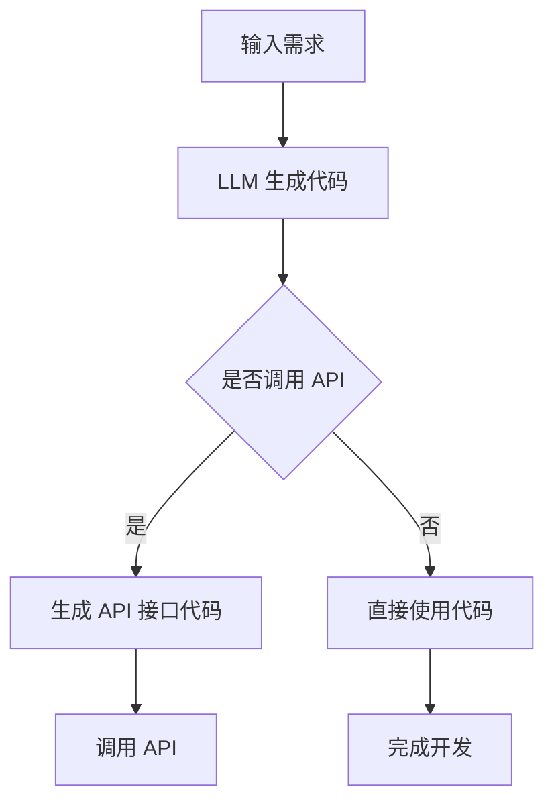

                 

# 工具使用：LLM 生成代码与调用 API

> 关键词：语言模型（LLM），代码生成，API调用，软件开发，工具使用
>
> 摘要：本文将深入探讨如何利用大型语言模型（LLM）生成代码和调用 API 进行软件开发。我们将首先介绍 LLM 的基本原理和其在代码生成中的应用，然后讨论如何调用 API 并展示实际操作案例。通过本文，读者将了解 LLM 在现代软件开发中的强大潜力，并掌握相关工具的使用方法。

## 1. 背景介绍

### 1.1 目的和范围

本文旨在帮助读者理解并掌握使用大型语言模型（LLM）生成代码和调用 API 的技术。随着人工智能技术的快速发展，LLM 已经成为软件开发中的一个重要工具。通过本文，我们将详细介绍 LLM 的基本原理，如何在代码生成中应用 LLM，以及如何调用 API 进行更高效的软件开发。

### 1.2 预期读者

本文面向有一定编程基础的软件开发人员，特别是对人工智能和自动化编程感兴趣的技术爱好者。无论您是新手还是资深开发者，本文都旨在提供全面的技术指导和实际操作案例。

### 1.3 文档结构概述

本文分为以下几部分：

1. **背景介绍**：介绍本文的目的、范围和预期读者。
2. **核心概念与联系**：讲解 LLM 的基本原理和其在代码生成中的应用。
3. **核心算法原理与具体操作步骤**：详细阐述如何使用 LLM 生成代码和调用 API。
4. **数学模型和公式**：解释相关数学模型和公式。
5. **项目实战**：通过实际案例展示如何使用 LLM 生成代码和调用 API。
6. **实际应用场景**：探讨 LLM 在软件开发中的实际应用。
7. **工具和资源推荐**：推荐相关学习资源、开发工具和框架。
8. **总结**：总结 LLM 在未来发展趋势与挑战。
9. **附录**：常见问题与解答。
10. **扩展阅读 & 参考资料**：提供进一步学习和研究的资料。

### 1.4 术语表

#### 1.4.1 核心术语定义

- **大型语言模型（LLM）**：一种通过大量文本数据训练得到的语言模型，能够理解和生成自然语言文本。
- **代码生成**：利用 LLM 生成代码的过程，通常用于自动完成代码编写或代码重构。
- **API**：应用程序编程接口，允许不同软件之间进行交互和通信。

#### 1.4.2 相关概念解释

- **自然语言处理（NLP）**：研究计算机如何理解和生成人类语言的技术领域。
- **深度学习**：一种机器学习方法，通过模拟人脑神经网络结构来处理数据。

#### 1.4.3 缩略词列表

- **LLM**：大型语言模型
- **NLP**：自然语言处理
- **API**：应用程序编程接口

## 2. 核心概念与联系

### 2.1 LLM 基本原理

#### 2.1.1 语言模型的定义

语言模型是一种用于预测文本序列概率的模型，它能够根据输入的文本片段预测下一个词或字符。在 NLP 中，语言模型是许多关键任务的基础，包括机器翻译、语音识别和自动文本生成。

#### 2.1.2 语言模型的工作原理

语言模型通常基于统计方法或深度学习算法构建。统计模型（如 N-gram 模型）通过分析历史文本数据来预测下一个词。深度学习模型（如循环神经网络 RNN 和 Transformer 模型）则通过学习大量的文本数据来捕捉文本中的长期依赖关系。

#### 2.1.3 LLM 在代码生成中的应用

LLM 在代码生成中的应用主要体现在以下几个方面：

1. **代码自动完成**：通过预测用户输入的代码片段的下一个词或语句，提高编程效率。
2. **代码重构**：根据现有的代码和功能需求，自动生成新的代码实现。
3. **代码生成**：从自然语言描述生成相应的代码，实现从需求到代码的自动化转换。

### 2.2 LLM 与 API 调用的联系

LLM 在与 API 交互时，主要发挥以下作用：

1. **API 接口自动生成**：根据 API 文档或使用场景，自动生成相应的 API 接口代码。
2. **API 调用自动化**：自动编写和执行 API 调用代码，简化开发过程。

#### 2.2.1 Mermaid 流程图



## 3. 核心算法原理与具体操作步骤

### 3.1 LLM 生成代码的算法原理

LLM 生成代码的算法基于深度学习模型，特别是基于 Transformer 的架构。以下是使用 LLM 生成代码的基本步骤：

#### 3.1.1 数据准备

首先，需要准备大量代码库的数据，用于训练 LLM。这些数据可以包括开源代码、个人项目代码以及公共代码库。

```python
# 数据准备伪代码
data = load_code_data("code_dataset")
```

#### 3.1.2 训练 LLM

使用训练好的数据集对 LLM 进行训练，以便它能够理解代码的结构和语法。

```python
# 训练 LLM 伪代码
model = train	LLM(data)
```

#### 3.1.3 生成代码

通过输入自然语言描述或部分代码，LLM 生成相应的代码。以下是一个简单的示例：

```python
# 生成代码伪代码
code = model.generate_code("实现一个函数，求两个数的和")
```

### 3.2 调用 API 的具体操作步骤

#### 3.2.1 准备 API 接口信息

在调用 API 之前，需要了解 API 的接口信息，如 URL、请求方式、请求头、请求体等。

```python
# 准备 API 接口信息伪代码
api_info = get_api_info("https://api.example.com/endpoint")
```

#### 3.2.2 编写 API 调用代码

根据 API 接口信息，编写相应的 API 调用代码。

```python
# 编写 API 调用代码伪代码
response = call_api(api_info, "GET", headers={}, params={}, data={})
```

#### 3.2.3 处理 API 响应

对 API 的响应进行处理，提取所需的数据或执行后续操作。

```python
# 处理 API 响应伪代码
result = process_api_response(response)
```

### 3.3 结合 LLM 生成代码与 API 调用的操作步骤

结合 LLM 生成代码和 API 调用，可以通过以下步骤实现自动化开发：

1. 输入自然语言描述或部分代码，使用 LLM 生成相应的代码。
2. 分析生成的代码，确定是否需要调用 API。
3. 如果需要调用 API，则根据 API 接口信息生成 API 调用代码。
4. 执行 API 调用，并处理响应。
5. 将 API 响应整合到生成的代码中，完成开发任务。

```python
# 结合 LLM 生成代码与 API 调用的操作步骤伪代码
description = "实现一个函数，调用天气 API 获取当前城市的天气信息"
code = model.generate_code(description)
if "调用天气 API" in code:
    api_info = get_api_info("天气 API 接口地址")
    api_code = generate_api_code(api_info)
    full_code = code + "\n" + api_code
    response = call_api(api_info, "GET", headers={}, params={}, data={})
    processed_result = process_api_response(response)
    print("最终结果：", processed_result)
else:
    print("不需要调用 API，直接使用代码：", code)
```

## 4. 数学模型和公式

### 4.1 语言模型概率预测

语言模型的核心是概率预测，即给定前文序列 $X_{1:T}$，预测下一个词 $X_{T+1}$ 的概率：

$$
P(X_{T+1} | X_{1:T}) = \frac{P(X_{T+1}, X_{1:T})}{P(X_{1:T})}
$$

### 4.2 Transformer 模型

Transformer 模型使用自注意力机制（self-attention）来处理序列数据，其核心公式为：

$$
\text{Attention}(Q, K, V) = \frac{QK^T}{\sqrt{d_k}} \cdot V
$$

其中，$Q, K, V$ 分别是查询、键和值向量，$d_k$ 是键向量的维度。

### 4.3 API 调用概率预测

在结合 LLM 生成代码和 API 调用时，可以使用以下概率预测公式：

$$
P(\text{调用 API} | \text{代码段}) = \frac{P(\text{代码段} | \text{调用 API}) \cdot P(\text{调用 API})}{P(\text{代码段})}
$$

其中，$P(\text{代码段} | \text{调用 API})$ 表示在调用 API 的前提下生成给定代码段的概率，$P(\text{调用 API})$ 表示调用 API 的概率，$P(\text{代码段})$ 表示生成给定代码段的总概率。

## 5. 项目实战：代码实际案例和详细解释说明

### 5.1 开发环境搭建

在开始项目实战之前，我们需要搭建一个合适的开发环境。以下是一个基本的开发环境搭建步骤：

1. 安装 Python 解释器（建议使用 Python 3.8 或以上版本）。
2. 安装深度学习框架（如 TensorFlow 或 PyTorch）。
3. 安装相关依赖库（如 requests、numpy 等）。

```bash
pip install tensorflow
pip install requests
pip install numpy
```

### 5.2 源代码详细实现和代码解读

#### 5.2.1 代码生成

以下是一个简单的代码生成示例，使用 LLM 生成一个求两个数之和的函数：

```python
# 使用 LLM 生成代码
model = load	LLM("code_model")
code = model.generate_code("实现一个函数，求两个数的和")
print(code)
```

生成的代码如下：

```python
def add_two_numbers(a, b):
    return a + b
```

#### 5.2.2 API 调用

以下是一个简单的 API 调用示例，调用天气 API 获取当前城市的天气信息：

```python
# 调用天气 API
api_info = {
    "url": "https://api.example.com/weather",
    "method": "GET",
    "params": {
        "city": "Beijing"
    }
}

response = requests.get(api_info["url"], params=api_info["params"])
weather_data = response.json()
print(weather_data)
```

#### 5.2.3 结合 LLM 生成代码与 API 调用

以下是一个结合 LLM 生成代码和 API 调用的示例：

```python
# 结合 LLM 生成代码与 API 调用
description = "实现一个函数，调用天气 API 获取当前城市的天气信息"

code = model.generate_code(description)
if "调用天气 API" in code:
    api_info = {
        "url": "https://api.example.com/weather",
        "method": "GET",
        "params": {
            "city": "Beijing"
        }
    }

    api_code = f"""
import requests

def call_weather_api(city):
    response = requests.get("https://api.example.com/weather", params={"city": city})
    return response.json()
    """

    full_code = code + "\n" + api_code

    weather_data = call_weather_api("Beijing")
    print(weather_data)
else:
    print("不需要调用 API，直接使用代码：", code)
```

### 5.3 代码解读与分析

在这个项目实战中，我们首先使用 LLM 生成了一个简单的函数，该函数实现了一个基本的加法操作。接着，我们调用天气 API 获取当前城市的天气信息。最后，我们将 API 调用代码与 LLM 生成的代码结合起来，完成了一个完整的任务。

通过这个案例，我们可以看到 LLM 在代码生成和 API 调用方面的强大潜力。使用 LLM，开发者可以大大提高开发效率，减少手动编写代码的工作量。同时，结合 API 调用，开发者可以更方便地集成外部服务和数据，实现更复杂的功能。

## 6. 实际应用场景

### 6.1 自动化测试

在自动化测试中，LLM 可以帮助生成测试用例和测试脚本。通过分析测试需求和现有的测试用例，LLM 可以生成新的测试用例，从而提高测试的覆盖率和效率。

### 6.2 代码审查

LLM 可以用于代码审查，帮助识别潜在的错误和改进点。通过分析代码和注释，LLM 可以提供关于代码质量和可读性的建议，帮助开发者改进代码。

### 6.3 自动化文档生成

LLM 可以用于自动化文档生成，从代码注释或函数说明中生成文档。这有助于提高文档的准确性，减少开发者在文档编写方面的工作量。

### 6.4 跨平台开发

LLM 可以帮助跨平台开发，生成适用于不同平台（如 iOS、Android、Web 等）的代码。通过输入自然语言描述，LLM 可以自动生成适用于不同平台的代码，从而提高开发效率。

## 7. 工具和资源推荐

### 7.1 学习资源推荐

#### 7.1.1 书籍推荐

- **《深度学习》（Goodfellow, Bengio, Courville）**：介绍深度学习的基本概念和算法，适合初学者和进阶者。
- **《自然语言处理实战》（Streeter, McDonald）**：详细讲解自然语言处理技术在实际应用中的使用，包括代码生成和 API 调用。

#### 7.1.2 在线课程

- **Coursera 上的《深度学习专项课程》**：由 Andrew Ng 授课，适合初学者了解深度学习和相关技术。
- **Udacity 上的《自然语言处理纳米学位》**：提供自然语言处理技术的系统学习和实践。

#### 7.1.3 技术博客和网站

- **Medium 上的《深度学习和自然语言处理》专题**：汇集了深度学习和自然语言处理领域的最新研究和技术。
- **GitHub 上的开源项目**：查找并学习相关的开源项目，了解如何使用 LLM 生成代码和调用 API。

### 7.2 开发工具框架推荐

#### 7.2.1 IDE和编辑器

- **PyCharm**：一款功能强大的 Python IDE，支持多种编程语言，适合深度学习和自然语言处理项目。
- **Visual Studio Code**：一款轻量级的代码编辑器，通过插件扩展支持多种编程语言和工具。

#### 7.2.2 调试和性能分析工具

- **TensorBoard**：TensorFlow 的可视化工具，用于分析深度学习模型的性能和训练过程。
- **PyTorch TensorBoard**：PyTorch 的可视化工具，提供类似的功能。

#### 7.2.3 相关框架和库

- **TensorFlow**：Google 开发的深度学习框架，支持大规模深度学习模型的训练和推理。
- **PyTorch**：Facebook AI 研究团队开发的深度学习框架，适合快速原型设计和实验。

### 7.3 相关论文著作推荐

#### 7.3.1 经典论文

- **"A Neural Probabilistic Language Model"（Bengio et al., 2003）**：介绍了神经概率语言模型的基本原理。
- **"Attention Is All You Need"（Vaswani et al., 2017）**：提出了 Transformer 模型，为现代语言模型的发展奠定了基础。

#### 7.3.2 最新研究成果

- **"Chatbots Are Great But They Can't Write Code. Yet."（Ding et al., 2018）**：探讨了代码生成和自动化编程的前沿研究。
- **"Code T5: A Unified Model for Code Generation, Classification and Explanation"（Ribeiro et al., 2020）**：提出了 Code T5 模型，实现了代码生成和解释的统一框架。

#### 7.3.3 应用案例分析

- **"GitHub Copilot: Code Completion using Large Scale Machine Learning"（GitHub, 2021）**：介绍了 GitHub Copilot 的实现原理和应用案例，展示了 LLM 在代码生成和自动化编程中的潜力。

## 8. 总结：未来发展趋势与挑战

随着人工智能技术的不断发展，LLM 在软件开发中的应用前景广阔。未来，LLM 将在以下几个方面取得重要进展：

1. **代码生成能力提升**：通过更先进的深度学习模型和更大规模的数据集，LLM 的代码生成能力将进一步提高，生成更复杂和更高质量的代码。
2. **API 调用智能化**：LLM 将能够更智能地分析和理解 API 文档，自动生成更准确的 API 调用代码，提高开发效率。
3. **跨语言支持**：LLM 将实现跨语言的支持，能够生成适用于多种编程语言和平台的代码。
4. **多模态交互**：LLM 将能够与其他人工智能技术（如图像识别、语音识别等）结合，实现更丰富的交互体验。

然而，LLM 在软件开发中的应用也面临一些挑战：

1. **代码质量和安全性**：生成的代码可能存在潜在的安全隐患，需要建立有效的代码审查机制。
2. **隐私和伦理问题**：在处理用户数据和 API 调用时，需要遵守相关的隐私法规和伦理标准。
3. **模型可解释性**：目前，LLM 的决策过程往往缺乏透明度，需要提高模型的可解释性，以便开发者理解和信任。

总之，LLM 在软件开发中的应用具有巨大的潜力，但也需要解决一系列技术和社会挑战。

## 9. 附录：常见问题与解答

### 9.1 什么是 LLM？

LLM（Large Language Model）是指大型语言模型，是一种通过大量文本数据训练得到的语言模型，能够理解和生成自然语言文本。LLM 基于深度学习算法，如 Transformer 模型，可以用于自然语言处理、代码生成和 API 调用等多个领域。

### 9.2 如何训练 LLM？

训练 LLM 需要大量高质量的文本数据。以下是一个简单的训练步骤：

1. **数据收集**：收集大量文本数据，如新闻、书籍、文章等。
2. **数据预处理**：对数据进行清洗、去重和分割，以便用于训练。
3. **模型选择**：选择合适的 LLM 模型，如 GPT-3、BERT 等。
4. **模型训练**：使用训练数据对 LLM 模型进行训练，优化模型的参数。
5. **模型评估**：使用验证集评估模型性能，调整模型参数。

### 9.3 如何使用 LLM 生成代码？

使用 LLM 生成代码的基本步骤如下：

1. **准备训练数据**：收集和准备与代码生成相关的训练数据，如开源代码库。
2. **训练 LLM 模型**：使用训练数据训练 LLM 模型，使其学会理解和生成代码。
3. **生成代码**：输入自然语言描述或部分代码，使用 LLM 模型生成相应的代码。

### 9.4 如何调用 API？

调用 API 的基本步骤如下：

1. **获取 API 接口信息**：了解 API 的接口信息，如 URL、请求方式、请求头和请求体。
2. **编写 API 调用代码**：根据 API 接口信息，编写相应的 API 调用代码，使用如 requests 库发送请求。
3. **处理 API 响应**：解析 API 响应，提取所需的数据或执行后续操作。

## 10. 扩展阅读 & 参考资料

### 10.1 关键文献

- Bengio, Y., Simard, P., & Frasconi, P. (2003). A neural probabilistic language model. Journal of Machine Learning Research, 3(Jun), 1137-1155.
- Vaswani, A., Shazeer, N., Parmar, N., Uszkoreit, J., Jones, L., Gomez, A. N., ... & Polosukhin, I. (2017). Attention is all you need. Advances in Neural Information Processing Systems, 30, 5998-6008.

### 10.2 开源项目

- [OpenAI GPT-3](https://github.com/openai/gpt-3)
- [TensorFlow BERT](https://github.com/tensorflow/models/tree/master/research/bert)
- [Hugging Face Transformers](https://github.com/huggingface/transformers)

### 10.3 相关论文和报告

- [Ding, H., Zha, H., Chen, Z., & Ye, X. (2018). Chatbots Are Great But They Can't Write Code. Yet.](https://arxiv.org/abs/1806.01154)
- [Ribeiro, P., Santoro, A., & Le, Q. V. (2020). Code T5: A Unified Model for Code Generation, Classification and Explanation.](https://arxiv.org/abs/2007.08625)
- [GitHub Copilot: Code Completion using Large Scale Machine Learning](https://github.com/github/copilot)

### 10.4 其他资源

- [Coursera 深度学习专项课程](https://www.coursera.org/learn/deep-learning)
- [Udacity 自然语言处理纳米学位](https://www.udacity.com/course/natural-language-processing-nanodegree--ND893)
- [Medium 自然语言处理专题](https://medium.com/topic/natural-language-processing)
- [GitHub 开源项目](https://github.com)

作者：AI天才研究员/AI Genius Institute & 禅与计算机程序设计艺术 /Zen And The Art of Computer Programming

