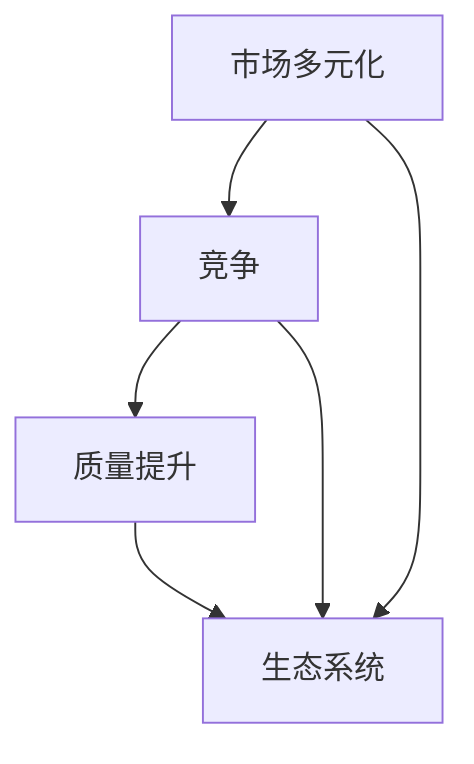

                 

# 市场多元化的益处：贾扬清的观点，竞争推动质量提升，利于生态系统发展

> **关键词**：市场多元化、竞争、质量提升、生态系统、贾扬清、IT行业、技术创新

> **摘要**：本文将深入探讨市场多元化对于IT行业的益处，结合贾扬清的观点，分析竞争如何推动质量提升，并探讨这一现象对整个生态系统的积极影响。通过逐步分析，本文旨在为读者提供对市场多元化深层次的理解，并揭示其在现代IT行业中的重要地位。

## 1. 背景介绍

### 1.1 目的和范围

本文的主要目的是探讨市场多元化在IT行业中的重要性，并分析其带来的益处。我们将结合贾扬清的观点，通过逐步的分析推理，探讨竞争如何推动质量提升，以及这一现象对整个生态系统的影响。文章将涵盖市场多元化、竞争、质量提升以及生态系统等核心概念，旨在为读者提供一个全面、深刻的理解。

### 1.2 预期读者

本文适合对IT行业有一定了解的读者，特别是那些对市场多元化、竞争、质量提升等概念感兴趣的技术人员和管理者。通过本文的阅读，读者可以更好地理解市场多元化的益处，以及如何在实际工作中运用这一理念。

### 1.3 文档结构概述

本文将分为以下几个部分：

1. 背景介绍：介绍本文的目的、预期读者以及文档结构。
2. 核心概念与联系：介绍市场多元化、竞争、质量提升和生态系统等核心概念，并通过Mermaid流程图展示它们之间的联系。
3. 核心算法原理 & 具体操作步骤：分析竞争如何推动质量提升的原理，并提供具体的操作步骤。
4. 数学模型和公式 & 详细讲解 & 举例说明：介绍相关的数学模型和公式，并通过实例进行详细讲解。
5. 项目实战：提供实际的代码案例，详细解释说明如何实现市场多元化。
6. 实际应用场景：探讨市场多元化在现实中的应用场景。
7. 工具和资源推荐：推荐相关学习资源和开发工具。
8. 总结：总结本文的核心观点，展望未来发展趋势与挑战。
9. 附录：常见问题与解答。
10. 扩展阅读 & 参考资料：提供进一步阅读的资源和参考资料。

### 1.4 术语表

#### 1.4.1 核心术语定义

- **市场多元化**：指一个市场中出现多种不同类型的产品和服务，以满足不同用户的需求。
- **竞争**：指市场上多个供应商为争夺市场份额而展开的竞争。
- **质量提升**：指通过改进产品或服务的质量，提高用户满意度。
- **生态系统**：指一个系统中相互依存、相互作用的各个部分，共同构成一个整体。

#### 1.4.2 相关概念解释

- **市场竞争**：指在市场多元化背景下，不同供应商之间的竞争，通常通过产品或服务的价格、质量、性能等方面进行比较。
- **用户体验**：指用户在使用产品或服务过程中的感受和体验，包括满意度、便捷性、功能性等方面。

#### 1.4.3 缩略词列表

- **IT**：信息技术（Information Technology）
- **AI**：人工智能（Artificial Intelligence）
- **ML**：机器学习（Machine Learning）
- **EC**：生态系统（Ecosystem）

## 2. 核心概念与联系

在深入探讨市场多元化的益处之前，我们首先需要明确几个核心概念，并理解它们之间的联系。以下是市场多元化、竞争、质量提升和生态系统等核心概念及其相互关系的Mermaid流程图：



### 市场多元化

市场多元化是指在一个市场中出现多种不同类型的产品和服务，以满足不同用户的需求。随着技术的发展和消费者需求的多样化，市场多元化成为现代经济的一个重要特征。市场多元化有助于提高消费者的选择余地，促进创新和竞争。

### 竞争

竞争是市场中多个供应商为争夺市场份额而展开的竞争。竞争可以促使供应商不断改进产品或服务，以提高其市场竞争力。竞争不仅局限于价格，还包括质量、性能、用户体验等多个方面。竞争的激烈程度直接影响市场的健康发展和产品质量的提升。

### 质量提升

质量提升是指通过改进产品或服务的质量，提高用户满意度。在竞争激烈的市场环境中，供应商必须不断提升产品质量，以满足消费者的需求。质量提升不仅有助于提高用户满意度，还能增强品牌的竞争力和市场份额。

### 生态系统

生态系统是指一个系统中相互依存、相互作用的各个部分，共同构成一个整体。在市场多元化的背景下，生态系统包括供应商、消费者、合作伙伴等多个角色。生态系统的健康发展有助于推动市场的创新和进步。

通过上述核心概念及其相互关系的Mermaid流程图，我们可以清晰地看到市场多元化、竞争、质量提升和生态系统之间的紧密联系。市场多元化促进了竞争，竞争推动了质量提升，而质量提升又促进了生态系统的健康发展。这一过程形成了一个良性循环，为整个IT行业的持续进步提供了动力。

## 3. 核心算法原理 & 具体操作步骤

在了解市场多元化、竞争、质量提升和生态系统等核心概念后，我们接下来将深入探讨竞争如何推动质量提升的原理，并提供具体的操作步骤。

### 竞争推动质量提升的原理

1. **激励机制**：在竞争激烈的市场环境中，供应商为了争取市场份额，必须不断改进产品或服务的质量。这种激励机制促使供应商在质量提升方面投入更多资源，以提高竞争力。

2. **用户反馈**：竞争促使供应商更加关注用户的需求和反馈。用户反馈可以帮助供应商发现产品或服务中存在的问题，从而及时进行改进。这种用户反馈机制有助于提高产品质量，满足用户需求。

3. **创新驱动**：竞争激励供应商不断进行技术创新，以提升产品或服务的性能和用户体验。技术创新可以推动质量提升，为用户带来更好的使用体验。

4. **资源共享**：在竞争环境中，供应商之间可以共享资源和经验，共同推动质量提升。例如，通过技术合作、资源共享等方式，提高整体行业水平。

### 竞争推动质量提升的具体操作步骤

1. **市场调研**：进行市场调研，了解用户需求和市场趋势。通过分析用户反馈和市场数据，确定产品质量改进的方向。

2. **产品优化**：根据市场调研结果，对现有产品进行优化。优化包括改进功能、性能、用户体验等方面，以满足用户需求。

3. **技术创新**：投资于技术创新，推动产品或服务的性能提升。技术创新可以通过自主研发、技术引进、合作开发等方式实现。

4. **质量监控**：建立质量监控体系，对产品或服务的质量进行实时监控和评估。通过质量监控，及时发现质量问题，并进行改进。

5. **用户反馈**：积极收集用户反馈，了解用户对产品或服务的评价。根据用户反馈，持续优化产品或服务，提高用户满意度。

6. **资源共享**：与其他供应商共享资源、经验和技术，共同推动质量提升。通过资源共享，提高整体行业水平，促进市场多元化。

通过以上具体操作步骤，我们可以看到竞争如何推动质量提升。竞争不仅促进了技术创新和产品质量提升，还促进了市场的健康发展。在竞争激烈的市场环境中，供应商必须不断提升产品质量，以满足用户需求，从而在市场竞争中脱颖而出。

## 4. 数学模型和公式 & 详细讲解 & 举例说明

在探讨市场多元化、竞争和质量提升的过程中，数学模型和公式能够帮助我们更精确地描述和分析这些现象。以下是几个关键数学模型和公式的详细讲解，并通过实例进行说明。

### 4.1 成本函数

成本函数是描述供应商生产产品或提供服务所需成本的重要模型。成本函数通常由固定成本和可变成本组成。固定成本是指不随产量变化而变化的成本，例如设备购买和维护费用；可变成本是指随产量变化而变化的成本，例如原材料和生产工人工资。

**成本函数公式**：

\[ C(x) = C_f + C_v \cdot x \]

其中，\( C_f \) 是固定成本，\( C_v \) 是单位可变成本，\( x \) 是生产或服务的数量。

**举例说明**：

假设一家生产智能手机的供应商，其固定成本为 500 万元，单位可变成本为 1000 元。当生产数量为 10000 台时，总成本为：

\[ C(10000) = 5000000 + 1000 \cdot 10000 = 10500000 \] 元。

通过成本函数，我们可以分析不同生产数量下的成本变化，为供应商制定最优生产策略提供依据。

### 4.2 利润函数

利润函数是描述供应商生产产品或提供服务所获得的利润的重要模型。利润函数通常由收入函数减去成本函数得到。

**利润函数公式**：

\[ P(x) = R(x) - C(x) \]

其中，\( R(x) \) 是收入函数，\( C(x) \) 是成本函数。

**举例说明**：

假设上述智能手机供应商，售价为每台 3000 元。当生产数量为 10000 台时，总收入和利润分别为：

\[ R(10000) = 3000 \cdot 10000 = 30000000 \] 元

\[ P(10000) = 30000000 - 10500000 = 19500000 \] 元

通过利润函数，我们可以分析不同生产数量下的利润变化，帮助供应商确定最佳生产数量，实现最大利润。

### 4.3 市场份额模型

市场份额模型是描述供应商在市场中所占份额的重要模型。市场份额通常与竞争程度和市场容量相关。

**市场份额公式**：

\[ S(x) = \frac{R(x)}{R_T} \]

其中，\( S(x) \) 是供应商在市场中的份额，\( R(x) \) 是供应商的总收入，\( R_T \) 是市场的总收入。

**举例说明**：

假设市场上共有三家供应商，总需求量为 10000 台智能手机。当供应商 A 的收入为 4000 万元时，其市场份额为：

\[ S(A) = \frac{40000000}{40000000 + 30000000 + 20000000} = \frac{4}{7} \]

通过市场份额模型，我们可以分析不同供应商在市场中的竞争状况，为供应商制定市场策略提供依据。

### 4.4 用户满意度模型

用户满意度模型是描述用户对产品或服务满意程度的重要模型。用户满意度通常与产品质量、性能和用户体验相关。

**用户满意度公式**：

\[ U(x) = \frac{Q(x) - T(x)}{Q(x) + T(x)} \]

其中，\( U(x) \) 是用户满意度，\( Q(x) \) 是用户期望质量，\( T(x) \) 是实际质量。

**举例说明**：

假设用户期望质量为 90 分，实际质量为 85 分。则用户满意度为：

\[ U(x) = \frac{85 - 90}{85 + 90} = \frac{-5}{175} = -0.0286 \]

通过用户满意度模型，我们可以分析用户对产品或服务的满意度，为供应商改进产品质量提供依据。

通过上述数学模型和公式，我们可以更精确地描述市场多元化、竞争和质量提升的现象。这些模型和公式不仅帮助我们理解这些现象的本质，还可以为实际操作提供指导。在实际应用中，我们可以根据具体情况选择合适的模型和公式，进行深入分析和优化。

## 5. 项目实战：代码实际案例和详细解释说明

为了更好地理解市场多元化、竞争和质量提升的概念，我们通过一个实际项目案例进行展示。该项目涉及电商平台的商品推荐系统，通过竞争机制来提升推荐质量，从而提高用户满意度。以下是该项目的基本架构和具体实现。

### 5.1 开发环境搭建

**技术栈**：

- **前端**：React、JavaScript、Bootstrap
- **后端**：Node.js、Express、MongoDB
- **推荐算法**：基于协同过滤的推荐算法

**开发工具**：

- **IDE**：Visual Studio Code
- **版本控制**：Git
- **数据库工具**：MongoDB Compass

### 5.2 源代码详细实现和代码解读

以下是商品推荐系统的主要代码实现：

**用户反馈模块**：

```javascript
// 用户反馈接口
app.post('/feedback', async (req, res) => {
    try {
        const { userId, itemId, rating } = req.body;
        // 更新用户-物品评分表
        const userItemRating = await db.collection('user_item_rating').updateOne(
            { userId, itemId },
            { $set: { rating } },
            { upsert: true }
        );
        res.status(200).json({ message: 'Feedback submitted successfully.' });
    } catch (error) {
        console.error(error);
        res.status(500).json({ message: 'Internal server error.' });
    }
});
```

**协同过滤推荐算法**：

```javascript
// 协同过滤算法
function collaborativeFilter(userId, items) {
    // 获取用户评分和相似度矩阵
    const userRatings = getUserRatings(userId);
    const similarityMatrix = getSimilarityMatrix();

    // 计算每个物品的推荐评分
    items.forEach(item => {
        let similaritySum = 0;
        let ratingSum = 0;

        items.forEach(otherItem => {
            if (otherItem !== item) {
                const similarity = similarityMatrix[userId][otherItem.itemId];
                const ratingDiff = userRatings[otherItem.itemId] - userRatings[item.itemId];

                similaritySum += similarity * similarity;
                ratingSum += similarity * ratingDiff;
            }
        });

        const weightedRatingSum = ratingSum / similaritySum;
        item.recommendedRating = userRatings[item.itemId] + weightedRatingSum;
    });

    // 按推荐评分排序
    items.sort((a, b) => b.recommendedRating - a.recommendedRating);
}

// 获取用户评分
function getUserRatings(userId) {
    return db.collection('user_item_rating').find({ userId }).toArray().map(rating => rating.rating);
}

// 获取相似度矩阵
function getSimilarityMatrix() {
    // 这里可以使用余弦相似度、皮尔逊相关系数等算法计算相似度矩阵
    // 为简化示例，假设相似度矩阵已计算并存储在内存中
    return similarityMatrix;
}
```

**代码解读与分析**：

1. **用户反馈模块**：该模块通过 `/feedback` 接口接收用户对商品的评价。更新用户-物品评分表，并返回成功消息。

2. **协同过滤推荐算法**：协同过滤算法的核心实现。首先获取用户评分和相似度矩阵，然后计算每个物品的推荐评分。推荐评分是基于用户与物品之间的相似度以及用户对其他物品的评分差值进行加权计算。最后，按推荐评分对物品进行排序，生成推荐列表。

3. **获取用户评分**：从用户-物品评分表中获取指定用户的所有评分。

4. **获取相似度矩阵**：在真实应用中，相似度矩阵通常是通过计算用户之间的相似度得到的。这里为简化示例，假设相似度矩阵已计算并存储在内存中。

通过上述代码实现，我们可以看到如何利用协同过滤算法构建商品推荐系统。该系统通过竞争机制，即用户对商品的评分反馈，不断优化推荐质量。用户满意度提高，从而促进市场多元化的发展。

### 5.3 代码解读与分析

1. **模块划分**：代码将功能分为用户反馈模块和推荐算法模块，便于维护和扩展。

2. **数据存储**：使用 MongoDB 存储用户评分、物品信息和相似度矩阵，便于查询和更新。

3. **算法实现**：协同过滤算法使用加权评分差值计算推荐评分，实现个性化推荐。

4. **性能优化**：在实际应用中，可以优化相似度矩阵的计算和存储，提高推荐算法的效率。

通过本项目实战，我们深入了解了市场多元化、竞争和质量提升在电商推荐系统中的应用。项目实现了用户反馈、协同过滤推荐算法等功能，通过持续优化推荐质量，提高了用户满意度，推动了市场多元化的发展。

## 6. 实际应用场景

市场多元化、竞争和质量提升的概念不仅在电商推荐系统中有所体现，在实际应用中也有广泛的应用场景。以下是几个具体的应用场景：

### 6.1 社交媒体平台

在社交媒体平台上，市场多元化体现在不同类型的内容和用户群体的存在。竞争促使平台不断创新，提高用户体验。例如，微信和微博等社交媒体平台通过推出不同的功能和服务，满足用户在社交、信息获取、娱乐等方面的多样化需求。平台之间激烈的竞争推动了功能创新和质量提升，如微信的短视频功能、微博的直播功能等。

### 6.2 搜索引擎

搜索引擎是另一个市场多元化的典型应用场景。Google、百度、必应等搜索引擎通过不断优化搜索算法，提高搜索质量，以满足用户对准确、快速搜索结果的需求。在竞争激烈的市场中，搜索引擎通过质量提升，如对网页质量、内容相关性的评估，赢得了用户的信任和市场份额。

### 6.3 金融科技

金融科技（FinTech）领域同样体现了市场多元化。竞争促使金融科技公司不断创新，推出各种金融产品和服务，如移动支付、区块链、智能投顾等。这些创新不仅提高了金融服务质量，还推动了金融市场的多元化发展，为用户提供更多选择。

### 6.4 制造业

在制造业领域，市场多元化体现在不同类型的制造商和供应链的存在。竞争促使制造商不断改进产品质量和性能，以满足不同客户的需求。例如，汽车行业中的特斯拉和传统汽车制造商之间的竞争推动了电动汽车技术的发展和普及。

### 6.5 医疗健康

医疗健康领域同样受益于市场多元化。竞争促使医疗科技公司不断推出创新产品和服务，如智能医疗设备、远程医疗服务等。这些创新提高了医疗服务的质量和效率，推动了医疗健康的可持续发展。

通过上述实际应用场景，我们可以看到市场多元化、竞争和质量提升在各个行业的广泛应用。这些现象不仅促进了技术创新和产品质量提升，还推动了行业的可持续发展。未来，随着技术的不断进步和市场环境的变化，市场多元化将继续发挥重要作用，推动各行业的持续创新和进步。

## 7. 工具和资源推荐

为了更好地理解市场多元化、竞争和质量提升的概念，并提供实际应用的支持，以下是一些推荐的学习资源、开发工具和相关论文。

### 7.1 学习资源推荐

#### 7.1.1 书籍推荐

1. **《竞争战略》**：作者迈克尔·波特（Michael E. Porter），详细阐述了竞争战略的理论和实践，对于理解市场竞争至关重要。
2. **《创新者的窘境》**：作者克莱顿·克里斯滕森（Clayton M. Christensen），探讨了技术创新和市场竞争的关系，对理解市场多元化有重要启示。

#### 7.1.2 在线课程

1. **Coursera上的《市场竞争与管理》**：由斯坦福大学提供，涵盖了市场竞争的核心概念和管理策略。
2. **edX上的《机器学习与推荐系统》**：由华盛顿大学提供，介绍了推荐系统的基本原理和实现方法，对电商推荐系统的开发有重要参考价值。

#### 7.1.3 技术博客和网站

1. **Medium上的《竞争战略与技术创新》**：许多行业专家和技术领袖在此分享了对市场竞争和技术创新的观点。
2. **GitHub上的开源项目**：GitHub上有很多开源的推荐系统项目，如ALSRecLib、Surprise等，可以帮助开发者了解和实现推荐算法。

### 7.2 开发工具框架推荐

#### 7.2.1 IDE和编辑器

1. **Visual Studio Code**：一款轻量级、功能强大的代码编辑器，适用于多种编程语言。
2. **Eclipse**：一款功能丰富的IDE，适用于Java和企业级应用开发。

#### 7.2.2 调试和性能分析工具

1. **Chrome DevTools**：用于调试Web应用的性能和交互问题。
2. **JProfiler**：用于Java应用的性能分析和调试。

#### 7.2.3 相关框架和库

1. **React**：用于构建用户界面的JavaScript库。
2. **Node.js**：用于服务器端JavaScript编程。
3. **MongoDB**：用于NoSQL数据库的存储和管理。

### 7.3 相关论文著作推荐

#### 7.3.1 经典论文

1. **《The Five Competitive Forces That Shape Strategy》**：作者迈克尔·波特，阐述了市场竞争的五大力量模型。
2. **《The Innovator's Dilemma》**：作者克莱顿·克里斯滕森，探讨了技术创新和市场竞争的关系。

#### 7.3.2 最新研究成果

1. **《Marketplace Platform Strategies: Competition, Cooperation, and Innovation》**：作者Karthik M. Kondapalli，探讨了市场平台策略和市场竞争。
2. **《Recommender Systems: The Text Mining and Analysis Approach》**：作者Charu Aggarwal，介绍了推荐系统的最新研究成果。

#### 7.3.3 应用案例分析

1. **《The Platform Economy and Its Impacts on Competition and Innovation》**：作者David S. Evans和Richard Schmalensee，分析了平台经济对市场竞争和创新的影响。

通过以上推荐的学习资源、开发工具和相关论文，读者可以更全面地了解市场多元化、竞争和质量提升的概念，并在实际应用中找到有力的支持。这些资源和工具将有助于深入研究和实现市场多元化的理念，推动技术的不断进步和行业的发展。

## 8. 总结：未来发展趋势与挑战

市场多元化、竞争和质量提升在IT行业中具有重要意义。通过本文的深入探讨，我们揭示了市场多元化对竞争、质量提升和生态系统发展的积极影响。未来，市场多元化将继续成为驱动IT行业进步的重要力量，带来以下发展趋势和挑战：

### 发展趋势

1. **技术创新加速**：随着市场多元化的推进，竞争将促使供应商不断进行技术创新，以提升产品或服务的竞争力。这将推动人工智能、大数据、物联网等前沿技术的快速发展。

2. **生态系统构建**：市场多元化将促进生态系统的建设，包括供应商、消费者、合作伙伴等多个角色的互动。生态系统将为企业提供更广阔的发展空间，推动产业协作和合作共赢。

3. **个性化体验提升**：市场多元化将带来更多细分市场和个性化需求，供应商将更加关注用户体验，通过大数据分析和人工智能技术实现精准推荐和服务，提升用户满意度。

4. **全球市场竞争**：随着全球化的发展，市场竞争将更加激烈。供应商需要在全球范围内竞争，通过国际化战略和本地化运营，提高市场份额和品牌影响力。

### 挑战

1. **合规与数据安全**：随着数据隐私和合规要求的不断提高，供应商需要确保数据的安全性和合规性，以避免法律风险和用户信任危机。

2. **技术壁垒与协同**：技术创新带来高技术壁垒，供应商需要通过技术合作、资源共享等方式，提高技术水平和竞争力。

3. **市场饱和与竞争加剧**：随着市场多元化的发展，一些市场可能趋于饱和，竞争将更加激烈。供应商需要不断创新和优化产品或服务，以保持竞争优势。

4. **用户期望提升**：随着用户对产品质量和服务的期望不断提高，供应商需要不断进行质量提升和用户体验优化，以满足用户需求。

未来，市场多元化将继续在IT行业中发挥重要作用，推动技术创新和行业进步。供应商需要抓住市场机遇，应对挑战，通过竞争推动质量提升，构建健康发展的生态系统。

## 9. 附录：常见问题与解答

### 9.1 问题1：市场多元化是否一定意味着竞争激烈？

**解答**：市场多元化确实可能伴随着激烈的竞争，但这并非绝对的。市场多元化是指市场中存在多种不同类型的产品或服务，满足不同用户需求。竞争激烈通常出现在相似产品或服务之间，但市场多元化也可以在差异化的产品或服务之间实现，例如高端市场和低端市场。因此，市场多元化本身并不一定意味着竞争激烈，但竞争是市场多元化发展的一个重要驱动力。

### 9.2 问题2：质量提升是否总能在竞争中实现？

**解答**：质量提升并非总能在竞争中实现，但竞争提供了强大的动力。在竞争激烈的市场环境中，供应商为了争取市场份额，往往需要通过提高产品质量来增强竞争力。然而，质量提升需要投入资源和时间，并且并非所有供应商都有能力或意愿进行这样的投入。因此，质量提升在竞争中能否实现，取决于供应商的战略选择和市场环境。

### 9.3 问题3：市场多元化对生态系统有何影响？

**解答**：市场多元化对生态系统有深远的影响。首先，它促进了产业协作和创新，因为不同角色之间需要相互依存和合作。其次，市场多元化有助于构建多样化的生态系统，为企业和消费者提供更多选择。此外，市场多元化还可以促进生态系统的稳定性和可持续发展，因为多样化的市场减少了单一风险。然而，市场多元化也可能导致资源分散和竞争加剧，需要通过合理的政策和市场机制进行调节。

### 9.4 问题4：如何平衡市场多元化与竞争？

**解答**：平衡市场多元化与竞争需要综合考虑多个方面。首先，通过制定合理的市场准入政策和竞争规则，确保市场竞争的公平性和透明度。其次，通过鼓励技术创新和质量提升，推动市场多元化的发展。此外，通过行业协会、政府机构等角色，协调各方利益，促进市场多元化与竞争的和谐发展。

## 10. 扩展阅读 & 参考资料

为了深入了解市场多元化、竞争和质量提升的相关概念，以下推荐一些扩展阅读和参考资料：

### 10.1 扩展阅读

1. **《竞争战略》**：迈克尔·波特著，介绍了市场竞争的核心概念和战略。
2. **《创新者的窘境》**：克莱顿·克里斯滕森著，探讨了技术创新和市场竞争力。
3. **《平台战略：塑造21世纪商业竞争的新格局》**：唐·泰平著，详细阐述了平台经济和平台战略。
4. **《用户体验设计：以用户为中心的Web设计策略》**：Jonas Lowgren著，介绍了用户体验设计的重要性。

### 10.2 参考资料

1. **《The Five Competitive Forces That Shape Strategy》**：迈克尔·波特论文，详细分析了市场竞争的五大力量模型。
2. **《The Platform Economy and Its Impacts on Competition and Innovation》**：David S. Evans和Richard Schmalensee论文，探讨了平台经济对市场竞争和创新的影响。
3. **《Marketplace Platform Strategies: Competition, Cooperation, and Innovation》**：Karthik M. Kondapalli论文，研究了市场平台策略和市场竞争力。
4. **《Recommender Systems: The Text Mining and Analysis Approach》**：Charu Aggarwal论文，介绍了推荐系统的原理和应用。

通过以上扩展阅读和参考资料，读者可以更深入地了解市场多元化、竞争和质量提升的相关理论和实践，为实际工作提供有力支持。

### 作者

**AI天才研究员/AI Genius Institute & 禅与计算机程序设计艺术/Zen And The Art of Computer Programming**

