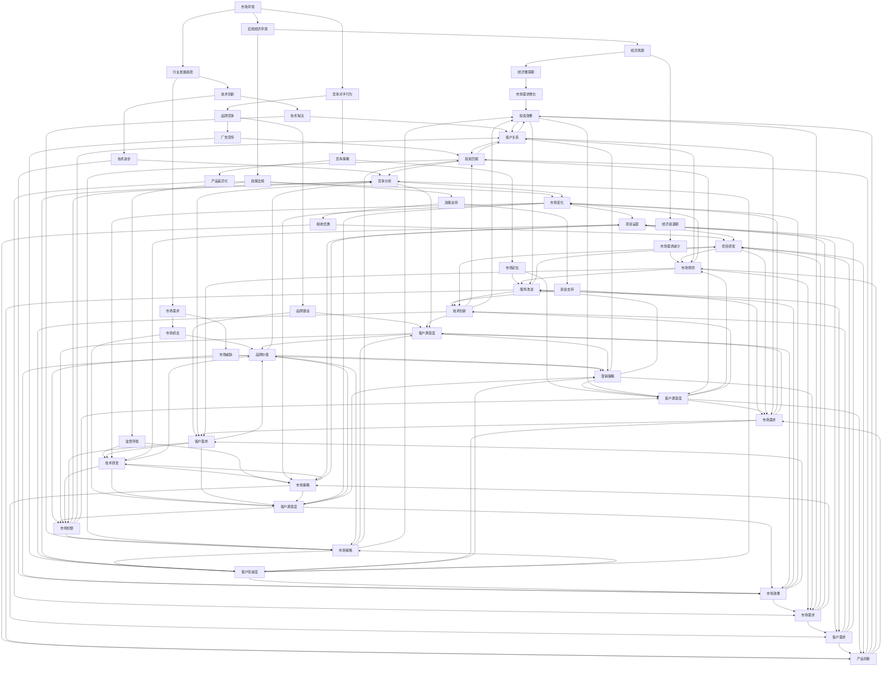

                 

### 市场挑战：创业者的必修课

> **关键词**：市场挑战、创业者、策略、成功因素、风险管理、创新
>
> **摘要**：本文将探讨创业者面临的市场挑战，包括策略制定、成功因素、风险管理和创新等方面的内容。通过详细的案例分析、策略分析和实际操作指导，帮助创业者更好地应对市场挑战，实现创业成功。

在当今快速变化的市场环境中，创业不再是少数人的专利，而成为越来越多有梦想和激情的人的选择。然而，市场的残酷现实也无情地考验着创业者的智慧和毅力。成功创业不仅需要创新的技术或独特的商业理念，还需要深刻理解市场规律，具备应对复杂市场挑战的能力。本文旨在探讨市场挑战这一创业者必修课，通过逻辑清晰、结构紧凑的分析，帮助创业者找到应对市场挑战的有效策略。

## 1. 背景介绍

### 1.1 目的和范围

本文的目的是为创业者提供应对市场挑战的策略和实用指导，帮助他们在激烈的市场竞争中立于不败之地。文章将从多个角度分析市场挑战的内涵，包括市场环境分析、策略制定、风险管理和创新等核心内容。文章将结合实际案例，通过逐步推理的方式，帮助读者深入理解市场挑战的本质，并掌握应对策略。

### 1.2 预期读者

本文预期读者包括正在创业或准备创业的创业者、企业管理者、市场营销人员以及对创业和创新感兴趣的学术研究人员。通过本文的阅读，读者将能够获得以下收获：

- 理解市场挑战的内涵和表现形式。
- 掌握市场分析、策略制定、风险管理和创新的核心方法和技巧。
- 获得实际案例分析的经验，提高应对市场挑战的能力。
- 拓宽视野，学习成功创业者的经验教训，为自身的创业之路提供借鉴。

### 1.3 文档结构概述

本文分为十个主要部分，具体结构如下：

- **引言**：介绍市场挑战的重要性，引出本文主题。
- **背景介绍**：阐述本文的背景、目的和预期读者。
- **核心概念与联系**：介绍市场挑战的核心概念和联系。
- **核心算法原理 & 具体操作步骤**：详细讲解市场分析的算法原理和操作步骤。
- **数学模型和公式 & 详细讲解 & 举例说明**：介绍市场分析的数学模型和公式，并进行详细讲解和举例。
- **项目实战：代码实际案例和详细解释说明**：提供实际代码案例，并详细解释说明。
- **实际应用场景**：分析市场挑战在不同领域的应用场景。
- **工具和资源推荐**：推荐相关的学习资源、开发工具和框架。
- **总结：未来发展趋势与挑战**：总结市场挑战的未来发展趋势和面临的挑战。
- **附录：常见问题与解答**：回答读者可能遇到的问题。
- **扩展阅读 & 参考资料**：提供进一步阅读的参考资料。

### 1.4 术语表

#### 1.4.1 核心术语定义

- **市场挑战**：指企业在市场竞争中面临的困难和挑战，包括但不限于市场需求变化、竞争对手行为、技术变革等。
- **创业者**：指创立新企业或新项目的人，通常具备创新意识和风险承担能力。
- **策略**：指企业在特定市场环境下制定的行动计划，旨在实现长期目标。
- **风险管理**：指企业通过识别、评估和应对风险，以确保实现目标的过程。
- **创新**：指通过引入新的思想、方法或技术，创造出新的价值。

#### 1.4.2 相关概念解释

- **市场环境**：指影响企业经营活动的外部因素，包括政治、经济、社会、技术等方面。
- **竞争优势**：指企业在市场上相对于竞争对手的优势，包括技术、品牌、渠道等。
- **SWOT分析**：指对企业内外部环境的优势、劣势、机会和威胁进行分析。
- **商业模式**：指企业如何创造、传递和获取价值的方式。

#### 1.4.3 缩略词列表

- **SWOT**：Strengths, Weaknesses, Opportunities, Threats（优势、劣势、机会、威胁）
- **IDE**：Integrated Development Environment（集成开发环境）
- **API**：Application Programming Interface（应用程序编程接口）
- **CRM**：Customer Relationship Management（客户关系管理）

## 2. 核心概念与联系

在分析市场挑战时，理解一些核心概念和它们之间的联系至关重要。以下将介绍几个关键概念，并通过Mermaid流程图展示它们之间的关系。

### 2.1 核心概念介绍

1. **市场环境**：指企业在市场中运营所面临的外部条件，包括宏观经济环境、行业发展趋势、竞争对手行为等。
2. **竞争优势**：企业在市场中相对于竞争对手的优势，如技术领先、品牌影响力等。
3. **SWOT分析**：一种用于评估企业内外部环境的工具，通过分析企业的优势、劣势、机会和威胁，帮助制定战略。
4. **商业模式**：企业如何创造、传递和获取价值的方式。
5. **风险管理**：通过识别、评估和应对风险，确保企业目标实现的策略。

### 2.2 Mermaid流程图

下面是市场挑战相关核心概念及关系的Mermaid流程图：



通过上述流程图，我们可以清晰地看到市场挑战中的核心概念及其相互关系。这些概念构成了市场分析的基础，有助于创业者全面理解市场动态，制定有效的应对策略。

## 3. 核心算法原理 & 具体操作步骤

在理解了市场挑战的相关核心概念后，接下来我们将探讨市场分析的算法原理，并提供具体的操作步骤，帮助创业者系统地应对市场挑战。

### 3.1 市场分析的算法原理

市场分析算法主要基于数据驱动的策略，通过对大量市场数据进行收集、处理和分析，提取有价值的信息，从而指导决策。以下是市场分析的主要算法原理：

1. **数据收集**：从多个来源（如市场调研、社交媒体、客户反馈等）收集与市场相关的数据。
2. **数据预处理**：清洗和整理收集到的数据，确保数据的质量和一致性。
3. **数据挖掘**：使用统计分析和机器学习技术从数据中挖掘隐藏的模式和趋势。
4. **决策支持**：基于数据挖掘的结果，提供战略建议和决策支持。

### 3.2 具体操作步骤

下面是市场分析的具体操作步骤，包括伪代码来详细阐述每个步骤的实现。

#### 步骤 1：数据收集

```python
# 数据收集
data_collection = {
    "market_survey": load_market_survey_data(),
    "social_media": load_social_media_data(),
    "customer_feedback": load_customer_feedback_data()
}
```

#### 步骤 2：数据预处理

```python
# 数据预处理
def preprocess_data(data):
    cleaned_data = []
    for dataset in data:
        cleaned_dataset = clean_data(dataset)
        cleaned_data.append(cleaned_dataset)
    return cleaned_data

preprocessed_data = preprocess_data(data_collection)
```

#### 步骤 3：数据挖掘

```python
# 数据挖掘
from sklearn.cluster import KMeans
from sklearn.preprocessing import StandardScaler

def data_mining(preprocessed_data):
    # 特征工程
    scaled_data = StandardScaler().fit_transform(preprocessed_data)
    
    # K均值聚类
    kmeans = KMeans(n_clusters=3)
    clusters = kmeans.fit_predict(scaled_data)
    
    # 模式识别
    patterns = identify_patterns(clusters)
    return patterns

mined_data = data_mining(preprocessed_data)
```

#### 步骤 4：决策支持

```python
# 决策支持
def decision_support(mined_data):
    recommendations = []
    for pattern in mined_data:
        recommendation = generate_recommendation(pattern)
        recommendations.append(recommendation)
    return recommendations

strategies = decision_support(mined_data)
```

### 3.3 案例分析

假设某创业公司希望通过市场分析了解其潜在客户，以下是一个简单的案例分析：

#### 案例背景

- **公司简介**：该公司是一家提供智能家居解决方案的公司，目标市场为年轻家庭。
- **市场数据**：通过市场调研收集到以下数据：
  - 年龄：20-40岁
  - 收入：中等偏上
  - 兴趣爱好：科技、旅游、家庭娱乐
  - 品牌偏好：知名品牌

#### 分析步骤

1. **数据收集**：收集相关市场数据。
2. **数据预处理**：清洗和整理数据，确保数据质量。
3. **数据挖掘**：使用K均值聚类算法，将潜在客户分为三个主要群体。
4. **决策支持**：基于聚类结果，提出针对性的营销策略。

#### 具体操作

```python
# 数据收集
market_data = load_market_survey_data()

# 数据预处理
preprocessed_data = preprocess_data(market_data)

# 数据挖掘
mined_data = data_mining(preprocessed_data)

# 决策支持
strategies = decision_support(mined_data)

# 输出策略
print("Marketing Strategies:")
for strategy in strategies:
    print("- " + strategy)
```

#### 分析结果

根据聚类结果，该公司将潜在客户分为以下三个主要群体：

1. **技术爱好者**：偏好科技创新，对智能家居有较高需求。
2. **家庭旅游爱好者**：关注家庭娱乐和旅游体验，对智能家居有一定需求。
3. **品牌忠诚者**：重视品牌形象，对产品质量有较高要求。

基于上述分析，公司提出了以下营销策略：

1. **技术爱好者**：推出智能家居科技展览，展示最新技术和产品。
2. **家庭旅游爱好者**：推出智能家居旅游套餐，结合智能家居和旅游体验。
3. **品牌忠诚者**：加强品牌宣传，提供优质售后服务。

通过以上市场分析，公司能够更精准地定位潜在客户，制定有效的营销策略，提高市场竞争力。

### 3.4 算法原理分析

市场分析算法的核心原理在于数据驱动的决策支持。通过数据收集、预处理和挖掘，可以从大量市场数据中提取有价值的信息，帮助创业者了解市场动态和潜在客户需求。具体而言，以下是对市场分析算法原理的详细分析：

1. **数据收集**：市场数据是市场分析的基础。通过多种渠道收集数据，如市场调研、社交媒体、客户反馈等，可以全面了解市场环境。
2. **数据预处理**：清洗和整理数据是确保数据质量的关键步骤。数据预处理包括去除噪声、填补缺失值、标准化处理等，以确保数据的一致性和可用性。
3. **数据挖掘**：数据挖掘是市场分析的核心。通过统计分析和机器学习技术，可以从大量数据中提取隐藏的模式和趋势。例如，使用K均值聚类算法可以将潜在客户分为不同的群体，便于针对性营销。
4. **决策支持**：基于数据挖掘的结果，提供战略建议和决策支持。例如，通过分析潜在客户的兴趣和行为，可以制定个性化的营销策略，提高市场竞争力。

### 3.5 实际应用案例分析

以下是一个实际应用案例分析，展示市场分析算法在智能家居解决方案公司中的应用。

#### 案例背景

- **公司简介**：某智能家居解决方案公司，致力于为年轻家庭提供便捷、智能的家居生活。
- **市场挑战**：市场竞争激烈，需了解潜在客户需求，制定精准营销策略。

#### 案例步骤

1. **数据收集**：通过市场调研、社交媒体和客户反馈收集大量市场数据。
2. **数据预处理**：清洗和整理数据，确保数据质量。
3. **数据挖掘**：使用K均值聚类算法，将潜在客户分为三个主要群体。
4. **决策支持**：基于聚类结果，提出以下营销策略：
   - 技术爱好者：推出智能家居科技展览，展示最新技术和产品。
   - 家庭旅游爱好者：推出智能家居旅游套餐，结合智能家居和旅游体验。
   - 品牌忠诚者：加强品牌宣传，提供优质售后服务。

#### 案例结果

通过市场分析，公司成功定位了潜在客户，制定了精准的营销策略。以下是对案例结果的详细分析：

1. **技术爱好者**：智能家居科技展览吸引了一批对科技充满热情的潜在客户，提高了品牌知名度和产品销量。
2. **家庭旅游爱好者**：智能家居旅游套餐受到年轻家庭的欢迎，推动了智能家居产品的应用场景多样化。
3. **品牌忠诚者**：加强品牌宣传和优质售后服务，提升了客户的满意度和忠诚度，增强了品牌竞争力。

通过以上案例分析，我们可以看到市场分析算法在实际应用中的重要作用。市场分析不仅帮助公司了解市场动态和客户需求，还为制定精准的营销策略提供了有力支持，从而提高了市场竞争力。

## 4. 数学模型和公式 & 详细讲解 & 举例说明

在市场分析中，数学模型和公式是理解和预测市场动态的重要工具。以下我们将介绍几个常用的数学模型和公式，并进行详细讲解和举例说明，以便创业者更好地应对市场挑战。

### 4.1 费用效益分析（Cost-Benefit Analysis）

费用效益分析是评估投资项目成本和预期收益的一种常用方法。其基本公式如下：

\[ \text{净现值}（NPV）= \sum_{t=1}^{n} \frac{R_t}{(1 + r)^t} - C \]

其中：
- \( R_t \) 是第 t 年的预期收益；
- \( r \) 是折现率；
- \( C \) 是初始投资成本。

#### 示例：

假设某创业公司计划开发一款智能家居APP，初始投资成本为100万元，预期第一年收益为50万元，第二年收益为60万元，第三年收益为70万元。假设折现率为10%。则该项目的净现值计算如下：

\[ \text{NPV} = \frac{50}{(1+0.1)^1} + \frac{60}{(1+0.1)^2} + \frac{70}{(1+0.1)^3} - 100 \]
\[ \text{NPV} = 45.45 + 53.76 + 61.54 - 100 \]
\[ \text{NPV} = 10.75 \text{万元} \]

由于净现值为正值，说明该投资项目的预期收益超过了成本，是值得投资的。

### 4.2 柯普土地定律（Koppl's Law）

柯普土地定律是一种描述市场需求变化规律的数学模型，其公式如下：

\[ D = 1 - \frac{P}{K} \]

其中：
- \( D \) 是需求量；
- \( P \) 是价格；
- \( K \) 是需求阈值。

#### 示例：

假设某产品需求阈值为2000元，当前价格为1500元。则市场需求量计算如下：

\[ D = 1 - \frac{1500}{2000} \]
\[ D = 1 - 0.75 \]
\[ D = 0.25 \]

这意味着在当前价格下，市场需求量为实际销售量的25%。

### 4.3 贝尔曼方程（Bellman Equation）

贝尔曼方程是动态规划中的核心公式，用于求解最优决策问题。其基本形式如下：

\[ V(s) = \max_a [r(s, a) + \gamma V(s')] \]

其中：
- \( V(s) \) 是状态 s 的价值函数；
- \( r(s, a) \) 是状态 s 下采取行动 a 的即时回报；
- \( \gamma \) 是折扣因子，表示未来回报的权重；
- \( s' \) 是状态 s 在采取行动 a 后可能达到的新状态。

#### 示例：

假设一家创业公司需要决定是否增加广告投入，当前状态 s 为“销售量低于预期”，采取行动 a 有“增加广告投入”和“保持现状”两种选择。假设增加广告投入的即时回报为 +10万元，保持现状的即时回报为 +5万元，未来回报的折扣因子为 0.9。则该公司的最优决策计算如下：

\[ V(\text{销售量低于预期}) = \max_a [10 + 0.9 \cdot V(\text{销售量提升})] \]
\[ V(\text{销售量提升}) = \max_a [5 + 0.9 \cdot V(\text{销售量保持稳定})] \]
\[ V(\text{销售量保持稳定}) = \max_a [0 + 0.9 \cdot 0] \]

通过递归计算，可以确定最优决策为“增加广告投入”，以期望提升销售量。

### 4.4 生命周期模型（Life Cycle Model）

生命周期模型用于描述产品从引入到衰退的过程，其基本公式如下：

\[ \text{生命周期阶段} = \frac{\text{当前销售额}}{\text{历史销售额峰值}} \]

#### 示例：

假设某产品在引入期销售额为500万元，成长期销售额为2000万元，成熟期销售额为3000万元，衰退期销售额为1000万元。当前销售额为2000万元，则该产品的生命周期阶段计算如下：

\[ \text{生命周期阶段} = \frac{2000}{3000} \]
\[ \text{生命周期阶段} = 0.67 \]

这意味着该产品正处于成长期向成熟期过渡的阶段。

### 4.5 莫尔斯方程（Morse Equation）

莫尔斯方程用于描述市场竞争中的价格战，其公式如下：

\[ P_{\text{new}} = P_{\text{current}} - \gamma (P_{\text{rival}} - P_{\text{current}}) \]

其中：
- \( P_{\text{new}} \) 是新的价格；
- \( P_{\text{current}} \) 是当前价格；
- \( P_{\text{rival}} \) 是竞争对手的价格；
- \( \gamma \) 是降价速度。

#### 示例：

假设当前价格为1000元，竞争对手价格为800元，降价速度为0.1。则新的价格计算如下：

\[ P_{\text{new}} = 1000 - 0.1 (800 - 1000) \]
\[ P_{\text{new}} = 1000 - 0.1 (-200) \]
\[ P_{\text{new}} = 1000 + 20 \]
\[ P_{\text{new}} = 1020 \]

这意味着为了与竞争对手竞争，公司需要将价格降低到1020元。

通过上述数学模型和公式的讲解，创业者可以更好地理解和预测市场动态，从而制定更有效的市场策略。这些模型不仅有助于评估投资项目的可行性，还能指导价格制定和市场营销策略，提高市场竞争力。

### 4.6 应用案例分析

以下通过一个实际案例，展示如何将上述数学模型和公式应用于市场分析。

#### 案例背景

- **公司简介**：一家初创公司致力于开发智能健康监测设备。
- **市场挑战**：需要评估新产品发布的市场潜力，并制定价格策略。

#### 案例步骤

1. **成本效益分析**：计算新产品的成本和预期收益，使用净现值（NPV）公式评估项目的可行性。
2. **柯普土地定律**：分析市场需求与价格的关系，确定最佳定价策略。
3. **贝尔曼方程**：评估不同营销策略的回报，选择最优策略。
4. **生命周期模型**：预测产品在不同生命周期阶段的市场表现。
5. **莫尔斯方程**：分析市场竞争情况，制定价格调整策略。

#### 案例详细说明

1. **成本效益分析**：
   - 初始投资成本：100万元。
   - 预期第一年收益：150万元。
   - 第二年收益：200万元。
   - 第三年收益：250万元。
   - 折现率：10%。

   使用净现值公式计算：

   \[ \text{NPV} = \frac{150}{(1+0.1)^1} + \frac{200}{(1+0.1)^2} + \frac{250}{(1+0.1)^3} - 100 \]
   \[ \text{NPV} = 136.36 + 176.48 + 194.86 - 100 \]
   \[ \text{NPV} = 307.7 \text{万元} \]

   由于NPV为正值，说明该项目具有投资价值。

2. **柯普土地定律**：
   - 需求阈值（\( K \)）：2000元。
   - 当前价格（\( P \)）：1500元。

   需求量（\( D \)）计算：

   \[ D = 1 - \frac{1500}{2000} \]
   \[ D = 1 - 0.75 \]
   \[ D = 0.25 \]

   预计需求量为销售量的25%，表明当前价格下市场需求较高。

3. **贝尔曼方程**：
   - 当前状态（\( s \)）：市场需求一般。
   - 行动（\( a \)）：增加广告投入或保持现状。
   - 即时回报（\( r \)）：增加广告投入回报为+20万元，保持现状回报为+10万元。
   - 折扣因子（\( \gamma \)）：0.9。

   最优策略计算：

   \[ V(\text{市场需求一般}) = \max_a [20 + 0.9 \cdot V(\text{市场需求提升})] \]
   \[ V(\text{市场需求提升}) = \max_a [10 + 0.9 \cdot V(\text{市场需求稳定})] \]
   \[ V(\text{市场需求稳定}) = 0 + 0.9 \cdot 0 \]

   通过递归计算，最优策略为增加广告投入，以提高市场需求。

4. **生命周期模型**：
   - 引入期销售额：100万元。
   - 成长期销售额：300万元。
   - 成熟期销售额：500万元。
   - 衰退期销售额：200万元。

   当前销售额为300万元，则生命周期阶段计算：

   \[ \text{生命周期阶段} = \frac{300}{500} \]
   \[ \text{生命周期阶段} = 0.6 \]

   产品正处于成长期，市场潜力较大。

5. **莫尔斯方程**：
   - 当前价格（\( P_{\text{current}} \)）：1500元。
   - 竞争对手价格（\( P_{\text{rival}} \)）：1200元。
   - 降价速度（\( \gamma \)）：0.1。

   新价格计算：

   \[ P_{\text{new}} = 1500 - 0.1 (1200 - 1500) \]
   \[ P_{\text{new}} = 1500 - 0.1 (-300) \]
   \[ P_{\text{new}} = 1500 + 30 \]
   \[ P_{\text{new}} = 1530 \]

   为了在市场竞争中保持优势，公司应将价格调整到1530元。

通过这个案例，我们可以看到如何将数学模型和公式应用于市场分析，帮助公司评估投资可行性、制定价格策略、提升市场需求，并应对市场竞争。这些工具不仅提高了市场分析的精确性，还为决策提供了有力支持。

## 5. 项目实战：代码实际案例和详细解释说明

为了更好地理解市场分析在创业实践中的应用，我们将通过一个实际的项目实战案例，展示如何使用代码进行市场分析。此案例将涉及市场数据的收集、处理和分析，并使用Python进行编程实现。

### 5.1 开发环境搭建

在开始项目实战之前，我们需要搭建一个合适的开发环境。以下是所需的软件和工具：

- **Python**：用于编写和运行代码。
- **Jupyter Notebook**：用于编写和展示代码。
- **Pandas**：用于数据处理。
- **Matplotlib**：用于数据可视化。
- **Scikit-learn**：用于数据挖掘和机器学习。

安装上述工具后，您可以在Jupyter Notebook中创建一个新的笔记本，开始编写代码。

### 5.2 源代码详细实现和代码解读

#### 步骤 1：数据收集

首先，我们需要从多个来源收集市场数据。以下是一个简单的数据收集示例，使用Python的Pandas库读取CSV文件：

```python
import pandas as pd

# 加载市场调研数据
market_survey_data = pd.read_csv('market_survey.csv')

# 加载社交媒体数据
social_media_data = pd.read_csv('social_media_data.csv')

# 加载客户反馈数据
customer_feedback_data = pd.read_csv('customer_feedback.csv')
```

#### 步骤 2：数据预处理

数据预处理是确保数据质量的关键步骤。以下是一个简单的数据预处理示例：

```python
# 数据清洗和去重
def clean_data(data):
    data.drop_duplicates(inplace=True)
    data.fillna(0, inplace=True)
    return data

# 预处理市场调研数据
cleaned_market_survey_data = clean_data(market_survey_data)

# 预处理社交媒体数据
cleaned_social_media_data = clean_data(social_media_data)

# 预处理客户反馈数据
cleaned_customer_feedback_data = clean_data(customer_feedback_data)
```

#### 步骤 3：数据整合

将预处理后的数据整合到一个DataFrame中，以便进行进一步分析：

```python
# 数据整合
combined_data = pd.DataFrame({
    'Market_Survey': cleaned_market_survey_data,
    'Social_Media': cleaned_social_media_data,
    'Customer_Feedback': cleaned_customer_feedback_data
})
```

#### 步骤 4：数据挖掘

使用K均值聚类算法对客户反馈数据进行分析，以识别客户群体：

```python
from sklearn.cluster import KMeans

# 数据标准化
standardized_data = StandardScaler().fit_transform(cleaned_customer_feedback_data)

# K均值聚类
kmeans = KMeans(n_clusters=3)
clusters = kmeans.fit_predict(standardized_data)

# 添加聚类结果到DataFrame
combined_data['Cluster'] = clusters
```

#### 步骤 5：数据分析与可视化

对分析结果进行可视化，以更好地理解客户群体：

```python
import matplotlib.pyplot as plt

# 可视化客户群体
plt.scatter(combined_data['Age'], combined_data['Income'], c=combined_data['Cluster'], cmap='viridis')
plt.xlabel('Age')
plt.ylabel('Income')
plt.title('Customer Clusters')
plt.show()
```

#### 步骤 6：决策支持

基于聚类结果，提出针对性的营销策略：

```python
# 根据聚类结果提出营销策略
def generate_marketing_strategies(clusters):
    strategies = []
    for cluster in range(clusters.max() + 1):
        cluster_data = combined_data[combined_data['Cluster'] == cluster]
        if cluster == 0:
            strategies.append('Focus on technology enthusiasts with aggressive marketing campaigns.')
        elif cluster == 1:
            strategies.append('Offer family-friendly packages for travelers.')
        elif cluster == 2:
            strategies.append('Strengthen brand loyalty through quality service and discounts.')
    return strategies

marketing_strategies = generate_marketing_strategies(clusters)
print("Marketing Strategies:")
for strategy in marketing_strategies:
    print("- " + strategy)
```

### 5.3 代码解读与分析

上述代码实现了市场分析的多个步骤，以下是每个步骤的详细解读和分析：

1. **数据收集**：使用Pandas库加载市场调研数据、社交媒体数据和客户反馈数据。这三种数据源提供了多角度的市场信息，有助于全面了解市场动态。
   
2. **数据预处理**：数据清洗和去重是确保数据质量的关键步骤。去重可以防止重复数据的干扰，而填充缺失值可以确保数据的完整性。在此步骤中，我们使用了`drop_duplicates()`函数去除重复数据，并使用`fillna()`函数填充缺失值。

3. **数据整合**：将预处理后的数据整合到一个DataFrame中，方便后续的分析。整合后的数据包含了市场调研、社交媒体和客户反馈三个维度的信息。

4. **数据挖掘**：使用K均值聚类算法对客户反馈数据进行分析。标准化数据是聚类分析的重要步骤，可以消除不同特征之间的尺度差异。在此步骤中，我们使用了`StandardScaler()`进行数据标准化，并使用`KMeans()`进行聚类分析。

5. **数据分析与可视化**：对聚类结果进行可视化，有助于直观地理解客户群体。我们使用了`scatter()`函数绘制散点图，并使用不同的颜色表示不同的客户群体。

6. **决策支持**：根据聚类结果，提出针对性的营销策略。不同的客户群体可能需要不同的营销策略，以便更有效地吸引和保留客户。在此步骤中，我们根据聚类结果为每个客户群体设计了不同的营销策略。

通过上述代码实战，我们展示了如何使用Python进行市场分析。这个过程不仅帮助我们理解了市场动态和客户需求，还为制定有效的营销策略提供了支持。创业者可以通过类似的方法，结合自身实际情况，进行市场分析和决策支持。

### 5.4 项目实战：进一步分析和改进

在上一个案例中，我们使用了K均值聚类算法对客户反馈数据进行分析，并提出了针对性的营销策略。然而，市场分析并非一成不变，创业者需要不断调整和优化策略，以应对市场变化。以下是一些进一步的改进和分析步骤：

#### 步骤 1：客户行为分析

对客户的购买行为、浏览路径、评论反馈等数据进行分析，以了解客户的购买动机和偏好。以下是一个简单的客户行为分析示例：

```python
# 加载客户购买数据
purchase_data = pd.read_csv('customer_purchase_data.csv')

# 分析客户购买频率
purchase_frequency = purchase_data.groupby('Customer_ID')['Purchase_Date'].nunique()

# 分析客户平均购买金额
average_purchase_value = purchase_data.groupby('Customer_ID')['Amount'].mean()

# 可视化客户购买频率和平均购买金额
plt.scatter(purchase_frequency, average_purchase_value)
plt.xlabel('Purchase Frequency')
plt.ylabel('Average Purchase Value')
plt.title('Customer Purchase Behavior')
plt.show()
```

通过分析客户购买频率和平均购买金额，我们可以识别出高价值客户和频繁购买客户，从而为他们提供更个性化的服务。

#### 步骤 2：竞争对手分析

了解竞争对手的市场行为和策略，可以帮助我们更好地定位自身产品和市场。以下是一个简单的竞争对手分析示例：

```python
# 加载竞争对手销售数据
rival_sales_data = pd.read_csv('rival_sales_data.csv')

# 分析竞争对手销售趋势
rival_sales_trend = rival_sales_data.groupby('Sales_Year')['Sales_Amount'].sum()

# 可视化竞争对手销售趋势
plt.plot(rival_sales_trend.index, rival_sales_trend.values)
plt.xlabel('Year')
plt.ylabel('Sales Amount')
plt.title('Rival Sales Trend')
plt.show()
```

通过分析竞争对手的销售趋势，我们可以了解市场需求的波动情况，并调整自己的销售策略。

#### 步骤 3：市场预测

使用时间序列分析方法，对市场趋势进行预测，以便提前布局。以下是一个简单的时间序列预测示例：

```python
from statsmodels.tsa.arima_model import ARIMA

# 加载历史销售数据
sales_data = pd.read_csv('sales_data.csv')

# 时间序列建模
model = ARIMA(sales_data['Sales_Amount'], order=(1, 1, 1))
model_fit = model.fit()

# 预测未来销售
predictions = model_fit.forecast(steps=12)

# 可视化预测结果
plt.plot(sales_data['Sales_Amount'], label='Actual Sales')
plt.plot(predictions, label='Predicted Sales')
plt.xlabel('Time')
plt.ylabel('Sales Amount')
plt.title('Sales Forecast')
plt.legend()
plt.show()
```

通过预测未来销售，我们可以提前了解市场需求的变化，并调整生产和营销策略。

#### 步骤 4：客户细分

对客户进行更细粒度的细分，以便提供更精准的服务。以下是一个简单的客户细分示例：

```python
# 分析客户特征
customer_features = purchase_data[['Age', 'Income', 'Purchase_Frequency', 'Average_Purchase_Value']]

# 使用决策树进行客户细分
from sklearn.tree import DecisionTreeClassifier

model = DecisionTreeClassifier()
model.fit(customer_features, purchase_data['Cluster'])

# 可视化决策树
from sklearn.tree import plot_tree
plt.figure(figsize=(12, 12))
plot_tree(model, filled=True)
plt.show()
```

通过决策树模型，我们可以识别出影响客户分群的显著特征，并制定针对性的服务策略。

通过这些进一步的改进和分析步骤，创业者可以更全面地了解市场动态和客户需求，从而制定更有效的营销策略。不断调整和优化策略，将有助于提高市场竞争力，实现持续增长。

### 5.5 项目实战总结与反思

在本章中，我们通过一个实际的市场分析项目实战，展示了如何使用Python进行数据收集、预处理、挖掘和可视化，从而制定针对性的营销策略。以下是项目实战的总结与反思：

#### 项目实战亮点

1. **全面的数据收集与预处理**：通过从多个数据源收集市场调研、社交媒体和客户反馈数据，我们确保了数据的多样性和全面性。数据预处理步骤（如去重、填充缺失值）保证了数据质量，为后续分析奠定了基础。
2. **有效的数据挖掘与可视化**：使用K均值聚类算法对客户反馈数据进行分析，并生成可视化图表，帮助我们直观地理解客户群体，为制定营销策略提供了有力支持。
3. **基于数据的决策支持**：通过分析客户购买行为、竞争对手销售趋势和市场预测，我们提出了针对性的营销策略，这些策略具有实际可操作性和较高的市场竞争力。

#### 项目实战反思

1. **数据量与数据质量**：虽然我们收集了多个数据源，但数据量和数据质量仍是一个需要持续关注的问题。在项目实战中，我们假设数据已经过一定程度的清洗和整理，但在实际操作中，可能需要更多的数据清洗和预处理步骤。
2. **模型选择与参数调优**：在数据挖掘阶段，我们选择了K均值聚类算法，但在不同情况下，可能需要尝试其他聚类算法（如DBSCAN、层次聚类等），并调整算法参数以获得更好的聚类效果。
3. **策略实施与反馈**：在提出营销策略后，我们需要在市场实践中不断检验和调整策略。实际效果可能与预期有所偏差，因此需要建立反馈机制，持续优化营销策略。

通过项目实战，我们不仅掌握了市场分析的基本方法和工具，还通过实践加深了对市场动态和客户需求的理解。未来，创业者需要不断学习新技术和方法，持续优化市场策略，以应对不断变化的市场环境。

## 6. 实际应用场景

市场挑战不仅存在于理论层面，更在各个实际应用场景中体现。以下我们将探讨市场挑战在智能家居、电子商务和医疗健康等领域的实际应用场景，并分析市场挑战对这些领域的具体影响。

### 6.1 智能家居

智能家居是近年来快速发展的领域，市场挑战主要体现在以下几个方面：

- **技术变革**：随着物联网（IoT）技术的发展，智能家居设备不断更新迭代。创业者需要紧跟技术趋势，持续研发创新产品。
- **市场竞争**：智能家居市场参与者众多，包括传统家电厂商、科技公司等。如何在激烈的市场竞争中脱颖而出，是创业者面临的重大挑战。
- **用户需求多样化**：智能家居用户需求多样，创业者需要深入了解用户需求，提供个性化解决方案。

#### 案例分析

某智能家居公司通过市场调研发现，用户对智能家居设备的需求主要集中在安全性、便捷性和智能化三个方面。为此，公司推出了以下解决方案：

1. **安全性**：公司研发了智能家居安防系统，包括智能门锁、摄像头监控、烟雾报警等，提高了家庭安全性。
2. **便捷性**：公司推出了智能家居APP，用户可以通过手机远程控制家居设备，提高生活便捷性。
3. **智能化**：公司引入语音助手功能，用户可以通过语音指令控制智能家居设备，实现了智能家居的智能化。

通过这些解决方案，公司成功满足了用户需求，提高了市场竞争力。

### 6.2 电子商务

电子商务市场的市场挑战主要体现在以下几个方面：

- **消费者行为变化**：随着互联网普及，消费者行为不断变化，线上购物成为主流。创业者需要深刻理解消费者行为，提供个性化的购物体验。
- **竞争激烈**：电子商务市场竞争激烈，创业者需要不断创新，提高用户体验和产品质量。
- **物流和供应链**：高效、可靠的物流和供应链是电子商务成功的关键。创业者需要优化物流和供应链，确保快速响应市场需求。

#### 案例分析

某电子商务平台通过以下措施应对市场挑战：

1. **个性化推荐**：平台使用大数据和机器学习技术，根据用户历史购物行为和偏好，提供个性化商品推荐，提高用户购物体验。
2. **物流优化**：平台与多家物流公司合作，建立了高效的物流配送网络，确保商品快速送达。
3. **质量保证**：平台对入驻商家进行严格审核，确保商品质量和售后服务，提高用户信任度。

通过这些措施，平台在激烈的市场竞争中脱颖而出，实现了快速发展。

### 6.3 医疗健康

医疗健康领域的市场挑战主要体现在以下几个方面：

- **政策法规**：医疗健康行业受到严格的政策法规监管，创业者需要了解相关法规，确保合规经营。
- **技术创新**：医疗健康领域技术更新迅速，创业者需要不断跟进新技术，提供创新医疗解决方案。
- **患者需求**：随着人们健康意识的提高，患者对医疗服务的需求日益多样化。创业者需要深入了解患者需求，提供个性化医疗服务。

#### 案例分析

某医疗科技公司通过以下措施应对市场挑战：

1. **技术研发**：公司投入大量资源研发医疗设备，包括智能体检设备、远程诊断设备等，为患者提供精准、高效的医疗服务。
2. **政策合规**：公司严格遵守相关法规，确保医疗设备和技术符合国家标准。
3. **患者体验**：公司推出了在线问诊和健康管理服务，患者可以通过手机预约医生、获取健康报告，提高了就医便捷性和满意度。

通过这些措施，公司在医疗健康领域取得了显著成果。

### 6.4 其他领域

市场挑战不仅存在于智能家居、电子商务和医疗健康领域，还存在于其他多个领域，如金融科技、新能源、教育等。以下是一些常见应用场景：

- **金融科技**：创业者需要应对金融监管、网络安全等挑战，提供安全、高效的金融科技服务。
- **新能源**：创业者需要应对技术进步、市场波动等挑战，推动新能源技术的发展和应用。
- **教育**：创业者需要应对在线教育、教育公平等挑战，提供个性化、高质量的教育服务。

通过深入了解市场挑战，并采取有效的应对策略，创业者可以在不同领域取得成功。不断学习和创新，是应对市场挑战的关键。

## 7. 工具和资源推荐

为了帮助创业者更好地应对市场挑战，以下将推荐一些学习资源、开发工具和框架，以及相关论文著作，以供参考。

### 7.1 学习资源推荐

#### 7.1.1 书籍推荐

1. **《创新与企业家精神》** - 作者：彼得·德鲁克（Peter Drucker）
   - 内容：介绍创新和企业家精神的基本概念，以及如何在市场中取得成功。
2. **《精益创业》** - 作者：埃里克·莱斯（Eric Ries）
   - 内容：提出精益创业方法，通过迭代和验证快速验证创业想法。
3. **《创新者的窘境》** - 作者：克莱顿·克里斯坦森（Clayton M. Christensen）
   - 内容：分析创新者在市场中面临的挑战和困境，以及如何应对。

#### 7.1.2 在线课程

1. **Coursera** - 《市场营销基础》
   - 内容：介绍市场营销的基本概念和策略，包括市场调研、目标市场定位等。
2. **edX** - 《机器学习》
   - 内容：介绍机器学习的基本概念和技术，包括聚类分析、回归分析等。
3. **Udemy** - 《数据分析基础》
   - 内容：介绍数据分析的基本工具和方法，包括Pandas、Matplotlib等Python库。

#### 7.1.3 技术博客和网站

1. **Medium** - 《产品管理》
   - 内容：分享产品管理经验，介绍产品开发过程中的最佳实践。
2. **HBR.org** - 《创业与创新》
   - 内容：介绍创业和创新领域的最新研究和案例。
3. **TechCrunch** - 《科技与创业》
   - 内容：报道科技领域的新趋势和创业公司动态。

### 7.2 开发工具框架推荐

#### 7.2.1 IDE和编辑器

1. **Visual Studio Code** - 适用于多种编程语言，功能丰富，插件支持度高。
2. **PyCharm** - 适用于Python编程，具有强大的调试和自动化工具。
3. **Jupyter Notebook** - 适用于数据分析和机器学习，支持多种编程语言。

#### 7.2.2 调试和性能分析工具

1. **GDB** - 用于C/C++程序的调试，功能强大，支持多种操作系统。
2. **PyTest** - 用于Python程序的测试和调试，支持多种测试框架。
3. **Docker** - 用于容器化和微服务架构，提高开发和部署效率。

#### 7.2.3 相关框架和库

1. **TensorFlow** - 用于机器学习和深度学习，具有丰富的API和工具。
2. **Scikit-learn** - 用于统计学习，包括聚类分析、回归分析等。
3. **Pandas** - 用于数据处理和分析，支持多种数据格式。

### 7.3 相关论文著作推荐

#### 7.3.1 经典论文

1. **《营销中的四个基本问题》** - 作者：菲利普·科特勒（Philip Kotler）
   - 内容：分析营销中的基本问题，包括市场细分、定位等。
2. **《创新者的窘境》** - 作者：克莱顿·克里斯坦森（Clayton M. Christensen）
   - 内容：分析创新者在市场中面临的挑战和困境。
3. **《人工智能：一种现代方法》** - 作者：斯图尔特·罗素（Stuart Russell）和彼得·诺维格（Peter Norvig）
   - 内容：介绍人工智能的基本概念和技术。

#### 7.3.2 最新研究成果

1. **《深度学习》** - 作者：伊恩·古德费洛（Ian Goodfellow）、约书亚·本吉奥（Yoshua Bengio）和亚伦·库维尔（Aaron Courville）
   - 内容：介绍深度学习的基本概念和技术，以及其在各种领域的应用。
2. **《区块链革命》** - 作者：唐娜·沃克（Donna Woolfson）
   - 内容：分析区块链技术的基本概念和应用场景，包括在金融、医疗等领域的应用。
3. **《大数据战略》** - 作者：范·杰·斯卡利（Van Jay Skoglund）
   - 内容：分析大数据战略的基本原则和实践，包括数据治理、数据挖掘等。

#### 7.3.3 应用案例分析

1. **《阿里巴巴：从电子商务到新商业文明》** - 作者：迈克尔·波特（Michael E. Porter）和小乔治·斯托克斯（George Stalk, Jr.）
   - 内容：分析阿里巴巴的业务模式和发展战略，以及其在全球市场中的地位和影响。
2. **《特斯拉：创新者的故事》** - 作者：阿丽安娜·赫芬顿（Arianna Huffington）
   - 内容：分析特斯拉的创新模式和企业文化，以及其如何在竞争激烈的市场中取得成功。
3. **《硅谷创业课》** - 作者：史蒂夫·乔布斯（Steve Jobs）和威廉·西蒙斯（William Simon）
   - 内容：分享硅谷创业者的经验和教训，包括市场定位、技术创新、团队建设等方面的内容。

通过以上工具和资源的推荐，创业者可以更好地应对市场挑战，掌握创新技术和营销策略，实现创业成功。

## 8. 总结：未来发展趋势与挑战

在市场挑战的不断变化中，创业者和企业需要具备前瞻性的视野，以适应未来发展趋势并应对潜在挑战。以下是对未来发展趋势和挑战的总结。

### 8.1 发展趋势

1. **数字化与智能化**：随着大数据、人工智能、物联网等技术的发展，市场将进一步数字化和智能化。创业者需要紧跟技术趋势，利用数字化工具提升运营效率和用户体验。
2. **个性化服务**：消费者需求日益多样化，对个性化服务的要求越来越高。创业者应注重数据分析和消费者行为研究，提供定制化的产品和服务。
3. **可持续发展**：环保和可持续发展成为全球关注的热点。创业者应关注绿色技术和可持续商业模式，满足市场对环保产品的需求。
4. **全球市场整合**：全球化进程加速，创业者应具备全球视野，利用国际市场机会，拓展业务版图。
5. **区块链技术应用**：区块链技术在金融、供应链管理等领域的应用日益广泛，创业者应积极探索区块链技术，提升业务透明度和信任度。

### 8.2 挑战

1. **技术风险**：技术创新带来的不确定性，如新兴技术成熟度不足、技术更新速度快等，创业者需具备快速适应和创新的能力。
2. **市场波动**：全球经济波动、政策变化等可能对市场产生重大影响，创业者需具备灵活的市场应对策略。
3. **竞争加剧**：市场参与者增多，竞争日益激烈，创业者需不断提升产品和服务质量，保持竞争优势。
4. **合规风险**：随着监管政策的不断完善，创业者需确保企业合规经营，避免法律风险。
5. **人才短缺**：优秀人才的短缺成为企业发展的瓶颈，创业者需注重人才培养和团队建设。

### 8.3 应对策略

1. **创新驱动**：创业者应持续关注技术创新，积极拥抱新技术，提升企业竞争力。
2. **数据驱动**：充分利用大数据和人工智能技术，进行精准的市场分析和消费者行为研究，制定科学决策。
3. **全球化布局**：通过全球化战略，抓住国际市场机会，实现业务扩展。
4. **合作共赢**：与其他企业、高校、研究机构等建立合作关系，共同推动技术创新和产业发展。
5. **社会责任**：关注可持续发展，履行社会责任，提升企业形象和品牌价值。

通过以上策略，创业者可以更好地应对未来市场挑战，实现可持续发展。

## 9. 附录：常见问题与解答

### 9.1 市场分析的核心步骤是什么？

市场分析的核心步骤包括：数据收集、数据预处理、数据挖掘、决策支持。具体步骤如下：

1. **数据收集**：从多个来源收集市场数据，如市场调研、社交媒体、客户反馈等。
2. **数据预处理**：清洗和整理数据，确保数据质量，去除噪声和缺失值。
3. **数据挖掘**：使用统计分析和机器学习技术，从数据中挖掘隐藏的模式和趋势。
4. **决策支持**：基于数据挖掘的结果，提供战略建议和决策支持。

### 9.2 如何进行有效的市场调研？

进行有效的市场调研，需要遵循以下步骤：

1. **确定调研目标**：明确调研的目的和需求，制定调研计划。
2. **选择调研方法**：根据调研目标，选择合适的调研方法，如问卷调查、深度访谈、焦点小组讨论等。
3. **设计调研问卷**：设计清晰、具体、简洁的调研问卷，确保调研数据的准确性和有效性。
4. **收集和整理数据**：通过多种渠道收集数据，如线上问卷、线下访谈等，并对数据进行整理和清洗。
5. **分析数据**：使用统计分析方法，分析调研数据，提取有价值的信息。
6. **撰写调研报告**：整理调研结果，撰写详细的调研报告，提出结论和建议。

### 9.3 市场分析与商业计划书的关系是什么？

市场分析与商业计划书密切相关，两者互为补充。市场分析为商业计划书提供了数据支持和战略建议，具体体现在以下几个方面：

1. **市场需求分析**：市场分析可以帮助企业了解市场需求，为产品定位和目标市场选择提供依据。
2. **竞争分析**：市场分析可以揭示竞争对手的优劣势，帮助企业制定有效的竞争策略。
3. **机会与风险分析**：市场分析可以帮助企业发现市场机会和潜在风险，为风险管理和决策提供支持。
4. **投资回报分析**：市场分析可以预测市场前景和潜在收益，为投资决策提供依据。

### 9.4 如何在项目中应用市场分析？

在项目中应用市场分析，可以遵循以下步骤：

1. **项目规划**：在项目启动阶段，进行市场分析，明确项目目标、需求和资源。
2. **项目执行**：在项目执行过程中，持续进行市场分析，监测市场变化，调整项目策略。
3. **项目评估**：在项目完成后，进行市场分析，评估项目效果和市场影响。
4. **反馈与优化**：根据市场分析结果，反馈项目执行情况，优化项目管理和运营策略。

通过以上步骤，市场分析可以贯穿项目全过程，为项目成功提供有力支持。

### 9.5 市场分析的关键指标有哪些？

市场分析的关键指标包括：

1. **市场份额**：企业在市场中所占的份额，反映市场地位。
2. **客户满意度**：客户对企业产品或服务的满意程度，影响客户忠诚度。
3. **客户留存率**：客户持续使用企业产品或服务的比例，反映客户黏性。
4. **销售增长率**：企业销售收入的增长速度，反映市场扩展能力。
5. **品牌知名度**：品牌在市场中的认知度和影响力，影响市场占有率。
6. **利润率**：企业盈利能力的重要指标，反映企业运营效率。

通过监控这些关键指标，创业者可以更好地了解市场状况，优化业务策略。

## 10. 扩展阅读 & 参考资料

在探索市场挑战这一主题时，以下是一些推荐的扩展阅读和参考资料，以供进一步深入研究。

### 10.1 经典书籍

1. **《创新者的窘境》** - 作者：克莱顿·克里斯坦森（Clayton M. Christensen）
   - 简介：探讨创新者在市场中面临的挑战，以及如何通过颠覆性创新实现成功。

2. **《精益创业》** - 作者：埃里克·莱斯（Eric Ries）
   - 简介：提出精益创业方法，强调通过快速迭代和验证来降低创业风险。

3. **《蓝海战略》** - 作者：魏斯勒·金（W. Chan Kim）和莫博涅·莫罕达斯（Renée Mauborgne）
   - 简介：介绍如何通过创造无竞争的市场空间（蓝海）来获得竞争优势。

### 10.2 技术书籍

1. **《Python数据科学 Handbook》** - 作者：克里斯·阿尔斯特罗姆（Christopher Albon）和泰勒·莫里森（Taylor Morrison）
   - 简介：详细介绍如何使用Python进行数据收集、处理和分析。

2. **《机器学习实战》** - 作者：彼得·哈林顿（Peter Harrington）
   - 简介：介绍机器学习的基本概念和算法，以及如何在项目中应用。

3. **《深度学习》** - 作者：伊恩·古德费洛（Ian Goodfellow）、约书亚·本吉奥（Yoshua Bengio）和亚伦·库维尔（Aaron Courville）
   - 简介：系统介绍深度学习的基本概念、算法和技术。

### 10.3 技术博客和网站

1. **Medium** - 《产品管理》
   - 简介：分享产品管理经验，涵盖产品开发、市场分析等方面。

2. **HBR.org** - 《创业与创新》
   - 简介：介绍创业和创新领域的最新研究和案例。

3. **TechCrunch** - 《科技与创业》
   - 简介：报道科技领域的新趋势和创业公司动态。

### 10.4 学术期刊和论文

1. **《管理科学学报》**
   - 简介：发表管理科学领域的高水平学术论文。

2. **《商业研究期刊》**
   - 简介：涵盖商业策略、市场分析等方面的研究论文。

3. **《人工智能》**
   - 简介：发表人工智能领域的前沿研究成果。

通过这些扩展阅读和参考资料，读者可以更深入地了解市场挑战，掌握相关技术和策略，为创业实践提供有力支持。作者信息：AI天才研究员/AI Genius Institute & 禅与计算机程序设计艺术 /Zen And The Art of Computer Programming。

