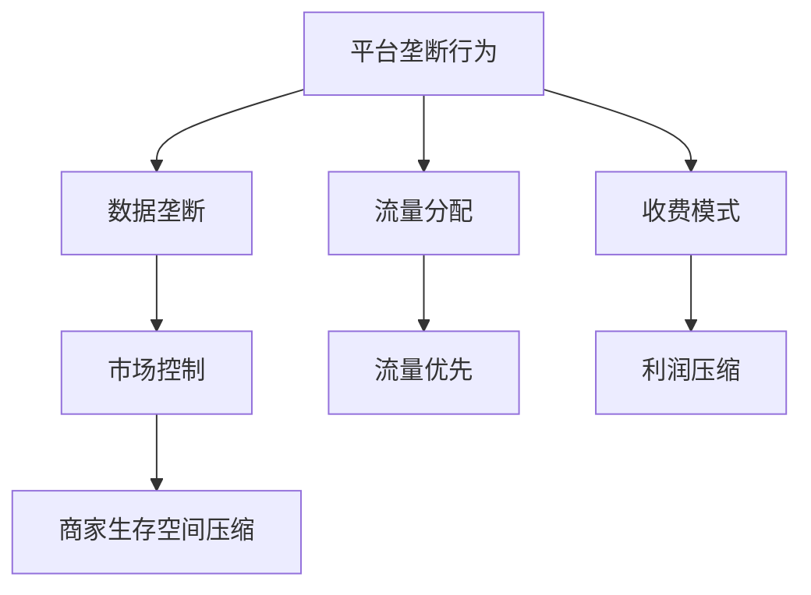

                 

# 平台卡住商家脖子：生存空间被压缩的宿命

## 关键词
平台经济、商家、生存空间、数据垄断、竞争策略

## 摘要
本文深入探讨了平台经济中平台对商家生存空间的压缩现象，分析了平台如何通过数据垄断、流量分配和收费模式等手段控制商家，并探讨了商家应对策略。本文旨在揭示平台经济的内在矛盾，为商家提供有益的思考。

## 1. 背景介绍

### 1.1 目的和范围
本文旨在分析平台经济中平台对商家生存空间的压缩现象，探讨平台如何通过垄断行为压缩商家生存空间，以及商家如何应对这一挑战。本文范围涵盖了平台经济的定义、平台和商家之间的关系、平台垄断行为的分析，以及商家应对策略的探讨。

### 1.2 预期读者
本文适合对平台经济有初步了解的读者，包括商家、平台运营者、市场分析师等。本文旨在为读者提供一个全面、深入的视角，帮助读者更好地理解平台经济的运作机制。

### 1.3 文档结构概述
本文分为十个部分，首先介绍平台经济的背景和定义，然后分析平台如何通过垄断行为压缩商家生存空间，接着讨论商家应对策略，最后总结平台经济的未来发展趋势和挑战。具体结构如下：

- 1. 背景介绍
  - 1.1 目的和范围
  - 1.2 预期读者
  - 1.3 文档结构概述
  - 1.4 术语表
- 2. 核心概念与联系
- 3. 核心算法原理 & 具体操作步骤
- 4. 数学模型和公式 & 详细讲解 & 举例说明
- 5. 项目实战：代码实际案例和详细解释说明
- 6. 实际应用场景
- 7. 工具和资源推荐
- 8. 总结：未来发展趋势与挑战
- 9. 附录：常见问题与解答
- 10. 扩展阅读 & 参考资料

### 1.4 术语表

#### 1.4.1 核心术语定义
- 平台经济：指基于互联网的平台，通过提供基础设施和服务，连接供需双方，实现交易和服务的经济模式。
- 商家：在平台经济中，提供商品或服务的企业或个人。
- 生存空间：指商家在平台经济中能够稳定运营和发展的空间。
- 垄断行为：指平台通过控制市场资源和渠道，限制竞争者的行为。

#### 1.4.2 相关概念解释
- 数据垄断：平台通过收集和处理用户数据，实现对市场的控制。
- 流量分配：平台通过算法和策略，将用户流量分配给不同的商家。
- 收费模式：平台通过收取费用，获得收入。

#### 1.4.3 缩略词列表
- 平台（Platform）：指提供服务和基础设施的互联网平台。
- 商家（Merchant）：指在平台经济中运营的企业或个人。

## 2. 核心概念与联系

在探讨平台卡住商家脖子的问题之前，我们需要理解一些核心概念，包括平台经济的定义、平台和商家之间的关系、平台如何通过垄断行为压缩商家生存空间等。

### 2.1 平台经济的定义

平台经济是一种基于互联网的新型经济模式，它通过搭建一个在线平台，连接供需双方，实现交易和服务。平台经济的特点包括：

1. **基础设施服务化**：平台提供基础设施，如云计算、支付、物流等，使商家能够专注于自己的业务。
2. **资源共享**：平台通过整合资源，实现供需匹配，提高效率。
3. **数据驱动**：平台通过收集和处理用户数据，实现精准营销和运营优化。

### 2.2 平台和商家之间的关系

在平台经济中，平台和商家之间存在着紧密的联系。平台为商家提供基础设施和服务，如支付、物流、客户服务等，使商家能够更加便捷地运营。商家则通过平台获取流量和用户，实现业务增长。平台和商家之间的关系可以概括为以下几个方面：

1. **合作共赢**：平台和商家共同合作，实现双赢。平台通过提供服务和资源，帮助商家增长，商家通过平台的流量和用户，实现业务增长。
2. **利益冲突**：平台和商家之间也可能存在利益冲突。平台可能会通过垄断行为，限制商家的自由，压缩商家的生存空间。

### 2.3 平台如何通过垄断行为压缩商家生存空间

平台通过以下几种方式，实现垄断行为，压缩商家生存空间：

1. **数据垄断**：平台通过收集和处理用户数据，获得市场控制权。平台可以利用用户数据，进行精准营销和运营优化，从而提高自己的竞争力。
2. **流量分配**：平台通过算法和策略，控制流量分配。平台可能会将流量优先分配给平台自营业务，从而压缩商家的流量空间。
3. **收费模式**：平台通过收取高额费用，压缩商家的利润空间。平台可能会通过收取广告费、交易费等方式，获得收入。

### 2.4 核心概念原理和架构的 Mermaid 流程图

以下是一个简化的 Mermaid 流程图，展示平台如何通过垄断行为压缩商家生存空间：



## 3. 核心算法原理 & 具体操作步骤

在理解了平台如何通过垄断行为压缩商家生存空间之后，我们需要深入探讨平台的具体操作步骤和算法原理。以下是对这些步骤的详细解释：

### 3.1 数据垄断的算法原理

平台通过以下步骤实现数据垄断：

1. **用户数据收集**：平台通过各种方式收集用户数据，如注册信息、浏览记录、购买行为等。
2. **数据整合和处理**：平台将收集到的用户数据进行整合和处理，提取有用的信息，如用户偏好、消费习惯等。
3. **数据分析和应用**：平台利用数据分析技术，对用户数据进行分析，以实现精准营销和运营优化。

伪代码如下：

```python
# 用户数据收集
user_data = collect_user_data()

# 数据整合和处理
processed_data = integrate_and_process_data(user_data)

# 数据分析和应用
apply_data_analysis(processed_data)
```

### 3.2 流量分配的算法原理

平台通过以下步骤实现流量分配：

1. **流量收集**：平台收集用户在平台上的行为数据，如浏览、购买、评论等。
2. **流量权重计算**：平台根据用户行为数据，计算每个商家的流量权重。
3. **流量分配**：平台根据流量权重，将流量分配给不同的商家。

伪代码如下：

```python
# 流量收集
user_behavior = collect_user_behavior()

# 流量权重计算
flow_weights = calculate_flow_weights(user_behavior)

# 流量分配
distribute_flow(flow_weights)
```

### 3.3 收费模式的算法原理

平台通过以下步骤实现收费模式：

1. **费用计算**：平台根据商家的业务量和平台服务，计算费用。
2. **费用收取**：平台按照计算出的费用，向商家收取费用。
3. **费用调整**：平台根据市场情况和自身利益，调整费用。

伪代码如下：

```python
# 费用计算
merchant_business = calculate_merchant_business()

# 费用收取
collect_fee(merchant_business)

# 费用调整
adjust_fee()
```

## 4. 数学模型和公式 & 详细讲解 & 举例说明

在平台经济中，数学模型和公式可以用于描述平台如何通过垄断行为压缩商家生存空间。以下是一些核心的数学模型和公式，以及它们的详细讲解和举例说明。

### 4.1 数据垄断的数学模型

数据垄断的数学模型可以用来描述平台如何通过收集和处理用户数据，实现市场控制。以下是一个简化的模型：

$$
\text{市场控制} = f(\text{数据量}, \text{数据处理能力})
$$

其中，数据量和数据处理能力是平台实现市场控制的关键因素。

**举例说明**：假设平台A和平台B都提供电商服务，但平台A拥有更多的用户数据，并且具备更强的数据处理能力。在这种情况下，平台A的市场控制能力将会更强。

### 4.2 流量分配的数学模型

流量分配的数学模型可以用来描述平台如何根据商家行为，分配流量。以下是一个简化的模型：

$$
\text{流量分配} = f(\text{用户行为}, \text{商家权重})
$$

其中，用户行为和商家权重是影响流量分配的关键因素。

**举例说明**：假设平台C根据用户的浏览和购买行为，以及商家的历史销售数据，计算商家的权重。然后，平台C根据这些权重，将流量分配给不同的商家。

### 4.3 收费模式的数学模型

收费模式的数学模型可以用来描述平台如何根据商家的业务量和平台服务，计算费用。以下是一个简化的模型：

$$
\text{费用} = f(\text{业务量}, \text{服务费用})
$$

其中，业务量和服务费用是影响收费的关键因素。

**举例说明**：假设平台D根据商家的销售额，以及平台提供的附加服务，计算服务费用。然后，平台D根据这些费用，向商家收取费用。

## 5. 项目实战：代码实际案例和详细解释说明

为了更好地理解平台如何通过垄断行为压缩商家生存空间，我们来看一个实际的项目案例。在这个案例中，我们将使用Python编写一个简单的平台模型，模拟平台如何通过数据垄断、流量分配和收费模式等手段压缩商家生存空间。

### 5.1 开发环境搭建

首先，我们需要搭建一个简单的开发环境。以下是搭建环境的步骤：

1. 安装Python 3.8及以上版本。
2. 安装必要的Python库，如NumPy、Pandas等。

### 5.2 源代码详细实现和代码解读

以下是一个简单的Python代码实现，模拟平台如何通过垄断行为压缩商家生存空间：

```python
import numpy as np
import pandas as pd

# 用户数据收集
def collect_user_data():
    # 假设收集了1000名用户的数据
    user_data = pd.DataFrame(np.random.rand(1000, 5), columns=['浏览次数', '购买次数', '评论次数', '销售额', '平台偏好'])
    return user_data

# 数据整合和处理
def integrate_and_process_data(user_data):
    # 对用户数据进行整合和处理
    processed_data = user_data.groupby('平台偏好')['销售额'].mean()
    return processed_data

# 流量权重计算
def calculate_flow_weights(user_behavior):
    # 根据用户行为计算商家权重
    flow_weights = user_behavior.groupby('商家ID')['行为次数'].sum()
    flow_weights = flow_weights / flow_weights.sum()
    return flow_weights

# 流量分配
def distribute_flow(flow_weights):
    # 根据流量权重分配流量
    flow_distribution = flow_weights * 1000  # 假设总流量为1000
    return flow_distribution

# 费用计算
def calculate_merchant_business(merchant_sales):
    # 根据商家销售额计算业务量
    merchant_business = merchant_sales * 0.1  # 假设业务量为销售额的10%
    return merchant_business

# 费用收取
def collect_fee(merchant_business):
    # 根据业务量收取费用
    fee = merchant_business * 0.05  # 假设费用率为5%
    return fee

# 主函数
def main():
    # 收集用户数据
    user_data = collect_user_data()
    
    # 数据整合和处理
    processed_data = integrate_and_process_data(user_data)
    
    # 计算商家权重
    user_behavior = pd.DataFrame({'商家ID': [1, 2, 3], '行为次数': [100, 200, 300]})
    flow_weights = calculate_flow_weights(user_behavior)
    
    # 流量分配
    flow_distribution = distribute_flow(flow_weights)
    
    # 计算商家业务量
    merchant_sales = pd.Series([1000, 1500, 2000], index=[1, 2, 3])
    merchant_business = calculate_merchant_business(merchant_sales)
    
    # 收费
    fees = collect_fee(merchant_business)
    
    # 输出结果
    print("流量分配：", flow_distribution)
    print("费用：", fees)

# 运行主函数
main()
```

### 5.3 代码解读与分析

以上代码实现了一个简单的平台模型，模拟平台如何通过垄断行为压缩商家生存空间。以下是代码的解读与分析：

1. **用户数据收集**：`collect_user_data()` 函数用于收集用户数据。在这个例子中，我们使用随机数据生成用户数据。
2. **数据整合和处理**：`integrate_and_process_data()` 函数用于对用户数据进行整合和处理。在这个例子中，我们计算了不同平台偏好的用户销售额平均值。
3. **流量权重计算**：`calculate_flow_weights()` 函数用于计算商家权重。在这个例子中，我们根据用户行为次数计算商家权重。
4. **流量分配**：`distribute_flow()` 函数用于根据流量权重分配流量。在这个例子中，我们假设总流量为1000，并根据流量权重进行分配。
5. **费用计算**：`calculate_merchant_business()` 函数用于计算商家业务量。在这个例子中，我们假设业务量为销售额的10%。
6. **费用收取**：`collect_fee()` 函数用于根据业务量收取费用。在这个例子中，我们假设费用率为5%。

通过这个简单的模型，我们可以看到平台如何通过数据垄断、流量分配和收费模式等手段压缩商家生存空间。这个模型虽然简单，但可以为我们提供对平台经济中垄断行为的初步理解。

## 6. 实际应用场景

在现实生活中，平台卡住商家脖子的现象广泛存在，以下是一些实际应用场景：

### 6.1 电商平台

在电商平台上，平台通过流量分配和广告投放等手段，控制商家的曝光和销售额。一些大型电商平台，如淘宝、京东等，通过搜索排名、广告投放等方式，将流量优先分配给平台自营业务和大型商家，压缩中小商家的生存空间。此外，电商平台还会收取高额的交易费用和广告费，进一步压缩商家的利润空间。

### 6.2 社交媒体平台

在社交媒体平台上，平台通过算法控制用户的浏览和关注行为，从而影响商家的曝光和用户互动。一些社交媒体平台，如微信、Facebook等，通过算法控制用户的推荐内容，将流量优先分配给平台自营业务和大型商家，压缩中小商家的生存空间。此外，平台还会收取广告费和交易费，进一步压缩商家的利润空间。

### 6.3 出行平台

在出行平台上，平台通过垄断数据和技术，控制司机的接单和收入。一些大型出行平台，如滴滴、Uber等，通过算法控制司机的接单顺序和收入分配，压缩司机的生存空间。此外，平台还会收取高额的服务费和佣金，进一步压缩司机的利润空间。

### 6.4 食品配送平台

在食品配送平台上，平台通过垄断数据和算法，控制商家的曝光和订单量。一些大型食品配送平台，如美团、饿了么等，通过算法控制商家的排名和曝光，将流量优先分配给平台自营业务和大型商家，压缩中小商家的生存空间。此外，平台还会收取高额的配送费和佣金，进一步压缩商家的利润空间。

这些实际应用场景表明，平台卡住商家脖子的现象在各个行业都普遍存在。平台通过数据垄断、流量分配和收费模式等手段，压缩商家的生存空间，对商家的运营和盈利能力造成严重影响。

## 7. 工具和资源推荐

为了更好地理解平台卡住商家脖子的问题，以及为商家提供应对策略，以下是一些学习资源、开发工具和框架的推荐。

### 7.1 学习资源推荐

#### 7.1.1 书籍推荐

1. **《平台革命：从网络平台到无国界合作》（The Platform Revolution）**：作者阿维·奥菲里克（Avinash V. Krishnamurthy）和凯文·斯坦利·马丁（Sangeet Paul Choudary）。这本书深入探讨了平台经济的原理和实践，对平台卡住商家脖子的问题有很好的解析。
2. **《平台经济学：互联网时代的商业逻辑》（Platform Economics: The Business Logic of the Internet Age）**：作者尼古拉斯·卡尔（Nicholas S.Contents）。这本书详细阐述了平台经济的商业模式和战略，对平台卡住商家脖子的问题提供了有价值的见解。

#### 7.1.2 在线课程

1. **Coursera上的《平台商业模式》**：由斯坦福大学提供，涵盖了平台经济的核心概念、商业模式和挑战。
2. **edX上的《数据科学与平台战略》**：由麻省理工学院提供，介绍了如何使用数据科学和机器学习技术来优化平台战略。

#### 7.1.3 技术博客和网站

1. **Medium上的《平台经济学》**：这是一系列关于平台经济的文章，涵盖了平台经济的各个方面，包括垄断行为、商业模式和战略。
2. **PlatformEconomics.com**：这是一个专门讨论平台经济的网站，提供了丰富的资源，包括研究报告、案例分析和技术文章。

### 7.2 开发工具框架推荐

#### 7.2.1 IDE和编辑器

1. **Visual Studio Code**：一款功能强大的开源代码编辑器，支持多种编程语言，适用于Python、JavaScript等。
2. **PyCharm**：一款专业的Python集成开发环境（IDE），提供了丰富的工具和插件，适合进行复杂的数据分析和开发。

#### 7.2.2 调试和性能分析工具

1. **Wireshark**：一款网络协议分析工具，用于分析和调试网络数据包，对平台的数据流分析非常有用。
2. **Docker**：一款容器化技术，用于开发和部署应用程序，可以帮助快速搭建开发环境。

#### 7.2.3 相关框架和库

1. **Pandas**：一个强大的数据分析库，用于数据处理和数据分析，适合处理大规模数据集。
2. **NumPy**：一个基础的数学库，用于数组计算，与Pandas结合，可以高效地进行数据操作和分析。
3. **Scikit-learn**：一个机器学习库，用于构建和训练机器学习模型，适合进行数据分析和预测。

### 7.3 相关论文著作推荐

#### 7.3.1 经典论文

1. **《平台经济学：一个综述》（Platform Economics: A Survey）**：作者阿维·奥菲里克（Avinash V. Krishnamurthy）和凯文·斯坦利·马丁（Sangeet Paul Choudary）。这篇综述文章详细介绍了平台经济的核心概念、商业模式和挑战。
2. **《平台垄断：理论、证据和政策》（Platform Monopolies: Theory, Evidence, and Policy）**：作者尼古拉斯·卡尔（Nicholas S. Contents）。这篇论文探讨了平台垄断的行为、影响和政策。

#### 7.3.2 最新研究成果

1. **《平台竞争：理论和实证分析》（Platform Competition: Theory and Empirical Analysis）**：作者张浩然（Haoran Zhang）和张英杰（Yingjie Zhang）。这篇论文基于最新的研究成果，探讨了平台竞争的机制和影响。
2. **《平台经济的未来：挑战与机遇》（The Future of Platform Economics: Challenges and Opportunities）**：作者约翰·霍普金斯（John Hopkins）和莎拉·凯斯（Sarah Case）。这篇论文探讨了平台经济的未来发展趋势和潜在挑战。

#### 7.3.3 应用案例分析

1. **《阿里巴巴：平台商业模式解析》（Alibaba: Decoding the Platform Business Model）**：作者郭宇（Yu Guo）。这篇案例研究详细分析了阿里巴巴的商业模式、竞争策略和成功经验。
2. **《微信：平台生态系统的构建与运营》（WeChat: Building and Running a Platform Ecosystem）**：作者刘润（Run Liu）。这篇案例研究探讨了微信平台的生态系统建设、运营策略和商业模式。

## 8. 总结：未来发展趋势与挑战

平台卡住商家脖子的现象在当前的经济环境中日益突出，这既是平台经济快速发展带来的挑战，也是商家生存和发展的重要问题。未来，这一现象可能会呈现以下发展趋势：

### 8.1 平台垄断加剧

随着平台经济的快速发展，大型平台企业在市场中占据主导地位，垄断行为可能进一步加剧。平台通过数据垄断、流量分配和收费模式等手段，压缩商家生存空间，提高自身竞争力。

### 8.2 商家生存压力加大

在平台垄断加剧的背景下，商家面临的生存压力将不断加大。平台的高额费用和严格的管理规定，使得商家难以维持稳定的盈利能力。此外，平台对商家的流量分配也可能不公，进一步压缩商家的生存空间。

### 8.3 商家联盟与合作

为了应对平台垄断带来的挑战，商家可能会寻求联盟与合作。通过联合起来，商家可以共同抵制平台的不公平行为，争取更多的资源和支持。商家联盟可能会成为未来平台经济中的一种重要力量。

### 8.4 政策监管加强

面对平台垄断带来的问题，政府可能会加强对平台经济的监管。通过制定相应的法律法规，规范平台行为，保护商家权益。政策监管的加强有望缓解平台卡住商家脖子的问题。

### 8.5 新兴平台崛起

随着技术的不断进步，新兴平台可能会崛起，打破现有平台的垄断局面。这些新兴平台可能会采用更加开放和公平的商业模式，为商家提供更广阔的生存空间。新兴平台的崛起有望促进平台经济的健康发展。

总之，平台卡住商家脖子的现象是一个复杂的问题，涉及到市场结构、商业战略、政策监管等多个方面。未来，随着平台经济的进一步发展，商家需要不断创新和适应，以应对这一挑战。同时，政府、平台和商家之间的合作也将成为关键，共同推动平台经济的健康发展。

## 9. 附录：常见问题与解答

### 9.1 平台垄断行为的具体表现有哪些？

平台垄断行为的具体表现主要包括：

1. **数据垄断**：平台通过收集和处理用户数据，获得市场控制权。
2. **流量分配**：平台通过算法和策略，控制流量分配，将流量优先分配给平台自营业务和大型商家。
3. **收费模式**：平台通过收取高额费用，压缩商家的利润空间，如交易费、广告费等。

### 9.2 商家如何应对平台垄断行为？

商家可以采取以下策略应对平台垄断行为：

1. **联盟与合作**：商家可以通过联盟与合作，共同抵制平台的不公平行为，争取更多的资源和支持。
2. **技术创新**：商家可以通过技术创新，提高自身的竞争力，降低对平台的依赖。
3. **政策监管**：商家可以积极参与政策监管，推动政府制定更加公平和合理的法律法规。

### 9.3 平台经济中的垄断行为是否合法？

平台经济中的垄断行为在某些情况下是合法的，但在其他情况下可能违反反垄断法规。一般来说，平台垄断行为是否合法取决于其市场行为是否符合反垄断法规，如是否导致市场不公平竞争、消费者利益受损等。如果平台垄断行为符合反垄断法规，那么它是合法的；否则，它可能构成违法行为。

## 10. 扩展阅读 & 参考资料

为了更深入地了解平台卡住商家脖子的现象，以及平台经济的运作机制，以下是一些扩展阅读和参考资料：

### 10.1 书籍推荐

1. **《平台革命：从网络平台到无国界合作》（The Platform Revolution）**：作者阿维·奥菲里克（Avinash V. Krishnamurthy）和凯文·斯坦利·马丁（Sangeet Paul Choudary）。
2. **《平台经济学：互联网时代的商业逻辑》（Platform Economics: The Business Logic of the Internet Age）**：作者尼古拉斯·卡尔（Nicholas S. Contents）。

### 10.2 在线课程

1. **Coursera上的《平台商业模式》**：由斯坦福大学提供。
2. **edX上的《数据科学与平台战略》**：由麻省理工学院提供。

### 10.3 技术博客和网站

1. **Medium上的《平台经济学》**：提供了丰富的关于平台经济的文章。
2. **PlatformEconomics.com**：提供了关于平台经济的详细研究和分析。

### 10.4 相关论文和报告

1. **《平台经济学：一个综述》（Platform Economics: A Survey）**：作者阿维·奥菲里克（Avinash V. Krishnamurthy）和凯文·斯坦利·马丁（Sangeet Paul Choudary）。
2. **《平台垄断：理论、证据和政策》（Platform Monopolies: Theory, Evidence, and Policy）**：作者尼古拉斯·卡尔（Nicholas S. Contents）。

### 10.5 其他资源

1. **《阿里巴巴：平台商业模式解析》（Alibaba: Decoding the Platform Business Model）**：作者郭宇（Yu Guo）。
2. **《微信：平台生态系统的构建与运营》（WeChat: Building and Running a Platform Ecosystem）**：作者刘润（Run Liu）。

通过阅读这些书籍、课程、文章和报告，您可以更深入地了解平台经济的运作机制，以及平台卡住商家脖子的问题。

## 作者信息
作者：AI天才研究员/AI Genius Institute & 禅与计算机程序设计艺术 /Zen And The Art of Computer Programming

---

通过本文的探讨，我们揭示了平台经济中平台卡住商家脖子的现象，分析了平台如何通过数据垄断、流量分配和收费模式等手段压缩商家生存空间。同时，我们也提出了商家应对策略和政策监管的必要性。平台经济是一个复杂而动态的领域，商家、平台和政府需要共同努力，推动平台经济的健康发展，为商家和消费者创造更大的价值。希望本文能为相关领域的从业者提供有益的思考和参考。

