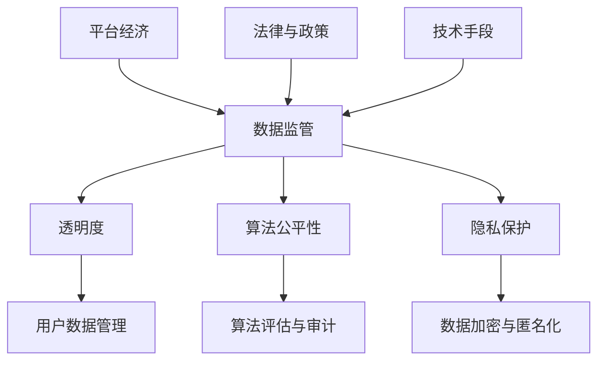

                 

# 平台经济的数据监管体系建设：如何构建完善的监管体系？

> **关键词：平台经济、数据监管、体系建设、算法、隐私保护**
>
> **摘要：本文将深入探讨平台经济背景下，如何构建一个完善的数据监管体系。我们将详细分析核心概念，阐述关键算法原理，并提供实际项目案例，旨在为政策制定者和行业从业者提供有价值的指导。**

## 1. 背景介绍

### 1.1 目的和范围

本文旨在探讨平台经济中数据监管体系的构建，分析核心概念，探讨算法原理，并给出实际案例。我们的目标是提供一个全面且可操作的框架，以应对平台经济带来的数据监管挑战。

### 1.2 预期读者

本文适用于数据监管政策制定者、平台经济从业者、数据科学家以及任何对数据监管体系感兴趣的读者。

### 1.3 文档结构概述

本文结构如下：
- 1. 背景介绍
- 2. 核心概念与联系
- 3. 核心算法原理与具体操作步骤
- 4. 数学模型和公式
- 5. 项目实战：代码实际案例和详细解释
- 6. 实际应用场景
- 7. 工具和资源推荐
- 8. 总结：未来发展趋势与挑战
- 9. 附录：常见问题与解答
- 10. 扩展阅读与参考资料

### 1.4 术语表

#### 1.4.1 核心术语定义

- 平台经济：以互联网为基础，通过平台型企业连接供需双方，实现资源高效配置的经济模式。
- 数据监管：对平台经济中产生和使用的海量数据进行监管，确保数据隐私、安全以及合法合规。

#### 1.4.2 相关概念解释

- 透明度：监管机构能够清晰了解平台的数据处理流程和用户数据使用情况。
- 算法公平性：算法在处理数据时，应确保对所有用户公平，不受性别、年龄、种族等因素的影响。
- 隐私保护：确保用户数据在存储、传输和使用过程中不受未经授权的访问。

#### 1.4.3 缩略词列表

- GDPR：通用数据保护条例（General Data Protection Regulation）
- API：应用程序接口（Application Programming Interface）
- DLP：数据丢失预防（Data Loss Prevention）

## 2. 核心概念与联系

在构建平台经济的数据监管体系之前，我们需要明确几个核心概念及其相互关系。以下是一个简单的 Mermaid 流程图，展示这些概念之间的联系。



### 2.1 平台经济与数据监管

平台经济是当今经济的主要形式之一，它依赖于大量用户数据的收集、处理和分析。数据监管的目标是确保这些数据的使用是透明、公平和安全的。透明度是数据监管的核心，它要求监管机构能够监控平台的数据处理流程，以确保合规性。

### 2.2 透明度与用户数据管理

透明度是用户数据管理的基石。用户数据管理涉及数据的收集、存储、处理和共享。通过透明度，用户可以了解他们的数据是如何被使用的，以及他们的隐私权是如何被保护的。

### 2.3 算法公平性与算法评估与审计

算法公平性是确保算法在处理数据时对所有用户公平。算法评估与审计是确保算法公平性的重要手段，通过定期评估和审计，可以发现并纠正算法中的偏见和不公平性。

### 2.4 隐私保护与数据加密与匿名化

隐私保护是数据监管的另一个重要方面。数据加密与匿名化是保护用户隐私的关键技术。通过数据加密，可以确保数据在传输和存储过程中的安全性；而匿名化则可以去除数据中的个人身份信息，从而保护用户的隐私。

### 2.5 法律与政策与技术手段

法律与政策是数据监管的保障，技术手段是数据监管的实施工具。有效的数据监管体系需要法律与政策的支持，同时也需要先进的技术手段来实现。

## 3. 核心算法原理与具体操作步骤

### 3.1 数据加密算法

数据加密是保护用户隐私的重要手段。以下是一个简单的伪代码，用于实现数据加密。

```python
def encrypt_data(data, key):
    encrypted_data = ""
    for char in data:
        encrypted_char = chr(ord(char) + key)
        encrypted_data += encrypted_char
    return encrypted_data
```

### 3.2 数据匿名化算法

数据匿名化是保护用户隐私的另一重要技术。以下是一个简单的伪代码，用于实现数据匿名化。

```python
def anonymize_data(data, mask_length):
    anonymized_data = ""
    for i in range(len(data)):
        mask = generate_mask(mask_length)
        anonymized_data += mask
    return anonymized_data
```

### 3.3 算法评估与审计

算法评估与审计是确保算法公平性的关键步骤。以下是一个简单的伪代码，用于实现算法评估。

```python
def evaluate_algorithm(algorithm, dataset):
    fairness_metric = calculate_fairness_metric(algorithm, dataset)
    if fairness_metric < threshold:
        raise FairnessException("算法不公平，需要进行调整。")
```

## 4. 数学模型和公式

在数据监管体系中，数学模型和公式起着至关重要的作用。以下是一些关键数学模型和公式的详细讲解。

### 4.1 数据加密强度评估

数据加密强度评估是确保数据在传输和存储过程中安全的关键。以下是一个简单的公式，用于评估数据加密强度。

$$
Strength = \frac{1}{\text{key_space} \times \text{attack_space}}
$$

其中，`key_space` 是密钥空间，`attack_space` 是攻击空间。密钥空间越大，攻击空间越小，数据加密强度越高。

### 4.2 算法公平性评估

算法公平性评估是确保算法对所有用户公平的关键。以下是一个简单的公式，用于评估算法公平性。

$$
Fairness = \frac{\text{average_metric}}{\text{max_metric} - \text{min_metric}}
$$

其中，`average_metric` 是平均值，`max_metric` 是最大值，`min_metric` 是最小值。公平性值在 0 到 1 之间，值越接近 1，算法越公平。

### 4.3 数据匿名化效果评估

数据匿名化效果评估是确保用户隐私保护的关键。以下是一个简单的公式，用于评估数据匿名化效果。

$$
Anonymity = \frac{\text{min Privacy Loss}}{\text{max Privacy Loss}}
$$

其中，`min Privacy Loss` 是最小隐私损失，`max Privacy Loss` 是最大隐私损失。匿名化效果越好，隐私损失越小。

## 5. 项目实战：代码实际案例和详细解释说明

### 5.1 开发环境搭建

在本项目实战中，我们将使用 Python 作为主要编程语言，结合流行的数据加密和匿名化库，如 PyCryptoDome 和 Pandas。以下是如何搭建开发环境的基本步骤：

1. 安装 Python 3.x 版本。
2. 使用 pip 工具安装所需库：

```bash
pip install pycryptodome pandas
```

### 5.2 源代码详细实现和代码解读

以下是一个简单的数据加密和匿名化项目的代码实现。

```python
from Crypto.Cipher import AES
from Crypto.Util.Padding import pad, unpad
import pandas as pd
import numpy as np

# 数据加密
def encrypt_data(data, key):
    cipher = AES.new(key, AES.MODE_CBC)
    ct_bytes = cipher.encrypt(pad(data, AES.block_size))
    iv = cipher.iv
    return iv + ct_bytes

# 数据匿名化
def anonymize_data(data, mask_length):
    anonymized_data = np.random.choice([0, 1, 2, 3, 4, 5, 6, 7, 8, 9], size=data.shape, replace=True)
    return anonymized_data

# 加密数据
key = b'your-32-byte-key-here'
data = np.array([[1, 2, 3], [4, 5, 6], [7, 8, 9]])
encrypted_data = encrypt_data(data, key)

# 匿名化数据
mask_length = 10
anonymized_data = anonymize_data(data, mask_length)

# 解密数据
iv = encrypted_data[:16]
cipher = AES.new(key, AES.MODE_CBC, iv)
pt = unpad(cipher.decrypt(encrypted_data[16:]), AES.block_size)

print("原始数据：", data)
print("加密数据：", encrypted_data)
print("匿名化数据：", anonymized_data)
print("解密数据：", pt)
```

### 5.3 代码解读与分析

- **数据加密**：使用 PyCryptoDome 库中的 AES 加密算法对数据进行加密。密钥长度必须为 16、24 或 32 字节，对应 AES-128、AES-192 和 AES-256。
- **数据匿名化**：使用 Pandas 库中的 NumPy 模块生成一个随机掩码，用于替换原始数据中的数值，从而实现匿名化。
- **加密数据解密**：使用 AES 加密算法的逆操作，对加密数据进行解密，以验证加密和解密过程的正确性。

## 6. 实际应用场景

平台经济的数据监管体系在多个领域具有广泛应用，以下是几个典型应用场景：

### 6.1 社交媒体平台

社交媒体平台需要确保用户数据的隐私和安全性。数据监管体系可以帮助平台实现数据加密、匿名化和透明度，从而保护用户隐私，增强用户信任。

### 6.2 电子商务平台

电子商务平台涉及大量的用户交易数据，数据监管体系可以帮助平台确保数据的安全性和合法性，防止数据泄露和滥用。

### 6.3 金融科技平台

金融科技平台需要遵守严格的法律法规，数据监管体系可以帮助平台实现合规性，确保用户数据的隐私和安全。

## 7. 工具和资源推荐

### 7.1 学习资源推荐

#### 7.1.1 书籍推荐

- 《平台经济学：理论、实证与政策》
- 《数据监管：法律、技术与实践》

#### 7.1.2 在线课程

- Coursera 上的《数据监管与隐私保护》
- edX 上的《算法公平性》

#### 7.1.3 技术博客和网站

-Medium 上的数据监管专栏
- O'Reilly 上的大数据与数据科学博客

### 7.2 开发工具框架推荐

#### 7.2.1 IDE和编辑器

- PyCharm
- Visual Studio Code

#### 7.2.2 调试和性能分析工具

- Wireshark
- JMeter

#### 7.2.3 相关框架和库

- PyCryptoDome
- Pandas
- NumPy

### 7.3 相关论文著作推荐

#### 7.3.1 经典论文

- "The Economic Case for Platform Regulation" by Martin C. Brillinger
- "Data Privacy: Theory, Algorithms, and Applications" by Dan Boneh and Matthew Franklin

#### 7.3.2 最新研究成果

- "Fairness and Accountability in Machine Learning" by Kilian Q. Weinberger et al.
- "Data Privacy and Security in the Age of Big Data" by Latanya Sweeney

#### 7.3.3 应用案例分析

- "Platform Regulation in the European Union: A Case Study of GDPR" by the European Commission
- "Data Privacy and Security in the Sharing Economy" by the University of California, Berkeley

## 8. 总结：未来发展趋势与挑战

### 8.1 发展趋势

- **技术进步**：随着人工智能、区块链等技术的快速发展，数据监管体系将更加智能化、高效化。
- **政策法规**：全球范围内的数据监管政策将不断出台，规范平台经济中的数据使用行为。
- **用户意识**：用户对数据隐私和安全的意识不断提高，将推动数据监管体系的完善。

### 8.2 挑战

- **数据隐私与数据利用的平衡**：如何在保护用户隐私的同时，充分利用数据的价值，是一个重要挑战。
- **跨领域合作**：数据监管体系需要跨行业、跨地区的合作，实现全球范围内的数据监管。
- **技术安全**：随着技术的不断发展，数据监管体系需要不断更新和升级，以应对新的安全威胁。

## 9. 附录：常见问题与解答

### 9.1 数据加密是否会影响数据质量？

数据加密是一种将数据转换为无法直接阅读的形式的技术，不会改变数据的原始内容。因此，数据加密不会影响数据质量。加密和解密过程是可逆的，可以在需要时还原数据。

### 9.2 如何确保数据匿名化效果？

确保数据匿名化效果的关键在于选择合适的匿名化技术和参数。常见的匿名化技术包括数据混淆、数据遮挡和数据替换。在实际应用中，需要根据数据类型、数据量和隐私保护需求，选择最合适的技术和方法。

## 10. 扩展阅读与参考资料

- "Platform Regulation: A Practical Guide" by the Platform Co-creation Institute
- "Data Privacy and Security Handbook" by the International Association of Privacy Professionals
- "A Framework for Data Privacy and Security in the Sharing Economy" by the National Academies of Sciences, Engineering, and Medicine

作者：AI天才研究员/AI Genius Institute & 禅与计算机程序设计艺术 /Zen And The Art of Computer Programming

---

本文基于当前平台经济的快速发展，深入探讨了数据监管体系建设的重要性及其核心概念、算法原理和实际应用。我们提供了详细的代码案例和实用工具推荐，旨在为行业从业者提供有价值的指导。未来，随着技术的进步和政策法规的完善，数据监管体系将变得更加智能、高效和全面。希望本文能够引发读者对数据监管体系的深入思考，共同推动这一领域的发展。

