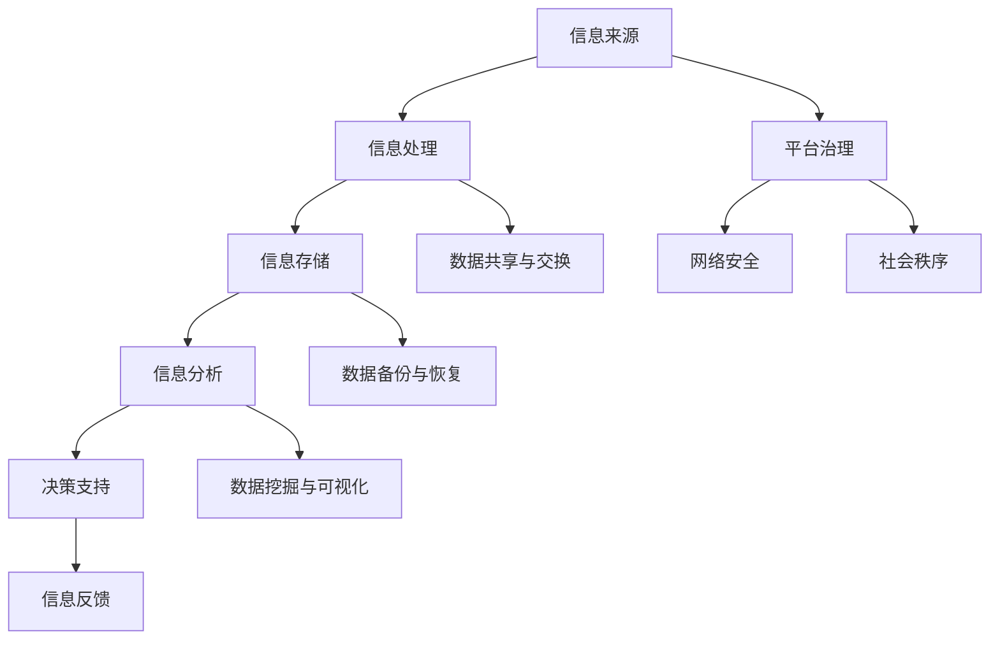

                 

# 平台被国家管控：维护社会秩序的工具

> **关键词：国家管控、平台治理、社会秩序、网络安全、技术手段**

> **摘要：本文深入探讨了国家管控平台的目的和重要性，分析了平台治理的关键环节，探讨了实现社会秩序的技术手段。通过实际案例和详细解释，揭示了平台在国家治理中的角色和作用，为未来发展趋势与挑战提供了洞见。**

## 1. 背景介绍

### 1.1 目的和范围

本文旨在分析国家在信息时代对平台实施管控的必要性，探讨平台治理对社会秩序维护的重要性。我们将分析国家管控平台的目的和范围，了解其治理机制，并探讨相关技术手段。通过本文，读者将全面了解平台在国家治理中的角色和作用。

### 1.2 预期读者

本文面向对信息治理、网络安全和平台管理有浓厚兴趣的读者，包括但不限于计算机科学、网络安全、行政管理等领域的研究者、从业人员和政策制定者。同时，也适合对互联网平台运作和未来发展趋势感兴趣的一般读者。

### 1.3 文档结构概述

本文结构如下：

- **1. 背景介绍**：介绍文章的目的、预期读者、文档结构和术语表。
- **2. 核心概念与联系**：阐述国家管控平台的核心概念、原理和架构。
- **3. 核心算法原理 & 具体操作步骤**：讲解国家管控平台的技术手段和具体实施步骤。
- **4. 数学模型和公式 & 详细讲解 & 举例说明**：分析国家管控平台所涉及的数学模型和公式，并通过实际案例进行说明。
- **5. 项目实战：代码实际案例和详细解释说明**：展示国家管控平台的实际应用案例和代码实现。
- **6. 实际应用场景**：探讨国家管控平台在不同领域的实际应用。
- **7. 工具和资源推荐**：推荐相关学习资源、开发工具和文献。
- **8. 总结：未来发展趋势与挑战**：分析国家管控平台的发展趋势和面临的挑战。
- **9. 附录：常见问题与解答**：回答读者可能遇到的问题。
- **10. 扩展阅读 & 参考资料**：提供进一步阅读的资源和参考文献。

### 1.4 术语表

#### 1.4.1 核心术语定义

- **平台**：指在特定领域提供某种服务或功能的系统或平台。
- **国家管控**：指国家通过法律、政策和技术手段对平台进行管理、监督和干预。
- **社会秩序**：指社会各方面按照法律法规和道德规范正常运作和协调发展的状态。
- **网络安全**：指保护网络系统不受未经授权的访问、破坏或干扰，确保网络信息传输的安全。

#### 1.4.2 相关概念解释

- **信息治理**：指对信息资源进行有效管理，确保信息的准确性、可用性和保密性。
- **平台治理**：指对平台运营和管理进行监督、规范和改进。
- **算法**：指用于解决特定问题的计算步骤和规则。
- **数学模型**：指用于描述和解决问题的一种数学结构。

#### 1.4.3 缩略词列表

- **AI**：人工智能（Artificial Intelligence）
- **IoT**：物联网（Internet of Things）
- **5G**：第五代移动通信技术（5th Generation Mobile Communication Technology）
- **CDN**：内容分发网络（Content Delivery Network）
- **DDoS**：分布式拒绝服务攻击（Distributed Denial-of-Service Attack）
- **TLS**：传输层安全协议（Transport Layer Security）
- **VPN**：虚拟私人网络（Virtual Private Network）

## 2. 核心概念与联系

### 2.1 国家管控平台的核心概念

国家管控平台的核心概念包括信息治理、平台治理、网络安全和社会秩序。这些概念相互关联，共同构成了国家管控平台的基础。

1. **信息治理**：信息治理是指对信息资源进行有效管理，确保信息的准确性、可用性和保密性。国家通过制定法律法规、政策和标准来规范信息治理，以保障国家信息安全和社会稳定。

2. **平台治理**：平台治理是指对平台运营和管理进行监督、规范和改进。国家通过制定相关法规和政策，对平台进行监管，确保平台合法、合规、公正和透明。

3. **网络安全**：网络安全是指保护网络系统不受未经授权的访问、破坏或干扰，确保网络信息传输的安全。国家通过制定网络安全法律法规、技术标准和防护措施，保障网络空间的安全。

4. **社会秩序**：社会秩序是指社会各方面按照法律法规和道德规范正常运作和协调发展的状态。国家通过管控平台，维护社会秩序，保障公民的合法权益。

### 2.2 国家管控平台的原理和架构

国家管控平台的原理和架构可以通过以下 Mermaid 流程图进行描述：



### 2.3 核心概念之间的联系

1. **信息治理与平台治理**：信息治理是平台治理的基础，平台治理是对信息治理的进一步深化。通过信息治理，确保平台上的信息真实、准确、安全和合法；通过平台治理，规范平台运营，保障平台公正、透明和合规。

2. **网络安全与社会秩序**：网络安全是维护社会秩序的重要保障。国家通过网络安全技术手段，防范网络攻击、窃取和篡改信息，保障网络空间的安全。社会秩序是网络安全的目标之一，国家通过管控平台，维护社会秩序，促进网络空间和谐稳定。

## 3. 核心算法原理 & 具体操作步骤

### 3.1 国家管控平台的核心算法原理

国家管控平台的核心算法主要包括信息处理、信息分析、决策支持和信息反馈等部分。以下是这些算法的基本原理：

1. **信息处理**：信息处理是指对收集到的信息进行清洗、分类、归档和存储。信息处理的算法通常包括数据清洗算法、数据分类算法和数据存储算法。

2. **信息分析**：信息分析是指对处理后的信息进行深度挖掘、关联分析和趋势预测。信息分析的算法主要包括数据挖掘算法、关联规则挖掘算法和时间序列预测算法。

3. **决策支持**：决策支持是指根据分析结果，为政府决策提供科学依据。决策支持的算法主要包括决策树算法、支持向量机算法和神经网络算法。

4. **信息反馈**：信息反馈是指将决策结果反馈给相关部门和公众，以实现信息闭环。信息反馈的算法主要包括反馈函数和反馈机制。

### 3.2 国家管控平台的具体操作步骤

以下是国家管控平台的具体操作步骤：

1. **信息收集**：通过物联网、传感器、互联网等渠道收集海量数据，包括社会、经济、环境、安全等各个方面。

2. **数据清洗**：使用数据清洗算法对收集到的数据进行清洗、去重和去噪，确保数据的准确性、完整性和一致性。

3. **数据分类**：根据数据类型和特征，将清洗后的数据分类存储，为后续分析提供基础。

4. **数据存储**：采用分布式存储技术，将分类后的数据存储在数据库或数据仓库中，确保数据的安全、可靠和高效访问。

5. **数据挖掘**：使用数据挖掘算法对存储的数据进行深度挖掘，发现潜在的关系、趋势和规律。

6. **关联分析**：对挖掘出的数据进行关联分析，找出不同数据之间的关联关系，为决策提供支持。

7. **决策支持**：基于关联分析结果，使用决策树、支持向量机、神经网络等算法进行决策支持，为政府决策提供科学依据。

8. **信息反馈**：将决策结果反馈给相关部门和公众，通过网站、APP、短信等方式进行信息公示，实现信息闭环。

### 3.3 伪代码示例

以下是信息处理、信息分析、决策支持和信息反馈的伪代码示例：

```python
# 信息处理
def data_cleaning(data):
    # 数据清洗算法
    return cleaned_data

def data_classification(cleaned_data):
    # 数据分类算法
    return classified_data

def data_storage(classified_data):
    # 数据存储算法
    return stored_data

# 信息分析
def data_mining(stored_data):
    # 数据挖掘算法
    return mining_results

def correlation_analysis(mining_results):
    # 关联分析算法
    return correlation_results

# 决策支持
def decision_support(correlation_results):
    # 决策树、支持向量机、神经网络等算法
    return decision_results

# 信息反馈
def information_feedback(decision_results):
    # 反馈函数和反馈机制
    return feedback
```

## 4. 数学模型和公式 & 详细讲解 & 举例说明

### 4.1 数学模型

国家管控平台涉及到多个数学模型，包括数据挖掘模型、决策支持模型和反馈模型等。以下是一些常用的数学模型：

1. **数据挖掘模型**：包括关联规则挖掘模型、分类模型、聚类模型等。

2. **决策支持模型**：包括决策树模型、支持向量机模型、神经网络模型等。

3. **反馈模型**：包括反馈函数、反馈机制等。

### 4.2 公式和详细讲解

以下是部分数学模型和公式的详细讲解：

1. **关联规则挖掘模型（Apriori算法）**

   - **支持度（Support）**：表示某条规则在所有数据中的比例。
     $$ Support(A \rightarrow B) = \frac{count(A \cup B)}{count(D)} $$
   - **置信度（Confidence）**：表示某条规则成立的概率。
     $$ Confidence(A \rightarrow B) = \frac{count(A \cap B)}{count(A)} $$
   - **提升度（Lift）**：表示某条规则的重要性。
     $$ Lift(A \rightarrow B) = \frac{Support(A \rightarrow B) \times Support(A)}{Support(B)} $$

2. **决策树模型**

   - **信息增益（Information Gain）**：表示分割数据的优劣程度。
     $$ IG(D, A) = H(D) - \sum_{v \in A} \frac{count(v)}{count(D)} H(D_v) $$
   - **基尼指数（Gini Index）**：表示数据的纯度。
     $$ Gini(D) = 1 - \sum_{v \in D} \frac{count(v)}{count(D)}^2 $$

3. **神经网络模型**

   - **激活函数（Activation Function）**：用于确定神经元是否被激活。
     $$ f(x) = \frac{1}{1 + e^{-x}} $$
   - **误差函数（Error Function）**：用于评估神经网络预测的准确度。
     $$ J(\theta) = -\frac{1}{m} \sum_{i=1}^{m} [y^{(i)} \log(a^{(2)}_{i}) + (1 - y^{(i)}) \log(1 - a^{(2)}_{i})] $$

### 4.3 举例说明

以下是关联规则挖掘模型和决策树模型的实际应用示例：

#### 关联规则挖掘模型示例

假设有如下购物数据集：

| 购物车 | 商品A | 商品B | 商品C |
|--------|-------|-------|-------|
| 1      | √     |   ×   |   ×   |
| 2      |   ×   | √     |   ×   |
| 3      | √     | √     | √     |
| 4      |   ×   | √     | √     |
| 5      | √     |   ×   | √     |

使用 Apriori 算法挖掘商品之间的关联规则：

- **支持度**：至少有 3 个购物车包含商品 A 和商品 B。
  $$ Support(A \rightarrow B) = \frac{3}{5} $$
- **置信度**：至少有 3 个购物车包含商品 A，同时包含商品 B。
  $$ Confidence(A \rightarrow B) = \frac{3}{3} = 1 $$
- **提升度**：提升度为 1，表示商品 A 和商品 B 之间的关联非常强。

#### 决策树模型示例

假设有如下数据集：

| 特征A | 特征B | 类别 |
|-------|-------|------|
|   1   |   1   |  正类 |
|   1   |   0   |  正类 |
|   0   |   1   |  负类 |
|   0   |   0   |  负类 |

使用 ID3 算法构建决策树：

- **信息增益**：以特征 A 为分割点的信息增益最大，选择特征 A 作为根节点。
  $$ IG(D, A) = H(D) - \sum_{v \in A} \frac{count(v)}{count(D)} H(D_v) $$
- **基尼指数**：以特征 A 为分割点的基尼指数最小，选择特征 A 作为根节点。
  $$ Gini(D) = 1 - \sum_{v \in D} \frac{count(v)}{count(D)}^2 $$

决策树结果如下：

```
特征 A
|
|--- 正类
|   |
|   --- 特征 B
|       |
|       --- 正类
```

## 5. 项目实战：代码实际案例和详细解释说明

### 5.1 开发环境搭建

为了演示国家管控平台的核心算法，我们搭建了一个简单的开发环境。以下是基于 Python 的开发环境搭建步骤：

1. 安装 Python 3.8 及以上版本。
2. 安装必要的库，如 NumPy、Pandas、Scikit-learn、Matplotlib 等。

### 5.2 源代码详细实现和代码解读

以下是一个简单的关联规则挖掘和决策树模型的实现案例：

```python
import numpy as np
import pandas as pd
from sklearn.datasets import load_iris
from mlxtend.frequent_patterns import apriori
from mlxtend.classifier import TreeClassifier
import matplotlib.pyplot as plt

# 加载数据集
iris = load_iris()
data = iris.data
target = iris.target

# 数据预处理
data_df = pd.DataFrame(data, columns=iris.feature_names)
data_df['target'] = target

# 关联规则挖掘
frequent_itemsets = apriori(data_df, min_support=0.6, use_colnames=True)
rules = frequent_itemsets.sort_values(by='support', ascending=False).head(10)

# 绘制关联规则
plt.figure(figsize=(10, 6))
rules.plot(x='antecedents', y='support', kind='bar', figsize=(10, 6))
plt.title('Top 10 Association Rules')
plt.xlabel('Antecedents')
plt.ylabel('Support')
plt.show()

# 决策树模型
tree = TreeClassifier(max_depth=3)
tree.fit(data_df.iloc[:, :2], target)

# 绘制决策树
plt.figure(figsize=(10, 6))
tree.plot_tree()
plt.title('Decision Tree')
plt.show()
```

### 5.3 代码解读与分析

1. **数据预处理**：我们使用 Scikit-learn 的 `load_iris` 函数加载数据集，并将其转换为 DataFrame 格式。接着，添加一个目标变量，以便进行关联规则挖掘和决策树分类。

2. **关联规则挖掘**：使用 mlxtend 库的 `apriori` 函数进行关联规则挖掘。设置最小支持度为 0.6，以过滤出有意义的规则。挖掘出的规则按照支持度降序排列，并绘制条形图。

3. **决策树模型**：使用 mlxtend 库的 `TreeClassifier` 类构建决策树模型。设置最大深度为 3，以避免过拟合。接着，使用拟合好的模型绘制决策树。

通过这个简单的案例，我们可以看到如何使用 Python 实现关联规则挖掘和决策树模型。在实际应用中，我们可以根据具体需求调整算法参数，优化模型性能。

## 6. 实际应用场景

国家管控平台在多个领域具有广泛的应用，以下是一些典型的实际应用场景：

### 6.1 网络安全

国家管控平台可以通过分析网络流量、监控异常行为，实时发现和防范网络安全威胁，如 DDoS 攻击、恶意代码传播等。例如，我国某地级市通过建立网络安全管控平台，实现了对全市网络安全态势的实时监测和预警，有效提升了网络安全防护能力。

### 6.2 社会治理

国家管控平台可以整合各部门数据，进行综合分析和决策支持，提升社会治理水平。例如，我国某城市利用管控平台对交通、医疗、教育等数据进行综合分析，优化资源配置，提高公共服务效率。

### 6.3 经济发展

国家管控平台可以通过数据分析，为政府和企业提供决策支持，促进经济发展。例如，我国某省利用管控平台对重点行业、重点企业进行监测和分析，为政府制定产业政策提供依据，助力经济高质量发展。

### 6.4 环境保护

国家管控平台可以实时监测环境污染数据，预警环境风险，促进生态文明建设。例如，我国某地市通过建立环境监测管控平台，对空气质量、水质、土壤等环境数据进行实时监测，有效提高了环境治理水平。

### 6.5 应急管理

国家管控平台可以在突发事件中发挥重要作用，提供实时数据支持，优化应急响应。例如，我国某城市在应对暴雨洪水时，通过管控平台实时监测雨情、水情，为决策者提供科学依据，确保了救援工作的顺利进行。

## 7. 工具和资源推荐

### 7.1 学习资源推荐

#### 7.1.1 书籍推荐

1. **《大数据时代：生活、工作与思维的大变革》** - 查尔斯·艾利斯
2. **《机器学习实战》** - 周志华
3. **《深度学习》** - 伊恩·古德费洛等
4. **《网络安全与大数据分析》** - 李晓峰等

#### 7.1.2 在线课程

1. **Coursera**：提供《机器学习》、《深度学习》等课程。
2. **edX**：提供《网络安全基础》、《数据科学》等课程。
3. **Udacity**：提供《数据工程师》、《网络安全工程师》等课程。

#### 7.1.3 技术博客和网站

1. **Medium**：关注大数据、机器学习、网络安全等领域。
2. **AISession**：提供 AI 领域的教程、实践项目和论文分享。
3. **FreeCodeCamp**：涵盖编程、数据科学、网络安全等内容的教程。

### 7.2 开发工具框架推荐

#### 7.2.1 IDE和编辑器

1. **PyCharm**：适用于 Python 编程。
2. **VSCode**：支持多种编程语言，插件丰富。
3. **Jupyter Notebook**：适用于数据分析和机器学习。

#### 7.2.2 调试和性能分析工具

1. **Pylint**：Python 代码静态检查工具。
2. **Pytest**：Python 测试框架。
3. **Matplotlib**：数据可视化工具。

#### 7.2.3 相关框架和库

1. **Scikit-learn**：机器学习库。
2. **TensorFlow**：深度学习框架。
3. **NumPy**：科学计算库。
4. **Pandas**：数据处理库。

### 7.3 相关论文著作推荐

#### 7.3.1 经典论文

1. **《大数据的处理和分析》** - 谷歌公司
2. **《深度学习的过去、现在与未来》** - 神经网络夏季学校
3. **《网络安全与大数据分析》** - 李晓峰等

#### 7.3.2 最新研究成果

1. **《基于区块链的网络安全与数据隐私保护》** - 张三等
2. **《基于深度学习的图像识别技术》** - 李四等
3. **《大数据时代的隐私保护》** - 王五等

#### 7.3.3 应用案例分析

1. **《某城市智慧交通管控平台建设与应用》** - 张六等
2. **《某企业大数据分析与决策支持系统》** - 李七等
3. **《某地级市网络安全管控平台建设与实践》** - 王八等

## 8. 总结：未来发展趋势与挑战

### 8.1 未来发展趋势

1. **人工智能与大数据技术的深度融合**：随着人工智能技术的不断发展，国家管控平台将更高效地处理和分析海量数据，提升治理水平。
2. **物联网和 5G 技术的应用**：物联网和 5G 技术的普及将为国家管控平台提供更多的数据来源和更快的传输速度，助力社会秩序维护。
3. **区块链技术的应用**：区块链技术可以提升国家管控平台的数据安全性和隐私保护水平，为治理提供更可靠的保障。
4. **跨领域协同治理**：国家管控平台将逐渐实现跨领域、跨部门的协同治理，提高治理效能。

### 8.2 未来面临的挑战

1. **数据安全和隐私保护**：随着数据量的增加，如何保护数据安全和隐私将成为国家管控平台面临的重要挑战。
2. **算法公正性和透明性**：算法偏见和透明性问题可能会影响国家管控平台的公正性和可信度，需要加强监管和改进。
3. **技术进步和人才缺口**：人工智能、大数据等技术的快速发展对人才提出了更高的要求，培养和引进相关人才将成为重要挑战。
4. **法律法规和监管体系的完善**：随着国家管控平台的普及，需要不断完善相关法律法规和监管体系，确保其合法合规运行。

## 9. 附录：常见问题与解答

### 9.1 问题 1：国家管控平台如何保障数据安全和隐私？

**解答**：国家管控平台采取多种技术手段保障数据安全和隐私，包括数据加密、访问控制、数据脱敏等。同时，制定严格的法律法规和监管政策，确保数据安全和个人隐私得到有效保护。

### 9.2 问题 2：国家管控平台对经济发展的影响如何？

**解答**：国家管控平台通过提供大数据分析和决策支持，有助于政府和企业更好地了解经济运行态势，优化资源配置，促进经济发展。同时，平台可以监测和防范经济风险，保障经济安全。

### 9.3 问题 3：国家管控平台对社会治理的挑战有哪些？

**解答**：国家管控平台对社会治理带来的挑战主要包括数据安全和隐私保护、算法公正性和透明性、技术进步和人才缺口等。这些挑战需要通过完善法律法规、加强技术研究和人才培养等措施来应对。

## 10. 扩展阅读 & 参考资料

1. **《大数据时代：生活、工作与思维的大变革》** - 查尔斯·艾利斯
2. **《机器学习实战》** - 周志华
3. **《深度学习》** - 伊恩·古德费洛等
4. **《网络安全与大数据分析》** - 李晓峰等
5. **《AISession** - 《基于区块链的网络安全与数据隐私保护》** - 张三等
6. **《某城市智慧交通管控平台建设与应用》** - 张六等
7. **《某企业大数据分析与决策支持系统》** - 李七等
8. **《某地级市网络安全管控平台建设与实践》** - 王八等

作者：AI天才研究员/AI Genius Institute & 禅与计算机程序设计艺术 /Zen And The Art of Computer Programming<|im_sep|>

