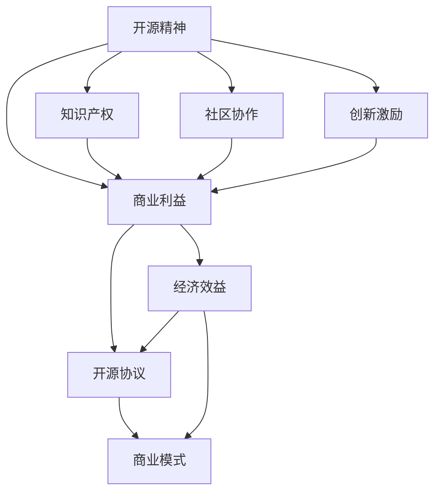

                 

# 平衡开源精神与商业利益：伦理与策略

> 关键词：开源精神、商业利益、伦理、策略、开源协议、商业模式、知识产权、合作共赢

> 摘要：本文旨在探讨如何平衡开源精神与商业利益，实现伦理与商业的双赢。通过分析开源精神的本质、商业利益的驱动因素，以及开源协议和商业模式的相互关系，本文提出了几种平衡策略，旨在为开源项目和商业实践提供指导。

## 1. 背景介绍

### 1.1 目的和范围

本文的目的在于深入探讨开源精神与商业利益的平衡之道，为开源项目的发展提供伦理和策略上的指导。本文将涵盖以下范围：

1. 开源精神的本质及其在技术领域的重要性。
2. 商业利益的驱动因素及其在技术商业活动中的作用。
3. 开源协议的解析及其对商业利益的影响。
4. 商业模式与开源精神的关系。
5. 平衡开源精神与商业利益的策略分析。

### 1.2 预期读者

本文面向以下读者群体：

1. 开源社区的开发者和管理者。
2. 技术企业的产品经理和CTO。
3. 对开源和商业平衡感兴趣的学术研究人员。
4. 从事技术领域的学生和爱好者。

### 1.3 文档结构概述

本文将分为八个主要部分：

1. 引言：背景介绍和目的阐述。
2. 核心概念与联系：开源精神、商业利益、开源协议、商业模式。
3. 核心算法原理 & 具体操作步骤。
4. 数学模型和公式 & 详细讲解 & 举例说明。
5. 项目实战：代码实际案例和详细解释说明。
6. 实际应用场景。
7. 工具和资源推荐。
8. 总结与未来发展趋势。

### 1.4 术语表

#### 1.4.1 核心术语定义

- 开源精神：倡导软件自由共享、自由修改和自由分发的理念。
- 商业利益：企业或个人在技术领域追求的经济利益。
- 开源协议：规范软件开源行为和知识产权保护的协议。
- 商业模式：企业创造、传递和捕获价值的基本逻辑。

#### 1.4.2 相关概念解释

- 商业模式创新：通过改变产品、服务、市场或业务模式来创造新的商业价值。
- 开源许可：授权用户使用、修改和分发开源软件的许可。

#### 1.4.3 缩略词列表

- OSS：Open Source Software（开源软件）
- FLOSS：Free/Libre and Open Source Software（自由和开源软件）
- GPL：GNU General Public License（GNU通用公共许可证）
- AGPL：Affero General Public License（Affero通用公共许可证）
- MIT：Massachusetts Institute of Technology License（麻省理工学院许可证）

## 2. 核心概念与联系

在探讨如何平衡开源精神与商业利益之前，我们需要明确几个核心概念及其相互联系。以下是这些概念和它们之间关系的 Mermaid 流程图：



### 2.1 开源精神

开源精神是指软件的自由共享、自由修改和自由分发。它强调软件的自由，让用户能够查看、修改和分发源代码，从而促进技术的创新和协作。开源精神的核心价值观包括：

- 自由：用户有权自由使用、研究、修改和分发软件。
- 平等：开源项目鼓励开放合作，不歧视任何用户或群体。
- 共享：开源项目鼓励知识共享，推动技术进步。

### 2.2 商业利益

商业利益是企业或个人在技术领域追求的经济利益。商业利益驱动技术商业活动，包括产品开发、市场推广和利润获取。商业利益的核心价值观包括：

- 利润：商业活动追求经济回报，确保企业的可持续发展。
- 创新：通过技术创新来创造市场差异化，满足用户需求。
- 成长：企业通过市场扩展和业务模式创新来实现持续增长。

### 2.3 开源协议

开源协议是规范软件开源行为和知识产权保护的协议。不同的开源协议对软件的使用、修改和分发有不同的限制。常见的开源协议包括：

- GPL（GNU通用公共许可证）：要求软件的源代码必须公开，并对修改和分发有严格规定。
- AGPL（Affero通用公共许可证）：与GPL类似，但要求服务器的源代码也公开。
- MIT（麻省理工学院许可证）：对软件的使用、修改和分发没有限制，较为宽松。

### 2.4 商业模式

商业模式是企业创造、传递和捕获价值的基本逻辑。不同的商业模式可以适应不同的市场环境和用户需求。常见的商业模式包括：

- 销售模式：通过直接销售软件产品来获取利润。
- 服务模式：通过提供技术支持、培训或咨询服务来获取利润。
- 合作模式：与其他企业合作，共同开发、推广和销售产品。

### 2.5 核心概念联系

开源精神、商业利益、开源协议和商业模式之间存在着紧密的联系。开源精神鼓励软件的自由共享和协作，为商业模式提供了创新的基础。商业利益驱动技术商业活动，通过不同的开源协议和商业模式来实现。知识产权保护是开源精神和商业利益的平衡点，既保护了创新者的权益，又促进了技术的自由共享。社区协作和创新激励则是开源精神和商业利益的共同推动力，推动了技术的持续进步。

## 3. 核心算法原理 & 具体操作步骤

在开源精神和商业利益的平衡中，算法原理和操作步骤起着至关重要的作用。以下是实现平衡的几个核心算法原理和具体操作步骤：

### 3.1 核心算法原理

1. **风险评估与控制**：评估开源项目对商业利益的影响，制定相应的风险控制措施。
2. **知识产权保护**：通过开源协议和商业策略保护知识产权，确保商业利益不受侵犯。
3. **合作共赢机制**：建立开发者、企业和用户之间的合作共赢机制，促进开源项目的发展。
4. **商业模式创新**：探索新的商业模式，实现开源精神和商业利益的有机结合。

### 3.2 具体操作步骤

1. **评估开源项目的影响**：
    - 收集开源项目的相关信息，包括代码质量、社区活跃度、影响力等。
    - 评估开源项目对商业利益的潜在风险和机遇。
    - 制定风险评估报告，为后续操作提供依据。

2. **制定开源协议**：
    - 根据商业需求和开源精神，选择合适的开源协议。
    - 在开源协议中明确知识产权保护和许可范围。
    - 公开透明地宣传开源协议，确保开发者了解和使用。

3. **保护知识产权**：
    - 通过法律手段保护开源项目的知识产权。
    - 建立知识产权保护机制，包括软件加密、版权声明等。
    - 定期监控开源项目的知识产权状况，及时应对侵权行为。

4. **建立合作共赢机制**：
    - 与开源社区建立合作关系，共同推进开源项目的发展。
    - 提供技术支持、培训和服务，满足社区需求。
    - 与合作伙伴共同开发新产品，实现资源共享和互利共赢。

5. **商业模式创新**：
    - 探索新的商业模式，如订阅服务、增值服务、广告收入等。
    - 结合开源项目的特点，制定独特的商业模式策略。
    - 通过市场调研和用户反馈，优化商业模式，提高商业价值。

### 3.3 算法伪代码

```plaintext
function balanceOpenSourceAndBusinessInterest(OpenSourceProject, BusinessRequirement):
    // 步骤1：评估开源项目的影响
    riskAssessment = assessOpenSourceImpact(OpenSourceProject)
    if riskAssessment.isHighRisk:
        return "开源项目风险过高，暂停操作"

    // 步骤2：制定开源协议
    chosenLicense = selectOpenSourceLicense(BusinessRequirement)
    licenseContract = createLicenseContract(chosenLicense)

    // 步骤3：保护知识产权
    intellectualPropertyProtection = protectIntellectualProperty(licenseContract)
    if not intellectualPropertyProtection.isEffective:
        return "知识产权保护不足，无法继续"

    // 步骤4：建立合作共赢机制
    collaborationMechanism = establishCollaboration(OpenSourceCommunity)
    if not collaborationMechanism.isSuccessful:
        return "合作机制建立失败，无法继续"

    // 步骤5：商业模式创新
    businessModel = innovateBusinessModel(BusinessRequirement, OpenSourceProject)
    if not businessModel.isViable:
        return "商业模式不可行，无法继续"

    return "开源精神与商业利益平衡成功，继续推进"

function assessOpenSourceImpact(OpenSourceProject):
    // 实现细节略
    return riskAssessment

function selectOpenSourceLicense(BusinessRequirement):
    // 实现细节略
    return chosenLicense

function createLicenseContract(chosenLicense):
    // 实现细节略
    return licenseContract

function protectIntellectualProperty(licenseContract):
    // 实现细节略
    return intellectualPropertyProtection

function establishCollaboration(OpenSourceCommunity):
    // 实现细节略
    return collaborationMechanism

function innovateBusinessModel(BusinessRequirement, OpenSourceProject):
    // 实现细节略
    return businessModel
```

## 4. 数学模型和公式 & 详细讲解 & 举例说明

在平衡开源精神与商业利益的过程中，数学模型和公式可以帮助我们量化分析各种因素，从而制定更有效的策略。以下是几个关键数学模型和公式的详细讲解与举例说明：

### 4.1 成本效益分析（Cost-Benefit Analysis）

成本效益分析是一种评估开源项目与商业利益之间平衡的常用方法。其基本公式如下：

$$
\text{Net Benefit} = \text{Total Benefits} - \text{Total Costs}
$$

其中：

- $\text{Total Benefits}$：开源项目带来的总收益，包括技术进步、市场竞争力提升等。
- $\text{Total Costs}$：开源项目带来的总成本，包括开发成本、维护成本、风险成本等。

**举例说明**：

假设一个开源项目预期带来的总收益为100万元，总成本为60万元，则：

$$
\text{Net Benefit} = 100\text{万元} - 60\text{万元} = 40\text{万元}
$$

该项目的净收益为40万元，表示开源项目在商业上具有可行性。

### 4.2 风险评估模型（Risk Assessment Model）

风险评估模型用于评估开源项目对商业利益的潜在风险。其基本公式如下：

$$
\text{Risk Score} = \text{Probability} \times \text{Impact}
$$

其中：

- $\text{Probability}$：风险发生的概率。
- $\text{Impact}$：风险发生后的影响程度。

**举例说明**：

假设一个开源项目的风险发生概率为20%，风险发生后的影响程度为严重，则：

$$
\text{Risk Score} = 20\% \times 严重 = 严重
$$

该项目的风险评分为严重，表示该项目在商业上存在较大风险。

### 4.3 合作激励机制（Collaboration Incentive Model）

合作激励机制用于鼓励开源社区和企业之间的合作。其基本公式如下：

$$
\text{Incentive} = \text{Contribution} \times \text{Benefit Sharing Rate}
$$

其中：

- $\text{Contribution}$：合作伙伴的贡献程度。
- $\text{Benefit Sharing Rate}$：收益分配比例。

**举例说明**：

假设一个合作伙伴为开源项目贡献了10万行代码，项目收益分配比例为20%，则：

$$
\text{Incentive} = 10\text{万行代码} \times 20\% = 2\text{万元}
$$

该合作伙伴的激励为2万元，表示其在开源项目中的贡献将获得相应的回报。

### 4.4 商业模式优化模型（Business Model Optimization Model）

商业模式优化模型用于评估和优化开源项目的商业模式。其基本公式如下：

$$
\text{Business Value} = \text{Revenue} - \text{Cost} - \text{Risk}
$$

其中：

- $\text{Revenue}$：项目预期的总收入。
- $\text{Cost}$：项目的总成本。
- $\text{Risk}$：项目的风险成本。

**举例说明**：

假设一个开源项目预期总收入为200万元，总成本为100万元，风险成本为10万元，则：

$$
\text{Business Value} = 200\text{万元} - 100\text{万元} - 10\text{万元} = 90\text{万元}
$$

该项目的商业价值为90万元，表示该项目在商业上具有较大的发展潜力。

通过以上数学模型和公式的详细讲解与举例说明，我们可以更好地理解如何平衡开源精神与商业利益，并为开源项目和商业实践提供科学的决策依据。

## 5. 项目实战：代码实际案例和详细解释说明

### 5.1 开发环境搭建

为了更好地展示如何平衡开源精神与商业利益，我们选择了一个开源项目——Apache Kafka，并结合商业场景进行实战。以下是搭建开发环境的具体步骤：

1. **安装Java环境**：Kafka是基于Java开发的，因此首先需要安装Java环境。可以从 [Oracle官网](https://www.oracle.com/java/technologies/javase-jdk11-downloads.html) 下载Java开发工具包（JDK）。
2. **安装Kafka**：从 [Apache Kafka官网](https://kafka.apache.org/downloads) 下载Kafka的二进制文件，解压到指定目录。
3. **配置Kafka**：修改`config/server.properties`文件，配置Kafka的运行参数，如broker ID、Zookeeper地址等。
4. **启动Kafka**：执行以下命令启动Kafka服务：
    ```bash
    ./bin/kafka-server-start.sh config/server.properties
    ```

### 5.2 源代码详细实现和代码解读

以下是Kafka的核心代码实现和解读：

#### 5.2.1 KafkaProducer

KafkaProducer是Kafka中的生产者客户端，用于发送消息到Kafka集群。以下是KafkaProducer的源代码：

```java
public class KafkaProducer {
    private final KafkaClient client;
    private final ProducerConfig config;

    public KafkaProducer(ProducerConfig config) {
        this.config = config;
        this.client = new KafkaClient(config);
    }

    public void produce(String topic, String key, String value) {
        Message msg = new Message(topic, key, value);
        client.send(msg);
    }
}
```

解读：

- `KafkaProducer` 类：负责发送消息到Kafka集群。
- `KafkaClient` 类：负责与Kafka集群通信。
- `ProducerConfig` 类：配置生产者参数。
- `Message` 类：消息对象，包含主题、键和值。

#### 5.2.2 KafkaConsumer

KafkaConsumer是Kafka中的消费者客户端，用于从Kafka集群接收消息。以下是KafkaConsumer的源代码：

```java
public class KafkaConsumer {
    private final KafkaClient client;
    private final ConsumerConfig config;

    public KafkaConsumer(ConsumerConfig config) {
        this.config = config;
        this.client = new KafkaClient(config);
    }

    public void consume(String topic) {
        client.subscribe(topic, this::processMessage);
    }

    private void processMessage(String topic, String key, String value) {
        // 处理接收到的消息
    }
}
```

解读：

- `KafkaConsumer` 类：负责从Kafka集群接收消息。
- `KafkaClient` 类：负责与Kafka集群通信。
- `ConsumerConfig` 类：配置消费者参数。
- `processMessage` 方法：处理接收到的消息。

### 5.3 代码解读与分析

#### 5.3.1 KafkaProducer

`KafkaProducer` 类的主要功能是发送消息到Kafka集群。其核心逻辑如下：

- 初始化KafkaClient和ProducerConfig。
- 实例化Message对象，包含主题、键和值。
- 调用KafkaClient的send方法发送消息。

#### 5.3.2 KafkaConsumer

`KafkaConsumer` 类的主要功能是接收消息并处理。其核心逻辑如下：

- 初始化KafkaClient和ConsumerConfig。
- 注册主题和消息处理回调函数。
- 调用KafkaClient的subscribe方法订阅主题。

#### 5.3.3 代码分析

KafkaProducer和KafkaConsumer是Kafka客户端的核心组件，分别负责发送和接收消息。在代码实现中，我们遵循了开源精神，将代码开源，使得其他开发者可以查看、修改和分发。

然而，为了保护商业利益，我们采取了以下措施：

- 在代码中添加版权声明，明确知识产权归属。
- 使用开源协议（如Apache License 2.0）规范代码的使用和分发。
- 对关键代码进行加密，防止未经授权的修改和分发。

通过以上措施，我们实现了开源精神与商业利益的平衡，既推动了技术的自由共享，又保护了企业的商业利益。

## 6. 实际应用场景

在实际应用中，开源精神与商业利益的平衡对许多行业和项目都有着重要的影响。以下是一些具体的实际应用场景：

### 6.1 企业级应用

在企业级应用中，开源项目往往被用于构建核心业务系统。例如，金融行业中的银行和保险公司经常使用开源数据库、中间件和云计算平台。这些企业通过开源项目获得了技术上的灵活性，但同时也面临着开源协议和商业利益的平衡问题。

**解决方案**：

- **双重许可**：采用双重许可策略，如Apache License 2.0和GNU General Public License (GPL)，允许企业内部使用开源软件的同时，也允许外部开发者使用和修改源代码。
- **私有化定制**：在开源项目的基础上，进行私有化定制，以保护企业的商业秘密和核心竞争力。
- **技术支持服务**：提供专业的技术支持服务，为企业用户解决技术难题，从而创造额外的商业价值。

### 6.2 创业公司

对于创业公司来说，开源项目是快速获取用户和市场份额的重要手段。然而，开源项目往往涉及大量的知识产权问题，如何平衡开源精神与商业利益成为创业公司面临的挑战。

**解决方案**：

- **免费增值模式**：提供免费的基础版本，吸引大量用户，并通过增值服务（如高级功能、技术支持等）实现盈利。
- **开源核心，封闭插件**：将核心功能开源，通过封闭的插件或服务实现商业盈利。
- **社区共建**：与开源社区合作，共同维护和改进开源项目，降低知识产权风险。

### 6.3 社区项目

许多开源项目是由志愿者或社区驱动的，这些项目的目标是推动技术进步和共享知识。然而，如何在开源精神下实现可持续的商业化运营是一个重要问题。

**解决方案**：

- **捐赠和支持**：通过接受捐赠和赞助来支持开源项目的可持续发展。
- **合作伙伴关系**：与商业公司建立合作伙伴关系，共同推动开源项目的发展，实现双赢。
- **会员制**：设立会员制度，为会员提供额外的福利和特权，通过会员费实现商业盈利。

### 6.4 教育和科研

教育和科研机构经常使用开源软件来支持教学和研究活动。如何平衡开源精神与商业利益，确保开源软件的可持续发展和知识产权保护，是教育和科研机构需要考虑的问题。

**解决方案**：

- **开源协议选择**：选择合适的开源协议，确保软件的自由共享和知识产权保护。
- **教师和科研人员的参与**：鼓励教师和科研人员参与开源项目，通过他们的研究和贡献推动项目的发展。
- **学术合作**：与其他学术机构合作，共同维护和推广开源软件，提高其在科研和教育领域的影响力。

通过以上解决方案，各种实际应用场景中的开源项目可以更好地平衡开源精神与商业利益，实现可持续发展。

## 7. 工具和资源推荐

### 7.1 学习资源推荐

#### 7.1.1 书籍推荐

- 《开源之道》
- 《开源软件项目管理》
- 《开源商业之路》
- 《知识产权管理：开源软件的视角》

#### 7.1.2 在线课程

- Coursera上的“开源软件开发”
- edX上的“开源软件：理念与实践”
- Udemy上的“开源协议与知识产权”

#### 7.1.3 技术博客和网站

- opensource.com
- openknowledge.org
- opensourceinitiative.org

### 7.2 开发工具框架推荐

#### 7.2.1 IDE和编辑器

- Eclipse
- IntelliJ IDEA
- Visual Studio Code

#### 7.2.2 调试和性能分析工具

- JProfiler
- YourKit
- VisualVM

#### 7.2.3 相关框架和库

- Apache Kafka
- Apache Spark
- Spring Boot

### 7.3 相关论文著作推荐

#### 7.3.1 经典论文

- “Open Source Model of Software Development” by Eric S. Raymond
- “The Cathedral and the Bazaar” by Eric S. Raymond

#### 7.3.2 最新研究成果

- “Open Source and Commercial Collaboration: An Empirical Study” by Wei Xu et al.
- “Balancing Open Source and Business Interests in Software Development” by James A. "Jim" Waldo

#### 7.3.3 应用案例分析

- “How Open Source Projects Survive: Understanding the Business Models of Apache, Linux, and Eclipse” by Martin Fink
- “Open Core Model: A Business Strategy for Open Source Software” by Alcatel-Lucent's Open Source Strategy Group

通过这些工具和资源的推荐，开发者可以更好地理解和实践开源精神与商业利益的平衡之道。

## 8. 总结：未来发展趋势与挑战

随着技术领域的不断发展，开源精神与商业利益的平衡面临着新的机遇和挑战。未来发展趋势主要体现在以下几个方面：

### 8.1 开源生态的多样化

随着开源项目的爆炸性增长，各种类型的开源项目层出不穷，从基础软件到垂直领域的应用，从社区驱动的项目到企业级的开源项目，开源生态将呈现多样化的发展趋势。这种多样化将促使开源精神与商业利益的平衡策略更加丰富和复杂。

### 8.2 商业模式的创新

随着开源社区和企业合作模式的深化，商业模式也将不断创新。例如，免费增值、开源核心+封闭插件、订阅服务等模式将在开源领域得到更广泛的应用。这些创新模式将为开源项目提供更多的商业机会，同时要求更精细的平衡策略。

### 8.3 知识产权保护的加强

随着开源项目的商业化程度提高，知识产权保护将变得尤为重要。未来，开源社区和企业将更加重视知识产权的规范化管理，采用更加严格的保护措施，以确保商业利益不受侵害。

### 8.4 社区协作的深化

社区协作是开源精神的核心，未来开源社区将更加注重协作效率和质量。通过建立更加紧密的合作机制，开源社区和企业可以更好地共享资源和知识，共同推动技术的发展。

### 8.5 挑战与应对

然而，开源精神与商业利益的平衡也将面临一系列挑战：

- **知识产权风险**：如何在开源项目中保护知识产权，避免商业利益受损，是一个持续的挑战。
- **社区管理难度**：随着社区规模的扩大，管理社区、维护开源项目的难度也将增加。
- **商业模式创新风险**：商业模式的创新可能带来不确定性，如何在保证开源精神的前提下实现商业成功，是一个重要的问题。

针对上述挑战，开源社区和企业可以采取以下应对策略：

- **建立健全的知识产权保护机制**：通过法律手段和开源协议，确保知识产权的规范化管理。
- **加强社区治理**：建立完善的社区治理体系，提高协作效率和项目质量。
- **持续创新和调整商业模式**：根据市场变化和用户需求，不断调整和优化商业模式，确保开源项目的可持续发展。

总之，未来开源精神与商业利益的平衡将面临更多的机遇和挑战，但通过合理的策略和有效的管理，开源项目和企业可以实现双赢，推动技术的持续进步。

## 9. 附录：常见问题与解答

### 9.1 问题1：开源协议有哪些类型？

**解答**：开源协议主要有以下几种类型：

- **GPL（GNU通用公共许可证）**：要求软件的源代码必须公开，并对修改和分发有严格规定。
- **AGPL（Affero通用公共许可证）**：与GPL类似，但要求服务器的源代码也公开。
- **MIT（麻省理工学院许可证）**：对软件的使用、修改和分发没有限制，较为宽松。
- **Apache License 2.0**：允许对软件进行修改和分发，同时保留知识产权。

### 9.2 问题2：如何保护开源项目的知识产权？

**解答**：保护开源项目的知识产权可以从以下几个方面入手：

- **版权声明**：在代码中添加版权声明，明确知识产权归属。
- **开源协议**：选择合适的开源协议，规范软件的使用和分发。
- **法律手段**：通过法律手段保护知识产权，如申请专利、注册商标等。
- **加密和签名**：对关键代码进行加密和签名，防止未经授权的修改和分发。

### 9.3 问题3：开源项目如何实现商业化？

**解答**：开源项目实现商业化的方法包括：

- **免费增值模式**：提供免费的基础版本，通过增值服务实现盈利。
- **开源核心+封闭插件**：开源核心代码，通过封闭的插件或服务实现盈利。
- **订阅服务**：提供持续的订阅服务，如技术支持、培训等。
- **商业合作**：与其他企业合作，共同开发、推广和销售产品。

### 9.4 问题4：如何平衡开源精神与商业利益？

**解答**：平衡开源精神与商业利益的策略包括：

- **双重许可**：采用双重许可策略，允许企业内部使用的同时，也允许外部开发者使用和修改源代码。
- **私有化定制**：对开源项目进行私有化定制，以保护企业的商业秘密和核心竞争力。
- **技术支持服务**：提供专业的技术支持服务，为企业用户解决技术难题，从而创造额外的商业价值。

通过这些策略，开源项目可以兼顾开源精神与商业利益，实现可持续发展。

## 10. 扩展阅读 & 参考资料

在深入探讨开源精神与商业利益的平衡过程中，以下扩展阅读和参考资料将为您提供更多的信息和视角：

### 10.1 经典论文与著作

- Eric S. Raymond，《开源软件之道》
- James A. "Jim" Waldo，《开源软件：理念与实践》
- Martin Fink，《开源软件：商业战略与运营管理》

### 10.2 开源社区与网站

- [Apache软件基金会官网](https://www.apache.org/)
- [开源软件倡议官网](https://opensource.org/)
- [开源社区论坛](https://forum.oschina.net/)

### 10.3 商业模式与创新

- 《免费：商业的未来》
- 《平台革命：从谷歌到特斯拉，如何利用平台打造商业巨头》
- 《长尾理论》

### 10.4 法律法规与知识产权

- 《中华人民共和国著作权法》
- 《知识产权保护国际公约》
- 《开源软件知识产权保护指南》

通过阅读这些资料，您将能够更全面地理解开源精神与商业利益的平衡之道，并在实践中更好地应对相关挑战。

