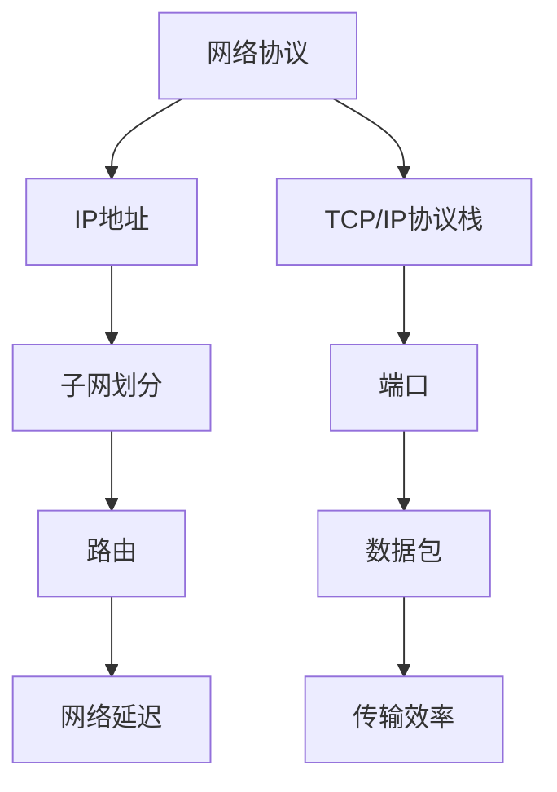
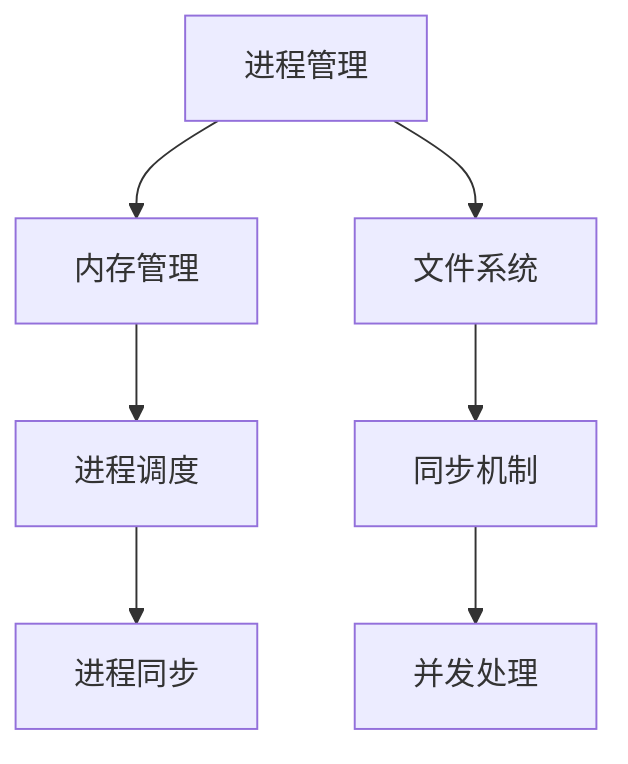
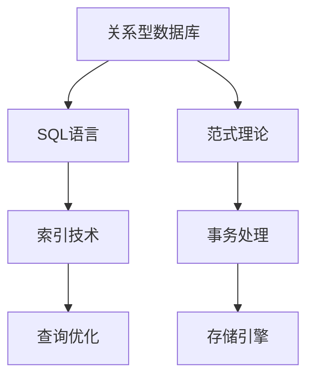
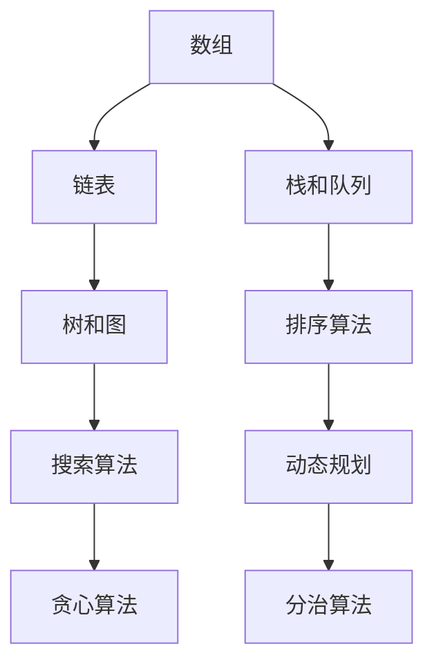

                 

# 2025年华为校招技术面试题集锦

> 关键词：华为校招、技术面试、面试题集锦、编程题、算法题、数据结构、系统设计、计算机网络、操作系统、数据库

> 摘要：本文将针对2025年华为校招技术面试的重点领域，包括编程题、算法题、数据结构、系统设计、计算机网络、操作系统和数据库，提供一系列面试题集锦。通过这些面试题的解析，希望能够帮助准备参加华为校招的读者掌握面试技巧，顺利通过面试。

## 1. 背景介绍

### 1.1 目的和范围

本文旨在为准备参加2025年华为校招的读者提供一份技术面试题集锦。本文涵盖了编程题、算法题、数据结构、系统设计、计算机网络、操作系统和数据库等核心技术领域，旨在帮助读者全面了解华为校招技术面试的重点，提升面试能力。

### 1.2 预期读者

- 准备参加华为校招的计算机专业毕业生
- 想要提升技术面试能力的IT从业者
- 对计算机技术有兴趣的学习者

### 1.3 文档结构概述

本文将按照以下结构展开：

1. 背景介绍：介绍本文的目的、范围和预期读者。
2. 核心概念与联系：介绍与面试题相关的核心概念和原理。
3. 核心算法原理 & 具体操作步骤：讲解核心算法的原理和操作步骤。
4. 数学模型和公式 & 详细讲解 & 举例说明：介绍数学模型和公式，并通过实例进行详细说明。
5. 项目实战：提供实际代码案例，并进行详细解释。
6. 实际应用场景：讨论面试题在实际应用场景中的使用。
7. 工具和资源推荐：推荐学习资源和开发工具。
8. 总结：总结未来发展趋势与挑战。
9. 附录：常见问题与解答。
10. 扩展阅读 & 参考资料：提供进一步学习的资源。

### 1.4 术语表

#### 1.4.1 核心术语定义

- 编程题：涉及编程语言的面试题目。
- 算法题：涉及算法设计和分析能力的面试题目。
- 数据结构：计算机中用于组织和管理数据的方法和数据类型。
- 系统设计：设计和构建软件系统的过程。
- 计算机网络：网络设备和协议的集合，用于数据传输和通信。
- 操作系统：管理计算机硬件和软件资源的系统软件。
- 数据库：用于存储、管理和查询数据的系统。

#### 1.4.2 相关概念解释

- 编程题：涉及编程语言的面试题目，通常要求读者编写代码解决特定问题。
- 算法题：涉及算法设计和分析能力的面试题目，要求读者分析问题、设计算法并实现代码。
- 数据结构：计算机中用于组织和管理数据的方法和数据类型，如数组、链表、树等。
- 系统设计：设计和构建软件系统的过程，涉及模块划分、接口设计、性能优化等。
- 计算机网络：网络设备和协议的集合，用于数据传输和通信，如TCP/IP协议、HTTP协议等。
- 操作系统：管理计算机硬件和软件资源的系统软件，如Windows、Linux等。
- 数据库：用于存储、管理和查询数据的系统，如MySQL、Oracle等。

#### 1.4.3 缩略词列表

- SQL：结构化查询语言（Structured Query Language）
- TCP/IP：传输控制协议/网际协议（Transmission Control Protocol/Internet Protocol）
- HTTP：超文本传输协议（Hypertext Transfer Protocol）
- IDE：集成开发环境（Integrated Development Environment）
- JVM：Java虚拟机（Java Virtual Machine）
- OOP：面向对象编程（Object-Oriented Programming）

## 2. 核心概念与联系

在华为校招的技术面试中，核心概念和原理的理解是关键。以下将介绍与面试题相关的核心概念和原理，并使用Mermaid流程图进行展示。

### 2.1 计算机网络基本原理

计算机网络是数据传输和通信的基础，理解其基本原理对于解决面试题至关重要。



### 2.2 操作系统基本原理

操作系统是计算机系统的核心，掌握操作系统基本原理对于面试题的解答有重要帮助。



### 2.3 数据库基本原理

数据库是数据存储和管理的关键，了解数据库基本原理有助于解决面试题。



### 2.4 数据结构与算法基本原理

数据结构与算法是计算机科学的核心，理解基本原理对于面试题的解答至关重要。



通过以上核心概念和原理的介绍，我们为读者提供了理解面试题的基础。在接下来的章节中，我们将详细讲解核心算法原理、数学模型和公式、项目实战等，帮助读者全面提升面试能力。

## 3. 核心算法原理 & 具体操作步骤

在计算机科学中，算法是解决问题的核心。以下将介绍与华为校招技术面试相关的一些核心算法原理和具体操作步骤。

### 3.1 排序算法

排序算法是计算机科学中的基本算法，用于对数据进行排序。以下是几种常见的排序算法及其伪代码：

#### 3.1.1 冒泡排序（Bubble Sort）

```python
def bubble_sort(arr):
    n = len(arr)
    for i in range(n):
        for j in range(0, n-i-1):
            if arr[j] > arr[j+1]:
                arr[j], arr[j+1] = arr[j+1], arr[j]
    return arr
```

#### 3.1.2 选择排序（Selection Sort）

```python
def selection_sort(arr):
    n = len(arr)
    for i in range(n):
        min_idx = i
        for j in range(i+1, n):
            if arr[j] < arr[min_idx]:
                min_idx = j
        arr[i], arr[min_idx] = arr[min_idx], arr[i]
    return arr
```

#### 3.1.3 插入排序（Insertion Sort）

```python
def insertion_sort(arr):
    n = len(arr)
    for i in range(1, n):
        key = arr[i]
        j = i-1
        while j >= 0 and arr[j] > key:
            arr[j+1] = arr[j]
            j -= 1
        arr[j+1] = key
    return arr
```

#### 3.1.4 快速排序（Quick Sort）

```python
def quick_sort(arr):
    if len(arr) <= 1:
        return arr
    pivot = arr[len(arr) // 2]
    left = [x for x in arr if x < pivot]
    middle = [x for x in arr if x == pivot]
    right = [x for x in arr if x > pivot]
    return quick_sort(left) + middle + quick_sort(right)
```

### 3.2 搜索算法

搜索算法用于在数据结构中查找特定元素。以下是几种常见的搜索算法及其伪代码：

#### 3.2.1 线性搜索（Linear Search）

```python
def linear_search(arr, target):
    for i in range(len(arr)):
        if arr[i] == target:
            return i
    return -1
```

#### 3.2.2 二分搜索（Binary Search）

```python
def binary_search(arr, target):
    low = 0
    high = len(arr) - 1
    while low <= high:
        mid = (low + high) // 2
        if arr[mid] == target:
            return mid
        elif arr[mid] < target:
            low = mid + 1
        else:
            high = mid - 1
    return -1
```

### 3.3 动态规划

动态规划是一种解决最优化问题的算法思想，通过将复杂问题分解为子问题并利用子问题的解来求解原问题。以下是动态规划的一个经典应用——背包问题。

#### 3.3.1 背包问题（Knapsack Problem）

```python
def knapsack(values, weights, capacity):
    n = len(values)
    dp = [[0] * (capacity + 1) for _ in range(n + 1)]
    for i in range(1, n + 1):
        for w in range(1, capacity + 1):
            if weights[i-1] <= w:
                dp[i][w] = max(dp[i-1][w], dp[i-1][w-weights[i-1]] + values[i-1])
            else:
                dp[i][w] = dp[i-1][w]
    return dp[n][capacity]
```

通过以上核心算法原理和具体操作步骤的介绍，读者可以更好地理解算法的原理，并在面试中灵活运用。在接下来的章节中，我们将继续介绍数学模型和公式、项目实战等内容，帮助读者全面提升面试能力。

### 4. 数学模型和公式 & 详细讲解 & 举例说明

在计算机科学中，数学模型和公式是解决复杂问题的有力工具。以下将介绍与华为校招技术面试相关的一些数学模型和公式，并通过具体例子进行详细讲解。

#### 4.1 线性回归模型

线性回归是一种常用的统计方法，用于建立自变量和因变量之间的线性关系。其数学模型为：

$$ y = \beta_0 + \beta_1 \cdot x + \epsilon $$

其中，$ y $ 为因变量，$ x $ 为自变量，$ \beta_0 $ 和 $ \beta_1 $ 为参数，$ \epsilon $ 为误差项。

**例子**：假设我们有一组数据点 $(x_1, y_1), (x_2, y_2), ..., (x_n, y_n)$，我们要用线性回归模型预测 $ y $ 的值。首先，我们需要计算参数 $ \beta_0 $ 和 $ \beta_1 $：

$$ \beta_0 = \bar{y} - \beta_1 \cdot \bar{x} $$

$$ \beta_1 = \frac{\sum_{i=1}^{n}(x_i - \bar{x})(y_i - \bar{y})}{\sum_{i=1}^{n}(x_i - \bar{x})^2} $$

其中，$ \bar{x} $ 和 $ \bar{y} $ 分别为 $ x $ 和 $ y $ 的平均值。

**计算过程**：

假设数据点为 $(1, 2), (2, 4), (3, 6), (4, 8)$，计算平均值：

$$ \bar{x} = \frac{1+2+3+4}{4} = 2.5 $$

$$ \bar{y} = \frac{2+4+6+8}{4} = 5 $$

计算参数 $ \beta_1 $：

$$ \beta_1 = \frac{(1-2.5)(2-5) + (2-2.5)(4-5) + (3-2.5)(6-5) + (4-2.5)(8-5)}{(1-2.5)^2 + (2-2.5)^2 + (3-2.5)^2 + (4-2.5)^2} $$

$$ \beta_1 = \frac{2.5}{2.5} = 1 $$

计算参数 $ \beta_0 $：

$$ \beta_0 = 5 - 1 \cdot 2.5 = 2.5 $$

因此，线性回归模型为：

$$ y = 2.5 + 1 \cdot x $$

使用该模型预测 $ x = 5 $ 时的 $ y $ 值：

$$ y = 2.5 + 1 \cdot 5 = 7.5 $$

#### 4.2 最小生成树算法

最小生成树算法是图论中的一种算法，用于找到图中的最小生成树。其数学模型为：

$$ T = \{ (u, v) \in E | u, v \in V, w(u, v) \leq w(u', v') \quad \forall (u', v') \in E \} $$

其中，$ T $ 为最小生成树，$ E $ 为图中的边集合，$ V $ 为图中的顶点集合，$ w(u, v) $ 为边 $(u, v)$ 的权重。

**例子**：假设有图 $ G = (V, E) $，其中 $ V = \{1, 2, 3, 4\} $，$ E = \{ (1, 2), (1, 3), (2, 3), (2, 4), (3, 4) \} $，边权重分别为 $ w(1, 2) = 2 $，$ w(1, 3) = 3 $，$ w(2, 3) = 1 $，$ w(2, 4) = 2 $，$ w(3, 4) = 3 $。我们要使用Prim算法找到最小生成树。

**计算过程**：

1. 选择任意顶点作为起点，如顶点 $ 1 $。
2. 找到起点 $ 1 $ 的邻接点 $(2, 3)$，选择权重最小的边 $(2, 3)$ 加入生成树。
3. 找到新加入顶点 $ 2 $ 的邻接点 $(3, 4)$，选择权重最小的边 $(2, 4)$ 加入生成树。
4. 找到新加入顶点 $ 4 $ 的邻接点 $(3, 4)$，选择权重最小的边 $(3, 4)$ 加入生成树。

最终得到最小生成树为：

$$ T = \{ (1, 2), (2, 3), (2, 4), (3, 4) \} $$

通过以上数学模型和公式的介绍，读者可以更好地理解计算机科学中的数学应用。在实际面试中，灵活运用这些数学模型和公式能够帮助读者解决复杂问题，提升面试能力。在接下来的章节中，我们将继续介绍项目实战和实际应用场景等内容，帮助读者全面提升面试能力。

### 5. 项目实战：代码实际案例和详细解释说明

在实际的华为校招技术面试中，通过编写代码解决实际问题是一个重要的环节。以下我们将提供一个具体的编程题目，并详细解释其解决方案。

#### 5.1 编程题目：求最大子序和

**题目描述**：给定一个整数数组 `nums`，请找出数组中的最大子序和。

**输入**：`nums = [-2, 1, -3, 4, -1, 2, 1, -5, 4]`

**输出**：`6`

**解题思路**：可以使用动态规划的方法来解决这个问题。定义一个变量 `max_ending_here` 来表示以当前元素为结尾的最大子序和，另一个变量 `max_so_far` 来表示迄今为止找到的最大子序和。遍历数组，对于每个元素，更新 `max_ending_here` 和 `max_so_far`。

#### 5.2 开发环境搭建

为了编写和运行代码，我们需要搭建一个合适的开发环境。以下是一个简单的步骤：

1. 安装Python环境：在官方网站 [https://www.python.org/downloads/](https://www.python.org/downloads/) 下载并安装Python。
2. 选择并安装一个IDE：推荐使用PyCharm或者Visual Studio Code。对于PyCharm，可以在官方网站 [https://www.jetbrains.com/pycharm/](https://www.jetbrains.com/pycharm/) 下载并安装。对于Visual Studio Code，可以在官方网站 [https://code.visualstudio.com/](https://code.visualstudio.com/) 下载并安装。
3. 设置Python环境变量：确保Python环境变量已正确设置，以便在命令行中运行Python。

#### 5.3 源代码详细实现和代码解读

以下是用Python编写的求最大子序和的代码：

```python
def max_subarray_sum(nums):
    max_so_far = float('-inf')
    max_ending_here = 0
    
    for num in nums:
        max_ending_here = max_ending_here + num
        if max_ending_here < 0:
            max_ending_here = 0
        if max_so_far < max_ending_here:
            max_so_far = max_ending_here
            
    return max_so_far

# 测试代码
nums = [-2, 1, -3, 4, -1, 2, 1, -5, 4]
print(max_subarray_sum(nums))
```

**代码解读**：

1. `max_so_far = float('-inf')`：初始化最大子序和为负无穷。
2. `max_ending_here = 0`：初始化当前子序列的最大和为0。
3. `for num in nums:`：遍历数组中的每个元素。
4. `max_ending_here = max_ending_here + num`：将当前元素加到当前子序列的最大和中。
5. `if max_ending_here < 0:`：如果当前子序列的最大和小于0，则重置为0。
6. `if max_so_far < max_ending_here:`：如果当前子序列的最大和大于迄今为止找到的最大子序和，则更新最大子序和。
7. `return max_so_far`：返回最大子序和。

通过以上代码，我们可以解决求最大子序和的问题。在面试中，这样的编程题目能够考验读者的算法能力和代码实现能力。

#### 5.4 代码解读与分析

对于求最大子序和的问题，我们可以使用动态规划的方法进行求解。以下是代码的详细分析：

1. **初始化**：初始化两个变量 `max_so_far` 和 `max_ending_here`，分别表示迄今为止找到的最大子序和和以当前元素为结尾的最大子序和。
2. **遍历数组**：遍历数组中的每个元素，更新 `max_ending_here` 的值。`max_ending_here` 的更新策略是将当前元素加到之前的基础上，如果结果小于0，则重置为0。
3. **更新最大子序和**：如果当前子序列的最大和 `max_ending_here` 大于迄今为止找到的最大子序和 `max_so_far`，则更新 `max_so_far`。
4. **返回结果**：遍历结束后，返回 `max_so_far` 作为最终结果。

这种方法的时间复杂度为 $O(n)$，空间复杂度为 $O(1)$，是一种非常高效的解决方案。

通过以上项目实战的详细解释说明，读者可以更好地理解如何使用编程技能解决实际问题。在实际面试中，灵活运用这些知识和技巧能够帮助读者取得好成绩。在接下来的章节中，我们将继续讨论实际应用场景和相关工具推荐，帮助读者全面提升面试能力。

### 6. 实际应用场景

在华为校招技术面试中，考察的实际应用场景往往是与真实工作场景紧密相关的。以下将讨论几个与编程题、算法题、数据结构、系统设计等相关的实际应用场景，并解释这些场景下的解决方案。

#### 6.1 数据库性能优化

**场景描述**：公司数据库系统性能不佳，导致查询速度缓慢，影响了业务的正常运行。

**解决方案**：

1. **索引优化**：分析查询语句，为常用的查询列创建索引，减少查询时间。
2. **查询优化**：重写查询语句，避免使用子查询或临时表，优化SQL语句的结构。
3. **存储引擎优化**：根据业务需求选择合适的存储引擎，如InnoDB或MyISAM，并进行配置调整。
4. **读写分离**：将读操作和写操作分离到不同的服务器，提高系统性能。

#### 6.2 大规模分布式系统设计

**场景描述**：公司需要设计一个能够支持海量用户和高并发请求的分布式系统。

**解决方案**：

1. **负载均衡**：使用负载均衡器分配请求到不同的服务器，防止单点瓶颈。
2. **服务拆分**：将系统拆分为多个微服务，每个服务负责不同的功能模块，降低系统的耦合度。
3. **分布式缓存**：使用分布式缓存系统（如Redis）存储热数据，减少数据库的压力。
4. **分布式数据库**：使用分布式数据库（如MySQL Cluster）处理海量数据，提高系统的读写性能。

#### 6.3 网络安全防护

**场景描述**：公司网络面临外部攻击，需要加强安全防护措施。

**解决方案**：

1. **防火墙和入侵检测系统**：部署防火墙和入侵检测系统，监控网络流量，防止恶意攻击。
2. **加密传输**：使用SSL/TLS协议加密数据传输，防止数据被窃取。
3. **安全审计**：定期进行安全审计，检查系统中的安全漏洞，及时修复。
4. **多因素认证**：使用多因素认证（如密码 + 手机验证码）提高登录安全性。

#### 6.4 机器学习算法应用

**场景描述**：公司需要开发一个基于机器学习的推荐系统，提高用户满意度。

**解决方案**：

1. **数据预处理**：对用户行为数据进行分析和预处理，提取特征，为模型训练做准备。
2. **模型选择**：选择合适的机器学习模型（如协同过滤、神经网络等）进行训练。
3. **模型优化**：通过调整模型参数，优化模型性能，提高预测准确率。
4. **在线更新**：定期更新模型，根据用户反馈和业务需求调整推荐策略。

通过以上实际应用场景的讨论，读者可以更好地理解如何将技术面试中学到的知识应用到实际工作中。在实际面试中，掌握这些实际应用场景的解决方案，能够帮助读者更好地展示自己的技术能力。

### 7. 工具和资源推荐

在准备华为校招技术面试的过程中，掌握一些有用的工具和资源能够大大提高学习效率和面试成功率。以下是一些推荐的学习资源、开发工具和相关论文著作。

#### 7.1 学习资源推荐

##### 7.1.1 书籍推荐

1. 《算法导论》（Introduction to Algorithms）：经典算法教材，详细介绍了各种算法及其分析。
2. 《深度学习》（Deep Learning）：由Goodfellow等人撰写的深度学习经典教材，适合对深度学习感兴趣的读者。
3. 《计算机网络：自顶向下方法》（Computer Networking: A Top-Down Approach）：从应用层开始讲解计算机网络，易于理解。

##### 7.1.2 在线课程

1. Coursera：提供丰富的计算机科学课程，包括算法、机器学习、数据库等。
2. edX：由哈佛大学和麻省理工学院等名校提供的在线课程，涵盖计算机科学的各个领域。
3. Udacity：提供实战性强的编程课程，适合希望快速提升技能的读者。

##### 7.1.3 技术博客和网站

1. GeeksforGeeks：提供大量的算法和数据结构教程，适合准备技术面试的读者。
2. Medium：许多技术专家和公司发布的技术博客，涵盖广泛的技术领域。
3. Stack Overflow：程序员社区，提供各种技术问题的解答和讨论。

#### 7.2 开发工具框架推荐

##### 7.2.1 IDE和编辑器

1. PyCharm：功能强大的Python IDE，适合进行Python开发。
2. Visual Studio Code：轻量级但功能丰富的编辑器，支持多种编程语言。
3. IntelliJ IDEA：适用于Java和Android开发的IDE，功能强大且易于使用。

##### 7.2.2 调试和性能分析工具

1. GDB：GNU项目的调试器，用于调试C/C++程序。
2. Valgrind：用于检测程序内存泄漏和性能问题的工具。
3. JProfiler：用于Java程序的性能分析工具。

##### 7.2.3 相关框架和库

1. TensorFlow：用于机器学习的开源框架。
2. Spring Boot：用于快速开发Java Web应用程序的框架。
3. Django：用于快速开发Python Web应用程序的框架。

#### 7.3 相关论文著作推荐

##### 7.3.1 经典论文

1. "A Note on the Database Machine ABII"：介绍了数据库系统ABII的设计和实现。
2. "The Internet Architecture"：对互联网架构进行了详细分析。
3. "Learning representations for artificial intelligence"：介绍了深度学习的基础。

##### 7.3.2 最新研究成果

1. "Attention Is All You Need"：介绍了Transformer模型及其在自然语言处理中的应用。
2. "The Shell Model of Web History Ranking"：对Web历史排名算法进行了深入研究。
3. "A Systematic Approach to Building Scalable Machine Learning Pipelines"：探讨了如何构建可扩展的机器学习管道。

##### 7.3.3 应用案例分析

1. "The Design and Implementation of Dropbox"：分析了Dropbox的系统设计和实现。
2. "Building the Facebook Platform"：介绍了Facebook平台的设计和架构。
3. "The Architecture of Twitter"：对Twitter的系统架构进行了详细分析。

通过以上工具和资源的推荐，读者可以更好地准备华为校招技术面试，提升自己的技术能力和面试成功率。

### 8. 总结：未来发展趋势与挑战

在技术飞速发展的时代，华为校招技术面试也面临着不断变化和挑战。以下是未来发展趋势与挑战的概述：

#### 8.1 人工智能的深入应用

随着人工智能技术的不断进步，未来的技术面试将更加注重对人工智能算法的理解和应用。例如，深度学习、自然语言处理和计算机视觉等领域的技术将成为面试的重点。

#### 8.2 大数据与云计算的结合

大数据和云计算技术的快速发展，将使得面试中涉及数据处理、存储和计算效率的问题更加复杂。考生需要掌握如何利用云计算平台高效处理海量数据，以及如何优化数据存储和传输。

#### 8.3 安全与隐私保护

随着网络攻击和数据泄露事件的增多，安全与隐私保护将成为技术面试的重要方向。考生需要了解如何设计安全的系统架构，实施有效的安全措施，以及处理数据隐私保护问题。

#### 8.4 软件开发与运维的结合

DevOps文化的普及，使得软件开发与运维的结合变得更加紧密。未来的技术面试将更加关注如何实现自动化部署、持续集成和持续交付，以及如何优化系统性能和稳定性。

#### 8.5 新兴技术的研究与应用

随着5G、物联网和区块链等新兴技术的不断成熟，这些领域的技术也将成为面试的热点。考生需要了解这些技术的原理和应用，以及如何在实际项目中使用。

#### 8.6 多元化与跨领域知识

未来的技术面试将更加多元化，不仅考察单一领域的知识，还会涉及跨领域的综合能力。考生需要具备良好的逻辑思维、问题解决能力和团队合作精神，以便应对复杂的技术问题。

#### 8.7 持续学习和创新能力

随着技术的不断更新，持续学习和创新能力将成为未来技术面试的重要考核点。考生需要展示自己的学习能力，以及对新技术、新方法的探索和尝试。

通过以上未来发展趋势与挑战的总结，读者可以更好地准备华为校招技术面试，提升自己的综合素质和竞争力。

### 9. 附录：常见问题与解答

在准备华为校招技术面试的过程中，读者可能会遇到一些常见问题。以下是一些常见问题的解答，帮助读者更好地准备面试。

#### 9.1 数据结构与算法问题

**Q1：什么是哈希表？它有哪些应用？**

A1：哈希表是一种基于关键码而组织的数据结构，通过哈希函数将关键码映射到数组的位置，以实现快速查找、插入和删除操作。哈希表的应用包括缓存实现、关联数组、集合和字典等。

**Q2：如何解决哈希冲突？**

A2：常见的解决哈希冲突的方法有链地址法和开放地址法。链地址法通过将发生冲突的元素存储在链表中，而开放地址法通过在数组中寻找下一个空位置来存储冲突元素。

**Q3：什么是递归？请给出一个递归的例子。**

A3：递归是一种编程技巧，通过调用自身函数来解决复杂问题。一个简单的递归例子是计算阶乘函数：

```python
def factorial(n):
    if n == 0:
        return 1
    else:
        return n * factorial(n-1)
```

#### 9.2 计算机网络问题

**Q1：什么是TCP协议？它有哪些特点？**

A1：TCP（传输控制协议）是一种面向连接的、可靠的、基于字节流的传输层通信协议。其特点包括连接建立和终止、流量控制、拥塞控制和错误检测等。

**Q2：什么是HTTP协议？它有哪些请求方法？**

A2：HTTP（超文本传输协议）是一种应用层协议，用于在Web浏览器和服务器之间传输超文本数据。常见的HTTP请求方法包括GET、POST、PUT、DELETE等。

**Q3：什么是DNS？它的工作原理是什么？**

A3：DNS（域名系统）是一种将域名转换为IP地址的系统。DNS的工作原理包括域名解析、递归查询和迭代查询。在域名解析过程中，DNS服务器将域名转换为对应的IP地址，以便进行网络通信。

#### 9.3 操作系统问题

**Q1：什么是进程？什么是线程？它们有哪些区别？**

A1：进程是计算机中正在运行的程序的实例，具有独立的内存空间和系统资源。线程是进程中的执行单元，共享进程的内存空间和系统资源。进程和线程的主要区别在于资源占用和并发性。

**Q2：什么是虚拟内存？它的工作原理是什么？**

A2：虚拟内存是一种内存管理技术，通过将物理内存和磁盘存储空间结合起来，为程序提供更大的内存空间。虚拟内存的工作原理包括地址翻译、页交换和缓存。

**Q3：什么是操作系统的五大功能？**

A3：操作系统的五大功能包括处理器管理、存储管理、设备管理、文件管理和用户接口。处理器管理负责进程调度和并发控制，存储管理负责内存分配和保护，设备管理负责设备控制和数据传输，文件管理负责文件存储和检索，用户接口提供用户与操作系统交互的界面。

通过以上常见问题与解答，读者可以更好地准备华为校招技术面试，解决面试中可能遇到的问题。

### 10. 扩展阅读 & 参考资料

为了进一步帮助读者深入了解华为校招技术面试的相关内容，以下是扩展阅读和参考资料的建议。

#### 10.1 扩展阅读

1. 《算法导论》（Introduction to Algorithms）：详细介绍了各种算法及其分析，是计算机科学领域的重要教材。
2. 《深度学习》（Deep Learning）：由Goodfellow等人撰写的深度学习经典教材，涵盖了深度学习的理论基础和应用。
3. 《计算机网络：自顶向下方法》（Computer Networking: A Top-Down Approach）：从应用层开始讲解计算机网络，易于理解。
4. 《操作系统概念》（Operating System Concepts）：介绍了操作系统的基本原理和设计方法，是操作系统领域的经典教材。

#### 10.2 参考资料

1. [华为校招官网](https://careers.huawei.com/cn)：提供最新的招聘信息和岗位要求，是准备华为校招的重要参考资料。
2. [GitHub](https://github.com)：大量的开源项目和代码示例，可以帮助读者了解实际编程经验和技巧。
3. [Stack Overflow](https://stackoverflow.com)：程序员社区，提供各种技术问题的解答和讨论。
4. [CSDN](https://www.csdn.net)：中国最大的IT社区和服务平台，提供丰富的技术文章和博客。

通过以上扩展阅读和参考资料，读者可以进一步深化对计算机科学领域相关概念和技术的理解，提高面试准备效率。

## 作者

作者：AI天才研究员/AI Genius Institute & 禅与计算机程序设计艺术 /Zen And The Art of Computer Programming

感谢您阅读本文，希望本文对您的华为校招技术面试准备有所帮助。祝您面试成功！

