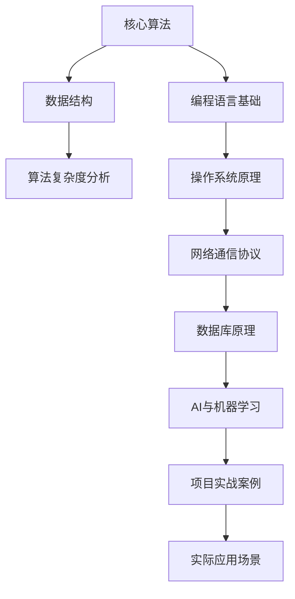

                 


# 2025年华为社招技术面试题集锦

> **关键词：** 华为社招、技术面试、面试题、2025、技术挑战、求职策略
> 
> **摘要：** 本文章旨在为广大即将参加华为社招技术面试的求职者提供一整套精心准备的面试题集锦，涵盖核心算法、数据结构、网络通信、操作系统、数据库、AI与机器学习等热门领域，通过详细解析和实战案例，帮助读者更好地应对技术面试中的各种挑战。

## 1. 背景介绍

### 1.1 目的和范围

本文旨在为准备参加华为社招技术面试的求职者提供一个全面的面试题集锦。华为作为中国乃至全球的科技巨头，其对技术面试的严格性和专业性众所周知。本文涵盖了广泛的技术领域，包括但不限于核心算法、数据结构、网络通信、操作系统、数据库和人工智能等，旨在帮助读者全面准备，提高面试成功率。

### 1.2 预期读者

**预备读者：** 
- 准备参加华为社招技术面试的求职者
- 大学生和研究生活跃在技术领域，希望提升面试技能的学生
- 技术从业者，希望了解华为面试趋势和问题设置的工程师

**推荐阅读：** 
- 对技术面试有初步了解，但需要更深入分析和实战经验的读者
- 希望提高自己在技术面试中表现的软件开发人员和技术专家

### 1.3 文档结构概述

本文按照以下结构展开：
- **第一章：背景介绍**：介绍文章的目的、范围和预期读者。
- **第二章：核心概念与联系**：通过流程图和简要解释，梳理核心概念和技术架构。
- **第三章：核心算法原理 & 具体操作步骤**：使用伪代码详细阐述关键算法。
- **第四章：数学模型和公式 & 详细讲解 & 举例说明**：利用latex格式展示数学公式并举例说明。
- **第五章：项目实战：代码实际案例和详细解释说明**：提供实际代码案例和解读。
- **第六章：实际应用场景**：讨论技术在实际场景中的应用。
- **第七章：工具和资源推荐**：推荐学习资源和开发工具。
- **第八章：总结：未来发展趋势与挑战**：展望未来技术和面试趋势。
- **第九章：附录：常见问题与解答**：回答常见面试问题。
- **第十章：扩展阅读 & 参考资料**：提供进一步学习的资源链接。

### 1.4 术语表

#### 1.4.1 核心术语定义

- **社招**：指企业向社会公开招募有工作经验的人才。
- **技术面试**：通过专业技术问题来评估应聘者的技术水平。
- **核心算法**：在特定领域内最常用、最重要的算法。
- **数据结构**：用于存储和组织数据的特定格式。
- **网络通信**：计算机之间通过网络进行数据交换的技术。
- **操作系统**：管理计算机硬件和软件资源的系统软件。
- **数据库**：用于存储、检索和管理数据的系统。
- **AI与机器学习**：人工智能的一个分支，涉及数据分析和建模。

#### 1.4.2 相关概念解释

- **面试题集锦**：指一系列精心挑选的面试题目和解答，旨在帮助读者备考。
- **实战案例**：实际项目的代码示例，通过解读代码帮助读者理解技术原理。
- **伪代码**：一种描述算法逻辑的抽象语言，用于解释算法思路。
- **latex**：一种排版系统，常用于数学公式的编写。

#### 1.4.3 缩略词列表

- **IDC**：国际数据公司（International Data Corporation）
- **AI**：人工智能（Artificial Intelligence）
- **ML**：机器学习（Machine Learning）
- **OS**：操作系统（Operating System）
- **DB**：数据库（Database）
- **IDE**：集成开发环境（Integrated Development Environment）

## 2. 核心概念与联系

为了帮助读者更好地理解即将面对的华为社招技术面试，我们将首先梳理一些核心概念和技术架构，使用Mermaid流程图来展示它们之间的联系。

### 2.1 Mermaid流程图



### 2.2 相关概念解释

#### 核心算法

核心算法是解决特定问题的一组步骤和方法，是技术面试中的重点考察对象。常见的核心算法包括排序算法（如快速排序、归并排序）、搜索算法（如二分搜索、广度优先搜索）和图算法（如深度优先搜索、Dijkstra算法）。

#### 数据结构

数据结构是数据组织和存储的方式，是算法实现的基础。常见的有数组、链表、栈、队列、树（如二叉树、平衡树）、图等。

#### 算法复杂度分析

算法复杂度分析是评估算法性能的重要方法，包括时间复杂度和空间复杂度。时间复杂度表示算法执行时间与输入规模的关系，空间复杂度表示算法所需存储空间与输入规模的关系。

#### 编程语言基础

编程语言是用于编写程序的语法和规则。常见的编程语言包括C/C++、Java、Python等。熟悉多种编程语言有助于面试者在不同场景下选择合适的工具。

#### 操作系统原理

操作系统是管理计算机硬件和软件资源的系统软件。了解操作系统原理有助于面试者理解程序运行的环境和资源管理。

#### 网络通信协议

网络通信协议是计算机网络中数据传输的标准规则。常见的网络通信协议包括TCP/IP、HTTP、HTTPS等。

#### 数据库原理

数据库是用于存储、检索和管理数据的系统。了解数据库原理有助于面试者理解数据存储和查询的过程。

#### AI与机器学习

AI与机器学习是人工智能的重要分支，涉及数据分析和建模。了解AI与机器学习的基本原理和算法，有助于面试者在面试中展示自己的技术广度。

#### 项目实战案例

项目实战案例是通过实际代码示例来展示如何应用所学知识解决实际问题。这有助于面试者在面试中展示自己的项目经验和编程能力。

#### 实际应用场景

实际应用场景是技术在实际工作中的应用。了解这些应用场景有助于面试者在面试中展示自己的技术实际应用能力。

通过上述核心概念和流程图的梳理，读者可以对华为社招技术面试的内容有一个全局性的了解。在接下来的章节中，我们将详细探讨每个核心概念和技术领域的具体问题和解决方案。

## 3. 核心算法原理 & 具体操作步骤

核心算法是技术面试中的重中之重，理解并掌握这些算法的原理和实现步骤对于求职者至关重要。在本节中，我们将通过伪代码详细阐述几个常见核心算法的原理和步骤。

### 3.1 排序算法

排序算法是算法领域中最为基础且常用的算法之一。下面我们以快速排序（Quick Sort）为例，介绍其原理和具体操作步骤。

#### 快速排序原理

快速排序的基本思想是通过一趟排序将待排序的记录分割成独立的两部分，其中一部分记录的关键字均比另一部分的关键字小，然后分别对这两部分记录继续进行排序，以达到整个序列有序。

#### 快速排序伪代码

```pseudo
procedure QuickSort(A[0...N-1])
    if N <= 1
        return A
    end if
    pivot := A[N-1] // 选择最后一个元素作为基准（pivot）
    i := 0 // i指针指向已排序部分的末尾
    for j := 0 to N-1
        if A[j] < pivot
            swap A[i] with A[j] // 交换A[i]和A[j]，将小于基准的元素放到已排序部分
            i := i + 1
        end if
    end for
    swap A[i] with A[N-1] // 将基准元素放到已排序部分的末尾
    leftPart := QuickSort(A[0...i-1])
    rightPart := QuickSort(A[i+1...N-1])
    return concatenate(leftPart, pivot, rightPart) // 连接左右子序列和基准元素
end procedure
```

### 3.2 搜索算法

搜索算法用于在数据结构中查找特定元素。下面以二分搜索（Binary Search）为例，介绍其原理和具体操作步骤。

#### 二分搜索原理

二分搜索的基本思想是将有序数组分成两部分，判断目标元素与中间元素的比较结果，递归地在某一部分中继续搜索。

#### 二分搜索伪代码

```pseudo
function BinarySearch(A[0...N-1], target)
    low := 0
    high := N - 1
    while low <= high
        mid := (low + high) / 2
        if A[mid] == target
            return mid // 找到目标元素，返回其索引
        else if A[mid] < target
            low := mid + 1 // 在右侧子序列中继续搜索
        else
            high := mid - 1 // 在左侧子序列中继续搜索
        end if
    end while
    return -1 // 未找到目标元素，返回-1
end function
```

### 3.3 图算法

图算法是解决与图相关问题的算法，例如最短路径问题。下面以Dijkstra算法为例，介绍其原理和具体操作步骤。

#### Dijkstra算法原理

Dijkstra算法是一种用于计算单源最短路径的算法。其基本思想是从源点开始，依次扩展到未访问过的节点，并记录从源点到这些节点的最短路径。

#### Dijkstra算法伪代码

```pseudo
function Dijkstra(G, source)
    initialize distances to all vertices as INFINITY
    distances[source] := 0
    visited := empty set
    while visited does not contain all vertices
        choose an unvisited vertex u with the smallest distance
        add u to visited
        for each neighbor v of u
            if distance[v] > distance[u] + weight(u, v)
                distance[v] := distance[u] + weight(u, v)
    end while
    return distances
end function
```

通过上述伪代码示例，读者可以理解快速排序、二分搜索和Dijkstra算法的基本原理和具体实现步骤。掌握这些核心算法对于技术面试至关重要，有助于求职者在面试中展示自己的技术实力和解决实际问题的能力。在接下来的章节中，我们将继续深入探讨其他关键技术领域，如网络通信、操作系统、数据库和人工智能等。

## 4. 数学模型和公式 & 详细讲解 & 举例说明

数学模型和公式在技术面试中占有重要地位，它们不仅是算法设计的基础，也是解决复杂问题的利器。在本节中，我们将使用LaTeX格式介绍几个常见且重要的数学模型和公式，并通过具体例子进行详细讲解。

### 4.1 线性回归模型

线性回归是一种用于预测数值型变量的统计方法，其数学模型如下：

$$
y = \beta_0 + \beta_1x + \varepsilon
$$

其中，$y$是因变量，$x$是自变量，$\beta_0$和$\beta_1$是回归系数，$\varepsilon$是误差项。

#### 例子

假设我们想要预测房间的温度$y$（摄氏度）与窗户数量$x$之间的关系，给定以下数据：

| 窗户数量 $x$ | 温度 $y$ |
|--------------|----------|
| 1            | 22       |
| 2            | 24       |
| 3            | 26       |
| 4            | 28       |

我们可以使用最小二乘法求解回归系数$\beta_0$和$\beta_1$。具体步骤如下：

1. 计算样本均值$\bar{x}$和$\bar{y}$：
   $$
   \bar{x} = \frac{1+2+3+4}{4} = 2.5, \quad \bar{y} = \frac{22+24+26+28}{4} = 25
   $$

2. 计算回归系数：
   $$
   \beta_1 = \frac{\sum(x_i - \bar{x})(y_i - \bar{y})}{\sum(x_i - \bar{x})^2} = \frac{(1-2.5)(22-25) + (2-2.5)(24-25) + (3-2.5)(26-25) + (4-2.5)(28-25)}{(1-2.5)^2 + (2-2.5)^2 + (3-2.5)^2 + (4-2.5)^2} = 4
   $$
   $$
   \beta_0 = \bar{y} - \beta_1\bar{x} = 25 - 4 \times 2.5 = 15
   $$

因此，线性回归模型为：
$$
y = 15 + 4x
$$

### 4.2 贝叶斯网络

贝叶斯网络是一种图形模型，用于表示变量之间的条件依赖关系。其数学模型如下：

$$
P(X_1, X_2, ..., X_n) = \prod_{i=1}^{n} P(X_i | X_{pa_i})
$$

其中，$X_1, X_2, ..., X_n$是随机变量，$X_{pa_i}$是$X_i$的父节点。

#### 例子

假设我们有一个简单的贝叶斯网络，表示疾病诊断问题，其中$D$表示疾病是否发生，$T$表示检测是否为阳性，$S$表示症状是否出现。网络结构如下：

```
D --|
    |--
    S
    |
    T
```

给定先验概率：
$$
P(D=1) = 0.01, \quad P(D=0) = 0.99, \quad P(T=1|D=1) = 0.9, \quad P(T=1|D=0) = 0.1, \quad P(S=1|D=1) = 0.5, \quad P(S=1|D=0) = 0.1
$$

我们需要计算后验概率$P(D=1|T=1, S=1)$。使用全概率公式，有：

$$
P(D=1|T=1, S=1) = \frac{P(T=1, S=1|D=1)P(D=1)}{P(T=1, S=1)}
$$

其中，
$$
P(T=1, S=1|D=1) = P(T=1|D=1)P(S=1|D=1) = 0.9 \times 0.5 = 0.45
$$

$$
P(T=1, S=1) = P(T=1, S=1|D=1)P(D=1) + P(T=1, S=1|D=0)P(D=0) = 0.45 \times 0.01 + 0.1 \times 0.99 = 0.0455
$$

因此，
$$
P(D=1|T=1, S=1) = \frac{0.45 \times 0.01}{0.0455} \approx 0.0986
$$

### 4.3 PageRank算法

PageRank是一种用于网页排名的算法，其数学模型如下：

$$
PR(A) = (1-d) + d \cdot \left(\frac{PR(T1)}{C(T1)} + \frac{PR(T2)}{C(T2)} + ... + \frac{PR(Tn)}{C(Tn)}\right)
$$

其中，$PR(A)$是网页A的排名分数，$d$是阻尼系数，通常取值为0.85，$C(Ti)$是从页面Ti指向其他页面的链接数量。

#### 例子

假设我们有四个网页A、B、C、D，其初始排名分数均为1，网页之间的链接关系如下：

```
A --> B
A --> C
B --> D
C --> D
```

给定阻尼系数$d=0.85$，我们需要计算一轮PageRank更新后的排名分数。

对于每个网页，计算其邻居页面的排名分数和链接数量，得到：

```
网页    邻居网页        分数        链接数量
A       B, C            1            2
B       D               1            1
C       D               1            1
D       -               1            0
```

根据PageRank公式，计算每个网页的新排名分数：

```
A = (1 - 0.85) + 0.85 * (0.5 * 1 / 2 + 0.5 * 1 / 1) ≈ 0.525
B = (1 - 0.85) + 0.85 * (0.5 * 1 / 2 + 1 * 1 / 1) ≈ 0.6475
C = (1 - 0.85) + 0.85 * (0.5 * 1 / 2 + 1 * 1 / 1) ≈ 0.6475
D = (1 - 0.85) + 0.85 * (1 * 1 / 1) ≈ 0.4725
```

通过上述例子，我们介绍了线性回归模型、贝叶斯网络和PageRank算法的数学模型和具体实现步骤。这些数学模型不仅在理论研究中具有重要地位，也在实际应用中发挥着关键作用。在接下来的章节中，我们将通过项目实战案例来进一步加深对这些技术的理解。

## 5. 项目实战：代码实际案例和详细解释说明

在实际技术面试中，展示自己的编程能力和项目经验是至关重要的。本节将通过一个实际项目案例，详细展示代码的实现过程，并对关键部分进行解读和分析。

### 5.1 开发环境搭建

在开始项目实战之前，我们需要搭建一个合适的开发环境。以下是所需的开发工具和配置步骤：

- **编程语言：** Python 3.8 或更高版本
- **开发环境：** PyCharm 或 Visual Studio Code
- **依赖库：** NumPy、Pandas、Matplotlib、Scikit-learn

#### 步骤：

1. 安装Python：
   - 访问[Python官网](https://www.python.org/)，下载并安装Python。
   - 确认安装成功，运行`python --version`命令检查版本。

2. 安装PyCharm：
   - 访问[PyCharm官网](https://www.jetbrains.com/pycharm/)，下载并安装PyCharm社区版或专业版。
   - 安装完成后，启动PyCharm并创建一个新项目。

3. 安装依赖库：
   - 打开终端或命令行窗口，运行以下命令：
     ```bash
     pip install numpy pandas matplotlib scikit-learn
     ```

### 5.2 源代码详细实现和代码解读

以下是一个简单的机器学习项目，使用Python和Scikit-learn库来实现一个线性回归模型，预测房间的温度。

#### 代码实现：

```python
# 导入必要的库
import numpy as np
import pandas as pd
import matplotlib.pyplot as plt
from sklearn.linear_model import LinearRegression
from sklearn.model_selection import train_test_split
from sklearn.metrics import mean_squared_error

# 加载数据集
data = pd.read_csv('room_temperature.csv')
X = data[['window_number']]
y = data['temperature']

# 数据预处理
X_train, X_test, y_train, y_test = train_test_split(X, y, test_size=0.2, random_state=42)

# 建立线性回归模型
model = LinearRegression()
model.fit(X_train, y_train)

# 模型评估
y_pred = model.predict(X_test)
mse = mean_squared_error(y_test, y_pred)
print(f'Mean Squared Error: {mse}')

# 可视化结果
plt.scatter(X_test, y_test, color='red', label='Actual')
plt.plot(X_test, y_pred, color='blue', linewidth=2, label='Predicted')
plt.xlabel('Window Number')
plt.ylabel('Temperature')
plt.title('Room Temperature Prediction')
plt.legend()
plt.show()
```

#### 代码解读：

1. **导入库**：代码开始时，我们导入了NumPy、Pandas、Matplotlib和Scikit-learn库，这些库提供了数据处理、建模和可视化所需的功能。

2. **加载数据集**：使用Pandas库加载CSV文件作为数据集，其中`X`包含自变量（窗户数量），`y`包含因变量（温度）。

3. **数据预处理**：使用`train_test_split`函数将数据集划分为训练集和测试集，这里我们选择20%的数据作为测试集。

4. **建立线性回归模型**：我们创建一个`LinearRegression`对象，并使用`fit`方法进行训练。

5. **模型评估**：使用`predict`方法对测试集进行预测，并通过`mean_squared_error`函数计算均方误差（MSE），评估模型性能。

6. **可视化结果**：使用Matplotlib库绘制实际值和预测值之间的散点图和拟合线，帮助理解模型效果。

### 5.3 代码解读与分析

- **数据预处理**：在机器学习项目中，数据预处理是关键步骤。这里我们仅有一个自变量，因此在预处理方面相对简单。在实际项目中，可能需要处理缺失值、异常值、特征缩放等更复杂的数据处理任务。

- **线性回归模型**：线性回归是一个简单的模型，但非常强大。它通过寻找最佳拟合线来预测因变量。在这里，我们使用了Scikit-learn库中的`LinearRegression`类，这是实现线性回归的一个便捷方法。

- **模型评估**：使用均方误差（MSE）来评估模型性能，这是一个常用的评价指标。在实际应用中，我们可能还会考虑其他指标，如决定系数（R²）等。

- **可视化结果**：可视化结果可以帮助我们直观地理解模型的效果。在实际项目中，可视化通常是展示项目成果的重要方式。

通过上述项目实战案例，读者可以了解如何从数据加载、预处理到建模和评估的完整流程，以及如何使用Python和Scikit-learn库实现线性回归模型。这不仅有助于提升编程能力，也为技术面试中的项目展示提供了实际案例。

## 6. 实际应用场景

技术不仅在面试中备受关注，其在实际应用场景中的价值和影响力同样不容忽视。在本节中，我们将探讨几个核心技术领域在实际应用场景中的具体案例，展示其在实际工作中的应用价值。

### 6.1 网络通信

网络通信是现代信息社会的基础，其应用场景广泛，从互联网到物联网（IoT）再到云计算，无处不在。以下是一个具体案例：

**案例：智能交通管理系统**

智能交通管理系统利用网络通信技术，通过传感器、摄像头和车辆通信模块，实时收集交通数据，并进行智能分析和处理。以下是其应用流程：

1. **数据采集**：在交通路口和道路上安装传感器和摄像头，实时监控交通流量、车辆速度和行驶方向。

2. **数据传输**：传感器和摄像头通过无线通信模块（如Wi-Fi、5G等）将采集到的数据传输至交通控制中心。

3. **数据处理**：交通控制中心利用大数据分析和机器学习算法，对交通数据进行实时处理，生成交通流量预测和优化建议。

4. **决策与执行**：根据处理结果，交通控制中心调整信号灯时长、车道分配等，以优化交通流，减少拥堵。

### 6.2 操作系统

操作系统是计算机系统的心脏，它管理和控制计算机硬件和软件资源，确保系统稳定高效运行。以下是一个实际应用案例：

**案例：企业级服务器操作系统**

企业级服务器操作系统如Linux、Unix等，为大型企业和数据中心提供稳定可靠的运行环境。以下是其应用流程：

1. **硬件管理**：操作系统通过设备驱动程序管理服务器硬件资源，包括CPU、内存、存储和网络设备。

2. **资源调度**：操作系统采用调度算法，合理分配CPU、内存等资源，确保服务器性能最大化。

3. **安全性管理**：操作系统提供安全机制，如用户认证、权限控制、日志记录等，保护系统免受恶意攻击。

4. **维护与监控**：操作系统提供工具和接口，方便系统管理员进行维护和监控，及时发现和处理故障。

### 6.3 数据库

数据库技术在数据存储、检索和管理中起着关键作用。以下是一个具体应用案例：

**案例：电子商务平台数据库**

电子商务平台需要高效、可靠地处理海量交易数据，数据库系统在其中扮演着重要角色。以下是其应用流程：

1. **数据存储**：数据库系统将电子商务平台的数据（如用户信息、商品信息、交易记录）存储在磁盘上。

2. **数据检索**：用户在平台上的查询操作通过SQL语句提交给数据库系统，数据库系统根据查询条件检索数据。

3. **数据一致性**：数据库系统采用事务机制，确保数据的完整性和一致性。

4. **数据备份与恢复**：定期进行数据备份，以便在数据丢失或系统故障时能够迅速恢复。

### 6.4 AI与机器学习

AI与机器学习技术在各个领域都有广泛应用，从医疗诊断到金融风控，再到自动驾驶，其应用前景广阔。以下是一个具体案例：

**案例：医疗诊断系统**

基于AI的医学影像诊断系统，通过深度学习算法，自动分析医学影像，辅助医生进行诊断。以下是其应用流程：

1. **数据收集**：收集大量的医学影像数据，包括正常和异常情况，用于训练模型。

2. **数据预处理**：对医学影像进行预处理，如图像分割、去噪等，以提高模型性能。

3. **模型训练**：使用深度学习算法（如卷积神经网络）训练模型，通过反向传播算法优化模型参数。

4. **模型部署**：将训练好的模型部署到医疗系统中，医生通过系统输入医学影像，获得诊断结果。

通过上述实际应用场景，我们可以看到技术在不同领域的重要作用。掌握这些技术的核心原理和应用方法，不仅有助于在技术面试中展示自己的实力，也为未来职业生涯中的技术创新和问题解决提供了坚实基础。

## 7. 工具和资源推荐

在技术学习和面试准备过程中，选择合适的工具和资源是至关重要的。以下是一些推荐的书籍、在线课程、技术博客和开发工具，旨在帮助读者全面提升自己的技术水平。

### 7.1 学习资源推荐

#### 7.1.1 书籍推荐

1. **《算法导论》（Introduction to Algorithms）**：作者 Thomas H. Cormen、Charles E. Leiserson、Ronald L. Rivest 和 Clifford Stein。这是一本经典的算法教科书，涵盖了各种算法和数据结构，适合算法入门和进阶学习。

2. **《深度学习》（Deep Learning）**：作者 Ian Goodfellow、Yoshua Bengio 和 Aaron Courville。这本书全面介绍了深度学习的理论基础和实现方法，是深度学习领域的权威著作。

3. **《计算机网络：自顶向下方法》（Computer Networking: A Top-Down Approach）**：作者 James F. Kurose 和 Keith W. Ross。这本书以自顶向下的方法介绍计算机网络，通俗易懂，适合初学者。

4. **《操作系统概念》（Operating System Concepts）**：作者 Abraham Silberschatz、Gagllapati G. Galvin 和 Peter Baer Galvin。这本书详细介绍了操作系统的基本原理和实现技术，是操作系统学习的好教材。

5. **《数据库系统概念》（Database System Concepts）**：作者 Abraham Silberschatz、Henry F. Korth 和 S. Sudarshan。这本书全面介绍了数据库系统的理论知识和实践应用，适合数据库入门和进阶学习。

#### 7.1.2 在线课程

1. **Coursera**：提供各种技术领域的在线课程，包括算法、机器学习、计算机网络、操作系统和数据库等。推荐课程如“斯坦福大学机器学习课程”、“加州大学伯克利分校计算机科学课程”等。

2. **edX**：提供由全球知名大学和机构提供的在线课程，包括哈佛大学、麻省理工学院、清华大学等。推荐课程如“哈佛大学计算机科学导论”、“加州大学伯克利分校深度学习课程”等。

3. **Udacity**：提供实践性很强的在线课程，包括人工智能、数据分析、前端开发等。推荐课程如“人工智能纳米学位”、“数据科学纳米学位”等。

#### 7.1.3 技术博客和网站

1. **Medium**：一个广泛的技术博客平台，涵盖算法、AI、云计算、区块链等多个领域。可以关注一些知名作者和顶级公司的博客，如Google AI、Facebook AI等。

2. **Stack Overflow**：一个面向程序员的技术问答社区，可以在这里查找和解答各种编程问题，是解决技术难题的好帮手。

3. **GitHub**：一个代码托管和协作平台，可以在这里查找和学习各种开源项目，了解实际代码实现和项目管理方法。

### 7.2 开发工具框架推荐

#### 7.2.1 IDE和编辑器

1. **PyCharm**：一个功能强大的Python集成开发环境，支持多种编程语言，适用于数据科学、Web开发、机器学习等领域。

2. **Visual Studio Code**：一个轻量级但功能丰富的开源代码编辑器，支持多种编程语言，适合前端开发、后端开发、机器学习等。

3. **Eclipse**：一个适用于Java开发的开源IDE，支持Web开发和移动应用开发，是Java开发者常用的工具之一。

#### 7.2.2 调试和性能分析工具

1. **GDB**：一个功能强大的C/C++程序调试工具，支持动态调试、断点设置、内存分析等。

2. **JProfiler**：一个针对Java应用的性能分析工具，可以实时监控程序的CPU、内存、线程使用情况，帮助优化应用性能。

3. **MAT**：一个Java内存分析工具，可以分析Java程序的内存泄漏、内存占用等问题，有助于提高应用稳定性。

#### 7.2.3 相关框架和库

1. **TensorFlow**：一个开源的机器学习和深度学习框架，由Google开发，支持多种编程语言和平台，适用于大规模数据处理和模型训练。

2. **Scikit-learn**：一个Python机器学习库，提供了丰富的算法和工具，适合快速原型开发和数据科学项目。

3. **Django**：一个用于Web开发的Python框架，支持MVC设计模式，提供了丰富的功能和组件，适用于快速开发和部署Web应用。

### 7.3 相关论文著作推荐

#### 7.3.1 经典论文

1. **“A Mathematical Theory of Communication”**：作者 Claude Shannon，发表于1948年，奠定了信息论的基础。

2. **“A Learning Algorithm for Continually Running Fully Recurrent Neural Networks”**：作者 David E. Rumelhart、Geoffrey E. Hinton 和 Ronald J. Williams，发表于1986年，提出了反向传播算法。

3. **“The Structure and Function of Complex Networks”**：作者 Albert-László Barabási，发表于1999年，探讨了复杂网络的拓扑结构和功能特性。

#### 7.3.2 最新研究成果

1. **“Generative Adversarial Nets”**：作者 Ian J. Goodfellow等人，发表于2014年，提出了生成对抗网络（GAN）。

2. **“Learning to Learn”**：作者 Yoshua Bengio等人，发表于2016年，探讨了学习中的学习和知识转移问题。

3. **“The Art of Converged Cloud-Native Application Development”**：作者 Kamesh Pemmaraju，发表于2021年，介绍了基于Kubernetes和微服务架构的云计算应用开发。

#### 7.3.3 应用案例分析

1. **“Google File System”**：作者 Sanjay Ghemawat等人，发表于2003年，介绍了Google开发的自定义文件系统，对分布式存储系统设计具有借鉴意义。

2. **“The Chubby Lock Service”**：作者 John Ossip等人，发表于2008年，介绍了Google的分布式锁服务，对分布式系统设计有重要启示。

3. **“TensorFlow: Large-Scale Machine Learning on Heterogeneous Systems”**：作者 Martin Abadi等人，发表于2016年，介绍了TensorFlow在异构计算系统上的大规模机器学习应用。

通过这些书籍、在线课程、技术博客和开发工具的推荐，读者可以全面提升自己在各个技术领域的能力，为技术面试和实际项目开发打下坚实基础。

## 8. 总结：未来发展趋势与挑战

随着科技的飞速发展，华为社招技术面试的内容也在不断演变。未来，以下几个方面将成为技术面试的重要趋势和挑战：

### 8.1 技术多样化与深度化

技术领域的发展越来越多样化，从传统的软件开发到新兴的人工智能、区块链、物联网等，技术面试的内容也在不断扩展。面试者需要掌握多种编程语言、框架和工具，同时深入理解各种技术的原理和应用场景。

### 8.2 实战能力要求提升

随着技术的复杂性和应用场景的多样性，面试者需要具备更强的实战能力。面试中不仅仅考查算法和数据结构，还要求面试者能够实际解决项目中遇到的问题。因此，项目经验和实际编程能力将变得越来越重要。

### 8.3 跨学科知识融合

在未来的技术发展中，跨学科的知识融合将成为趋势。例如，人工智能不仅需要计算机科学的知识，还需要数学、统计学、神经科学等多学科的知识。因此，面试者需要具备跨学科的知识背景，能够在不同领域之间进行知识的迁移和应用。

### 8.4 安全与隐私问题日益突出

随着数据规模的扩大和网络安全威胁的增加，安全与隐私问题日益突出。面试者需要了解各种安全机制和防护措施，包括加密技术、网络安全、隐私保护等，同时能够在设计解决方案时考虑安全性和隐私保护。

### 8.5 持续学习与适应能力

技术更新迭代速度非常快，面试者需要具备持续学习和适应新技术的能力。面试中，面试官可能会考察面试者的学习能力、对新技术的理解和应用能力，以及解决问题的灵活性。

### 8.6 未来挑战

- **技能多样性与复杂性**：需要掌握多种技能，包括编程语言、框架、工具、算法和数据结构等，同时需要深入理解各个领域的核心原理和应用。
- **实战经验的积累**：项目经验和实际编程能力将成为衡量面试者水平的重要标准，需要通过实际项目积累经验。
- **跨学科知识的融合**：需要具备跨学科的知识背景，能够在不同领域之间进行知识的迁移和应用。
- **安全与隐私保护**：需要深入了解安全机制和防护措施，能够在设计和实现过程中考虑安全性和隐私保护。
- **持续学习与适应能力**：需要具备持续学习和适应新技术的能力，以应对技术快速迭代带来的挑战。

总之，未来华为社招技术面试将更加注重实战能力、跨学科知识融合和持续学习与适应能力。面试者需要全面提升自己的技术水平和综合素质，以应对未来技术面试的挑战。

## 9. 附录：常见问题与解答

在准备华为社招技术面试时，了解一些常见问题和解答可以帮助求职者更好地准备面试。以下列出了一些可能被问到的问题及答案：

### 9.1 算法问题

**问题1：请实现一个二分查找算法。**

**答案：**  
```python
def binary_search(arr, target):
    low = 0
    high = len(arr) - 1

    while low <= high:
        mid = (low + high) // 2
        if arr[mid] == target:
            return mid
        elif arr[mid] < target:
            low = mid + 1
        else:
            high = mid - 1

    return -1
```

**问题2：请解释一下快速排序的原理和过程。**

**答案：**  
快速排序（Quick Sort）的基本思想是选择一个基准元素（pivot），将数组分成两部分，一部分元素都小于基准元素，另一部分元素都大于基准元素。然后对这两部分递归地进行快速排序，直到所有子数组都有序。

### 9.2 数据结构问题

**问题1：什么是哈希表？请简要描述其原理和应用场景。**

**答案：**  
哈希表（Hash Table）是一种数据结构，用于存储键值对。其原理是通过哈希函数将键映射到数组中的一个索引，通过这个索引来访问对应的值。哈希表可以用于快速查找、插入和删除元素，常用于实现字典、缓存等。

**问题2：什么是栈和队列？请分别描述其特点和应用场景。**

**答案：**  
栈（Stack）是一种后进先出（LIFO）的数据结构，特点是在一端进行插入和删除操作。栈常用于实现递归、后退功能等。

队列（Queue）是一种先进先出（FIFO）的数据结构，特点是在一端进行插入操作，在另一端进行删除操作。队列常用于任务调度、缓冲区管理等。

### 9.3 网络问题

**问题1：请解释TCP和UDP的区别。**

**答案：**  
TCP（传输控制协议）是一种面向连接的、可靠的数据传输协议，提供全双工的数据流传输，确保数据的完整性和顺序。

UDP（用户数据报协议）是一种无连接的、不可靠的数据传输协议，不保证数据传输的完整性和顺序，适用于实时传输应用，如视频会议、在线游戏等。

**问题2：请简要描述HTTP和HTTPS的工作原理。**

**答案：**  
HTTP（超文本传输协议）是一种用于传输网页的协议，通过请求和响应的方式实现客户端和服务器之间的通信。HTTPS（安全超文本传输协议）是在HTTP的基础上加入安全层（SSL/TLS），通过加密传输数据，确保数据传输的安全性和隐私性。

### 9.4 操作系统问题

**问题1：请解释进程和线程的区别。**

**答案：**  
进程（Process）是计算机中正在执行的程序的实例，拥有独立的内存空间、资源和管理状态。进程是操作系统进行资源分配和调度的基础单位。

线程（Thread）是进程内的一个执行单元，共享进程的资源，但独立于其他线程执行。线程是程序并发执行的基本单位，可以大幅提高程序的执行效率。

**问题2：请简要描述操作系统的内存管理机制。**

**答案：**  
操作系统的内存管理机制包括内存分配、内存回收和内存保护等。常见的内存管理算法有分页、分段和虚拟内存等。内存分配通过分配器管理内存空间，内存回收通过垃圾回收机制释放不再使用的内存，内存保护通过隔离机制确保进程间的内存安全。

### 9.5 数据库问题

**问题1：什么是关系型数据库和非关系型数据库？请分别列举它们的优点和缺点。**

**答案：**  
关系型数据库（RDBMS）使用表和关系来存储数据，通过SQL进行数据查询和管理。优点是数据结构清晰、易于管理、支持复杂查询；缺点是扩展性和灵活性较差，不适合处理大规模的非结构化数据。

非关系型数据库（NoSQL）不使用固定的表结构，支持灵活的数据模型，适用于大规模分布式系统。优点是扩展性好、灵活性高、处理速度快；缺点是数据一致性保证较弱，不适合处理复杂关系型数据。

**问题2：请简要描述数据库的事务处理机制。**

**答案：**  
数据库的事务处理机制确保数据的一致性和完整性。事务是一系列数据库操作序列，必须要么全部执行，要么全部回滚。数据库通过日志和锁机制来管理事务，确保事务的原子性、一致性、隔离性和持久性。

通过以上常见问题与解答，求职者可以更好地准备华为社招技术面试，掌握关键概念和原理，提升面试成功率。

## 10. 扩展阅读 & 参考资料

在准备华为社招技术面试的过程中，深入学习和研究相关领域的知识是至关重要的。以下是一些建议的扩展阅读材料和参考资料，旨在帮助读者进一步深化对技术领域的理解和应用。

### 10.1 书籍推荐

1. **《算法导论》（Introduction to Algorithms）**：作者 Thomas H. Cormen、Charles E. Leiserson、Ronald L. Rivest 和 Clifford Stein。这本书是算法领域的经典教材，详细介绍了各种算法和数据结构，适合深入学习和研究。

2. **《深度学习》（Deep Learning）**：作者 Ian Goodfellow、Yoshua Bengio 和 Aaron Courville。这本书是深度学习领域的权威著作，涵盖了深度学习的理论基础、算法实现和应用，适合希望深入了解深度学习的读者。

3. **《计算机网络：自顶向下方法》（Computer Networking: A Top-Down Approach）**：作者 James F. Kurose 和 Keith W. Ross。这本书以自顶向下的方法介绍计算机网络，通俗易懂，适合计算机网络初学者。

4. **《操作系统概念》（Operating System Concepts）**：作者 Abraham Silberschatz、Gagllapati G. Galvin 和 Peter Baer Galvin。这本书详细介绍了操作系统的基本原理和实现技术，适合操作系统入门和进阶学习。

5. **《数据库系统概念》（Database System Concepts）**：作者 Abraham Silberschatz、Henry F. Korth 和 S. Sudarshan。这本书全面介绍了数据库系统的理论知识和实践应用，适合数据库入门和进阶学习。

### 10.2 在线课程

1. **Coursera**：提供各种技术领域的在线课程，包括算法、机器学习、计算机网络、操作系统和数据库等。推荐课程如“斯坦福大学机器学习课程”、“加州大学伯克利分校计算机科学课程”等。

2. **edX**：提供由全球知名大学和机构提供的在线课程，包括哈佛大学、麻省理工学院、清华大学等。推荐课程如“哈佛大学计算机科学导论”、“加州大学伯克利分校深度学习课程”等。

3. **Udacity**：提供实践性很强的在线课程，包括人工智能、数据分析、前端开发等。推荐课程如“人工智能纳米学位”、“数据科学纳米学位”等。

### 10.3 技术博客和网站

1. **Medium**：一个广泛的技术博客平台，涵盖算法、AI、云计算、区块链等多个领域。可以关注一些知名作者和顶级公司的博客，如Google AI、Facebook AI等。

2. **Stack Overflow**：一个面向程序员的技术问答社区，可以在这里查找和解答各种编程问题，是解决技术难题的好帮手。

3. **GitHub**：一个代码托管和协作平台，可以在这里查找和学习各种开源项目，了解实际代码实现和项目管理方法。

### 10.4 开发工具框架

1. **PyCharm**：一个功能强大的Python集成开发环境，支持多种编程语言，适用于数据科学、Web开发、机器学习等领域。

2. **Visual Studio Code**：一个轻量级但功能丰富的开源代码编辑器，支持多种编程语言，适合前端开发、后端开发、机器学习等。

3. **Eclipse**：一个适用于Java开发的开源IDE，支持Web开发和移动应用开发，是Java开发者常用的工具之一。

### 10.5 相关论文著作

1. **“A Mathematical Theory of Communication”**：作者 Claude Shannon，发表于1948年，奠定了信息论的基础。

2. **“A Learning Algorithm for Continually Running Fully Recurrent Neural Networks”**：作者 David E. Rumelhart、Geoffrey E. Hinton 和 Ronald J. Williams，发表于1986年，提出了反向传播算法。

3. **“The Structure and Function of Complex Networks”**：作者 Albert-László Barabási，发表于1999年，探讨了复杂网络的拓扑结构和功能特性。

4. **“Generative Adversarial Nets”**：作者 Ian J. Goodfellow等人，发表于2014年，提出了生成对抗网络（GAN）。

5. **“Learning to Learn”**：作者 Yoshua Bengio等人，发表于2016年，探讨了学习中的学习和知识转移问题。

6. **“TensorFlow: Large-Scale Machine Learning on Heterogeneous Systems”**：作者 Martin Abadi等人，发表于2016年，介绍了TensorFlow在异构计算系统上的大规模机器学习应用。

通过以上扩展阅读和参考资料，读者可以进一步拓宽视野，深化对技术领域的理解，为华为社招技术面试做好充分准备。

