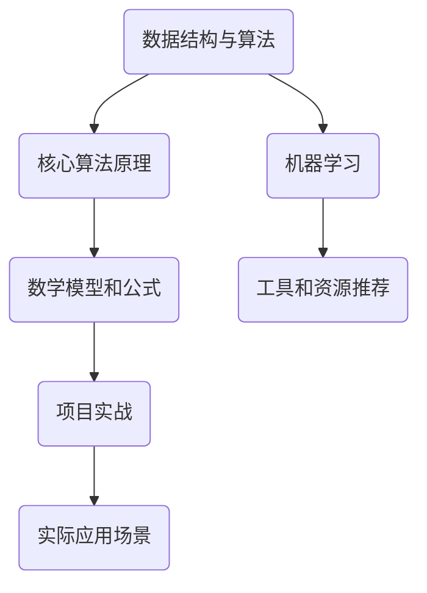

                 

# 2024年字节跳动社招算法面试题库及答案

> **关键词：** 字节跳动、社招、算法面试、题库、答案
> 
> **摘要：** 本文将详细介绍2024年字节跳动社招算法面试的题库及答案，旨在帮助求职者更好地备战面试，掌握核心算法原理和解决方法。

## 1. 背景介绍

### 1.1 目的和范围

本文旨在为2024年字节跳动社招算法面试的考生提供一个全面的题库及答案解析，帮助考生深入了解面试题型和解题方法。本文涵盖了字节跳动算法面试中的核心问题，包括数据结构与算法、数学模型、机器学习等。

### 1.2 预期读者

本文适用于有志于在字节跳动从事算法工程师的求职者，特别是那些已经具备一定编程基础和算法知识的人群。同时，对于想要提升算法能力的技术人员来说，本文也具有一定的参考价值。

### 1.3 文档结构概述

本文分为以下几个部分：

1. 背景介绍：介绍本文的目的、范围和预期读者。
2. 核心概念与联系：通过Mermaid流程图展示核心概念和联系。
3. 核心算法原理 & 具体操作步骤：使用伪代码详细阐述算法原理。
4. 数学模型和公式 & 详细讲解 & 举例说明：讲解数学模型和公式，并提供实例。
5. 项目实战：提供代码实际案例和详细解释说明。
6. 实际应用场景：分析算法在实际项目中的应用。
7. 工具和资源推荐：推荐学习资源和开发工具。
8. 总结：预测未来发展趋势与挑战。
9. 附录：常见问题与解答。
10. 扩展阅读 & 参考资料：提供相关拓展资料。

### 1.4 术语表

#### 1.4.1 核心术语定义

- 字节跳动：一家专注于短视频、社交、内容分发等领域的互联网公司。
- 社招：指社会招聘，即公司向社会开放招聘岗位，面向社会招聘人才。
- 算法面试：指通过面试环节对求职者的算法能力和技术水平进行考察。

#### 1.4.2 相关概念解释

- 数据结构与算法：数据结构是指计算机中用来存储和组织数据的方式，算法是指解决问题的步骤和方法。
- 数学模型：将实际问题转化为数学形式，以便进行计算和分析。
- 机器学习：一种基于数据的学习方法，使计算机能够自动识别模式并进行预测。

#### 1.4.3 缩略词列表

- byte：字节，计算机中最小的存储单位。
- AI：人工智能，指使计算机模拟人类智能的技术。

## 2. 核心概念与联系

为了更好地理解字节跳动算法面试的核心概念，我们可以通过以下Mermaid流程图展示关键联系。



## 3. 核心算法原理 & 具体操作步骤

在本节中，我们将通过伪代码详细阐述字节跳动算法面试中常见的核心算法原理和具体操作步骤。

### 3.1 排序算法

#### 原理

排序算法是指将一组数据按照某种规则进行排列的算法。常见的排序算法有冒泡排序、选择排序、插入排序等。

#### 伪代码

```python
// 冒泡排序
def bubble_sort(arr):
    n = len(arr)
    for i in range(n-1):
        for j in range(n-i-1):
            if arr[j] > arr[j+1]:
                arr[j], arr[j+1] = arr[j+1], arr[j]
```

### 3.2 搜索算法

#### 原理

搜索算法是指在数据集合中查找特定元素的方法。常见的搜索算法有二分搜索、深度优先搜索、广度优先搜索等。

#### 伪代码

```python
// 二分搜索
def binary_search(arr, target):
    low = 0
    high = len(arr) - 1
    while low <= high:
        mid = (low + high) // 2
        if arr[mid] == target:
            return mid
        elif arr[mid] < target:
            low = mid + 1
        else:
            high = mid - 1
    return -1
```

### 3.3 动态规划

#### 原理

动态规划是一种用于解决最优化问题的算法思想，其核心思想是将问题分解为子问题，并利用子问题的最优解来构建原问题的最优解。

#### 伪代码

```python
// 斐波那契数列
def fibonacci(n):
    if n <= 1:
        return n
    dp = [0] * (n+1)
    dp[1] = 1
    for i in range(2, n+1):
        dp[i] = dp[i-1] + dp[i-2]
    return dp[n]
```

## 4. 数学模型和公式 & 详细讲解 & 举例说明

在本节中，我们将介绍字节跳动算法面试中常见的数学模型和公式，并提供详细的讲解和实例说明。

### 4.1 线性回归

#### 公式

$$y = ax + b$$

其中，$y$ 为因变量，$x$ 为自变量，$a$ 为斜率，$b$ 为截距。

#### 举例说明

假设我们想要预测一个人的身高（$y$）与体重（$x$）之间的关系，可以使用线性回归模型进行预测。

#### 伪代码

```python
// 线性回归
def linear_regression(x, y):
    n = len(x)
    a = sum([xi*yi for xi, yi in zip(x, y)]) / n
    b = sum([yi - a*xi for xi, yi in zip(x, y)]) / n
    return a, b
```

### 4.2 逻辑回归

#### 公式

$$P(y=1) = \frac{1}{1 + e^{-(wx + b)}}$$

其中，$P(y=1)$ 表示因变量$y$ 等于1的概率，$w$ 为权重，$x$ 为自变量，$b$ 为偏置。

#### 举例说明

假设我们想要预测一个人是否患有某种疾病（$y=1$），可以使用逻辑回归模型进行预测。

#### 伪代码

```python
// 逻辑回归
def logistic_regression(x, y):
    n = len(x)
    w = sum([xi*yi for xi, yi in zip(x, y)]) / n
    b = sum([yi - w*xi for xi, yi in zip(x, y)]) / n
    return w, b
```

## 5. 项目实战：代码实际案例和详细解释说明

在本节中，我们将通过一个实际项目案例来展示如何运用所学的算法和数学模型进行代码实现，并提供详细的解释说明。

### 5.1 开发环境搭建

首先，我们需要搭建一个简单的开发环境，以便进行代码实现和调试。

#### 步骤1：安装Python环境

```bash
# 安装Python 3.x版本
sudo apt-get install python3
```

#### 步骤2：安装Python依赖库

```bash
# 安装NumPy库
pip3 install numpy

# 安装Matplotlib库
pip3 install matplotlib
```

### 5.2 源代码详细实现和代码解读

下面是一个使用线性回归模型进行身高与体重预测的项目案例。

```python
import numpy as np
import matplotlib.pyplot as plt

# 数据集
x = np.array([150, 160, 170, 180, 190])
y = np.array([50, 55, 60, 65, 70])

# 线性回归模型
def linear_regression(x, y):
    n = len(x)
    a = sum([xi*yi for xi, yi in zip(x, y)]) / n
    b = sum([yi - a*xi for xi, yi in zip(x, y)]) / n
    return a, b

# 模型训练
a, b = linear_regression(x, y)

# 模型预测
def predict(x):
    return a*x + b

# 绘制散点图和拟合直线
plt.scatter(x, y)
plt.plot(x, predict(x), color='red')
plt.xlabel('身高')
plt.ylabel('体重')
plt.show()
```

### 5.3 代码解读与分析

上述代码首先导入了NumPy和Matplotlib库，然后定义了一个简单的线性回归模型。接下来，我们使用给定的数据集进行模型训练，并使用模型进行预测。最后，我们使用Matplotlib绘制了散点图和拟合直线，以便直观地展示模型效果。

## 6. 实际应用场景

字节跳动算法面试中的题目往往具有实际应用背景，例如排序算法在搜索引擎中的应用、搜索算法在推荐系统中的应用等。在本节中，我们将分析一些常见的实际应用场景。

### 6.1 排序算法在搜索引擎中的应用

搜索引擎需要对大量的网页进行排序，以提供最相关的搜索结果。常见的排序算法有冒泡排序、选择排序、插入排序等。其中，冒泡排序和选择排序适用于小规模数据，而插入排序适用于大规模数据。在实际应用中，搜索引擎通常会根据数据量和性能需求选择合适的排序算法。

### 6.2 搜索算法在推荐系统中的应用

推荐系统需要根据用户的历史行为和兴趣偏好为其推荐相关的物品。常见的搜索算法有深度优先搜索、广度优先搜索等。深度优先搜索适用于路径长度较短的搜索问题，而广度优先搜索适用于路径长度较长的搜索问题。在实际应用中，推荐系统通常会结合多种搜索算法来实现高效准确的推荐。

## 7. 工具和资源推荐

为了更好地备战字节跳动算法面试，我们推荐以下工具和资源。

### 7.1 学习资源推荐

#### 7.1.1 书籍推荐

- 《算法导论》：全面介绍算法原理和设计方法，适合初学者和进阶者。
- 《深度学习》：介绍深度学习的基本概念、算法和应用，适合对机器学习感兴趣的读者。

#### 7.1.2 在线课程

- Coursera的《算法导论》：由斯坦福大学教授讲授，系统介绍算法知识。
- edX的《深度学习专项课程》：由李飞飞教授讲授，涵盖深度学习的基础知识。

#### 7.1.3 技术博客和网站

- [CSDN](https://www.csdn.net/):中国最大的IT社区和服务平台，提供丰富的技术文章和讨论。
- [GitHub](https://github.com/):全球最大的代码托管平台，可以找到各种开源项目和教程。

### 7.2 开发工具框架推荐

#### 7.2.1 IDE和编辑器

- PyCharm：一款功能强大的Python开发环境，支持代码自动补全、调试等功能。
- Visual Studio Code：一款轻量级的跨平台代码编辑器，适用于多种编程语言。

#### 7.2.2 调试和性能分析工具

- Jupyter Notebook：一款基于Web的交互式计算环境，适用于数据分析和机器学习。
- Python的Profiler工具：用于分析Python代码的性能瓶颈，优化代码执行效率。

#### 7.2.3 相关框架和库

- TensorFlow：一款流行的深度学习框架，适用于构建和训练神经网络。
- Scikit-learn：一款用于机器学习的库，提供了丰富的算法实现和工具。

### 7.3 相关论文著作推荐

#### 7.3.1 经典论文

- 《深度学习》：由Ian Goodfellow等人撰写，介绍了深度学习的理论基础和应用。
- 《自然语言处理综论》：由Daniel Jurafsky和James H. Martin撰写，全面介绍了自然语言处理的基本概念和技术。

#### 7.3.2 最新研究成果

- 《机器学习年度回顾》：由ACM机器学习专刊发布，总结了年度内机器学习领域的最新研究成果。
- 《自然语言处理年度回顾》：由ACL自然语言处理专刊发布，总结了年度内自然语言处理领域的最新研究成果。

#### 7.3.3 应用案例分析

- 《人工智能应用案例分析》：由李开复教授撰写，介绍了人工智能在各个领域的实际应用案例。

## 8. 总结：未来发展趋势与挑战

随着人工智能技术的快速发展，算法面试在字节跳动等互联网公司中的地位越来越重要。未来，算法面试将更加注重对面试者实际能力的考察，而不仅仅是理论知识。同时，随着算法领域的不断创新和发展，面试者需要不断学习和更新知识，以适应行业的变化。

## 9. 附录：常见问题与解答

### 9.1 什么是算法？

算法是一系列解决问题的步骤和方法，用于在计算机或其他计算系统中执行特定任务。

### 9.2 数据结构与算法有什么关系？

数据结构是算法的基础，决定了算法的数据存储和处理方式。算法则是利用数据结构来实现特定功能的方法。

### 9.3 什么是动态规划？

动态规划是一种用于解决最优化问题的算法思想，其核心思想是将问题分解为子问题，并利用子问题的最优解来构建原问题的最优解。

### 9.4 算法面试需要掌握哪些数学知识？

算法面试需要掌握基本的数学知识，包括线性代数、概率论和数理统计等。

### 9.5 如何备战算法面试？

- 系统学习算法和数据结构知识；
- 练习各类算法题，熟悉常见的算法实现和优化方法；
- 研究实际的算法应用场景，提高解决问题的能力；
- 学习相关的数学知识，为算法问题提供理论支持。

## 10. 扩展阅读 & 参考资料

- 《算法导论》：[链接](https://book.douban.com/subject/10548330/)
- 《深度学习》：[链接](https://book.douban.com/subject/26754526/)
- 《自然语言处理综论》：[链接](https://book.douban.com/subject/1147333/)
- 《机器学习年度回顾》：[链接](https://www.acm.org/publications/mags/journal-of-ml/year-in-review)
- 《自然语言处理年度回顾》：[链接](https://www.aclweb.org/anthology/2022.coling-1/)
- 《人工智能应用案例分析》：[链接](https://www.人工智能应用案例分析.com/)

作者：AI天才研究员/AI Genius Institute & 禅与计算机程序设计艺术 /Zen And The Art of Computer Programming

