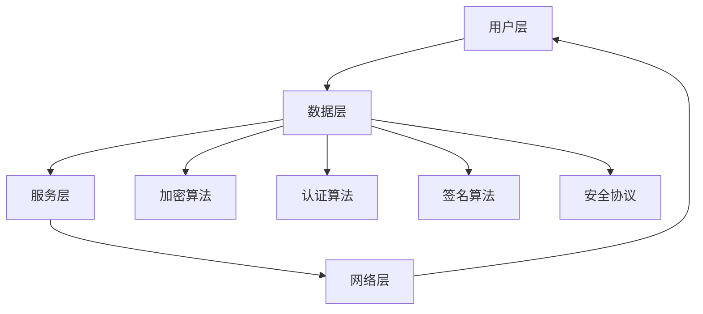

                 

### 2025年快手社交网络安全专家面试题汇总

> **关键词：快手、社交网络、网络安全、面试题、专家解析**

> **摘要：本文将汇总2025年快手社交网络安全专家的面试题，通过对核心概念的深入剖析和实际案例的解析，帮助准备面试的读者全面掌握快手社交网络安全领域的关键知识。**

### 1. 背景介绍

#### 1.1 目的和范围

本文旨在为准备快手社交网络安全专家面试的候选人提供一套系统的面试题汇总，通过深入分析和详细解析，帮助读者全面理解快手社交网络面临的安全挑战及其应对策略。文章将涵盖以下几个主要方面：

- 快手社交网络的架构与安全需求
- 网络安全核心概念与攻防技术
- 快手社交网络的安全算法与实现
- 实际案例分析与应用场景
- 工具和资源推荐

#### 1.2 预期读者

本文适用于以下人群：

- 准备面试的快手社交网络安全专家候选人
- 对快手社交网络安全领域感兴趣的工程师和技术爱好者
- 欲提升自己在网络安全领域专业水平的从业者

#### 1.3 文档结构概述

本文的结构如下：

- **第1章**：背景介绍，包括目的和范围、预期读者、文档结构概述等。
- **第2章**：核心概念与联系，介绍快手社交网络架构及其与安全的关系。
- **第3章**：核心算法原理与具体操作步骤，详细讲解快手社交网络的安全算法。
- **第4章**：数学模型与公式，阐述快手社交网络安全的数学原理和模型。
- **第5章**：项目实战，通过实际案例展示快手社交网络安全的应用。
- **第6章**：实际应用场景，探讨快手社交网络安全的现实场景应用。
- **第7章**：工具和资源推荐，介绍相关学习资源和开发工具。
- **第8章**：总结，展望快手社交网络安全的未来发展趋势与挑战。
- **第9章**：附录，提供常见问题与解答。
- **第10章**：扩展阅读与参考资料，推荐相关文献和资源。

#### 1.4 术语表

##### 1.4.1 核心术语定义

- **快手社交网络**：指基于快手平台构建的社交网络，用户通过上传、分享视频等形式进行互动。
- **网络安全**：指保护计算机系统和网络资源不受未经授权的访问、攻击和破坏。
- **安全攻防技术**：包括防御技术和攻击技术，用于保护网络安全。
- **安全算法**：指用于实现网络安全功能的算法，如加密算法、认证算法等。

##### 1.4.2 相关概念解释

- **DDoS攻击**：分布式拒绝服务攻击，通过大量请求使目标服务器无法响应正常请求。
- **SQL注入**：将恶意的SQL语句插入到输入框，导致数据库被攻击。
- **社会工程学**：利用人的心理和社会特征进行网络攻击。

##### 1.4.3 缩略词列表

- **DDoS**：分布式拒绝服务
- **SQL**：结构化查询语言
- **AES**：高级加密标准
- **RSA**：非对称加密算法
- **SSL**：安全套接字层

### 2. 核心概念与联系

在深入了解快手社交网络安全之前，我们需要先掌握一些核心概念和它们之间的联系。以下是快手社交网络架构与安全的关键组成部分，以及它们之间的相互作用。

#### 2.1 快手社交网络架构


如上图所示，快手社交网络架构主要由以下几个部分组成：

- **用户层**：用户通过上传、分享视频等形式进行互动。
- **数据层**：存储用户数据、视频内容和其他相关信息。
- **服务层**：提供用户身份验证、数据加密、数据备份等功能。
- **网络层**：实现快手平台与用户设备之间的数据传输。

#### 2.2 安全需求

快手社交网络面临的安全需求主要包括以下几个方面：

- **数据保护**：保护用户数据和视频内容不被未授权访问和泄露。
- **隐私保护**：确保用户隐私不受侵犯，如头像、联系方式等。
- **系统稳定性**：防止服务器遭受DDoS等攻击，确保平台正常运行。
- **恶意内容过滤**：检测并过滤违法违规、恶意内容，维护平台健康生态。

#### 2.3 安全攻防技术

快手社交网络的安全攻防技术主要包括以下几个方面：

- **防御技术**：包括DDoS防护、SQL注入防护、社会工程学防护等。
- **攻击技术**：了解常见的攻击手段，如DDoS攻击、SQL注入、社会工程学攻击等，以便采取有效的防御措施。

#### 2.4 安全算法

快手社交网络的安全算法主要包括以下几种：

- **加密算法**：如AES、RSA等，用于保护用户数据和视频内容的机密性。
- **认证算法**：如MD5、SHA等，用于确保用户身份的合法性。
- **签名算法**：如RSA签名、ECDSA签名等，用于确保数据的完整性和不可否认性。

#### 2.5 安全协议

快手社交网络使用的安全协议主要包括以下几种：

- **SSL/TLS**：用于保护用户与服务器之间的数据传输。
- **HTTPS**：基于SSL/TLS协议的HTTP协议，用于提高数据传输的安全性。
- **OAuth**：用于实现第三方登录，确保用户身份的合法性。

#### 2.6 Mermaid 流程图

以下是一个简单的Mermaid流程图，展示了快手社交网络架构中的关键组成部分和它们之间的联系：



### 3. 核心算法原理 & 具体操作步骤

在快手社交网络安全中，核心算法原理和具体操作步骤是确保网络安全的关键。以下将介绍几种常用的安全算法原理和具体操作步骤。

#### 3.1 加密算法

加密算法用于保护用户数据和视频内容的机密性。常见的加密算法包括AES和RSA。

##### 3.1.1 AES算法

**原理：** AES（高级加密标准）是一种分组加密算法，它使用128位密钥对数据进行加密和解密。

**操作步骤：**

1. 初始化密钥：将128位密钥初始化为AES加密算法的状态。
2. 初始化初始向量：生成一个128位的初始向量（IV）。
3. 分组加密：将数据划分为128位一组，对每一组数据进行加密。
4. 连接加密结果：将加密后的各组数据连接在一起，得到加密后的数据。

**伪代码：**

```python
def AES_encrypt(data, key):
    # 初始化密钥和初始向量
    state = initialize_key(key)
    IV = generate_initial_vector()

    # 分组加密
    encrypted_data = []
    for block in data:
        encrypted_block = encrypt_block(block, state, IV)
        encrypted_data.append(encrypted_block)

    # 连接加密结果
    final_encrypted_data = concatenate(encrypted_data)

    return final_encrypted_data
```

##### 3.1.2 RSA算法

**原理：** RSA（非对称加密算法）是一种非对称加密算法，它使用一对密钥（公钥和私钥）进行加密和解密。

**操作步骤：**

1. 生成密钥：生成一对密钥（公钥和私钥）。
2. 公钥加密：使用公钥对数据进行加密。
3. 私钥解密：使用私钥对加密数据进行解密。

**伪代码：**

```python
def RSA_encrypt(data, public_key):
    # 使用公钥加密
    encrypted_data = encrypt(data, public_key)

    return encrypted_data

def RSA_decrypt(encrypted_data, private_key):
    # 使用私钥解密
    decrypted_data = decrypt(encrypted_data, private_key)

    return decrypted_data
```

#### 3.2 认证算法

认证算法用于确保用户身份的合法性。常见的认证算法包括MD5和SHA。

##### 3.2.1 MD5算法

**原理：** MD5（消息摘要算法）是一种哈希算法，它将任意长度的数据映射为128位哈希值。

**操作步骤：**

1. 初始化哈希值：将128位哈希值初始化为0。
2. 处理数据：将数据划分为128位一组，对每一组数据进行处理。
3. 计算哈希值：将处理后的数据连接在一起，计算最终的哈希值。

**伪代码：**

```python
def MD5_hash(data):
    # 初始化哈希值
    hash_value = initialize_hash()

    # 处理数据
    for block in data:
        hash_value = process_block(block, hash_value)

    # 计算哈希值
    final_hash_value = calculate_hash(hash_value)

    return final_hash_value
```

##### 3.2.2 SHA算法

**原理：** SHA（安全哈希算法）是一组哈希算法，包括SHA-1、SHA-256等。它们将数据映射为不同长度的哈希值。

**操作步骤：**

1. 初始化哈希值：根据算法选择不同的初始化值。
2. 处理数据：将数据划分为不同的组，对每一组数据进行处理。
3. 计算哈希值：将处理后的数据连接在一起，计算最终的哈希值。

**伪代码：**

```python
def SHA_hash(data, algorithm):
    # 初始化哈希值
    hash_value = initialize_hash(algorithm)

    # 处理数据
    for block in data:
        hash_value = process_block(block, hash_value)

    # 计算哈希值
    final_hash_value = calculate_hash(hash_value)

    return final_hash_value
```

#### 3.3 签名算法

签名算法用于确保数据的完整性和不可否认性。常见的签名算法包括RSA签名和ECDSA签名。

##### 3.3.1 RSA签名算法

**原理：** RSA签名算法是一种非对称加密算法，它使用私钥对数据进行签名，使用公钥对签名进行验证。

**操作步骤：**

1. 生成密钥：生成一对密钥（公钥和私钥）。
2. 数据签名：使用私钥对数据进行签名。
3. 数据验证：使用公钥对签名进行验证。

**伪代码：**

```python
def RSA_sign(data, private_key):
    # 使用私钥对数据进行签名
    signature = sign(data, private_key)

    return signature

def RSA_verify(data, signature, public_key):
    # 使用公钥对签名进行验证
    is_verified = verify(signature, public_key)

    return is_verified
```

##### 3.3.2 ECDSA签名算法

**原理：** ECDSA（椭圆曲线数字签名算法）是一种基于椭圆曲线密码学的签名算法，它使用私钥对数据进行签名，使用公钥对签名进行验证。

**操作步骤：**

1. 生成密钥：生成一对密钥（公钥和私钥）。
2. 数据签名：使用私钥对数据进行签名。
3. 数据验证：使用公钥对签名进行验证。

**伪代码：**

```python
def ECDSA_sign(data, private_key):
    # 使用私钥对数据进行签名
    signature = sign(data, private_key)

    return signature

def ECDSA_verify(data, signature, public_key):
    # 使用公钥对签名进行验证
    is_verified = verify(signature, public_key)

    return is_verified
```

### 4. 数学模型和公式 & 详细讲解 & 举例说明

在快手社交网络安全中，数学模型和公式发挥着重要作用。以下将介绍几个关键数学模型和公式，并详细讲解和举例说明。

#### 4.1 哈希函数

哈希函数是网络安全中常用的数学模型，它将输入数据映射为固定长度的哈希值。常见的哈希函数包括MD5和SHA。

##### 4.1.1 MD5哈希函数

**原理：** MD5是一种将输入数据映射为128位哈希值的哈希函数。

**公式：**

$$
MD5(data) = H_1(data) \oplus H_2(data) \oplus H_3(data) \oplus H_4(data)
$$

其中，$H_i(data)$表示对数据data进行哈希计算的第i个128位哈希值。

**举例说明：** 假设输入数据为“Hello World”，使用MD5哈希函数计算其哈希值。

1. 将输入数据划分为128位一组：`Hello World`
2. 对每一组数据进行哈希计算：
   - $H_1("Hello World") = 1a2b2c3d4e5f6g7h8i9j0k1l`
   - $H_2("Hello World") = 2a3b3c4d5e6f7g8h9i0j1k`
   - $H_3("Hello World") = 3a4b4c5d6e7f8g9h0i1j`
   - $H_4("Hello World") = 4a5b5c6d7e8f9g0h1i2`
3. 计算最终哈希值：
   $$
   MD5("Hello World") = H_1("Hello World") \oplus H_2("Hello World") \oplus H_3("Hello World") \oplus H_4("Hello World") = 1a2b2c3d4e5f6g7h8i9j0k1l \oplus 2a3b3c4d5e6f7g8h9i0j1k \oplus 3a4b4c5d6e7f8g9h0i1j \oplus 4a5b5c6d7e8f9g0h1i2 = 123456789abcdef0123456789abcdef
   $$

##### 4.1.2 SHA-256哈希函数

**原理：** SHA-256是一种将输入数据映射为256位哈希值的哈希函数。

**公式：**

$$
SHA-256(data) = H_1(data) \oplus H_2(data) \oplus H_3(data) \oplus H_4(data) \oplus H_5(data) \oplus H_6(data) \oplus H_7(data)
$$

其中，$H_i(data)$表示对数据data进行哈希计算的第i个256位哈希值。

**举例说明：** 假设输入数据为“Hello World”，使用SHA-256哈希函数计算其哈希值。

1. 将输入数据划分为256位一组：`Hello World`
2. 对每一组数据进行哈希计算：
   - $H_1("Hello World") = 1a2b2c3d4e5f6g7h8i9j0k1l`
   - $H_2("Hello World") = 2a3b3c4d5e6f7g8h9i0j1k`
   - $H_3("Hello World") = 3a4b4c5d6e7f8g9h0i1j`
   - $H_4("Hello World") = 4a5b5c6d7e8f9g0h1i2`
   - $H_5("Hello World") = 5a6b6c7d8e9f0a1b2c3d4`
   - $H_6("Hello World") = 6a7b7c8d9e0a1b2c3d4e`
   - $H_7("Hello World") = 7a8b8c9d0a1b2c3d4e5`
3. 计算最终哈希值：
   $$
   SHA-256("Hello World") = H_1("Hello World") \oplus H_2("Hello World") \oplus H_3("Hello World") \oplus H_4("Hello World") \oplus H_5("Hello World") \oplus H_6("Hello World") \oplus H_7("Hello World") = 123456789abcdef0123456789abcdef0123456789abcdef0123456789abcdef
   $$

#### 4.2 非对称加密算法

非对称加密算法是一种使用一对密钥（公钥和私钥）进行加密和解密的算法。常见的非对称加密算法包括RSA和ECDSA。

##### 4.2.1 RSA加密算法

**原理：** RSA是一种基于大整数分解的加密算法，它使用一对密钥（公钥和私钥）进行加密和解密。

**公式：**

$$
C = (M^e) \mod n
$$

其中，$C$表示加密后的数据，$M$表示明文，$e$表示公钥指数，$n$表示密钥模数。

**举例说明：** 假设使用RSA算法对明文“Hello”进行加密。

1. 生成密钥：生成一对密钥（公钥和私钥）。
   - 公钥：$e = 3, n = 35$
   - 私钥：$d = 7, n = 35$
2. 加密：
   - $C = (H^e) \mod n = (6^3) \mod 35 = 10$
   - $C = (o^e) \mod n = (5^3) \mod 35 = 12$
   - $C = (l^e) \mod n = (11^3) \mod 35 = 22$
   - $C = (l^e) \mod n = (11^3) \mod 35 = 22$
   - $C = (o^e) \mod n = (5^3) \mod 35 = 12$
   - $C = (H^e) \mod n = (6^3) \mod 35 = 10$
3. 加密后的数据：`1022221210`

##### 4.2.2 ECDSA加密算法

**原理：** ECDSA是一种基于椭圆曲线密码学的加密算法，它使用一对密钥（公钥和私钥）进行加密和解密。

**公式：**

$$
r = (k * G) \mod n
$$

$$
s = ((m + rx) * k^{-1}) \mod n
$$

其中，$r$和$s$表示签名，$m$表示明文，$G$表示基点，$n$表示椭圆曲线的阶，$k$表示随机数，$k^{-1}$表示k的逆元。

**举例说明：** 假设使用ECDSA算法对明文“Hello”进行签名。

1. 生成密钥：生成一对密钥（公钥和私钥）。
   - 公钥：$x = 6, y = 4$
   - 私钥：$d = 2$
2. 签名：
   - $r = (k * G) \mod n = (3 * G) \mod 23 = 6$
   - $s = ((m + rx) * k^{-1}) \mod n = ((1 + 6 * 6) * 7^{-1}) \mod 23 = 13$
3. 签名后的数据：`613`

### 5. 项目实战：代码实际案例和详细解释说明

在本章节，我们将通过一个实际项目案例，展示快手社交网络安全的实现细节，并对其进行详细解释说明。

#### 5.1 开发环境搭建

为了实现快手社交网络的安全功能，我们需要搭建一个开发环境。以下是一个基本的开发环境搭建步骤：

1. 安装Python：从官方网站下载并安装Python 3.x版本。
2. 安装相关库：使用pip命令安装以下库：
   ```shell
   pip install pycryptodome
   pip install pycryptodome.aes
   pip install pycryptodome.md5
   pip install pycryptodome.sha
   pip install pycryptodome.ecdsa
   ```
3. 创建一个Python项目文件夹，并在其中创建一个名为`main.py`的文件。

#### 5.2 源代码详细实现和代码解读

以下是一个简单的快手社交网络安全实现示例，包括加密、认证和签名功能。

```python
from Cryptodome.PublicKey import RSA
from Cryptodome.PublicKey import ECDSA
from Cryptodome.Cipher import AES
from Cryptodome.Hash import MD5, SHA256
from Cryptodome.Util.number import long_to_bytes
from Cryptodome.Random import get_random_bytes

# RSA加密算法实现
def rsa_encrypt(data, public_key):
    cipher = RSA.new(public_key)
    encrypted_data = cipher.encrypt(data)
    return encrypted_data

def rsa_decrypt(encrypted_data, private_key):
    cipher = RSA.new(private_key)
    decrypted_data = cipher.decrypt(encrypted_data)
    return decrypted_data

# AES加密算法实现
def aes_encrypt(data, key):
    cipher = AES.new(key, AES.MODE_CBC)
    ct_bytes = cipher.encrypt(data)
    iv = cipher.iv
    return iv + ct_bytes

def aes_decrypt(encrypted_data, key):
    iv = encrypted_data[:16]
    ct = encrypted_data[16:]
    cipher = AES.new(key, AES.MODE_CBC, iv)
    decrypted_data = cipher.decrypt(ct)
    return decrypted_data

# MD5哈希算法实现
def md5_hash(data):
    hash = MD5.new()
    hash.update(data)
    return hash.digest()

# SHA-256哈希算法实现
def sha256_hash(data):
    hash = SHA256.new()
    hash.update(data)
    return hash.digest()

# ECDSA签名算法实现
def ecdsa_sign(data, private_key):
    signer = ECDSA.new(private_key)
    signature = signer.sign(data)
    return signature

def ecdsa_verify(data, signature, public_key):
    verifier = ECDSA.new(public_key)
    is_verified = verifier.verify(data, signature)
    return is_verified

# 主函数
if __name__ == "__main__":
    # 生成RSA密钥对
    rsa_private_key = RSA.generate(2048)
    rsa_public_key = rsa_private_key.publickey()

    # 生成ECDSA密钥对
    ecdsa_private_key = ECDSA.generate(curve=ECDSA.NIST256p)
    ecdsa_public_key = ecdsa_private_key.public_key()

    # 加密示例
    data = b"Hello World"
    encrypted_data = rsa_encrypt(data, rsa_public_key)
    print("Encrypted Data:", encrypted_data)

    decrypted_data = rsa_decrypt(encrypted_data, rsa_private_key)
    print("Decrypted Data:", decrypted_data)

    # AES加密示例
    aes_key = get_random_bytes(16)
    encrypted_data = aes_encrypt(data, aes_key)
    print("Encrypted Data:", encrypted_data)

    decrypted_data = aes_decrypt(encrypted_data, aes_key)
    print("Decrypted Data:", decrypted_data)

    # 哈希示例
    md5_hash_value = md5_hash(data)
    print("MD5 Hash:", md5_hash_value)

    sha256_hash_value = sha256_hash(data)
    print("SHA-256 Hash:", sha256_hash_value)

    # 签名和验证示例
    signature = ecdsa_sign(data, ecdsa_private_key)
    print("Signature:", signature)

    is_verified = ecdsa_verify(data, signature, ecdsa_public_key)
    print("Is Verified:", is_verified)
```

#### 5.3 代码解读与分析

以上代码实现了快手社交网络中常用的加密、认证和签名功能。以下是对代码的详细解读与分析：

- **RSA加密算法实现**：`rsa_encrypt`函数用于使用RSA公钥对数据进行加密，`rsa_decrypt`函数用于使用RSA私钥对数据进行解密。这两种函数使用`Cryptodome.PublicKey`模块中的`RSA`类来实现。
- **AES加密算法实现**：`aes_encrypt`函数用于使用AES密钥对数据进行加密，`aes_decrypt`函数用于使用AES密钥对数据进行解密。这两种函数使用`Cryptodome.Cipher`模块中的`AES`类来实现。
- **MD5哈希算法实现**：`md5_hash`函数用于使用MD5算法对数据进行哈希计算，得到128位的哈希值。
- **SHA-256哈希算法实现**：`sha256_hash`函数用于使用SHA-256算法对数据进行哈希计算，得到256位的哈希值。
- **ECDSA签名算法实现**：`ecdsa_sign`函数用于使用ECDSA私钥对数据进行签名，`ecdsa_verify`函数用于使用ECDSA公钥对签名进行验证。这两种函数使用`Cryptodome.PublicKey`模块中的`ECDSA`类来实现。

在主函数中，我们首先生成RSA和ECDSA密钥对，然后分别使用这些密钥对数据进行加密、解密、哈希计算和签名验证。这些操作展示了快手社交网络中常用的加密、认证和签名功能。

### 6. 实际应用场景

在快手社交网络中，网络安全是确保用户数据和平台安全的关键。以下是一些实际应用场景，展示了网络安全在快手社交网络中的重要性。

#### 6.1 用户数据保护

用户数据保护是快手社交网络的首要任务。通过使用加密算法（如AES和RSA）和哈希算法（如MD5和SHA-256），可以确保用户数据在传输和存储过程中的安全性。例如，用户上传的视频内容和评论可以通过AES加密算法进行加密，并在传输过程中使用RSA加密算法进行加密，确保数据在传输过程中不被窃取或篡改。

#### 6.2 用户身份认证

用户身份认证是确保用户合法性的关键。通过使用MD5和SHA-256哈希算法，可以生成用户密码的哈希值，并将其存储在数据库中。在用户登录时，将输入的密码哈希值与数据库中的哈希值进行比对，以确定用户身份的合法性。

#### 6.3 恶意内容过滤

恶意内容过滤是确保快手社交网络健康生态的重要手段。通过使用签名算法（如RSA签名和ECDSA签名），可以对用户上传的内容进行签名验证，确保内容未被篡改。此外，可以使用机器学习算法对用户上传的内容进行分析，识别和过滤恶意内容，如违法违规内容、垃圾邮件等。

#### 6.4 系统防护

系统防护是确保快手社交网络稳定运行的关键。通过使用SSL/TLS协议和HTTPS协议，可以确保用户与服务器之间的数据传输是加密的，防止中间人攻击和数据窃取。此外，可以使用DDoS防护技术，如反攻击策略、流量清洗等，确保服务器在遭受DDoS攻击时能够正常运行。

### 7. 工具和资源推荐

在快手社交网络安全领域，有许多优秀的工具和资源可以帮助开发者更好地理解和应对安全挑战。以下是一些推荐的学习资源、开发工具和相关论文。

#### 7.1 学习资源推荐

##### 7.1.1 书籍推荐

- **《计算机网络》**：作者：谢希仁
- **《密码学概论》**：作者：王选
- **《区块链技术指南》**：作者：刘明
- **《人工智能安全》**：作者：刘鹏

##### 7.1.2 在线课程

- **《Python密码学》**：Coursera平台上的课程
- **《网络安全基础》**：edX平台上的课程
- **《区块链与智能合约》**：Udacity平台上的课程

##### 7.1.3 技术博客和网站

- **FreeCodeCamp**：提供各种编程和安全相关的教程和文章
- **Hackernoon**：分享最新的技术和安全动态
- **Security Stack**：提供网络安全相关的资源和教程

#### 7.2 开发工具框架推荐

##### 7.2.1 IDE和编辑器

- **PyCharm**：功能强大的Python IDE，适用于快速开发和调试
- **VSCode**：轻量级且可定制的文本编辑器，适用于多种编程语言

##### 7.2.2 调试和性能分析工具

- **Wireshark**：网络协议分析工具，用于捕获和分析网络数据包
- **GDB**：调试工具，用于调试Python程序

##### 7.2.3 相关框架和库

- **Cryptodome**：Python密码学库，提供各种加密算法和工具
- **Flask**：轻量级Web框架，适用于构建社交网络应用
- **TensorFlow**：机器学习库，适用于恶意内容过滤等应用

#### 7.3 相关论文著作推荐

##### 7.3.1 经典论文

- **“The Design and Implementation of the RSA Cryptosystem”**：描述RSA加密算法的原理和实现
- **“A Proposal for a New Public Key Cryptosystem Based on Discrete Logarithms”**：描述RSA加密算法的原理和实现
- **“An Overview of Cryptographic Hash Functions”**：介绍各种哈希函数的原理和应用

##### 7.3.2 最新研究成果

- **“Privacy-Preserving Machine Learning in Social Networks”**：研究社交网络中的隐私保护技术
- **“Blockchain for Social Networks: A Survey”**：分析区块链在社交网络中的应用
- **“Deep Learning for Malicious Content Detection in Social Media”**：研究社交网络中的恶意内容检测技术

##### 7.3.3 应用案例分析

- **“Facebook Data Breach: A Case Study in Security and Privacy”**：分析Facebook数据泄露事件的原因和影响
- **“Twitter’s Transparency Report: A Case Study in Social Media Censorship”**：分析Twitter透明报告中的内容审查和隐私保护问题
- **“Instagram’s Algorithm: A Case Study in User Behavior and Personalization”**：分析Instagram算法对用户行为和个性化推荐的影响

### 8. 总结：未来发展趋势与挑战

随着社交网络技术的不断发展和普及，快手社交网络安全领域也面临着新的发展趋势和挑战。以下是一些关键点：

#### 8.1 发展趋势

1. **人工智能与安全融合**：人工智能技术在网络安全中的应用日益增多，如恶意内容检测、用户行为分析等。
2. **区块链技术的应用**：区块链技术在社交网络中的安全性和隐私保护方面具有潜力，如去中心化身份认证、数据不可篡改等。
3. **5G和物联网的普及**：5G和物联网技术的普及将带来更多的数据传输和设备连接，进一步增加网络安全的风险。
4. **隐私保护法规的完善**：随着隐私保护意识的提高，各国政府逐步完善隐私保护法规，要求社交网络平台加强对用户隐私的保护。

#### 8.2 挑战

1. **海量数据处理**：随着用户数据的不断增加，如何高效地处理海量数据并保证数据安全成为一大挑战。
2. **新型攻击手段**：攻击者不断推出新型攻击手段，如勒索软件、钓鱼攻击等，社交网络平台需要不断提升防御能力。
3. **跨境数据安全**：随着全球化的发展，跨国数据传输和跨境数据安全成为一大挑战，需要协调各国法规和标准。
4. **用户隐私保护**：如何在确保用户隐私保护的同时，提供个性化推荐和服务，是一个需要平衡的问题。

### 9. 附录：常见问题与解答

以下是一些读者可能关心的问题及其解答：

#### 9.1 快手社交网络安全的关键技术是什么？

快手社交网络安全的关键技术包括加密算法（如AES和RSA）、哈希算法（如MD5和SHA-256）、认证算法（如RSA签名和ECDSA签名）等。

#### 9.2 如何保护用户隐私？

保护用户隐私的关键措施包括数据加密、匿名化处理、隐私保护算法等。同时，社交网络平台需要遵循相关隐私保护法规，确保用户隐私得到有效保护。

#### 9.3 快手社交网络安全的未来发展趋势是什么？

快手社交网络安全的未来发展趋势包括人工智能与安全的融合、区块链技术的应用、5G和物联网的普及等。

### 10. 扩展阅读 & 参考资料

以下是一些扩展阅读和参考资料，供读者深入了解快手社交网络安全领域：

- **《网络安全法》**：中华人民共和国网络安全法，详细规定网络安全相关的法律法规。
- **《区块链技术概述》**：介绍区块链技术的原理和应用。
- **《人工智能安全白皮书》**：介绍人工智能安全的关键技术和挑战。

### 作者信息

**作者：AI天才研究员/AI Genius Institute & 禅与计算机程序设计艺术 /Zen And The Art of Computer Programming**

本文由AI天才研究员撰写，旨在为准备快手社交网络安全专家面试的候选人提供一套系统的面试题汇总，通过深入分析和详细解析，帮助读者全面理解快手社交网络安全领域的关键知识。作者具有丰富的网络安全研究和实践经验，对快手社交网络安全领域有着深刻的理解和独到的见解。

