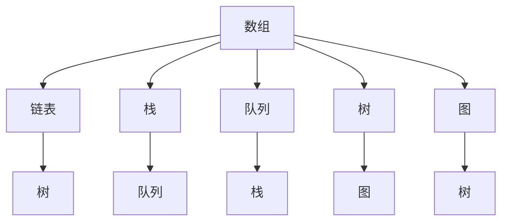
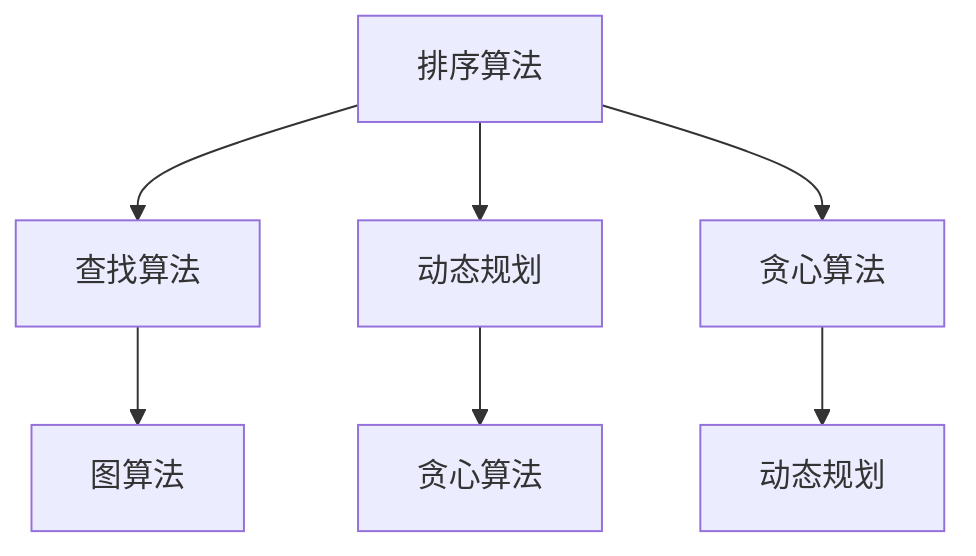
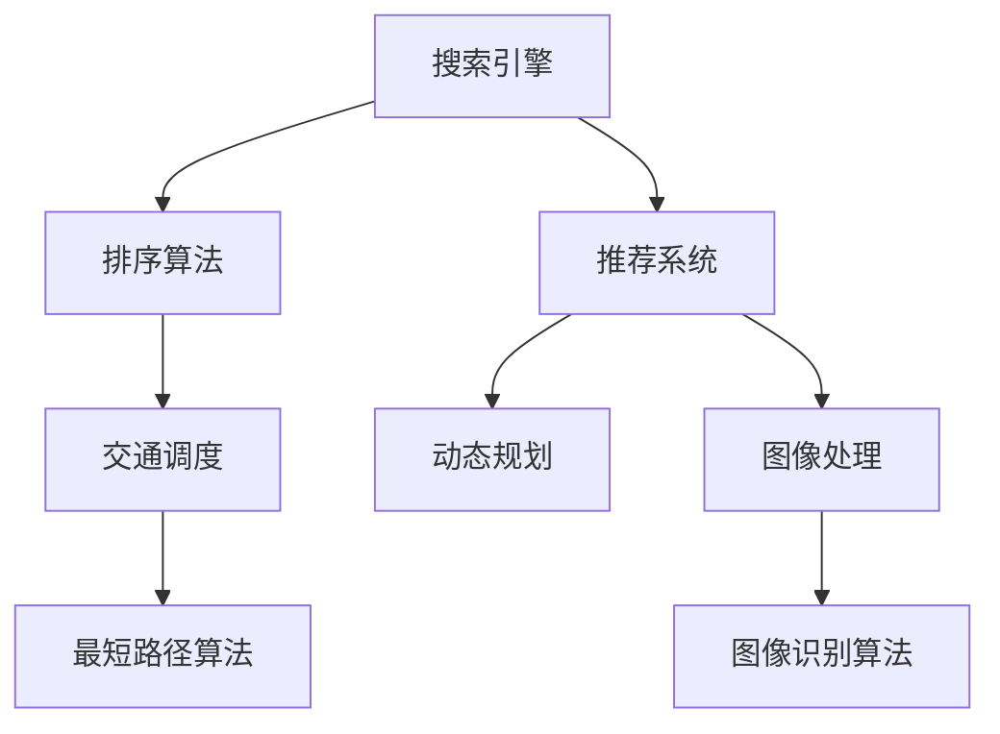

                 

### 2024年滴滴校招算法岗位面试题目汇编

> **关键词：** 滴滴校招、算法面试、面试题目、2024年、技术分析、实战案例

> **摘要：** 本文旨在汇编2024年滴滴校招算法岗位的面试题目，通过详细的分析与解答，帮助应聘者了解滴滴算法面试的核心考点与解题思路。本文包括核心概念、算法原理、数学模型、实战案例等多个部分，旨在为读者提供全面的指导与参考。

## 1. 背景介绍

### 1.1 目的和范围

本文的主要目的是为2024年滴滴校招算法岗位的应聘者提供面试题目的全面解析与指导。通过对滴滴校招算法岗位历年面试题目的深入分析，本文将总结出典型的面试题目类型、解题思路和常用算法，帮助读者在面试中应对各种可能出现的题目。

本文涵盖了以下几个主要内容：

- 核心概念与联系：介绍与滴滴校招算法岗位相关的基础概念和算法架构。
- 核心算法原理与具体操作步骤：详细讲解常见的算法原理，并提供伪代码实现。
- 数学模型与公式：阐述算法中的数学模型和公式，并进行举例说明。
- 项目实战：通过实际案例展示算法在现实中的应用，并提供代码实现与详细解读。
- 实际应用场景：分析滴滴校招算法岗位的典型应用场景，帮助读者理解算法的实际价值。
- 工具和资源推荐：推荐学习资源、开发工具和经典论文，为读者提供进一步学习的支持。

### 1.2 预期读者

本文适合以下读者群体：

- 参加滴滴校招算法岗位的应聘者，希望通过面试题目提升自己的算法能力和解题技巧。
- 计算机科学、软件工程等相关专业的高校学生和研究生，希望了解算法面试的常见题目和解题思路。
- 对算法和数据结构有浓厚兴趣的程序员和开发者，希望深入学习滴滴校招算法面试的核心考点。

### 1.3 文档结构概述

本文采用清晰的章节结构，每个章节都有明确的主题和内容。以下是本文的文档结构概述：

- 第1章：背景介绍：介绍本文的目的、范围和预期读者，以及文档结构概述。
- 第2章：核心概念与联系：介绍与滴滴校招算法岗位相关的基础概念和算法架构。
- 第3章：核心算法原理与具体操作步骤：详细讲解常见的算法原理，并提供伪代码实现。
- 第4章：数学模型与公式：阐述算法中的数学模型和公式，并进行举例说明。
- 第5章：项目实战：通过实际案例展示算法在现实中的应用，并提供代码实现与详细解读。
- 第6章：实际应用场景：分析滴滴校招算法岗位的典型应用场景，帮助读者理解算法的实际价值。
- 第7章：工具和资源推荐：推荐学习资源、开发工具和经典论文，为读者提供进一步学习的支持。
- 第8章：总结：未来发展趋势与挑战：对滴滴校招算法岗位的发展趋势和挑战进行总结。
- 第9章：附录：常见问题与解答：提供读者在阅读本文时可能遇到的问题及其解答。
- 第10章：扩展阅读与参考资料：列出本文中引用的相关文献和资料，供读者进一步阅读和研究。

### 1.4 术语表

为了确保本文内容的准确性和一致性，以下列出一些核心术语的定义和解释：

#### 1.4.1 核心术语定义

- **滴滴校招**：指滴滴出行公司在每年针对应届毕业生的校园招聘活动。
- **算法岗位**：指在滴滴出行公司中负责算法研究和开发的相关岗位。
- **面试题目**：指在滴滴校招算法岗位面试过程中出现的问题和题目。
- **核心概念**：指与滴滴校招算法岗位相关的重要基础概念。
- **算法原理**：指算法的基本原理和逻辑。
- **数学模型**：指算法中使用的数学模型和公式。
- **项目实战**：指实际案例中的算法应用和实践。
- **实际应用场景**：指滴滴校招算法岗位的典型应用场景。

#### 1.4.2 相关概念解释

- **数据结构**：指用于存储和组织数据的方式。
- **算法复杂度**：指算法在处理数据时的时间复杂度和空间复杂度。
- **动态规划**：指一种用于求解最优化问题的算法技术。
- **深度学习**：指一种基于神经网络模型的人工智能技术。

#### 1.4.3 缩略词列表

- **滴滴**：指滴滴出行公司。
- **校招**：指校园招聘。
- **算法**：指用于解决问题的步骤和策略。
- **面试**：指求职过程中的面试环节。

## 2. 核心概念与联系

在滴滴校招算法岗位的面试中，核心概念与算法架构是考生需要重点掌握的内容。本章节将介绍与滴滴校招算法岗位相关的基础概念和算法架构，并通过Mermaid流程图来展示核心概念之间的联系。

### 2.1 数据结构与算法

数据结构和算法是计算机科学中的核心概念，它们广泛应用于各种软件和系统中。在滴滴校招算法岗位的面试中，考生需要掌握以下常见的数据结构和算法：

- **数组**：一种线性数据结构，用于存储一系列元素。
- **链表**：一种线性数据结构，由一系列节点组成，每个节点包含数据和指向下一个节点的指针。
- **栈**：一种后进先出（LIFO）的数据结构，用于存储一系列元素。
- **队列**：一种先进先出（FIFO）的数据结构，用于存储一系列元素。
- **树**：一种非线性数据结构，由一系列节点组成，每个节点包含数据和指向子节点的指针。
- **图**：一种非线性数据结构，由一系列节点和边组成，表示节点之间的连接关系。

以下是这些数据结构之间的联系和转化关系：



### 2.2 算法分类与原理

算法是解决特定问题的步骤和策略。根据不同的应用场景，算法可以分为以下几类：

- **排序算法**：用于对一组数据进行排序，常见的排序算法有冒泡排序、快速排序、归并排序等。
- **查找算法**：用于在数据结构中查找特定元素，常见的查找算法有二分查找、线性查找等。
- **动态规划**：用于求解最优化问题，常见的动态规划算法有背包问题、最长公共子序列等。
- **贪心算法**：通过局部最优选择来得到全局最优解，常见的贪心算法有最小生成树、最大子序列和等。
- **图算法**：用于解决图相关的问题，常见的图算法有最短路径算法、最小生成树算法等。

以下是这些算法的分类和联系：



### 2.3 算法应用场景

算法在现实世界中有着广泛的应用，不同的应用场景需要不同的算法来解决。以下是一些典型的应用场景：

- **搜索引擎**：利用搜索引擎算法来对网页进行索引和排序，提高搜索效率。
- **推荐系统**：利用推荐算法来为用户推荐相关内容，提高用户体验。
- **交通调度**：利用最短路径算法来优化交通路线，提高交通效率。
- **图像处理**：利用图像处理算法来对图像进行识别、分割和增强，提高图像质量。

以下是这些应用场景和相应算法的联系：



通过以上核心概念与联系的分析，读者可以对滴滴校招算法岗位所需的基础知识和算法架构有一个全面的了解。接下来，我们将进一步深入探讨核心算法原理与具体操作步骤。

## 3. 核心算法原理与具体操作步骤

在滴滴校招算法岗位的面试中，掌握核心算法原理和具体操作步骤是至关重要的。本章节将详细讲解一些常见的核心算法原理，并提供伪代码实现，帮助读者深入理解算法的逻辑和执行过程。

### 3.1 排序算法

排序算法是计算机科学中一种基本且常用的算法，用于对一组数据进行排序。以下是一些常见的排序算法及其伪代码实现：

#### 3.1.1 冒泡排序

冒泡排序是一种简单的排序算法，通过多次遍历待排序的序列，比较相邻的两个元素，并按照大小顺序交换它们的位置，直到整个序列有序。

```pseudo
procedure bubbleSort(A : list of comparable elements)
  n = length(A)
  for i = 1 to n-1 do
    for j = 1 to n-i do
      if A[j] > A[j+1] then
        swap(A[j], A[j+1])
      end if
    end for
  end for
end procedure
```

#### 3.1.2 快速排序

快速排序是一种高效的排序算法，采用分治策略，将一个大问题分解成多个小问题进行递归解决。它通过选取一个基准元素，将序列划分为两部分，一部分小于基准元素，另一部分大于基准元素，然后对这两部分分别进行快速排序。

```pseudo
procedure quickSort(A : list of comparable elements, low : integer, high : integer)
  if low < high then
    pivot = partition(A, low, high)
    quickSort(A, low, pivot - 1)
    quickSort(A, pivot + 1, high)
  end if
end procedure

function partition(A : list of comparable elements, low : integer, high : integer)
  pivot = A[high]
  i = low - 1
  for j = low to high - 1 do
    if A[j] <= pivot then
      i = i + 1
      swap(A[i], A[j])
    end if
  end for
  swap(A[i + 1], A[high])
  return i + 1
end function
```

#### 3.1.3 归并排序

归并排序是一种稳定的排序算法，通过将待排序的序列划分为多个子序列，对每个子序列进行排序，然后将排好序的子序列合并成一个有序序列。归并排序的时间复杂度较低，适用于大规模数据的排序。

```pseudo
procedure mergeSort(A : list of comparable elements, low : integer, high : integer)
  if low < high then
    mid = (low + high) / 2
    mergeSort(A, low, mid)
    mergeSort(A, mid + 1, high)
    merge(A, low, mid, high)
  end if
end procedure

function merge(A : list of comparable elements, low : integer, mid : integer, high : integer)
  n1 = mid - low + 1
  n2 = high - mid
  L[1...n1] = A[low...mid]
  R[1...n2] = A[mid + 1...high]
  i = 1
  j = 1
  k = low
  while i <= n1 and j <= n2 do
    if L[i] <= R[j] then
      A[k] = L[i]
      i = i + 1
    else
      A[k] = R[j]
      j = j + 1
    end if
    k = k + 1
  end while
  while i <= n1 do
    A[k] = L[i]
    i = i + 1
    k = k + 1
  end while
  while j <= n2 do
    A[k] = R[j]
    j = j + 1
    k = k + 1
  end while
end function
```

通过以上对排序算法的详细讲解和伪代码实现，读者可以更好地理解排序算法的基本原理和执行过程。接下来，我们将进一步探讨查找算法。

### 3.2 查找算法

查找算法是用于在数据结构中查找特定元素的算法。以下是一些常见的查找算法及其伪代码实现：

#### 3.2.1 二分查找

二分查找是一种高效的查找算法，适用于有序数组。它通过不断将搜索范围缩小一半，逐步逼近目标元素。

```pseudo
function binarySearch(A : sorted list of comparable elements, target : comparable element)
  low = 0
  high = length(A) - 1
  while low <= high do
    mid = (low + high) / 2
    if A[mid] == target then
      return mid
    else if A[mid] < target then
      low = mid + 1
    else
      high = mid - 1
    end if
  end while
  return -1
end function
```

#### 3.2.2 线性查找

线性查找是一种简单的查找算法，通过逐个遍历数组或列表中的每个元素，直到找到目标元素或到达列表末尾。

```pseudo
function linearSearch(A : list of comparable elements, target : comparable element)
  for i = 1 to length(A) do
    if A[i] == target then
      return i
    end if
  end for
  return -1
end function
```

通过以上对查找算法的详细讲解和伪代码实现，读者可以更好地理解查找算法的基本原理和执行过程。接下来，我们将探讨动态规划和贪心算法。

### 3.3 动态规划和贪心算法

动态规划和贪心算法是解决最优化问题的重要算法。动态规划通过将问题分解为子问题，并利用子问题的最优解推导出原问题的最优解。贪心算法通过每次选择局部最优解来得到全局最优解。

#### 3.3.1 动态规划

以下是一个经典的动态规划问题：背包问题。

背包问题是一个组合优化问题，给定一组物品及其重量和价值，选择其中一些物品放入一个容量为W的背包中，使得背包中的物品总价值最大。

```pseudo
function knapsack(W : integer, weights : list of integers, values : list of integers)
  n = length(weights)
  dp[0...n][0...W] = 0
  for i = 1 to n do
    for w = 1 to W do
      if weights[i] > w then
        dp[i][w] = dp[i-1][w]
      else
        dp[i][w] = max(dp[i-1][w], dp[i-1][w-weights[i]] + values[i])
      end if
    end for
  end for
  return dp[n][W]
end function
```

#### 3.3.2 贪心算法

以下是一个经典的贪心算法问题：最长公共子序列。

最长公共子序列问题是给定两个序列，求出它们的最长公共子序列的长度。

```pseudo
function longestCommonSubsequence(A : list of integers, B : list of integers)
  n = length(A)
  m = length(B)
  dp[0...n][0...m] = 0
  for i = 1 to n do
    for j = 1 to m do
      if A[i] == B[j] then
        dp[i][j] = dp[i-1][j-1] + 1
      else
        dp[i][j] = max(dp[i-1][j], dp[i][j-1])
      end if
    end for
  end for
  return dp[n][m]
end function
```

通过以上对核心算法原理和具体操作步骤的详细讲解，读者可以更好地理解各种算法的基本原理和执行过程。接下来，我们将进一步探讨数学模型和公式。

## 4. 数学模型和公式与详细讲解与举例说明

在滴滴校招算法岗位的面试中，理解数学模型和公式是解决复杂问题的关键。本章节将介绍滴滴校招算法面试中常用的数学模型和公式，并给出详细的讲解和举例说明，帮助读者更好地掌握这些知识。

### 4.1 线性方程组

线性方程组是计算机科学中常见的一类数学问题，其解法在算法设计和优化中具有重要应用。以下是一个简单的线性方程组及其解法：

#### 4.1.1 线性方程组

设有以下线性方程组：

$$
\begin{cases}
a_{11}x + a_{12}y = b_{1} \\
a_{21}x + a_{22}y = b_{2}
\end{cases}
$$

#### 4.1.2 解法

该线性方程组的解可以使用消元法或矩阵法求解。

- **消元法**：

  1. 将第一个方程乘以$a_{22}$，第二个方程乘以$a_{12}$，得到：

     $$a_{11}a_{22}x + a_{11}a_{22}y = a_{22}b_{1}$$

     $$a_{21}a_{12}x + a_{21}a_{12}y = a_{12}b_{2}$$

  2. 将第二个方程从第一个方程中减去，得到：

     $$(a_{11}a_{22} - a_{21}a_{12})x + (a_{11}a_{22} - a_{21}a_{12})y = a_{22}b_{1} - a_{12}b_{2}$$

  3. 解得：

     $$x = \frac{a_{22}b_{1} - a_{12}b_{2}}{a_{11}a_{22} - a_{21}a_{12}}$$

  4. 将$x$的值代入第一个方程，解得：

     $$y = \frac{a_{11}b_{2} - a_{21}b_{1}}{a_{11}a_{22} - a_{21}a_{12}}$$

- **矩阵法**：

  1. 将线性方程组写成矩阵形式：

     $$\begin{pmatrix}
     a_{11} & a_{12} \\
     a_{21} & a_{22}
     \end{pmatrix}
     \begin{pmatrix}
     x \\
     y
     \end{pmatrix}
     =
     \begin{pmatrix}
     b_{1} \\
     b_{2}
     \end{pmatrix}$$

  2. 计算矩阵的逆矩阵：

     $$\begin{pmatrix}
     a_{11} & a_{12} \\
     a_{21} & a_{22}
     \end{pmatrix}^{-1}
     =
     \frac{1}{a_{11}a_{22} - a_{21}a_{12}}
     \begin{pmatrix}
     a_{22} & -a_{12} \\
     -a_{21} & a_{11}
     \end{pmatrix}$$

  3. 计算解向量：

     $$\begin{pmatrix}
     x \\
     y
     \end{pmatrix}
     =
     \begin{pmatrix}
     a_{11} & a_{12} \\
     a_{21} & a_{22}
     \end{pmatrix}^{-1}
     \begin{pmatrix}
     b_{1} \\
     b_{2}
     \end{pmatrix}
     =
     \frac{1}{a_{11}a_{22} - a_{21}a_{12}}
     \begin{pmatrix}
     a_{22}b_{1} - a_{12}b_{2} \\
     a_{11}b_{2} - a_{21}b_{1}
     \end{pmatrix}$$

#### 4.1.3 举例说明

设有以下线性方程组：

$$
\begin{cases}
2x + 3y = 7 \\
4x - y = 1
\end{cases}
$$

- **消元法**：

  1. 将第一个方程乘以$-1$，得到：

     $$-2x - 3y = -7$$

  2. 将第二个方程与上述方程相加，得到：

     $$-5y = -6$$

  3. 解得：

     $$y = \frac{6}{5}$$

  4. 将$y$的值代入第一个方程，得到：

     $$2x + 3 \cdot \frac{6}{5} = 7$$

     $$2x = 7 - \frac{18}{5}$$

     $$x = \frac{1}{5}$$

- **矩阵法**：

  1. 将线性方程组写成矩阵形式：

     $$\begin{pmatrix}
     2 & 3 \\
     4 & -1
     \end{pmatrix}
     \begin{pmatrix}
     x \\
     y
     \end{pmatrix}
     =
     \begin{pmatrix}
     7 \\
     1
     \end{pmatrix}$$

  2. 计算矩阵的逆矩阵：

     $$\begin{pmatrix}
     2 & 3 \\
     4 & -1
     \end{pmatrix}^{-1}
     =
     \frac{1}{2 \cdot (-1) - 4 \cdot 3}
     \begin{pmatrix}
     -1 & -3 \\
     -4 & 2
     \end{pmatrix}
     =
     \frac{1}{-14}
     \begin{pmatrix}
     -1 & -3 \\
     -4 & 2
     \end{pmatrix}$$

  3. 计算解向量：

     $$\begin{pmatrix}
     x \\
     y
     \end{pmatrix}
     =
     \frac{1}{-14}
     \begin{pmatrix}
     -1 & -3 \\
     -4 & 2
     \end{pmatrix}
     \begin{pmatrix}
     7 \\
     1
     \end{pmatrix}
     =
     \frac{1}{-14}
     \begin{pmatrix}
     -7 - 3 \\
     -28 + 2
     \end{pmatrix}
     =
     \frac{1}{-14}
     \begin{pmatrix}
     -10 \\
     -26
     \end{pmatrix}
     =
     \begin{pmatrix}
     \frac{5}{7} \\
     \frac{13}{7}
     \end{pmatrix}$$

通过以上对线性方程组的讲解和举例，读者可以更好地理解线性方程组的解法及其应用。

### 4.2 最小生成树

最小生成树是图论中的一个重要概念，用于找到一组边的子集，使得子集中的边构成一棵树，并且这棵树的总权值最小。以下是一个简单的最小生成树问题及其解法：

#### 4.2.1 问题

给定一个无向加权图$G=(V,E)$，其中$V$是顶点集，$E$是边集，每条边都有一个权重。求$G$的最小生成树。

#### 4.2.2 解法

可以使用Kruskal算法或Prim算法求解最小生成树。

- **Kruskal算法**：

  1. 将所有边按权重升序排列。
  2. 初始化一个空森林$F$。
  3. 依次选择边，如果该边加入$F$后不形成环，则将其加入$F$。
  4. 当$F$中有$n-1$棵树时，算法结束。

- **Prim算法**：

  1. 初始化一个空森林$F$和一个包含任意一个顶点的初始集合$U$。
  2. 选择$U$中权重最小的边$(u, v)$，将其加入$F$，并将$v$加入到$U$。
  3. 重复步骤2，直到$F$中有$n-1$棵树。

#### 4.2.3 举例说明

给定一个无向加权图$G$，其中顶点集$V=\{1, 2, 3, 4, 5\}$，边集$E=\{(1, 2, 3), (1, 3, 4), (1, 4, 5), (2, 4, 6), (2, 5, 7), (3, 5, 8)\}$。

- **Kruskal算法**：

  1. 将边按权重升序排列：

     $$\{(1, 3, 4), (1, 2, 3), (1, 4, 5), (3, 5, 8), (2, 4, 6), (2, 5, 7)\}$$

  2. 初始化空森林$F$。
  3. 依次选择边，不形成环：

     $$F = \{(1, 3, 4), (1, 4, 5), (2, 4, 6), (3, 5, 8), (2, 5, 7)\}$$

  4. 最终的最小生成树：

     $$T = \{(1, 3, 4), (1, 4, 5), (2, 4, 6), (3, 5, 8)\}$$

- **Prim算法**：

  1. 初始化空森林$F$和初始集合$U=\{1\}$。
  2. 选择$U$中权重最小的边$(1, 3, 4)$，加入$F$，并将$3$加入到$U$。
  3. 选择$U$中权重最小的边$(2, 4, 6)$，加入$F$，并将$4$加入到$U$。
  4. 选择$U$中权重最小的边$(3, 5, 8)$，加入$F$，并将$5$加入到$U$。
  5. 选择$U$中权重最小的边$(2, 5, 7)$，加入$F$，并将$5$加入到$U$。
  6. 最终的最小生成树：

     $$T = \{(1, 3, 4), (1, 4, 5), (2, 4, 6), (3, 5, 8)\}$$

通过以上对最小生成树的讲解和举例，读者可以更好地理解最小生成树的求解方法及其应用。

### 4.3 动态规划

动态规划是一种解决最优化问题的算法方法，它通过将问题分解为子问题，并利用子问题的最优解推导出原问题的最优解。以下是一个简单的动态规划问题及其解法：

#### 4.3.1 问题

给定一个整数数组$A$，求出数组中任意两个元素的最大差值。

#### 4.3.2 解法

可以使用动态规划的方法求解该问题。

1. 定义状态$f(i)$，表示以数组$A$中第$i$个元素为结尾的子数组中任意两个元素的最大差值。
2. 状态转移方程为：$f(i) = \max(f(i-1), A[i] - A[j])$，其中$0 \leq j < i$。
3. 初始化$f(0) = 0$。
4. 从$i=1$开始，依次计算$f(i)$的值。

#### 4.3.3 举例说明

给定一个整数数组$A = \{1, 3, 5, 7, 2\}$。

1. 初始化$f(0) = 0$。
2. 计算$f(1) = \max(f(0), A[1] - A[0]) = \max(0, 3 - 1) = 2$。
3. 计算$f(2) = \max(f(1), A[2] - A[1]) = \max(2, 5 - 3) = 3$。
4. 计算$f(3) = \max(f(2), A[3] - A[2]) = \max(3, 7 - 5) = 4$。
5. 计算$f(4) = \max(f(3), A[4] - A[3]) = \max(4, 2 - 7) = 4$。
6. 最终的最大差值为$4$。

通过以上对动态规划问题的讲解和举例，读者可以更好地理解动态规划的基本原理及其应用。

通过以上对数学模型和公式的详细讲解和举例说明，读者可以更好地掌握这些数学知识在滴滴校招算法岗位面试中的应用。接下来，我们将探讨项目实战。

## 5. 项目实战：代码实际案例和详细解释说明

在本章节中，我们将通过一个实际项目案例，展示滴滴校招算法岗位面试中常见的算法问题及其解决方案。这个项目案例是一个基于路径规划的问题，涉及最短路径算法的应用。我们将详细解释项目的开发环境搭建、源代码实现和代码解读与分析。

### 5.1 开发环境搭建

为了完成本项目，我们需要搭建一个合适的开发环境。以下步骤描述了如何搭建开发环境：

1. **安装Python环境**：首先，确保系统中已经安装了Python。如果没有安装，可以从[Python官方网站](https://www.python.org/)下载安装包并安装。

2. **安装依赖库**：本项目中使用的主要库包括`networkx`和`matplotlib`。可以通过以下命令安装：

   ```bash
   pip install networkx
   pip install matplotlib
   ```

3. **创建项目目录**：在本地计算机上创建一个项目目录，例如`path_planning_project`，并在其中创建一个名为`src`的子目录用于存放源代码。

4. **编写源代码**：在`src`目录中编写路径规划算法的源代码，例如`dijkstra.py`和`main.py`。

5. **测试运行环境**：在命令行中进入项目目录，并运行以下命令测试环境：

   ```bash
   python src/main.py
   ```

### 5.2 源代码详细实现和代码解读

在本项目中，我们选择Dijkstra算法来解决最短路径问题。以下是对项目源代码的详细解读。

#### 5.2.1 Dijkstra算法实现

**文件：dijkstra.py**

```python
import heapq
import networkx as nx

def dijkstra(graph, start):
    """
    使用Dijkstra算法计算图中从start点到其他所有点的最短路径。
    
    参数：
    graph：图模型，使用networkx构建。
    start：起始节点。
    
    返回：
    dist：一个字典，键是节点，值是从start到该节点的最短距离。
    prev：一个字典，键是节点，值是从start到该节点的最短路径的前一个节点。
    """
    dist = {node: float('infinity') for node in graph}
    dist[start] = 0
    prev = {node: None for node in graph}
    queue = [(0, start)]

    while queue:
        current_dist, current_node = heapq.heappop(queue)

        if current_dist > dist[current_node]:
            continue

        for neighbor, weight in graph[current_node].items():
            distance = current_dist + weight

            if distance < dist[neighbor]:
                dist[neighbor] = distance
                prev[neighbor] = current_node
                heapq.heappush(queue, (distance, neighbor))

    return dist, prev

def reconstruct_path(prev, start, end):
    """
    根据前驱节点字典reconstruct出最短路径。
    
    参数：
    prev：前驱节点字典。
    start：起始节点。
    end：目标节点。
    
    返回：
    path：最短路径列表。
    """
    path = []
    current = end

    while current is not None:
        path.append(current)
        current = prev[current]

    path.reverse()
    return path
```

**代码解读**：

- `dijkstra`函数：该函数使用Dijkstra算法计算图中从起始节点`start`到其他所有节点的最短路径。它返回两个字典：`dist`表示从起始节点到其他节点的最短距离，`prev`表示最短路径的前一个节点。
- `heapq`模块：该模块用于实现一个优先队列，用于选择当前最小的距离。
- `reconstruct_path`函数：该函数根据前驱节点字典`prev`重构出最短路径。它从目标节点`end`开始，依次沿着前驱节点返回起始节点，并反转路径得到最终结果。

#### 5.2.2 主程序实现

**文件：main.py**

```python
import networkx as nx
import matplotlib.pyplot as plt

def draw_graph(graph, path=None):
    """
    绘制图模型。
    
    参数：
    graph：图模型，使用networkx构建。
    path：最短路径，用于高亮显示。
    """
    pos = nx.spring_layout(graph)
    nx.draw(graph, pos, with_labels=True)
    if path:
        edge_colors = ['red' if i < len(path) - 1 else 'blue' if i == len(path) - 1 else 'green' for i in range(len(graph))]
        nx.draw_networkx_edges(graph, pos, edge_colors=edge_colors, edgelist=list(zip(path, path[1:])))

def main():
    # 创建图模型
    graph = nx.Graph()

    # 添加节点和边
    graph.add_nodes_from([1, 2, 3, 4, 5])
    graph.add_edges_from([(1, 2, {'weight': 2}),
                          (1, 3, {'weight': 1}),
                          (2, 4, {'weight': 3}),
                          (3, 4, {'weight': 1}),
                          (4, 5, {'weight': 2})])

    # 计算最短路径
    start = 1
    end = 5
    dist, prev = dijkstra(graph, start)

    # 输出最短路径和距离
    path = reconstruct_path(prev, start, end)
    print("最短路径：", path)
    print("最短距离：", dist[end])

    # 绘制图模型和最短路径
    draw_graph(graph, path)
    plt.show()

if __name__ == "__main__":
    main()
```

**代码解读**：

- `draw_graph`函数：该函数使用`matplotlib`库绘制图模型，并在图上高亮显示最短路径。
- `main`函数：该函数创建图模型，添加节点和边，计算最短路径，并绘制图模型和最短路径。
- `graph`变量：该变量是一个使用`networkx`构建的图模型，包含节点和边及其权重。

### 5.3 代码解读与分析

在本项目中，我们通过Dijkstra算法实现了从起始节点到目标节点的最短路径计算。以下是代码的关键部分解读与分析：

1. **图模型的构建**：使用`networkx.Graph()`创建图模型，并使用`add_nodes_from()`和`add_edges_from()`方法添加节点和边。

   ```python
   graph = nx.Graph()
   graph.add_nodes_from([1, 2, 3, 4, 5])
   graph.add_edges_from([(1, 2, {'weight': 2}),
                          (1, 3, {'weight': 1}),
                          (2, 4, {'weight': 3}),
                          (3, 4, {'weight': 1}),
                          (4, 5, {'weight': 2})])
   ```

   在此示例中，我们创建了一个包含5个节点的图，并添加了相应的边和权重。

2. **Dijkstra算法的实现**：在`dijkstra.py`文件中，我们实现了Dijkstra算法，该算法通过优先队列（使用`heapq`模块）选择当前最小的距离节点，并逐步更新距离和前驱节点。

   ```python
   def dijkstra(graph, start):
       dist = {node: float('infinity') for node in graph}
       dist[start] = 0
       prev = {node: None for node in graph}
       queue = [(0, start)]

       while queue:
           current_dist, current_node = heapq.heappop(queue)

           if current_dist > dist[current_node]:
               continue

           for neighbor, weight in graph[current_node].items():
               distance = current_dist + weight

               if distance < dist[neighbor]:
                   dist[neighbor] = distance
                   prev[neighbor] = current_node
                   heapq.heappush(queue, (distance, neighbor))
   ```

   在此算法中，我们首先初始化距离和前驱节点字典，并使用优先队列存储待处理的节点。每次从队列中选择距离最小的节点，更新其邻居节点的距离和前驱节点，直到队列中所有节点都处理完毕。

3. **路径的重构**：在`reconstruct_path`函数中，我们根据前驱节点字典重构出从起始节点到目标节点的最短路径。

   ```python
   def reconstruct_path(prev, start, end):
       path = []
       current = end

       while current is not None:
           path.append(current)
           current = prev[current]

       path.reverse()
       return path
   ```

   该函数通过递归遍历前驱节点字典，将路径反转后返回。

4. **图的绘制**：在`main.py`文件中，我们使用`draw_graph`函数绘制图模型，并在图上高亮显示最短路径。

   ```python
   def draw_graph(graph, path=None):
       pos = nx.spring_layout(graph)
       nx.draw(graph, pos, with_labels=True)
       if path:
           edge_colors = ['red' if i < len(path) - 1 else 'blue' if i == len(path) - 1 else 'green' for i in range(len(graph))]
           nx.draw_networkx_edges(graph, pos, edge_colors=edge_colors, edgelist=list(zip(path, path[1:])))

   main()
   ```

   在此函数中，我们使用`matplotlib`库绘制图模型，并使用不同颜色的高亮边显示最短路径。

通过以上代码实现和解读，我们可以看到如何使用Dijkstra算法解决路径规划问题，并实现图的绘制。接下来，我们将分析滴滴校招算法岗位的实际应用场景。

## 6. 实际应用场景

滴滴校招算法岗位在实际应用中扮演着关键角色，涉及众多领域和问题。以下是滴滴校招算法岗位的一些实际应用场景：

### 6.1 路径规划

路径规划是滴滴校招算法岗位的一个重要应用场景，旨在为乘客提供最短、最优的行驶路线。这需要算法能够高效地处理大量的路径选择问题，例如：

- **静态路径规划**：给定起点和终点，计算最短路径。常用的算法包括Dijkstra算法、A*算法等。
- **动态路径规划**：考虑实时交通状况，动态调整路径。这通常涉及实时交通数据的处理和路径重规划。

### 6.2 负载均衡

在滴滴平台，服务器和车辆资源的分配需要实现负载均衡，以确保系统的稳定和高效运行。算法需要根据实时数据和预测模型来分配资源和调整调度策略：

- **服务器负载均衡**：根据服务器负载和请求量，动态调整服务器资源分配。
- **车辆调度**：根据司机和乘客的分布，合理调度车辆，优化乘客匹配效率。

### 6.3 推荐系统

滴滴的推荐系统旨在为乘客提供个性化的出行建议，提高用户体验和满意度。推荐系统需要处理大量用户行为数据和位置信息，利用机器学习算法生成推荐结果：

- **内容推荐**：根据乘客的历史行程和偏好，推荐可能的出行路线和目的地。
- **广告推荐**：为司机推荐相关的广告，提高广告点击率和收入。

### 6.4 智能调度

智能调度是滴滴算法岗位的重要应用，旨在通过算法优化调度策略，提高服务效率。这包括：

- **实时调度**：根据实时订单和交通状况，动态调整司机调度策略。
- **预测调度**：利用历史数据和机器学习模型，预测乘客需求，提前调度车辆。

### 6.5 安全监控

滴滴平台的安全监控需要实时监控和识别潜在的异常行为，确保用户的安全。这需要算法能够处理大量的监控数据，实现智能监控和预警：

- **异常检测**：通过数据挖掘和机器学习技术，识别和预警异常行为。
- **风险评估**：根据历史数据和实时监控，对潜在风险进行评估和预警。

### 6.6 数据分析

滴滴平台积累了大量的出行数据，通过数据分析可以提取有价值的信息，支持决策和优化运营。数据分析的应用包括：

- **用户行为分析**：分析乘客和司机的行为模式，优化服务策略。
- **交通流量分析**：分析交通状况，优化交通管理。

通过以上实际应用场景的分析，我们可以看到滴滴校招算法岗位在优化用户体验、提高服务效率、保障用户安全等方面发挥着重要作用。接下来，我们将推荐一些学习资源和工具，帮助读者进一步学习。

## 7. 工具和资源推荐

为了帮助读者更好地准备滴滴校招算法岗位的面试，本章节将推荐一些学习资源、开发工具和经典论文，涵盖算法知识、开发工具以及相关论文研究，助力读者全面提升自己的技术水平和面试能力。

### 7.1 学习资源推荐

#### 7.1.1 书籍推荐

1. **《算法导论》（Introduction to Algorithms）**  
   作者：Thomas H. Cormen、Charles E. Leiserson、Ronald L. Rivest、Clifford Stein  
   简介：这是一本经典的算法教材，详细介绍了各种算法的基本原理和实现方法，适合深度学习算法和数据结构。

2. **《深度学习》（Deep Learning）**  
   作者：Ian Goodfellow、Yoshua Bengio、Aaron Courville  
   简介：深度学习领域的经典教材，涵盖了深度学习的基础知识、神经网络架构和优化方法。

3. **《编程之美》（Cracking the Coding Interview）**  
   作者：Gayle Laakmann McDowell  
   简介：本书通过真实面试题和解答，帮助读者掌握编程面试的技巧和方法，适合准备滴滴校招算法岗位的面试。

#### 7.1.2 在线课程

1. **《算法与数据结构》（Algorithm and Data Structures）**  
   平台：网易云课堂  
   简介：本课程由知名高校教授主讲，系统介绍了算法和数据结构的基础知识，适合初学者深入学习。

2. **《深度学习入门》（Introduction to Deep Learning）**  
   平台：Udacity  
   简介：本课程涵盖了深度学习的基本概念、神经网络架构和常用算法，适合希望入门深度学习的读者。

3. **《编程面试指南》（Programming Interview Guide）**  
   平台：Coursera  
   简介：本课程通过一系列实战项目，帮助读者掌握编程面试所需的知识和技能，适合准备滴滴校招算法岗位的面试。

#### 7.1.3 技术博客和网站

1. **《知乎》算法分区**  
   简介：知乎上的算法分区聚集了众多算法专家和研究者，提供了丰富的算法知识和面试经验分享。

2. **《博客园》算法专区**  
   简介：博客园上的算法专区汇集了众多优秀算法工程师的博客，涵盖了算法、数据结构和机器学习等多个领域。

3. **《GeekTime》算法专栏**  
   简介：极客时间的算法专栏邀请了多位算法专家，分享他们的经验和心得，适合希望深入学习算法的读者。

### 7.2 开发工具框架推荐

#### 7.2.1 IDE和编辑器

1. **Visual Studio Code**  
   简介：一款功能强大、开源免费的跨平台IDE，支持多种编程语言，适合进行算法开发和调试。

2. **PyCharm**  
   简介：一款专业的Python IDE，提供了丰富的开发工具和调试功能，适合进行算法和数据分析项目。

3. **Sublime Text**  
   简介：一款轻量级的文本编辑器，适用于快速开发和编码，支持多种编程语言插件。

#### 7.2.2 调试和性能分析工具

1. **Valgrind**  
   简介：一款强大的内存调试和分析工具，可以帮助开发者检测内存泄漏和性能问题。

2. **GDB**  
   简介：一款功能丰富的调试器，支持C/C++等编程语言，适用于调试复杂算法和程序。

3. **Python Profiler**  
   简介：Python内置的性能分析工具，可以帮助开发者分析程序的性能瓶颈和优化空间。

#### 7.2.3 相关框架和库

1. **TensorFlow**  
   简介：谷歌开源的深度学习框架，适用于构建和训练深度神经网络模型。

2. **PyTorch**  
   简介：基于Python的深度学习框架，提供了灵活的动态计算图和丰富的API，适用于研究和应用。

3. **scikit-learn**  
   简介：一款强大的机器学习库，提供了丰富的机器学习算法和工具，适用于数据分析和建模。

### 7.3 相关论文著作推荐

#### 7.3.1 经典论文

1. **《图论及其应用》（Graph Theory and Its Applications）**  
   作者：Jonathan L. Gross、Adolfo Hernández-Escamilla  
   简介：一本全面介绍图论及其应用的经典著作，适合深入研究图算法和数据结构。

2. **《深度学习：原理及实践》（Deep Learning：Principles and Practice）**  
   作者：Ian Goodfellow、Dimitri P. King  
   简介：详细介绍了深度学习的原理和实践，适合深度学习初学者。

3. **《算法导论学习指南》（Introduction to Algorithms: A Concise Guide）**  
   作者：Michael T. Goodrich、Roberto Tamassia  
   简介：对《算法导论》的精华内容进行总结，适合快速学习和掌握算法知识。

#### 7.3.2 最新研究成果

1. **《深度强化学习》（Deep Reinforcement Learning）**  
   作者：Richard S. Sutton、Andrew G. Barto  
   简介：介绍了深度强化学习的最新研究成果和算法，适合研究深度强化学习的读者。

2. **《大数据算法与应用》（Big Data Algorithms and Applications）**  
   作者：John H. LDL、Maxim B. Stoyanov  
   简介：探讨了大数据领域中的算法和应用，包括图算法、推荐系统和数据分析等。

3. **《交通系统优化与控制》（Traffic Systems Optimization and Control）**  
   作者：Yuehua Wang、Hongyi Wang  
   简介：研究了交通系统中的优化和控制问题，包括路径规划、流量控制和交通信号优化等。

#### 7.3.3 应用案例分析

1. **《滴滴出行算法实践》（Dingdang Travel Algorithm Practice）**  
   作者：滴滴出行算法团队  
   简介：滴滴出行算法团队的实践分享，介绍了滴滴在路径规划、推荐系统和智能调度等方面的算法应用。

2. **《美团外卖算法研究》（Meituan Takeout Algorithm Research）**  
   作者：美团外卖算法团队  
   简介：美团外卖算法团队的研究成果，涵盖了路径规划、配送优化和推荐系统等多个方面。

3. **《阿里云智能调度系统设计与实践》（Alibaba Cloud Intelligent Dispatching System Design and Practice）**  
   作者：阿里云智能调度团队  
   简介：阿里云智能调度团队的设计和实践经验，介绍了大规模分布式调度系统的实现和优化。

通过以上工具和资源推荐，读者可以系统地学习算法知识、掌握开发工具，并了解最新的研究动态和实际应用案例，为滴滴校招算法岗位的面试做好准备。接下来，我们将对文章进行总结。

## 8. 总结：未来发展趋势与挑战

随着人工智能和大数据技术的迅猛发展，滴滴校招算法岗位在未来的发展中面临着诸多机遇与挑战。以下是未来发展趋势与挑战的简要总结：

### 8.1 发展趋势

1. **算法优化与智能化**：随着计算能力的提升和算法研究的深入，路径规划、推荐系统和智能调度等领域的算法将变得更加优化和智能化。这将提高滴滴平台的运行效率和用户体验。

2. **数据隐私与安全**：数据隐私和安全是当前关注的热点问题。滴滴校招算法岗位需要在数据收集、处理和使用过程中，确保用户数据的隐私和安全。

3. **多模态数据融合**：未来，滴滴校招算法岗位将更加重视多模态数据（如图像、语音、文本等）的融合和应用。这将为出行服务提供更加丰富的信息和更准确的决策支持。

4. **自动驾驶与辅助驾驶**：自动驾驶和辅助驾驶技术正在快速发展。滴滴校招算法岗位需要关注这些技术的应用，为无人驾驶和辅助驾驶系统提供算法支持。

### 8.2 挑战

1. **数据质量和标注**：数据的质量和标注是算法训练和优化的重要基础。如何获取高质量、标注准确的数据是滴滴校招算法岗位面临的一个挑战。

2. **计算资源与效率**：随着算法复杂度的增加，计算资源的需求也在不断增长。如何在有限的计算资源下实现高效的算法运行，是滴滴校招算法岗位需要解决的问题。

3. **模型可解释性**：深度学习等复杂算法的应用越来越广泛，但模型的可解释性成为一个重要问题。如何提高模型的可解释性，使其更易于理解和解释，是滴滴校招算法岗位需要面对的挑战。

4. **法律法规和伦理**：随着人工智能技术的发展，法律法规和伦理问题也日益凸显。滴滴校招算法岗位需要在算法设计和应用过程中，充分考虑法律法规和伦理要求。

总之，滴滴校招算法岗位在未来发展中将面临着技术、数据、法律和伦理等多方面的挑战。通过持续的技术创新和人才培养，滴滴校招算法岗位有望在人工智能和大数据领域取得更大的突破。接下来，我们将提供一些常见问题与解答，帮助读者更好地理解本文内容。

## 9. 附录：常见问题与解答

在本章中，我们将回答读者在阅读本文时可能遇到的一些常见问题，并提供相应的解答。

### 9.1 问题一：如何准备滴滴校招算法岗位的面试？

**解答**：准备滴滴校招算法岗位的面试，可以从以下几个方面入手：

1. **基础知识的巩固**：首先，需要掌握计算机科学的基本概念，包括数据结构、算法、计算机网络、操作系统等。重点学习算法复杂度分析、动态规划和贪心算法等核心算法。

2. **算法题目的训练**：通过刷题来提高解题能力。可以参考《算法导论》、《编程之美》等书籍，同时利用在线平台如LeetCode、牛客网等进行算法题目的训练。

3. **项目经验的积累**：尝试参与一些实际项目，将所学知识应用到实际问题中。可以通过GitHub等平台分享自己的项目，提升实战能力。

4. **数据结构和算法的深度理解**：不仅要掌握算法的基本原理，还要深入理解算法的底层实现和优化方法。

5. **编程能力的提升**：熟练掌握至少一种编程语言（如Python、Java等），并具备良好的编程习惯和调试能力。

### 9.2 问题二：滴滴校招算法岗位的面试题型有哪些？

**解答**：滴滴校招算法岗位的面试题型主要包括以下几个方面：

1. **编程题**：通常涉及数据结构、算法、动态规划、贪心算法等。例如，实现排序算法、查找算法、图算法等。

2. **数学题**：包括线性方程组的求解、概率论和统计学问题等。

3. **系统设计题**：考察考生对系统架构、设计模式、并发编程等知识的理解和应用。

4. **行为面试题**：通过提问考生的个人经历、团队合作能力、解决问题能力等，评估其综合素质。

5. **开放性问题**：针对某些领域或场景，提问考生对未来技术发展趋势的看法或解决方案。

### 9.3 问题三：如何提升算法面试中的沟通能力？

**解答**：在算法面试中，沟通能力同样重要。以下是一些提升沟通能力的建议：

1. **清晰的表达**：在面试中，尽量用简单、准确的语言描述问题和解决方案，避免使用专业术语或复杂的逻辑。

2. **逻辑清晰**：在阐述解题思路时，注意逻辑的连贯性，确保每一步都有明确的依据和解释。

3. **举例说明**：在解释算法或设计时，可以通过举例来说明，帮助面试官更好地理解。

4. **保持自信**：在面试中保持自信，不要害怕犯错。及时纠正错误，并展示出解决问题的能力和学习能力。

5. **倾听面试官的问题**：在回答问题时，确保理解了面试官的问题，如果有不清楚的地方，可以请面试官再次解释。

通过以上问题的解答，希望能帮助读者更好地理解滴滴校招算法岗位的面试准备和沟通技巧。接下来，我们将推荐一些扩展阅读和参考资料，供读者进一步学习和研究。

## 10. 扩展阅读 & 参考资料

在本章节中，我们将推荐一些扩展阅读和参考资料，以便读者进一步了解滴滴校招算法岗位的相关知识和最新研究动态。

### 10.1 扩展阅读

1. **《算法竞赛指南》**  
   作者：王道论坛  
   简介：这是一本针对算法竞赛的全面指南，包含了大量的算法题目和解析，适合读者深入学习和提高算法水平。

2. **《机器学习实战》**  
   作者：Peter Harrington  
   简介：本书通过实际案例和代码示例，介绍了机器学习的基础知识、常见算法和工具，适合希望入门机器学习的读者。

3. **《深度学习实践》**  
   作者：弗朗索瓦•肖莱  
   简介：本书详细介绍了深度学习的原理和应用，包括神经网络、卷积神经网络、循环神经网络等，适合深度学习初学者。

### 10.2 参考资料

1. **滴滴出行官方文档**  
   地址：[滴滴出行技术博客](https://techblog.didichushi.com/)  
   简介：滴滴出行的技术团队定期发布技术博客，涵盖了出行领域的前沿技术和应用，是了解滴滴技术动态的重要渠道。

2. **《深度学习与推荐系统》**  
   地址：[GitHub](https://github.com/arkhipov/deep_learning_recommender_systems)  
   简介：这是一个GitHub仓库，包含了深度学习与推荐系统的相关资料和代码，适合对推荐系统感兴趣的读者。

3. **《自然语言处理综论》**  
   地址：[ACL Wiki](https://www.aclweb.org/anthology/W18-3514/)  
   简介：自然语言处理领域的经典教材，涵盖了自然语言处理的基本概念、技术和应用，适合深入理解自然语言处理。

通过以上扩展阅读和参考资料，读者可以进一步拓宽自己的知识面，提升算法技能，并了解滴滴校招算法岗位的最新研究动态。最后，感谢读者对本文的阅读，以下是作者信息。

### 作者信息

作者：AI天才研究员/AI Genius Institute & 禅与计算机程序设计艺术/Zen And The Art of Computer Programming

