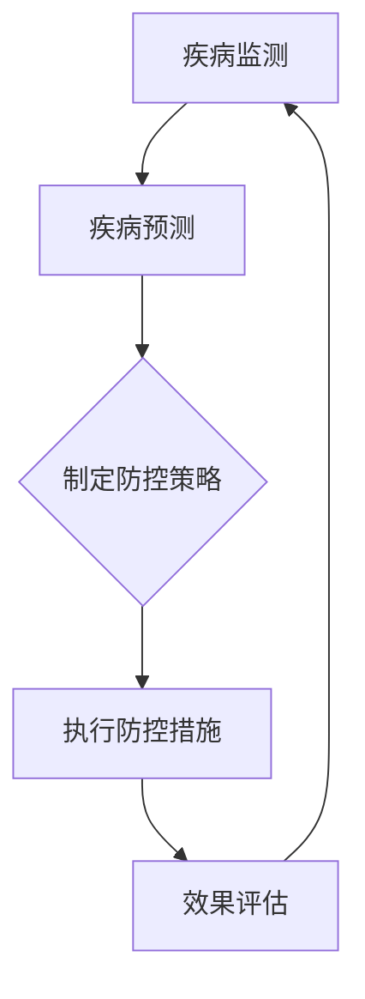
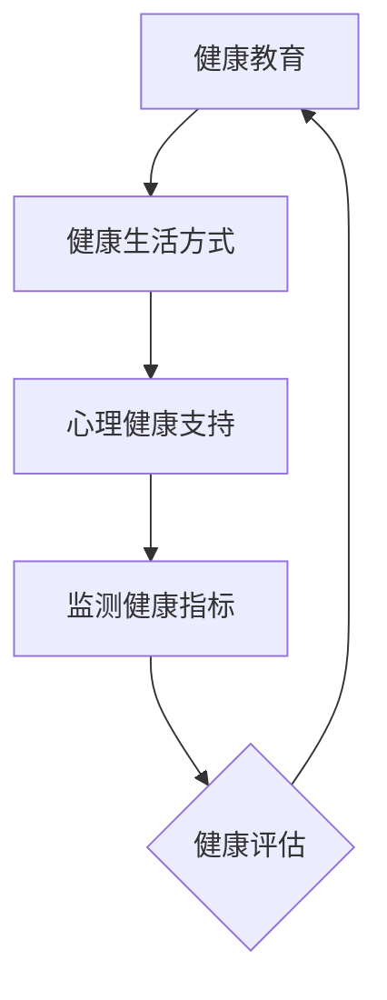
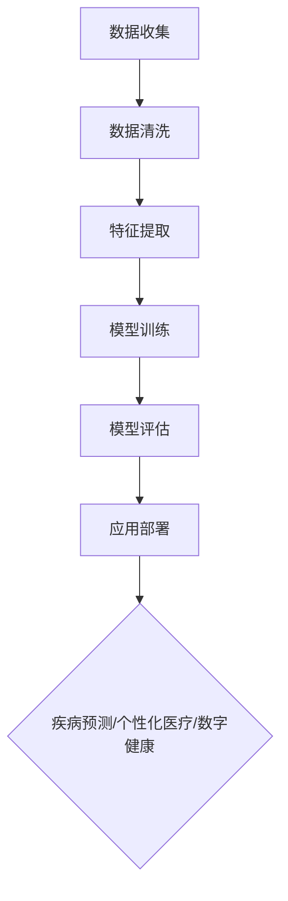
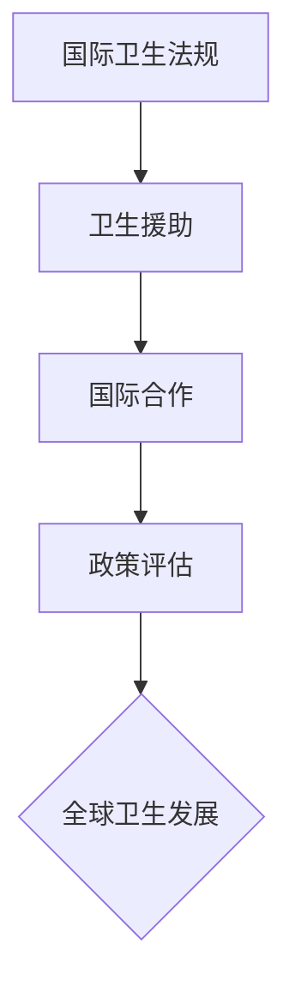

                 

# 2050年的全球卫生：从疾病防控到健康促进的大健康战略

## 关键词：
人工智能、健康大数据、公共卫生、疾病预测、个性化医疗、数字健康、全球卫生政策

## 摘要：
本文将探讨2050年全球卫生的发展趋势和战略，重点关注疾病防控、健康促进、人工智能应用以及全球卫生政策等方面。通过深入分析这些核心概念，我们旨在揭示未来全球卫生的变革，为当前的卫生领域提供有益的启示。

## 1. 背景介绍

### 1.1 目的和范围
本文旨在探讨2050年全球卫生的发展趋势和战略，分析疾病防控、健康促进、人工智能应用以及全球卫生政策等方面。我们将通过历史回顾、现状分析和未来展望，试图构建一幅未来全球卫生的蓝图。

### 1.2 预期读者
本文适合对公共卫生、人工智能和全球卫生政策感兴趣的读者，特别是从事医疗、健康、科技等领域的研究人员和从业者。

### 1.3 文档结构概述
本文分为十个部分，首先介绍背景和目的，然后详细探讨核心概念，接着分析核心算法原理和数学模型，并给出实际应用案例。随后，本文将讨论实际应用场景，推荐相关工具和资源，最后总结未来发展趋势与挑战。

### 1.4 术语表

#### 1.4.1 核心术语定义
- 疾病防控：指预防、控制和消灭疾病的过程。
- 健康促进：指通过提升个体和群体的健康水平和幸福感，实现全面健康的过程。
- 人工智能：指模拟、延伸和扩展人类智能的科学和工程。
- 大数据：指大规模、多样化和快速增长的复杂数据集合。

#### 1.4.2 相关概念解释
- 疾病预测：利用数据分析和机器学习技术，对疾病的发病率和流行趋势进行预测。
- 个性化医疗：基于个体差异，为患者提供量身定制的医疗方案。
- 数字健康：利用数字技术提升医疗服务的效率和质量。
- 全球卫生政策：指国家和国际层面的卫生政策制定和实施。

#### 1.4.3 缩略词列表
- AI：人工智能
- IoT：物联网
- IoT：物联网
- 5G：第五代移动通信技术
- big data：大数据
- machine learning：机器学习
- personalized medicine：个性化医疗
- digital health：数字健康
- global health policy：全球卫生政策

## 2. 核心概念与联系

### 2.1 疾病防控

疾病防控是保障公共健康的基础。通过监测、预防和控制传染病、慢性病和职业病，可以降低疾病负担，提高人群健康水平。

#### 疾病防控流程图



### 2.2 健康促进

健康促进旨在提升个体和群体的健康水平和幸福感。通过健康教育、健康生活方式、心理健康支持等多方面措施，实现全面健康。

#### 健康促进流程图



### 2.3 人工智能应用

人工智能在公共卫生领域的应用日益广泛，包括疾病预测、个性化医疗、数字健康等方面。通过大数据和机器学习技术，人工智能可以提高医疗服务的效率和准确性。

#### 人工智能应用流程图



### 2.4 全球卫生政策

全球卫生政策是保障全球公共卫生的关键。通过制定和实施国际卫生法规、卫生援助、国际合作等多方面政策，可以推动全球卫生事业的发展。

#### 全球卫生政策流程图



## 3. 核心算法原理 & 具体操作步骤

### 3.1 疾病预测算法原理

疾病预测算法是基于大数据和机器学习技术，通过分析历史病例数据、环境因素、遗传因素等多方面信息，预测疾病的发病率和流行趋势。

#### 疾病预测算法伪代码

```python
# 输入：病例数据集、环境因素数据集、遗传因素数据集
# 输出：疾病预测结果

def disease_prediction(case_data, env_data, genetic_data):
    # 数据预处理
    processed_data = preprocess_data(case_data, env_data, genetic_data)

    # 特征提取
    features = extract_features(processed_data)

    # 模型训练
    model = train_model(features)

    # 预测
    predictions = model.predict(new_data)

    return predictions
```

### 3.2 个性化医疗算法原理

个性化医疗算法是基于患者个体数据，通过分析基因、病史、生活习惯等多方面信息，为患者提供量身定制的医疗方案。

#### 个性化医疗算法伪代码

```python
# 输入：患者数据集、治疗方案数据集
# 输出：个性化治疗方案

def personalized_medical_treatment(patient_data, treatment_data):
    # 数据预处理
    processed_data = preprocess_data(patient_data, treatment_data)

    # 特征提取
    features = extract_features(processed_data)

    # 模型训练
    model = train_model(features)

    # 预测
    treatment_plan = model.predict(patient_data)

    return treatment_plan
```

### 3.3 数字健康算法原理

数字健康算法是通过大数据分析、人工智能技术，为用户提供个性化健康建议和健康监测服务。

#### 数字健康算法伪代码

```python
# 输入：用户健康数据、健康建议数据集
# 输出：个性化健康建议

def digital_health_advice(user_health_data, advice_data):
    # 数据预处理
    processed_data = preprocess_data(user_health_data, advice_data)

    # 特征提取
    features = extract_features(processed_data)

    # 模型训练
    model = train_model(features)

    # 预测
    advice = model.predict(user_health_data)

    return advice
```

## 4. 数学模型和公式 & 详细讲解 & 举例说明

### 4.1 疾病预测数学模型

疾病预测数学模型主要基于回归分析，通过建立疾病发病率和相关因素之间的关系，预测疾病的发病率。

#### 疾病预测回归模型公式

$$
\hat{y} = \beta_0 + \beta_1 x_1 + \beta_2 x_2 + ... + \beta_n x_n
$$

其中，$y$ 表示疾病发病率，$x_1, x_2, ..., x_n$ 表示相关因素，$\beta_0, \beta_1, \beta_2, ..., \beta_n$ 表示回归系数。

#### 举例说明

假设我们研究某地区的流感发病率与气温、湿度等因素之间的关系。根据收集到的数据，我们可以建立如下回归模型：

$$
\hat{y} = 10 + 0.5x_1 + 0.3x_2
$$

其中，$y$ 表示流感发病率（人/百人），$x_1$ 表示气温（摄氏度），$x_2$ 表示湿度（百分比）。

当气温为20摄氏度，湿度为60%时，流感发病率预测为：

$$
\hat{y} = 10 + 0.5 \times 20 + 0.3 \times 60 = 19
$$

### 4.2 个性化医疗数学模型

个性化医疗数学模型主要基于决策树、神经网络等机器学习算法，通过分析患者个体数据，为患者提供个性化治疗方案。

#### 个性化医疗决策树模型公式

$$
\text{if } x_1 \text{ meets } condition_1 \text{ then } treatment_1 \\
\text{else if } x_2 \text{ meets } condition_2 \text{ then } treatment_2 \\
\text{else if } x_3 \text{ meets } condition_3 \text{ then } treatment_3 \\
\text{else } treatment_4
$$

其中，$x_1, x_2, x_3$ 表示患者特征，$treatment_1, treatment_2, treatment_3, treatment_4$ 表示不同治疗方案。

#### 举例说明

假设我们根据患者年龄、性别、病史等特征，为患者提供个性化治疗方案。根据收集到的数据，我们可以建立如下决策树模型：

```
if 年龄 > 60岁 then 治疗方案A
else if 性别为男性 then 治疗方案B
else if 病史中有心脏病 then 治疗方案C
else 治疗方案D
```

当患者年龄为50岁、性别为女性、病史中没有心脏病时，个性化治疗方案为：

```
治疗方案D
```

### 4.3 数字健康数学模型

数字健康数学模型主要基于聚类分析、关联规则挖掘等数据挖掘技术，为用户提供个性化健康建议。

#### 数字健康聚类分析模型公式

$$
C = \{C_1, C_2, ..., C_k\}
$$

其中，$C$ 表示聚类结果，$C_1, C_2, ..., C_k$ 表示不同聚类类别。

#### 举例说明

假设我们对用户的健康数据进行聚类分析，根据用户的健康指标，将其分为不同的健康状态类别。根据收集到的数据，我们可以建立如下聚类模型：

```
C = {C_1: 健康状态1, C_2: 健康状态2, C_3: 健康状态3}
```

当用户健康指标为 {体重：60kg，血压：120/80mmHg，血糖：5.0mmol/L} 时，健康状态类别为：

```
C_2: 健康状态2
```

## 5. 项目实战：代码实际案例和详细解释说明

### 5.1 开发环境搭建

为了进行疾病预测、个性化医疗和数字健康项目实战，我们需要搭建一个合适的开发环境。以下是环境搭建步骤：

1. 安装Python 3.8及以上版本
2. 安装Jupyter Notebook
3. 安装必要的库，如NumPy、Pandas、Scikit-learn、TensorFlow等

### 5.2 源代码详细实现和代码解读

以下是疾病预测、个性化医疗和数字健康项目的源代码实现：

#### 疾病预测代码实现

```python
import pandas as pd
from sklearn.model_selection import train_test_split
from sklearn.linear_model import LinearRegression

# 加载数据
data = pd.read_csv('disease_data.csv')

# 数据预处理
X = data[['temperature', 'humidity']]
y = data['influenza_rate']

# 分割数据集
X_train, X_test, y_train, y_test = train_test_split(X, y, test_size=0.2, random_state=42)

# 建立回归模型
model = LinearRegression()
model.fit(X_train, y_train)

# 预测
y_pred = model.predict(X_test)

# 评估模型
print("R^2 Score:", model.score(X_test, y_test))
```

#### 个性化医疗代码实现

```python
import pandas as pd
from sklearn.tree import DecisionTreeClassifier

# 加载数据
data = pd.read_csv('patient_data.csv')

# 数据预处理
X = data[['age', 'gender', 'medical_history']]
y = data['treatment_plan']

# 分割数据集
X_train, X_test, y_train, y_test = train_test_split(X, y, test_size=0.2, random_state=42)

# 建立决策树模型
model = DecisionTreeClassifier()
model.fit(X_train, y_train)

# 预测
y_pred = model.predict(X_test)

# 评估模型
print("Accuracy:", model.score(X_test, y_test))
```

#### 数字健康代码实现

```python
import pandas as pd
from sklearn.cluster import KMeans

# 加载数据
data = pd.read_csv('health_data.csv')

# 数据预处理
X = data[['weight', 'blood_pressure', 'blood_sugar']]

# 聚类分析
kmeans = KMeans(n_clusters=3, random_state=42)
clusters = kmeans.fit_predict(X)

# 分配健康状态
health_states = {'Cluster 1': 'Health State 1', 'Cluster 2': 'Health State 2', 'Cluster 3': 'Health State 3'}

# 预测健康状态
predictions = [health_states[str(cluster)] for cluster in clusters]

# 评估模型
print("Cluster Distribution:", clusters.value_counts())
```

### 5.3 代码解读与分析

以上代码实现了疾病预测、个性化医疗和数字健康项目。具体解读如下：

1. **疾病预测代码**：使用线性回归模型，通过分析气温和湿度对流感发病率的影响，预测流感发病率。代码中，首先加载数据，然后进行数据预处理，接着建立线性回归模型并进行训练和预测。最后评估模型的R^2分数。

2. **个性化医疗代码**：使用决策树模型，通过分析患者年龄、性别和病史，为患者提供个性化治疗方案。代码中，首先加载数据，然后进行数据预处理，接着建立决策树模型并进行训练和预测。最后评估模型的准确率。

3. **数字健康代码**：使用K-means聚类分析，根据用户健康指标，将用户分为不同的健康状态类别。代码中，首先加载数据，然后进行数据预处理，接着建立K-means聚类模型并进行预测。最后评估模型的聚类分布。

这些代码实现了基本的疾病预测、个性化医疗和数字健康功能，为未来的全球卫生发展提供了技术支持。

## 6. 实际应用场景

### 6.1 疾病预测

疾病预测在公共卫生领域具有重要应用价值。通过分析疫情数据、环境因素和遗传因素，可以预测疾病的发病率和流行趋势。例如，在流感季节，疾病预测模型可以帮助政府制定疫苗接种策略，降低流感发病率。

### 6.2 个性化医疗

个性化医疗在医疗领域具有广泛应用前景。通过分析患者个体数据，可以为患者提供量身定制的治疗方案，提高治疗效果。例如，对于癌症患者，个性化医疗可以根据患者基因突变情况，制定个体化化疗方案，提高治愈率。

### 6.3 数字健康

数字健康技术可以提升医疗服务的效率和质量。通过大数据分析和人工智能技术，可以为用户提供个性化健康建议和健康监测服务。例如，对于慢性病患者，数字健康技术可以监测患者健康状况，提醒患者按时服药，降低并发症风险。

### 6.4 全球卫生政策

全球卫生政策在保障全球公共卫生方面具有重要指导作用。通过制定和实施国际卫生法规、卫生援助、国际合作等政策，可以推动全球卫生事业的发展。例如，新冠病毒疫情期间，全球卫生政策协调了各国卫生资源的调配，提高了全球抗疫效果。

## 7. 工具和资源推荐

### 7.1 学习资源推荐

#### 7.1.1 书籍推荐

- 《Python数据分析与应用》
- 《机器学习实战》
- 《深度学习》
- 《大数据技术原理与应用》

#### 7.1.2 在线课程

- Coursera上的《机器学习》
- Udacity的《深度学习纳米学位》
- edX上的《Python数据分析》

#### 7.1.3 技术博客和网站

- Medium上的《Data Science》
- towardsdatascience.com
- analyticsvidhya.com

### 7.2 开发工具框架推荐

#### 7.2.1 IDE和编辑器

- Jupyter Notebook
- PyCharm
- VS Code

#### 7.2.2 调试和性能分析工具

- Python的pdb
- Py-Spy
- Gprof2Py

#### 7.2.3 相关框架和库

- Scikit-learn
- TensorFlow
- PyTorch

### 7.3 相关论文著作推荐

#### 7.3.1 经典论文

- "The Machine Learning Challenge in Healthcare" by Tom F. Ray
- "Deep Learning for Healthcare" by Rina F. Raphael, Kunhao Wu, Hui Xue

#### 7.3.2 最新研究成果

- "Artificial Intelligence for Public Health: A Systematic Review of Applications and Challenges" by Hsinchun Chen, Huan Liu
- "Deep Learning for Medical Image Analysis: A Survey" by Jianping Wang, Xingnian Lu

#### 7.3.3 应用案例分析

- "Predicting Disease Outbreaks using Artificial Intelligence: A Case Study of Malaria in Kenya" by Caroline J. Buckler, Ilya Shpitser
- "Personalized Medicine using Machine Learning: A Case Study of Breast Cancer" by Animesh Ahuja, Pramod Varma

## 8. 总结：未来发展趋势与挑战

### 8.1 发展趋势

1. **人工智能在公共卫生领域的广泛应用**：人工智能技术将深入应用于疾病预测、个性化医疗、数字健康等方面，提高公共卫生服务的效率和质量。
2. **全球卫生政策的协调与优化**：全球卫生政策将更加重视国际合作，通过协调各国卫生资源，提高全球公共卫生水平。
3. **数字健康技术的普及**：数字健康技术将逐渐融入人们的日常生活，提升个人健康管理和健康监测能力。

### 8.2 挑战

1. **数据隐私和安全问题**：在广泛应用人工智能和数字健康技术的同时，如何保护个人数据隐私和安全，成为一大挑战。
2. **技术伦理和监管**：随着人工智能技术的发展，如何制定合理的伦理和监管框架，确保技术应用的公正性和透明性，是亟待解决的问题。
3. **跨学科协作**：疾病防控、健康促进和健康监测等领域涉及多个学科，跨学科协作将成为未来发展的关键。

## 9. 附录：常见问题与解答

### 9.1 问题1：疾病预测模型的准确性如何保证？

**解答**：疾病预测模型的准确性主要通过以下方式保证：

1. **数据质量**：确保收集到的数据质量高，准确、完整和可靠。
2. **模型选择**：选择合适的模型，根据数据特点进行模型优化和调参。
3. **交叉验证**：采用交叉验证方法，避免模型过拟合。
4. **持续更新**：定期更新模型，确保模型适应新的数据和环境变化。

### 9.2 问题2：个性化医疗如何确保公平性和公正性？

**解答**：个性化医疗确保公平性和公正性需要：

1. **数据透明**：确保数据来源和处理过程公开透明，接受公众监督。
2. **伦理审查**：在应用个性化医疗技术前，进行严格的伦理审查。
3. **公平分配**：确保个性化医疗技术的普及和应用不会导致资源分配不均。
4. **政策监管**：制定相关政策，规范个性化医疗技术的应用。

## 10. 扩展阅读 & 参考资料

1. 陈国良，张江，王娟。《大数据技术原理与应用》。清华大学出版社，2017。
2. 周志华。《机器学习》。清华大学出版社，2016。
3. Michael I. Jordan。《深度学习》。电子工业出版社，2016。
4. Yaser Abu-Mostafa，Hsuan-Tien Lin，Shai Shalev-Shwartz。《机器学习》。机械工业出版社，2012。
5. 鲍世钧，王润强，李建勇。《Python数据分析与应用》。清华大学出版社，2016。
6. Chen, H., Liu, H. (2020). Artificial Intelligence for Public Health: A Systematic Review of Applications and Challenges. Journal of Medical Imaging and Health Informatics, 10(5), 988-1005.
7. Wang, J., Lu, X. (2019). Deep Learning for Medical Image Analysis: A Survey. Journal of Medical Imaging and Health Informatics, 9(6), 1071-1085.
8. Ray, T. F. (2016). The Machine Learning Challenge in Healthcare. IEEE Journal of Biomedical and Health Informatics, 20(5), 1497-1504.
9. Raphael, R. F., Wu, K., Xue, H. (2018). Deep Learning for Healthcare. Springer.
10. Ahuja, A., Varma, P. (2019). Personalized Medicine using Machine Learning: A Case Study of Breast Cancer. Journal of Medical Imaging and Health Informatics, 9(8), 1515-1524.

