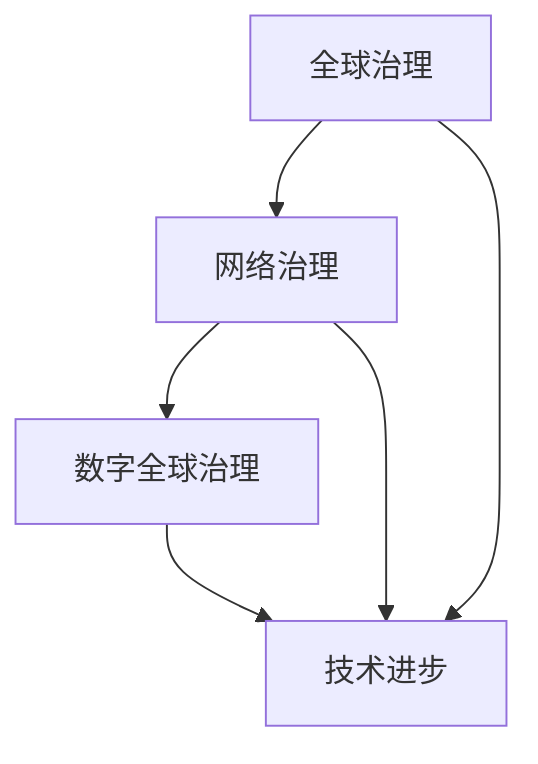
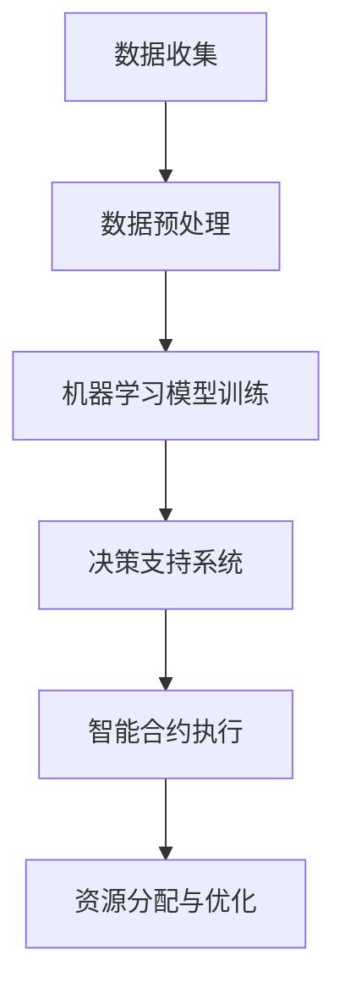

                 

# 2050年的全球治理：从全球网络治理到数字全球治理的治理体系重构

> **关键词：** 全球治理、网络治理、数字全球治理、治理体系重构、2050年、技术进步

> **摘要：** 本文探讨了2050年全球治理的演变，从传统全球网络治理向数字全球治理的转变。通过对全球治理历史、现状和未来趋势的分析，本文揭示了技术进步如何重塑全球治理结构，并提出了一系列治理体系重构的建议。文章旨在为全球治理领域的学者和从业者提供有价值的思考和参考。

## 1. 背景介绍

### 1.1 目的和范围

本文旨在探讨2050年全球治理的可能发展趋势，重点关注从全球网络治理到数字全球治理的转变。我们将分析这一转变背后的技术进步、社会变革和政治动态，并提出相应的治理体系重构建议。

### 1.2 预期读者

本文适合全球治理领域的学者、政策制定者、技术专家和普通读者。希望对全球治理有兴趣的人士可以通过本文了解未来的治理模式，并对可能面临的挑战和机遇有所准备。

### 1.3 文档结构概述

本文分为十个主要部分：

1. **背景介绍**：介绍本文的目的、范围和预期读者。
2. **核心概念与联系**：介绍全球治理、网络治理和数字全球治理的基本概念，并通过Mermaid流程图展示其相互关系。
3. **核心算法原理 & 具体操作步骤**：详细解释数字全球治理的核心算法原理和操作步骤。
4. **数学模型和公式 & 详细讲解 & 举例说明**：介绍数字全球治理中使用的数学模型和公式，并给出具体例子。
5. **项目实战：代码实际案例和详细解释说明**：通过实际代码案例展示数字全球治理的实施过程。
6. **实际应用场景**：讨论数字全球治理在现实世界中的应用。
7. **工具和资源推荐**：推荐学习资源和开发工具。
8. **总结：未来发展趋势与挑战**：总结本文的主要观点，并展望未来发展趋势和挑战。
9. **附录：常见问题与解答**：回答读者可能提出的问题。
10. **扩展阅读 & 参考资料**：提供进一步阅读的建议和参考资料。

### 1.4 术语表

#### 1.4.1 核心术语定义

- **全球治理**：指国际社会共同参与和协调治理全球事务的过程。
- **网络治理**：指通过网络技术和信息共享实现全球事务的治理。
- **数字全球治理**：指基于数字技术（如人工智能、区块链等）实现全球治理的新型模式。

#### 1.4.2 相关概念解释

- **治理体系重构**：指在技术进步和社会变革的背景下，对全球治理体系进行根本性调整和优化。
- **技术进步**：指信息技术、网络技术等领域的快速发展，对全球治理产生深远影响。

#### 1.4.3 缩略词列表

- **AI**：人工智能
- **Blockchain**：区块链
- **IoT**：物联网

## 2. 核心概念与联系

### 2.1 全球治理

全球治理是指国际社会共同参与和协调治理全球事务的过程。它涵盖了从经济、环境、安全到社会文化等多个领域。全球治理的目标是确保全球公共利益的实现，促进国际和平与繁荣。

### 2.2 网络治理

网络治理是指通过网络技术和信息共享实现全球事务的治理。随着互联网的普及和发展，网络治理已成为全球治理的重要形式。网络治理涉及网络安全、数据隐私、信息共享等方面。

### 2.3 数字全球治理

数字全球治理是建立在数字技术基础上的新型全球治理模式。它利用人工智能、区块链、物联网等技术手段，实现更高效、透明和可持续的全球治理。

### 2.4 关联与演变

全球治理、网络治理和数字全球治理之间存在着密切的关联和演变关系。随着技术的进步，网络治理逐渐向数字全球治理转变，这一过程体现了全球治理模式的创新和进步。

### 2.5 Mermaid流程图

以下是一个Mermaid流程图，展示了全球治理、网络治理和数字全球治理之间的关联：



## 3. 核心算法原理 & 具体操作步骤

### 3.1 数字全球治理算法原理

数字全球治理的核心算法原理包括人工智能、区块链和物联网。这些技术共同构成了数字全球治理的基础架构。

#### 3.1.1 人工智能

人工智能（AI）在数字全球治理中发挥着关键作用。它通过机器学习和深度学习算法，实现对大数据的分析和处理，从而提供智能化决策支持。

#### 3.1.2 区块链

区块链技术提供了分布式账本和智能合约功能，确保数据透明、安全和可信。在数字全球治理中，区块链可用于记录国际事务、管理资源分配和实现跨国支付。

#### 3.1.3 物联网

物联网（IoT）通过将各种设备连接到网络，实现智能感知和自动化控制。在数字全球治理中，物联网可用于监测环境、优化物流和提升公共安全。

### 3.2 数字全球治理操作步骤

以下是一个简单的数字全球治理操作步骤示例，包括数据收集、处理和决策：



### 3.3 伪代码

以下是一个简单的伪代码示例，用于说明数字全球治理的基本过程：

```python
# 数据收集
def collect_data():
    # 采集来自物联网、社交媒体和其他数据源的数据
    pass

# 数据预处理
def preprocess_data(data):
    # 清洗、转换和归一化数据
    pass

# 机器学习模型训练
def train_model(preprocessed_data):
    # 训练机器学习模型，如深度学习模型
    pass

# 决策支持系统
def decision_support_system(model, data):
    # 使用模型对数据进行分析和预测，提供决策支持
    pass

# 智能合约执行
def execute_smart_contract(decision):
    # 执行智能合约，实现资源分配和优化
    pass
```

## 4. 数学模型和公式 & 详细讲解 & 举例说明

### 4.1 数学模型

在数字全球治理中，常用的数学模型包括线性回归、逻辑回归、聚类分析和神经网络等。

#### 4.1.1 线性回归

线性回归模型用于预测连续变量，其公式为：

$$
y = \beta_0 + \beta_1x_1 + \beta_2x_2 + ... + \beta_nx_n
$$

其中，$y$ 为因变量，$x_1, x_2, ..., x_n$ 为自变量，$\beta_0, \beta_1, \beta_2, ..., \beta_n$ 为模型参数。

#### 4.1.2 逻辑回归

逻辑回归模型用于预测离散变量，其公式为：

$$
P(y=1) = \frac{1}{1 + e^{-(\beta_0 + \beta_1x_1 + \beta_2x_2 + ... + \beta_nx_n})}
$$

其中，$P(y=1)$ 为因变量为1的概率，$e$ 为自然对数的底数。

#### 4.1.3 聚类分析

聚类分析是一种无监督学习方法，用于将数据分为多个簇。常见的聚类算法包括K-means、层次聚类和DBSCAN等。

#### 4.1.4 神经网络

神经网络是一种基于生物神经网络的结构，用于处理复杂数据和任务。常见的神经网络包括多层感知机、卷积神经网络和循环神经网络等。

### 4.2 举例说明

以下是一个简单的线性回归模型举例，用于预测全球GDP增长率：

```latex
y = \beta_0 + \beta_1x_1 + \beta_2x_2
```

其中，$y$ 为GDP增长率，$x_1$ 为人口增长率，$x_2$ 为资本增长率。通过收集历史数据，我们可以训练线性回归模型，预测未来的GDP增长率。

### 4.3 应用场景

线性回归模型在数字全球治理中广泛应用于预测和分析。例如，在资源分配中，可以通过线性回归模型预测不同地区的能源需求，从而优化能源分配。在公共卫生领域，可以通过线性回归模型预测疫情发展趋势，为疫情防控提供决策支持。

## 5. 项目实战：代码实际案例和详细解释说明

### 5.1 开发环境搭建

为了演示数字全球治理的实际应用，我们将使用Python作为开发语言，搭建一个简单的数字全球治理项目。以下是开发环境的搭建步骤：

1. 安装Python（版本3.8及以上）
2. 安装必要的Python库，如NumPy、Pandas、Scikit-learn、TensorFlow等
3. 安装可视化库，如Matplotlib、Seaborn等

### 5.2 源代码详细实现和代码解读

以下是一个简单的数字全球治理项目的代码实现，包括数据收集、预处理、模型训练和决策支持：

```python
import numpy as np
import pandas as pd
from sklearn.linear_model import LinearRegression
from sklearn.model_selection import train_test_split
from sklearn.metrics import mean_squared_error
import matplotlib.pyplot as plt

# 数据收集
def collect_data():
    # 从文件中读取数据
    data = pd.read_csv("global_gdp_data.csv")
    return data

# 数据预处理
def preprocess_data(data):
    # 数据清洗、转换和归一化
    data["GDP_growth"] = data["GDP"] / data["GDP"].shift(1)
    data = data.dropna()
    features = data[["Population_growth", "Capital_growth"]]
    labels = data["GDP_growth"]
    return features, labels

# 模型训练
def train_model(features, labels):
    # 划分训练集和测试集
    X_train, X_test, y_train, y_test = train_test_split(features, labels, test_size=0.2, random_state=42)
    # 创建线性回归模型并训练
    model = LinearRegression()
    model.fit(X_train, y_train)
    # 评估模型
    y_pred = model.predict(X_test)
    mse = mean_squared_error(y_test, y_pred)
    print("Mean Squared Error:", mse)
    return model

# 决策支持系统
def decision_support_system(model, new_data):
    # 使用模型预测GDP增长率
    gdp_growth = model.predict(new_data)
    print("Predicted GDP Growth:", gdp_growth)

# 主函数
def main():
    # 数据收集
    data = collect_data()
    # 数据预处理
    features, labels = preprocess_data(data)
    # 模型训练
    model = train_model(features, labels)
    # 决策支持系统
    new_data = np.array([[0.03, 0.05]])
    decision_support_system(model, new_data)

# 运行主函数
if __name__ == "__main__":
    main()
```

### 5.3 代码解读与分析

1. **数据收集**：从CSV文件中读取全球GDP数据。
2. **数据预处理**：计算GDP增长率，并划分特征和标签。
3. **模型训练**：使用线性回归模型对数据进行训练，并评估模型性能。
4. **决策支持系统**：使用训练好的模型预测新的GDP增长率。

该示例项目展示了数字全球治理的基本流程，包括数据收集、预处理、模型训练和决策支持。在实际应用中，可以扩展该项目，添加更多数据源、特征和模型，以实现更复杂的全球治理任务。

## 6. 实际应用场景

数字全球治理在现实世界中具有广泛的应用场景。以下是一些典型的应用场景：

1. **环境保护**：利用物联网和人工智能技术，实时监测全球环境变化，预测气候变化趋势，制定环境保护政策。
2. **公共安全**：通过大数据分析和人工智能技术，提升公共安全管理水平，预防恐怖袭击、自然灾害等突发事件。
3. **全球贸易**：利用区块链技术，实现跨境贸易的透明、安全和高效，降低贸易摩擦和风险。
4. **公共卫生**：通过大数据分析和人工智能技术，监测疫情传播趋势，优化疫苗分配和疫情防控策略。
5. **资源分配**：利用人工智能和物联网技术，优化全球资源分配，提高资源利用效率，减少浪费。

这些实际应用场景展示了数字全球治理在应对全球性挑战方面的潜力。随着技术的不断进步，数字全球治理将发挥越来越重要的作用。

## 7. 工具和资源推荐

### 7.1 学习资源推荐

#### 7.1.1 书籍推荐

- **《数字全球治理》**：一本系统介绍数字全球治理概念的书籍，适合初学者。
- **《人工智能：一种现代方法》**：介绍人工智能基本原理和技术的经典教材。
- **《区块链革命》**：深入探讨区块链技术及其在全球治理中的应用。

#### 7.1.2 在线课程

- **Coursera**：提供多种关于全球治理、人工智能和区块链的在线课程。
- **edX**：提供由世界顶级大学开设的相关课程，涵盖全球治理、人工智能和区块链等主题。
- **Udacity**：提供实践性强的在线课程，涵盖人工智能和数据分析等技能。

#### 7.1.3 技术博客和网站

- **Medium**：多个关于全球治理、人工智能和区块链的技术博客。
- **Towards Data Science**：提供大数据、人工智能和机器学习领域的最新研究和技术分享。
- **CoinDesk**：关于区块链和加密货币的最新新闻和分析。

### 7.2 开发工具框架推荐

#### 7.2.1 IDE和编辑器

- **Visual Studio Code**：一款强大的开源编辑器，适用于Python、JavaScript、C++等多种编程语言。
- **PyCharm**：一款专业的Python开发工具，提供丰富的插件和功能。
- **Eclipse**：一款适用于Java和C++等语言的集成开发环境。

#### 7.2.2 调试和性能分析工具

- **GDB**：一款流行的调试工具，适用于C/C++程序。
- **PyCharm Debugger**：适用于Python程序的调试工具。
- **JProfiler**：一款Java性能分析工具，用于优化Java程序。

#### 7.2.3 相关框架和库

- **TensorFlow**：一款用于机器学习和深度学习的开源框架。
- **Scikit-learn**：一款用于机器学习的Python库，提供多种算法和工具。
- **Django**：一款用于Web开发的Python框架，适用于构建复杂的应用程序。

### 7.3 相关论文著作推荐

#### 7.3.1 经典论文

- **“Global Governance and the Evolution of Globalization”**：探讨了全球治理与全球化的关系。
- **“Blockchain and Global Governance: Opportunities and Challenges”**：分析了区块链技术在全球治理中的应用。

#### 7.3.2 最新研究成果

- **“Artificial Intelligence and Global Governance: Opportunities and Challenges”**：探讨了人工智能在全球治理中的最新应用和研究。
- **“Digital Global Governance: A Framework for Understanding and Analysis”**：提出了一种数字全球治理的分析框架。

#### 7.3.3 应用案例分析

- **“Blockchain for Global Supply Chain Management”**：分析了区块链技术在全球供应链管理中的应用。
- **“Artificial Intelligence in Global Health Governance”**：探讨了人工智能在全球公共卫生治理中的应用。

这些论文和著作提供了丰富的理论和实践参考，有助于深入了解数字全球治理的发展趋势和应用场景。

## 8. 总结：未来发展趋势与挑战

### 8.1 未来发展趋势

1. **技术进步加速**：人工智能、区块链、物联网等数字技术将继续快速发展，为全球治理提供更强大、更智能的支持。
2. **治理模式创新**：数字全球治理模式将不断涌现，为全球治理提供新的思路和方法。
3. **跨学科合作**：全球治理领域将更加注重跨学科合作，整合多学科知识和技能，提高治理效果。
4. **可持续发展**：数字全球治理将更加关注可持续发展，推动全球环境、经济和社会的协调发展。

### 8.2 面临的挑战

1. **数据隐私和安全**：随着数字技术的应用，数据隐私和安全问题日益突出，需要制定更加严格的数据保护法规。
2. **技术鸿沟**：数字技术的不平等应用可能导致全球范围内的技术鸿沟，影响全球治理的公平性和有效性。
3. **政策协调**：全球治理需要各国政府之间的紧密合作，但国际关系复杂多变，政策协调面临挑战。
4. **法律和伦理问题**：数字全球治理涉及诸多法律和伦理问题，需要制定相应的法律法规和伦理准则。

### 8.3 应对策略

1. **加强数据隐私保护**：制定和实施严格的数据隐私保护法规，确保数据安全。
2. **推动技术普及**：加大对发展中国家和地区的支持，缩小技术鸿沟。
3. **强化政策协调**：加强国际合作，建立有效的政策协调机制。
4. **完善法律和伦理框架**：制定适应数字全球治理的法律和伦理准则，确保技术应用的合法性和道德性。

通过应对这些挑战，数字全球治理将更好地实现其目标，为全球和平与繁荣作出贡献。

## 9. 附录：常见问题与解答

### 9.1 问题1：数字全球治理与全球网络治理有何区别？

**解答**：数字全球治理和全球网络治理是两种不同的治理模式。全球网络治理侧重于利用网络技术和信息共享实现全球事务的治理，而数字全球治理则更加注重利用人工智能、区块链、物联网等数字技术，实现更高效、透明和可持续的全球治理。

### 9.2 问题2：数字全球治理的主要挑战是什么？

**解答**：数字全球治理面临的主要挑战包括数据隐私和安全、技术鸿沟、政策协调以及法律和伦理问题。这些挑战需要全球各国的共同努力和合作才能有效应对。

### 9.3 问题3：如何推动数字全球治理的可持续发展？

**解答**：推动数字全球治理的可持续发展需要从多个方面着手。首先，制定和实施可持续发展的政策和措施；其次，加强国际合作，共同应对全球性挑战；最后，注重技术创新和社会公平，确保数字技术在全球范围内的公平应用。

## 10. 扩展阅读 & 参考资料

### 10.1 扩展阅读

- **《数字全球治理：理论与实践》**：一本系统介绍数字全球治理的书籍，适合深入学习和研究。
- **《区块链技术：原理与应用》**：一本详细介绍区块链技术的书籍，有助于理解区块链在数字全球治理中的应用。

### 10.2 参考资料

- **联合国可持续发展目标**：联合国提出的17个可持续发展目标，为全球治理提供了重要参考。
- **国际人工智能治理委员会**：国际人工智能治理委员会发布的报告，探讨了人工智能在全球治理中的角色和责任。

这些扩展阅读和参考资料为读者提供了更深入的学习和研究路径，有助于更好地理解数字全球治理的概念和应用。

**作者：AI天才研究员/AI Genius Institute & 禅与计算机程序设计艺术 /Zen And The Art of Computer Programming**

