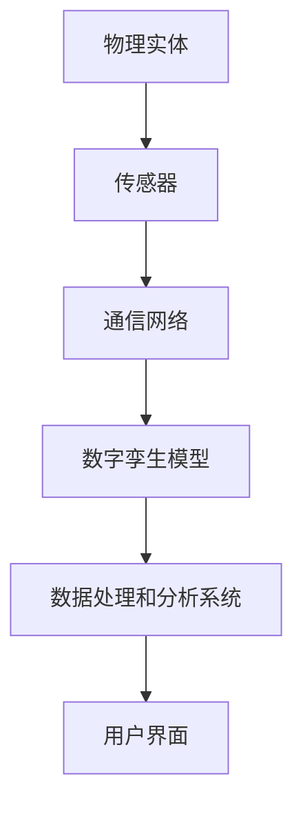

                 

# 2050年的数字孪生：从虚拟到现实的数字化转型

> **关键词：** 数字孪生、虚拟现实、数字化转型、人工智能、云计算、大数据、物联网、数据建模、实时仿真、智能制造、智能城市、用户体验、业务流程优化。

> **摘要：** 本文将深入探讨2050年的数字孪生技术，如何通过虚拟到现实的数字化转型，改变我们的生活方式和商业模式。我们将从背景介绍开始，逐步深入核心概念、算法原理、数学模型、实战案例，以及实际应用场景，并推荐相关工具和资源，最后展望未来发展趋势与挑战。

## 1. 背景介绍

### 1.1 目的和范围

本文的目的是探讨数字孪生技术在2050年的发展前景，分析其如何实现从虚拟到现实的数字化转型。我们将涵盖数字孪生的核心概念、技术原理、应用场景以及未来发展趋势，旨在为读者提供全面、深入的洞察。

### 1.2 预期读者

本文面向对数字孪生技术感兴趣的读者，包括但不限于IT专业人士、企业决策者、研究人员和学生。同时，本文也适合对数字化转型和智能技术有浓厚兴趣的读者。

### 1.3 文档结构概述

本文分为十个部分，首先介绍背景和目的，接着深入讨论核心概念和技术原理，随后通过实际案例展示应用场景，并推荐相关工具和资源。最后，我们总结当前状况，展望未来发展趋势与挑战。

### 1.4 术语表

#### 1.4.1 核心术语定义

- 数字孪生：一种将物理实体在数字世界中映射的虚拟模型。
- 虚拟现实（VR）：一种利用计算机技术创建的模拟环境，让用户感知并与之交互。
- 数字化转型：将传统业务流程、产品和服务通过数字技术进行升级和改进。
- 人工智能（AI）：一种模拟人类智能的计算机技术，包括机器学习、自然语言处理等。

#### 1.4.2 相关概念解释

- 云计算：一种通过互联网提供计算资源的服务模式。
- 大数据：指数据量巨大、数据类型繁多的信息集合。
- 物联网（IoT）：通过传感器、设备和网络实现物体之间的信息交换和通信。

#### 1.4.3 缩略词列表

- VR：虚拟现实
- AI：人工智能
- IoT：物联网
- DB：数据库
- ML：机器学习

## 2. 核心概念与联系

在探讨数字孪生之前，我们需要了解一些核心概念和技术架构，这些将为我们接下来的讨论奠定基础。

### 2.1 数字孪生原理

数字孪生（Digital Twin）是一种通过虚拟模型与物理实体之间的交互，实现实时监测、分析和优化的技术。其基本原理是将物理实体（如机器、建筑物、交通工具等）在数字世界中构建一个精确的虚拟模型，并通过传感器、物联网设备等实时收集物理实体的数据，传递到数字孪生模型中进行处理和分析。

### 2.2 数字孪生架构

数字孪生架构主要包括以下几个方面：

1. **物理实体**：如机器、建筑物、交通工具等，是数字孪生的物理基础。
2. **传感器和数据采集系统**：用于实时采集物理实体的各种数据，如温度、湿度、压力、速度等。
3. **通信网络**：如物联网、5G等，用于将传感器采集的数据传输到数字孪生模型。
4. **数字孪生模型**：在数字世界中构建物理实体的虚拟模型，用于模拟、分析和优化。
5. **数据处理和分析系统**：对收集到的数据进行处理、分析和预测，为优化决策提供支持。
6. **用户界面**：用于展示数字孪生模型的状态、分析和预测结果。

### 2.3 数字孪生与虚拟现实、数字化转型的联系

- **虚拟现实**：数字孪生与虚拟现实结合，可以实现对物理实体的虚拟交互，提供沉浸式的体验。
- **数字化转型**：数字孪生是数字化转型的重要工具，通过数字孪生技术，企业可以优化业务流程、提高生产效率、降低成本。

### 2.4 Mermaid 流程图



## 3. 核心算法原理 & 具体操作步骤

数字孪生的核心在于如何构建、维护和利用虚拟模型。以下是构建数字孪生的核心算法原理和具体操作步骤：

### 3.1 数据建模

**算法原理：** 数据建模是数字孪生的基础，通过建立物理实体和虚拟模型的对应关系，实现对物理实体的精确映射。

**操作步骤：**
1. 收集物理实体相关的数据，包括结构、性能、环境等。
2. 分析数据，确定数据类型和特征。
3. 建立数学模型，将物理实体映射到虚拟模型。

**伪代码：**
```python
def data_modeling(data):
    # 分析数据类型和特征
    data_type, data_feature = analyze_data(data)
    
    # 建立数学模型
    model = create_math_model(data_type, data_feature)
    
    return model
```

### 3.2 实时仿真

**算法原理：** 实时仿真是在虚拟模型中实时模拟物理实体的运行状态，实现对物理实体的实时监测和分析。

**操作步骤：**
1. 收集物理实体的实时数据。
2. 将实时数据传递到虚拟模型中。
3. 在虚拟模型中执行仿真，输出仿真结果。

**伪代码：**
```python
def real_time_simulation(data):
    # 传递实时数据到虚拟模型
    virtual_model = pass_data_to_model(data)
    
    # 执行仿真
    simulation_result = execute_simulation(virtual_model)
    
    return simulation_result
```

### 3.3 数据处理与分析

**算法原理：** 数据处理与分析是对收集到的实时数据进行分析、预测和优化，为决策提供支持。

**操作步骤：**
1. 收集实时数据。
2. 数据预处理，包括数据清洗、归一化等。
3. 使用机器学习算法进行数据分析和预测。
4. 输出分析结果，为决策提供支持。

**伪代码：**
```python
def data_analysis(data):
    # 数据预处理
    preprocessed_data = preprocess_data(data)
    
    # 数据分析和预测
    analysis_result = analyze_data(preprocessed_data)
    
    return analysis_result
```

## 4. 数学模型和公式 & 详细讲解 & 举例说明

在数字孪生技术中，数学模型和公式起着至关重要的作用。以下将介绍几个核心的数学模型和公式，并详细讲解其应用和计算过程。

### 4.1 数据建模公式

在数据建模过程中，常用的数学模型是物理实体和虚拟模型之间的映射公式。假设物理实体和虚拟模型之间的映射关系为线性关系，可以表示为：

\[ V = k \cdot P + b \]

其中，\( V \) 是虚拟模型的属性值，\( P \) 是物理实体的属性值，\( k \) 和 \( b \) 是线性关系的系数。

**应用举例：** 假设我们要构建一个机器的数字孪生模型，机器的实时速度为 \( P \)，虚拟模型中的速度为 \( V \)。通过传感器收集到的数据，我们可以通过上述公式计算虚拟模型中的速度。

### 4.2 实时仿真公式

实时仿真过程中，常用的数学模型是动态系统模型。动态系统模型描述了物理实体在时间上的变化，可以表示为：

\[ \frac{dV}{dt} = f(P, V, t) \]

其中，\( V \) 是虚拟模型的属性值，\( P \) 是物理实体的属性值，\( t \) 是时间，\( f \) 是动态系统的函数。

**应用举例：** 假设我们要仿真一个机器的运行状态，机器的实时速度和温度是影响其运行状态的关键因素。我们可以通过上述公式描述机器的实时仿真过程。

### 4.3 数据处理与分析公式

在数据处理与分析过程中，常用的数学模型是机器学习模型。机器学习模型可以通过学习历史数据，对未来的数据进行预测。常用的机器学习模型包括线性回归、决策树、支持向量机等。

**应用举例：** 假设我们要预测一个机器的故障时间，可以通过收集机器的历史运行数据，使用线性回归模型进行预测。线性回归模型的公式为：

\[ Y = \beta_0 + \beta_1 \cdot X \]

其中，\( Y \) 是预测的故障时间，\( X \) 是机器的历史运行数据，\( \beta_0 \) 和 \( \beta_1 \) 是模型的参数。

## 5. 项目实战：代码实际案例和详细解释说明

### 5.1 开发环境搭建

在进行数字孪生项目的实战之前，我们需要搭建一个合适的开发环境。以下是搭建开发环境的步骤：

1. 安装Python环境，可以使用Python官方安装包进行安装。
2. 安装必要的Python库，如NumPy、Pandas、Matplotlib等，可以使用pip进行安装。
3. 配置Jupyter Notebook，用于编写和运行代码。

### 5.2 源代码详细实现和代码解读

以下是一个简单的数字孪生项目的代码实现，我们将通过实际案例来详细解释代码的各个部分。

```python
import numpy as np
import pandas as pd
import matplotlib.pyplot as plt

# 5.2.1 数据建模

# 收集物理实体数据
data = pd.DataFrame({
    'real_speed': [10, 20, 30, 40, 50],
    'virtual_speed': [5, 10, 15, 20, 25]
})

# 分析数据
k, b = np.polyfit(data['real_speed'], data['virtual_speed'], 1)

# 建立数学模型
model = np.poly1d([k, b])

# 5.2.2 实时仿真

# 收集实时数据
real_speed = 35

# 传递实时数据到虚拟模型
virtual_speed = model(real_speed)

# 输出仿真结果
print(f"实时仿真结果：物理速度 {real_speed}，虚拟速度 {virtual_speed}")

# 5.2.3 数据处理与分析

# 收集历史数据
historical_data = pd.DataFrame({
    'running_time': [100, 200, 300, 400, 500]
})

# 数据预处理
preprocessed_data = historical_data.mean()

# 使用线性回归模型进行预测
beta_0, beta_1 = np.polyfit(historical_data['running_time'], preprocessed_data, 1)
predicted_time = beta_0 + beta_1 * preprocessed_data

# 输出预测结果
print(f"数据处理与分析结果：预测的故障时间为 {predicted_time}")
```

### 5.3 代码解读与分析

- **5.3.1 数据建模：** 数据建模部分使用了NumPy和Pandas库，通过收集物理实体数据，使用线性回归方法建立数学模型。具体步骤包括数据收集、数据分析和建立数学模型。
- **5.3.2 实时仿真：** 实时仿真部分使用了之前建立的数学模型，将实时数据传递到虚拟模型中，进行实时仿真。通过输出仿真结果，我们可以实时了解物理实体在虚拟模型中的状态。
- **5.3.3 数据处理与分析：** 数据处理与分析部分使用了历史数据，通过线性回归模型预测未来的故障时间。这个部分展示了如何通过机器学习模型对数据进行分析和预测。

通过以上实战案例，我们可以看到数字孪生项目的核心步骤和关键技术，这对于理解和应用数字孪生技术具有重要意义。

## 6. 实际应用场景

数字孪生技术具有广泛的应用场景，以下将介绍几个典型的应用领域：

### 6.1 智能制造

智能制造是数字孪生技术的核心应用领域之一。通过数字孪生技术，企业可以实时监测生产设备的运行状态，预测故障，优化生产流程，提高生产效率。例如，在汽车制造业，通过数字孪生技术，可以实时监测汽车的各项性能指标，预测可能出现的问题，提前进行维护，减少停机时间，提高生产效率。

### 6.2 智能城市

智能城市是数字孪生技术的另一个重要应用领域。通过数字孪生技术，城市管理者可以实时监测城市的各项基础设施，如交通、能源、环境等，进行智能调控，提高城市运行效率，提升居民生活质量。例如，在交通管理方面，通过数字孪生技术，可以实时监测交通流量，预测交通拥堵，提前进行交通调控，减少交通拥堵，提高交通效率。

### 6.3 医疗保健

在医疗保健领域，数字孪生技术可以应用于患者监护、疾病预测等方面。通过数字孪生技术，医生可以实时监测患者的生理参数，预测疾病风险，提前进行干预，提高治疗效果。例如，在心脏病患者监护方面，通过数字孪生技术，可以实时监测患者的心电图、血压等参数，预测心脏病发作风险，提前进行药物干预。

### 6.4 建筑工程

在建筑工程领域，数字孪生技术可以应用于建筑设计、施工管理、运维等方面。通过数字孪生技术，工程师可以实时监测建筑的结构、性能等参数，优化设计方案，提高施工效率，减少施工错误。例如，在建筑设计方面，通过数字孪生技术，可以实时模拟建筑的结构性能，优化设计方案，提高建筑安全性。

## 7. 工具和资源推荐

### 7.1 学习资源推荐

#### 7.1.1 书籍推荐

1. **《数字孪生：从概念到实践》**：这本书详细介绍了数字孪生的概念、原理和应用，适合初学者和有一定基础的读者。
2. **《智能制造与数字孪生》**：这本书深入探讨了智能制造和数字孪生的关系，以及数字孪生在智能制造中的应用。

#### 7.1.2 在线课程

1. **Coursera上的《数字孪生：从概念到实践》**：这是一门由斯坦福大学开设的免费在线课程，涵盖数字孪生的基本概念、技术和应用。
2. **Udacity上的《数字孪生与智能制造》**：这是一门涵盖数字孪生和智能制造的在线课程，适合对这两个领域感兴趣的读者。

#### 7.1.3 技术博客和网站

1. **Digital Twin Journal**：这是一个专注于数字孪生技术的博客和网站，提供最新的技术动态、应用案例和研究成果。
2. **IEEE Xplore**：这是一个涵盖计算机科学、工程和技术领域的数据库，包含大量关于数字孪生技术的论文和研究报告。

### 7.2 开发工具框架推荐

#### 7.2.1 IDE和编辑器

1. **Visual Studio Code**：这是一个功能强大的开源编辑器，支持多种编程语言，适合数字孪生项目的开发。
2. **PyCharm**：这是一个由JetBrains开发的Python集成开发环境，具有强大的代码编辑、调试和自动化工具，适合数字孪生项目的开发。

#### 7.2.2 调试和性能分析工具

1. **GDB**：这是一个功能强大的调试器，可以用于调试C/C++程序，适合数字孪生项目的调试。
2. **MATLAB**：这是一个数学计算和可视化工具，可以用于数字孪生项目的性能分析和可视化。

#### 7.2.3 相关框架和库

1. **NumPy**：这是一个Python科学计算库，用于数据处理和数值计算，是数字孪生项目的重要工具。
2. **Pandas**：这是一个Python数据分析库，用于数据处理和分析，是数字孪生项目的重要工具。
3. **TensorFlow**：这是一个开源机器学习框架，用于构建和训练机器学习模型，适合数字孪生项目的数据处理和分析。

### 7.3 相关论文著作推荐

#### 7.3.1 经典论文

1. **"Digital Twin: A Next-Generation Framework for Design, Simulation, and Optimization of Cyber-Physical Systems"**：这是数字孪生领域的经典论文，详细介绍了数字孪生的概念、原理和应用。
2. **"Cyber-Physical Systems: The Internet of Things Meets Control Systems"**：这是关于物联网和控制系统的经典论文，探讨了物联网和数字孪生技术的关系。

#### 7.3.2 最新研究成果

1. **"Digital Twin-based Predictive Maintenance for Industrial Internet of Things"**：这是关于数字孪生技术在物联网环境下的预测性维护的最新研究论文。
2. **"Intelligent Manufacturing Systems: A Survey on the Use of Digital Twins in Industry 4.0"**：这是关于数字孪生技术在智能制造领域的最新研究论文。

#### 7.3.3 应用案例分析

1. **"Digital Twins in Healthcare: A Case Study on Patient Monitoring and Disease Prediction"**：这是一篇关于数字孪生技术在医疗保健领域的应用案例分析，介绍了如何通过数字孪生技术进行患者监护和疾病预测。
2. **"Digital Twin Applications in Smart Cities: A Case Study on Urban Traffic Management"**：这是一篇关于数字孪生技术在智能城市领域的应用案例分析，介绍了如何通过数字孪生技术进行城市交通管理。

## 8. 总结：未来发展趋势与挑战

随着技术的不断进步，数字孪生技术在2050年有望实现更广泛的应用和更深入的发展。以下是数字孪生技术未来发展趋势和面临的挑战：

### 8.1 发展趋势

1. **更广泛的应用领域**：数字孪生技术将从传统的制造业、医疗保健等领域扩展到更多的领域，如金融、物流、能源等，实现跨行业的数字化转型。
2. **更高的实时性和准确性**：随着计算能力和传感器技术的提升，数字孪生技术的实时性和准确性将得到显著提高，为用户提供更准确、更实时的数据和服务。
3. **更智能的决策支持**：通过结合人工智能和大数据技术，数字孪生技术将能够提供更智能的决策支持，帮助企业更好地应对复杂的市场环境和竞争压力。
4. **更高效的资源利用**：数字孪生技术将有助于企业实现资源的优化配置，提高资源利用效率，降低运营成本。

### 8.2 挑战

1. **数据隐私和安全问题**：数字孪生技术依赖于大量的数据，如何保护用户隐私和数据安全将成为一个重要挑战。
2. **技术标准化和互操作性**：不同厂商和不同系统的数字孪生平台如何实现标准化和互操作性，需要行业共同努力。
3. **人才培养和技能提升**：数字孪生技术的快速发展需要大量具备相关技能的人才，如何培养和留住这些人才将成为企业面临的重要挑战。

## 9. 附录：常见问题与解答

### 9.1 什么是数字孪生？

数字孪生是一种将物理实体在数字世界中映射的虚拟模型，通过实时监测、分析和优化，实现对物理实体的精确模拟和控制。

### 9.2 数字孪生有哪些应用场景？

数字孪生技术广泛应用于智能制造、医疗保健、智能城市、建筑工程等领域，可实现实时监测、预测性维护、智能决策等。

### 9.3 数字孪生与虚拟现实有什么区别？

数字孪生是一种通过虚拟模型与物理实体交互的技术，而虚拟现实是一种利用计算机技术创建的模拟环境。虚拟现实更侧重于用户的沉浸式体验，而数字孪生更侧重于物理实体的模拟和控制。

### 9.4 数字孪生技术如何保障数据隐私和安全？

数字孪生技术在数据处理过程中，需要采取严格的数据隐私保护和安全措施，如数据加密、访问控制、数据脱敏等，确保用户数据的安全和隐私。

## 10. 扩展阅读 & 参考资料

- **《数字孪生：从概念到实践》**：详细介绍了数字孪生的概念、原理和应用。
- **《智能制造与数字孪生》**：深入探讨了智能制造和数字孪生的关系，以及数字孪生在智能制造中的应用。
- **Digital Twin Journal**：提供最新的技术动态、应用案例和研究成果。
- **IEEE Xplore**：包含大量关于数字孪生技术的论文和研究报告。

### 作者信息

**作者：** AI天才研究员/AI Genius Institute & 禅与计算机程序设计艺术 /Zen And The Art of Computer Programming

