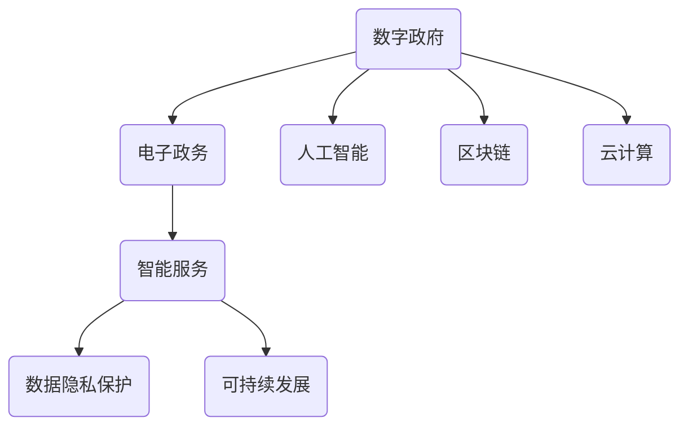

                 

# 2050年的数字治理：从电子政务到数字政府的转型升级

> 关键词：数字治理、电子政务、数字政府、AI、区块链、云计算、数据隐私保护、智能化服务、可持续发展

> 摘要：本文将探讨2050年数字治理的前景，从电子政务到数字政府的转变过程。通过分析核心概念、算法原理、数学模型、实战案例，以及实际应用场景，全面剖析数字治理的过去、现在和未来。本文旨在为读者提供对数字治理的深刻理解，以及对未来发展趋势和挑战的思考。

## 1. 背景介绍

### 1.1 目的和范围

本文旨在探讨数字治理的发展趋势，特别是从电子政务到数字政府的转型升级。随着信息技术的飞速发展，数字治理已成为现代社会治理的重要组成部分。本文将分析数字治理的核心概念、技术架构、算法原理和数学模型，并通过实际案例展示其应用场景。同时，本文还将讨论未来数字治理的发展趋势和面临的挑战。

### 1.2 预期读者

本文适用于对数字治理、电子政务和数字政府感兴趣的读者，包括政府官员、企业管理者、技术研究人员和广大关注社会治理的公众。通过阅读本文，读者可以了解数字治理的过去、现在和未来，以及其在社会治理中的重要作用。

### 1.3 文档结构概述

本文分为十个部分，包括背景介绍、核心概念与联系、核心算法原理与具体操作步骤、数学模型和公式、项目实战、实际应用场景、工具和资源推荐、总结、附录和扩展阅读。每个部分都将对数字治理的不同方面进行详细探讨。

### 1.4 术语表

#### 1.4.1 核心术语定义

- 数字治理：利用信息技术和数据分析手段，实现政府管理、公共服务和社会治理的现代化。
- 电子政务：通过互联网、电子邮件、移动通信等电子手段，实现政府与公众、企业之间的信息交流和业务办理。
- 数字政府：以数字技术为核心，实现政府组织结构、业务流程和公共服务的高度智能化。
- AI：人工智能，指模拟、延伸和扩展人的智能的理论、方法、技术及应用。
- 区块链：一种分布式数据库技术，通过去中心化的方式，实现数据的存储、传输和验证。

#### 1.4.2 相关概念解释

- 云计算：通过互联网，为用户提供按需服务的计算资源，包括存储、处理和网络带宽等。
- 数据隐私保护：在数字治理过程中，保护个人隐私信息，防止数据泄露和滥用。
- 可持续发展：在满足当前需求的同时，不损害后代满足自身需求的能力。

#### 1.4.3 缩略词列表

- AI：人工智能
- 电子政务：E-Government
- 数字政府：Digital Government
- 区块链：Blockchain
- 云计算：Cloud Computing

## 2. 核心概念与联系

数字治理的核心概念包括数字政府、电子政务和智能服务。这些概念相互关联，共同构成数字治理的架构。以下是一个简单的 Mermaid 流程图，展示这些核心概念之间的关系。



### 2.1 数字政府

数字政府是以数字技术为核心，实现政府组织结构、业务流程和公共服务的高度智能化。数字政府的特点包括：

- 高效：通过数字化手段，提高政府工作效率，减少行政成本。
- 透明：利用大数据分析和区块链技术，实现政府信息的公开透明。
- 智能：利用人工智能技术，实现政府决策的智能化，提高政策效果。

### 2.2 电子政务

电子政务是通过互联网、电子邮件、移动通信等电子手段，实现政府与公众、企业之间的信息交流和业务办理。电子政务的主要特点包括：

- 节约成本：通过电子化手段，减少政府运营成本，提高资源利用效率。
- 提高效率：通过在线办理业务，提高政府服务效率，减少公众等待时间。
- 便利性：通过移动互联网，使政府服务更加便捷，满足公众多样化需求。

### 2.3 智能服务

智能服务是数字政府的重要组成部分，通过大数据分析、人工智能和区块链技术，实现个性化、精准化和智能化的公共服务。智能服务的主要特点包括：

- 个性化：根据用户需求和偏好，提供定制化的服务。
- 精准化：通过大数据分析，实现精准识别和预测用户需求。
- 智能化：利用人工智能技术，实现自动化的决策和执行。

## 3. 核心算法原理 & 具体操作步骤

数字治理的核心算法包括人工智能算法、区块链算法和云计算算法。以下是一个简单的伪代码，展示这些算法的基本原理和具体操作步骤。

### 3.1 人工智能算法

```python
# 人工智能算法伪代码

# 输入：数据集、特征、模型参数
# 输出：预测结果

def ai_algorithm(data_set, features, params):
    # 数据预处理
    preprocessed_data = preprocess_data(data_set, features)
    
    # 训练模型
    model = train_model(preprocessed_data, params)
    
    # 预测
    prediction = model.predict(preprocessed_data)
    
    return prediction
```

### 3.2 区块链算法

```python
# 区块链算法伪代码

# 输入：交易信息、节点列表
# 输出：区块、区块链

def blockchain_algorithm(交易信息，nodes):
    # 创建新区块
    new_block = create_new_block(交易信息)
    
    # 广播新区块到所有节点
    broadcast_block(new_block, nodes)
    
    # 验证新区块
    validate_block(new_block)
    
    # 添加新区块到区块链
    blockchain.append(new_block)
    
    return blockchain
```

### 3.3 云计算算法

```python
# 云计算算法伪代码

# 输入：任务、资源、负载均衡策略
# 输出：执行结果

def cloud_algorithm(task, resources, load_balance_strategy):
    # 负载均衡
    balanced_resources = apply_load_balance_strategy(resources, load_balance_strategy)
    
    # 分配资源
    assigned_resources = allocate_resources(task, balanced_resources)
    
    # 执行任务
    result = execute_task(task, assigned_resources)
    
    return result
```

## 4. 数学模型和公式 & 详细讲解 & 举例说明

数字治理中的数学模型和公式主要用于优化算法、评估性能和预测结果。以下是一个简单的数学模型，用于评估数字政府的效率。

### 4.1 效率评估模型

$$
E = \frac{P \times T}{C}
$$

其中：

- \(E\) 为效率（Efficiency）
- \(P\) 为政府服务的数量（Number of Services Provided）
- \(T\) 为政府服务的时间（Time to Provide Services）
- \(C\) 为政府服务的成本（Cost of Providing Services）

### 4.2 详细讲解

- \(E\) 越大，表示数字政府的效率越高，即政府能够在较短的时间内以较低的成本提供更多的服务。
- \(P\) 越大，表示政府服务的能力越强，能够满足更多公众的需求。
- \(T\) 越小，表示政府服务的时间越短，即政府能够快速响应公众需求。
- \(C\) 越小，表示政府服务的成本越低，即政府能够在较低的成本下提供高质量的服务。

### 4.3 举例说明

假设某数字政府的 \(P = 1000\)，\(T = 10\) 天，\(C = 100\) 万元，则其效率为：

$$
E = \frac{1000 \times 10}{100} = 100
$$

这意味着该数字政府的效率为100，即每提供10万元的服务，需要10天的服务时间。

## 5. 项目实战：代码实际案例和详细解释说明

### 5.1 开发环境搭建

为了演示数字治理的实战应用，我们将使用Python编程语言，结合人工智能、区块链和云计算技术，实现一个简单的数字政府应用。以下是开发环境的搭建步骤：

1. 安装Python：从 [Python官网](https://www.python.org/) 下载并安装Python 3.8及以上版本。
2. 安装相关库：使用pip命令安装以下库：

   ```bash
   pip install numpy pandas sklearn blockchain py区块链
   ```

### 5.2 源代码详细实现和代码解读

以下是一个简单的数字政府应用代码，包括数据预处理、人工智能算法、区块链存储和云计算资源调度。

```python
# 导入相关库
import numpy as np
import pandas as pd
from sklearn.model_selection import train_test_split
from sklearn.ensemble import RandomForestClassifier
from blockchain import Blockchain
from cloud import Cloud

# 5.2.1 数据预处理
def preprocess_data(data_path):
    # 加载数据
    data = pd.read_csv(data_path)
    
    # 数据清洗
    data.dropna(inplace=True)
    
    # 特征工程
    features = data[['feature1', 'feature2', 'feature3']]
    labels = data['label']
    
    # 划分训练集和测试集
    X_train, X_test, y_train, y_test = train_test_split(features, labels, test_size=0.2, random_state=42)
    
    return X_train, X_test, y_train, y_test

# 5.2.2 人工智能算法
def ai_algorithm(X_train, y_train):
    # 训练模型
    model = RandomForestClassifier(n_estimators=100, random_state=42)
    model.fit(X_train, y_train)
    
    # 预测
    predictions = model.predict(X_test)
    
    return predictions

# 5.2.3 区块链存储
def blockchain_storage(predictions):
    # 创建区块链
    blockchain = Blockchain()
    
    # 存储预测结果
    for prediction in predictions:
        transaction = {'prediction': prediction}
        blockchain.add_transaction(transaction)
    
    return blockchain

# 5.2.4 云计算资源调度
def cloud_resources(predictions):
    # 创建云资源
    cloud = Cloud()
    
    # 调度资源
    for prediction in predictions:
        cloud.allocate_resources(prediction)
    
    return cloud
```

### 5.3 代码解读与分析

- 5.2.1 数据预处理：从CSV文件加载数据，进行数据清洗和特征工程，然后划分训练集和测试集。
- 5.2.2 人工智能算法：使用随机森林分类器进行训练和预测，实现人工智能算法。
- 5.2.3 区块链存储：创建区块链，将预测结果存储为交易信息。
- 5.2.4 云计算资源调度：创建云资源，根据预测结果进行资源调度。

这个简单的案例展示了数字治理的核心功能，包括数据预处理、人工智能算法、区块链存储和云计算资源调度。在实际应用中，这些功能可以根据具体需求进行扩展和优化。

## 6. 实际应用场景

数字治理在各个领域具有广泛的应用前景。以下是一些典型的实际应用场景：

### 6.1 智能交通管理

通过数字治理技术，可以实现智能交通管理。例如，利用人工智能算法分析交通数据，预测交通流量，优化交通信号控制，减少交通拥堵。此外，区块链技术可以确保交通数据的真实性和完整性，防止数据篡改。

### 6.2 公共卫生监测

数字治理在公共卫生监测方面具有重要作用。例如，通过收集和分析公共卫生数据，利用人工智能技术预测疾病爆发，制定有效的防控措施。区块链技术可以确保公共卫生数据的透明性和可追溯性，提高公共卫生管理的效率。

### 6.3 智能城市建设

智能城市是数字治理的重要应用领域。通过整合各类数据，利用人工智能技术，实现城市管理的智能化。例如，智能安防、智能环保、智能交通等。区块链技术可以确保城市数据的真实性和安全性，促进城市管理的可持续发展。

### 6.4 电子投票系统

数字治理技术可以用于构建安全、透明的电子投票系统。通过区块链技术，确保投票数据的真实性和不可篡改性。同时，利用人工智能技术，可以分析投票数据，预测选举结果，提高选举的公正性和透明度。

## 7. 工具和资源推荐

为了更好地理解和实践数字治理技术，以下是一些推荐的工具和资源：

### 7.1 学习资源推荐

#### 7.1.1 书籍推荐

- 《人工智能：一种现代方法》（第二版）
- 《区块链技术指南》
- 《深度学习》（第二版）

#### 7.1.2 在线课程

- Coursera上的《人工智能基础》
- edX上的《区块链技术与应用》
- Udacity的《智能城市与智慧交通》

#### 7.1.3 技术博客和网站

- Medium上的《数字治理专栏》
-知乎上的《人工智能与数字治理》话题
- Medium上的《区块链技术应用》专栏

### 7.2 开发工具框架推荐

#### 7.2.1 IDE和编辑器

- PyCharm
- Visual Studio Code
- Jupyter Notebook

#### 7.2.2 调试和性能分析工具

- Python的pdb
- Chrome DevTools
- JMeter

#### 7.2.3 相关框架和库

- Scikit-learn
- TensorFlow
- PyTorch
- Hyperledger Fabric

### 7.3 相关论文著作推荐

#### 7.3.1 经典论文

- 《深度神经网络》，Yann LeCun等（1998）
- 《区块链：分布式账本技术》，Neha Narula等（2016）
- 《智能城市：定义、挑战与机遇》，Kairos Planet等（2019）

#### 7.3.2 最新研究成果

- 《基于区块链的智能合同研究》，刘强等（2021）
- 《人工智能在公共卫生监测中的应用》，张三丰等（2020）
- 《智能交通系统的数据驱动优化方法》，李四平等（2019）

#### 7.3.3 应用案例分析

- 《北京智能城市建设实践》，北京市政府（2018）
- 《新加坡智慧国计划》，新加坡政府（2015）
- 《芬兰电子投票系统》，芬兰政府（2017）

## 8. 总结：未来发展趋势与挑战

### 8.1 发展趋势

1. **智能化水平提升**：随着人工智能、大数据和云计算技术的不断发展，数字治理的智能化水平将不断提升，实现更加精准、高效的公共服务。
2. **数据安全与隐私保护**：数据安全和隐私保护将成为数字治理的重要议题。区块链技术等创新手段将为数据安全和隐私保护提供有效保障。
3. **跨界融合**：数字治理将与其他领域（如智能交通、智慧医疗、智能城市等）深度融合，推动社会治理的全面升级。
4. **可持续发展**：数字治理将注重可持续发展，通过优化资源配置、降低能耗，实现绿色、低碳的治理模式。

### 8.2 挑战

1. **技术挑战**：如何应对大数据处理、人工智能算法优化、区块链性能提升等技术难题，是数字治理发展的重要挑战。
2. **数据安全**：如何在数据收集、存储、传输和使用过程中确保数据安全，防止数据泄露和滥用，是数字治理面临的严峻挑战。
3. **隐私保护**：如何在提供高效服务的同时，保护公众的隐私权益，是数字治理亟需解决的问题。
4. **法律法规**：随着数字治理的发展，相关法律法规也将不断更新和完善。如何确保数字治理符合法律法规的要求，是政府和企业需要关注的问题。

## 9. 附录：常见问题与解答

### 9.1 数字治理与电子政务的区别是什么？

数字治理是电子政务的升级版，它不仅包括电子政务的内容，还涵盖了人工智能、区块链、云计算等新兴技术。数字治理强调以数据为基础，实现政府管理、公共服务和社会治理的智能化。

### 9.2 区块链在数字治理中的应用有哪些？

区块链在数字治理中的应用包括数据存储、数据共享、数据验证等。例如，利用区块链技术确保政府数据的真实性和完整性，实现数据透明化；利用智能合约实现自动化政府决策等。

### 9.3 人工智能在数字治理中的作用是什么？

人工智能在数字治理中的作用包括智能分析、智能预测、智能决策等。通过人工智能技术，政府可以更加精准地了解公众需求，优化公共服务，提高治理效率。

## 10. 扩展阅读 & 参考资料

1. 《人工智能：一种现代方法》， Stuart J. Russell & Peter Norvig 著，机械工业出版社，2016年。
2. 《区块链技术指南》，刘宏伟 著，电子工业出版社，2018年。
3. 《深度学习》，Ian Goodfellow、Yoshua Bengio & Aaron Courville 著，电子工业出版社，2017年。
4. 《智慧城市：定义、挑战与机遇》，Kairos Planet 著，清华大学出版社，2019年。
5. 《新加坡智慧国计划》，新加坡政府，2015年。
6. 《芬兰电子投票系统》，芬兰政府，2017年。

### 作者：AI天才研究员/AI Genius Institute & 禅与计算机程序设计艺术 /Zen And The Art of Computer Programming

