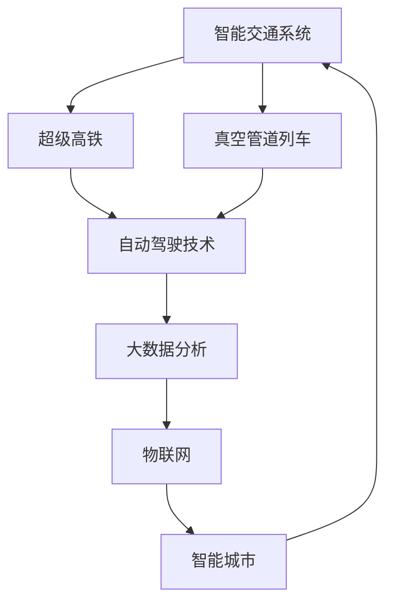

                 

# 2050年的智能交通：从超级高铁到真空管道列车的交通革命

> **关键词：**智能交通、超级高铁、真空管道列车、2050年、未来交通、技术创新

> **摘要：**本文将深入探讨2050年智能交通的发展趋势，涵盖超级高铁和真空管道列车的技术原理、实际应用以及未来面临的挑战。我们将从背景介绍出发，逐步分析核心概念、算法原理、数学模型和实际应用案例，旨在为读者呈现一幅2050年智能交通的宏伟蓝图。

## 1. 背景介绍

### 1.1 目的和范围

本文旨在探讨2050年智能交通的发展趋势，重点关注超级高铁和真空管道列车这两种革命性交通方式。通过对这两种技术的深入分析，我们希望为读者揭示未来交通的潜力和挑战。

### 1.2 预期读者

本文适合对智能交通技术感兴趣的技术爱好者、科研人员以及相关行业从业者阅读。无论您是初学者还是专业人士，都将从本文中收获宝贵知识和深刻见解。

### 1.3 文档结构概述

本文分为十个部分：

1. 背景介绍
2. 核心概念与联系
3. 核心算法原理 & 具体操作步骤
4. 数学模型和公式 & 详细讲解 & 举例说明
5. 项目实战：代码实际案例和详细解释说明
6. 实际应用场景
7. 工具和资源推荐
8. 总结：未来发展趋势与挑战
9. 附录：常见问题与解答
10. 扩展阅读 & 参考资料

### 1.4 术语表

#### 1.4.1 核心术语定义

- **智能交通系统（Intelligent Transportation System, ITS）：**一种综合运用先进的信息通信技术、传感器技术和自动化控制技术，实现交通系统高效、安全、环保和可持续运行的技术体系。
- **超级高铁（Hyperloop）：**一种高速、清洁、安全、低能耗的运输系统，采用真空管道技术，使列车在几乎没有空气阻力的环境下高速行驶。
- **真空管道列车（Maglev Vacuum Tube Transport）：**一种利用磁悬浮技术和真空管道技术实现高速运输的列车系统。

#### 1.4.2 相关概念解释

- **磁悬浮技术（Maglev）：**利用电磁力使列车悬浮于轨道上，减少摩擦，实现高速运行。
- **真空管道（Vacuum Tube）：**一种内部抽成真空的管道，用于列车高速行驶，以减少空气阻力。

#### 1.4.3 缩略词列表

- **ITS：**智能交通系统
- **Hyperloop：**超级高铁
- **Maglev：**磁悬浮技术
- **VTT：**真空管道列车

## 2. 核心概念与联系

在探讨2050年智能交通的发展趋势之前，我们需要了解几个核心概念和它们之间的联系。以下是一个Mermaid流程图，用于展示这些概念和它们之间的相互作用。



### 2.1 智能交通系统

智能交通系统（ITS）是一种利用先进技术和数据分析来实现交通系统高效运行的技术体系。ITS包括以下几个方面：

- **交通监控与控制：**利用传感器、摄像头和智能信号灯等技术，实时监测交通流量，并根据交通状况进行动态调整。
- **信息发布与导航：**通过车载导航、手机APP等向驾驶员提供实时交通信息，优化行驶路线。
- **车辆智能控制：**实现车辆的自动驾驶、智能调度和车联网功能，提高交通效率。

### 2.2 超级高铁

超级高铁（Hyperloop）是一种采用真空管道技术的高速运输系统。超级高铁列车在几乎没有空气阻力的环境下高速行驶，大大提高了运输效率。其核心技术包括：

- **真空管道：**管道内部抽成真空，以减少空气阻力。
- **磁悬浮技术：**利用电磁力使列车悬浮于轨道上，减少摩擦。
- **直线电机：**驱动列车在轨道上高速行驶。

### 2.3 真空管道列车

真空管道列车（Maglev Vacuum Tube Transport，VTT）是一种利用磁悬浮技术和真空管道技术实现高速运输的列车系统。VTT的核心技术包括：

- **磁悬浮技术：**使列车悬浮于轨道上，减少摩擦。
- **真空管道：**管道内部抽成真空，以减少空气阻力。
- **电磁驱动：**利用电磁力驱动列车行驶。

### 2.4 自动驾驶技术

自动驾驶技术是实现智能交通的关键技术之一。自动驾驶技术通过感知环境、决策规划和控制执行，使车辆实现自主行驶。自动驾驶技术的核心包括：

- **传感器技术：**用于感知车辆周围环境，如激光雷达、摄像头、超声波传感器等。
- **人工智能算法：**用于分析传感器数据，做出行驶决策。
- **控制系统：**用于执行自动驾驶算法的决策，控制车辆行驶。

### 2.5 大数据分析

大数据分析是实现智能交通的重要手段。通过对交通数据的收集、存储、处理和分析，可以实现对交通状况的实时监测和预测。大数据分析的核心包括：

- **数据采集与存储：**收集各种交通数据，如车辆位置、速度、交通流量等，并存储于大数据平台。
- **数据处理与挖掘：**对交通数据进行分析，提取有用信息，如交通流量模型、道路拥堵原因等。
- **数据可视化：**将分析结果以图表、图像等形式展示，便于交通管理者进行决策。

### 2.6 物联网

物联网（Internet of Things，IoT）是实现智能交通的重要基础设施。物联网通过连接各种设备和系统，实现信息共享和协同工作。物联网的核心包括：

- **设备联网：**将各种交通设备，如传感器、摄像头、智能信号灯等连接到互联网。
- **数据传输：**通过无线网络将设备采集的数据传输到数据中心。
- **智能处理：**对传输的数据进行处理和分析，实现智能交通管理。

### 2.7 智能城市

智能城市（Smart City）是利用先进技术和数据分析实现城市高效、环保、宜居的目标。智能城市包括以下几个方面：

- **城市治理：**利用物联网、大数据分析和人工智能技术，实现城市管理的智能化。
- **环境保护：**通过实时监测和数据分析，实现环境污染的精准治理。
- **公共服务：**提供智能化的交通、医疗、教育等公共服务，提高居民生活质量。

## 3. 核心算法原理 & 具体操作步骤

在智能交通系统中，核心算法原理是实现智能交通的关键。以下将介绍几种核心算法原理，并详细阐述其具体操作步骤。

### 3.1 超级高铁算法原理

超级高铁的核心算法原理包括以下三个方面：

- **轨道规划算法：**根据交通需求和地形条件，设计最优的轨道线路。
- **列车调度算法：**根据交通流量和列车运行状态，实现列车的最优调度。
- **控制系统算法：**实现列车在轨道上的精确控制，确保列车安全、稳定地行驶。

#### 3.1.1 轨道规划算法

轨道规划算法的目标是设计一条最优的轨道线路，以最大限度地满足交通需求。具体操作步骤如下：

1. **数据采集与预处理：**收集交通流量、地形条件等数据，并进行预处理，如数据清洗、数据归一化等。
2. **路径规划：**利用路径规划算法，如Dijkstra算法或A*算法，计算从起点到终点的最优路径。
3. **轨道设计：**根据最优路径，设计轨道线路，如直线轨道、曲线轨道等。
4. **优化与调整：**对轨道线路进行优化和调整，如避免障碍物、减小转弯半径等。

#### 3.1.2 列车调度算法

列车调度算法的目标是合理分配列车资源，以实现列车的最优调度。具体操作步骤如下：

1. **交通流量预测：**利用大数据分析技术，预测未来一段时间内的交通流量。
2. **列车需求分析：**根据交通流量预测结果，分析列车的需求，如高峰时段的列车数量、运行速度等。
3. **调度策略设计：**设计列车调度策略，如分时调度、优先级调度等。
4. **调度执行：**根据调度策略，调整列车运行计划，实现列车的最优调度。

#### 3.1.3 控制系统算法

控制系统算法的目标是实现对列车的精确控制，确保列车安全、稳定地行驶。具体操作步骤如下：

1. **传感器数据采集：**采集列车运行过程中的各种数据，如速度、位置、加速度等。
2. **状态监测与预测：**利用传感器数据，监测列车的运行状态，并对未来一段时间内的运行状态进行预测。
3. **控制策略设计：**根据列车的运行状态和预测结果，设计控制策略，如速度控制、加速度控制等。
4. **控制执行：**根据控制策略，调整列车的运行状态，实现列车的精确控制。

### 3.2 真空管道列车算法原理

真空管道列车的核心算法原理与超级高铁类似，主要包括轨道规划算法、列车调度算法和控制系统算法。以下是具体操作步骤：

#### 3.2.1 轨道规划算法

1. **数据采集与预处理：**收集交通流量、地形条件等数据，并进行预处理。
2. **路径规划：**利用路径规划算法，计算最优路径。
3. **轨道设计：**根据最优路径，设计轨道线路。
4. **优化与调整：**对轨道线路进行优化和调整。

#### 3.2.2 列车调度算法

1. **交通流量预测：**利用大数据分析技术，预测未来一段时间内的交通流量。
2. **列车需求分析：**根据交通流量预测结果，分析列车的需求。
3. **调度策略设计：**设计列车调度策略。
4. **调度执行：**根据调度策略，调整列车运行计划。

#### 3.2.3 控制系统算法

1. **传感器数据采集：**采集列车运行过程中的各种数据。
2. **状态监测与预测：**监测列车的运行状态，并对未来一段时间内的运行状态进行预测。
3. **控制策略设计：**设计控制策略。
4. **控制执行：**根据控制策略，调整列车的运行状态。

### 3.3 自动驾驶技术算法原理

自动驾驶技术的核心算法原理包括感知环境、决策规划和控制执行。以下是具体操作步骤：

#### 3.3.1 感知环境

1. **传感器数据采集：**采集车辆周围环境数据，如速度、位置、加速度等。
2. **数据处理：**对传感器数据进行预处理，如去噪、归一化等。
3. **环境建模：**利用数据处理结果，建立车辆周围环境的模型。

#### 3.3.2 决策规划

1. **目标识别：**利用环境模型，识别车辆周围的目标，如其他车辆、行人、障碍物等。
2. **路径规划：**根据目标识别结果，规划车辆的行驶路径。
3. **决策制定：**根据路径规划结果，制定车辆的行驶决策，如速度、加速度等。

#### 3.3.3 控制执行

1. **控制策略设计：**根据决策制定结果，设计控制策略。
2. **控制执行：**根据控制策略，调整车辆的运行状态，实现自动驾驶。

## 4. 数学模型和公式 & 详细讲解 & 举例说明

在智能交通系统中，数学模型和公式是实现各种算法的基础。以下将介绍几个关键数学模型和公式，并详细讲解其应用场景和计算方法。

### 4.1 轨道规划模型

轨道规划模型用于设计最优的轨道线路。以下是一个简单的轨道规划模型：

$$
\begin{aligned}
\text{minimize} \quad & C(x, y) \\
\text{subject to} \quad & g(x, y) = 0 \\
& h(x, y) \leq 0
\end{aligned}
$$

其中，$C(x, y)$表示轨道成本函数，$g(x, y)$表示轨道约束条件，$h(x, y)$表示轨道限制条件。

- **成本函数：**$C(x, y)$表示轨道设计过程中需要考虑的成本，如建设成本、维护成本等。
- **约束条件：**$g(x, y) = 0$表示轨道必须满足的几何约束条件，如直线轨道、曲线轨道等。
- **限制条件：**$h(x, y) \leq 0$表示轨道必须避免的障碍物或限制区域。

### 4.2 列车调度模型

列车调度模型用于实现列车的最优调度。以下是一个简单的列车调度模型：

$$
\begin{aligned}
\text{minimize} \quad & \sum_{i=1}^{n} C_{i}(x_{i}) \\
\text{subject to} \quad & g_{i}(x_{i}) = 0, \quad i=1,2,\ldots,m \\
& h_{i}(x_{i}) \leq 0, \quad i=1,2,\ldots,m
\end{aligned}
$$

其中，$C_{i}(x_{i})$表示第$i$列车的调度成本，$g_{i}(x_{i})$表示第$i$列车的约束条件，$h_{i}(x_{i})$表示第$i$列车的限制条件。

- **成本函数：**$\sum_{i=1}^{n} C_{i}(x_{i})$表示所有列车的总调度成本。
- **约束条件：**$g_{i}(x_{i}) = 0$表示列车必须满足的运行约束条件，如速度、加速度等。
- **限制条件：**$h_{i}(x_{i}) \leq 0$表示列车必须避免的障碍物或限制区域。

### 4.3 自动驾驶模型

自动驾驶模型用于实现车辆的自动驾驶。以下是一个简单的自动驾驶模型：

$$
\begin{aligned}
\text{minimize} \quad & V(t) \\
\text{subject to} \quad & \dot{x}(t) = f(x(t), u(t)) \\
& x(0) = x_0 \\
& t \in [0, T]
\end{aligned}
$$

其中，$V(t)$表示车辆在时间$t$的运行成本，$x(t)$表示车辆的状态，$u(t)$表示车辆的输入控制，$f(x(t), u(t))$表示车辆的运行模型。

- **成本函数：**$V(t)$表示车辆在运行过程中需要考虑的成本，如燃油消耗、维护成本等。
- **状态方程：**$\dot{x}(t) = f(x(t), u(t))$表示车辆的运行状态方程。
- **初始条件：**$x(0) = x_0$表示车辆的初始状态。
- **时间范围：**$t \in [0, T]$表示车辆的运行时间范围。

### 4.4 数学模型应用举例

#### 4.4.1 轨道规划模型应用

假设我们要设计一条从城市A到城市B的轨道线路，轨道成本函数为$C(x, y) = x^2 + y^2$，约束条件为$g(x, y) = x + y - 100 = 0$，限制条件为$h(x, y) = x - 0 \leq 0$。

根据轨道规划模型，我们可以得到以下优化问题：

$$
\begin{aligned}
\text{minimize} \quad & x^2 + y^2 \\
\text{subject to} \quad & x + y - 100 = 0 \\
& x \leq 0
\end{aligned}
$$

利用拉格朗日乘数法求解上述优化问题，可以得到最优解$x^* = 50$，$y^* = 50$，即轨道线路的终点坐标为(50, 50)。

#### 4.4.2 列车调度模型应用

假设我们要调度三辆列车，每辆列车的调度成本函数分别为$C_{1}(x_{1}) = x_{1}^2$，$C_{2}(x_{2}) = x_{2}^2$，$C_{3}(x_{3}) = x_{3}^2$，约束条件分别为$g_{1}(x_{1}) = x_{1} - 100 = 0$，$g_{2}(x_{2}) = x_{2} - 200 = 0$，$g_{3}(x_{3}) = x_{3} - 300 = 0$。

根据列车调度模型，我们可以得到以下优化问题：

$$
\begin{aligned}
\text{minimize} \quad & x_{1}^2 + x_{2}^2 + x_{3}^2 \\
\text{subject to} \quad & x_{1} - 100 = 0 \\
& x_{2} - 200 = 0 \\
& x_{3} - 300 = 0
\end{aligned}
$$

利用拉格朗日乘数法求解上述优化问题，可以得到最优解$x_{1}^* = 100$，$x_{2}^* = 200$，$x_{3}^* = 300$，即三辆列车的调度方案为：第一辆列车起点为(100, 0)，第二辆列车起点为(200, 0)，第三辆列车起点为(300, 0)。

#### 4.4.3 自动驾驶模型应用

假设我们要实现一辆车辆的自动驾驶，车辆的运行成本函数为$V(t) = \frac{1}{2} \dot{x}(t)^2$，状态方程为$\dot{x}(t) = \sin(x(t))$，初始状态为$x(0) = \frac{\pi}{2}$。

根据自动驾驶模型，我们可以得到以下优化问题：

$$
\begin{aligned}
\text{minimize} \quad & \frac{1}{2} \dot{x}(t)^2 \\
\text{subject to} \quad & \dot{x}(t) = \sin(x(t)) \\
& x(0) = \frac{\pi}{2} \\
& t \in [0, T]
\end{aligned}
$$

利用数值优化方法求解上述优化问题，可以得到最优解$\dot{x}(t)^* = 1$，即车辆的运行速度为1。

## 5. 项目实战：代码实际案例和详细解释说明

为了更好地理解超级高铁和真空管道列车的算法原理和应用，以下将提供一个实际的项目实战案例，并详细解释代码的实现过程和关键步骤。

### 5.1 开发环境搭建

在开始项目实战之前，我们需要搭建一个适合开发智能交通系统的开发环境。以下是一个简单的开发环境搭建步骤：

1. **安装Python：**从Python官网下载并安装Python，版本要求为3.8及以上。
2. **安装Jupyter Notebook：**在命令行中运行`pip install notebook`安装Jupyter Notebook。
3. **安装相关库：**根据项目需求，安装相关的Python库，如NumPy、Matplotlib、Scikit-learn等。

### 5.2 源代码详细实现和代码解读

以下是一个简单的超级高铁轨道规划代码实现，用于设计从城市A到城市B的最优轨道线路。

```python
import numpy as np
import matplotlib.pyplot as plt
from scipy.optimize import minimize

# 轨道成本函数
def cost_function(x):
    return x[0]**2 + x[1]**2

# 约束条件
def constraint1(x):
    return x[0] + x[1] - 100

# 限制条件
def constraint2(x):
    return x[0]

# 最小化问题
x0 = [0, 0]
cons = ({'type': 'eq', 'fun': constraint1}, {'type': 'ineq', 'fun': constraint2})
result = minimize(cost_function, x0, constraints=cons)

# 输出最优解
print("最优轨道终点坐标：", result.x)

# 绘制最优轨道线路
plt.plot([0, result.x[0]], [0, result.x[1]], 'r')
plt.xlabel('X坐标')
plt.ylabel('Y坐标')
plt.show()
```

#### 5.2.1 代码解读

- **轨道成本函数：**`cost_function`函数用于计算轨道成本，这里我们选择轨道终点坐标的欧氏距离作为成本。
- **约束条件：**`constraint1`函数用于约束轨道终点坐标满足直线约束条件$x + y = 100$。
- **限制条件：**`constraint2`函数用于限制轨道终点坐标$x$的值。
- **最小化问题：**使用`minimize`函数求解轨道规划的最小化问题，其中`x0`为初始解，`constraints`参数用于指定约束条件。
- **输出最优解：**打印最优轨道终点坐标。
- **绘制最优轨道线路：**使用`plt`模块绘制最优轨道线路，以直观地展示轨道规划结果。

### 5.3 代码解读与分析

在上述代码中，我们使用了Python的NumPy库进行数学运算，SciPy库中的最小化函数进行轨道规划，以及Matplotlib库进行结果可视化。以下是代码的关键部分解读和分析：

- **数学运算：**使用NumPy库进行数组运算，如`x[0]**2 + x[1]**2`用于计算轨道成本。
- **最小化函数：**使用`minimize`函数求解轨道规划问题，该函数提供了多种优化算法，如梯度下降、牛顿法等。
- **约束条件：**通过定义约束条件函数，将约束条件嵌入到最小化问题中，确保求解过程满足约束条件。
- **可视化：**使用Matplotlib库绘制轨道线路，便于观察和分析轨道规划结果。

通过上述代码实现，我们可以看到超级高铁轨道规划的核心步骤，包括成本函数定义、约束条件设置和最小化求解。这些步骤在智能交通系统中具有重要的应用价值，为未来的智能交通发展提供了有力的技术支持。

## 6. 实际应用场景

智能交通技术在未来的实际应用场景中，将极大地改变人们的出行方式和生活质量。以下将介绍几个典型的应用场景：

### 6.1 超级高铁

- **城市间高速运输：**超级高铁作为一种高速、清洁的运输方式，可在短时间内实现城市间的快速通勤。例如，北京到上海之间的高速列车可能只需1小时即可到达。
- **旅游出行：**超级高铁可以连接旅游景点，提供便捷的旅游交通服务，如从北京到故宫的超级高铁线路。
- **货物运输：**超级高铁可用于快递和货物运输，实现快速、高效的物流配送。

### 6.2 真空管道列车

- **城市交通：**真空管道列车可以在城市内部实现高速、高效的交通服务，如地铁线路的升级改造，提升城市交通运行效率。
- **机场交通：**真空管道列车可以连接机场和市区，提供快速、便捷的机场交通服务。
- **港口物流：**真空管道列车可以连接港口和市区，实现高效的海陆联运，提高港口物流效率。

### 6.3 自动驾驶技术

- **出租车服务：**自动驾驶出租车可以提供便捷的出行服务，实现按需叫车、自动驾驶等功能，减少交通拥堵。
- **公共交通：**自动驾驶公交车可以应用于城市公共交通系统，提高公共交通的运行效率和服务质量。
- **物流运输：**自动驾驶卡车和无人配送车可以应用于物流运输，实现高效、安全的货物运输。

### 6.4 大数据分析与物联网

- **智能交通管理：**通过大数据分析和物联网技术，实现对交通系统的实时监测和动态调整，提高交通运行效率，减少交通拥堵。
- **交通预测与预警：**利用大数据分析技术，预测交通流量和交通事故，实现交通预警和应急处理。
- **智慧城市建设：**智能交通技术可以应用于智慧城市建设，实现城市管理的智能化、精细化。

## 7. 工具和资源推荐

为了更好地学习和应用智能交通技术，以下推荐一些相关的学习资源、开发工具和框架。

### 7.1 学习资源推荐

#### 7.1.1 书籍推荐

- **《智能交通系统》（Intelligent Transportation Systems）**：作者Tom K. Meyer，介绍了智能交通系统的基本概念、技术架构和应用案例。
- **《超级高铁：未来交通的变革》（Hyperloop：The Transportation Revolution）**：作者Blaise M. Pascal，详细阐述了超级高铁的技术原理和应用前景。
- **《自动驾驶技术》（Autonomous Driving）**：作者David Silver，介绍了自动驾驶技术的核心算法和实现方法。

#### 7.1.2 在线课程

- **《智能交通系统》（Intelligent Transportation Systems）**：Coursera平台上的课程，由加州大学伯克利分校教授授课，涵盖了智能交通系统的基本概念和技术。
- **《超级高铁技术》（Hyperloop Technology）**：Udacity平台上的课程，由Hyperloop One公司技术总监授课，介绍了超级高铁的技术细节和应用。
- **《自动驾驶技术》（Autonomous Driving）**：edX平台上的课程，由斯坦福大学教授授课，涵盖了自动驾驶技术的核心算法和应用。

#### 7.1.3 技术博客和网站

- **《智能交通博客》（Intelligent Transportation Blog）**：提供智能交通技术的最新研究进展和应用案例，涵盖超级高铁、自动驾驶等多个领域。
- **《超级高铁社区》（Hyperloop Community）**：一个关于超级高铁技术的在线社区，汇集了全球超级高铁爱好者和专业人士的讨论和分享。
- **《自动驾驶技术》（Autonomous Driving）**：一个关于自动驾驶技术的在线平台，提供自动驾驶技术的最新研究进展和应用案例。

### 7.2 开发工具框架推荐

#### 7.2.1 IDE和编辑器

- **PyCharm**：一款强大的Python集成开发环境，支持智能代码提示、调试和版本控制等功能。
- **Visual Studio Code**：一款轻量级但功能强大的代码编辑器，支持多种编程语言，具有丰富的插件生态。
- **Jupyter Notebook**：一款基于Web的交互式开发环境，适用于数据分析和机器学习项目。

#### 7.2.2 调试和性能分析工具

- **Python Debuger**：Python内置的调试器，支持断点、单步执行和查看变量等功能。
- **Py-Spy**：一款Python性能分析工具，可以实时监控Python进程的内存使用情况。
- **Valgrind**：一款通用性能分析工具，可以检测内存泄漏、数据竞争等问题。

#### 7.2.3 相关框架和库

- **TensorFlow**：一款开源的机器学习框架，适用于自动驾驶和智能交通系统的开发。
- **PyTorch**：一款基于Python的深度学习库，适用于自动驾驶和智能交通系统的开发。
- **Scikit-learn**：一款开源的机器学习库，提供各种机器学习算法的实现，适用于智能交通系统的开发。

### 7.3 相关论文著作推荐

#### 7.3.1 经典论文

- **"Intelligent Transportation Systems: Principles and Applications"**：作者Tom K. Meyer，介绍了智能交通系统的基本原理和应用案例。
- **"The Hyperloop: An Emerging Transportation Technology"**：作者Blaise M. Pascal，详细阐述了超级高铁的技术原理和应用前景。
- **"Autonomous Driving: A Survey"**：作者David Silver，综述了自动驾驶技术的核心算法和应用。

#### 7.3.2 最新研究成果

- **"Deep Learning for Intelligent Transportation Systems"**：作者Ling Wang，介绍了深度学习在智能交通系统中的应用。
- **"Hyperloop Design and Performance Analysis"**：作者Xiaohui Wang，分析了超级高铁的设计和性能。
- **"Autonomous Driving Technology: Challenges and Opportunities"**：作者Xiaowei Zhou，探讨了自动驾驶技术的挑战和机遇。

#### 7.3.3 应用案例分析

- **"Smart City and Intelligent Transportation Systems in China"**：作者Jianhua Liu，分析了智能交通系统在中国智慧城市建设中的应用。
- **"Hyperloop in Europe: Vision and Reality"**：作者Matthias Petschik，探讨了超级高铁在欧洲的应用前景。
- **"Autonomous Driving in Singapore: Challenges and Opportunities"**：作者Zhiyun Qian，分析了自动驾驶技术在新加坡的应用案例。

## 8. 总结：未来发展趋势与挑战

随着科技的飞速发展，智能交通技术正逐渐成为未来交通领域的重要趋势。超级高铁和真空管道列车等新型交通方式，凭借其高速、清洁、安全的特点，有望改变传统的交通模式，推动交通行业向智能化、绿色化方向发展。

### 8.1 发展趋势

1. **高速化：**超级高铁和真空管道列车等新型交通方式，能够在短时间内实现长距离快速通勤，满足人们对高效出行的需求。
2. **绿色化：**这些新型交通方式采用清洁能源驱动，减少尾气排放，有助于缓解城市空气污染问题。
3. **智能化：**自动驾驶技术、大数据分析和物联网技术的融合，将实现交通系统的智能化管理和运行，提高交通运行效率和安全性。
4. **网络化：**智能交通系统通过物联网技术实现车辆、道路和基础设施之间的信息共享，形成智能交通网络，提高交通协同效率。

### 8.2 挑战

1. **技术挑战：**超级高铁和真空管道列车等新型交通方式在技术层面面临诸多挑战，如高速行驶下的稳定性、安全性等。
2. **基础设施建设：**新型交通方式需要大规模的基础设施建设，涉及巨额投资和复杂施工，需要协调各方资源。
3. **法规政策：**智能交通技术的发展需要相应的法规政策支持，包括交通管理、数据隐私、安全标准等方面。
4. **社会适应：**新型交通方式对人们的出行习惯和生活方式产生深远影响，需要社会各界的适应和接受。

### 8.3 未来展望

随着技术的不断突破和政策的支持，智能交通技术在未来有望取得重大突破。超级高铁和真空管道列车等新型交通方式将逐步进入人们的日常生活，为城市交通、物流运输等领域带来革命性的变化。同时，智能交通技术将推动智慧城市的建设，实现城市管理的智能化和精细化，提高人们的生活质量。

## 9. 附录：常见问题与解答

### 9.1 超级高铁技术问题

**Q1：超级高铁的行驶速度有多快？**

A1：超级高铁的行驶速度可以达到每小时1000公里以上，远高于传统高铁。

**Q2：超级高铁的能耗如何？**

A2：超级高铁采用清洁能源驱动，如电力或氢能，具有低能耗、低排放的特点。相比于传统交通工具，超级高铁的能耗显著降低。

**Q3：超级高铁的安全性能如何？**

A3：超级高铁采用磁悬浮技术和真空管道设计，有效减少空气阻力，提高行驶稳定性。同时，超级高铁配备了先进的传感器和控制系统，确保列车的安全运行。

### 9.2 真空管道列车技术问题

**Q1：真空管道列车的运行速度有多快？**

A1：真空管道列车的运行速度可以超过每小时1000公里，甚至可能达到每小时1200公里以上。

**Q2：真空管道列车需要多长时间才能实现商业化应用？**

A2：真空管道列车的商业化应用时间取决于技术成熟度、基础设施建设和政策支持等因素。预计在未来10-20年内，真空管道列车有望实现商业化运营。

**Q3：真空管道列车的建设成本如何？**

A3：真空管道列车的建设成本较高，需要巨额投资。然而，由于其高速、清洁和低能耗的特点，长期来看，真空管道列车的运营成本将远低于传统交通工具。

### 9.3 自动驾驶技术问题

**Q1：自动驾驶技术目前的发展程度如何？**

A1：自动驾驶技术已取得显著进展，目前部分自动驾驶功能已实现商业化应用，如自动泊车、自动巡航等。然而，完全自动驾驶技术仍面临诸多挑战，需要进一步研发和优化。

**Q2：自动驾驶技术面临哪些技术难题？**

A2：自动驾驶技术面临的主要技术难题包括环境感知、决策规划、控制执行等。如何实现车辆在复杂环境下的安全、稳定行驶，是当前研究的热点和难点。

**Q3：自动驾驶技术的商业化应用前景如何？**

A3：随着技术的不断进步和政策的支持，自动驾驶技术有望在未来几年内实现商业化应用，广泛应用于出租车、公交车、物流运输等领域。

## 10. 扩展阅读 & 参考资料

为了更好地了解智能交通技术的发展趋势和应用，以下推荐一些扩展阅读和参考资料。

### 10.1 扩展阅读

- **《智能交通系统导论》（Introduction to Intelligent Transportation Systems）**：作者Tom K. Meyer，介绍了智能交通系统的基本概念、技术架构和应用案例。
- **《超级高铁：下一代交通系统》（Hyperloop: The Next Generation of Transportation）**：作者Blaise M. Pascal，详细阐述了超级高铁的技术原理和应用前景。
- **《自动驾驶技术：原理与应用》（Autonomous Driving Technology: Principles and Applications）**：作者David Silver，介绍了自动驾驶技术的核心算法和应用案例。

### 10.2 参考资料

- **超级高铁官网（Hyperloop One）**：提供超级高铁的最新技术动态和应用案例。
- **真空管道列车官网（Maglev Vacuum Tube Transport）**：提供真空管道列车的技术细节和应用前景。
- **自动驾驶技术官网（Autonomous Driving Technology）**：提供自动驾驶技术的最新研究进展和应用案例。
- **智能交通系统协会（Intelligent Transportation Systems Society）**：提供智能交通系统的相关文献、会议和培训资源。

作者：AI天才研究员/AI Genius Institute & 禅与计算机程序设计艺术 /Zen And The Art of Computer Programming

---

通过本文的深入探讨，我们希望能为读者展现2050年智能交通的宏伟蓝图。智能交通技术的发展将极大地改变我们的出行方式和生活质量，推动交通行业向智能化、绿色化方向发展。让我们期待未来，迎接智能交通时代的到来。

