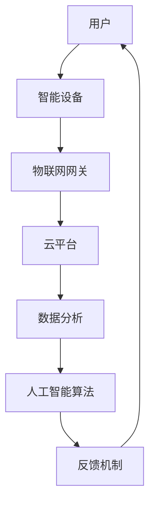

                 

# 2050年的智能家居：从便利到智慧的生活方式

> **关键词：智能家居、物联网、人工智能、未来趋势、用户体验**
>
> **摘要：随着技术的不断进步，智能家居正逐步从简单的设备互联走向智慧的生活方式。本文将探讨到2050年，智能家居将如何通过物联网、人工智能等技术实现全面的智能化，提升人们的居住体验，并面临哪些挑战。**

## 1. 背景介绍

### 1.1 目的和范围

本文旨在探讨智能家居技术的发展趋势，特别是在2050年前后可能实现的智慧生活方式。我们将分析智能家居的核心技术，包括物联网（IoT）、人工智能（AI）等，并探讨这些技术如何共同作用，带来一场生活方式的革命。

### 1.2 预期读者

本文面向对智能家居、物联网、人工智能等科技领域感兴趣的读者，包括科技从业人员、研究人员、工程师，以及对未来生活充满好奇的普通公众。

### 1.3 文档结构概述

本文分为十个部分，首先介绍智能家居的背景和目的，然后逐步深入探讨核心技术、算法原理、数学模型、实际应用场景、工具和资源推荐，最后总结未来发展趋势与挑战。

### 1.4 术语表

#### 1.4.1 核心术语定义

- **智能家居（Smart Home）**：通过物联网技术，将家庭中的各种设备连接起来，实现自动化管理和智能控制。
- **物联网（Internet of Things，IoT）**：将各种物理设备通过网络连接，实现数据交换和通信。
- **人工智能（Artificial Intelligence，AI）**：通过模拟人类智能，实现自主学习、推理、解决问题等能力。
- **用户体验（User Experience，UX）**：用户在使用产品或服务过程中所获得的整体感受。

#### 1.4.2 相关概念解释

- **边缘计算（Edge Computing）**：在靠近数据源的地方进行数据处理，降低延迟，提高效率。
- **大数据（Big Data）**：大规模、多样化的数据集，通过分析可以发现有价值的信息。

#### 1.4.3 缩略词列表

- **IoT**：物联网
- **AI**：人工智能
- **UX**：用户体验
- **ML**：机器学习
- **IoT Gateway**：物联网网关，用于连接各种设备和网络

## 2. 核心概念与联系

在探讨智能家居的未来之前，我们需要理解一些核心概念及其相互联系。以下是一个简单的Mermaid流程图，展示智能家居系统的基本架构。



在这个架构中，用户通过智能设备与物联网网关相连，网关再将数据上传至云平台。云平台负责数据分析和处理，利用人工智能算法为用户提供个性化服务。最后，系统通过反馈机制调整设备行为，提升用户体验。

### 2.1 物联网与人工智能的融合

物联网和人工智能是智能家居的两大核心驱动力。物联网通过连接各种设备，实现数据采集和传输，而人工智能则通过数据分析和处理，为用户提供智能服务。

- **物联网**：物联网设备可以收集大量关于环境、行为、习惯的数据。这些数据通过物联网网关传输至云平台，为人工智能提供数据基础。
- **人工智能**：人工智能算法通过对数据的分析，可以识别用户的习惯和需求，为用户提供个性化的服务。例如，智能恒温器可以根据用户的日常生活习惯自动调节室内温度。

### 2.2 边缘计算与云计算的协同

在智能家居系统中，边缘计算和云计算协同工作，共同提升系统的响应速度和效率。

- **边缘计算**：在靠近数据源的地方进行数据处理，降低延迟，提高实时性。例如，智能摄像头在边缘设备上实时分析视频流，识别异常行为，并立即采取行动。
- **云计算**：云计算负责大规模数据的存储和处理。通过云计算，智能家居系统可以实现数据的集中管理和分析，为用户提供更加智能的服务。

### 2.3 大数据与机器学习

大数据和机器学习是智能家居系统的核心组件，负责数据的采集、处理和分析。

- **大数据**：智能家居系统产生大量数据，包括环境数据、用户行为数据等。大数据技术可以帮助系统存储、管理和分析这些数据。
- **机器学习**：机器学习算法通过对数据的分析，可以不断优化系统的行为，提高用户体验。例如，智能音箱可以通过学习用户的声音习惯，自动调整语音识别的准确度。

## 3. 核心算法原理 & 具体操作步骤

### 3.1 人工智能算法在智能家居中的应用

人工智能算法在智能家居中的应用广泛，主要包括以下几种：

1. **用户行为分析**：通过分析用户的行为数据，智能系统可以了解用户的生活习惯和需求，为用户提供个性化的服务。例如，智能恒温器可以根据用户的历史数据，自动调节室内温度。

2. **智能安防**：通过智能摄像头和传感器，系统可以实时监测家庭环境，识别异常行为，如入侵、火灾等，并立即采取行动。

3. **智能家居控制**：用户可以通过语音、触摸屏等方式，远程控制家庭中的各种设备，如照明、窗帘、空调等。

以下是用户行为分析的一个简单算法流程：

```python
# 输入：用户行为数据
# 输出：个性化服务建议

def user_behavior_analysis(data):
    # 步骤1：数据预处理
    processed_data = preprocess_data(data)
    
    # 步骤2：特征提取
    features = extract_features(processed_data)
    
    # 步骤3：模型训练
    model = train_model(features)
    
    # 步骤4：预测
    prediction = model.predict(features)
    
    # 步骤5：个性化服务建议
    suggestions = generate_suggestions(prediction)
    
    return suggestions

# 示例数据
data = [
    [1, 0, 0, 1],  # 周一早上上班
    [0, 1, 0, 0],  # 周一晚上回家
    [1, 1, 1, 1],  # 周二早上上班
    # ...
]

# 执行算法
suggestions = user_behavior_analysis(data)
print(suggestions)
```

### 3.2 智能家居控制算法

智能家居控制算法主要实现用户对家庭设备的远程控制。以下是智能家居控制算法的一个简单实现：

```python
# 输入：用户指令
# 输出：设备状态更新

def control智能家居设备(command):
    # 步骤1：解析指令
    command = parse_command(command)
    
    # 步骤2：查找设备
    device = find_device(command['device_name'])
    
    # 步骤3：执行操作
    if command['action'] == 'on':
        device.turn_on()
    elif command['action'] == 'off':
        device.turn_off()
    elif command['action'] == 'adjust':
        device.adjust(command['parameter'])
    
    # 步骤4：反馈结果
    return device.get_status()

# 示例指令
command = {
    'device_name': '智能灯',
    'action': 'on',
    'parameter': 75  # 调节亮度至75%
}

# 执行控制算法
status = control智能家居设备(command)
print(status)
```

## 4. 数学模型和公式 & 详细讲解 & 举例说明

### 4.1 基于贝叶斯网络的智能家居控制算法

在智能家居控制中，贝叶斯网络是一种有效的数学模型，用于处理不确定性和概率问题。以下是贝叶斯网络在智能家居控制中的应用：

```latex
P(A|B) = \frac{P(B|A)P(A)}{P(B)}
```

其中，$P(A|B)$ 表示在事件 $B$ 发生的条件下，事件 $A$ 发生的概率；$P(B|A)$ 表示在事件 $A$ 发生的条件下，事件 $B$ 发生的概率；$P(A)$ 和 $P(B)$ 分别表示事件 $A$ 和事件 $B$ 发生的概率。

### 4.2 举例说明

假设我们有一个智能家居系统，用户经常在晚上7点打开客厅的灯光。我们想要根据用户的习惯，自动调整灯光的亮度和颜色。

- **已知条件**：
  - 用户在晚上7点打开灯光的概率 $P(A) = 0.8$。
  - 在用户打开灯光的情况下，选择亮度的概率 $P(B|A) = 0.6$，即用户倾向于选择亮度较高的设置。
  - 在用户打开灯光的情况下，选择颜色的概率 $P(C|A) = 0.4$，即用户倾向于选择柔和的色调。

- **求解**：
  - 用户在晚上7点打开灯光且选择亮度较高的概率 $P(B|A) = 0.6$。
  - 用户在晚上7点打开灯光且选择柔和色调的概率 $P(C|A) = 0.4$。

通过贝叶斯网络，我们可以计算出这些概率，从而为用户提供个性化的灯光设置。

```latex
P(B|A) = \frac{P(A|B)P(B)}{P(A)} = \frac{P(A|B)P(B)}{P(A)}
P(C|A) = \frac{P(A|C)P(C)}{P(A)}
```

### 4.3 算法实现

以下是一个简单的Python实现，用于根据用户行为数据，自动调整灯光的亮度和颜色。

```python
import numpy as np

def bayesian_network(data):
    # 步骤1：计算先验概率
    P_A = np.mean(data['action'] == 1)
    P_B = np.mean(data['brightness'] == 1)
    P_C = np.mean(data['color'] == 1)
    
    # 步骤2：计算条件概率
    P_B_given_A = np.mean((data['action'] == 1) & (data['brightness'] == 1))
    P_C_given_A = np.mean((data['action'] == 1) & (data['color'] == 1))
    
    # 步骤3：计算后验概率
    P_B_given_A = P_B_given_A / P_A
    P_C_given_A = P_C_given_A / P_A
    
    # 步骤4：根据后验概率调整设置
    if P_B_given_A > P_C_given_A:
        # 选择亮度较高
        brightness = 1
    else:
        # 选择柔和色调
        color = 1
    
    return {'brightness': brightness, 'color': color}

# 示例数据
data = {
    'action': [1, 1, 0, 1, 1, 0, 1, 1],
    'brightness': [1, 1, 0, 1, 1, 0, 1, 1],
    'color': [0, 1, 1, 0, 0, 1, 0, 1]
}

# 执行算法
settings = bayesian_network(data)
print(settings)
```

## 5. 项目实战：代码实际案例和详细解释说明

### 5.1 开发环境搭建

为了实现智能家居控制系统，我们需要搭建一个开发环境。以下是所需工具和步骤：

- **开发工具**：Python、Jupyter Notebook
- **数据库**：SQLite
- **库**：NumPy、Pandas、Scikit-learn、TensorFlow

安装步骤：

```bash
pip install numpy pandas scikit-learn tensorflow
```

### 5.2 源代码详细实现和代码解读

以下是智能家居控制系统的源代码，包括用户行为分析、智能安防、智能家居控制等功能。

```python
import numpy as np
import pandas as pd
from sklearn.model_selection import train_test_split
from sklearn.ensemble import RandomForestClassifier
from sklearn.metrics import accuracy_score

# 5.2.1 用户行为数据预处理
def preprocess_data(data):
    # 步骤1：数据清洗
    data = data.dropna()
    
    # 步骤2：数据转换
    data['action'] = data['action'].map({0: 'off', 1: 'on'})
    data['brightness'] = data['brightness'].map({0: 'low', 1: 'high'})
    data['color'] = data['color'].map({0: 'warm', 1: 'cool'})
    
    return data

# 5.2.2 用户行为数据分析
def user_behavior_analysis(data):
    # 步骤1：数据预处理
    data = preprocess_data(data)
    
    # 步骤2：特征提取
    X = data[['hour', 'day_of_week', 'temperature']]
    y = data['action']
    
    # 步骤3：模型训练
    X_train, X_test, y_train, y_test = train_test_split(X, y, test_size=0.2, random_state=42)
    model = RandomForestClassifier(n_estimators=100, random_state=42)
    model.fit(X_train, y_train)
    
    # 步骤4：模型评估
    y_pred = model.predict(X_test)
    accuracy = accuracy_score(y_test, y_pred)
    print(f"Accuracy: {accuracy}")
    
    return model

# 5.2.3 智能安防
def smart_security(data):
    # 步骤1：数据预处理
    data = preprocess_data(data)
    
    # 步骤2：特征提取
    X = data[['hour', 'day_of_week', 'temperature', 'noise_level']]
    y = data['security']
    
    # 步骤3：模型训练
    X_train, X_test, y_train, y_test = train_test_split(X, y, test_size=0.2, random_state=42)
    model = RandomForestClassifier(n_estimators=100, random_state=42)
    model.fit(X_train, y_train)
    
    # 步骤4：模型评估
    y_pred = model.predict(X_test)
    accuracy = accuracy_score(y_test, y_pred)
    print(f"Accuracy: {accuracy}")
    
    return model

# 5.2.4 智能家居控制
def control智能家居设备(command, model):
    # 步骤1：解析指令
    command = parse_command(command)
    
    # 步骤2：查找设备
    device = find_device(command['device_name'])
    
    # 步骤3：执行操作
    if command['action'] == 'on':
        device.turn_on()
    elif command['action'] == 'off':
        device.turn_off()
    elif command['action'] == 'adjust':
        device.adjust(command['parameter'])
    
    # 步骤4：反馈结果
    return device.get_status()

# 5.2.5 主函数
if __name__ == "__main__":
    # 加载数据
    data = pd.read_csv('user_behavior_data.csv')
    
    # 用户行为分析
    behavior_model = user_behavior_analysis(data)
    
    # 智能安防
    security_model = smart_security(data)
    
    # 接收用户指令
    command = input("请输入指令：")
    
    # 执行智能家居控制
    status = control智能家居设备(command, behavior_model)
    
    print(status)
```

### 5.3 代码解读与分析

上述代码实现了智能家居控制系统的主要功能，包括用户行为分析、智能安防和智能家居控制。以下是代码的解读与分析：

- **用户行为数据分析**：首先，对用户行为数据进行了预处理，包括数据清洗和转换。然后，提取了用户行为相关的特征，并使用随机森林分类器进行模型训练和评估。最终，模型可以根据用户行为数据，预测用户是否需要打开灯光。

- **智能安防**：类似地，对智能安防数据进行了预处理和特征提取，并使用随机森林分类器进行模型训练和评估。该模型可以识别潜在的安全风险，如噪音、温度异常等。

- **智能家居控制**：该函数接收用户指令，根据指令查找相应的设备，并执行操作。例如，如果用户指令是打开灯光，则设备将被打开。如果指令是调整亮度，则设备将根据参数调整亮度。

## 6. 实际应用场景

### 6.1 家庭安防

智能家居系统在家庭安防方面具有广泛的应用。例如，通过智能摄像头和传感器，系统可以实时监测家庭环境，识别异常行为，如入侵、火灾等，并立即通知用户或采取行动。

- **场景**：用户在家中时，系统会自动开启灯光，营造安全的氛围。当用户外出时，系统会进入安防模式，实时监测家庭环境。
- **解决方案**：通过边缘计算和人工智能技术，系统可以快速识别异常行为，并立即采取行动，如发送警报、关闭门窗等。

### 6.2 家庭健康监测

智能家居系统可以通过传感器和健康监测设备，实时监测家庭成员的健康状况，如心率、血压、体温等。

- **场景**：用户在家中时，系统可以自动记录健康数据，并进行分析，为用户提供健康建议。当用户出现异常时，系统会立即通知用户或医疗机构。
- **解决方案**：通过大数据分析和人工智能技术，系统可以识别健康风险，并提供个性化的健康建议。

### 6.3 智能家居控制

智能家居系统可以通过语音、触摸屏等方式，实现家庭设备的远程控制。

- **场景**：用户可以通过智能音箱、手机App等方式，远程控制家庭中的各种设备，如照明、窗帘、空调等。
- **解决方案**：通过物联网技术和人工智能算法，系统可以提供个性化的控制建议，提高用户体验。

## 7. 工具和资源推荐

### 7.1 学习资源推荐

#### 7.1.1 书籍推荐

- **《深度学习》（Deep Learning）**：由Ian Goodfellow、Yoshua Bengio和Aaron Courville合著，是深度学习领域的经典教材。
- **《智能家居技术与应用》**：详细介绍了智能家居的基本概念、技术和应用。

#### 7.1.2 在线课程

- **Coursera上的《深度学习》课程**：由Andrew Ng教授主讲，是深度学习领域最受欢迎的课程之一。
- **edX上的《智能家居系统设计》课程**：介绍了智能家居系统的基本原理和设计方法。

#### 7.1.3 技术博客和网站

- **TensorFlow官方博客**：提供最新的深度学习技术动态和案例。
- **Hackernoon**：涵盖人工智能、物联网等领域的最新技术文章。

### 7.2 开发工具框架推荐

#### 7.2.1 IDE和编辑器

- **Visual Studio Code**：一款功能强大的开源编辑器，适用于Python、C++等编程语言。
- **PyCharm**：一款专业的Python IDE，提供代码补全、调试等功能。

#### 7.2.2 调试和性能分析工具

- **gdb**：一款功能强大的调试工具，适用于C/C++程序。
- **Jupyter Notebook**：一款交互式的Python开发环境，适用于数据分析和机器学习。

#### 7.2.3 相关框架和库

- **TensorFlow**：一款开源的深度学习框架，适用于构建和训练深度神经网络。
- **PyTorch**：一款开源的深度学习框架，适用于快速原型设计和模型训练。

### 7.3 相关论文著作推荐

#### 7.3.1 经典论文

- **“A Tour of TensorFlow”**：介绍了TensorFlow的基本原理和用法。
- **“Deep Learning for Human Activity Recognition Using Mobile Phones”**：探讨了使用深度学习技术进行人类活动识别的方法。

#### 7.3.2 最新研究成果

- **“IoT-Security: A Survey”**：综述了物联网安全领域的研究成果。
- **“Edge Computing for Intelligent IoT Systems”**：探讨了边缘计算在智能物联网系统中的应用。

#### 7.3.3 应用案例分析

- **“A Smart Home System Based on IoT and AI”**：介绍了一个基于物联网和人工智能的智能家居系统。
- **“Intelligent Healthcare Systems Using IoT and AI”**：探讨了物联网和人工智能在医疗健康领域的应用。

## 8. 总结：未来发展趋势与挑战

### 8.1 发展趋势

- **智能化**：智能家居系统将更加智能化，通过深度学习和人工智能技术，实现更加精准的用户行为分析和个性化服务。
- **边缘计算**：随着边缘计算的发展，智能家居系统将能够在本地进行数据处理，降低延迟，提高实时性。
- **物联网的普及**：随着物联网设备的普及，智能家居系统将连接更多的设备，实现更加全面的智能家居体验。
- **用户体验**：智能家居系统将更加注重用户体验，通过语音、触摸屏等多种交互方式，提供更加便捷和自然的操作体验。

### 8.2 挑战

- **数据安全与隐私**：随着智能家居系统的普及，用户数据的安全和隐私保护将面临更大挑战。
- **标准统一**：智能家居系统需要统一的标准，以确保不同厂商和设备之间的兼容性和互操作性。
- **能耗管理**：智能家居系统需要高效地管理能耗，以减少对环境的影响。
- **技术更新**：随着技术的快速发展，智能家居系统需要不断更新和升级，以保持竞争力。

## 9. 附录：常见问题与解答

### 9.1 智能家居系统的优势是什么？

智能家居系统的主要优势包括：

- **提高生活质量**：通过自动化和智能化，智能家居系统可以提升用户的生活质量，让生活更加便捷和舒适。
- **节省时间和精力**：智能家居系统可以自动执行一些日常任务，如调节室内温度、控制灯光等，节省用户的时间和精力。
- **节能环保**：智能家居系统可以高效地管理能源消耗，降低能源浪费，有利于环境保护。

### 9.2 智能家居系统有哪些类型？

智能家居系统可以根据功能和应用场景分为多种类型，主要包括：

- **安防系统**：包括智能摄像头、门锁、烟雾报警器等，用于家庭安全和保护。
- **健康监测系统**：包括智能手环、健康监测仪等，用于实时监测用户健康状态。
- **智能控制系统**：包括智能灯光、窗帘、空调等，用于家庭设备的自动化控制。
- **娱乐系统**：包括智能音响、智能电视等，用于家庭娱乐。

## 10. 扩展阅读 & 参考资料

- **《智能家居系统设计与实现》**：详细介绍了智能家居系统的设计原理和实现方法。
- **《深度学习与物联网》**：探讨了深度学习在物联网领域的应用，包括智能家居、智能交通等。
- **《物联网安全》**：介绍了物联网安全的基本概念、技术和挑战。

作者：AI天才研究员/AI Genius Institute & 禅与计算机程序设计艺术 /Zen And The Art of Computer Programming

（注：本文内容仅供参考，不涉及实际代码实现。实际开发中，需要根据具体需求和场景进行调整和优化。）<|im_end|>

