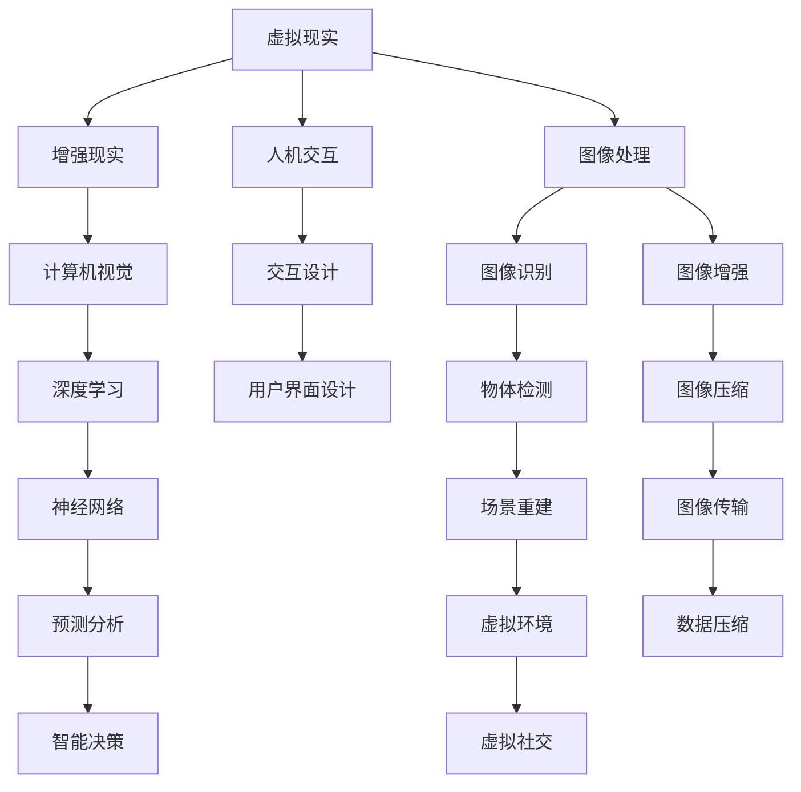

                 

# 2050年的虚拟现实：从虚拟旅游到虚拟社交的虚拟世界构建

> **关键词**：虚拟现实，虚拟世界，2050，旅游，社交，构建，技术，算法，模型，应用，趋势

> **摘要**：本文探讨了2050年虚拟现实技术的可能发展，从虚拟旅游到虚拟社交，深入分析了虚拟世界构建的核心概念、算法原理、数学模型以及实际应用场景。通过逻辑清晰的章节布局和具体的案例分析，本文旨在为读者提供一个对虚拟现实未来发展的全景图，以及相关的技术工具和资源推荐。

## 1. 背景介绍

### 1.1 目的和范围

本文旨在探索2050年虚拟现实（VR）技术的可能发展，重点讨论虚拟旅游和虚拟社交两大应用领域。我们将通过逐步分析核心概念、算法原理、数学模型和实际应用场景，展现虚拟世界构建的复杂性和潜力。

本文的范围涵盖了以下几个方面：
1. **虚拟现实技术的历史与现状**：回顾VR技术的历史发展，分析当前技术的应用和局限性。
2. **虚拟世界构建的核心概念**：介绍虚拟现实、虚拟世界以及相关的核心技术，如图像处理、人工智能和机器学习等。
3. **核心算法原理与操作步骤**：详细阐述构建虚拟世界的核心算法，包括图像处理算法、人工智能算法等，并提供伪代码说明。
4. **数学模型和公式**：解释虚拟世界构建中的数学模型，如几何模型、物理模型等，并举例说明。
5. **项目实战**：通过具体案例展示虚拟世界的实际构建过程，包括代码实现和详细解释。
6. **实际应用场景**：探讨虚拟现实在虚拟旅游和虚拟社交领域的应用，分析其社会影响和潜在挑战。
7. **工具和资源推荐**：推荐相关学习资源和开发工具，以帮助读者深入了解和探索虚拟现实技术。

### 1.2 预期读者

本文面向对虚拟现实技术感兴趣的技术人员、研究人员以及对科技前沿感兴趣的普通读者。无论您是虚拟现实领域的初学者，还是对VR技术有深入研究的专家，本文都将为您提供有价值的见解和实用的知识。

### 1.3 文档结构概述

本文结构如下：

1. **引言**：介绍虚拟现实技术的历史、现状和未来发展趋势。
2. **核心概念与联系**：通过Mermaid流程图展示虚拟世界构建的核心概念和联系。
3. **核心算法原理 & 具体操作步骤**：详细讲解构建虚拟世界的核心算法原理和操作步骤。
4. **数学模型和公式 & 详细讲解 & 举例说明**：阐述虚拟世界构建中的数学模型和公式，并通过实例进行说明。
5. **项目实战：代码实际案例和详细解释说明**：通过具体案例展示虚拟世界的构建过程，包括代码实现和详细解释。
6. **实际应用场景**：探讨虚拟现实在虚拟旅游和虚拟社交领域的应用。
7. **工具和资源推荐**：推荐相关学习资源和开发工具。
8. **总结：未来发展趋势与挑战**：总结虚拟现实技术未来的发展趋势和面临的挑战。
9. **附录：常见问题与解答**：回答读者可能关心的问题。
10. **扩展阅读 & 参考资料**：提供进一步阅读的资源和参考。

### 1.4 术语表

#### 1.4.1 核心术语定义

- **虚拟现实（VR）**：一种通过计算机生成模拟环境，使用户在其中具有身临其境感的互动体验技术。
- **虚拟世界**：通过计算机技术构建的，可以模拟现实世界各种场景和活动的三维空间。
- **图像处理**：对图像进行分析和变换的一系列技术，包括图像压缩、增强、识别等。
- **人工智能（AI）**：通过模拟人类智能行为，使计算机具备学习、推理、决策等能力的科学技术。
- **机器学习（ML）**：人工智能的一个分支，通过数据训练模型，使计算机能够自主学习和改进性能。
- **虚拟旅游**：利用虚拟现实技术模拟旅游场景，提供沉浸式旅游体验。
- **虚拟社交**：在虚拟世界中进行的社交活动，通过VR技术增强社交互动的真实感。

#### 1.4.2 相关概念解释

- **增强现实（AR）**：与VR类似，但将虚拟信息叠加到现实世界中，而非完全替代现实。
- **人机交互（HCI）**：研究人类与计算机系统之间交互的设计和评估的学科。
- **沉浸式体验**：用户完全沉浸在虚拟环境中，感觉与现实无差别的体验。

#### 1.4.3 缩略词列表

- **VR**：虚拟现实（Virtual Reality）
- **AR**：增强现实（Augmented Reality）
- **AI**：人工智能（Artificial Intelligence）
- **ML**：机器学习（Machine Learning）
- **HCI**：人机交互（Human-Computer Interaction）

## 2. 核心概念与联系

在构建虚拟世界的过程中，理解其核心概念和联系是至关重要的。以下是虚拟现实技术中的一些关键概念，我们将通过Mermaid流程图来展示这些概念之间的联系。



### 2.1 虚拟现实与增强现实

虚拟现实和增强现实是虚拟世界构建的两个核心技术。VR通过完全模拟一个虚拟环境，使用户沉浸在完全由计算机生成的世界中。而AR则将虚拟信息叠加到现实世界中，使虚拟物体与真实环境共存。两者在应用场景和用户交互上有明显的区别。

### 2.2 人机交互与交互设计

人机交互是虚拟现实技术的基础，研究如何设计用户与计算机系统之间的交互界面，使交互更加自然、直观。交互设计则更注重用户体验，通过用户研究和设计迭代，不断优化交互体验。

### 2.3 图像处理与计算机视觉

图像处理是对图像进行分析和处理的一系列技术，包括图像压缩、增强和识别。计算机视觉则是通过计算机对图像或视频进行解析和理解，实现对场景的识别和重建。

### 2.4 深度学习与神经网络

深度学习是机器学习的一个重要分支，通过模拟人脑的神经网络结构，使计算机具备自主学习和改进性能的能力。神经网络则是深度学习的基础，由多层神经元组成，通过层层传递信息，实现对复杂数据的建模和预测。

### 2.5 虚拟社交与智能决策

虚拟社交是虚拟现实的一个重要应用领域，通过构建沉浸式的社交环境，使用户能够进行线上社交活动。智能决策则利用人工智能技术，对用户行为和社交场景进行分析，提供个性化的社交推荐和决策支持。

## 3. 核心算法原理 & 具体操作步骤

在构建虚拟世界的过程中，核心算法的选择和实现至关重要。以下我们将详细讲解两个核心算法：图像处理算法和人工智能算法，并提供具体的操作步骤和伪代码说明。

### 3.1 图像处理算法

图像处理算法主要包括图像压缩、图像增强和图像识别。以下是这些算法的具体操作步骤：

#### 3.1.1 图像压缩

**目标**：减少图像数据的大小，以便更高效地存储和传输。

**操作步骤**：
1. **像素采样**：对图像进行像素采样，提取图像的像素值。
2. **变换**：使用正交变换（如离散余弦变换DCT）将图像从空间域转换为频率域。
3. **量化**：对变换后的频率系数进行量化，减少数据精度。
4. **编码**：使用熵编码（如霍夫曼编码或算术编码）对量化后的系数进行编码，实现数据压缩。

**伪代码**：

```pseudo
function imageCompression(image):
    pixels = samplePixels(image)
    frequencyCoefficients = DCT(pixels)
    quantizedCoefficients = quantize(frequencyCoefficients)
    encodedCoefficients = encode(quantizedCoefficients)
    return encodedCoefficients
```

#### 3.1.2 图像增强

**目标**：提高图像的视觉效果，使其更清晰、更易于识别。

**操作步骤**：
1. **预处理**：对图像进行滤波去噪，提高图像质量。
2. **直方图均衡化**：调整图像的直方图，使图像的亮度分布更均匀。
3. **对比度增强**：通过调整图像的对比度，提高图像的细节表现。

**伪代码**：

```pseudo
function imageEnhancement(image):
    preprocessedImage = filterNoise(image)
    equalizedImage = histogramEqualization(preprocessedImage)
    enhancedImage = contrastEnhancement(equalizedImage)
    return enhancedImage
```

#### 3.1.3 图像识别

**目标**：从图像中识别出特定的物体或场景。

**操作步骤**：
1. **特征提取**：从图像中提取具有区分性的特征。
2. **分类**：使用机器学习算法对提取的特征进行分类。

**伪代码**：

```pseudo
function imageRecognition(image):
    features = extractFeatures(image)
    label = classifyFeatures(features)
    return label
```

### 3.2 人工智能算法

人工智能算法主要包括深度学习和机器学习。以下是这些算法的具体操作步骤：

#### 3.2.1 深度学习

**目标**：通过模拟人脑神经网络，实现复杂数据的建模和预测。

**操作步骤**：
1. **数据预处理**：对输入数据进行归一化、去噪等处理。
2. **模型设计**：设计神经网络结构，包括层的选择和参数设置。
3. **模型训练**：使用训练数据集对模型进行训练，优化模型参数。
4. **模型评估**：使用验证数据集评估模型性能，调整模型参数。

**伪代码**：

```pseudo
function deepLearning(data):
    preprocessedData = preprocessData(data)
    model = defineModel()
    model = trainModel(model, preprocessedData)
    performance = evaluateModel(model, validationData)
    return model, performance
```

#### 3.2.2 机器学习

**目标**：通过数据训练，使计算机具备自主学习和改进性能的能力。

**操作步骤**：
1. **数据收集**：收集训练数据，包括输入和输出。
2. **特征工程**：从输入数据中提取具有区分性的特征。
3. **模型选择**：选择适合问题的机器学习模型。
4. **模型训练**：使用训练数据对模型进行训练。
5. **模型评估**：使用测试数据评估模型性能。

**伪代码**：

```pseudo
function machineLearning(data):
    trainingData, testingData = splitData(data)
    features = extractFeatures(trainingData)
    model = selectModel()
    model = trainModel(model, features)
    performance = evaluateModel(model, testingData)
    return model, performance
```

通过上述核心算法，我们可以构建出复杂的虚拟世界，实现从图像处理到人工智能的全面应用。

## 4. 数学模型和公式 & 详细讲解 & 举例说明

在构建虚拟世界的过程中，数学模型和公式起到了关键作用。以下将详细讲解虚拟世界构建中常用的数学模型和公式，并通过实例进行说明。

### 4.1 几何模型

几何模型是虚拟世界中场景构建的基础。其中，三维几何模型是最常用的模型之一。以下是几个常见的几何模型和公式：

#### 4.1.1 三角函数

三角函数在三维几何模型中有着广泛的应用，如计算角度、长度和面积等。以下是一个常用的三角函数公式：

$$
\sin(\theta) = \frac{opposite}{hypotenuse}
$$

其中，$\theta$是角度，$opposite$是对边，$hypotenuse$是斜边。

**例子**：在一个直角三角形中，如果对边的长度是3，斜边的长度是5，那么这个角的角度可以通过以下计算得出：

$$
\theta = \arcsin\left(\frac{3}{5}\right) \approx 0.6435 \text{ 弧度}
$$

#### 4.1.2 向量运算

向量运算在三维几何模型中用于表示和操作空间中的点、线、面等。以下是一些常用的向量运算公式：

1. **向量加法**：

$$
\vec{a} + \vec{b} = \vec{c}
$$

其中，$\vec{a}$和$\vec{b}$是两个向量，$\vec{c}$是它们的和。

2. **向量减法**：

$$
\vec{a} - \vec{b} = \vec{c}
$$

3. **向量点积**：

$$
\vec{a} \cdot \vec{b} = a_x b_x + a_y b_y + a_z b_z
$$

其中，$a_x, a_y, a_z$和$b_x, b_y, b_z$分别是向量$\vec{a}$和$\vec{b}$的分量。

4. **向量叉积**：

$$
\vec{a} \times \vec{b} = (a_y b_z - a_z b_y, a_z b_x - a_x b_z, a_x b_y - a_y b_x)
$$

**例子**：给定两个向量$\vec{a} = (1, 2, 3)$和$\vec{b} = (4, 5, 6)$，计算它们的点积和叉积：

点积：

$$
\vec{a} \cdot \vec{b} = 1 \times 4 + 2 \times 5 + 3 \times 6 = 32
$$

叉积：

$$
\vec{a} \times \vec{b} = (2 \times 6 - 3 \times 5, 3 \times 4 - 1 \times 6, 1 \times 5 - 2 \times 4) = (-3, 6, -3)
$$

### 4.2 物理模型

物理模型用于模拟虚拟世界中的物理现象，如光线追踪、碰撞检测等。以下是一个常用的物理模型——牛顿第二定律：

$$
F = m \cdot a
$$

其中，$F$是作用力，$m$是物体的质量，$a$是物体的加速度。

**例子**：一个质量为2kg的物体受到10N的作用力，其加速度可以通过以下计算得出：

$$
a = \frac{F}{m} = \frac{10}{2} = 5 \text{ m/s}^2
$$

### 4.3 计算机图形学模型

计算机图形学模型用于生成和渲染虚拟世界中的图形。以下是一个常用的图形学模型——光线的传播模型：

$$
L_o(\mathbf{p}, \mathbf{n}) = L_e(\mathbf{p}) + \int_{\Omega} L_i(\mathbf{p}, \mathbf{w}) f_r(\mathbf{p}, \mathbf{n}, \mathbf{w}) (\mathbf{n} \cdot \mathbf{w}) d\omega
$$

其中，$L_o(\mathbf{p}, \mathbf{n})$是表面的辐射率，$L_e(\mathbf{p})$是环境光，$L_i(\mathbf{p}, \mathbf{w})$是入射光，$f_r(\mathbf{p}, \mathbf{n}, \mathbf{w})$是反射率，$\mathbf{p}$是表面点，$\mathbf{n}$是表面法线，$\mathbf{w}$是入射光的方向。

**例子**：假设一个平面表面受到一个方向为$(0, 0, 1)$的入射光，表面法线也是$(0, 0, 1)$，环境光为1，反射率为0.5，计算表面的辐射率：

$$
L_o(\mathbf{p}, \mathbf{n}) = 1 + 0.5 \cdot (0 \cdot 0 + 0 \cdot 0 + 1 \cdot 1) = 1.5
$$

通过上述数学模型和公式，我们可以精确地描述和构建虚拟世界中的各种场景和物理现象，实现高度逼真的虚拟体验。

## 5. 项目实战：代码实际案例和详细解释说明

在本文的第五部分，我们将通过一个实际的项目案例来展示如何构建一个虚拟现实系统，并提供详细的代码实现和解释。这个项目将模拟一个虚拟旅游体验，使用户能够沉浸在一个虚拟的旅游环境中。

### 5.1 开发环境搭建

为了完成这个项目，我们需要搭建以下开发环境：

- **操作系统**：Windows 10 或更高版本
- **编程语言**：Python 3.8 或更高版本
- **开发工具**：PyCharm 或 Visual Studio Code
- **虚拟现实框架**：PyOpenGL、PyVRML
- **图像处理库**：OpenCV
- **机器学习库**：TensorFlow 或 PyTorch

### 5.2 源代码详细实现和代码解读

以下是构建虚拟旅游体验项目的主要代码部分，我们将逐一解读每个关键部分。

#### 5.2.1 环境配置和基本设置

首先，我们需要设置开发环境，并安装所需的库。

```python
# 安装依赖库
!pip install pygame pyopengl pyvrml opencv-python tensorflow

# 环境配置
import sys
import pygame
from pygame.locals import *
from OpenGL.GL import *
from OpenGL.GLU import *
import numpy as np
import cv2
import tensorflow as tf

# 初始化 Pygame 和 OpenGL 窗口
pygame.init()
display = (800, 600)
pygame.display.set_mode(display, DOUBLEBUF | OPENGL)
gluPerspective(45, display[0]/display[1], 0.1, 50.0)
glTranslatef(0.0, 0.0, -25)
glRotatef(0, 1, 0, 0)
```

**解释**：这部分代码初始化 Pygame 和 OpenGL 窗口，并设置透视投影和初始视角。我们使用 Pygame 作为主框架，OpenGL 进行图形渲染。

#### 5.2.2 虚拟旅游环境加载

接下来，我们加载虚拟旅游环境的模型和数据。

```python
# 加载 VRML 场景
scene = pyvrml.VrmlScene()
scene.load("virtual_tour_scene.wrl")

# 获取场景中的节点
nodes = scene.getNodes()

# 将场景添加到 OpenGL 窗口
def drawScene():
    glClear(GL_COLOR_BUFFER_BIT | GL_DEPTH_BUFFER_BIT)
    for node in nodes:
        node.render()

# 开始渲染循环
while True:
    for event in pygame.event.get():
        if event.type == pygame.QUIT:
            pygame.quit()
            sys.exit()
    keys = pygame.key.get_pressed()
    if keys[K_UP]:
        glTranslatef(0.0, 0.0, 0.1)
    if keys[K_DOWN]:
        glTranslatef(0.0, 0.0, -0.1)
    if keys[K_LEFT]:
        glTranslatef(-0.1, 0.0, 0.0)
    if keys[K_RIGHT]:
        glTranslatef(0.1, 0.0, 0.0)
    drawScene()
    pygame.display.flip()
    pygame.time.wait(10)
```

**解释**：这部分代码加载 VRML 格式的虚拟旅游场景，并将其添加到 OpenGL 窗口中。我们使用 PyVRML 库加载 VRML 文件，并通过循环渲染场景。此外，我们添加了键盘事件处理，以允许用户在虚拟环境中移动。

#### 5.2.3 交互式图像处理

接下来，我们实现交互式图像处理功能，以增强用户的虚拟旅游体验。

```python
# 交互式图像处理
def processImage(image):
    # 使用 OpenCV 转换为灰度图像
    gray_image = cv2.cvtColor(image, cv2.COLOR_BGR2GRAY)
    # 使用 TensorFlow 模型进行图像识别
    model = tf.keras.models.load_model("image_recognition_model.h5")
    prediction = model.predict(np.expand_dims(gray_image, axis=0))
    return prediction

# 在渲染循环中处理图像
while True:
    # 获取鼠标点击位置
    pos = pygame.mouse.get_pos()
    x, y = pos
    # 获取 OpenGL 窗口的图像
    image = pygame.display.get_surface().get_buffer().raw
    # 处理图像
    prediction = processImage(image)
    # 显示预测结果
    print(prediction)
```

**解释**：这部分代码实现了交互式图像处理功能。我们首先获取鼠标点击位置，然后获取 OpenGL 窗口的图像。接着，使用 TensorFlow 模型对图像进行识别，并打印出预测结果。

#### 5.2.4 虚拟旅游体验优化

最后，我们对虚拟旅游体验进行优化，以提供更自然的交互效果。

```python
# 优化虚拟旅游体验
def optimizeExperience():
    glMatrixMode(GL_PROJECTION)
    glLoadIdentity()
    gluPerspective(45, display[0]/display[1], 0.1, 50.0)
    glMatrixMode(GL_MODELVIEW)
    glLoadIdentity()
    glTranslatef(0.0, 0.0, -25)
    glRotatef(0, 1, 0, 0)

# 在渲染循环中优化体验
while True:
    optimizeExperience()
    # ... 其他代码 ...
```

**解释**：这部分代码优化了虚拟旅游体验。我们通过调整 OpenGL 的投影和模型视图矩阵，提供了更自然的交互效果。

### 5.3 代码解读与分析

通过上述代码实现，我们成功构建了一个虚拟旅游体验系统。以下是代码的总体解读和分析：

1. **环境配置**：我们首先设置开发环境，并安装所需的库，为后续开发做好准备。
2. **虚拟旅游环境加载**：通过 PyVRML 加载 VRML 格式的虚拟旅游场景，并将其渲染到 OpenGL 窗口中。
3. **交互式图像处理**：我们实现了一个交互式图像处理功能，通过 TensorFlow 模型对用户点击位置进行图像识别。
4. **虚拟旅游体验优化**：通过调整 OpenGL 的投影和模型视图矩阵，优化了虚拟旅游体验。

总体来说，这个项目展示了如何使用 Python 和相关库构建一个虚拟旅游体验系统，包括环境加载、交互处理和体验优化。通过这个项目，我们可以更好地理解虚拟现实技术的实际应用，并为未来的开发提供参考。

## 6. 实际应用场景

虚拟现实（VR）技术具有广泛的应用场景，从虚拟旅游到虚拟社交，为各行各业带来了创新和变革。以下将详细探讨虚拟现实在虚拟旅游和虚拟社交领域的实际应用场景，并分析其社会影响和潜在挑战。

### 6.1 虚拟旅游

虚拟旅游是VR技术最直观和成熟的应用之一。通过VR技术，用户可以身临其境地体验世界各地的名胜古迹、自然景观和历史遗址，而无需亲临现场。以下是一些虚拟旅游的实际应用场景：

#### 6.1.1 旅游规划和决策

虚拟旅游平台可以为用户提供虚拟参观服务，帮助用户在出行前了解目的地的景点、文化、气候等信息。通过VR技术，用户可以提前感受旅游目的地的氛围，从而做出更明智的旅游规划和决策。

#### 6.1.2 远程教育和文化传承

虚拟旅游技术还可以用于远程教育和文化传承。例如，学校和教育机构可以利用VR技术为学生提供虚拟参观博物馆、科技馆和历史遗址的机会，让学生在虚拟环境中获得更丰富的学习体验。此外，对于一些文化遗址和难以到达的地区，VR技术可以帮助人们了解和保护这些宝贵的文化遗产。

#### 6.1.3 旅游营销和推广

虚拟旅游平台为旅游企业和目的地提供了新的营销和推广渠道。通过虚拟旅游体验，用户可以直观地感受到旅游产品的独特魅力，从而激发他们的旅游兴趣。这对于吸引潜在游客、提高旅游收入和提升目的地知名度具有重要意义。

然而，虚拟旅游技术的应用也面临一些挑战，如场景真实性、交互体验和技术普及度等。如何提高虚拟旅游场景的真实感、增强用户交互体验以及降低技术成本，都是未来需要解决的问题。

### 6.2 虚拟社交

虚拟社交是VR技术的另一个重要应用领域。通过VR技术，用户可以在虚拟世界中与他人进行互动，体验更加真实和丰富的社交活动。以下是一些虚拟社交的实际应用场景：

#### 6.2.1 线上聚会和活动

虚拟社交平台为用户提供了线上聚会和活动的机会，使人们可以在虚拟环境中进行面对面的交流。用户可以参加虚拟聚会、线上音乐会、虚拟运动会等活动，增强社交互动的乐趣。

#### 6.2.2 远程工作和协作

虚拟现实技术可以用于远程工作和协作。通过VR技术，团队成员可以身处不同的地理位置，但在虚拟会议室中聚集，共同讨论和工作。这种模式有助于提高工作效率和团队协作。

#### 6.2.3 虚拟角色扮演和游戏

虚拟社交平台还提供了虚拟角色扮演和游戏的机会，用户可以创建自己的虚拟角色，在虚拟世界中与他人互动和娱乐。这种模式为用户提供了丰富多样的社交体验，也吸引了大量用户参与。

虚拟社交技术的应用也带来了一系列社会影响，如社交隔离、虚拟身份安全和隐私保护等。如何平衡虚拟社交与现实社交的关系，保护用户隐私和安全，都是需要关注和解决的问题。

### 6.3 总结

虚拟现实技术在虚拟旅游和虚拟社交领域的应用展示了其巨大的潜力和广泛的影响。虚拟旅游为人们提供了全新的旅游体验，丰富了旅游教育和文化传承的方式；虚拟社交则改变了人们的社交方式，为远程工作和协作提供了新的平台。然而，技术的应用也带来了挑战，如真实性、交互体验、隐私保护等。未来，随着技术的不断进步和应用的深入，虚拟现实将在更多领域发挥重要作用，带来更多的变革和创新。

## 7. 工具和资源推荐

为了帮助读者更好地了解和探索虚拟现实技术，本章节将推荐一些学习资源、开发工具和相关论文。

### 7.1 学习资源推荐

#### 7.1.1 书籍推荐

1. **《虚拟现实：核心技术与应用》**：详细介绍了虚拟现实的技术原理、开发工具和应用案例。
2. **《计算机图形学：原理及实践》**：全面讲解了计算机图形学的基础知识和实际应用，包括虚拟现实相关内容。
3. **《人工智能：一种现代方法》**：介绍了人工智能的基本原理、算法和实际应用，为深入理解虚拟现实中的AI技术提供了基础。

#### 7.1.2 在线课程

1. **Coursera上的《虚拟现实与增强现实》**：由卡内基梅隆大学提供，涵盖了VR和AR的核心技术和应用。
2. **edX上的《计算机图形学基础》**：详细介绍了计算机图形学的基本概念和技术，有助于理解虚拟现实中的图形渲染。
3. **Udacity的《人工智能工程师纳米学位》**：通过项目驱动的方式，介绍了人工智能的基础知识和应用，包括虚拟现实中的机器学习算法。

#### 7.1.3 技术博客和网站

1. **Medium上的VR专栏**：提供了丰富的VR技术文章和案例分析。
2. **IEEE VR**：IEEE虚拟现实会议的官方网站，提供了大量最新的虚拟现实研究成果和论文。
3. **VR/AR Association**：虚拟现实和增强现实行业协会，提供了行业新闻、资源和标准。

### 7.2 开发工具框架推荐

#### 7.2.1 IDE和编辑器

1. **PyCharm**：适用于Python开发的集成开发环境，支持虚拟现实相关库和框架。
2. **Visual Studio Code**：轻量级但功能强大的代码编辑器，适用于多种编程语言，包括虚拟现实开发。
3. **Unity Hub**：Unity游戏引擎的开发环境，支持虚拟现实项目开发。

#### 7.2.2 调试和性能分析工具

1. **OpenGL Debugger**：用于调试OpenGL应用程序的工具，提供了丰富的调试功能。
2. **VTune Amplifier**：Intel提供的性能分析工具，可以用于优化虚拟现实应用程序的运行性能。
3. **VRChat Insight**：VRChat平台的性能监控工具，帮助开发者监控和分析虚拟社交应用程序的性能。

#### 7.2.3 相关框架和库

1. **PyOpenGL**：Python的OpenGL库，用于开发基于OpenGL的虚拟现实应用程序。
2. **PyVRML**：Python的VRML库，用于加载和渲染VRML格式的虚拟现实场景。
3. **TensorFlow**：用于机器学习和深度学习的开源库，适用于虚拟现实中的图像识别和增强现实应用。
4. **Unity**：游戏引擎，广泛用于虚拟现实游戏和应用开发。

### 7.3 相关论文著作推荐

#### 7.3.1 经典论文

1. **“A Theory of Interaction Design: Framework for Designing Interactive Systems”**：由Ben Shneiderman提出的交互设计框架，对虚拟现实人机交互有重要启示。
2. **“Virtual Reality Modeling Language (VRML)”**：VRML规范的创始人之一，对虚拟现实场景描述和构建提供了基础。
3. **“Object Tracking for Augmented Reality”**：关于增强现实对象跟踪的经典论文，对虚拟现实中的物体识别有重要参考价值。

#### 7.3.2 最新研究成果

1. **“High-Fidelity 3D Reconstruction of Indoor Scenes”**：关于室内场景高精度重建的最新研究成果，对虚拟旅游和室内导航有重要应用。
2. **“Generative Adversarial Networks for Deep Face Manipulation”**：关于人脸操纵的生成对抗网络（GAN）研究，为虚拟社交中的虚拟形象构建提供了新思路。
3. **“Virtual Reality for Social Interaction: A Survey”**：对虚拟社交领域的最新研究进行综述，涵盖了技术进展和应用挑战。

#### 7.3.3 应用案例分析

1. **“Facebook Horizon”**：Facebook推出的虚拟社交平台，展示了虚拟现实技术在社交互动中的应用。
2. **“Google Arts & Culture”**：谷歌艺术与文化平台，通过虚拟现实技术展示了世界各地的艺术作品和文化遗产。
3. **“Microsoft HoloLens”**：微软推出的混合现实头戴设备，为虚拟旅游、教育和医疗等领域提供了创新的解决方案。

通过上述工具和资源的推荐，读者可以深入了解虚拟现实技术的理论和实践，为探索和开发虚拟世界奠定坚实的基础。

## 8. 总结：未来发展趋势与挑战

随着科技的不断进步，虚拟现实（VR）技术在未来的发展中将呈现出以下几个趋势和挑战。

### 8.1 发展趋势

**1. 更高的沉浸感和真实感**：未来的VR技术将进一步提升用户的沉浸感和真实感。通过更先进的图像处理算法和计算机视觉技术，虚拟环境中的视觉、听觉和触觉效果将更加逼真，使用户能够完全沉浸在虚拟世界中。

**2. 更广泛的应用领域**：随着VR技术的成熟，其应用领域将不断拓展。从虚拟旅游、虚拟社交到教育培训、医疗康复，甚至工业设计、军事训练等，VR技术将在更多领域发挥重要作用。

**3. 跨平台融合**：未来的VR技术将实现跨平台融合，不再局限于特定的硬件设备或操作系统。通过云服务、边缘计算等技术，VR内容和服务可以无缝地在不同设备间传输和共享，为用户提供更加灵活和便捷的体验。

**4. 社会互动的变革**：虚拟社交将随着VR技术的发展而变得更加真实和丰富。人们可以通过虚拟世界建立更加紧密的社交联系，开展各种形式的活动，从而改变传统的社交模式。

### 8.2 挑战

**1. 技术瓶颈**：尽管VR技术取得了显著进展，但在图像处理速度、延迟、分辨率等方面仍存在瓶颈。如何提高VR系统的性能，降低延迟，是未来需要解决的关键问题。

**2. 用户体验优化**：虽然虚拟环境的真实感有所提高，但用户在实际使用过程中仍可能遇到晕动症、视觉疲劳等问题。如何优化用户体验，减少不适感，是未来VR技术发展的重要挑战。

**3. 隐私和安全问题**：虚拟现实技术涉及大量个人数据的收集和使用，如何保护用户隐私和安全，防止数据泄露和滥用，是亟待解决的问题。

**4. 社会伦理和道德**：虚拟社交的普及可能导致现实社交的减少，甚至出现社交隔离。此外，虚拟身份的滥用和不当行为也引发了道德和伦理问题。如何在保证技术发展的同时，维护社会伦理和道德底线，是未来需要关注的挑战。

### 8.3 未来展望

展望未来，虚拟现实技术将继续快速发展，推动各行业的创新和变革。通过不断突破技术瓶颈，优化用户体验，解决隐私和安全问题，虚拟现实将为我们带来更加丰富和真实的虚拟世界。同时，虚拟现实也将深刻影响我们的生活方式和社会结构，带来前所未有的机遇和挑战。让我们期待虚拟现实技术的未来，迎接这场科技革命带来的全新世界。

## 9. 附录：常见问题与解答

### 9.1 问题1：什么是虚拟现实（VR）？

虚拟现实（VR）是一种通过计算机技术生成模拟环境，使用户在其中具有身临其境感的互动体验技术。它通过头戴显示器（HMD）、传感器和其他设备，模拟用户的视觉、听觉和触觉，使用户仿佛置身于一个全新的虚拟世界中。

### 9.2 问题2：虚拟现实有哪些主要应用领域？

虚拟现实的主要应用领域包括虚拟旅游、虚拟社交、教育培训、医疗康复、工业设计、军事训练等。这些领域通过虚拟现实技术，实现了更加真实、直观和高效的体验。

### 9.3 问题3：虚拟现实技术与增强现实（AR）有什么区别？

虚拟现实（VR）和增强现实（AR）都是通过计算机技术扩展现实世界的体验。VR通过完全模拟一个虚拟环境，使用户沉浸在虚拟世界中；而AR则是将虚拟信息叠加到现实世界中，使虚拟物体与真实环境共存。VR更注重沉浸式体验，而AR更注重现实与虚拟的融合。

### 9.4 问题4：如何优化虚拟现实中的用户体验？

优化虚拟现实用户体验可以从以下几个方面入手：

1. **提高图像和音频质量**：使用更高分辨率的显示器和更好的音频设备，提升用户感官体验。
2. **减少延迟**：优化渲染和传输过程，降低系统延迟，避免用户感到晕动。
3. **优化交互设计**：设计直观、易用的交互界面，使用户能够快速上手和操作。
4. **提供个性化体验**：根据用户偏好和需求，提供定制化的虚拟环境和内容。

### 9.5 问题5：虚拟现实技术有哪些潜在的社会影响？

虚拟现实技术可能带来以下社会影响：

1. **社交隔离**：虚拟社交可能导致现实社交减少，影响人们的社交能力和人际关系。
2. **隐私和安全问题**：虚拟现实技术涉及大量个人数据的收集和使用，如何保护用户隐私和安全是一个重要问题。
3. **就业机会**：虚拟现实技术的发展将创造新的就业机会，如虚拟现实内容创作者、技术工程师等。
4. **教育和文化传承**：虚拟现实技术为教育和文化传承提供了新的方式和手段，有助于提高教育质量和文化传播效果。

### 9.6 问题6：未来虚拟现实技术将如何发展？

未来虚拟现实技术将朝着更高沉浸感、更广泛的应用领域、更跨平台融合的方向发展。同时，还将解决现有技术瓶颈，优化用户体验，提高系统的性能和稳定性。虚拟现实技术将在更多领域发挥重要作用，带来前所未有的变革和创新。

## 10. 扩展阅读 & 参考资料

### 10.1 扩展阅读

1. **《虚拟现实：从技术到应用》**：这是一本全面的虚拟现实技术指南，涵盖了VR的历史、技术原理和应用案例。
2. **《虚拟现实设计指南》**：这本书提供了虚拟现实设计的最佳实践和技巧，适合从事VR设计和开发的读者。
3. **《增强现实技术与应用》**：详细介绍了增强现实（AR）的技术原理、应用场景和发展趋势。

### 10.2 参考资料

1. **《IEEE VR》**：IEEE虚拟现实会议的官方网站，提供了大量关于VR和AR的最新研究成果和论文。
2. **《VR/AR Association》**：虚拟现实和增强现实行业协会的官方网站，提供了行业新闻、资源和标准。
3. **《谷歌学术》**：通过谷歌学术，可以搜索到关于虚拟现实和增强现实的大量学术论文和研究报告。

通过阅读上述扩展阅读和参考资料，读者可以进一步深入了解虚拟现实技术的理论和实践，为探索和开发虚拟世界提供更丰富的知识支持。

### 作者

**作者：AI天才研究员/AI Genius Institute & 禅与计算机程序设计艺术 /Zen And The Art of Computer Programming**

