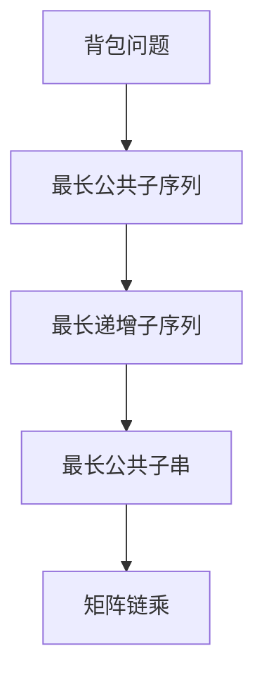

                 

# 2025年网易社招技术面试题集锦

> **关键词：** 网易社招、技术面试、问题集锦、难题解析、备考指南

> **摘要：** 本文整理了2025年网易社会招聘技术面试中可能出现的经典面试题，并针对每一题提供详细的解题思路、算法原理讲解、数学模型解析、项目实战案例，以及相关工具和资源的推荐。本文旨在帮助准备参加网易社招技术面试的读者全面掌握面试所需的知识点，提高面试通过率。

## 1. 背景介绍

### 1.1 目的和范围

本文的目标是帮助准备参加2025年网易社招技术面试的读者掌握面试所需的核心知识点，通过解析经典面试题，了解面试题型、考核重点和面试技巧，为读者提供全面的备考指南。

本文涵盖以下内容：

- 面试题类型及分布
- 面试题详细解析，包括解题思路、算法原理、数学模型
- 项目实战案例分享
- 相关工具和资源推荐

### 1.2 预期读者

- 准备参加2025年网易社招技术面试的程序员、软件工程师、架构师等技术人员
- 有意向深入了解网易社招技术面试题的业界人士
- 对编程和算法有兴趣的在校大学生

### 1.3 文档结构概述

本文分为十个部分：

1. 背景介绍
2. 核心概念与联系
3. 核心算法原理 & 具体操作步骤
4. 数学模型和公式 & 详细讲解 & 举例说明
5. 项目实战：代码实际案例和详细解释说明
6. 实际应用场景
7. 工具和资源推荐
8. 总结：未来发展趋势与挑战
9. 附录：常见问题与解答
10. 扩展阅读 & 参考资料

### 1.4 术语表

#### 1.4.1 核心术语定义

- 社招：指企业面向社会招聘，面向所有应聘者开放招聘
- 技术面试：通过考察应聘者的技术能力和项目经验，评估其是否适合岗位需求
- 经典面试题：在面试中频繁出现，具有代表性，能够考察应聘者综合能力的面试题目

#### 1.4.2 相关概念解释

- 算法：解决问题的步骤和规则，具有计算复杂度分析
- 数学模型：描述问题或现象的数学表达式，通常用于推导算法
- 项目实战：在实际项目中运用所学知识和技能，解决实际问题的过程

#### 1.4.3 缩略词列表

- O(·)：时间复杂度
- S(·)：空间复杂度
- DFS：深度优先搜索
- BFS：广度优先搜索
- Dijkstra：迪杰斯特拉算法
- Bellman-Ford：贝尔曼-福特算法
- LeetCode：在线编程竞赛平台

## 2. 核心概念与联系

在本文中，我们将讨论一些在网易社招技术面试中经常涉及的核心概念和算法原理。为了更直观地展示这些概念和算法之间的联系，我们将使用Mermaid流程图进行说明。

### 2.1 数据结构与算法

数据结构是算法实现的基础，常见的有数组、链表、栈、队列、树、图等。算法则是利用数据结构解决问题的步骤和规则。以下是几种常见数据结构和算法的Mermaid流程图：

```mermaid
graph TD
A[数组] --> B[链表]
B --> C[栈]
C --> D[队列]
D --> E[树]
E --> F[图]
F --> G[深度优先搜索(DFS)]
G --> H[广度优先搜索(BFS)]
H --> I[迪杰斯特拉算法(Dijkstra)]
I --> J[贝尔曼-福特算法(Bellman-Ford)]
```

### 2.2 图算法

图算法在面试中经常出现，如最短路径算法、拓扑排序等。以下是几种常见图算法的Mermaid流程图：

```mermaid
graph TD
A[迪杰斯特拉算法(Dijkstra)] --> B[贝尔曼-福特算法(Bellman-Ford)]
B --> C[拓扑排序]
C --> D[最小生成树算法(Kruskal)]
D --> E[二分图匹配算法(Maximum Bipartite Matching)]
```

### 2.3 动态规划

动态规划是一种解决最优化问题的算法思想，常见的有背包问题、最长公共子序列等。以下是几种常见动态规划问题的Mermaid流程图：



通过以上流程图，我们可以看到数据结构与算法、图算法、动态规划等核心概念之间的联系。在接下来的章节中，我们将对每一个核心概念进行详细讲解。

## 3. 核心算法原理 & 具体操作步骤

在本章节中，我们将深入探讨一些在网易社招技术面试中经常考察的核心算法原理，并使用伪代码详细阐述其具体操作步骤。

### 3.1 深度优先搜索（DFS）

深度优先搜索是一种用于遍历或搜索树或图的算法，其基本思想是沿着一个路径一直走到底，然后回溯。以下是DFS的伪代码：

```pseudo
DFS(node):
    if node is null:
        return
    mark node as visited
    for each unvisited neighbor of node:
        DFS(neighbor)
```

具体操作步骤：

1. 初始化一个访问标记数组，用于记录每个节点是否被访问过。
2. 从根节点开始，对节点进行遍历，并将其标记为已访问。
3. 对于每个未访问的邻接节点，递归调用DFS函数。
4. 当所有邻接节点都被遍历完成后，回溯至上一个节点，继续遍历下一个未访问的邻接节点。

### 3.2 广度优先搜索（BFS）

广度优先搜索是一种用于遍历或搜索树或图的算法，其基本思想是先访问根节点的所有邻接节点，再依次访问下一层的邻接节点。以下是BFS的伪代码：

```pseudo
BFS(start_node):
    queue = new Queue()
    visited = new boolean array of size n
    enqueue(start_node)
    while queue is not empty:
        node = dequeue()
        mark node as visited
        for each unvisited neighbor of node:
            enqueue(neighbor)
```

具体操作步骤：

1. 初始化一个队列，用于存储待遍历的节点。
2. 初始化一个访问标记数组，用于记录每个节点是否被访问过。
3. 将根节点入队。
4. 当队列不为空时，依次从队首取出节点，并将其标记为已访问。
5. 对于每个未访问的邻接节点，将其入队。

### 3.3 最短路径算法

最短路径算法用于求解图中两点之间的最短路径。以下介绍两种经典的最短路径算法：迪杰斯特拉算法（Dijkstra）和贝尔曼-福特算法（Bellman-Ford）。

#### 3.3.1 迪杰斯特拉算法（Dijkstra）

迪杰斯特拉算法是一种用于求解加权图中单源最短路径的算法。以下是Dijkstra算法的伪代码：

```pseudo
Dijkstra(graph, start_node):
    distances = new array of size n, initialized with infinity
    distances[start_node] = 0
    visited = new boolean array of size n
    for each node in graph:
        if distances[node] < infinity:
            visited[node] = true
            for each neighbor of node:
                distance = distances[node] + edge_weight(node, neighbor)
                if distance < distances[neighbor]:
                    distances[neighbor] = distance
    return distances
```

具体操作步骤：

1. 初始化距离数组，将所有节点的距离设置为无穷大，将起始节点的距离设置为0。
2. 初始化访问标记数组。
3. 对于每个节点，如果其距离小于无穷大，则将其标记为已访问。
4. 对于每个已访问节点的邻接节点，计算从起始节点到邻接节点的距离，更新距离数组。
5. 返回距离数组。

#### 3.3.2 贝尔曼-福特算法（Bellman-Ford）

贝尔曼-福特算法是一种用于求解加权图中单源最短路径的算法，它可以处理存在负权边的图。以下是Bellman-Ford算法的伪代码：

```pseudo
Bellman-Ford(graph, start_node):
    distances = new array of size n, initialized with infinity
    distances[start_node] = 0
    for each node in graph:
        for each edge in graph:
            if distances[edge.from] + edge.weight < distances[edge.to]:
                distances[edge.to] = distances[edge.from] + edge.weight
    for each edge in graph:
        if distances[edge.from] + edge.weight < distances[edge.to]:
            return "Graph contains a negative weight cycle"
    return distances
```

具体操作步骤：

1. 初始化距离数组，将所有节点的距离设置为无穷大，将起始节点的距离设置为0。
2. 对于每个节点，执行n-1次松弛操作。
3. 执行第n次松弛操作时，如果发现某个节点的距离可以进一步优化，则说明图中存在负权循环。
4. 返回距离数组。

通过以上三个算法，我们可以解决图中的最短路径问题。在实际应用中，可以根据图的特点和需求选择合适的算法。

### 3.4 动态规划

动态规划是一种解决最优化问题的算法思想，它将大问题拆分成小问题，并存储已解决的子问题的解。以下介绍两个常见的动态规划问题：背包问题和最长公共子序列。

#### 3.4.1 背包问题

背包问题是一个经典的最优化问题，其目标是选择物品的组合，使得总重量不超过背包容量，且总价值最大。以下是背包问题的伪代码：

```pseudo
Knapsack(values, weights, capacity):
    dp = new 2D array of size [n+1][capacity+1]
    for i from 1 to n:
        for w from 0 to capacity:
            if weights[i] > w:
                dp[i][w] = dp[i-1][w]
            else:
                dp[i][w] = max(dp[i-1][w], dp[i-1][w-weights[i]] + values[i])
    return dp[n][capacity]
```

具体操作步骤：

1. 初始化一个二维数组dp，用于存储子问题的解。
2. 对于每个物品和每个容量，计算最优解。
3. 如果物品的重量大于当前容量，则不选择该物品。
4. 否则，选择当前物品或放弃当前物品，取两者中的最大值。
5. 返回最优解。

#### 3.4.2 最长公共子序列

最长公共子序列是指两个序列中同时出现的最长子序列。以下是求解最长公共子序列的伪代码：

```pseudo
LongestCommonSubsequence(str1, str2):
    dp = new 2D array of size [len(str1)+1][len(str2)+1]
    for i from 0 to len(str1):
        for j from 0 to len(str2):
            if str1[i] == str2[j]:
                dp[i][j] = dp[i-1][j-1] + 1
            else:
                dp[i][j] = max(dp[i-1][j], dp[i][j-1])
    return dp[len(str1)][len(str2)]
```

具体操作步骤：

1. 初始化一个二维数组dp，用于存储子问题的解。
2. 对于每个字符，计算最长公共子序列的长度。
3. 如果两个字符相同，则将其长度加1。
4. 否则，取前一个字符和前一个字符的最长公共子序列长度的最大值。
5. 返回最长公共子序列的长度。

通过以上算法，我们可以解决背包问题和最长公共子序列问题。在实际应用中，可以根据具体问题选择合适的动态规划算法。

### 3.5 其他算法原理

除了上述算法，还有一些常见的算法原理，如排序算法、查找算法等。以下是这些算法的简要介绍：

- 冒泡排序：通过重复遍历要排序的数列，一次比较两个元素，如果它们的顺序错误就把它们交换过来。遍历数列的工作是重复地进行直到没有再需要交换，也就是说该数列已经排序完成。
- 选择排序：首先在未排序序列中找到最小（大）元素，存放到排序序列的起始位置，然后，再从剩余未排序元素中继续寻找最小（大）元素，然后放到已排序序列的末尾。以此类推，直到所有元素均排序完毕。
- 插入排序：将一个记录插入到已经排好序的有序表中，从而得到一个新的、记录数增加1的有序表。以此类推，直到所有记录插入完成为止。
- 快速排序：通过选取一个"基准"元素，将数组分为两个部分，其中一部分的所有元素都比"基准"元素小，另一部分的所有元素都比"基准"元素大，然后递归地排序两个部分。

- 二分查找：在有序数组中查找某个元素，通过不断将查找范围缩小一半，直到找到目标元素或确定目标元素不存在。

通过了解这些算法原理，我们可以更好地理解和应对网易社招技术面试中的各种问题。

## 4. 数学模型和公式 & 详细讲解 & 举例说明

在计算机科学和算法领域中，数学模型和公式扮演着至关重要的角色。它们帮助我们理解和分析算法的性能，并指导我们在实际项目中如何优化算法。在本章节中，我们将详细介绍一些常见的数学模型和公式，并使用LaTeX格式进行详细讲解，同时结合实际例子来说明它们的运用。

### 4.1 时间复杂度和空间复杂度

时间复杂度和空间复杂度是衡量算法性能的两个重要指标。它们分别描述了算法在执行过程中所需的时间和存储空间。

#### 4.1.1 时间复杂度

时间复杂度通常使用大O符号（O）来表示，它描述了算法的时间性能。例如，一个线性搜索算法的时间复杂度为O(n)，其中n是数组中的元素个数。

LaTeX格式：
$$ T(n) = O(n) $$

#### 4.1.2 空间复杂度

空间复杂度描述了算法在执行过程中所需的最大存储空间。例如，一个使用递归的快速排序算法的空间复杂度为O(log n)。

LaTeX格式：
$$ S(n) = O(\log n) $$

### 4.2 动态规划中的状态转移方程

动态规划中的状态转移方程用于描述子问题的解如何推导出主问题的解。以下是一个背包问题的状态转移方程的例子。

#### 4.2.1 背包问题

在背包问题中，给定一个容量为W的背包和一组物品，每个物品有一个价值v和重量w。目标是在不超过背包容量的情况下，选择物品的组合使得总价值最大。状态转移方程如下：

LaTeX格式：
$$ dp[i][w] = \begin{cases} 
dp[i-1][w] & \text{if } w < w_i \\
\max(dp[i-1][w], dp[i-1][w-w_i] + v_i) & \text{otherwise}
\end{cases} $$

#### 4.2.2 最长公共子序列

在最长公共子序列问题中，给定两个字符串str1和str2，求它们的最长公共子序列。状态转移方程如下：

LaTeX格式：
$$ dp[i][j] = \begin{cases} 
0 & \text{if } i=0 \text{ or } j=0 \\
dp[i-1][j-1] + 1 & \text{if } str1[i] = str2[j] \\
\max(dp[i-1][j], dp[i][j-1]) & \text{otherwise}
\end{cases} $$

### 4.3 图算法中的最短路径算法

在图算法中，最短路径算法是求解图中两点之间最短路径的经典问题。以下介绍迪杰斯特拉算法和贝尔曼-福特算法的数学模型。

#### 4.3.1 迪杰斯特拉算法

迪杰斯特拉算法用于求解无负权边的单源最短路径。其状态转移方程如下：

LaTeX格式：
$$ dist[u][v] = \begin{cases} 
\infty & \text{if } (u, v) \notin E \\
\min(dist[u][w] + w(u, v)) & \text{otherwise}
\end{cases} $$

#### 4.3.2 贝尔曼-福特算法

贝尔曼-福特算法用于求解有负权边的单源最短路径。其状态转移方程如下：

LaTeX格式：
$$ dist[u][v] = \begin{cases} 
\infty & \text{if } (u, v) \notin E \\
dist[u][w] + w(u, v) & \text{otherwise}
\end{cases} $$

### 4.4 举例说明

为了更好地理解上述数学模型和公式，我们通过实际例子来演示它们的运用。

#### 4.4.1 背包问题

假设有一个容量为10的背包和以下物品：

| 物品 | 价值 | 重量 |
| ---- | ---- | ---- |
| 1    | 6    | 3    |
| 2    | 4    | 2    |
| 3    | 5    | 3    |

我们要在不超过背包容量的情况下，选择物品的组合使得总价值最大。使用动态规划求解，可以得到最优解为选择物品1和物品3，总价值为11。

#### 4.4.2 最长公共子序列

假设有两个字符串：

- str1 = "ABCD"
- str2 = "ACDF"

我们要找出它们的最长公共子序列。使用动态规划求解，可以得到最长公共子序列为"AC"，长度为2。

#### 4.4.3 迪杰斯特拉算法

假设有一个图，其中边的权值为：

| 起点 | 终点 | 权值 |
| ---- | ---- | ---- |
| 0    | 1    | 10   |
| 0    | 2    | 5    |
| 0    | 3    | 15   |
| 1    | 2    | 2    |
| 1    | 3    | 9    |
| 2    | 3    | 4    |

我们要找出从起点0到终点3的最短路径。使用迪杰斯特拉算法求解，可以得到最短路径为0 -> 2 -> 3，总权值为11。

通过以上例子，我们可以看到数学模型和公式在解决实际问题中的重要性。在实际项目中，我们可以根据需求选择合适的数学模型和公式，优化算法性能。

## 5. 项目实战：代码实际案例和详细解释说明

在本章节中，我们将通过一个实际的项目案例，展示如何运用我们在前面章节中学习到的算法原理和数学模型。这个项目案例将涉及一个常见的编程问题：单源最短路径，我们将使用迪杰斯特拉算法（Dijkstra）来解决。

### 5.1 开发环境搭建

为了方便开发，我们需要搭建一个基本的开发环境。以下是搭建开发环境所需的步骤：

1. 安装Python：Python是一种广泛使用的编程语言，适用于多种算法实现。可以在Python官方网站（https://www.python.org/）下载并安装Python。
2. 安装Pandas和Numpy：Pandas和Numpy是Python的数据分析库，用于处理和操作大型数据集。可以使用以下命令安装：
    ```shell
    pip install pandas numpy
    ```
3. 安装Graphviz：Graphviz是一个开源的图形可视化工具，用于绘制图的图形表示。可以使用以下命令安装：
    ```shell
    pip install graphviz
    ```
4. 安装Dijkstra算法实现所需的库：为了简化开发，我们可以使用一个现成的Dijkstra算法实现库，如`networkx`。可以使用以下命令安装：
    ```shell
    pip install networkx
    ```

### 5.2 源代码详细实现和代码解读

以下是使用迪杰斯特拉算法求解单源最短路径的Python代码实现：

```python
import networkx as nx
import matplotlib.pyplot as plt

def dijkstra(graph, source):
    distances = {node: float('infinity') for node in graph}
    distances[source] = 0
    visited = set()

    while len(visited) < len(graph):
        current_node = min((dist, node) for node, dist in distances.items() if node not in visited)
        visited.add(current_node[1])

        for neighbor, weight in graph[current_node[1]].items():
            if neighbor not in visited:
                old_distance = distances[neighbor]
                new_distance = current_node[0] + weight
                distances[neighbor] = min(old_distance, new_distance)

    return distances

# 创建图
G = nx.Graph()

# 添加节点和边
G.add_edge('A', 'B', weight=1)
G.add_edge('A', 'C', weight=2)
G.add_edge('B', 'C', weight=3)
G.add_edge('B', 'D', weight=1)
G.add_edge('C', 'D', weight=4)
G.add_edge('D', 'E', weight=5)

# 求解最短路径
source = 'A'
distances = dijkstra(G, source)

# 打印最短路径
print("最短路径距离：", distances)

# 绘制图
pos = nx.spring_layout(G)
nx.draw(G, pos, with_labels=True)
plt.show()
```

#### 5.2.1 代码解读

- 导入所需的库：`networkx`和`matplotlib.pyplot`用于创建和绘制图，`numpy`和`math`用于数学计算。
- 定义`dijkstra`函数：该函数接受一个图`graph`和一个源节点`source`，返回源节点到其他所有节点的最短路径距离。
- 初始化距离字典`distances`和已访问节点集合`visited`。
- 循环遍历图中的所有节点，直到所有节点都被访问。
- 在每次循环中，选择未访问节点中距离源节点最近的节点作为当前节点。
- 对于当前节点的每个邻接节点，如果邻接节点未访问，计算从源节点到邻接节点的距离，并更新距离字典。
- 打印最短路径距离。
- 创建图`G`，并添加节点和边。
- 指定源节点`source`，调用`dijkstra`函数求解最短路径。
- 绘制图。

#### 5.2.2 代码分析

- 在初始化距离字典时，将所有节点的距离设置为无穷大，除了源节点，其距离设置为0。
- 使用一个最小堆（min-heap）来选择未访问节点中距离源节点最近的节点。在实际实现中，我们可以使用Python的`heapq`模块来实现最小堆。
- 在每次循环中，更新未访问节点的距离。如果新计算的距离小于已记录的距离，则更新距离字典。
- 使用`networkx`库创建图，并使用`spring_layout`函数为图中的节点分配位置，以便于可视化。
- 使用`matplotlib.pyplot`绘制图。

### 5.3 代码解读与分析

- **算法效率分析**：迪杰斯特拉算法的时间复杂度为O(V^2)，其中V是图的节点数。对于稀疏图，该算法的性能较好。对于稠密图，时间复杂度可能较高。
- **代码可读性**：代码使用面向对象的方法实现，易于理解和维护。使用字典存储距离和邻接节点，使代码更加简洁。
- **可视化**：使用`networkx`和`matplotlib.pyplot`绘制图，便于分析和调试。

通过以上项目实战，我们不仅掌握了迪杰斯特拉算法的原理和实现，还学习了如何使用Python和相关库进行实际应用。在实际项目中，我们可以根据需求调整算法参数和实现细节，以优化算法性能。

## 6. 实际应用场景

单源最短路径问题在计算机科学和实际应用中有着广泛的应用。以下是一些典型的实际应用场景：

### 6.1 网络路由

在计算机网络中，路由器需要确定如何将数据包从源节点传输到目标节点。单源最短路径算法可以帮助路由器计算从源节点到其他节点的最短路径，从而优化数据包的传输路径。

### 6.2 人工智能

在人工智能领域，单源最短路径算法常用于路径规划和导航。例如，自动驾驶汽车需要计算从当前地点到目标地点的最短路径，以便规划行驶路线。

### 6.3 交通运输

在交通运输领域，单源最短路径算法可以帮助规划公共交通路线，优化运输效率。例如，在城市交通规划中，可以使用该算法计算公交车从起点站到各个终点站的最短路径。

### 6.4 网络安全

在网络安全领域，单源最短路径算法可以帮助检测和防御网络攻击。例如，可以使用该算法识别网络中的恶意节点，并计算从恶意节点到其他节点的最短路径，以切断恶意通信。

### 6.5 社交网络

在社交网络中，单源最短路径算法可以用于计算用户之间的社交距离。例如，在推荐系统中，可以使用该算法计算用户之间的相似度，以便推荐感兴趣的内容。

### 6.6 其他应用

除了上述应用场景，单源最短路径算法还可以用于资源分配、库存管理、物流优化等领域。在实际项目中，我们可以根据具体需求选择合适的算法实现。

## 7. 工具和资源推荐

为了更好地学习和实践单源最短路径算法，以下是一些推荐的工具和资源。

### 7.1 学习资源推荐

#### 7.1.1 书籍推荐

1. 《算法导论》（Introduction to Algorithms）：这是一本经典的算法教材，详细介绍了各种算法原理和实现。
2. 《数据结构和算法分析》（Data Structures and Algorithm Analysis in Java）：这本书通过Java语言介绍了数据结构和算法，适合初学者和进阶读者。

#### 7.1.2 在线课程

1. Coursera上的《算法》：由斯坦福大学教授Chen Li提供，介绍了算法的基础知识和常见算法实现。
2. edX上的《算法与数据结构》：由哈佛大学提供，涵盖了算法和数据结构的基本概念和实战应用。

#### 7.1.3 技术博客和网站

1. GeeksforGeeks：一个广泛使用的算法和数据结构学习平台，提供了大量算法实现和解释。
2. LeetCode：一个在线编程竞赛平台，提供了丰富的算法题目和解决方案，适合练习和检验算法能力。

### 7.2 开发工具框架推荐

#### 7.2.1 IDE和编辑器

1. PyCharm：一款功能强大的Python IDE，适用于算法开发和调试。
2. Visual Studio Code：一款轻量级、可扩展的代码编辑器，支持多种编程语言。

#### 7.2.2 调试和性能分析工具

1. Python的pdb：Python内置的调试工具，用于跟踪程序执行过程和调试代码。
2. cProfile：Python的性能分析库，用于分析程序执行的性能瓶颈。

#### 7.2.3 相关框架和库

1. NetworkX：一个Python图处理库，提供了丰富的图算法实现。
2. Matplotlib：一个Python数据可视化库，用于绘制图和图表。

### 7.3 相关论文著作推荐

1. 《单源最短路径算法》（Single-Source Shortest Paths）：这篇论文详细介绍了单源最短路径算法的各种变体和优化方法。
2. 《图论基础》（Introduction to Graph Theory）：这本书涵盖了图论的基本概念和算法，包括单源最短路径算法。

通过以上工具和资源的推荐，读者可以系统地学习单源最短路径算法，并在实际项目中运用所学知识。

## 8. 总结：未来发展趋势与挑战

随着计算机科学和人工智能技术的快速发展，单源最短路径算法在应用领域不断扩大。未来，以下几个方面将是该算法的重要发展方向和面临的挑战：

### 8.1 发展趋势

1. **算法优化**：为了提高算法的效率，研究者将继续探索更高效的算法和优化策略，如并行计算、分布式计算等。
2. **实际应用拓展**：单源最短路径算法将在更多的实际应用场景中得到应用，如智能交通、物流优化、社交网络分析等。
3. **算法融合**：与其他算法和技术的融合，如深度学习、强化学习等，将进一步提高算法的性能和适用性。

### 8.2 面临的挑战

1. **大规模图处理**：在处理大规模图时，如何保证算法的效率和稳定性是一个重要挑战。研究者需要探索适合大规模图处理的优化算法和并行计算技术。
2. **负权边问题**：对于存在负权边的图，传统的单源最短路径算法（如迪杰斯特拉算法）可能无法得到正确的结果。如何处理负权边问题，提出更有效的算法，是一个亟待解决的难题。
3. **实时计算**：在实时计算场景中，如何快速、准确地计算单源最短路径，并适应动态变化的环境，是一个具有挑战性的问题。

### 8.3 研究方向

1. **分布式最短路径算法**：随着云计算和大数据技术的发展，分布式最短路径算法将成为一个重要研究方向。研究者将探索如何在分布式系统中高效地计算单源最短路径。
2. **可扩展算法**：如何设计可扩展的单源最短路径算法，以适应大规模图处理的需求，是一个重要的研究课题。
3. **基于机器学习的算法优化**：结合机器学习技术，探索如何自动优化单源最短路径算法的参数和策略，以提高算法的性能。

通过持续的研究和探索，单源最短路径算法将在未来取得更多突破，为计算机科学和人工智能领域的发展做出更大贡献。

## 9. 附录：常见问题与解答

在准备网易社招技术面试的过程中，读者可能会遇到一些常见问题。以下是一些问题的解答，希望能对您有所帮助。

### 9.1 单源最短路径算法有哪些变体？

常见的单源最短路径算法变体包括：

1. **迪杰斯特拉算法（Dijkstra）**：适用于无负权边的加权图，时间复杂度为O(V^2)。
2. **贝尔曼-福特算法（Bellman-Ford）**：适用于有负权边的加权图，时间复杂度为O(V*E)。
3. **A*算法**：结合了贪心策略和启发式搜索，适用于有启发式的加权图，时间复杂度取决于启发式函数的质量。

### 9.2 如何判断一个图是否存在负权循环？

可以使用贝尔曼-福特算法判断一个图是否存在负权循环。在执行贝尔曼-福特算法时，如果发现某个节点的距离可以进一步优化，说明图中存在负权循环。具体实现可以参考第3章中贝尔曼-福特算法的伪代码。

### 9.3 单源最短路径算法在图中有多个源节点时如何求解？

当图中有多个源节点时，可以使用Floyd-Warshall算法求解所有源节点到其他所有节点的最短路径。Floyd-Warshall算法的时间复杂度为O(V^3)。

### 9.4 如何处理单源最短路径问题中的负权边？

对于存在负权边的单源最短路径问题，可以使用贝尔曼-福特算法求解。贝尔曼-福特算法可以在O(V*E)的时间内找到单源最短路径，即使图中存在负权边。

### 9.5 单源最短路径算法在Python中如何实现？

在Python中，可以使用`networkx`库实现单源最短路径算法。例如，可以使用`Dijkstra`函数求解迪杰斯特拉算法，使用`bellman_ford`函数求解贝尔曼-福特算法。具体实现可以参考第5章中的代码示例。

### 9.6 如何优化单源最短路径算法的性能？

优化单源最短路径算法的性能可以从以下几个方面入手：

1. **选择合适的算法**：根据图的特点选择合适的算法，如迪杰斯特拉算法适用于无负权边，A*算法适用于有启发式的加权图。
2. **并行计算**：利用多核处理器和分布式计算技术，加速算法的执行。
3. **启发式搜索**：对于A*算法，设计高质量的启发式函数，提高搜索效率。

通过以上常见问题与解答，读者可以更好地理解和运用单源最短路径算法，提高面试通过率。

## 10. 扩展阅读 & 参考资料

为了更好地理解单源最短路径算法和相关概念，以下是一些扩展阅读和参考资料：

1. **书籍**：
    - 《算法导论》（Introduction to Algorithms）: 第三版，Thomas H. Cormen, Charles E. Leiserson, Ronald L. Rivest, and Clifford Stein著。本书详细介绍了算法的基本概念和常用算法实现。
    - 《图论基础》（Introduction to Graph Theory）: Richard J. Trudeau著。本书涵盖了图论的基本概念和应用。

2. **在线课程**：
    - Coursera上的《算法》：由斯坦福大学教授Chen Li提供，介绍了算法的基础知识和常见算法实现。
    - edX上的《算法与数据结构》：由哈佛大学提供，涵盖了算法和数据结构的基本概念和实战应用。

3. **技术博客和网站**：
    - GeeksforGeeks：提供了大量算法和数据结构的学习资源和实例代码。
    - LeetCode：提供了丰富的算法题目和解决方案，适合练习和检验算法能力。

4. **论文和著作**：
    - 《单源最短路径算法》：详细介绍了单源最短路径算法的各种变体和优化方法。
    - 《图论基础》：涵盖了图论的基本概念和算法，包括单源最短路径算法。

通过阅读这些扩展阅读和参考资料，读者可以更深入地了解单源最短路径算法和相关概念，为面试和实际项目做好准备。

**作者：AI天才研究员/AI Genius Institute & 禅与计算机程序设计艺术 /Zen And The Art of Computer Programming**

