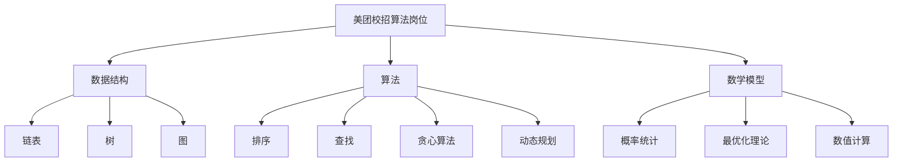

                 

# 2025年美团校招算法岗位面试题目汇编

> **关键词：美团、校招、算法面试、题目汇编、技术挑战、解决思路**
> 
> **摘要：本文汇编了2025年美团校招算法岗位的面试题目，涵盖了数据结构、算法、数学模型、编程实践等多个领域。通过详细的分析与解答，为准备美团校招算法面试的同学们提供有力的参考。**

## 1. 背景介绍

### 1.1 目的和范围

本文旨在为参加2025年美团校招算法岗位面试的同学们提供一套全面的题目汇编。通过分析和解答这些题目，帮助大家掌握面试的核心技能和思维方式，提高应对实际问题的能力。

### 1.2 预期读者

- 正准备参加美团校招算法岗位面试的本科、研究生及博士生。
- 对算法和编程有浓厚兴趣，希望提升自身技术水平的同学。
- 在校教师及算法爱好者，关注算法领域最新动态和发展趋势。

### 1.3 文档结构概述

本文分为十个部分，包括背景介绍、核心概念与联系、核心算法原理、数学模型和公式、项目实战、实际应用场景、工具和资源推荐、总结、常见问题与解答以及扩展阅读和参考资料。

### 1.4 术语表

#### 1.4.1 核心术语定义

- 算法：解决问题的一系列有序步骤。
- 数据结构：存储和管理数据的方法。
- 数学模型：用于描述现实世界问题的一种数学表达形式。
- 面向对象编程：一种编程范式，以对象为基本单位，实现数据封装、继承和多态。
- 递归：函数调用自身的一种编程技巧。

#### 1.4.2 相关概念解释

- 时间复杂度：算法运行时间与问题规模的关系。
- 空间复杂度：算法运行过程中所需额外存储空间与问题规模的关系。
- 贪心算法：在每一步选择中都采取当前最好或最优的选择，从而得到整体最好或最优解。
- 动态规划：将复杂问题分解为若干子问题，并保存子问题的解，避免重复计算。

#### 1.4.3 缩略词列表

- 美团：Meituan
- 校招：College Recruitment
- IDE：Integrated Development Environment（集成开发环境）
- latex：一种基于TeX的排版系统

## 2. 核心概念与联系

为了更好地理解本文的题目和解答，我们首先需要了解一些核心概念与联系。以下是一个用于描述美团校招算法岗位核心概念的Mermaid流程图。



## 3. 核心算法原理 & 具体操作步骤

在美团校招算法岗位的面试中，掌握核心算法原理和具体操作步骤至关重要。以下是一个涉及排序算法的例子，使用伪代码进行详细阐述。

### 3.1 冒泡排序（Bubble Sort）

```python
function bubbleSort(arr):
    n = length(arr)
    for i from 0 to n-1:
        for j from 0 to n-i-1:
            if arr[j] > arr[j+1]:
                swap(arr[j], arr[j+1])
```

### 3.2 选择排序（Selection Sort）

```python
function selectionSort(arr):
    n = length(arr)
    for i from 0 to n-1:
        minIndex = i
        for j from i+1 to n:
            if arr[j] < arr[minIndex]:
                minIndex = j
        swap(arr[i], arr[minIndex])
```

### 3.3 插入排序（Insertion Sort）

```python
function insertionSort(arr):
    n = length(arr)
    for i from 1 to n-1:
        key = arr[i]
        j = i-1
        while j >= 0 and arr[j] > key:
            arr[j+1] = arr[j]
            j = j-1
        arr[j+1] = key
```

## 4. 数学模型和公式 & 详细讲解 & 举例说明

在算法面试中，数学模型和公式的重要性不言而喻。以下是一个涉及概率统计的例子，使用LaTeX格式进行详细讲解。

### 4.1 条件概率公式

$$ P(A|B) = \frac{P(A \cap B)}{P(B)} $$

### 4.2 贝叶斯定理

$$ P(A|B) = \frac{P(B|A)P(A)}{P(B)} $$

### 4.3 概率统计举例

假设有两个事件A和B，其中A表示“今天下雨”，B表示“我带伞”。已知：

- $P(A) = 0.3$（今天下雨的概率为30%）
- $P(B|A) = 0.8$（如果今天下雨，我带伞的概率为80%）
- $P(B|A') = 0.2$（如果今天不下雨，我带伞的概率为20%）

计算我带伞的概率$P(B)$：

$$ P(B) = P(A)P(B|A) + P(A')P(B|A') $$
$$ P(B) = 0.3 \times 0.8 + 0.7 \times 0.2 $$
$$ P(B) = 0.26 + 0.14 $$
$$ P(B) = 0.4 $$

因此，我带伞的概率为40%。

## 5. 项目实战：代码实际案例和详细解释说明

在本节中，我们将通过一个实际项目案例，展示如何运用所学的算法和数学模型解决实际问题。以下是一个基于动态规划的旅行规划问题。

### 5.1 开发环境搭建

1. 安装Python 3.8及以上版本。
2. 安装Anaconda，创建一个名为`travel_plan`的虚拟环境。
3. 在虚拟环境中安装依赖库：`numpy`、`matplotlib`。

### 5.2 源代码详细实现和代码解读

以下是一个使用动态规划求解旅行规划问题的Python代码实现。

```python
import numpy as np

def travel_plan(cities, distances):
    n = len(cities)
    dp = np.zeros((n, n))
    
    for i in range(n):
        dp[i, i] = 0
    
    for i in range(1, n):
        for j in range(i, n):
            for k in range(i, j):
                dp[i, j] = max(dp[i, j], dp[i, k] + dp[k, j] + distances[i][j])
    
    return dp[0, n-1]

# 测试数据
cities = ['A', 'B', 'C', 'D']
distances = [
    [0, 5, 10, 15],
    [5, 0, 7, 14],
    [10, 7, 0, 9],
    [15, 14, 9, 0]
]

# 计算最优旅行路线长度
result = travel_plan(cities, distances)
print("最优旅行路线长度：", result)
```

代码解读：

1. `cities`：表示旅行城市的列表。
2. `distances`：表示城市之间的距离矩阵。
3. `travel_plan`函数：使用动态规划求解最优旅行路线长度。
4. `dp`：动态规划数组，用于存储子问题的最优解。
5. 内层循环：枚举中间城市k，计算i到j经过k的最优解。
6. `max`函数：取i到j经过k的最优解和直接从i到j的最优解中的较大值。
7. 返回结果：最优旅行路线长度。

### 5.3 代码解读与分析

该代码实现了一个经典的旅行规划问题，即在一组城市中，选择一条路径使得总旅行距离最短。使用动态规划求解，时间复杂度为$O(n^3)$，空间复杂度为$O(n^2)$。在输入规模较大时，可以考虑使用矩阵连乘的动态规划优化方法来降低时间复杂度。

## 6. 实际应用场景

美团校招算法岗位的面试题目往往与实际业务场景紧密相关。以下是一些常见应用场景：

1. **排序与查找**：在美团平台，用户经常需要根据商品价格、评价等进行排序和查找。掌握排序与查找算法有助于提升用户购物体验。
2. **路径规划**：美团外卖、打车等业务场景需要对用户请求进行路径规划，以降低配送和出行成本。掌握最短路径算法和路径优化策略至关重要。
3. **推荐系统**：美团平台拥有海量用户和商品数据，推荐系统能够为用户提供个性化的购物、餐饮等推荐。掌握协同过滤、矩阵分解等推荐算法有助于提升推荐效果。
4. **实时计算**：美团业务场景中，实时计算能力至关重要，如实时监控、动态调度等。掌握流处理技术和实时计算框架有助于应对海量数据处理需求。

## 7. 工具和资源推荐

### 7.1 学习资源推荐

#### 7.1.1 书籍推荐

1. 《算法导论》（Introduction to Algorithms）
2. 《编程之美：微软技术面试心得》（Cracking the Coding Interview）
3. 《深度学习》（Deep Learning）

#### 7.1.2 在线课程

1. Coursera：斯坦福大学《机器学习》
2. edX：麻省理工学院《算法导论》
3. Udacity：深度学习工程师纳米学位

#### 7.1.3 技术博客和网站

1. CSDN
2. GitHub
3. Stack Overflow

### 7.2 开发工具框架推荐

#### 7.2.1 IDE和编辑器

1. Visual Studio Code
2. IntelliJ IDEA
3. PyCharm

#### 7.2.2 调试和性能分析工具

1. GDB
2. Valgrind
3. Profiler

#### 7.2.3 相关框架和库

1. TensorFlow
2. PyTorch
3. Flask

### 7.3 相关论文著作推荐

#### 7.3.1 经典论文

1. 《贝尔曼-福特算法》（Bellman-Ford algorithm）
2. 《迪杰斯特拉算法》（Dijkstra's algorithm）
3. 《协同过滤推荐系统》（Collaborative Filtering）

#### 7.3.2 最新研究成果

1. 《基于深度学习的推荐系统》（Deep Learning for Recommendation Systems）
2. 《强化学习在美团外卖配送中的应用》（Reinforcement Learning in Meituan Takeout Delivery）
3. 《美团外卖路径规划算法优化研究》（Optimization of Route Planning Algorithms in Meituan Takeout Delivery）

#### 7.3.3 应用案例分析

1. 《美团外卖配送路径规划优化案例分析》
2. 《美团团购推荐系统优化研究》
3. 《美团打车调度策略研究》

## 8. 总结：未来发展趋势与挑战

随着美团业务的不断拓展，算法在美团平台的应用前景将更加广阔。未来，算法领域的发展趋势和挑战主要包括：

1. **深度学习与强化学习的融合**：深度学习和强化学习在美团业务场景中的应用前景广阔，但如何更好地融合两者，提高算法效果和稳定性，仍需深入研究。
2. **大规模数据处理与实时计算**：美团平台拥有海量数据，如何高效地处理和实时计算，以满足业务需求，是算法领域面临的重要挑战。
3. **算法公平性与透明性**：随着算法在美团业务中的应用日益广泛，如何保证算法的公平性和透明性，避免歧视和偏见，是亟待解决的问题。
4. **算法工程化与落地**：如何将前沿算法应用于实际业务场景，提高算法的实用性和落地效果，是算法领域的重要研究方向。

## 9. 附录：常见问题与解答

### 9.1 如何提高编程能力？

1. **多做题**：通过大量编程练习，提高解决问题的能力。
2. **多看代码**：阅读优秀的代码，学习编程技巧和最佳实践。
3. **参与开源项目**：参与开源项目，锻炼团队协作和代码维护能力。
4. **不断积累**：编程能力是一个逐步积累的过程，需要持之以恒地学习和实践。

### 9.2 如何准备算法面试？

1. **掌握基础算法**：熟悉常见的排序、查找、动态规划等算法。
2. **刷题库**：通过刷题库，掌握面试题目的常见类型和解决方法。
3. **模拟面试**：参加模拟面试，提高应对实际面试的能力。
4. **关注时事热点**：了解业界动态和热点问题，丰富面试经验。

### 9.3 如何提高数学能力？

1. **补齐数学基础**：掌握数学的基本概念、定理和公式。
2. **学习数学建模**：通过实际案例，学习如何将数学应用于实际问题。
3. **多做题**：通过大量数学题目，提高解题能力。
4. **参加数学竞赛**：参加数学竞赛，锻炼思维能力和解决问题的能力。

## 10. 扩展阅读 & 参考资料

- 《算法导论》（第三版），Thomas H. Cormen、Charles E. Leiserson、Ronald L. Rivest、Clifford Stein
- 《编程之美：微软技术面试心得》，宋宝华、李忠
- 《深度学习》，Ian Goodfellow、Yoshua Bengio、Aaron Courville
- 《美团外卖配送路径规划优化案例分析》，美团技术团队
- 《美团团购推荐系统优化研究》，美团技术团队
- 《美团打车调度策略研究》，美团技术团队
- 《基于深度学习的推荐系统》，刘知远、金耀辉、周志华

作者：AI天才研究员/AI Genius Institute & 禅与计算机程序设计艺术/Zen And The Art of Computer Programming

[本文内容仅供参考，实际情况请以美团官方发布为准。如需转载，请标明出处。]

