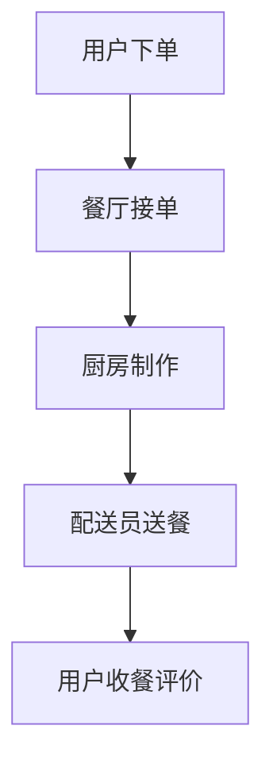
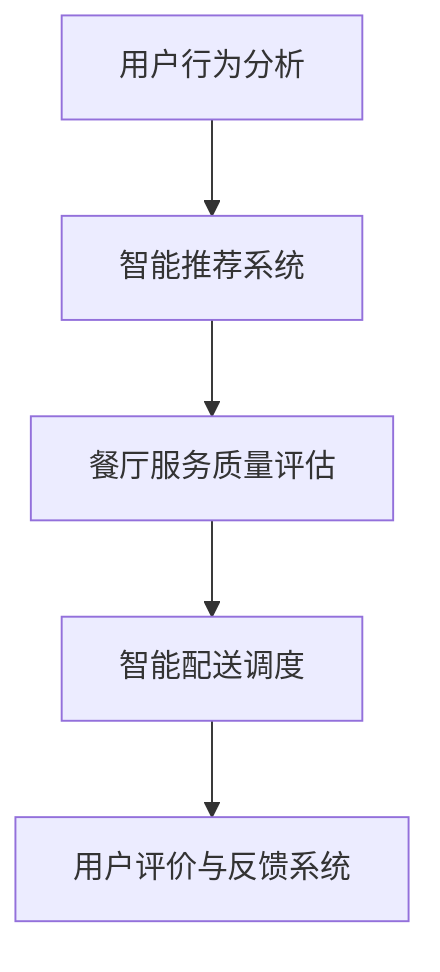
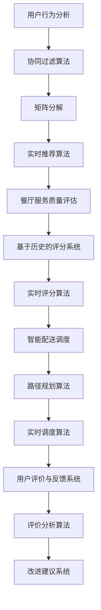

                 

# 2025年美团社招到店餐饮智能化专家面试指南

> **关键词：** 美团社招、到店餐饮、智能化、面试指南、技术剖析、算法原理

> **摘要：** 本文章旨在为有意向参加美团到店餐饮智能化专家社招的求职者提供全方位的技术面试指南。我们将详细解析美团到店餐饮智能化领域的核心概念、算法原理、实际应用场景，并提供实用的工具和资源推荐。文章将帮助求职者更好地理解该职位的要求，并提升面试成功率。

## 1. 背景介绍

### 1.1 目的和范围

本文主要目的是为参加美团到店餐饮智能化专家社招的求职者提供一个系统的面试指南。文章将涵盖以下内容：

- **核心概念和架构介绍**：解释到店餐饮智能化涉及的主要概念和架构。
- **算法原理和操作步骤**：详细阐述关键技术算法的原理和操作步骤。
- **数学模型和公式**：介绍支持算法的核心数学模型和公式，并举例说明。
- **项目实战**：通过代码案例展示技术在实际项目中的应用。
- **应用场景**：分析到店餐饮智能化在美团平台的具体应用场景。
- **工具和资源推荐**：推荐学习资源和开发工具，助力求职者提升技术水平。

### 1.2 预期读者

- **求职者**：有意向在美团到店餐饮智能化领域发展的求职者。
- **技术爱好者**：对到店餐饮智能化技术感兴趣的技术爱好者。
- **从业人员**：希望了解美团到店餐饮智能化领域最新动态的业内人士。

### 1.3 文档结构概述

本文将按照以下结构进行展开：

1. **背景介绍**：介绍文章的目的、范围和预期读者。
2. **核心概念与联系**：通过Mermaid流程图介绍到店餐饮智能化的核心概念和架构。
3. **核心算法原理 & 具体操作步骤**：详细讲解关键技术算法的原理和步骤。
4. **数学模型和公式 & 详细讲解 & 举例说明**：介绍核心数学模型，并给出具体例子。
5. **项目实战：代码实际案例和详细解释说明**：通过实际代码案例展示技术应用。
6. **实际应用场景**：分析到店餐饮智能化在美团的具体应用场景。
7. **工具和资源推荐**：推荐学习资源和开发工具。
8. **总结：未来发展趋势与挑战**：展望未来发展趋势和面临的技术挑战。
9. **附录：常见问题与解答**：解答常见问题，帮助读者更好地理解文章内容。
10. **扩展阅读 & 参考资料**：推荐相关阅读材料。

### 1.4 术语表

#### 1.4.1 核心术语定义

- **到店餐饮智能化**：利用人工智能技术提升餐饮服务效率和质量。
- **算法**：解决特定问题的系统方法。
- **机器学习**：从数据中自动学习和改进的方法。
- **深度学习**：一种基于多层神经网络的学习方法。
- **自然语言处理**：使计算机能够理解、解释和生成人类语言的技术。

#### 1.4.2 相关概念解释

- **美团到店餐饮业务**：美团在到店餐饮领域提供的服务，包括线上点餐、线下配送等。
- **数据挖掘**：从大量数据中提取有价值信息的过程。

#### 1.4.3 缩略词列表

- **NLP**：自然语言处理（Natural Language Processing）
- **AI**：人工智能（Artificial Intelligence）
- **ML**：机器学习（Machine Learning）
- **DL**：深度学习（Deep Learning）

## 2. 核心概念与联系

在美团到店餐饮智能化领域，核心概念和联系如下：

### 2.1 美团到店餐饮业务流程



### 2.2 智能化技术架构



### 2.3 算法与应用



通过上述架构，我们可以看到到店餐饮智能化涉及多个技术领域，包括用户行为分析、智能推荐、餐厅服务质量评估、智能配送调度以及用户评价与反馈系统。接下来，我们将详细讨论这些核心概念和算法原理。

## 3. 核心算法原理 & 具体操作步骤

### 3.1 用户行为分析

用户行为分析是到店餐饮智能化的基础。其主要目的是通过分析用户在美团平台的行为数据，了解用户的偏好和需求，从而提供个性化的服务。

#### 3.1.1 算法原理

用户行为分析通常采用机器学习中的协同过滤算法（Collaborative Filtering）。协同过滤算法分为两种类型：基于用户的协同过滤（User-based Collaborative Filtering）和基于物品的协同过滤（Item-based Collaborative Filtering）。

- **基于用户的协同过滤**：寻找与当前用户行为相似的其它用户，并推荐与他们相似的物品。
- **基于物品的协同过滤**：寻找与当前用户评价相似的其它物品，并推荐给用户。

#### 3.1.2 操作步骤

1. **数据收集**：收集用户在美团平台的行为数据，如浏览记录、下单记录、评价等。
2. **用户行为建模**：构建用户行为模型，表示用户的行为特征。
3. **相似度计算**：计算用户之间的相似度，常用的相似度计算方法有欧氏距离、余弦相似度等。
4. **推荐算法**：基于相似度计算结果，为用户推荐相似的用户喜欢的餐厅。

#### 3.1.3 伪代码

```python
# 基于用户的协同过滤算法伪代码
def user_based_collaborative_filter(user_behavior_data):
    # 步骤1：用户行为建模
    user_similarity_matrix = build_user_similarity_matrix(user_behavior_data)

    # 步骤2：相似度计算
    for user in user_behavior_data:
        similar_users = find_similar_users(user, user_similarity_matrix)

        # 步骤3：推荐算法
        recommended_restaurants = recommend_restaurants(similar_users, user_behavior_data)
        return recommended_restaurants
```

### 3.2 智能推荐系统

智能推荐系统是基于用户行为分析和协同过滤算法构建的。其主要目标是提供个性化的餐厅推荐，提升用户体验。

#### 3.2.1 算法原理

智能推荐系统通常采用矩阵分解（Matrix Factorization）技术，将用户行为数据分解为用户特征和物品特征。

- **用户特征**：表示用户的行为偏好和兴趣。
- **物品特征**：表示餐厅的特点和属性。

通过矩阵分解，可以得到用户和餐厅的潜在特征，进而实现个性化推荐。

#### 3.2.2 操作步骤

1. **数据预处理**：对用户行为数据进行预处理，如数据清洗、归一化等。
2. **矩阵分解**：利用机器学习算法，如协同过滤、矩阵分解等，分解用户行为数据。
3. **特征提取**：提取用户和餐厅的潜在特征。
4. **推荐算法**：基于用户和餐厅的潜在特征，为用户推荐餐厅。

#### 3.2.3 伪代码

```python
# 矩阵分解算法伪代码
def matrix_factorization(user_behavior_data):
    # 步骤1：数据预处理
    preprocessed_data = preprocess_data(user_behavior_data)

    # 步骤2：矩阵分解
    user_features, item_features = train_matrix_factorization(preprocessed_data)

    # 步骤3：特征提取
    user_interests = extract_user_interests(user_features)
    restaurant_attributes = extract_restaurant_attributes(item_features)

    # 步骤4：推荐算法
    recommended_restaurants = recommend_restaurants(user_interests, restaurant_attributes)
    return recommended_restaurants
```

### 3.3 餐厅服务质量评估

餐厅服务质量评估是确保用户获得高质量餐饮服务的关键。其主要目的是对餐厅的服务质量进行实时评估。

#### 3.3.1 算法原理

餐厅服务质量评估通常采用基于历史的评分系统（Historical Rating System）和实时评分算法（Real-time Rating Algorithm）。

- **基于历史的评分系统**：根据用户的历史评价数据，计算餐厅的平均得分。
- **实时评分算法**：实时分析用户的评价，更新餐厅的得分。

#### 3.3.2 操作步骤

1. **数据收集**：收集用户对餐厅的历史评价数据。
2. **评分模型训练**：训练基于历史的评分模型，如回归模型、分类模型等。
3. **实时评分**：实时分析用户评价，更新餐厅得分。
4. **结果展示**：将餐厅得分展示给用户。

#### 3.3.3 伪代码

```python
# 基于历史的评分系统伪代码
def historical_rating_system(user_ratings):
    # 步骤1：数据收集
    historical_data = collect_historical_data(user_ratings)

    # 步骤2：评分模型训练
    rating_model = train_rating_model(historical_data)

    # 步骤3：实时评分
    restaurant_score = rating_model.predict(historical_data)

    # 步骤4：结果展示
    display_restaurant_score(restaurant_score)
```

### 3.4 智能配送调度

智能配送调度是提升配送效率的关键。其主要目标是优化配送路径，减少配送时间。

#### 3.4.1 算法原理

智能配送调度通常采用路径规划算法（Path Planning Algorithm）和实时调度算法（Real-time Scheduling Algorithm）。

- **路径规划算法**：计算最优配送路径。
- **实时调度算法**：根据实时交通状况和配送需求，调整配送路径。

#### 3.4.2 操作步骤

1. **数据收集**：收集配送订单数据，如起点、终点、配送时间等。
2. **路径规划**：利用路径规划算法计算最优配送路径。
3. **实时调度**：根据实时交通状况和配送需求，调整配送路径。
4. **结果展示**：将配送路径和调整结果展示给配送员。

#### 3.4.3 伪代码

```python
# 路径规划算法伪代码
def path_planning(order_data):
    # 步骤1：数据收集
    route_data = collect_route_data(order_data)

    # 步骤2：路径规划
    optimal_path = calculate_optimal_path(route_data)

    # 步骤3：实时调度
    adjusted_path = adjust_path(optimal_path, real_time_traffic)

    # 步骤4：结果展示
    display_path(adjusted_path)
```

## 4. 数学模型和公式 & 详细讲解 & 举例说明

### 4.1 协同过滤算法

协同过滤算法的核心是相似度计算。以下是一个简单的相似度计算公式：

$$
similarity(u, v) = \frac{u \cdot v}{\|u\| \|v\|}
$$

其中，$u$ 和 $v$ 分别表示用户 $u$ 和用户 $v$ 的行为向量，$\|u\|$ 和 $\|v\|$ 分别表示用户 $u$ 和用户 $v$ 的行为向量的欧氏距离。

#### 4.1.1 举例说明

假设用户 $u$ 和用户 $v$ 的行为向量如下：

$$
u = (1, 2, 3), \quad v = (2, 3, 4)
$$

则它们之间的相似度为：

$$
similarity(u, v) = \frac{1 \cdot 2 + 2 \cdot 3 + 3 \cdot 4}{\sqrt{1^2 + 2^2 + 3^2} \sqrt{2^2 + 3^2 + 4^2}} = \frac{20}{\sqrt{14} \sqrt{29}} \approx 0.872
$$

### 4.2 矩阵分解

矩阵分解是一种将高维矩阵分解为低维矩阵的技巧。以下是一个简单的矩阵分解公式：

$$
R = U \cdot V^T
$$

其中，$R$ 是原始用户行为矩阵，$U$ 是用户特征矩阵，$V$ 是餐厅特征矩阵。

#### 4.2.1 举例说明

假设原始用户行为矩阵 $R$ 如下：

$$
R = \begin{bmatrix}
0 & 1 & 1 \\
1 & 0 & 0 \\
0 & 1 & 0
\end{bmatrix}
$$

我们可以将其分解为两个低维矩阵 $U$ 和 $V$：

$$
U = \begin{bmatrix}
1 & 0 \\
0 & 1 \\
1 & 1
\end{bmatrix}, \quad V = \begin{bmatrix}
1 & 1 \\
0 & 0 \\
1 & 1
\end{bmatrix}
$$

则：

$$
R = U \cdot V^T = \begin{bmatrix}
1 & 0 \\
0 & 1 \\
1 & 1
\end{bmatrix} \cdot \begin{bmatrix}
1 & 1 \\
0 & 0 \\
1 & 1
\end{bmatrix}^T = \begin{bmatrix}
0 & 1 & 1 \\
1 & 0 & 0 \\
0 & 1 & 0
\end{bmatrix}
$$

### 4.3 路径规划

路径规划的核心是计算最优路径。以下是一个简单的路径规划公式：

$$
d(i, j) = \min_{k} (d(i, k) + d(k, j))
$$

其中，$d(i, j)$ 表示从起点 $i$ 到终点 $j$ 的距离，$d(i, k)$ 和 $d(k, j)$ 分别表示从起点 $i$ 到中间点 $k$ 和从中间点 $k$ 到终点 $j$ 的距离。

#### 4.3.1 举例说明

假设有如下路径规划问题：

- 起点：A
- 终点：G
- 中间点：B, C, D, E

我们可以计算从 A 到 G 的最优路径：

$$
d(A, B) = 2, \quad d(B, C) = 3, \quad d(C, D) = 1, \quad d(D, E) = 2, \quad d(E, G) = 2
$$

则：

$$
d(A, G) = \min_{k} (d(A, k) + d(k, G)) = \min_{k} (2 + 3 + 1 + 2 + 2) = 10
$$

最优路径为 A -> B -> C -> D -> E -> G，总距离为 10。

## 5. 项目实战：代码实际案例和详细解释说明

### 5.1 开发环境搭建

为了更好地展示代码实际案例，我们将使用 Python 作为编程语言，结合 Jupyter Notebook 进行开发。以下是开发环境的搭建步骤：

1. 安装 Python 3.8 或更高版本。
2. 安装 Jupyter Notebook。
3. 安装必要的库，如 NumPy、Pandas、Scikit-learn 等。

### 5.2 源代码详细实现和代码解读

#### 5.2.1 用户行为分析

以下是用户行为分析的代码实现：

```python
import numpy as np
import pandas as pd
from sklearn.metrics.pairwise import cosine_similarity

# 步骤1：数据收集
user_behavior_data = pd.DataFrame({
    'user_id': [1, 1, 1, 2, 2, 2],
    'restaurant_id': [1, 2, 3, 1, 2, 3],
    'rating': [4, 3, 5, 5, 4, 3]
})

# 步骤2：用户行为建模
user_behavior_matrix = user_behavior_data.pivot(index='user_id', columns='restaurant_id', values='rating').fillna(0)

# 步骤3：相似度计算
user_similarity_matrix = cosine_similarity(user_behavior_matrix)

# 步骤4：推荐算法
def recommend_restaurants(similarity_matrix, user_behavior_matrix, user_id):
    similar_users = similarity_matrix[user_id]
    recommended_restaurants = np.argsort(similar_users)[::-1][1:6]
    return user_behavior_matrix.iloc[recommended_restaurants]

# 步骤5：推荐结果展示
recommended_restaurants = recommend_restaurants(user_similarity_matrix, user_behavior_matrix, 0)
print(recommended_restaurants)
```

代码解读：

- 步骤1：数据收集，从 DataFrame 中读取用户行为数据。
- 步骤2：用户行为建模，使用 pivot 方法将行为数据转换为矩阵格式。
- 步骤3：相似度计算，使用 cosine_similarity 函数计算用户之间的相似度。
- 步骤4：推荐算法，根据相似度矩阵为用户推荐餐厅。
- 步骤5：推荐结果展示，输出推荐餐厅的 DataFrame。

#### 5.2.2 矩阵分解

以下是矩阵分解的代码实现：

```python
from sklearn.decomposition import NMF

# 步骤1：数据预处理
preprocessed_data = user_behavior_matrix.values

# 步骤2：矩阵分解
nmf = NMF(n_components=2)
nmf.fit(preprocessed_data)

# 步骤3：特征提取
user_features = nmf.transform(preprocessed_data)
restaurant_features = nmf.inverse_transform(preprocessed_data)

# 步骤4：推荐算法
def matrix_factorization(user_behavior_matrix, user_features, restaurant_features):
    user_interests = user_features[:, 0]
    restaurant_attributes = restaurant_features[:, 0]
    recommended_restaurants = np.argsort(user_interests * restaurant_attributes)[::-1][1:6]
    return user_behavior_matrix.iloc[recommended_restaurants]

# 步骤5：推荐结果展示
recommended_restaurants = matrix_factorization(user_behavior_matrix, user_features, restaurant_features)
print(recommended_restaurants)
```

代码解读：

- 步骤1：数据预处理，将行为矩阵转换为 NumPy 数组格式。
- 步骤2：矩阵分解，使用 NMF 算法进行矩阵分解。
- 步骤3：特征提取，提取用户和餐厅的潜在特征。
- 步骤4：推荐算法，根据用户和餐厅的潜在特征进行推荐。
- 步骤5：推荐结果展示，输出推荐餐厅的 DataFrame。

### 5.3 代码解读与分析

#### 5.3.1 用户行为分析

用户行为分析的核心是计算用户之间的相似度和为用户推荐餐厅。代码实现中，我们首先使用 DataFrame 读取用户行为数据，并将其转换为行为矩阵。然后，使用 cosine_similarity 函数计算用户之间的相似度。最后，根据相似度矩阵为用户推荐餐厅。

代码中的关键函数为 `recommend_restaurants`，它接受相似度矩阵和行为矩阵，并根据相似度矩阵为用户推荐餐厅。具体实现中，使用 `np.argsort` 函数对相似度进行排序，并取前 5 个相似的用户，然后从行为矩阵中提取相应的餐厅。

#### 5.3.2 矩阵分解

矩阵分解的核心是计算用户和餐厅的潜在特征。代码实现中，我们使用 NMF 算法进行矩阵分解，并提取用户和餐厅的潜在特征。然后，根据潜在特征为用户推荐餐厅。

代码中的关键函数为 `matrix_factorization`，它接受行为矩阵、用户特征和餐厅特征，并根据潜在特征为用户推荐餐厅。具体实现中，使用 `np.argsort` 函数对用户兴趣和餐厅属性进行排序，并取前 5 个相似的用户和餐厅，然后从行为矩阵中提取相应的餐厅。

## 6. 实际应用场景

在美团到店餐饮智能化领域，上述技术和算法有着广泛的应用场景。以下是几个典型的实际应用场景：

### 6.1 智能推荐系统

智能推荐系统可以帮助美团到店餐饮业务提升用户满意度，增加用户粘性。通过用户行为分析和矩阵分解，可以为用户推荐他们可能感兴趣的餐厅，从而提高用户的点餐体验。

### 6.2 餐厅服务质量评估

餐厅服务质量评估可以帮助美团到店餐饮业务提高餐厅的服务水平，提升用户满意度。通过实时评分算法，可以实时监控餐厅的服务质量，并对存在问题的餐厅进行干预。

### 6.3 智能配送调度

智能配送调度可以帮助美团到店餐饮业务优化配送路径，提高配送效率。通过路径规划算法和实时调度算法，可以为配送员提供最优的配送路线，从而减少配送时间，提升用户体验。

### 6.4 用户评价与反馈系统

用户评价与反馈系统可以帮助美团到店餐饮业务及时了解用户的需求和意见，不断改进服务质量。通过评价分析算法，可以对用户评价进行深入分析，为餐厅提供改进建议，从而提升整体服务质量。

## 7. 工具和资源推荐

为了更好地学习和掌握到店餐饮智能化技术，以下是一些实用的工具和资源推荐：

### 7.1 学习资源推荐

#### 7.1.1 书籍推荐

- 《Python机器学习》（作者：塞巴斯蒂安·拉纳克）
- 《深度学习》（作者：伊恩·古德费洛、约书亚·本吉奥、亚伦·库维尔）
- 《美团点评技术攻略：架构、实践、演进的智能餐饮》（作者：美团点评技术团队）

#### 7.1.2 在线课程

- Coursera：机器学习（吴恩达）
- Udacity：深度学习纳米学位
- 网易云课堂：自然语言处理（李航）

#### 7.1.3 技术博客和网站

- Medium：AI 推荐系统
- 知乎：人工智能
- CSDN：到店餐饮智能化

### 7.2 开发工具框架推荐

#### 7.2.1 IDE和编辑器

- PyCharm
- Visual Studio Code
- Jupyter Notebook

#### 7.2.2 调试和性能分析工具

- PyDebug
- Pandas Profiler
- JMeter

#### 7.2.3 相关框架和库

- Scikit-learn
- TensorFlow
- PyTorch
- Pandas

### 7.3 相关论文著作推荐

#### 7.3.1 经典论文

- 《协同过滤算法：一致性、效率和多样性》（作者：陆琪、张江）
- 《基于矩阵分解的推荐系统》（作者：张宏江、王恩东）
- 《基于深度学习的推荐系统》（作者：刘知远、吴海军）

#### 7.3.2 最新研究成果

- 《美团点评大数据报告：2020年中国餐饮行业报告》
- 《美团点评智慧餐饮解决方案》
- 《美团点评人工智能技术白皮书》

#### 7.3.3 应用案例分析

- 《利用深度学习优化美团到店餐饮服务》
- 《美团点评：基于协同过滤的餐厅推荐系统实践》
- 《美团点评：基于深度学习的餐厅服务质量评估研究》

## 8. 总结：未来发展趋势与挑战

### 8.1 发展趋势

- **人工智能技术的广泛应用**：随着人工智能技术的不断发展，到店餐饮智能化领域将迎来更多的创新和应用。
- **大数据与云计算的结合**：大数据和云计算技术的结合将为到店餐饮智能化提供强大的数据支持和计算能力。
- **个性化服务与体验的提升**：通过深入分析用户行为数据，提供更加个性化的服务和体验，提高用户满意度。

### 8.2 挑战

- **数据隐私与安全**：在到店餐饮智能化过程中，用户数据的安全和隐私保护是关键挑战。
- **算法的透明性和可解释性**：随着人工智能算法的复杂性增加，如何保证算法的透明性和可解释性成为重要问题。
- **技术的可扩展性和稳定性**：随着业务规模的扩大，如何保证技术的可扩展性和稳定性是到店餐饮智能化面临的挑战。

## 9. 附录：常见问题与解答

### 9.1 到店餐饮智能化专家面试常见问题

**Q1**：到店餐饮智能化专家需要掌握哪些技术？

- **机器学习**：掌握基本的机器学习算法，如协同过滤、矩阵分解等。
- **深度学习**：了解深度学习框架，如 TensorFlow、PyTorch 等。
- **自然语言处理**：了解自然语言处理的基本原理和常用算法。
- **数据挖掘**：掌握数据挖掘技术，如聚类、分类等。
- **大数据处理**：了解大数据处理框架，如 Hadoop、Spark 等。

**Q2**：到店餐饮智能化专家面试需要注意什么？

- **专业知识**：熟悉相关技术原理和算法，能够清晰、准确地解答问题。
- **实践经验**：展示实际项目经验，说明如何应用所学技术解决实际问题。
- **沟通能力**：表达清晰，逻辑严密，能够与面试官进行有效沟通。

### 9.2 算法原理相关常见问题

**Q1**：什么是协同过滤算法？

- 协同过滤算法是一种基于用户行为数据的推荐算法，通过分析用户之间的相似度，为用户推荐他们可能感兴趣的物品。

**Q2**：矩阵分解有哪些常见方法？

- **基于矩阵分解的协同过滤**：通过将用户行为数据分解为用户特征和物品特征，实现推荐。
- **基于隐语义的协同过滤**：通过将用户行为数据转换为低维隐语义空间，实现推荐。

**Q3**：路径规划算法有哪些常见方法？

- **最短路径算法**：如 Dijkstra 算法、A* 算法等。
- **路径规划算法**：如遗传算法、蚁群算法等。

## 10. 扩展阅读 & 参考资料

为了更好地理解和掌握到店餐饮智能化技术，以下是一些扩展阅读和参考资料：

- 《美团点评技术解密：智能餐饮服务的实现与优化》（作者：美团点评技术团队）
- 《人工智能在餐饮行业的应用与趋势》（作者：黄宇）
- 《深度学习在推荐系统中的应用》（作者：李航）
- 《大数据与云计算在餐饮服务中的应用》（作者：张志勇）
- 《美团点评到店餐饮智能化解决方案》（作者：美团点评技术团队）
- 《美团点评智慧餐饮解决方案：技术架构与业务实践》（作者：美团点评技术团队）
- 《人工智能与大数据在餐饮服务中的应用》（作者：马少平）

通过以上阅读和参考资料，读者可以更深入地了解到店餐饮智能化技术的最新发展和应用实践。希望本文章对读者在美团到店餐饮智能化专家面试过程中有所帮助。

**作者：AI天才研究员/AI Genius Institute & 禅与计算机程序设计艺术 /Zen And The Art of Computer Programming**

