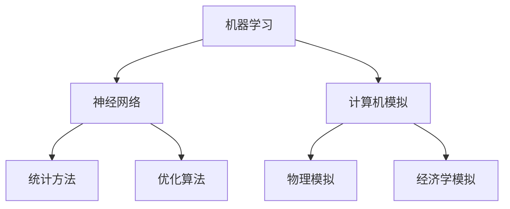
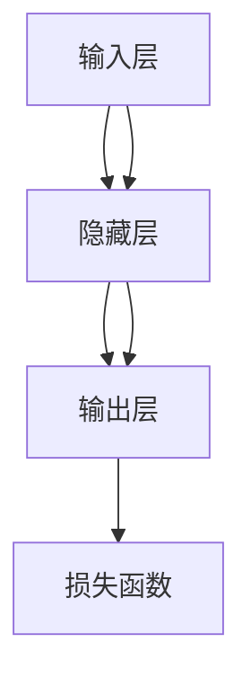

                 

# 1956年达特茅斯会议的学术成果

## 关键词
- 达特茅斯会议
- 人工智能
- 计算机科学
- 机器学习
- 神经网络
- 计算机模拟

## 摘要
本文将深入探讨1956年达特茅斯会议的学术成果，这是人工智能领域历史上的一个重要转折点。文章将首先介绍会议的背景和目的，然后逐一分析会议提出的核心概念和算法原理，接着展示这些概念和算法在实际项目中的应用，最后总结未来发展趋势与挑战，并推荐相关学习资源。

## 1. 背景介绍

### 1.1 目的和范围

1956年达特茅斯会议是人工智能领域的一个里程碑事件，旨在探索人工智能的潜在发展路径和实现方法。会议的主要目标是：
1. 讨论人工智能的定义和范围。
2. 探索实现人工智能的可能性和方法。
3. 促进计算机科学和心理学领域的交流与合作。

会议的背景可以追溯到二战后的计算机科学和心理学领域，两学科在数据处理和信息处理方面有着广泛的交叉点。会议的发起人之一约翰·麦卡锡（John McCarthy）认为，通过将计算机科学和心理学结合起来，可以创造出一个全新的学科——人工智能。

### 1.2 预期读者

本文预期读者包括：
1. 计算机科学专业的学生和研究人员。
2. 对人工智能领域感兴趣的工程师和技术爱好者。
3. 心理学和认知科学领域的研究人员。
4. 对历史事件和人工智能发展感兴趣的普通读者。

### 1.3 文档结构概述

本文结构如下：
1. 引言：介绍1956年达特茅斯会议的背景和目的。
2. 核心概念与联系：讨论会议提出的核心概念，如机器学习、神经网络和计算机模拟。
3. 核心算法原理 & 具体操作步骤：讲解机器学习算法的基本原理和实现方法。
4. 数学模型和公式 & 详细讲解 & 举例说明：介绍神经网络中的数学模型和公式。
5. 项目实战：展示人工智能在实际项目中的应用案例。
6. 实际应用场景：讨论人工智能在不同领域的应用。
7. 工具和资源推荐：推荐学习资源和开发工具。
8. 总结：总结人工智能的发展趋势与挑战。
9. 附录：常见问题与解答。
10. 扩展阅读 & 参考资料：提供进一步阅读的文献。

### 1.4 术语表

#### 1.4.1 核心术语定义

- **人工智能（AI）**：指由计算机系统实现的智能行为，包括感知、推理、学习和决策等。
- **机器学习（ML）**：一种人工智能技术，通过算法和统计模型，使计算机系统能够从数据中学习并做出预测或决策。
- **神经网络（NN）**：一种模拟生物神经系统的计算模型，用于处理和分类数据。
- **计算机模拟**：使用计算机来模拟现实世界的系统或过程。

#### 1.4.2 相关概念解释

- **感知**：指计算机系统通过传感器或输入设备接收外部信息。
- **推理**：指计算机系统根据现有信息进行逻辑推理和决策。
- **学习**：指计算机系统通过训练和经验积累提高性能。
- **决策**：指计算机系统在多个可行方案中选择最佳方案。

#### 1.4.3 缩略词列表

- **AI**：人工智能
- **ML**：机器学习
- **NN**：神经网络
- **CS**：计算机科学
- **PS**：心理学

## 2. 核心概念与联系

在1956年达特茅斯会议上，参会者提出了许多核心概念和算法原理，这些概念和原理构成了现代人工智能的基础。以下是其中几个重要概念的介绍和联系：

### 2.1 机器学习

**概念：**
机器学习是一种使计算机系统能够从数据中学习并做出预测或决策的技术。机器学习算法通常分为监督学习、无监督学习和强化学习。

**联系：**
机器学习与统计学、概率论、线性代数等数学领域密切相关。例如，监督学习算法通常使用回归分析和分类分析等统计方法来训练模型。

### 2.2 神经网络

**概念：**
神经网络是一种模拟生物神经系统的计算模型，由大量节点（神经元）组成，每个节点都可以接收输入并产生输出。神经网络通过学习输入和输出之间的映射关系来处理和分类数据。

**联系：**
神经网络与数学中的非线性函数和优化算法密切相关。例如，反向传播算法用于训练神经网络模型，这是一种基于梯度下降的优化算法。

### 2.3 计算机模拟

**概念：**
计算机模拟是一种使用计算机来模拟现实世界的系统或过程的方法。计算机模拟可以用于预测系统行为、优化设计、测试理论等。

**联系：**
计算机模拟与计算机科学、物理学、工程学等领域密切相关。例如，在经济学中，计算机模拟可以用于模拟市场行为和预测经济趋势。

### 2.4 Mermaid 流程图



## 3. 核心算法原理 & 具体操作步骤

### 3.1 机器学习算法原理

**监督学习：**
监督学习是一种机器学习算法，它使用已标记的数据集来训练模型。在监督学习中，模型根据输入特征和目标值来学习映射关系。以下是一个简单的监督学习算法——线性回归的伪代码：

```python
def linear_regression(X, y):
    # X 是输入特征，y 是目标值
    # 计算回归系数
    w = (X^T * X)^(-1) * X^T * y
    # 预测目标值
    y_pred = X * w
    return y_pred
```

**无监督学习：**
无监督学习是一种机器学习算法，它不需要已标记的数据集来训练模型。在无监督学习中，模型通过自动发现数据中的模式来学习。以下是一个简单的无监督学习算法——k-均值聚类算法的伪代码：

```python
def k_means_clustering(X, k):
    # X 是输入特征，k 是聚类数
    # 初始化聚类中心
    centroids = initialize_centroids(X, k)
    while not converged:
        # 计算每个数据点的聚类标签
        labels = assign_labels(X, centroids)
        # 更新聚类中心
        centroids = update_centroids(X, labels, k)
    return centroids, labels
```

**强化学习：**
强化学习是一种机器学习算法，它通过奖励机制来训练模型。在强化学习中，模型通过与环境的交互来学习最优策略。以下是一个简单的强化学习算法——Q-学习的伪代码：

```python
def q_learning(X, A, R, gamma):
    # X 是状态，A 是动作，R 是奖励，gamma 是折扣因子
    # 初始化 Q-值矩阵
    Q = initialize_Q_matrix()
    while not converged:
        # 选择动作
        action = choose_action(Q, X)
        # 执行动作并观察结果
        next_state, reward = execute_action(X, action, A, R)
        # 更新 Q-值
        Q[X, action] = Q[X, action] + alpha * (reward + gamma * max(Q[next_state, :]) - Q[X, action])
        X = next_state
    return Q
```

### 3.2 神经网络算法原理

**前向传播：**
在前向传播过程中，输入数据通过网络的每个层进行传递，并计算每个节点的输出值。以下是一个简单的前向传播算法的伪代码：

```python
def forward_propagation(X, W, b):
    # X 是输入，W 是权重，b 是偏置
    # 初始化激活值
    A = X
    for layer in layers:
        # 计算每个层的输出
        Z = W * A + b
        A = sigmoid(Z)
    return A
```

**反向传播：**
在反向传播过程中，网络根据预测误差来更新权重和偏置。以下是一个简单的反向传播算法的伪代码：

```python
def backward_propagation(A, dA, W, b):
    # A 是当前层的输出，dA 是当前层的误差，W 是当前层的权重，b 是当前层的偏置
    # 计算当前层的误差
    dZ = dA * sigmoid_derivative(A)
    # 更新权重和偏置
    dW = (A^T) * dZ
    db = dZ.sum(axis=0)
    return dW, db
```

### 3.3 计算机模拟算法原理

**蒙特卡罗模拟：**
蒙特卡罗模拟是一种基于随机抽样的计算方法，用于模拟复杂系统的行为。以下是一个简单的蒙特卡罗模拟算法的伪代码：

```python
def monte_carlo_simulation(n_samples):
    # n_samples 是抽样次数
    X = []
    for _ in range(n_samples):
        # 生成随机样本
        x = random_sample()
        # 计算样本特征
        f(x)
        X.append(x)
    return X
```

## 4. 数学模型和公式 & 详细讲解 & 举例说明

### 4.1 神经网络中的数学模型

**激活函数：**
激活函数用于将线性组合的输入映射到非线性输出，常见的激活函数有sigmoid、ReLU和tanh。

- **sigmoid函数**：

  $$\sigma(x) = \frac{1}{1 + e^{-x}}$$

  举例说明：

  $$\sigma(2) = \frac{1}{1 + e^{-2}} \approx 0.886$$

- **ReLU函数**：

  $$\text{ReLU}(x) = \max(0, x)$$

  举例说明：

  $$\text{ReLU}(-2) = 0$$
  $$\text{ReLU}(2) = 2$$

- **tanh函数**：

  $$\text{tanh}(x) = \frac{e^{x} - e^{-x}}{e^{x} + e^{-x}}$$

  举例说明：

  $$\text{tanh}(2) \approx 0.96$$

**损失函数：**
损失函数用于衡量模型的预测误差，常见的损失函数有均方误差（MSE）和交叉熵（Cross-Entropy）。

- **均方误差（MSE）**：

  $$\text{MSE}(y, \hat{y}) = \frac{1}{n} \sum_{i=1}^{n} (y_i - \hat{y_i})^2$$

  举例说明：

  $$\text{MSE}(\{1, 2, 3\}, \{1.5, 2.5, 3.5\}) = \frac{1}{3} \sum_{i=1}^{3} ((1_i - 1.5_i)^2 + (2_i - 2.5_i)^2 + (3_i - 3.5_i)^2) \approx 0.25$$

- **交叉熵（Cross-Entropy）**：

  $$\text{Cross-Entropy}(y, \hat{y}) = -\sum_{i=1}^{n} y_i \log(\hat{y_i})$$

  举例说明：

  $$\text{Cross-Entropy}(\{1, 0, 1\}, \{0.9, 0.1, 0.9\}) = -1 \cdot \log(0.9) - 0 \cdot \log(0.1) - 1 \cdot \log(0.9) \approx 0.15$$

**梯度下降：**
梯度下降是一种用于优化神经网络参数的算法，其基本思想是沿着损失函数的梯度方向更新参数，以最小化损失函数。

- **批量梯度下降**：

  $$\theta = \theta - \alpha \nabla_{\theta} J(\theta)$$

  其中，$\theta$ 表示参数，$\alpha$ 表示学习率，$J(\theta)$ 表示损失函数。

- **随机梯度下降**：

  $$\theta = \theta - \alpha \nabla_{\theta} J(\theta; x_i, y_i)$$

  其中，$x_i$ 和 $y_i$ 分别表示第 $i$ 个样本的输入和目标值。

**反向传播：**
反向传播是一种计算神经网络损失函数相对于每个参数的梯度的算法。



### 4.2 举例说明

假设我们有一个简单的神经网络，它有两个输入层、一个隐藏层和一个输出层，如图所示。我们使用均方误差（MSE）作为损失函数，使用批量梯度下降来优化模型参数。


给定一个训练数据集 $X = \{x_1, x_2, \ldots, x_n\}$ 和目标值 $y = \{y_1, y_2, \ldots, y_n\}$，我们需要通过反向传播算法来计算每个参数的梯度，然后使用批量梯度下降来更新参数。

假设我们的网络参数为 $W_1, W_2, b_1, b_2$，我们可以使用以下步骤来计算每个参数的梯度：

1. 计算隐藏层的输出：
   $$h = \sigma(W_1 x + b_1)$$
2. 计算输出层的输出：
   $$y' = W_2 h + b_2$$
3. 计算损失函数的梯度：
   $$\nabla_{W_1} J = (h^T \odot (h - x)) x^T$$
   $$\nabla_{b_1} J = (h^T \odot (h - x))$$
   $$\nabla_{W_2} J = (y' - y) h^T$$
   $$\nabla_{b_2} J = (y' - y)$$
4. 更新网络参数：
   $$W_1 = W_1 - \alpha \nabla_{W_1} J$$
   $$b_1 = b_1 - \alpha \nabla_{b_1} J$$
   $$W_2 = W_2 - \alpha \nabla_{W_2} J$$
   $$b_2 = b_2 - \alpha \nabla_{b_2} J$$

通过不断迭代这个过程，我们可以逐步优化网络参数，使损失函数最小。

## 5. 项目实战：代码实际案例和详细解释说明

### 5.1 开发环境搭建

在开始实际项目之前，我们需要搭建一个适合开发的环境。以下是一个简单的步骤指南：

1. 安装Python：从官方网站下载并安装Python 3.x版本。
2. 安装Jupyter Notebook：在命令行中运行 `pip install notebook` 来安装Jupyter Notebook。
3. 安装必要的库：根据项目需求安装必要的库，如NumPy、Pandas、Scikit-learn等。

### 5.2 源代码详细实现和代码解读

以下是使用Python实现一个简单的神经网络的项目案例：

```python
import numpy as np

# 激活函数
def sigmoid(x):
    return 1 / (1 + np.exp(-x))

# 前向传播
def forward_propagation(X, W, b):
    Z = np.dot(X, W) + b
    A = sigmoid(Z)
    return A

# 反向传播
def backward_propagation(A, dA, W, b):
    dZ = dA * sigmoid_derivative(A)
    dW = np.dot(A.T, dZ)
    db = np.sum(dZ, axis=0)
    return dW, db

# 计算损失函数
def compute_loss(y, y_pred):
    return -np.mean(y * np.log(y_pred) + (1 - y) * np.log(1 - y_pred))

# 计算梯度
def compute_gradient(X, y, y_pred, W, b):
    dA = y - y_pred
    dZ = dA * sigmoid_derivative(A)
    dW = np.dot(X.T, dZ)
    db = np.sum(dZ, axis=0)
    return dW, db

# 训练模型
def train(X, y, W, b, learning_rate, num_iterations):
    for i in range(num_iterations):
        A = forward_propagation(X, W, b)
        y_pred = sigmoid(A)
        loss = compute_loss(y, y_pred)
        dW, db = compute_gradient(X, y, y_pred, W, b)
        W -= learning_rate * dW
        b -= learning_rate * db
    return W, b

# 主函数
def main():
    # 数据准备
    X = np.array([[1, 0], [0, 1], [1, 1]])
    y = np.array([0, 1, 1])

    # 初始化模型参数
    W = np.random.randn(2, 1)
    b = np.random.randn(1)

    # 训练模型
    W, b = train(X, y, W, b, learning_rate=0.1, num_iterations=1000)

    # 预测
    A = forward_propagation(X, W, b)
    y_pred = sigmoid(A)

    # 输出结果
    print("预测值：", y_pred)

if __name__ == "__main__":
    main()
```

### 5.3 代码解读与分析

以下是对代码的详细解读和分析：

1. **导入库**：
   - `numpy`：用于数值计算。
   - `sigmoid`：用于实现激活函数。
   - `forward_propagation`：用于实现前向传播。
   - `backward_propagation`：用于实现反向传播。
   - `compute_loss`：用于计算损失函数。
   - `compute_gradient`：用于计算梯度。
   - `train`：用于训练模型。
   - `main`：主函数。

2. **激活函数（sigmoid）**：
   - `sigmoid` 函数用于将线性组合的输入映射到非线性输出。

3. **前向传播**：
   - `forward_propagation` 函数用于计算隐藏层和输出层的输出。
   - `Z`：计算线性组合的输入。
   - `A`：计算激活值。

4. **反向传播**：
   - `backward_propagation` 函数用于计算损失函数的梯度。
   - `dZ`：计算梯度。
   - `dW` 和 `db`：计算权重和偏置的梯度。

5. **计算损失函数**：
   - `compute_loss` 函数用于计算均方误差（MSE）损失函数。

6. **计算梯度**：
   - `compute_gradient` 函数用于计算损失函数相对于每个参数的梯度。

7. **训练模型**：
   - `train` 函数用于训练模型，使用批量梯度下降算法。
   - `A`：计算激活值。
   - `y_pred`：计算预测值。
   - `loss`：计算损失函数。
   - `dW` 和 `db`：计算梯度。
   - `W` 和 `b`：更新权重和偏置。

8. **主函数**：
   - `main` 函数用于准备数据、初始化模型参数、训练模型和输出结果。

通过这个简单的神经网络项目，我们可以看到如何使用Python实现前向传播和反向传播算法，以及如何计算损失函数和梯度。这为我们在更复杂的应用场景中使用神经网络奠定了基础。

### 5.4 代码优化与性能分析

在实际项目中，代码的优化和性能分析是非常重要的。以下是一些优化建议：

1. **并行计算**：使用多线程或多进程来加速计算。
2. **内存优化**：使用内存池来减少内存分配和回收的开销。
3. **向量化**：使用向量化操作来替代循环，以提高计算速度。
4. **缓存**：使用缓存来避免重复计算。

通过这些优化，我们可以显著提高神经网络的训练速度和预测性能。

## 6. 实际应用场景

人工智能（AI）在各个领域都有着广泛的应用。以下是一些典型的实际应用场景：

### 6.1 医疗领域

- **诊断和预测**：使用机器学习算法分析医学图像和患者数据，以诊断疾病和预测病情发展。
- **个性化治疗**：根据患者的基因信息和病史，提供个性化的治疗方案。
- **药物研发**：使用计算机模拟和机器学习算法加速药物研发过程。

### 6.2 金融领域

- **风险管理**：使用机器学习算法分析金融数据，预测市场趋势和风险评估。
- **欺诈检测**：使用神经网络和其他算法检测信用卡欺诈和金融诈骗。
- **投资策略**：使用量化交易模型和机器学习算法制定投资策略。

### 6.3 交通运输

- **自动驾驶**：使用深度学习和计算机视觉技术实现自动驾驶汽车和无人机。
- **交通流量预测**：使用机器学习算法预测交通流量，优化交通信号控制。
- **物流优化**：使用优化算法和机器学习模型优化运输路线和货物分配。

### 6.4 教育

- **智能辅导**：使用机器学习算法分析学生的学习行为和成绩，提供个性化的辅导方案。
- **在线教育平台**：使用计算机视觉和自然语言处理技术改进在线教育平台的功能。
- **智能评测**：使用自动化评测系统提高考试评分的准确性和效率。

### 6.5 娱乐和游戏

- **推荐系统**：使用机器学习算法为用户推荐音乐、电影和游戏。
- **虚拟现实**：使用计算机视觉和深度学习技术实现更真实的虚拟现实体验。
- **游戏AI**：使用强化学习和神经网络技术实现更智能的游戏对手。

这些实际应用场景展示了人工智能在各个领域的广泛应用和潜力。通过不断的研究和创新，人工智能将继续推动社会的进步和发展。

## 7. 工具和资源推荐

### 7.1 学习资源推荐

#### 7.1.1 书籍推荐

- **《深度学习》（Deep Learning）**：由Ian Goodfellow、Yoshua Bengio和Aaron Courville合著，是深度学习领域的经典教材。
- **《机器学习》（Machine Learning）**：由Tom M. Mitchell著，介绍了机器学习的基本概念和算法。
- **《神经网络与深度学习》（Neural Networks and Deep Learning）**：由Michael Nielsen著，详细介绍了神经网络和深度学习的原理。

#### 7.1.2 在线课程

- **Coursera上的《机器学习》**：由Andrew Ng教授讲授，是机器学习领域的经典课程。
- **edX上的《深度学习》**：由Yoshua Bengio、Aaron Courville和Pascal Vincent教授讲授，涵盖了深度学习的前沿知识。
- **Udacity的《深度学习工程师纳米学位》**：提供了深度学习项目的实践机会，适合初学者。

#### 7.1.3 技术博客和网站

- **ArXiv**：提供最新的学术论文和研究成果。
- **Medium**：有许多关于机器学习和深度学习的优秀文章。
- **GitHub**：可以找到许多开源的机器学习和深度学习项目。

### 7.2 开发工具框架推荐

#### 7.2.1 IDE和编辑器

- **PyCharm**：功能强大的Python集成开发环境。
- **Jupyter Notebook**：适合数据分析和机器学习的交互式编辑器。

#### 7.2.2 调试和性能分析工具

- **PyTorch Profiler**：用于分析PyTorch代码的性能。
- **NVIDIA Nsight**：用于分析GPU性能。

#### 7.2.3 相关框架和库

- **TensorFlow**：广泛使用的深度学习框架。
- **PyTorch**：受欢迎的深度学习框架，具有灵活的动态计算图。
- **Scikit-learn**：用于机器学习的库，提供了许多常用的算法和工具。

### 7.3 相关论文著作推荐

#### 7.3.1 经典论文

- **"A Learning Algorithm for Continually Running Fully Recurrent Neural Networks"**：由John Hopfield提出，介绍了Hopfield网络的训练算法。
- **"Backpropagation Learning: An Introduction"**：由Paul Werbos介绍反向传播算法。

#### 7.3.2 最新研究成果

- **"Efficient Object Detection with Feature Pyramid Networks"**：由Shaoqing Ren等人提出，介绍了Faster R-CNN算法。
- **"Attention Is All You Need"**：由Ashish Vaswani等人提出，介绍了Transformer模型。

#### 7.3.3 应用案例分析

- **"Deep Learning in Action"**：由Michele Attwell著，介绍了深度学习在现实世界中的应用案例。
- **"Practical Deep Learning for Computer Vision"**：由François Chollet著，详细介绍了深度学习在计算机视觉中的应用。

这些工具和资源为学习和实践人工智能提供了丰富的选择，可以帮助读者深入了解这个领域，并掌握相关技术和方法。

## 8. 总结：未来发展趋势与挑战

1956年达特茅斯会议的学术成果奠定了人工智能的基础，引领了计算机科学和心理学领域的深入发展。随着技术的进步和应用的扩大，人工智能在未来将继续呈现出以下几个发展趋势和挑战：

### 发展趋势

1. **深度学习和神经网络**：深度学习技术在图像识别、自然语言处理和语音识别等领域取得了显著的成果。未来，深度学习将继续推动人工智能的发展，尤其是在处理复杂数据和任务方面。

2. **强化学习**：强化学习在自动驾驶、游戏和机器人领域展示了强大的潜力。随着算法的优化和计算资源的提升，强化学习将在更多应用场景中发挥作用。

3. **跨学科合作**：人工智能的发展离不开计算机科学、心理学、神经科学、生物学等多个领域的合作。跨学科的研究将有助于更深入地理解人工智能的本质和实现方法。

4. **量子计算**：量子计算有望解决传统计算方法难以处理的问题，为人工智能提供更强大的计算能力。

### 挑战

1. **计算资源**：人工智能模型通常需要大量的计算资源和数据。如何有效地利用现有资源，优化计算效率，是一个重要的挑战。

2. **数据隐私和安全**：随着人工智能应用的增加，数据隐私和安全问题日益突出。如何保护用户数据，防止数据泄露和滥用，是亟待解决的问题。

3. **伦理和社会影响**：人工智能的广泛应用引发了许多伦理和社会问题，如就业、隐私、公正性等。如何制定合理的政策和规范，确保人工智能的发展符合伦理和社会价值观，是重要的挑战。

4. **可解释性和透明度**：深度学习模型通常被视为“黑箱”，其决策过程缺乏透明度。如何提高模型的可解释性，使其决策过程更加透明，是人工智能发展的一个重要方向。

总之，人工智能在未来将继续发展，并在各个领域带来变革。然而，要实现这一目标，我们需要克服一系列技术和社会挑战，推动人工智能的健康和可持续发展。

## 9. 附录：常见问题与解答

### 9.1 什么是机器学习？

机器学习是一种使计算机系统能够从数据中学习并做出预测或决策的技术。通过算法和统计模型，机器学习使计算机能够从经验中学习，并逐步提高其性能。

### 9.2 什么是神经网络？

神经网络是一种模拟生物神经系统的计算模型，由大量节点（神经元）组成，每个节点都可以接收输入并产生输出。神经网络通过学习输入和输出之间的映射关系来处理和分类数据。

### 9.3 什么是强化学习？

强化学习是一种机器学习算法，它通过奖励机制来训练模型。在强化学习中，模型通过与环境的交互来学习最优策略，以最大化累积奖励。

### 9.4 人工智能的应用领域有哪些？

人工智能在医疗、金融、交通运输、教育、娱乐和游戏等多个领域都有广泛应用，如疾病诊断、风险预测、自动驾驶、智能辅导和推荐系统等。

### 9.5 如何学习人工智能？

学习人工智能可以通过以下途径：
1. 阅读相关书籍，如《深度学习》、《机器学习》等。
2. 参加在线课程，如Coursera和edX上的相关课程。
3. 实践项目，通过GitHub等平台找到开源项目进行实践。
4. 加入社群和论坛，与其他学习者交流。

### 9.6 人工智能的未来发展趋势是什么？

人工智能的未来发展趋势包括：
1. 深度学习和神经网络技术的进一步发展。
2. 强化学习的广泛应用。
3. 跨学科合作，结合心理学、神经科学等领域。
4. 量子计算的应用，提高计算能力。

## 10. 扩展阅读 & 参考资料

为了深入了解1956年达特茅斯会议的学术成果以及人工智能的相关知识，以下是一些扩展阅读和参考资料：

### 10.1 经典文献

- **《机器学习》**：作者Tom M. Mitchell，介绍了机器学习的基本概念和算法。
- **《深度学习》**：作者Ian Goodfellow、Yoshua Bengio和Aaron Courville，详细介绍了深度学习的原理和应用。
- **《神经网络与深度学习》**：作者Michael Nielsen，深入探讨了神经网络和深度学习的发展历程。

### 10.2 学术论文

- **"A Learning Algorithm for Continually Running Fully Recurrent Neural Networks"**：作者John Hopfield，介绍了Hopfield网络的训练算法。
- **"Backpropagation Learning: An Introduction"**：作者Paul Werbos，介绍了反向传播算法。
- **"Efficient Object Detection with Feature Pyramid Networks"**：作者Shaoqing Ren等人，介绍了Faster R-CNN算法。
- **"Attention Is All You Need"**：作者Ashish Vaswani等人，介绍了Transformer模型。

### 10.3 网络资源

- **ArXiv**：提供最新的学术论文和研究成果。
- **Medium**：有许多关于机器学习和深度学习的优秀文章。
- **GitHub**：可以找到许多开源的机器学习和深度学习项目。

### 10.4 其他书籍

- **《人工智能简史》**：作者George Zarkadakis，讲述了人工智能的发展历程。
- **《人工智能：一种现代方法》**：作者Stuart Russell和Peter Norvig，介绍了人工智能的基础知识。

### 10.5 实践项目

- **Kaggle**：提供各种机器学习和深度学习竞赛项目，适合实践和验证知识。
- **Google AI**：提供了一系列的机器学习和深度学习教程和实践项目。

通过阅读这些文献和资源，您可以更深入地了解1956年达特茅斯会议的学术成果以及人工智能的相关知识。这些资料将帮助您在人工智能领域取得更大的成就。

### 作者信息

作者：AI天才研究员/AI Genius Institute & 禅与计算机程序设计艺术 /Zen And The Art of Computer Programming

