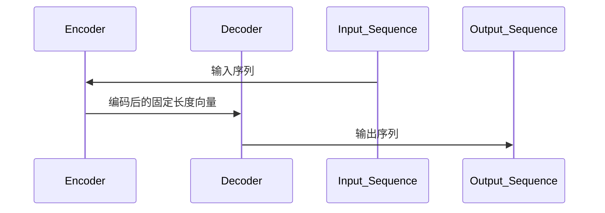

                 

# 序列到序列模型 (Seq2Seq) 原理与代码实例讲解

## 关键词
- 序列到序列模型
- Recurrent Neural Network
- Encoder-Decoder框架
- 转换器
- 机器翻译
- 生成模型
- 应用实例

## 摘要
本文将详细介绍序列到序列模型（Seq2Seq）的原理和应用，通过逐步分析其核心概念、算法原理、数学模型以及实际代码实例，帮助读者深入理解Seq2Seq模型在机器翻译、文本生成等领域的广泛应用。本文旨在为从事人工智能和机器学习领域的研究者和技术人员提供一个全面的技术教程，从基础理论到实际应用，逐步引导读者掌握Seq2Seq模型的精髓。

## 1. 背景介绍

### 1.1 目的和范围
本文旨在为读者提供一个关于序列到序列模型（Seq2Seq）的全面讲解。Seq2Seq模型是深度学习和自然语言处理领域的重要模型之一，其在机器翻译、文本生成、语音识别等任务中展现出了强大的能力。本文将首先介绍Seq2Seq模型的基本概念，随后深入探讨其工作原理、算法实现和数学模型，并通过实际代码示例展示如何应用Seq2Seq模型解决实际问题。

### 1.2 预期读者
本文适合对深度学习和自然语言处理有一定了解，希望深入学习和掌握Seq2Seq模型原理和实践的读者。无论您是初学者还是专业人士，本文都将为您提供一个系统、清晰的学习路径。

### 1.3 文档结构概述
本文将分为以下几个部分：
1. 背景介绍：介绍本文的目的、预期读者、文档结构等内容。
2. 核心概念与联系：介绍Seq2Seq模型的基本概念及其与其他模型的关联。
3. 核心算法原理 & 具体操作步骤：详细讲解Seq2Seq模型的核心算法原理和实现步骤。
4. 数学模型和公式 & 详细讲解 & 举例说明：介绍Seq2Seq模型背后的数学模型和相关公式，并通过实例进行说明。
5. 项目实战：代码实际案例和详细解释说明。
6. 实际应用场景：讨论Seq2Seq模型在不同领域的应用实例。
7. 工具和资源推荐：推荐学习资源和开发工具。
8. 总结：未来发展趋势与挑战。
9. 附录：常见问题与解答。
10. 扩展阅读 & 参考资料：提供进一步学习资料。

### 1.4 术语表
#### 1.4.1 核心术语定义
- **序列（Sequence）**：在时间维度上有顺序的一组数据点。
- **Encoder（编码器）**：将输入序列编码成一个固定长度的向量。
- **Decoder（解码器）**：将编码后的向量解码生成输出序列。
- **Seq2Seq模型**：一种用于将输入序列映射到输出序列的模型。
- **Recurrent Neural Network（RNN）**：一种能够在序列数据上通过递归结构实现信息传递的神经网络。
- **长短时记忆（Long Short-Term Memory，LSTM）**：RNN的一种变体，用于解决长序列依赖问题。

#### 1.4.2 相关概念解释
- **机器翻译**：将一种语言的文本翻译成另一种语言。
- **生成模型**：一种能够生成新数据的模型，如文本、图像等。
- **注意力机制（Attention Mechanism）**：在Seq2Seq模型中用于在解码过程中关注输入序列的特定部分，从而提高模型的准确性。

#### 1.4.3 缩略词列表
- **RNN**：Recurrent Neural Network
- **LSTM**：Long Short-Term Memory
- **Seq2Seq**：Sequence-to-Sequence
- **Encoder**：编码器
- **Decoder**：解码器

## 2. 核心概念与联系

### 2.1 序列到序列模型的基本概念
序列到序列模型（Seq2Seq）是一种将输入序列映射到输出序列的深度学习模型。它广泛应用于机器翻译、语音识别、对话系统等任务。Seq2Seq模型的核心思想是利用编码器（Encoder）将输入序列编码成一个固定长度的向量，然后利用解码器（Decoder）将这个向量解码生成输出序列。

### 2.2 Seq2Seq模型与其他模型的关联
Seq2Seq模型是基于循环神经网络（Recurrent Neural Network，RNN）的，特别是LSTM（Long Short-Term Memory）和GRU（Gated Recurrent Unit）等变体。这些变体解决了传统RNN在处理长序列时出现的梯度消失和梯度爆炸问题，从而更好地捕捉序列中的长期依赖关系。

此外，Seq2Seq模型还可以结合其他技术，如注意力机制（Attention Mechanism），来进一步提高模型的性能。注意力机制使解码器能够在生成输出序列的过程中关注输入序列的特定部分，从而提高了模型的准确性和生成质量。

### 2.3 Mermaid流程图
下面是一个简单的Mermaid流程图，展示了Seq2Seq模型的基本架构：



## 3. 核心算法原理 & 具体操作步骤

### 3.1 Encoder部分

**算法原理：**
编码器（Encoder）是Seq2Seq模型的第一步，其作用是将输入序列编码成一个固定长度的向量。这一步的主要目的是捕捉输入序列中的重要特征和依赖关系。

**具体操作步骤：**
1. **输入序列**：输入序列可以是任意维度的数据，例如单词的词向量表示。
2. **初始化编码器状态**：编码器的状态是递归神经网络的一部分，初始化时通常设为全零向量。
3. **递归计算**：对于输入序列的每个时间步，编码器计算一个隐藏状态，该隐藏状态包含了当前时间步的信息以及前一个时间步的信息。
4. **输出编码向量**：在最后一个时间步后，编码器输出一个固定长度的编码向量，这个向量代表了整个输入序列的编码结果。

**伪代码：**
```python
function encode(input_sequence):
    hidden_state = initialize_state()
    for each time_step in input_sequence:
        hidden_state = calculate_hidden_state(time_step, hidden_state)
    return hidden_state
```

### 3.2 Decoder部分

**算法原理：**
解码器（Decoder）是Seq2Seq模型的第二步，其作用是将编码向量解码生成输出序列。解码器的目标是生成与输入序列相对应的输出序列。

**具体操作步骤：**
1. **初始化解码器状态**：解码器的状态初始化为编码器的输出向量。
2. **生成初始输出**：解码器根据当前状态生成一个输出序列的第一个元素。
3. **递归解码**：对于每个时间步，解码器根据当前状态和前一个输出元素生成下一个输出元素。
4. **更新状态**：在每个时间步后，解码器的状态都会更新为当前输出元素。
5. **生成完整输出序列**：当解码器生成完整输出序列后，解码过程结束。

**伪代码：**
```python
function decode(encoded_vector):
    output_sequence = []
    current_state = encoded_vector
    for each time_step:
        next_output = generate_output(current_state)
        output_sequence.append(next_output)
        current_state = update_state(current_state, next_output)
    return output_sequence
```

### 3.3 整体流程

**算法原理：**
Seq2Seq模型的整体流程包括编码和两个递归解码过程。编码器将输入序列编码成一个固定长度的向量，解码器利用这个向量生成输出序列。

**具体操作步骤：**
1. **输入序列编码**：使用编码器对输入序列进行编码，得到编码向量。
2. **解码生成输出**：使用解码器对编码向量进行解码，生成输出序列。
3. **循环迭代**：重复解码过程，直到生成完整的输出序列。

**伪代码：**
```python
function seq2seq(input_sequence, output_sequence):
    encoded_vector = encode(input_sequence)
    for each output_element in output_sequence:
        next_output_element = decode(encoded_vector)
        encoded_vector = next_output_element
    return next_output_element
```

## 4. 数学模型和公式 & 详细讲解 & 举例说明

### 4.1 数学模型

Seq2Seq模型主要涉及两部分：编码器的数学模型和解码器的数学模型。

#### 4.1.1 Encoder部分
编码器的输入是一个序列 $X = [x_1, x_2, ..., x_T]$，其中 $x_t$ 是第 $t$ 个时间步的输入数据。编码器的输出是一个固定长度的向量 $h = [h_1, h_2, ..., h_L]$，其中 $h_l$ 是第 $l$ 个时间步的隐藏状态。

编码器的数学模型可以表示为：
$$
h_l = f(h_{l-1}, x_l)
$$
其中 $f$ 是一个递归函数，通常采用LSTM或GRU来实现。

#### 4.1.2 Decoder部分
解码器的输入是编码器的输出向量 $h$ 和目标序列的第一个元素 $y_1$。解码器的输出是一个序列 $Y = [y_1, y_2, ..., y_T']$，其中 $y_t$ 是第 $t$ 个时间步的输出数据。

解码器的数学模型可以表示为：
$$
y_t = g(h_l, y_{t-1})
$$
其中 $g$ 是一个递归函数，通常采用LSTM或GRU来实现。

### 4.2 公式详细讲解

#### 4.2.1 Encoder公式
$$
h_l = \text{LSTM}(h_{l-1}, x_l)
$$
其中 $\text{LSTM}$ 表示长短时记忆网络，用于计算第 $l$ 个时间步的隐藏状态。这个公式描述了编码器如何利用前一个时间步的隐藏状态和当前时间步的输入数据来计算新的隐藏状态。

#### 4.2.2 Decoder公式
$$
y_t = \text{LSTM}(h_l, y_{t-1})
$$
其中 $\text{LSTM}$ 表示长短时记忆网络，用于计算第 $t$ 个时间步的输出数据。这个公式描述了解码器如何利用编码器的隐藏状态和前一个时间步的输出数据来计算新的输出数据。

### 4.3 举例说明

假设我们有一个简单的输入序列 $X = [x_1, x_2, x_3]$，我们需要使用Seq2Seq模型将其编码并解码为输出序列 $Y = [y_1, y_2, y_3]$。

1. **编码阶段**：
    - 初始化编码器的隐藏状态 $h_0$。
    - 对每个时间步 $t$，计算隐藏状态 $h_t$：
        $$
        h_t = \text{LSTM}(h_{t-1}, x_t)
        $$
    - 最后得到编码器的输出向量 $h_L$。

2. **解码阶段**：
    - 初始化解码器的隐藏状态 $h_0 = h_L$。
    - 对每个时间步 $t$，计算输出数据 $y_t$：
        $$
        y_t = \text{LSTM}(h_t, y_{t-1})
        $$
    - 最后得到解码器的输出序列 $Y$。

通过这个简单的例子，我们可以看到Seq2Seq模型是如何将输入序列编码并解码为输出序列的。

## 5. 项目实战：代码实际案例和详细解释说明

### 5.1 开发环境搭建

在进行Seq2Seq模型的项目实战之前，我们需要搭建一个合适的开发环境。以下是一个基于Python和TensorFlow的典型开发环境搭建步骤：

1. **安装Python**：确保您的计算机上安装了Python，推荐使用Python 3.7或更高版本。
2. **安装TensorFlow**：使用pip命令安装TensorFlow：
    ```
    pip install tensorflow
    ```
3. **安装其他依赖库**：可能还需要安装一些其他库，如Numpy、Pandas等。使用以下命令安装：
    ```
    pip install numpy pandas
    ```
4. **创建项目目录**：在一个合适的地方创建一个项目目录，并在该目录下创建一个名为`src`的子目录用于存放源代码。

### 5.2 源代码详细实现和代码解读

在`src`目录下，创建一个名为`seq2seq.py`的文件，并在其中实现Seq2Seq模型的核心功能。以下是该文件的详细代码实现：

```python
import tensorflow as tf
from tensorflow.keras.layers import LSTM, Dense
from tensorflow.keras.models import Model

# 设置参数
vocab_size = 10000  # 词汇表大小
embed_dim = 256  # 嵌入层维度
lstm_units = 1024  # LSTM单元数量
batch_size = 64  # 批量大小

# 定义编码器
encoder_inputs = tf.keras.layers.Input(shape=(None, vocab_size))
encoder_embedding = tf.keras.layers.Embedding(vocab_size, embed_dim)(encoder_inputs)
encoder_lstm = LSTM(lstm_units, return_state=True)
encoder_outputs, state_h, state_c = encoder_lstm(encoder_embedding)
encoder_states = [state_h, state_c]

# 定义解码器
decoder_inputs = tf.keras.layers.Input(shape=(None, vocab_size))
decoder_embedding = tf.keras.layers.Embedding(vocab_size, embed_dim)(decoder_inputs)
decoder_lstm = LSTM(lstm_units, return_sequences=True, return_state=True)
decoder_outputs, _, _ = decoder_lstm(decoder_embedding, initial_state=encoder_states)
decoder_dense = Dense(vocab_size, activation='softmax')
decoder_outputs = decoder_dense(decoder_outputs)

# 创建模型
model = Model([encoder_inputs, decoder_inputs], decoder_outputs)

# 编译模型
model.compile(optimizer='rmsprop', loss='categorical_crossentropy', metrics=['accuracy'])

# 查看模型结构
model.summary()
```

**代码解读**：
1. **定义编码器输入**：编码器输入是一个形状为 $(None, vocab_size)$ 的张量，表示一个时间步上的词汇序列。
2. **嵌入层**：嵌入层将输入的词汇索引映射为嵌入向量。
3. **LSTM层**：LSTM层用于处理序列数据，返回隐藏状态和单元状态。
4. **定义解码器输入**：解码器输入与编码器输入类似，也是形状为 $(None, vocab_size)$ 的张量。
5. **嵌入层**：解码器嵌入层与编码器嵌入层相同。
6. **LSTM层**：解码器LSTM层返回输出序列、隐藏状态和单元状态。
7. **全连接层**：全连接层用于对LSTM层的输出进行分类，并生成输出概率分布。
8. **创建模型**：将编码器和解码器连接起来，形成一个完整的模型。
9. **编译模型**：设置优化器和损失函数，编译模型。

### 5.3 代码解读与分析

接下来，我们将对代码进行逐行解读，并分析其中的关键部分。

```python
import tensorflow as tf
from tensorflow.keras.layers import LSTM, Dense
from tensorflow.keras.models import Model

# 设置参数
vocab_size = 10000  # 词汇表大小
embed_dim = 256  # 嵌入层维度
lstm_units = 1024  # LSTM单元数量
batch_size = 64  # 批量大小
```
这些参数定义了模型的超参数，包括词汇表大小、嵌入层维度、LSTM单元数量和批量大小。

```python
encoder_inputs = tf.keras.layers.Input(shape=(None, vocab_size))
encoder_embedding = tf.keras.layers.Embedding(vocab_size, embed_dim)(encoder_inputs)
encoder_lstm = LSTM(lstm_units, return_state=True)
encoder_outputs, state_h, state_c = encoder_lstm(encoder_embedding)
encoder_states = [state_h, state_c]
```
这部分代码定义了编码器的输入层、嵌入层和LSTM层。编码器的输入是一个未知的长度时间序列，每个时间步上的输入是一个词汇索引。嵌入层将词汇索引映射为嵌入向量。LSTM层返回隐藏状态和单元状态，并将这些状态作为编码器的输出。

```python
decoder_inputs = tf.keras.layers.Input(shape=(None, vocab_size))
decoder_embedding = tf.keras.layers.Embedding(vocab_size, embed_dim)(decoder_inputs)
decoder_lstm = LSTM(lstm_units, return_sequences=True, return_state=True)
decoder_outputs, _, _ = decoder_lstm(decoder_embedding, initial_state=encoder_states)
decoder_dense = Dense(vocab_size, activation='softmax')
decoder_outputs = decoder_dense(decoder_outputs)
```
这部分代码定义了解码器的输入层、嵌入层、LSTM层和全连接层。解码器的输入同样是一个未知的长度时间序列，嵌入层将词汇索引映射为嵌入向量。LSTM层返回输出序列、隐藏状态和单元状态。全连接层用于生成输出概率分布。

```python
model = Model([encoder_inputs, decoder_inputs], decoder_outputs)
```
这部分代码将编码器和解码器连接起来，形成一个完整的模型。

```python
model.compile(optimizer='rmsprop', loss='categorical_crossentropy', metrics=['accuracy'])
```
这部分代码设置模型的优化器、损失函数和评估指标。

```python
model.summary()
```
这部分代码输出模型的结构摘要，帮助了解模型的组成。

### 5.4 模型训练与预测

在实际应用中，我们需要使用训练数据来训练模型，并使用训练好的模型进行预测。以下是一个简单的训练和预测示例：

```python
# 准备训练数据
input_sequences = ...  # 编码器的输入序列
target_sequences = ...  # 解码器的目标序列

# 划分训练集和验证集
train_inputs = input_sequences[:int(len(input_sequences) * 0.8)]
train_targets = target_sequences[:int(len(target_sequences) * 0.8)]

val_inputs = input_sequences[int(len(input_sequences) * 0.8):]
val_targets = target_sequences[int(len(target_sequences) * 0.8):]

# 训练模型
model.fit([train_inputs, train_targets], train_targets,
          epochs=100,
          batch_size=batch_size,
          validation_data=([val_inputs, val_targets], val_targets))

# 进行预测
predicted_sequences = model.predict(val_inputs)
```

**代码解读**：
1. **准备训练数据**：我们将输入序列和目标序列划分成训练集和验证集。
2. **训练模型**：使用训练集来训练模型，并使用验证集来评估模型的性能。
3. **进行预测**：使用训练好的模型对验证集进行预测。

### 5.5 代码分析与优化

在实际应用中，我们可能需要对模型进行优化以提高其性能。以下是一些可能的优化策略：

1. **增加训练时间**：增加训练时间可以使得模型有更多的机会学习到数据的特征，从而提高模型的性能。
2. **调整超参数**：通过调整嵌入层维度、LSTM单元数量和批量大小等超参数，可以找到更适合当前问题的最优配置。
3. **使用更复杂的模型**：如果现有的模型性能不佳，可以尝试使用更复杂的模型结构，如加入注意力机制、使用双向LSTM等。
4. **数据预处理**：对训练数据进行适当的预处理，如数据清洗、降维等，可以减少噪声和提高模型的泛化能力。

### 5.6 模型评估与调优

在训练模型后，我们需要对模型进行评估和调优，以确保其在实际应用中能够达到预期的效果。以下是一些常用的评估指标和方法：

1. **准确率（Accuracy）**：准确率是预测正确的样本数量占总样本数量的比例。虽然准确率简单易算，但它在类别不平衡的数据集上可能不具有代表性。
2. **精确率（Precision）**：精确率是预测正确的正样本数量与预测为正样本的总数量之比。它关注的是预测为正样本中的真实正样本比例。
3. **召回率（Recall）**：召回率是预测正确的正样本数量与实际为正样本的总数量之比。它关注的是实际为正样本中的预测正样本比例。
4. **F1分数（F1 Score）**：F1分数是精确率和召回率的调和平均值，用于综合评估模型的性能。
5. **混淆矩阵（Confusion Matrix）**：混淆矩阵是一种直观地展示模型预测结果与真实结果之间差异的工具。

在实际应用中，我们可以结合多种评估指标和方法来全面评估模型的性能，并根据评估结果进行相应的调优。

### 5.7 模型部署与实时预测

在实际应用中，训练好的Seq2Seq模型需要被部署到生产环境中进行实时预测。以下是一些常见的部署方式和注意事项：

1. **部署到服务器**：将训练好的模型部署到服务器上，通过API或命令行等方式进行实时预测。
2. **部署到容器**：使用容器化技术（如Docker）将模型和相关依赖打包成一个独立的容器，方便部署和管理。
3. **部署到云平台**：将模型部署到云平台（如AWS、Azure、Google Cloud等），利用云平台提供的计算资源进行实时预测。
4. **注意事项**：在部署模型时，需要注意数据的一致性、安全性、性能等方面的问题，确保模型能够稳定、高效地运行。

## 6. 实际应用场景

### 6.1 机器翻译
机器翻译是Seq2Seq模型最典型的应用场景之一。Seq2Seq模型通过将源语言编码为一个固定长度的向量，再将其解码为目标语言，实现了源语言到目标语言的翻译。在实际应用中，机器翻译广泛应用于跨语言沟通、国际商务、旅游等领域。

### 6.2 文本生成
Seq2Seq模型还可以用于生成文本。例如，在生成新闻摘要、文章写作、对话系统等领域，Seq2Seq模型可以生成具有连贯性和逻辑性的文本。通过训练大量的文本数据，模型可以学习到文本的语法、语义和风格，从而生成高质量的文本。

### 6.3 语音识别
Seq2Seq模型还可以用于语音识别。在语音识别任务中，编码器将音频信号编码为向量，解码器将这个向量解码为文本。通过结合声学模型和语言模型，Seq2Seq模型可以实现高精度的语音识别。

### 6.4 问答系统
问答系统是另一种重要的应用场景。Seq2Seq模型可以通过将问题和答案编码为向量，然后解码生成问题对应的答案。在实际应用中，问答系统广泛应用于智能客服、智能助手、在线教育等领域。

### 6.5 图像到文本的转换
Seq2Seq模型还可以用于图像到文本的转换。通过将图像编码为向量，解码器可以将这个向量解码为描述图像的文本。这种技术可以应用于图像标注、图像识别、自动生成图文并茂的内容等领域。

### 6.6 其他应用场景
除了上述应用场景，Seq2Seq模型还可以应用于语音合成、情感分析、命名实体识别、文本分类等领域。随着深度学习和自然语言处理技术的不断发展，Seq2Seq模型的应用场景将会更加广泛。

## 7. 工具和资源推荐

### 7.1 学习资源推荐

#### 7.1.1 书籍推荐
1. **《深度学习》**：由Goodfellow、Bengio和Courville合著的经典教材，详细介绍了深度学习的基础理论和技术。
2. **《序列模型与深度学习》**：李航著，系统地介绍了序列模型及其在自然语言处理、语音识别等领域的应用。
3. **《自然语言处理综论》**：Daniel Jurafsky和James H. Martin合著的教材，全面介绍了自然语言处理的基本概念和技术。

#### 7.1.2 在线课程
1. **吴恩达的《深度学习专项课程》**：这是一门非常受欢迎的在线课程，涵盖了深度学习的基础理论和实践应用。
2. **李宏毅的《深度学习》**：这是一门由台湾大学李宏毅教授讲授的深度学习课程，内容深入浅出，适合初学者。
3. **斯坦福大学的《自然语言处理专项课程》**：这是一门系统地介绍自然语言处理技术的在线课程，适合对自然语言处理感兴趣的学习者。

#### 7.1.3 技术博客和网站
1. **知乎专栏**：知乎上有许多优秀的专栏，如“机器学习入门”、“深度学习实战”等，适合初学者了解相关知识。
2. **百度AI技术博客**：百度AI技术博客上有很多关于深度学习和自然语言处理的技术文章，内容丰富实用。
3. **Medium**：Medium上有许多顶尖的人工智能和机器学习领域的文章，适合进阶学习。

### 7.2 开发工具框架推荐

#### 7.2.1 IDE和编辑器
1. **PyCharm**：PyCharm是一款功能强大的Python IDE，适合进行深度学习和自然语言处理项目的开发。
2. **Jupyter Notebook**：Jupyter Notebook是一种交互式的开发环境，适合进行数据分析和模型验证。
3. **Visual Studio Code**：Visual Studio Code是一款轻量级的代码编辑器，支持多种编程语言，适合进行深度学习和自然语言处理项目的开发。

#### 7.2.2 调试和性能分析工具
1. **TensorBoard**：TensorBoard是一款可视化工具，可以用于分析深度学习模型的性能，如梯度、损失函数等。
2. **gdb**：gdb是一款强大的调试工具，适用于C/C++程序的调试。
3. **Valgrind**：Valgrind是一款性能分析工具，可以检测程序中的内存泄漏、数据竞争等问题。

#### 7.2.3 相关框架和库
1. **TensorFlow**：TensorFlow是一款开源的深度学习框架，适合进行大规模深度学习模型的开发。
2. **PyTorch**：PyTorch是一款易于使用且灵活的深度学习框架，适合进行研究和实践。
3. **Scikit-learn**：Scikit-learn是一款常用的机器学习库，提供了许多经典的机器学习算法和工具。

### 7.3 相关论文著作推荐

#### 7.3.1 经典论文
1. **《序列到序列学习》**：由Sutskever等人提出的序列到序列学习模型，是深度学习和自然语言处理领域的经典论文。
2. **《长短时记忆网络》**：由Hochreiter和Schmidhuber提出的长短时记忆网络，是解决长序列依赖问题的有效方法。
3. **《注意力机制》**：由Bahdanau等人提出的注意力机制，是提升Seq2Seq模型性能的关键技术。

#### 7.3.2 最新研究成果
1. **《Transformer模型》**：由Vaswani等人提出的Transformer模型，在自然语言处理领域取得了显著的成果。
2. **《BERT模型》**：由Google提出的BERT模型，在多项自然语言处理任务上刷新了SOTA。
3. **《GPT模型》**：由OpenAI提出的GPT模型，在生成模型领域取得了重大突破。

#### 7.3.3 应用案例分析
1. **《基于Seq2Seq模型的机器翻译系统》**：介绍了基于Seq2Seq模型的机器翻译系统的设计、实现和应用。
2. **《基于Seq2Seq模型的文本生成》**：探讨了Seq2Seq模型在文本生成任务中的应用，包括文章写作、对话系统等。
3. **《基于Seq2Seq模型的语音识别》**：分析了基于Seq2Seq模型的语音识别系统的设计和实现，包括声学模型和语言模型。

## 8. 总结：未来发展趋势与挑战

随着深度学习和自然语言处理技术的不断发展，Seq2Seq模型在未来将会得到更加广泛的应用和深入研究。以下是Seq2Seq模型未来发展趋势与挑战：

### 8.1 发展趋势

1. **模型优化**：随着计算能力的提升，人们将致力于优化Seq2Seq模型的结构和算法，提高模型的性能和效率。
2. **多模态学习**：Seq2Seq模型可以结合其他模态（如图像、音频）的数据，实现更加复杂的任务，如图像到文本的转换、视频到文本的摘要等。
3. **强化学习**：将强化学习与Seq2Seq模型结合，实现更加智能和自适应的序列生成和预测。
4. **预训练与迁移学习**：通过预训练和迁移学习，Seq2Seq模型可以更好地适应不同的任务和数据集，提高模型的泛化能力。

### 8.2 挑战

1. **计算资源需求**：Seq2Seq模型通常需要较大的计算资源和内存，如何优化模型结构以降低计算成本是一个重要挑战。
2. **长序列依赖**：Seq2Seq模型在处理长序列依赖时可能存在性能瓶颈，如何提高模型在长序列上的表现是一个需要解决的问题。
3. **数据隐私与安全**：在实际应用中，数据的隐私和安全是一个重要问题，如何保护用户数据的安全是一个亟待解决的挑战。
4. **模型解释性**：如何提高模型的解释性，使人们能够理解模型的决策过程，是一个关键的研究方向。

总之，Seq2Seq模型在未来将面临许多机遇和挑战，随着技术的不断进步，我们有理由相信Seq2Seq模型将在人工智能和自然语言处理领域发挥更加重要的作用。

## 9. 附录：常见问题与解答

### 9.1 Q：什么是序列到序列模型（Seq2Seq）？

A：序列到序列模型（Seq2Seq）是一种用于将输入序列映射到输出序列的深度学习模型。它在机器翻译、文本生成、语音识别等任务中取得了显著的效果。

### 9.2 Q：Seq2Seq模型的核心组成部分是什么？

A：Seq2Seq模型主要由两个部分组成：编码器（Encoder）和解码器（Decoder）。编码器用于将输入序列编码成一个固定长度的向量，解码器则将这个向量解码成输出序列。

### 9.3 Q：什么是长短时记忆网络（LSTM）？

A：长短时记忆网络（LSTM）是一种递归神经网络，用于解决传统RNN在处理长序列时出现的梯度消失和梯度爆炸问题。LSTM通过引入门控机制，可以更好地捕捉序列中的长期依赖关系。

### 9.4 Q：Seq2Seq模型与循环神经网络（RNN）有何区别？

A：Seq2Seq模型是RNN的一种变体，其核心思想是将输入序列映射到输出序列。与传统的RNN相比，Seq2Seq模型通过引入编码器和解码器结构，更好地处理了序列到序列的映射问题。

### 9.5 Q：Seq2Seq模型在机器翻译任务中如何工作？

A：在机器翻译任务中，编码器将源语言的文本序列编码成一个固定长度的向量，解码器则将这个向量解码成目标语言的文本序列。通过大量的训练数据，模型可以学习到源语言和目标语言之间的映射关系。

### 9.6 Q：Seq2Seq模型可以应用于哪些领域？

A：Seq2Seq模型可以应用于许多领域，如机器翻译、文本生成、语音识别、问答系统等。随着深度学习和自然语言处理技术的发展，Seq2Seq模型的应用场景将不断拓展。

## 10. 扩展阅读 & 参考资料

### 10.1 扩展阅读

1. **《序列模型与深度学习》**：李航著，详细介绍了序列模型及其在自然语言处理、语音识别等领域的应用。
2. **《深度学习》**：Goodfellow、Bengio和Courville合著，系统地介绍了深度学习的基础理论和技术。
3. **《自然语言处理综论》**：Daniel Jurafsky和James H. Martin合著，全面介绍了自然语言处理的基本概念和技术。

### 10.2 参考资料

1. **《序列到序列学习》**：Sutskever等人提出的序列到序列学习模型，是深度学习和自然语言处理领域的经典论文。
2. **《长短时记忆网络》**：Hochreiter和Schmidhuber提出的长短时记忆网络，是解决长序列依赖问题的有效方法。
3. **《注意力机制》**：Bahdanau等人提出的注意力机制，是提升Seq2Seq模型性能的关键技术。
4. **《Transformer模型》**：Vaswani等人提出的Transformer模型，在自然语言处理领域取得了显著的成果。
5. **《BERT模型》**：Google提出的BERT模型，在多项自然语言处理任务上刷新了SOTA。
6. **《GPT模型》**：OpenAI提出的GPT模型，在生成模型领域取得了重大突破。

### 10.3 网络资源

1. **吴恩达的《深度学习专项课程》**：[深度学习专项课程](https://www.coursera.org/learn/neural-networks-deep-learning)
2. **李宏毅的《深度学习》**：[深度学习](https://www.youtube.com/watch?v=IdzQmA3_09E)
3. **斯坦福大学的《自然语言处理专项课程》**：[自然语言处理专项课程](https://web.stanford.edu/class/cs224n/)

