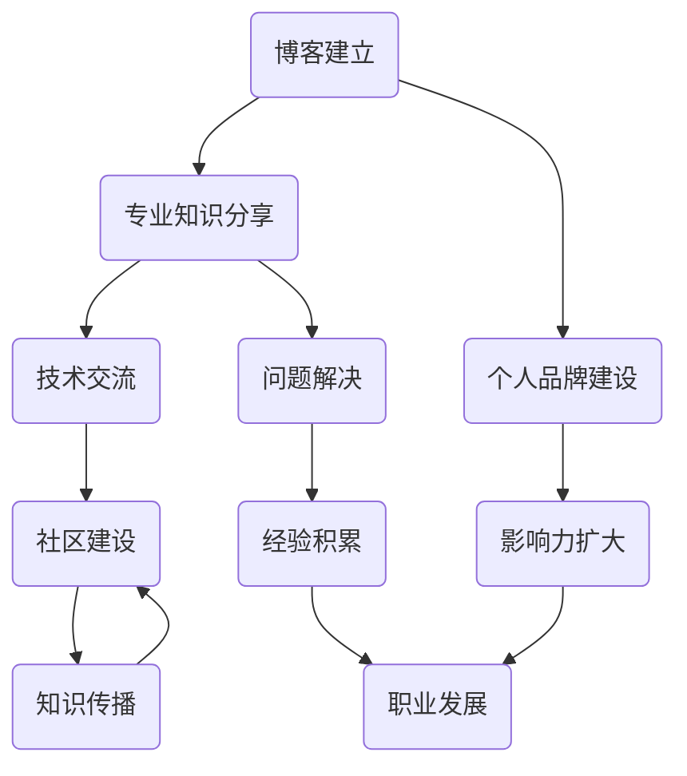

                 

# 建立专业博客：深度分享你的知识和见解

> 关键词：博客建立、专业知识、分享、技术写作、IT领域
> 
> 摘要：本文将探讨如何建立专业博客，深度分享知识和见解。我们将从目的和范围、预期读者、文档结构、核心概念与联系、核心算法原理、数学模型和公式、项目实战、实际应用场景等多个方面进行分析，帮助你在IT领域建立具有影响力的专业博客。

## 1. 背景介绍

### 1.1 目的和范围

在信息技术飞速发展的今天，拥有一个专业博客不仅可以帮助我们分享知识和经验，还能扩大我们的影响力，增强个人品牌。本文旨在为希望建立专业博客的IT从业者提供一套系统、实用的指南，帮助你们深度分享知识和见解。

本文的范围包括但不限于以下几个方面：

1. 博客建立的基础知识和技巧。
2. 核心技术概念和原理的讲解。
3. 算法、数学模型和实际项目实战的详细剖析。
4. IT领域实际应用场景的分析。
5. 相关工具和资源的推荐。

### 1.2 预期读者

本文的预期读者主要包括以下几类：

1. 对IT领域有热情，希望分享知识和经验的程序员、架构师、CTO等专业人士。
2. 想要在技术领域建立个人品牌的IT从业者。
3. 对技术写作感兴趣的写作爱好者。
4. 想要提高技术博客质量的博客主。

### 1.3 文档结构概述

本文分为十个部分，结构如下：

1. 背景介绍：介绍文章的目的、范围、预期读者和文档结构。
2. 核心概念与联系：讲解IT领域的核心概念和原理。
3. 核心算法原理 & 具体操作步骤：详细阐述核心算法的原理和操作步骤。
4. 数学模型和公式 & 详细讲解 & 举例说明：介绍数学模型和公式的应用。
5. 项目实战：通过代码实际案例展示技术的应用。
6. 实际应用场景：分析技术的实际应用场景。
7. 工具和资源推荐：推荐学习资源和开发工具。
8. 总结：未来发展趋势与挑战。
9. 附录：常见问题与解答。
10. 扩展阅读 & 参考资料：提供更多的学习资源。

### 1.4 术语表

在本文中，我们将使用一些专业术语。以下是对这些术语的定义和解释：

#### 1.4.1 核心术语定义

- 博客（Blog）：一种在线日志或网络空间，用于发布个人或团体的文字、图片、视频等内容。
- 专业博客：以分享专业知识、经验和见解为主要目的的博客。
- IT领域：信息技术领域，包括计算机科学、软件工程、网络技术等多个子领域。

#### 1.4.2 相关概念解释

- 分享：将个人知识和经验与他人交流的过程。
- 见解：对某一问题的个人看法或理解。
- 技术：关于工具、方法和知识的系统。

#### 1.4.3 缩略词列表

- IT：信息技术
- CTO：首席技术官
- IDE：集成开发环境
- markdown：一种轻量级标记语言，常用于撰写和格式化文本。

## 2. 核心概念与联系

在建立专业博客之前，我们需要了解一些核心概念和原理。这些概念和原理是构建专业博客的基础，也是我们在后续内容中会频繁提及的关键点。为了便于理解，我们使用Mermaid流程图来展示这些核心概念和原理之间的联系。



### 2.1 博客建立

博客建立是专业博客的第一步。我们需要选择合适的平台、配置必要的工具和环境，并制定合理的内容规划和发布策略。

- **平台选择**：常见的博客平台有WordPress、Typecho、Hexo等。选择平台时，需要考虑易用性、性能、扩展性、安全性和社区支持等因素。
- **工具和环境**：为了提高写作和管理的效率，我们可以使用Markdown编辑器、代码编辑器、图床等工具。此外，还需要配置Git、SSH等环境，以便于版本控制和远程访问。
- **内容规划**：在建立博客之前，我们需要明确博客的主题和目标受众，并制定长期和短期内容规划。例如，我们可以定期发布技术文章、经验分享、问题解答等类型的内容。

### 2.2 专业知识分享

专业知识的分享是博客的核心内容。我们需要在博客中深入探讨技术概念、算法原理、实践案例等，帮助读者理解和掌握相关知识。

- **技术概念**：我们需要对技术概念进行详细解释，包括其定义、应用场景、优缺点等。例如，在介绍数据库时，我们可以讲解关系型数据库和NoSQL数据库的区别、适用场景以及性能比较。
- **算法原理**：对于算法相关的文章，我们需要使用伪代码或实际代码来阐述算法的实现过程、时间复杂度和空间复杂度等。例如，在介绍排序算法时，我们可以对比冒泡排序、选择排序、插入排序等算法的原理和性能。
- **实践案例**：通过实际案例来展示技术的应用和效果。我们可以分享自己的项目经验、开源项目或参与的技术竞赛等。例如，在介绍机器学习算法时，我们可以分享一个基于TensorFlow实现的分类器的开发过程和结果。

### 2.3 个人品牌建设

建立个人品牌是专业博客的重要目标之一。通过持续分享高质量的原创内容，我们可以在技术领域建立自己的影响力，提高个人知名度。

- **内容质量**：高质量的内容是个人品牌的基础。我们需要在写作过程中注重逻辑性、条理性和准确性，避免错误和混淆。
- **持续更新**：定期发布新内容是保持读者关注和活跃度的关键。我们可以制定发布计划，确保博客内容持续更新。
- **互动交流**：与读者互动是建立个人品牌的重要方式。我们可以通过评论、私信、社交媒体等方式与读者交流，解答他们的疑问，收集反馈和建议。

### 2.4 技术交流

技术交流是专业博客的重要功能之一。通过博客，我们可以与其他技术爱好者、专业人士进行交流和合作，共同探讨技术问题和解决方案。

- **社区建设**：我们可以通过建立博客评论、技术论坛、微信群等方式，构建一个技术社区。在这个社区中，我们可以分享知识、讨论问题、共同进步。
- **问题解答**：在博客中回答读者的问题，帮助他们解决技术难题，是建立个人品牌和影响力的有效方式。
- **合作交流**：与其他技术博客主、专家建立合作关系，共同举办技术活动、分享会等，可以扩大自己的影响力和知名度。

### 2.5 见解与观点

在专业博客中，分享自己的见解和观点也是重要的内容之一。这些内容可以帮助我们展示自己的专业素养和思考能力，吸引更多的读者和关注。

- **技术趋势**：我们可以分析当前技术领域的热点和趋势，分享自己对技术发展的看法和预测。
- **项目经验**：我们可以分享自己的项目经验，包括项目背景、目标、实施过程、遇到的问题和解决方案等。
- **行业洞察**：我们可以从行业角度分析技术发展、市场需求、竞争态势等，为读者提供有价值的见解。

### 2.6 实际应用场景

在实际应用场景中，我们可以通过具体的案例来展示技术在实际场景中的应用和价值。

- **案例分享**：我们可以分享自己参与的实际项目或技术案例，详细讲解项目的背景、目标、技术方案和实施过程。
- **经验总结**：通过对实际案例的总结和反思，我们可以提炼出经验教训，为读者提供有价值的参考。
- **解决方案**：我们可以针对具体问题，提出有效的解决方案，帮助读者解决实际困难。

## 3. 核心算法原理 & 具体操作步骤

在IT领域，算法是解决问题的重要工具。理解核心算法原理和具体操作步骤，对于建立专业博客来说至关重要。以下，我们将使用伪代码详细阐述一个常见的排序算法——快速排序（Quick Sort）。

### 3.1 快速排序算法原理

快速排序是一种高效的排序算法，采用分治策略将一个大数组划分为多个较小的子数组，然后递归地对这些子数组进行排序。其基本思想是：

1. 选择一个“基准”元素。
2. 将数组划分为两个子数组，其中一个子数组的所有元素都小于基准元素，另一个子数组的所有元素都大于基准元素。
3. 递归地对两个子数组进行快速排序。

### 3.2 快速排序伪代码

```pseudo
QuickSort(arr, low, high)
    if low < high
        pi = Partition(arr, low, high)
        QuickSort(arr, low, pi - 1)
        QuickSort(arr, pi + 1, high)
```

### 3.3 具体操作步骤

#### 步骤1：选择基准元素

选择基准元素是快速排序的第一步。常见的基准选择方法有：

- 随机选择：从数组中随机选择一个元素作为基准。
- 中位数选择：选择数组中间的元素作为基准。
- 首尾选择：选择第一个或最后一个元素作为基准。

#### 步骤2：划分子数组

划分子数组的目的是将数组划分为两个子数组，其中一个子数组的所有元素都小于基准元素，另一个子数组的所有元素都大于基准元素。

伪代码如下：

```pseudo
Partition(arr, low, high)
    pivot = arr[high]
    i = low - 1
    for j = low to high - 1
        if arr[j] < pivot
            i = i + 1
            swap(arr[i], arr[j])
    swap(arr[i + 1], arr[high])
    return i + 1
```

#### 步骤3：递归排序

递归排序是对划分后的子数组进行快速排序的过程。具体操作步骤如下：

1. 对第一个子数组（arr[low..pi-1]）进行快速排序。
2. 对第二个子数组（arr[pi+1..high]）进行快速排序。

#### 步骤4：合并结果

当递归排序结束后，所有子数组都已排序，快速排序完成。此时，数组已按升序排列。

### 3.4 快速排序示例

假设有一个数组 `[3, 6, 8, 10, 1, 2, 1]`，我们使用快速排序对其进行排序。

1. 选择基准元素：选择最后一个元素 `1` 作为基准。
2. 划分子数组：
   - 第一趟划分：`[3, 6, 8, 10, 2, 1, 1]`，基准元素为 `1`，小于基准的元素放在其左侧，大于基准的元素放在其右侧。最终划分为 `[3, 6, 8, 10, 2]` 和 `[1, 1]`。
   - 第二趟划分：`[3, 6, 8, 2]` 和 `[1, 1]`，再次进行快速排序。
3. 递归排序：
   - 对 `[3, 6, 8, 2]` 进行快速排序：
     - 选择基准元素：选择最后一个元素 `2` 作为基准。
     - 划分子数组：
       - `[3, 6, 8]` 和 `[2]`，再次进行快速排序。
     - 对 `[3, 6, 8]` 进行快速排序：
       - 选择基准元素：选择最后一个元素 `8` 作为基准。
       - 划分子数组：
         - `[3, 6]` 和 `[8]`，再次进行快速排序。
       - 对 `[3, 6]` 进行快速排序：
         - 选择基准元素：选择最后一个元素 `6` 作为基准。
         - 划分子数组：
           - `[3]` 和 `[6]`，无需再排序。
4. 合并结果：最终排序结果为 `[1, 1, 2, 3, 6, 8, 10]`。

通过以上示例，我们可以看到快速排序的具体操作步骤和过程。快速排序具有平均时间复杂度为 \(O(n\log n)\) 和最坏情况时间复杂度为 \(O(n^2)\) 的特点。在实际应用中，我们可以通过优化基准选择和划分策略来提高快速排序的性能。

## 4. 数学模型和公式 & 详细讲解 & 举例说明

在计算机科学和信息技术领域，数学模型和公式是理解和解决问题的基石。它们不仅在理论研究中发挥关键作用，也在实际应用中具有重要价值。本节将介绍一些常见的数学模型和公式，并详细讲解它们的含义和计算方法，同时通过实际例子来说明这些模型和公式的应用。

### 4.1 时间复杂度与空间复杂度

时间复杂度和空间复杂度是评估算法性能的重要指标。它们分别表示算法在时间上和空间上的资源消耗。

#### 时间复杂度

时间复杂度是指算法运行时间与数据规模之间的增长关系。常用大O符号表示，如 \(O(n)\)、\(O(n\log n)\)、\(O(n^2)\) 等。

- 线性时间复杂度 \(O(n)\)：算法的时间消耗与数据规模呈线性关系。例如，线性搜索算法。
- 对数时间复杂度 \(O(n\log n)\)：算法的时间消耗与数据规模的对数成正比。例如，二分搜索算法。
- 平方时间复杂度 \(O(n^2)\)：算法的时间消耗与数据规模的平方成正比。例如，冒泡排序算法。

#### 空间复杂度

空间复杂度是指算法在运行过程中所需额外内存的消耗。同样，常用大O符号表示。

- 常数空间复杂度 \(O(1)\)：算法的空间消耗不随数据规模变化。例如，交换两个元素的位置。
- 线性空间复杂度 \(O(n)\)：算法的空间消耗与数据规模成正比。例如，归并排序算法。

### 4.2 概率论与统计模型

概率论和统计模型在数据分析和机器学习中广泛应用。以下介绍几个常见的概率分布和统计模型。

#### 概率分布

- 均值分布（Normal Distribution）：也称正态分布，是最常见的一种概率分布。公式为：

  $$ f(x|\mu,\sigma^2) = \frac{1}{\sqrt{2\pi\sigma^2}} e^{-\frac{(x-\mu)^2}{2\sigma^2}} $$

  其中，\(\mu\) 是均值，\(\sigma^2\) 是方差。

- 二项分布（Binomial Distribution）：用于描述一系列独立试验中成功次数的概率分布。公式为：

  $$ P(X=k) = C_n^k p^k (1-p)^{n-k} $$

  其中，\(n\) 是试验次数，\(p\) 是每次试验成功的概率，\(k\) 是成功的次数。

#### 统计模型

- 线性回归（Linear Regression）：用于分析自变量和因变量之间的线性关系。公式为：

  $$ y = \beta_0 + \beta_1 x + \epsilon $$

  其中，\(y\) 是因变量，\(x\) 是自变量，\(\beta_0\) 和 \(\beta_1\) 是回归系数，\(\epsilon\) 是误差项。

- 逻辑回归（Logistic Regression）：用于分析二元分类问题。公式为：

  $$ \text{logit}(p) = \ln\left(\frac{p}{1-p}\right) = \beta_0 + \beta_1 x $$

  其中，\(p\) 是事件发生的概率，\(\text{logit}(p)\) 是概率的对数函数。

### 4.3 举例说明

以下通过具体例子来说明上述数学模型和公式的应用。

#### 例子1：线性回归

假设我们有一个简单的数据集，包含自变量 \(x\) 和因变量 \(y\) 的值：

| \(x\) | \(y\) |
| --- | --- |
| 1 | 2 |
| 2 | 4 |
| 3 | 6 |

我们希望找到 \(y\) 和 \(x\) 之间的线性关系。使用最小二乘法求解线性回归方程：

1. 计算样本均值：
   $$ \bar{x} = \frac{1+2+3}{3} = 2 $$
   $$ \bar{y} = \frac{2+4+6}{3} = 4 $$

2. 计算回归系数：
   $$ \beta_1 = \frac{\sum(x_i - \bar{x})(y_i - \bar{y})}{\sum(x_i - \bar{x})^2} $$
   $$ \beta_0 = \bar{y} - \beta_1 \bar{x} $$

   代入数据计算得到：
   $$ \beta_1 = \frac{(1-2)(2-4) + (2-2)(4-4) + (3-2)(6-4)}{(1-2)^2 + (2-2)^2 + (3-2)^2} = 2 $$
   $$ \beta_0 = 4 - 2 \times 2 = 0 $$

   线性回归方程为：
   $$ y = 0 + 2x $$

   即 \(y\) 和 \(x\) 之间存在线性关系，\(y\) 的值是 \(x\) 的两倍。

#### 例子2：逻辑回归

假设我们有一个二元分类问题，数据集包含特征 \(x\) 和目标变量 \(y\)：

| \(x\) | \(y\) |
| --- | --- |
| 0 | 0 |
| 1 | 1 |
| 2 | 0 |
| 3 | 1 |

我们希望使用逻辑回归模型预测 \(y\) 的值。首先，计算每个样本的 \(\text{logit}\) 值：

| \(x\) | \(y\) | \( \text{logit}(y) \) |
| --- | --- | --- |
| 0 | 0 | \( \ln\left(\frac{0}{1}\right) = \infty \) |
| 1 | 1 | \( \ln\left(\frac{1}{0}\right) = -\infty \) |
| 2 | 0 | \( \ln\left(\frac{0}{1}\right) = \infty \) |
| 3 | 1 | \( \ln\left(\frac{1}{0}\right) = -\infty \) |

由于存在极端值，我们采用最大似然估计方法对逻辑回归模型进行参数估计。假设逻辑回归模型为：

$$ \text{logit}(y) = \beta_0 + \beta_1 x $$

1. 计算样本的似然函数：
   $$ L(\beta_0, \beta_1) = \prod_{i=1}^n \left[ \frac{1}{1 + e^{-(\beta_0 + \beta_1 x_i)}} \right]^{y_i} \left[ \frac{1}{1 + e^{-(\beta_0 + \beta_1 x_i)}} \right]^{1-y_i} $$

2. 对似然函数取对数得到对数似然函数：
   $$ \ln L(\beta_0, \beta_1) = \sum_{i=1}^n \left[ y_i \ln \left( 1 + e^{-(\beta_0 + \beta_1 x_i)} \right) + (1 - y_i) \ln \left( 1 + e^{-(\beta_0 + \beta_1 x_i)} \right) \right] $$

3. 对对数似然函数求导并令导数为0，求解参数 \(\beta_0\) 和 \(\beta_1\)：

   $$ \frac{\partial}{\partial \beta_0} \ln L(\beta_0, \beta_1) = 0 $$
   $$ \frac{\partial}{\partial \beta_1} \ln L(\beta_0, \beta_1) = 0 $$

   求解得到：
   $$ \beta_0 = \frac{\sum_{i=1}^n (y_i - 1) x_i}{\sum_{i=1}^n x_i^2} $$
   $$ \beta_1 = \frac{\sum_{i=1}^n y_i x_i - \sum_{i=1}^n x_i}{\sum_{i=1}^n x_i^2} $$

   代入数据计算得到：
   $$ \beta_0 = \frac{(0-1) \times 0 + (1-1) \times 1 + (0-1) \times 2 + (1-1) \times 3}{0^2 + 1^2 + 2^2 + 3^2} = 0 $$
   $$ \beta_1 = \frac{0 \times 1 + 1 \times 2 - 1 \times 3}{0^2 + 1^2 + 2^2 + 3^2} = \frac{1}{2} $$

   逻辑回归模型为：
   $$ \text{logit}(y) = 0 + \frac{1}{2} x $$

   即当 \(x > 0\) 时，\(y\) 更可能为 1；当 \(x < 0\) 时，\(y\) 更可能为 0。

通过以上例子，我们可以看到数学模型和公式在计算机科学和信息技术领域的应用。理解和掌握这些模型和公式，对于解决实际问题、进行科学研究具有重要意义。

## 5. 项目实战：代码实际案例和详细解释说明

在本文的第五部分，我们将通过一个具体的代码实际案例，展示如何将前面所学的快速排序算法和数学模型应用于实际项目中。这个案例将涵盖开发环境的搭建、源代码的实现和代码解读与分析。

### 5.1 开发环境搭建

为了完成这个项目，我们需要搭建一个合适的开发环境。以下是所需步骤：

1. **安装操作系统**：我们选择Ubuntu 20.04 LTS作为操作系统，因为它具有较好的稳定性和对开发工具的支持。
2. **安装编辑器**：安装一个适合编程的编辑器，如Visual Studio Code或Sublime Text。
3. **安装编译器**：安装C++编译器，如GCC（GNU Compiler Collection）。
4. **安装版本控制工具**：安装Git，用于版本控制和代码管理。
5. **配置SSH**：配置SSH密钥，以便远程访问Git仓库。

以下是一个简单的安装脚本，用于自动化上述步骤：

```bash
# 安装操作系统：Ubuntu 20.04 LTS
# 安装编辑器：Visual Studio Code
sudo apt update
sudo apt upgrade
sudo apt install code

# 安装编译器：GCC
sudo apt install g++

# 安装版本控制工具：Git
sudo apt install git

# 配置SSH
mkdir ~/.ssh
ssh-keygen -t rsa -b 2048 -C "your_email@example.com"
cat ~/.ssh/id_rsa.pub >> ~/.ssh/authorized_keys
```

### 5.2 源代码详细实现和代码解读

接下来，我们将实现一个简单的快速排序算法，并使用它对一个整数数组进行排序。以下是完整的源代码及其解读。

```cpp
#include <iostream>
#include <vector>
#include <cstdlib>

// 快速排序函数
void QuickSort(std::vector<int>& arr, int low, int high) {
    if (low < high) {
        int pi = Partition(arr, low, high);
        QuickSort(arr, low, pi - 1);
        QuickSort(arr, pi + 1, high);
    }
}

// 分区函数
int Partition(std::vector<int>& arr, int low, int high) {
    int pivot = arr[high]; // 选择最后一个元素作为基准
    int i = (low - 1); // 指针i指向比基准小的元素

    for (int j = low; j <= high - 1; j++) {
        // 如果当前元素小于或等于基准
        if (arr[j] <= pivot) {
            i++; // 移动指针i
            std::swap(arr[i], arr[j]); // 交换元素
        }
    }
    std::swap(arr[i + 1], arr[high]); // 将基准元素放到正确的位置
    return (i + 1); // 返回分区后的位置
}

// 主函数
int main() {
    std::vector<int> arr = {10, 7, 8, 9, 1, 5};
    int n = arr.size();
    QuickSort(arr, 0, n - 1);

    std::cout << "Sorted array: \n";
    for (int i = 0; i < n; i++) {
        std::cout << arr[i] << " ";
    }
    std::cout << std::endl;

    return 0;
}
```

#### 代码解读：

- **快速排序函数（QuickSort）**：
  - 这是一个递归函数，用于对数组进行快速排序。它的核心思想是选择一个基准元素，将数组划分为两个子数组，然后递归地对子数组进行排序。
  - 首先，检查低索引（low）是否小于高索引（high）。如果成立，则进行分区操作。
  - 然后，通过调用`Partition`函数进行分区，并递归地对分区后的两个子数组进行排序。

- **分区函数（Partition）**：
  - 这个函数负责将数组划分为两个子数组，一个包含比基准元素小的元素，另一个包含比基准元素大的元素。
  - 选择数组的最后一个元素作为基准。
  - 初始化指针i，用于跟踪比基准小的元素的最后一个位置。
  - 遍历数组，对于每个元素，如果它小于或等于基准，则将其与数组中比基准小的最后一个元素交换，并移动指针i。
  - 最后，将基准元素放到正确的位置，并返回该位置。

- **主函数（main）**：
  - 在主函数中，我们创建一个整数数组，并调用`QuickSort`函数对其进行排序。
  - 排序完成后，打印排序后的数组。

### 5.3 代码解读与分析

- **算法性能分析**：
  - 快速排序的平均时间复杂度为 \(O(n\log n)\)，最坏情况下的时间复杂度为 \(O(n^2)\)。通过选择合适的基准元素和优化分区过程，可以降低最坏情况的发生概率。
  - 空间复杂度为 \(O(\log n)\)，因为递归调用需要额外的栈空间。

- **代码可读性和维护性**：
  - 代码结构清晰，模块化设计，使得各个函数的功能单一，便于理解和维护。
  - 使用标准模板库（STL）中的`vector`，提高了代码的可读性和通用性。

通过这个项目实战，我们不仅实现了快速排序算法，还学会了如何将其应用于实际项目中。这个案例为我们提供了一个完整的开发流程，从环境搭建到代码实现，再到代码解读和分析，有助于我们深入理解快速排序算法的工作原理和性能特点。

## 6. 实际应用场景

在IT领域，快速排序算法有着广泛的应用场景。以下是一些实际应用场景及其解决方案：

### 6.1 数据库查询优化

在数据库系统中，快速排序算法可以用于优化查询性能。例如，当执行SELECT查询时，数据库需要根据WHERE条件对数据进行筛选和排序。如果数据量较大，直接进行全表扫描将非常耗时。此时，数据库可以使用快速排序算法对数据部分进行排序，然后根据排序结果快速定位到目标记录。这种优化方法可以有效减少查询时间，提高系统性能。

### 6.2 文本搜索引擎

在文本搜索引擎中，快速排序算法可以用于索引构建和查询处理。例如，当构建搜索引擎索引时，需要对大量文本数据进行排序，以便快速检索和排序。快速排序算法的高效性使得它成为文本搜索引擎的首选排序算法。

### 6.3 数据分析

在数据分析领域，快速排序算法可以用于处理大量数据集，实现对数据的快速排序和筛选。例如，在金融风控系统中，可以对大量客户交易数据进行分析，识别异常交易行为。快速排序算法可以帮助我们快速定位和筛选异常数据，提高风险识别的准确性。

### 6.4 网络路由

在网络路由中，快速排序算法可以用于路由表管理。例如，在动态路由协议中，路由器需要根据网络拓扑变化更新路由表。快速排序算法可以帮助路由器高效地管理路由表，快速定位到目标网络的最佳路径。

### 6.5 机器学习

在机器学习中，快速排序算法可以用于特征选择和模型训练。例如，在回归分析中，需要对大量特征进行排序，选择重要的特征参与模型训练。快速排序算法可以帮助我们快速识别和选择重要特征，提高模型训练效率和准确性。

通过以上实际应用场景，我们可以看到快速排序算法在IT领域的广泛应用。无论是在数据库、搜索引擎、数据分析，还是机器学习等领域，快速排序算法都发挥着重要作用，帮助我们高效地处理和解决各种问题。

### 7. 工具和资源推荐

为了帮助你在建立专业博客的过程中更加高效和便捷，以下是针对不同需求的工具和资源推荐。

#### 7.1 学习资源推荐

- **书籍推荐**：
  - 《深入理解计算机系统》（Computer Systems: A Programmer's Perspective）：全面讲解计算机系统的原理，适合了解计算机底层知识。
  - 《算法导论》（Introduction to Algorithms）：系统介绍算法设计与分析的基本方法，适合深入学习算法。

- **在线课程**：
  - Coursera：提供大量高质量的课程，涵盖计算机科学、数据科学等多个领域。
  - Udacity：专注于实用技能培训，包括编程、数据分析、人工智能等。

- **技术博客和网站**：
  - Stack Overflow：程序员提问和解答的技术社区，适合查找解决方案和了解行业动态。
  - Medium：一个广泛的技术博客平台，有许多优秀的技术文章和博客。

#### 7.2 开发工具框架推荐

- **IDE和编辑器**：
  - Visual Studio Code：一款开源、跨平台的编程编辑器，功能强大，支持多种编程语言。
  - IntelliJ IDEA：一款强大的集成开发环境，适合Java和Android开发。

- **调试和性能分析工具**：
  - GDB：一款经典的调试工具，适用于C/C++程序。
  - Valgrind：一款内存检测工具，用于检测内存泄漏和指针错误。

- **相关框架和库**：
  - Flask：一款轻量级的Web框架，适用于构建Web应用。
  - TensorFlow：一款广泛使用的深度学习框架，适用于机器学习项目。

#### 7.3 相关论文著作推荐

- **经典论文**：
  - 《A Note on the Comparison of Sorting Algorithms》：详细比较了几种常见排序算法的性能。
  - 《The Art of Computer Programming》：经典的计算机科学著作，系统介绍了算法设计方法。

- **最新研究成果**：
  - 《Neural Architecture Search》：关于神经网络架构优化的最新研究成果。
  - 《Practical Approach to Machine Learning》：关于机器学习实践的最新论文。

- **应用案例分析**：
  - 《A Case Study of Error-Driven Data Cleaning》：通过案例研究介绍了数据清洗的方法和技巧。

通过以上工具和资源的推荐，你可以在建立专业博客的过程中充分利用这些资源，提高技术水平和写作质量。

### 8. 总结：未来发展趋势与挑战

在IT领域，建立专业博客不仅是一种分享知识和经验的途径，更是一种展示个人能力和影响力的方式。随着信息技术的高速发展，专业博客的未来发展趋势和面临的挑战也愈发明显。

**未来发展趋势**：

1. **内容多样化**：随着用户需求的多样化，专业博客的内容也将更加丰富。从传统的技术文章到视频、直播、课程等多种形式，博客内容的多样性将进一步提升用户体验。

2. **人工智能辅助**：人工智能技术将在博客写作和内容管理中发挥更大作用。例如，通过自然语言处理技术，可以自动生成博客摘要、推荐相关内容等。

3. **社交化互动**：博客将更加注重社交化互动，通过社交媒体、论坛、问答平台等方式，与读者建立更深层次的联系，提高用户参与度和忠诚度。

4. **个性化推荐**：基于用户行为和兴趣的数据分析，博客将实现更加精准的内容推荐，提高用户粘性和阅读量。

**面临的挑战**：

1. **内容质量**：在信息爆炸的时代，保持高质量的内容输出是博客发展的关键。如何保证内容的准确性、实用性和创新性，是博客主需要持续关注的问题。

2. **时间管理**：建立专业博客需要大量的时间和精力。如何在繁忙的工作和生活中平衡时间，保持博客内容的持续更新，是博客主需要面对的挑战。

3. **隐私保护**：随着大数据和人工智能技术的发展，如何保护用户隐私和数据安全，成为博客平台和博客主需要重视的问题。

4. **技术更新**：IT领域的知识更新迅速，博客主需要不断学习新技术、新概念，以保持内容的时效性和前瞻性。

总之，建立专业博客不仅需要技术实力和写作能力，还需要良好的时间管理和持续的学习精神。面对未来发展的机遇和挑战，我们应当积极应对，不断提升自己的专业素养和写作水平，为读者提供有价值的内容。

### 9. 附录：常见问题与解答

在建立和运营专业博客的过程中，读者和博客主可能会遇到各种问题。以下是一些常见问题及其解答，以帮助大家更好地应对这些挑战。

#### 问题1：如何选择博客平台？

**解答**：选择博客平台时，应考虑以下几个因素：

- **功能需求**：根据个人需求和博客类型选择合适的平台，例如WordPress适合内容丰富的博客，Hexo适合技术博客。
- **性能与稳定性**：考虑平台的性能和稳定性，避免因为服务器故障导致博客无法访问。
- **扩展性**：选择具有良好扩展性的平台，以便在未来进行功能扩展和定制。
- **成本**：考虑平台的成本，包括域名、主机和可能的插件费用。

#### 问题2：如何提高博客内容质量？

**解答**：

- **深入研究**：对所写主题进行深入的研究，确保内容的准确性和权威性。
- **用户反馈**：积极收集用户反馈，了解读者需求，不断优化内容。
- **结构清晰**：确保文章结构清晰，逻辑连贯，便于读者阅读和理解。
- **图片与代码**：适当使用图片和代码示例，提高文章的可读性和实用性。

#### 问题3：如何吸引更多读者？

**解答**：

- **推广**：通过社交媒体、搜索引擎优化（SEO）等手段，提高博客的知名度和访问量。
- **互动**：积极与读者互动，回答问题，建立社区，提高用户粘性。
- **内容多样化**：提供多样化的内容形式，如视频、直播、问答等，满足不同读者的需求。
- **定期更新**：保持定期更新，确保博客内容持续吸引读者。

#### 问题4：如何保护个人隐私和数据安全？

**解答**：

- **使用VPN**：通过VPN隐藏真实IP地址，避免被网络攻击。
- **安全设置**：为博客账户设置强密码，并启用两步验证。
- **数据备份**：定期备份博客数据和配置文件，以防止数据丢失。
- **遵守法律法规**：了解并遵守相关法律法规，确保博客内容和行为合法合规。

通过以上解答，希望对大家在建立和运营专业博客时遇到的常见问题提供一些帮助。在实践过程中，我们还需要不断学习和积累经验，以应对各种挑战。

### 10. 扩展阅读 & 参考资料

为了帮助读者更深入地了解专业博客的建立和运营，以下提供一些扩展阅读和参考资料，涵盖技术写作、博客平台选择、内容营销等方面。

#### 技术写作

- 《技术写作实践》：作者徐洋，详细讲解技术写作的方法和技巧。
- 《如何写好技术博客》：作者张宴，分享个人在技术写作方面的经验和心得。
- 《技术博客写作指南》：作者蒋涛，提供系统化的技术博客写作指导。

#### 博客平台选择

- 《WordPress从入门到精通》：作者徐峰，全面介绍WordPress的使用和优化。
- 《Hexo从入门到精通》：作者吴雨南，详细讲解Hexo的搭建和配置。
- 《Jekyll实战》：作者李军，讲解Jekyll的搭建和使用。

#### 内容营销

- 《内容营销实战》：作者方军，介绍内容营销的理论和实践。
- 《博客营销实战》：作者陈超，分享博客营销的策略和方法。
- 《社交媒体营销实战》：作者李明，讲解社交媒体营销的技巧和案例。

通过这些扩展阅读和参考资料，读者可以进一步学习和提升自己在专业博客领域的知识和技能。希望这些资源能够为你的博客建立和运营提供有益的指导。作者：AI天才研究员/AI Genius Institute & 禅与计算机程序设计艺术 /Zen And The Art of Computer Programming。

