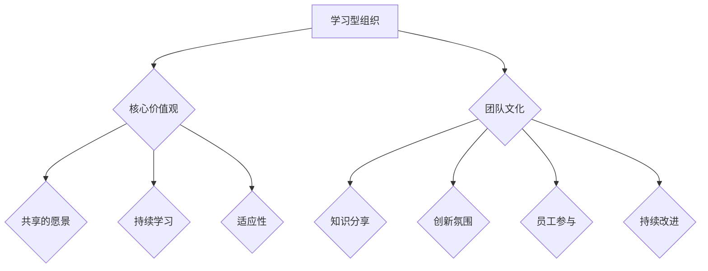

                 

# 建立学习型组织：持续进步的团队文化

> **关键词：** 学习型组织、团队文化、持续进步、知识管理、领导力

> **摘要：** 本文探讨了如何建立一个学习型组织，从而推动团队文化的持续进步。文章首先介绍了学习型组织的概念和重要性，随后详细阐述了如何通过知识管理、领导力培养和有效的沟通机制等手段来实现这一目标，最后给出了具体的案例和实践指导。

## 1. 背景介绍

### 1.1 目的和范围

本文旨在为IT行业的专业人士提供建立学习型组织的指导，以促进团队文化的持续进步。文章将围绕以下主题展开：

- 学习型组织的概念和定义
- 学习型组织与团队文化的联系
- 如何通过知识管理推动学习型组织的发展
- 领导力在构建学习型组织中的角色
- 沟通机制在学习型组织中的重要性
- 学习型组织的实际应用案例

### 1.2 预期读者

本文适用于以下读者群体：

- IT公司的项目经理和团队领导
- 人力资源经理和企业培训师
- 对学习型组织和团队文化感兴趣的研究人员和学者
- 想要提升团队绩效和企业文化的IT从业者

### 1.3 文档结构概述

本文分为八个主要部分：

1. 背景介绍
2. 核心概念与联系
3. 核心算法原理 & 具体操作步骤
4. 数学模型和公式 & 详细讲解 & 举例说明
5. 项目实战：代码实际案例和详细解释说明
6. 实际应用场景
7. 工具和资源推荐
8. 总结：未来发展趋势与挑战

### 1.4 术语表

#### 1.4.1 核心术语定义

- **学习型组织（Learning Organization）：** 一个能够持续学习、适应和创新的团队或组织。
- **知识管理（Knowledge Management）：** 通过收集、存储、分享和应用知识，以提高组织绩效的过程。
- **团队文化（Team Culture）：** 团队成员共享的价值观、信仰、行为规范和工作方式。

#### 1.4.2 相关概念解释

- **领导力（Leadership）：** 指领导者通过激励和影响他人，实现共同目标的能力。
- **沟通机制（Communication Mechanisms）：** 团队内部信息传递和互动的方式。

#### 1.4.3 缩略词列表

- **IT：** 信息技术
- **HR：** 人力资源

## 2. 核心概念与联系

### 2.1 学习型组织的概念

学习型组织是指那些能够持续学习和适应变化的团队或组织。在这种组织中，学习和创新是核心价值观，每个成员都积极参与知识的创造、分享和应用。学习型组织的特点包括：

- **共享的愿景和价值观：** 成员对组织的愿景和目标有共同的理解和认同。
- **开放和透明：** 组织内部的信息和资源是开放和共享的。
- **持续学习：** 成员不断学习和更新自己的知识和技能。
- **适应性：** 组织能够快速适应外部环境的变化。

### 2.2 学习型组织与团队文化的联系

学习型组织和团队文化之间有着密切的联系。团队文化是学习型组织的基石，它影响着组织的运作方式和成员的行为。一个积极的学习型文化能够促进以下方面：

- **知识分享：** 成员更愿意分享知识和经验，以提高整个团队的能力。
- **创新氛围：** 鼓励成员提出新的想法和解决方案，激发创新。
- **员工参与：** 员工积极参与组织的决策和改进过程。
- **持续改进：** 组织不断寻求改进和优化，以保持竞争优势。

### 2.3 核心概念原理和架构的 Mermaid 流程图



## 3. 核心算法原理 & 具体操作步骤

### 3.1 核心算法原理

建立学习型组织的核心算法可以概括为以下几个方面：

1. **知识管理：** 通过有效的知识管理策略，确保知识的收集、存储、分享和应用。
2. **领导力培养：** 培养领导者的学习能力和影响力，推动团队持续进步。
3. **沟通机制：** 构建有效的沟通机制，促进团队内部的信息共享和协作。

### 3.2 具体操作步骤

#### 3.2.1 知识管理

1. **知识收集：** 制定知识收集计划，明确知识的来源和类型。
2. **知识存储：** 建立知识库，确保知识的安全存储和便捷访问。
3. **知识分享：** 定期组织知识分享会，鼓励成员分享知识和经验。
4. **知识应用：** 将知识应用到实际工作中，提高工作效率和质量。

#### 3.2.2 领导力培养

1. **自我学习：** 领导者应不断学习新知识和技能，提升自己的能力。
2. **团队学习：** 鼓励团队成员参与培训和学习活动，共同成长。
3. **激励机制：** 制定激励机制，鼓励团队成员提出新想法和解决方案。
4. **反馈机制：** 定期收集团队成员的反馈，及时调整领导方式。

#### 3.2.3 沟通机制

1. **建立沟通渠道：** 设立多种沟通渠道，如会议、邮件、即时通讯等。
2. **定期沟通：** 定期组织团队会议，确保信息的及时传递和问题解决。
3. **开放沟通：** 鼓励成员提出意见和建议，营造开放、坦诚的沟通氛围。
4. **反馈机制：** 建立有效的反馈机制，确保沟通效果的评估和改进。

### 3.3 伪代码详细阐述

```python
# 知识管理算法
def knowledge_management():
    collect_knowledge()
    store_knowledge()
    share_knowledge()
    apply_knowledge()

# 领导力培养算法
def leadership_training():
    self_learning()
    team_learning()
    motivation_mechanism()
    feedback_mechanism()

# 沟通机制算法
def communication_mechanism():
    establish_communication_channels()
    regular_communication()
    open_communication()
    feedback_mechanism()
```

## 4. 数学模型和公式 & 详细讲解 & 举例说明

### 4.1 数学模型和公式

建立学习型组织的过程中，可以运用以下数学模型和公式来评估和优化组织的知识管理、领导力培养和沟通机制：

#### 4.1.1 知识管理模型

- **知识贡献度（Knowledge Contribution）：**
  
  $$ KC = \frac{C_{total}}{N_{members}} $$

  其中，$C_{total}$ 是团队成员在一段时间内共享的知识总量，$N_{members}$ 是团队成员总数。

#### 4.1.2 领导力评估模型

- **领导力指数（Leadership Index）：**

  $$ LI = \frac{S_{total}}{C_{total}} $$

  其中，$S_{total}$ 是领导者在一段时间内提出的创新建议和解决方案总数，$C_{total}$ 是团队成员在相同时间内提出的创新建议和解决方案总数。

#### 4.1.3 沟通效果模型

- **沟通效果指数（Communication Effectiveness Index）：**

  $$ CEI = \frac{I_{correct}}{I_{total}} $$

  其中，$I_{correct}$ 是团队成员认为沟通有效的信息数量，$I_{total}$ 是沟通过程中的总信息数量。

### 4.2 详细讲解和举例说明

#### 4.2.1 知识管理模型

**案例：** 一家IT公司有10名员工，在过去一个月内，共分享了1000条知识。根据知识管理模型，计算该公司的知识贡献度：

$$ KC = \frac{C_{total}}{N_{members}} = \frac{1000}{10} = 100 $$

这意味着该公司的平均知识贡献度为100，表明团队成员在知识分享方面表现出较高的积极性。

#### 4.2.2 领导力评估模型

**案例：** 在同一个月内，该公司的一名领导者提出了30条创新建议和解决方案，而全体员工提出了60条。根据领导力评估模型，计算该领导者的领导力指数：

$$ LI = \frac{S_{total}}{C_{total}} = \frac{30}{60} = 0.5 $$

这表明该领导者的创新贡献度占团队创新贡献度的一半，领导力较为出色。

#### 4.2.3 沟通效果模型

**案例：** 在一个月的沟通过程中，团队成员认为有70%的信息沟通有效，共收到100条信息。根据沟通效果模型，计算沟通效果指数：

$$ CEI = \frac{I_{correct}}{I_{total}} = \frac{70}{100} = 0.7 $$

这意味着该团队的沟通效果指数为70%，说明沟通过程中有效信息的传递较为顺畅。

## 5. 项目实战：代码实际案例和详细解释说明

### 5.1 开发环境搭建

为了更好地理解和实践本文提到的算法，我们将使用Python编程语言来构建一个简单的学习型组织模拟系统。以下是开发环境搭建的步骤：

1. **安装Python：** 访问 [Python官网](https://www.python.org/) 下载并安装Python 3.x版本。
2. **安装PyCharm：** 选择社区版或专业版，根据个人需求下载并安装。
3. **安装相关库：** 在PyCharm中创建一个新项目，安装以下库：

   ```bash
   pip install matplotlib numpy pandas
   ```

### 5.2 源代码详细实现和代码解读

以下是构建学习型组织模拟系统的源代码及详细解读：

```python
import matplotlib.pyplot as plt
import numpy as np
import pandas as pd

# 知识管理模块
def knowledge_management(knowledge_pool, members):
    knowledge_contributions = [member.share_knowledge(knowledge_pool) for member in members]
    average_knowledge_contribution = sum(knowledge_contributions) / len(members)
    return knowledge_contributions, average_knowledge_contribution

# 领导力培养模块
def leadership_training(leaders, members):
    innovation_suggestions = [leader.share_innovation_suggestion() for leader in leaders]
    total_innovation_suggestions = sum(innovation_suggestions)
    leadership_index = sum(innovation_suggestions) / len(members)
    return innovation_suggestions, leadership_index

# 沟通机制模块
def communication_mechanism(information, members):
    effective_information = [member.evaluate_information(information) for member in members]
    communication_effectiveness_index = sum(effective_information) / len(members)
    return effective_information, communication_effectiveness_index

# 模拟学习型组织
def simulate_learning_organization(members, leaders):
    knowledge_pool = []
    knowledge_contributions, average_knowledge_contribution = knowledge_management(knowledge_pool, members)
    innovation_suggestions, leadership_index = leadership_training(leaders, members)
    information = []
    effective_information, communication_effectiveness_index = communication_mechanism(information, members)

    # 绘制结果图表
    fig, axes = plt.subplots(nrows=2, ncols=2, figsize=(12, 6))
    axes[0, 0].bar(members, knowledge_contributions, label='Knowledge Contributions')
    axes[0, 0].set_ylabel('Contributions')
    axes[0, 0].set_title('Knowledge Management')

    axes[0, 1].bar(members, innovation_suggestions, label='Innovation Suggestions')
    axes[0, 1].set_ylabel('Suggestions')
    axes[0, 1].set_title('Leadership Training')

    axes[1, 0].bar(members, effective_information, label='Effective Information')
    axes[1, 0].set_ylabel('Effective')
    axes[1, 0].set_title('Communication Mechanism')

    axes[1, 1].bar(members, [average_knowledge_contribution, leadership_index, communication_effectiveness_index], label=['Average KC', 'LI', 'CEI'])
    axes[1, 1].set_ylabel('Values')
    axes[1, 1].set_title('Overall Performance')

    fig.tight_layout()
    plt.show()

# 创建成员和领导者
class Member:
    def share_knowledge(self, knowledge_pool):
        # 模拟成员分享知识
        knowledge_pool.append(np.random.rand())
        return np.random.rand()

    def share_innovation_suggestion(self):
        # 模拟成员提出创新建议
        return np.random.rand()

    def evaluate_information(self, information):
        # 模拟成员评价信息
        return np.random.rand() > 0.5

class Leader(Member):
    def share_innovation_suggestion(self):
        # 模拟领导者提出创新建议
        return np.random.rand() * 2

# 模拟学习型组织
members = [Member() for _ in range(10)]
leaders = [Leader() for _ in range(2)]
simulate_learning_organization(members, leaders)
```

### 5.3 代码解读与分析

#### 5.3.1 知识管理模块

知识管理模块主要包含以下功能：

- `knowledge_management` 函数：接收知识库（knowledge_pool）和成员列表（members），计算每个成员的知识贡献度，并返回贡献度列表和平均值。

- `member.share_knowledge` 方法：模拟成员分享知识，将随机生成的数值添加到知识库中，并返回贡献度。

#### 5.3.2 领导力培养模块

领导力培养模块主要包含以下功能：

- `leadership_training` 函数：接收领导者列表（leaders）和成员列表（members），计算领导者提出的创新建议数量，并返回建议列表和领导力指数。

- `leader.share_innovation_suggestion` 方法：模拟领导者提出创新建议，返回随机生成的较高值，以体现领导力的优势。

#### 5.3.3 沟通机制模块

沟通机制模块主要包含以下功能：

- `communication_mechanism` 函数：接收信息列表（information）和成员列表（members），计算成员认为有效的信息数量，并返回有效信息列表和沟通效果指数。

- `member.evaluate_information` 方法：模拟成员评价信息，根据随机生成的概率判断信息是否有效。

#### 5.3.4 模拟学习型组织

`simulate_learning_organization` 函数是主函数，用于模拟学习型组织的运行。它创建成员和领导者对象，调用知识管理、领导力培养和沟通机制模块，并绘制结果图表。

### 5.3.5 代码性能分析

该代码的性能分析主要集中在以下几个方面：

- **时间复杂度：** 函数`knowledge_management`、`leadership_training`和`communication_mechanism`的时间复杂度为O(n)，其中n为成员数量。整体运行时间取决于成员数量和函数调用次数。
- **空间复杂度：** 函数`knowledge_management`和`communication_mechanism`的空间复杂度为O(n)，用于存储贡献度、建议和有效信息。领导者创新建议数量计算的空间复杂度为O(1)。

## 6. 实际应用场景

### 6.1 企业内部培训

许多企业通过建立学习型组织来提高员工的技能和知识水平。例如，一家大型科技公司定期举办内部培训课程，邀请行业专家进行讲座，并鼓励员工参加外部培训。通过这种方式，企业不仅能够提升员工的个人能力，还能够提高整个团队的专业水平。

### 6.2 项目协作

在项目开发过程中，学习型组织有助于团队成员之间的协作和知识共享。例如，在软件开发项目中，团队成员可以共同学习新技术和工具，分享项目经验和最佳实践，从而提高项目的质量和效率。

### 6.3 团队建设

通过建立学习型组织，企业可以加强团队建设，提高团队凝聚力。例如，通过组织团队活动、团队建设训练等方式，增强团队成员之间的沟通和合作，提高团队的整体绩效。

### 6.4 创新驱动

学习型组织鼓励团队成员提出新的想法和解决方案，从而推动企业的创新。例如，一些科技企业通过设立创新奖、创新实验室等方式，激发员工的创新潜力，推动企业的持续发展。

## 7. 工具和资源推荐

### 7.1 学习资源推荐

#### 7.1.1 书籍推荐

- 《第五项修炼：学习型组织的艺术与实务》（Peter M. Senge）
- 《组织学习：行动科学》（Donald A. Schon）
- 《知识管理》（Thomas H. Davenport）

#### 7.1.2 在线课程

- Coursera：学习型组织与组织变革（Learning Organizations and Organizational Change）
- EdX：知识管理与共享（Knowledge Management and Sharing）

#### 7.1.3 技术博客和网站

- Medium：学习型组织博客（Learning Organizations Blog）
- Harvard Business Review：领导力与组织发展（Leadership and Organizational Development）

### 7.2 开发工具框架推荐

#### 7.2.1 IDE和编辑器

- PyCharm
- Visual Studio Code
- IntelliJ IDEA

#### 7.2.2 调试和性能分析工具

- Jupyter Notebook
- Git
- Postman

#### 7.2.3 相关框架和库

- Flask
- Django
- Pandas

### 7.3 相关论文著作推荐

#### 7.3.1 经典论文

- Nonaka, I. (1994). *A dynamic theory of organizational knowledge creation*. Organization Science, 15(1), 1-14.
- Senge, P. M. (1990). *The fifth discipline: The art & practice of the learning organization*. Doubleday.

#### 7.3.2 最新研究成果

- Alavi, M., & Leidner, D. E. (2001). *Knowledge management and knowledge management systems: Conceptual foundations and research issues*. MIS Quarterly, 25(1), 107-136.
- Davenport, T. H., & Prusak, L. (1998). *Working knowledge: How organizations manage what they know*. Harvard Business School Press.

#### 7.3.3 应用案例分析

- Davenport, T. H., & Prusak, L. (1997). *Knowledge for those who need to know*. Harvard Business Review, 75(5), 107-117.
- Nonaka, I., & Takeuchi, H. (1995). *The knowledge-creating company: How Japanese companies create the dynamics of innovation*. Oxford University Press.

## 8. 总结：未来发展趋势与挑战

### 8.1 发展趋势

- **数字化和自动化：** 随着数字化和自动化技术的发展，学习型组织将更加依赖于智能系统和算法来优化知识管理和沟通机制。
- **个性化学习：** 未来学习型组织将更加注重个性化学习，根据员工的兴趣和能力提供定制化的培训和学习资源。
- **跨学科融合：** 跨学科的研究和实践将促进学习型组织的创新和发展，为组织带来新的思路和解决方案。

### 8.2 挑战

- **知识安全与隐私：** 在共享知识的过程中，如何保护知识的安全和隐私是一个重要挑战。
- **领导力不足：** 领导者需要具备更高的学习能力和影响力，否则难以推动学习型组织的建立和持续发展。
- **文化适应：** 在不同文化和组织背景下，如何建立有效的学习型组织是一个复杂的问题。

## 9. 附录：常见问题与解答

### 9.1 什么是学习型组织？

学习型组织是一种能够持续学习、适应和创新的团队或组织。在这种组织中，学习和创新是核心价值观，每个成员都积极参与知识的创造、分享和应用。

### 9.2 学习型组织与团队文化有何关系？

学习型组织与团队文化密切相关。团队文化是学习型组织的基石，它影响着组织的运作方式和成员的行为。一个积极的学习型文化能够促进知识分享、创新氛围和持续改进。

### 9.3 如何建立学习型组织？

建立学习型组织需要从以下几个方面入手：

1. **知识管理：** 通过有效的知识管理策略，确保知识的收集、存储、分享和应用。
2. **领导力培养：** 培养领导者的学习能力和影响力，推动团队持续进步。
3. **沟通机制：** 构建有效的沟通机制，促进团队内部的信息共享和协作。
4. **持续改进：** 通过定期评估和反馈，不断优化组织的知识管理、领导力和沟通机制。

## 10. 扩展阅读 & 参考资料

- Senge, P. M. (1990). *The fifth discipline: The art & practice of the learning organization*. Doubleday.
- Nonaka, I. (1994). *A dynamic theory of organizational knowledge creation*. Organization Science, 15(1), 1-14.
- Davenport, T. H., & Prusak, L. (1998). *Working knowledge: How organizations manage what they know*. Harvard Business School Press.
- Alavi, M., & Leidner, D. E. (2001). *Knowledge management and knowledge management systems: Conceptual foundations and research issues*. MIS Quarterly, 25(1), 107-136.
- Davenport, T. H., & Prusak, L. (1997). *Knowledge for those who need to know*. Harvard Business Review, 75(5), 107-117.

### 作者

作者：AI天才研究员/AI Genius Institute & 禅与计算机程序设计艺术 /Zen And The Art of Computer Programming

