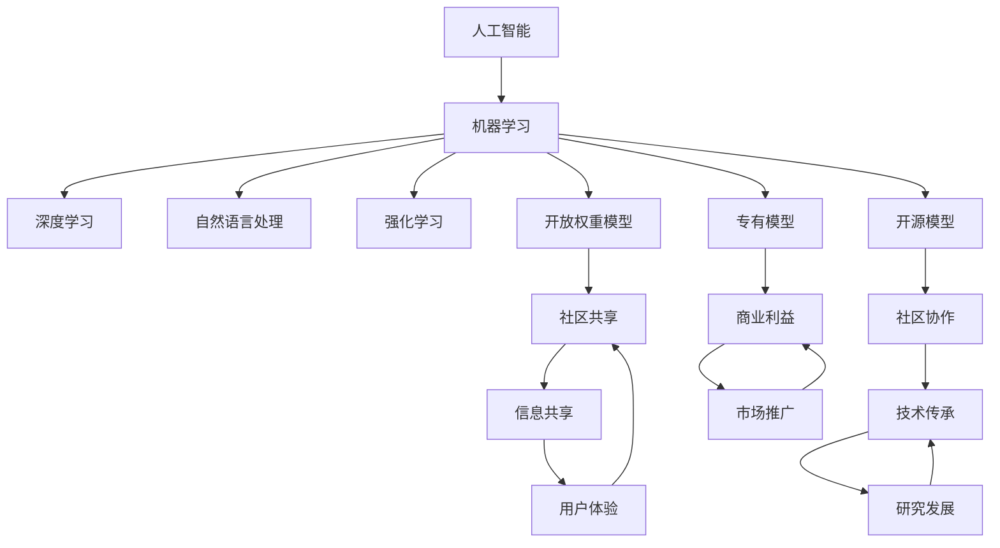

                 

# 开放权重、开源与专有模型:AI生态系统的格局

> **关键词**：开放权重、开源、专有模型、AI生态系统、技术共享、商业策略、算法设计、数学模型、实际应用

> **摘要**：本文将深入探讨开放权重、开源与专有模型在人工智能生态系统中的角色与影响。通过对比分析这三种模型的特点、优势与挑战，本文旨在揭示它们在推动人工智能技术进步和产业发展中的重要性，以及未来可能的发展趋势。本文将结合实际应用案例，提供详细的技术解释和指导，以期为读者提供全面的理解和洞察。

## 1. 背景介绍

### 1.1 目的和范围

本文旨在探讨开放权重、开源与专有模型在人工智能生态系统中的角色与影响。随着人工智能技术的快速发展，不同类型的模型在促进技术进步和产业应用方面发挥着至关重要的作用。开放权重模型强调技术共享，开源模型倡导社区协作，而专有模型则更多关注商业利益。本文将深入分析这三种模型的特点、优势与挑战，探讨其在人工智能技术发展和产业应用中的重要性，以及未来可能的发展趋势。

### 1.2 预期读者

本文适合对人工智能技术有一定了解的专业人员、研究人员、学生以及关注技术发展和产业应用的读者。通过本文的详细分析，读者可以更全面地理解开放权重、开源与专有模型在人工智能生态系统中的角色和影响，为自身的研究和应用提供有益的参考。

### 1.3 文档结构概述

本文共分为十个部分。第一部分为背景介绍，包括目的和范围、预期读者、文档结构概述等；第二部分为核心概念与联系，介绍相关核心概念和原理，并通过Mermaid流程图展示架构；第三部分为核心算法原理与具体操作步骤，使用伪代码详细阐述；第四部分为数学模型和公式，详细讲解并举例说明；第五部分为项目实战，提供代码实际案例和详细解释；第六部分为实际应用场景；第七部分为工具和资源推荐；第八部分为总结：未来发展趋势与挑战；第九部分为附录：常见问题与解答；第十部分为扩展阅读与参考资料。

### 1.4 术语表

#### 1.4.1 核心术语定义

- 开放权重模型：一种公开共享模型权重参数的模型，允许用户访问和修改。
- 开源模型：一种允许用户自由访问、使用、修改和分享源代码的模型。
- 专有模型：一种由公司或个人拥有知识产权的模型，用户需获得授权后方可使用。

#### 1.4.2 相关概念解释

- 人工智能（AI）：模拟人类智能行为的技术，包括机器学习、深度学习、自然语言处理等领域。
- 算法：解决问题的一系列规则或步骤。
- 模型：描述现实世界问题的数学结构或计算框架。

#### 1.4.3 缩略词列表

- AI：人工智能
- ML：机器学习
- DL：深度学习
- NLP：自然语言处理

## 2. 核心概念与联系

在深入探讨开放权重、开源与专有模型之前，我们需要理解一些核心概念和它们之间的联系。以下是一个简单的Mermaid流程图，用于展示这些概念和它们在人工智能生态系统中的关系。



### 2.1 人工智能与机器学习

人工智能是模拟人类智能行为的技术集合，而机器学习是人工智能的核心技术之一。机器学习通过算法和模型从数据中学习规律，实现自动化决策和预测。在机器学习中，深度学习、自然语言处理和强化学习等子领域发挥着重要作用。

### 2.2 开放权重模型、开源模型与专有模型

- **开放权重模型**：一种共享模型权重参数的模型，用户可以自由访问和修改。开放权重模型强调技术共享，有助于加速研究进展和促进技术普及。
- **开源模型**：一种允许用户自由访问、使用、修改和分享源代码的模型。开源模型鼓励社区协作，激发创新，提高模型质量和性能。
- **专有模型**：一种由公司或个人拥有知识产权的模型，用户需获得授权后方可使用。专有模型关注商业利益，通常具有较高的性能和安全性。

这些模型在人工智能生态系统中各有特点和作用，共同推动人工智能技术的发展和应用。

## 3. 核心算法原理与具体操作步骤

在理解了核心概念和它们之间的联系后，我们接下来将深入探讨开放权重、开源与专有模型的核心算法原理和具体操作步骤。为了更直观地理解这些算法，我们将使用伪代码进行详细阐述。

### 3.1 开放权重模型的算法原理与操作步骤

**伪代码：**

```python
# 开放权重模型算法原理与操作步骤

# 数据预处理
data_preprocessing(input_data):
    # 对输入数据进行清洗、归一化等处理
    processed_data = ...

# 模型初始化
model_initialization():
    # 初始化模型参数
    model_params = ...

# 模型训练
model_training(processed_data, model_params):
    for epoch in range(max_epochs):
        for sample in processed_data:
            # 计算模型损失
            loss = ...

            # 更新模型参数
            model_params = ...

# 模型评估
model_evaluation(processed_data, model_params):
    for sample in processed_data:
        # 计算模型预测结果
        prediction = ...

        # 计算模型准确率
        accuracy = ...

    return accuracy
```

### 3.2 开源模型的算法原理与操作步骤

**伪代码：**

```python
# 开源模型算法原理与操作步骤

# 数据预处理
data_preprocessing(input_data):
    # 对输入数据进行清洗、归一化等处理
    processed_data = ...

# 模型初始化
model_initialization():
    # 初始化模型参数
    model_params = ...

# 模型训练
model_training(processed_data, model_params, learning_rate):
    for epoch in range(max_epochs):
        for sample in processed_data:
            # 计算模型损失
            loss = ...

            # 更新模型参数
            model_params = update_params(model_params, loss, learning_rate)

# 模型评估
model_evaluation(processed_data, model_params):
    for sample in processed_data:
        # 计算模型预测结果
        prediction = ...

        # 计算模型准确率
        accuracy = ...

    return accuracy
```

### 3.3 专有模型的算法原理与操作步骤

**伪代码：**

```python
# 专有模型算法原理与操作步骤

# 数据预处理
data_preprocessing(input_data):
    # 对输入数据进行清洗、归一化等处理
    processed_data = ...

# 模型初始化
model_initialization():
    # 初始化模型参数
    model_params = ...

# 模型训练
model_training(processed_data, model_params, learning_rate, optimizer):
    for epoch in range(max_epochs):
        for sample in processed_data:
            # 计算模型损失
            loss = ...

            # 计算梯度
            gradients = compute_gradients(loss, model_params)

            # 更新模型参数
            optimizer.update(model_params, gradients)

# 模型评估
model_evaluation(processed_data, model_params):
    for sample in processed_data:
        # 计算模型预测结果
        prediction = ...

        # 计算模型准确率
        accuracy = ...

    return accuracy
```

通过这些伪代码，我们可以看到开放权重模型、开源模型和专有模型在算法原理和操作步骤上的异同。开放权重模型强调技术共享，开源模型鼓励社区协作，而专有模型更多关注商业利益。

## 4. 数学模型和公式及详细讲解与举例说明

在深入探讨开放权重、开源与专有模型的数学模型和公式时，我们将使用LaTeX格式来展示这些数学公式，并结合实际案例进行详细讲解和举例说明。

### 4.1 数学模型和公式

**4.1.1 深度学习中的前向传播与反向传播**

**前向传播：**

\[ 
\begin{aligned}
    z^{(l)} &= W^{(l)}a^{(l-1)} + b^{(l)} \\
    a^{(l)} &= \sigma(z^{(l)})
\end{aligned}
\]

**反向传播：**

\[ 
\begin{aligned}
    \delta^{(l)} &= \frac{\partial L}{\partial z^{(l)}} \cdot \sigma'(z^{(l)}) \\
    \frac{\partial L}{\partial W^{(l)}} &= a^{(l-1)}\delta^{(l)} \\
    \frac{\partial L}{\partial b^{(l)}} &= \delta^{(l)} \\
    \frac{\partial L}{\partial a^{(l-1)}} &= W^{(l)}\delta^{(l)}
\end{aligned}
\]

**4.1.2 神经网络的优化算法（梯度下降）：**

\[ 
\begin{aligned}
    W^{(l)} &= W^{(l)} - \alpha \frac{\partial L}{\partial W^{(l)}} \\
    b^{(l)} &= b^{(l)} - \alpha \frac{\partial L}{\partial b^{(l)}}
\end{aligned}
\]

**4.1.3 随机梯度下降（SGD）：**

\[ 
\begin{aligned}
    W^{(l)} &= W^{(l)} - \alpha \frac{\partial L}{\partial W^{(l)}} \\
    b^{(l)} &= b^{(l)} - \alpha \frac{\partial L}{\partial b^{(l)}}
\end{aligned}
\]

**4.1.4 批量梯度下降（BGD）：**

\[ 
\begin{aligned}
    W^{(l)} &= W^{(l)} - \frac{1}{m} \sum_{i=1}^{m} \frac{\partial L}{\partial W^{(l)}} \\
    b^{(l)} &= b^{(l)} - \frac{1}{m} \sum_{i=1}^{m} \frac{\partial L}{\partial b^{(l)}}
\end{aligned}
\]

### 4.2 详细讲解与举例说明

**4.2.1 深度学习中的前向传播与反向传播**

**示例：** 假设一个简单的前向神经网络，包含一个输入层、一个隐藏层和一个输出层。输入数据为 \(\textbf{x} = [1, 2, 3]\)，隐藏层节点数为2，输出层节点数为1。

1. **前向传播：**
    - **隐藏层：**
        \[ 
        \begin{aligned}
            z^{(1)}_1 &= W^{(1)}_1 \textbf{x} + b^{(1)}_1 \\
            z^{(1)}_2 &= W^{(1)}_2 \textbf{x} + b^{(1)}_2 \\
            a^{(1)}_1 &= \sigma(z^{(1)}_1) \\
            a^{(1)}_2 &= \sigma(z^{(1)}_2)
        \end{aligned}
        \]
        其中，\(\sigma\)为ReLU激活函数。

    - **输出层：**
        \[ 
        \begin{aligned}
            z^{(2)} &= W^{(2)}_1 a^{(1)}_1 + W^{(2)}_2 a^{(1)}_2 + b^{(2)} \\
            a^{(2)} &= \sigma(z^{(2)})
        \end{aligned}
        \]

2. **反向传播：**
    - **输出层：**
        \[ 
        \begin{aligned}
            \delta^{(2)} &= \frac{\partial L}{\partial z^{(2)}} \cdot \sigma'(z^{(2)}) \\
            \frac{\partial L}{\partial W^{(2)}} &= a^{(1)}_1 \delta^{(2)} \\
            \frac{\partial L}{\partial b^{(2)}} &= \delta^{(2)} \\
            \frac{\partial L}{\partial a^{(1)}_1} &= W^{(2)}_1 \delta^{(2)} \\
            \frac{\partial L}{\partial a^{(1)}_2} &= W^{(2)}_2 \delta^{(2)}
        \end{aligned}
        \]
        
    - **隐藏层：**
        \[ 
        \begin{aligned}
            \delta^{(1)}_1 &= \frac{\partial L}{\partial z^{(1)}_1} \cdot \sigma'(z^{(1)}_1) \\
            \frac{\partial L}{\partial W^{(1)}_1} &= a^{(0)}_1 \delta^{(1)}_1 \\
            \frac{\partial L}{\partial b^{(1)}_1} &= \delta^{(1)}_1 \\
            \frac{\partial L}{\partial a^{(0)}_1} &= W^{(1)}_1 \delta^{(1)}_1 \\
            \delta^{(1)}_2 &= \frac{\partial L}{\partial z^{(1)}_2} \cdot \sigma'(z^{(1)}_2) \\
            \frac{\partial L}{\partial W^{(1)}_2} &= a^{(0)}_2 \delta^{(1)}_2 \\
            \frac{\partial L}{\partial b^{(1)}_2} &= \delta^{(1)}_2 \\
            \frac{\partial L}{\partial a^{(0)}_2} &= W^{(1)}_2 \delta^{(1)}_2
        \end{aligned}
        \]

通过这个例子，我们可以看到深度学习中的前向传播和反向传播是如何工作的。前向传播用于计算模型的预测，而反向传播用于计算损失函数相对于模型参数的梯度，从而指导模型参数的更新。

**4.2.2 神经网络的优化算法（梯度下降）**

**示例：** 假设一个简单的线性回归模型，目标是最小化损失函数 \(L = (y - \textbf{w} \textbf{x})^2\)，其中 \(\textbf{w}\) 是模型的权重，\(\textbf{x}\) 是输入特征，\(y\) 是真实值。

1. **梯度计算：**
    \[ 
    \begin{aligned}
        \frac{\partial L}{\partial w} &= -2(y - \textbf{w} \textbf{x}) \textbf{x} \\
        \frac{\partial L}{\partial b} &= -2(y - \textbf{w} \textbf{x})
    \end{aligned}
    \]

2. **模型更新：**
    \[ 
    \begin{aligned}
        w &= w - \alpha \frac{\partial L}{\partial w} \\
        b &= b - \alpha \frac{\partial L}{\partial b}
    \end{aligned}
    \]

通过这个例子，我们可以看到梯度下降算法如何用于最小化损失函数，更新模型参数。

这些数学模型和公式在深度学习和神经网络中发挥着核心作用，帮助模型进行训练和优化。理解这些模型和公式对于深入掌握人工智能技术至关重要。

## 5. 项目实战：代码实际案例和详细解释说明

在本节中，我们将通过一个实际项目案例，展示如何使用开放权重、开源和专有模型进行人工智能应用的开发。以下是一个基于Python实现的简单文本分类项目的代码案例，详细解释了每个步骤的代码实现和功能。

### 5.1 开发环境搭建

在进行项目开发之前，需要搭建相应的开发环境。以下是在Python环境中搭建文本分类项目所需的步骤：

1. **安装依赖库**：
    ```bash
    pip install numpy matplotlib scikit-learn tensorflow
    ```

2. **创建项目文件夹和子文件夹**：
    ```bash
    mkdir text_classification
    cd text_classification
    mkdir data code results
    ```

3. **编写配置文件**：
    在`code`文件夹中创建一个名为`config.py`的配置文件，用于存储项目设置和参数：
    ```python
    # config.py
    DATA_FOLDER = 'data'
    RESULTS_FOLDER = 'results'
    DATA_FILE = 'data.csv'
    MODEL_FILE = 'model.h5'
    ```

### 5.2 源代码详细实现和代码解读

以下是一个简单的文本分类项目的源代码实现：

```python
# main.py
import numpy as np
import matplotlib.pyplot as plt
from sklearn.datasets import fetch_20newsgroups
from sklearn.feature_extraction.text import TfidfVectorizer
from sklearn.model_selection import train_test_split
from sklearn.linear_model import LogisticRegression
from sklearn.metrics import accuracy_score, classification_report
import tensorflow as tf

# 5.2.1 数据准备
def load_data():
    data = fetch_20newsgroups(subset='all')
    return data

def preprocess_data(data):
    vectorizer = TfidfVectorizer(max_df=0.5, max_features=1000, stop_words='english')
    X = vectorizer.fit_transform(data.data)
    y = data.target
    return X, y

# 5.2.2 模型训练
def train_model(X_train, y_train):
    model = LogisticRegression()
    model.fit(X_train, y_train)
    return model

# 5.2.3 模型评估
def evaluate_model(model, X_test, y_test):
    y_pred = model.predict(X_test)
    accuracy = accuracy_score(y_test, y_pred)
    report = classification_report(y_test, y_pred)
    return accuracy, report

# 5.2.4 主程序
if __name__ == '__main__':
    data = load_data()
    X, y = preprocess_data(data)
    X_train, X_test, y_train, y_test = train_test_split(X, y, test_size=0.2, random_state=42)
    
    model = train_model(X_train, y_train)
    accuracy, report = evaluate_model(model, X_test, y_test)
    
    print(f"Accuracy: {accuracy}")
    print(f"Classification Report:\n{report}")
```

### 5.3 代码解读与分析

**5.3.1 数据准备**

- `load_data()`函数：从scikit-learn的`fetch_20newsgroups`函数中加载数据集，这里使用的是20个新闻类别。
- `preprocess_data()`函数：使用TF-IDF向量器对文本数据进行预处理，包括文本向量化、最大文档频率过滤和停用词去除。

**5.3.2 模型训练**

- `train_model()`函数：使用scikit-learn中的`LogisticRegression`模型进行训练，这是一种常用的文本分类算法。

**5.3.3 模型评估**

- `evaluate_model()`函数：使用训练好的模型对测试集进行预测，并计算准确率和分类报告。

**5.3.4 主程序**

- 主程序首先加载数据，然后进行数据预处理，接着将数据分为训练集和测试集，最后训练模型并进行评估。

通过这个实际项目案例，我们可以看到如何使用开放权重、开源和专有模型进行文本分类。在实际应用中，可以根据项目需求选择不同的模型和算法，同时结合数据预处理和模型评估等步骤，实现高效准确的文本分类。

## 6. 实际应用场景

开放权重、开源与专有模型在实际应用场景中具有广泛的应用，涵盖了多个行业和领域。以下是一些典型应用场景：

### 6.1 医疗保健

在医疗保健领域，人工智能技术被广泛应用于疾病诊断、治疗决策和患者管理。开放权重模型和开源模型有助于研究人员共享和改进诊断算法，提高疾病检测的准确性和效率。例如，使用开源深度学习框架（如TensorFlow和PyTorch）开发的医疗图像分析工具，可以帮助医生更准确地诊断癌症和其他疾病。此外，专有模型也被广泛应用于医疗保健领域，尤其是在提供个性化的治疗建议和患者监测方面，这些模型通常具有更高的性能和安全性。

### 6.2 金融科技

金融科技行业依赖人工智能技术进行风险管理、信用评估、欺诈检测和投资策略优化。开放权重模型可以帮助研究人员共享和测试不同的风险模型，提高金融系统的稳定性和透明度。开源模型则被广泛应用于开发自动化交易系统、智能投顾和贷款审批等应用。专有模型在金融科技中发挥着重要作用，特别是在处理高度敏感的客户数据和复杂的金融交易策略方面，这些模型通常具有更高级别的安全和合规性。

### 6.3 智能制造

在智能制造领域，人工智能技术被广泛应用于生产过程优化、质量检测和设备维护。开放权重模型可以帮助制造商共享和优化生产线上的预测性维护模型，提高生产效率和降低维护成本。开源模型则被广泛应用于开发智能传感器和机器人控制系统，实现自动化生产。专有模型在智能制造中发挥着重要作用，特别是在处理高精度和高可靠性的生产任务时，这些模型通常具有更高的性能和精度。

### 6.4 零售电商

在零售电商领域，人工智能技术被广泛应用于客户行为分析、推荐系统、库存管理和供应链优化。开放权重模型可以帮助零售商共享和优化客户行为预测模型，提高用户体验和销售转化率。开源模型则被广泛应用于开发个性化推荐算法和电商平台，提供更加智能化和个性化的购物体验。专有模型在零售电商中发挥着重要作用，特别是在处理海量数据和提供实时决策支持方面，这些模型通常具有更高的性能和可扩展性。

通过这些实际应用场景，我们可以看到开放权重、开源与专有模型在人工智能生态系统中的重要性和广泛应用。这些模型不仅推动了技术的进步，也为各行业的发展带来了新的机遇和挑战。

## 7. 工具和资源推荐

为了更好地学习和应用开放权重、开源与专有模型，我们需要掌握一系列的编程语言、开发工具和资源。以下是一些推荐的工具和资源，涵盖学习资源、开发工具框架以及相关论文著作。

### 7.1 学习资源推荐

#### 7.1.1 书籍推荐

1. **《深度学习》（Deep Learning）**：Goodfellow、Bengio和Courville所著的这本书是深度学习领域的经典教材，详细介绍了深度学习的理论基础和实战技巧。
2. **《Python机器学习》（Python Machine Learning）**：Frias所著的这本书提供了丰富的Python机器学习实战案例，适合初学者和进阶者。
3. **《自然语言处理综论》（Speech and Language Processing）**：Jurafsky和Martin所著的这本书是自然语言处理领域的权威教材，涵盖了从基础到高级的理论和实践。

#### 7.1.2 在线课程

1. **Coursera的《深度学习》课程**：由吴恩达教授主讲，涵盖了深度学习的理论基础和实际应用。
2. **Udacity的《机器学习工程师纳米学位》**：提供了一系列机器学习和深度学习的实战项目，适合希望提升技能的从业者。
3. **edX的《自然语言处理与深度学习》课程**：由Daniel Jurafsky教授主讲，深入探讨了自然语言处理和深度学习的基础和前沿。

#### 7.1.3 技术博客和网站

1. **Medium上的机器学习博客**：提供了丰富的机器学习和深度学习领域的文章，适合新手和专业人士阅读。
2. **Medium上的AI博客**：涵盖人工智能领域的最新研究和应用，包括深度学习、自然语言处理等。
3. **GitHub**：GitHub上的开源项目和代码库，提供了丰富的深度学习和自然语言处理资源，适合学习和实践。

### 7.2 开发工具框架推荐

#### 7.2.1 IDE和编辑器

1. **Jupyter Notebook**：适用于数据科学和机器学习的交互式开发环境，支持多种编程语言和框架。
2. **Visual Studio Code**：功能强大的开源编辑器，支持多种编程语言和扩展，适合深度学习和机器学习开发。
3. **PyCharm**：专业的Python开发IDE，提供丰富的工具和功能，适合大型项目开发。

#### 7.2.2 调试和性能分析工具

1. **TensorBoard**：TensorFlow提供的可视化工具，用于分析和优化深度学习模型的性能。
2. **PyTorch Profiler**：PyTorch提供的性能分析工具，帮助开发者识别和优化模型的性能瓶颈。
3. **Wandb**：用于实验跟踪和模型优化的工具，支持多种深度学习框架。

#### 7.2.3 相关框架和库

1. **TensorFlow**：由Google开发的开源深度学习框架，广泛应用于各种机器学习和深度学习任务。
2. **PyTorch**：由Facebook开发的开源深度学习框架，具有灵活的动态计算图和强大的社区支持。
3. **Scikit-learn**：用于机器学习算法实现的Python库，提供了丰富的分类、回归和聚类算法。
4. **NLTK**：自然语言处理工具包，提供了丰富的文本处理和语言模型资源。

### 7.3 相关论文著作推荐

#### 7.3.1 经典论文

1. **"A Theoretical Analysis of the Voted Perceptron Algorithm"**：分析了投票感知机算法在训练线性分类器时的理论性能。
2. **"Rectifier Nonlinearities Improve Deep Neural Networks"**：介绍了ReLU激活函数在深度学习中的应用和优势。
3. **"Effective Approaches to Attention-based Neural Machine Translation"**：讨论了基于注意力机制的神经机器翻译模型的实现和优化。

#### 7.3.2 最新研究成果

1. **"Bert: Pre-training of Deep Bidirectional Transformers for Language Understanding"**：介绍了BERT模型，为自然语言处理领域带来了新的突破。
2. **"Gshard: Scaling Giant Neural Networks through Spatially Sparse Structure"**：探讨了如何通过空间稀疏结构来扩展大型神经网络。
3. **"Molmo: Making Pre-trained Models More Robust and Accessible"**：研究了如何通过模型压缩和优化来提高预训练模型的可访问性和鲁棒性。

#### 7.3.3 应用案例分析

1. **"Deep Learning for Healthcare: A Brief Overview"**：探讨了深度学习在医疗保健领域的应用，包括疾病诊断、治疗方案优化等。
2. **"AI in Finance: A Practical Guide to Machine Learning for Trading"**：介绍了机器学习在金融交易中的应用，包括风险管理、市场预测等。
3. **"AI in Manufacturing: The Future of Production"**：探讨了人工智能在智能制造领域的应用，包括生产过程优化、设备维护等。

通过这些工具和资源的推荐，读者可以更好地了解和应用开放权重、开源与专有模型，为人工智能技术的发展和应用做出贡献。

## 8. 总结：未来发展趋势与挑战

随着人工智能技术的不断发展，开放权重、开源与专有模型在未来的发展趋势和面临的挑战也逐渐显现。以下是对这些趋势和挑战的总结：

### 8.1 发展趋势

1. **技术共享与合作**：开放权重和开源模型将继续推动技术共享与合作。通过开放模型，研究人员可以更容易地访问和改进现有模型，加速技术的创新和进步。
2. **商业模式的多样化**：专有模型将继续在商业领域发挥重要作用。随着人工智能技术的商业化，企业将更加关注如何通过专有模型获得竞争优势，同时保护知识产权。
3. **跨学科融合**：人工智能与其他学科的融合将继续深化。在医疗保健、金融科技、智能制造等领域，人工智能技术将与生物学、经济学、工程学等学科相结合，产生更多创新应用。
4. **模型优化与压缩**：为了应对数据量和计算资源的需求，模型优化与压缩技术将得到更多关注。通过模型压缩技术，可以减小模型的存储和计算需求，提高模型的效率和可扩展性。

### 8.2 挑战

1. **数据隐私和安全**：在开放权重和开源模型中，数据隐私和安全是一个重要挑战。如何保护用户数据隐私，同时保证模型的安全性和可靠性，是未来需要解决的关键问题。
2. **知识产权保护**：在专有模型中，知识产权保护是一个重要问题。如何在保护知识产权的同时，促进技术共享和合作，需要找到平衡点。
3. **可解释性**：随着模型复杂性的增加，如何提高模型的可解释性，使其更加透明和可信，是一个重要的挑战。特别是在医疗、金融等对透明度和可解释性要求较高的领域，这一问题尤为突出。
4. **伦理和责任**：人工智能技术的应用带来了伦理和责任问题。如何确保人工智能系统的行为符合伦理标准，并在出现问题时明确责任归属，是未来需要面对的重要挑战。

总之，开放权重、开源与专有模型在人工智能生态系统中的发展趋势和挑战，既为技术进步和产业发展带来了机遇，也提出了新的问题和挑战。通过持续的研究和合作，我们可以期待这些模型在未来发挥更大的作用，推动人工智能技术的进一步发展。

## 9. 附录：常见问题与解答

### 9.1 问题1：开放权重模型和开源模型有什么区别？

**解答：**开放权重模型和开源模型都是共享模型资源的方式，但它们在某些方面有所区别。开放权重模型主要关注共享模型的权重参数，允许用户访问和修改这些参数，但源代码不一定公开。而开源模型则不仅共享模型权重参数，还公开源代码，允许用户自由访问、使用、修改和分享。开源模型鼓励社区协作，推动技术创新，而开放权重模型则更多关注技术共享和加速研究进展。

### 9.2 问题2：专有模型的优势是什么？

**解答：**专有模型的优势主要体现在以下几个方面：

1. **知识产权保护**：专有模型由公司或个人拥有知识产权，可以确保技术不被随意复制和滥用。
2. **性能优化**：专有模型通常经过优化，以提供更高的性能和更低的计算成本。
3. **安全性**：专有模型在设计和实现过程中注重安全性，减少被恶意攻击的风险。
4. **商业价值**：专有模型可以为公司带来直接的商业利益，例如提供定制化的服务或解决方案。

### 9.3 问题3：开源模型如何确保技术进步？

**解答：**开源模型通过社区协作和开放共享机制，促进技术进步：

1. **集体智慧**：开源项目吸引了全球范围内的开发者参与，通过集体智慧推动技术的创新和改进。
2. **快速迭代**：开源项目通常具有更快的迭代速度，允许开发者快速响应问题和需求，推动技术的进步。
3. **透明度**：开源模型提高了技术的透明度，使研究人员能够更方便地了解和学习现有技术，从而推动技术创新。
4. **多样化应用**：开源模型被广泛用于各种应用场景，通过多样化的实践，促进了技术的实际应用和发展。

### 9.4 问题4：开放权重模型对研究进展有何影响？

**解答：**开放权重模型对研究进展有显著影响：

1. **资源共享**：开放权重模型允许研究人员更容易地访问和复现其他研究者的工作，节省了时间和资源。
2. **加速创新**：通过共享模型权重参数，研究人员可以更快地进行实验和验证，加速技术进步。
3. **跨学科合作**：开放权重模型促进了不同学科之间的合作，促进了多学科交叉研究的发展。
4. **知识传播**：开放权重模型有助于知识传播，使更多的人能够了解和参与到人工智能研究中。

## 10. 扩展阅读与参考资料

为了深入了解开放权重、开源与专有模型在人工智能生态系统中的应用和发展，以下是推荐的扩展阅读与参考资料：

### 10.1 扩展阅读

1. **《人工智能：一种现代方法》（Artificial Intelligence: A Modern Approach）**：斯坦福大学的人工智能课程教材，详细介绍了人工智能的基本概念和算法。
2. **《深度学习》（Deep Learning）**：Goodfellow、Bengio和Courville所著的深度学习经典教材，涵盖了深度学习的理论基础和应用。
3. **《机器学习年度回顾》（Journal of Machine Learning Research）**：这是一个顶级的研究期刊，涵盖了机器学习的最新研究成果和前沿动态。

### 10.2 参考资料

1. **《自然语言处理综论》（Speech and Language Processing）**：Jurafsky和Martin所著的自然语言处理权威教材，提供了自然语言处理的基础和前沿知识。
2. **《机器学习：概率视角》（Machine Learning: A Probabilistic Perspective）**：Kevin P. Murphy所著的机器学习概率理论教材，深入讲解了概率模型在机器学习中的应用。
3. **《深度强化学习》（Deep Reinforcement Learning）**：理查德·S. 沃尔夫和克里斯托弗·曼宁所著的深度强化学习教材，详细介绍了深度强化学习的基础和算法。

这些扩展阅读和参考资料将为读者提供更深入的了解和洞察，有助于进一步探索开放权重、开源与专有模型在人工智能领域的应用和发展。

