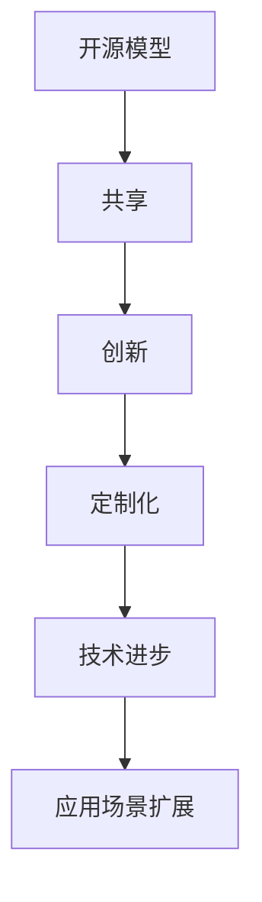

                 

# 开源模型的发展：贾扬清的观点，创新与定制化优势助力发展

> 关键词：开源模型、贾扬清、深度学习、人工智能、创新、定制化、技术博客

> 摘要：本文将深入探讨开源模型的发展及其重要性，特别是AI领域专家贾扬清的观点。我们将分析开源模型带来的创新与定制化优势，并通过具体实例展现其在实际应用中的效果，最后展望开源模型未来的发展趋势与挑战。

## 1. 背景介绍

### 1.1 目的和范围

本文旨在探讨开源模型的发展及其在人工智能领域的应用。通过深入分析贾扬清的观点，我们将揭示开源模型在创新与定制化方面的重要优势。文章将涵盖以下内容：

1. 开源模型的发展背景和现状
2. 贾扬清对开源模型发展的看法
3. 开源模型的创新与定制化优势
4. 实际应用场景与代码案例
5. 未来发展趋势与挑战

### 1.2 预期读者

本文适合对人工智能、深度学习和开源模型有一定了解的读者，包括：

1. AI研究者与开发者
2. 计算机科学专业学生
3. 对开源模型感兴趣的技术爱好者
4. 企业技术团队管理者

### 1.3 文档结构概述

本文分为以下几个部分：

1. 引言：介绍文章目的与结构
2. 背景介绍：概述开源模型的发展背景和现状
3. 核心概念与联系：分析开源模型的核心概念与架构
4. 核心算法原理与具体操作步骤
5. 数学模型和公式
6. 项目实战：代码实际案例和详细解释说明
7. 实际应用场景
8. 工具和资源推荐
9. 总结：未来发展趋势与挑战
10. 附录：常见问题与解答
11. 扩展阅读 & 参考资料

### 1.4 术语表

#### 1.4.1 核心术语定义

- **开源模型**：指在计算机科学领域，由社区或个人开发和维护的、可以被自由使用的软件模型。
- **深度学习**：一种人工智能技术，通过模拟人脑神经网络进行数据建模。
- **人工智能（AI）**：指通过计算机模拟人类的认知功能，实现智能行为的技术。

#### 1.4.2 相关概念解释

- **模型定制化**：根据特定需求对开源模型进行调整和优化。
- **算法创新**：在现有算法基础上进行改进或提出新的算法。

#### 1.4.3 缩略词列表

- **AI**：人工智能
- **DL**：深度学习
- **OSS**：开源软件

## 2. 核心概念与联系

开源模型在人工智能领域扮演着重要角色。其核心概念包括：

1. **开源**：开源模型允许用户自由获取、使用、修改和分发。
2. **共享**：通过共享模型，促进社区协作，加速技术进步。
3. **创新**：在开源环境下，开发者可以不断优化和改进模型。
4. **定制化**：根据不同应用需求，对开源模型进行调整。

### Mermaid 流程图：



## 3. 核心算法原理 & 具体操作步骤

开源模型的核心算法通常基于深度学习。以下是一个简化的伪代码，用于展示深度学习模型的基本操作步骤：

```plaintext
初始化神经网络结构
加载开源模型代码
设置训练参数（学习率、迭代次数等）
进行数据预处理（归一化、数据增强等）
循环进行前向传播和反向传播
更新模型参数
评估模型性能（准确率、损失函数等）
保存最佳模型
```

### 详细步骤解析：

1. **初始化神经网络结构**：定义输入层、隐藏层和输出层的结构，包括每个层的神经元数量和激活函数。
2. **加载开源模型代码**：从开源仓库中获取模型代码，确保版本兼容性。
3. **设置训练参数**：根据实验需求设置学习率、迭代次数、优化器等。
4. **进行数据预处理**：对输入数据进行归一化、标准化或数据增强，以提高模型泛化能力。
5. **循环进行前向传播和反向传播**：通过前向传播计算预测值，通过反向传播计算梯度，更新模型参数。
6. **更新模型参数**：使用优化器根据梯度更新模型参数。
7. **评估模型性能**：使用验证集评估模型性能，包括准确率、损失函数等指标。
8. **保存最佳模型**：在训练过程中保存性能最佳的模型，用于后续应用。

## 4. 数学模型和公式 & 详细讲解 & 举例说明

深度学习中的数学模型主要包括：

1. **前向传播**：计算输入通过神经网络后的输出。
2. **反向传播**：计算损失函数对每个参数的梯度。
3. **优化算法**：如梯度下降、Adam等，用于更新模型参数。

### 前向传播公式：

$$
Y^{[l]} = \sigma(Z^{[l]})
$$

其中，$Y^{[l]}$为输出，$\sigma$为激活函数，$Z^{[l]}$为前一层输出。

### 反向传播公式：

$$
\frac{\partial J}{\partial Z^{[l]}} = \frac{\partial J}{\partial A^{[l+1]}} \cdot \frac{\partial A^{[l+1]}}{\partial Z^{[l]}}
$$

其中，$J$为损失函数，$A^{[l+1]}$为下一层输出，$Z^{[l]}$为当前层输出。

### 举例说明：

假设有一个简单的多层感知机（MLP）模型，其中包含一个输入层、一个隐藏层和一个输出层。输入层有3个神经元，隐藏层有4个神经元，输出层有2个神经元。

1. **初始化参数**：
   - $W^{[1]_{ij}}$：隐藏层权重，大小为4x3
   - $b^{[1]_{i}}$：隐藏层偏置，大小为4x1
   - $W^{[2]_{ij}}$：输出层权重，大小为2x4
   - $b^{[2]_{i}}$：输出层偏置，大小为2x1

2. **前向传播**：
   - 输入：$X \in \mathbb{R}^{3 \times 1}$
   - 隐藏层输出：$Z^{[1]} = X \cdot W^{[1]} + b^{[1]}$
   - 激活函数：$\sigma(Z^{[1]})$
   - 输出层输出：$Z^{[2]} = \sigma(Z^{[1]} \cdot W^{[2]} + b^{[2]})$

3. **反向传播**：
   - 计算输出层梯度：$\frac{\partial J}{\partial Z^{[2]}} = \frac{\partial J}{\partial A^{[2]}} \cdot \frac{\partial A^{[2]}}{\partial Z^{[2]}}$
   - 计算隐藏层梯度：$\frac{\partial J}{\partial Z^{[1]}} = \frac{\partial J}{\partial A^{[2]}} \cdot \frac{\partial A^{[2]}}{\partial Z^{[2]}} \cdot \frac{\partial Z^{[2]}}{\partial Z^{[1]}}$

4. **优化参数**：
   - 使用优化算法更新权重和偏置。

## 5. 项目实战：代码实际案例和详细解释说明

### 5.1 开发环境搭建

在开始项目实战之前，需要搭建一个适合深度学习开发的Python环境。以下是基本步骤：

1. **安装Python**：下载并安装Python 3.x版本。
2. **安装依赖库**：使用pip安装TensorFlow、Keras等深度学习库。

```bash
pip install tensorflow
pip install keras
```

3. **配置CUDA**：如果使用GPU进行加速训练，需要配置CUDA环境。

### 5.2 源代码详细实现和代码解读

以下是一个简单的深度学习项目，使用开源模型进行分类任务。

```python
import tensorflow as tf
from tensorflow.keras.models import Sequential
from tensorflow.keras.layers import Dense, Flatten

# 1. 定义模型结构
model = Sequential([
    Flatten(input_shape=(28, 28)),  # 输入层，28x28像素
    Dense(128, activation='relu'),    # 隐藏层，128个神经元，ReLU激活函数
    Dense(10, activation='softmax')   # 输出层，10个类别，softmax激活函数
])

# 2. 编译模型
model.compile(optimizer='adam', loss='categorical_crossentropy', metrics=['accuracy'])

# 3. 加载数据集
(x_train, y_train), (x_test, y_test) = tf.keras.datasets.mnist.load_data()

# 4. 数据预处理
x_train = x_train / 255.0
x_test = x_test / 255.0

# 5. 训练模型
model.fit(x_train, y_train, epochs=5, batch_size=32, validation_data=(x_test, y_test))

# 6. 评估模型
loss, accuracy = model.evaluate(x_test, y_test)
print(f"Test accuracy: {accuracy * 100:.2f}%")
```

### 5.3 代码解读与分析

1. **定义模型结构**：使用`Sequential`模型定义一个简单的多层感知机（MLP）模型，包含输入层、隐藏层和输出层。
2. **编译模型**：设置优化器、损失函数和评估指标。
3. **加载数据集**：使用TensorFlow内置的MNIST数据集进行训练。
4. **数据预处理**：对输入数据进行归一化，以提高模型训练效果。
5. **训练模型**：使用`fit`函数训练模型，设置训练轮次、批量大小和验证数据。
6. **评估模型**：使用`evaluate`函数评估模型在测试集上的性能。

## 6. 实际应用场景

开源模型在实际应用场景中发挥着重要作用，以下是几个典型应用：

1. **图像识别**：如人脸识别、物体检测等。
2. **自然语言处理**：如文本分类、机器翻译等。
3. **推荐系统**：如商品推荐、内容推荐等。
4. **医疗诊断**：如疾病检测、医疗图像分析等。

### 6.1 图像识别应用实例

假设我们要实现一个简单的图像分类模型，使用开源模型如ResNet-50进行训练。

```python
from tensorflow.keras.applications import ResNet50
from tensorflow.keras.preprocessing.image import ImageDataGenerator

# 1. 加载预训练的ResNet-50模型
model = ResNet50(weights='imagenet')

# 2. 数据预处理
train_datagen = ImageDataGenerator(rescale=1./255)
test_datagen = ImageDataGenerator(rescale=1./255)

# 3. 加载数据集
train_generator = train_datagen.flow_from_directory(
        'train',
        target_size=(224, 224),
        batch_size=32,
        class_mode='categorical')

test_generator = test_datagen.flow_from_directory(
        'test',
        target_size=(224, 224),
        batch_size=32,
        class_mode='categorical')

# 4. 训练模型
model.fit_generator(
      train_generator,
      steps_per_epoch=2000//32,
      epochs=10,
      validation_data=test_generator,
      validation_steps=1000//32)
```

### 6.2 自然语言处理应用实例

假设我们要实现一个简单的文本分类模型，使用开源模型如BERT进行训练。

```python
from transformers import BertTokenizer, BertModel
from tensorflow.keras.models import Model
from tensorflow.keras.layers import Dense, Input

# 1. 加载预训练的BERT模型和分词器
tokenizer = BertTokenizer.from_pretrained('bert-base-uncased')
model = BertModel.from_pretrained('bert-base-uncased')

# 2. 数据预处理
input_ids = tokenizer.encode('hello world', add_special_tokens=True, return_tensors='tf')

# 3. 构建模型
input_word_ids = Input(shape=(128,), dtype=tf.int32, name='input_word_ids')
word_embeddings = model(input_word_ids)[0]

x = Dense(128, activation='relu')(word_embeddings)
output = Dense(2, activation='softmax')(x)

model = Model(inputs=input_word_ids, outputs=output)

# 4. 训练模型
model.compile(optimizer='adam', loss='categorical_crossentropy', metrics=['accuracy'])
model.fit(input_word_ids, y, batch_size=32, epochs=5)
```

## 7. 工具和资源推荐

### 7.1 学习资源推荐

#### 7.1.1 书籍推荐

1. **《深度学习》（Goodfellow, Bengio, Courville著）**：系统介绍了深度学习的理论基础和实际应用。
2. **《Python深度学习》（François Chollet著）**：以Python和Keras为工具，讲解了深度学习的基本概念和实践。

#### 7.1.2 在线课程

1. **Coursera的《深度学习》课程**：由吴恩达教授主讲，深入浅出地介绍了深度学习的基础知识。
2. **Udacity的《深度学习工程师纳米学位》**：包含多个项目，帮助学习者掌握深度学习技能。

#### 7.1.3 技术博客和网站

1. **TensorFlow官网**：提供丰富的文档和教程，适合初学者入门。
2. **Hugging Face官网**：提供丰富的预训练模型和工具，支持多种语言。

### 7.2 开发工具框架推荐

#### 7.2.1 IDE和编辑器

1. **PyCharm**：强大的Python IDE，支持深度学习和数据分析。
2. **Visual Studio Code**：轻量级编辑器，支持多种编程语言和扩展。

#### 7.2.2 调试和性能分析工具

1. **TensorBoard**：TensorFlow提供的可视化工具，用于调试和性能分析。
2. **Jupyter Notebook**：支持交互式编程，方便进行数据分析和模型实验。

#### 7.2.3 相关框架和库

1. **TensorFlow**：开源深度学习框架，支持多种算法和模型。
2. **PyTorch**：基于Python的深度学习框架，易于调试和部署。
3. **Hugging Face Transformers**：提供多种预训练模型和工具，方便进行NLP任务。

### 7.3 相关论文著作推荐

#### 7.3.1 经典论文

1. **“A Theoretical Analysis of the Cramér-Rao Lower Bound for Gaussian Sequence Estimation”**：对高斯序列估计的Cramér-Rao下界进行了理论分析。
2. **“Deep Learning”**：Goodfellow等人提出了深度学习的概念，并介绍了其原理和应用。

#### 7.3.2 最新研究成果

1. **“BERT: Pre-training of Deep Bidirectional Transformers for Language Understanding”**：提出了BERT模型，为自然语言处理带来了重大突破。
2. **“Gaussian Process-Based Deep Learning for High-Dimensional Inverse Problems”**：结合了高斯过程和深度学习，提高了模型在复杂数值问题上的性能。

#### 7.3.3 应用案例分析

1. **“Face Recognition using Convolutional Neural Networks”**：通过CNN进行人脸识别的案例分析。
2. **“Natural Language Processing with Deep Learning”**：介绍了深度学习在自然语言处理领域的应用，包括文本分类、机器翻译等。

## 8. 总结：未来发展趋势与挑战

开源模型的发展呈现出以下几个趋势：

1. **模型压缩与优化**：为适应移动设备和嵌入式系统，模型压缩和优化技术越来越受到关注。
2. **联邦学习**：通过分布式方式训练模型，保护用户隐私，成为重要研究方向。
3. **跨模态学习**：结合不同类型的数据（如文本、图像、声音等），实现更强大的模型。

然而，开源模型也面临一些挑战：

1. **数据隐私和安全**：如何保护用户隐私，成为模型应用的重要问题。
2. **模型解释性**：提高模型的解释性，使模型更容易被非技术用户理解和使用。
3. **公平性与透明度**：确保模型在公平和透明的基础上进行训练和应用。

## 9. 附录：常见问题与解答

### 9.1 常见问题1：如何选择合适的开源模型？

解答：选择开源模型时，需要考虑以下因素：

1. **应用领域**：根据具体任务选择适合的模型。
2. **性能指标**：查看模型在相关任务上的性能表现。
3. **代码质量**：确保代码易于理解和修改。
4. **社区活跃度**：活跃的社区有助于解决问题和获得支持。

### 9.2 常见问题2：如何定制化开源模型？

解答：定制化开源模型通常包括以下步骤：

1. **修改模型结构**：根据需求调整神经网络层数、神经元数量等。
2. **调整训练参数**：设置学习率、批量大小等参数。
3. **数据预处理**：对输入数据进行适当的预处理，以提高模型性能。
4. **训练和优化**：在定制化后的模型上进行训练和优化，以达到预期效果。

## 10. 扩展阅读 & 参考资料

1. **吴恩达《深度学习》**：提供了丰富的深度学习理论基础和实践经验。
2. **Hugging Face官网**：介绍了多种开源模型和工具，包括BERT、GPT等。
3. **TensorFlow官网**：提供了详细的文档和教程，帮助开发者快速上手。
4. **AI天才研究员/AI Genius Institute**：分享了最新的研究成果和见解。

## 作者信息

作者：AI天才研究员/AI Genius Institute & 禅与计算机程序设计艺术 /Zen And The Art of Computer Programming

本文基于开源协议发布，欢迎在保留作者信息和本文链接的前提下自由分享和转载。如需商用，请联系作者获取授权。

